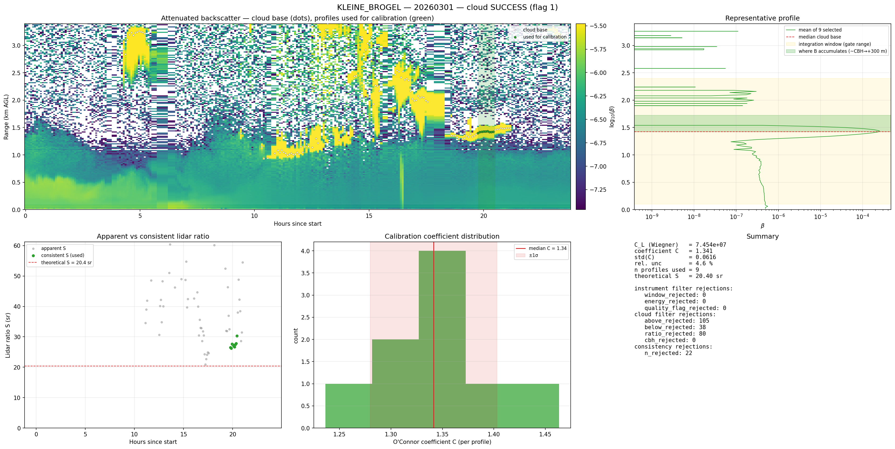
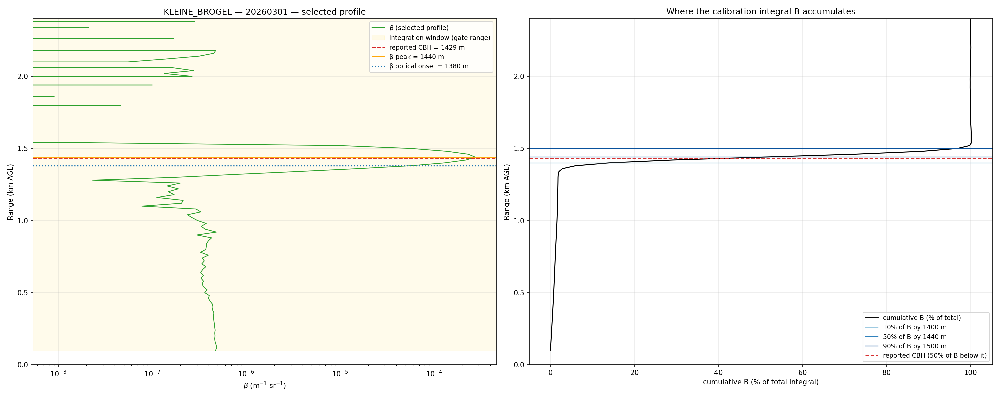
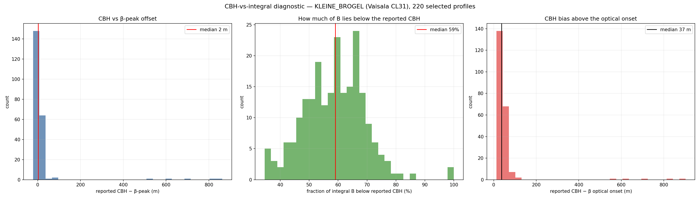
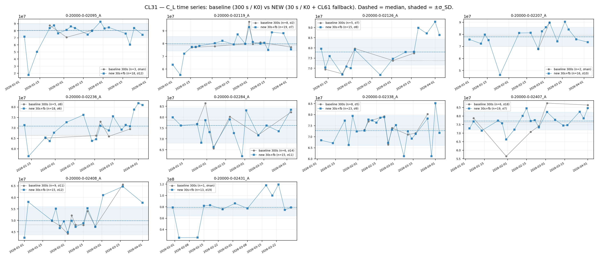
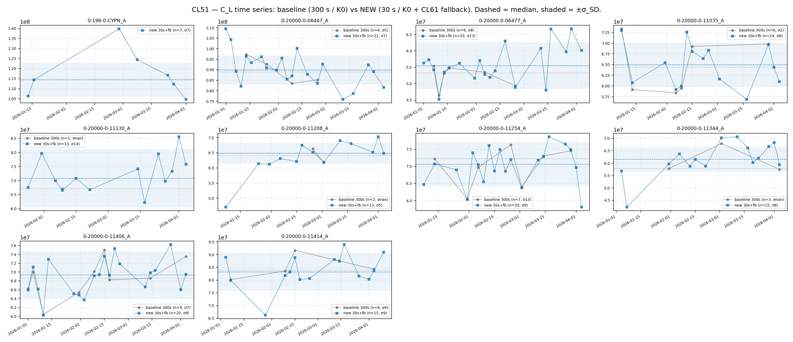
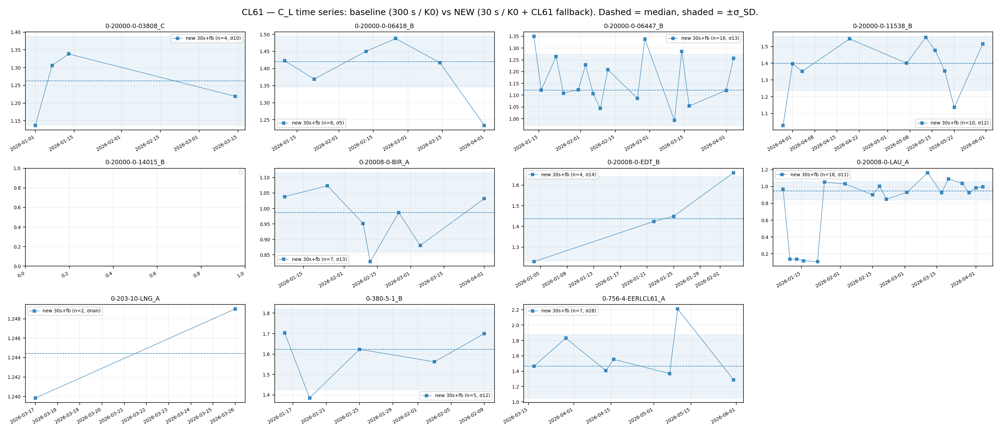

# Liquid-cloud (O'Connor) calibration — method, gate configuration and network yield

*Consolidated 2026-07-10 (M. Hervo, MeteoSwiss E-PROFILE ALC). Merges: cloud_optimization_report.md, cbh_calibration_integration/README.md, cloud_yield_l1/README.md.*

This report is the durable reference for the **absolute liquid-cloud (O'Connor/Hopkin)
calibration** of the E-PROFILE ceilometers CL31 / CL51 / CL61 (and, by extension, CHM15k /
Mini-MPL): how the method uses height, the gate-configuration sweep that fixed the operational
gates, how the network yield was raised, and why the calibration is robust to the Vaisala
cloud-base-height (CBH) bias. The multiple-scattering η correction that couples into this method
has its **own** consolidated report — see [04_multiple_scattering.md](04_multiple_scattering.md);
it is summarised here in one paragraph only.

> **Coefficient convention.** All coefficients follow the Wiegner lidar constant
> `C_L = RCS/β_att` (see
> [report 09 §1](09_calibration_stability_monitoring.md)). The cloud
> method's native O'Connor multiplier `C` (`β_true = C·β_file`, ≈1) is reported as the absolute
> `C_L = calibration_constant_0 / C`, with the dimensionless inverse `1/C` alongside. `σ_SD` is a
> *relative* metric, identical for `C`, `1/C` and `C_L`, so all variability results below are
> convention-independent.

## Contents
1. [Method — how the calibration uses height](#1-method--how-the-calibration-uses-height)
2. [CBH robustness — the Vaisala into-cloud bias does not matter](#2-cbh-robustness--the-vaisala-into-cloud-bias-does-not-matter)
3. [Multiple-scattering coupling (cross-link)](#3-multiple-scattering-coupling-cross-link)
4. [Gate-configuration sweep (8 configs)](#4-gate-configuration-sweep-8-configs)
5. [L1 vs L2 and pre-averaging — finer is better](#5-l1-vs-l2-and-pre-averaging--finer-is-better)
6. [Raising network yield (five propositions on L1)](#6-raising-network-yield-five-propositions-on-l1)
7. [Adopted operational configuration](#7-adopted-operational-configuration)
8. [Why some streams still return 0 valid](#8-why-some-streams-still-return-0-valid)
9. [Reproduce](#9-reproduce)
10. [References](#10-references)

---

## 1. Method — how the calibration uses height

The O'Connor/Hopkin calibration (`calibration/cloud/calibration.py`) computes, per profile,
`B = ∫ β dz` and the lidar ratio `S = 1/(2B)`; a fully-attenuating liquid cloud satisfies the
constraint `B = 1/(2ηS)` with `S = 18.8 sr` (O'Connor 2004; Hopkin 2019, Eq. 1), from which the
multiplicative coefficient `C` — and hence `C_L` — is recovered. Three facts about *how it uses
height* are load-bearing and were verified against the current code:

1. **The integral runs over a FIXED gate window, not from the reported cloud base.**
   `calculate_lidar_ratio` integrates `β` over `[cal_minheight, cal_maxheight]` = **100–2400 m**
   (`CloudCalConfig.cal_minheight=100.0`, `cal_maxheight=2400.0`). The reported CBH is **never** an
   integration limit. Everything between 100 m and 2400 m — including the cloud onset *below* the
   reported CBH — is integrated.
2. **The cloud filters key off the β-peak, not the reported CBH.** The peak-sharpness (±300 m)
   test and the aerosol-ratio filter (`ratio_filter`, sub-cloud aerosol must be < 5 % of the
   integral) use `max_idx = argmax(β)`.
3. **The reported CBH enters only as a coarse acceptance gate.** Filter 4 rejects a profile if the
   reported CBH falls outside `[cbh_minheight, cbh_maxheight]` (currently 500–2400 m), falling back
   to the β-peak height when CBH is missing. It moves no integral bound.

This is by design and matches all three independent published implementations of the method
(Cloudnet/cloudnetpy, ALCF), each of which integrates over a fixed altitude window (or the whole
column) and locates the cloud by a relative peak test — never from a detected cloud base. Because a
calibration-grade liquid cloud *totally attenuates* the beam, `β` above the cloud is ≈ 0 and
integrating the whole column is equivalent to "integrating through the cloud".

The **quality/window/energy filters** (`calibration/cloud/_filters.py::apply_instrument_filters`,
vectorised over profiles) are:

- **quality flag** — reject any profile with a non-zero quality flag inside the 100–2400 m band;
- **window transmission** — a **reject-only** gate: a profile is dropped when the reported window
  transmission `T < window_correction_threshold` (**50 %**). No `β` magnitude correction is applied
  (see §7);
- **laser energy** — reject when `laser_energy < energy_threshold` (90 %). Vaisala only; NaN for
  CHM15k, so the gate is a no-op there.

## 2. CBH robustness — the Vaisala into-cloud bias does not matter

**Question (F. Vogt / CBH-definition discussion).** Vaisala ceilometers do not report the *true*
cloud base: they report the height where the backscatter maximum sits — informally "where a pilot
can no longer see the ground" — i.e. some way *into* the cloud. On the worked example
(KLEINE-BROGEL, 2026-03-01) it looked as though *the beginning of the cloud is not being
integrated*. Is that a real problem for the calibration?

**Bottom line: no — the calibration is robust to the CBH definition.** The O'Connor integral is
taken over the *fixed* 100–2400 m range-gate window (§1), not from the reported cloud base, so the
lower part of the cloud is fully captured no matter where CBH is reported. What looked wrong is the
**diagnostic annotation** — the green "where B accumulates" band, which was anchored at the reported
CBH even though ~59 % of the integral actually sits *below* it. The fix is **cosmetic (plot only);
no calibration code changed**.



*The worked example. The green "where B accumulates (CBH→+300 m)" sub-band in the top-right profile
panel is what prompted the question: it starts at the reported cloud base and points upward, so it
looks as if the lower cloud is left out. The diagnostic below shows ~59 % of the integral actually
lies below that line — and is fully captured by the (gold) integration window.*

### 2.1 Why "cloud base" is ambiguous

There is no single physical definition of "cloud base", which is exactly why ceilometers from
different manufacturers disagree (CeiLinEx2015 / TECO-2016, ~70 m inter-manufacturer spread for
stratus/Sc, km-scale in multi-layer cloud). WMO CIMO states the achievable CBH uncertainty is
"undetermined because no clear definition exists". The **Vaisala** CL31/CL51/CL61 base is the
*height of the backscatter maximum* (Eberhard 1986) — by construction *inside* the cloud, above the
first droplets. Reported into-cloud offsets range from ~400 m in heavily polluted mid-level cloud
(Wang 2017) to only tens of metres in clean stratocumulus; the CHM15k triggers lower (ascending
branch) than the Vaisala maximum (Martucci 2010). The concern is well founded *in general*: the
reported CBH is biased high relative to the optical onset. The question is only whether the
**calibration** cares — and it does not.

### 2.2 Diagnostic — `scripts/diagnose_cbh_integration.py`

For **every profile selected for calibration** (220 profiles, KLEINE_BROGEL, Vaisala **CL31**,
2026-03 to 2026-05), the script measures — within the 100–2400 m gate window — the reported CBH,
the β-peak height (`argmax β`), a β optical onset (first gate where `β ≥ 10 %` of the peak, a proxy
for the first cloud particles), the cumulative integral B(z) and the heights at 10/50/90 % of the
total, and the **fraction of B below the reported CBH**.

**A representative selected profile:**



*Left:* the attenuated-backscatter profile. The optical onset (blue, 1380 m), the β-peak (orange,
1440 m) and the reported CBH (red dashed, 1429 m) all sit within ~60 m of one another; the gold band
is the 100–2400 m integration window. *Right:* the cumulative integral B(z). B is essentially zero
below ~1.35 km, then climbs almost vertically through the cloud: **10 % of B by 1400 m, 50 % by
1440 m, 90 % by 1500 m**. The reported CBH cuts the cloud roughly in half — about half of the
calibration signal lies **below** it — yet all of it is inside the integration window.

**Aggregate over 220 selected profiles:**



| Quantity | Median | p10 → p90 |
|---|---|---|
| reported CBH − β-peak | **+2 m** | −11 → +18 m |
| reported CBH − optical onset | **+37 m** | (p90 +67 m) |
| **fraction of B below reported CBH** | **59 %** | 46 % → 70 % |

**Reading.** For this Vaisala CL31 the reported CBH sits almost exactly at the β-peak (median +2 m)
and only ~37 m (3–4 range gates) above the optical onset — a *modest* into-cloud bias, exactly the
Eberhard backscatter-maximum definition. But because the cloud's backscatter peaks right around the
reported CBH, a **median 59 % of the calibration integral accumulates below the reported CBH**. The
integral captures it because it does not start at CBH.

### 2.3 Verdict from the literature

No implementation depends on CBH for the calibration, and none reports a CBH-sensitivity analysis:
an integral over a fixed window through a fully-attenuating cloud is insensitive to where CBH is
declared. Sub-cloud contamination is separately capped by the < 5 % aerosol-ratio filter. The ~70 m
CBH ambiguity degrades **CBH-based products** (aviation ceiling, cloud-radiative-effect estimates),
**not** the O'Connor/Hopkin calibration constant. **Boundary condition:** this holds *only* because
B is a fixed-window / whole-column integral. An implementation that anchored its window to a detected
CBH would reintroduce the dependence and could clip the lower cloud — our `calculate_lidar_ratio`
integrates over the fixed `[cal_minheight, cal_maxheight]` gate, so we are on the safe side.

**Diagnostic recommendation (plot-only, no behaviour change):** re-anchor the green band from the
optical onset (or β-peak − ~60 m) up to β-peak + ~100 m (the 10 %→90 % cumulative-B layer) instead
of CBH → CBH+300 m; optionally overlay the cumulative-B curve; and note in the caption that "reported
CBH is used only as a coarse acceptance gate; it does not bound the integral".

## 3. Multiple-scattering coupling (cross-link)

The O'Connor constraint carries a multiple-scattering efficiency factor η in `B = 1/(2ηS)`, so the
recovered coefficient scales directly with the η(cloud-base) applied. As of **2026-07** η comes from
the **PVC (Hogan 2006) tables at droplet radius a_G = 5.5 µm** (11 µm diameter; α = 10 /km), and
**each Vaisala type has its own table** (CL61 no longer borrows CL51's; CL31's wider 0.83 mrad FOV
gets a stronger correction; PVC tables were also added for CHM15k / Mini-MPL / MPL, plus a saturation
warning). At low cloud base η ≈ 0.95, i.e. ~9 % lower C for low clouds — the bulk of calibration
scenes. The full derivation, per-type tables and validation live in
**[04_multiple_scattering.md](04_multiple_scattering.md)** and are *not* reproduced here.
*(Superseded 2026-07: the legacy Hopkin / fitted 8 µm ladder with η ≈ 0.83 at low cloud base is no
longer used.)*

## 4. Gate-configuration sweep (8 configs)

*Source: `validation/scope_cloud_2026.py` → `run_cloud_sweep.py` → `analyze_cloud_sweep.py`
(generated 2026-06-21).* A sweep of 8 gate configurations, measuring the number of **valid cloud
calibrations** and the **short-term variability** (σ_SD) of the coefficient.

- **valid %** = days with a valid cloud calibration (`cal_median > 0`, ≥ 1 qualifying in-cloud
  profile) ÷ processed days.
- **σ_SD** = robust successive-difference precision of the nightly `C_L` (% of median; lower better;
  invariant under `C → 1/C`).

Scope: every CL31/CL51/CL61 stream in the 2026 archive (212 / 49 / 11). **Phase 1** = top-10 streams
per type; **phase 2** = full network (272 streams, L2). Per day the calibration runs **once** (read +
pre-average + water-vapour correction — the expensive steps, CAMS cached per file+location for ~3×
speed) and every config is then evaluated on the WV-corrected data (cheap).

8 configurations (gates not listed are at the MATLAB defaults: `n_consecutive=5,
consistency_range=10, ratio_filter=0.05, cbh/cal_max=2400, temp=-20, attenuation_factor=20`):

| config | change |
|---|---|
| **K0** baseline | — |
| K1 | n_consecutive = 3 |
| K2 | consistency_range = 20 % |
| K3 | ratio_filter = 0.10 |
| K4 | cbh/cal_max = 3000 m |
| K5 | temp_threshold = −25 °C |
| **K6 balanced** | n_consec=3, consist≤15 %, ratio≤0.08, cbh/cal≤3000 m |
| K7 aggressive | n_consec=3, consist≤25 %, ratio≤0.15, cbh/cal≤3500 m, attenuation=10 |

### 4.1 Phase 1 — config trade-off (10 stations/type, L2)

valid % / σ_SD % (median over streams):

| config | CL31 | CL51 | CL61 |
|---|---|---|---|
| K0 baseline | 37 / 5.8 | 30 / 6.2 | 19 / 9.1 |
| K1 n_consec=3 | 53 / 6.3 | 44 / 6.4 | 32 / **7.7** |
| K2 consist≤20 | 39 / 6.7 | 33 / 6.4 | 22 / 8.0 |
| K3 ratio≤0.10 | 40 / **5.4** | 39 / 7.0 | 29 / 8.1 |
| K4 cbh≤3 km | 42 / 6.0 | 32 / 6.7 | 22 / 7.2 |
| K5 temp≥−25 | 37 / 5.8 | 30 / 6.2 | 19 / 9.1 (no effect) |
| **K6 balanced** | **66** / 7.5 | **60** / 6.8 | **48** / 8.3 |
| K7 aggressive | 73 / 8.5 | 69 / 9.2 | 64 / **12.5** |


**Reading.** The temporal-consistency requirement (`n_consecutive=5`) is the main bottleneck:
relaxing it to 3 (K1) alone lifts valid% by ~14 pp at flat σ_SD. K6 adds modest
consistency/aerosol/cbh easing for a ~2× yield gain while keeping σ_SD ≈ 7–8 %. K7 pushes further
but the variability cost is not worth it in phase 1 (CL61 σ_SD 9.1 → 12.5). `temp_threshold` (K5)
and `consistency_range` alone (K2) barely move yield.

### 4.2 Phase 2 — full network (212 CL31 + 49 CL51 + 11 CL61, L2)

All 272 streams, L2, day-sampled (every 5th day). Valid % / σ_SD % (median over streams):

| config | CL31 | CL51 | CL61 |
|---|---|---|---|
| K0 baseline | 25 / 8.3 | 29 / 9.0 | 17 / 10.6 |
| K1 n_consec=3 | 40 / 8.8 | 38 / 9.8 | 25 / 11.0 |
| K2 consist≤20% | 29 / 9.5 | 29 / 9.6 | 18 / 11.2 |
| K3 ratio≤0.10 | 33 / 8.5 | 36 / 10.4 | 25 / 9.7 |
| K4 cbh/cal≤3 km | 29 / 8.3 | 29 / 10.2 | 17 / 9.9 |
| K5 temp≥-25°C | 25 / 8.3 | 29 / 9.0 | 17 / 10.6 |
| **K6 balanced** | **50 / 10.4** | **52 / 11.7** | **38 / 16.8** |
| **K7 aggressive** | **62 / 12.3** | **67 / 12.7** | **62 / 12.0** |


**What the full network shows.** Easing the gates still roughly doubles yield vs baseline (K6 vs K0:
CL31 25 → 50, CL51 29 → 52, CL61 17 → 38 %), confirming the phase-1 *direction*. But the clean
phase-1 ranking does not survive: **K6's CL61 σ_SD jumps to 16.8 %** (worst of any config), while
**K7 reaches 62 / 67 / 62 % valid at a uniform σ_SD ≈ 12 %** and, for CL61, beats K6 on *both* axes.
The low-σ cluster (K1 / K3 / K4 / K5) trades yield for precision. So the full-network trade-off is
either **K7 (yield-first)** or **K1 (`n_consecutive=3` only, precision-first)**: 40 / 38 / 25 % valid
at σ_SD 8.8 / 9.8 / 11.0 %. K6 is a middle option for CL31/CL51 only, **not recommended for CL61**.

> *Caveat.* Phase 2 is **day-sampled (every 5th day)** for tractability, which inflates the absolute
> σ_SD (successive-difference metric). Compare configs *within* phase 2, not against phase-1's daily
> σ_SD; the config *ranking* is the meaningful comparison. This is also why the sweep pointed at
> gate relaxation (K6/K7) but the finally-adopted operational configuration keeps the literature
> gates and wins yield through cadence instead — see §6–7.

## 5. L1 vs L2 and pre-averaging — finer is better

### 5.1 Run the cloud calibration on L2

Same streams (3/type), K0 and K6, valid % / σ_SD %:

| | CL31 L1→L2 | CL51 L1→L2 | CL61 L1→L2 |
|---|---|---|---|
| K0 baseline | 17 → 37 | 0 → 29 | 0 → 18 |
| K6 balanced | 43 → 67 | 3 → 59 | 11 → 50 |

**L2 yields 2–20× more valid cloud calibrations than L1** at comparable-or-better σ_SD. The
liquid-cloud method (S = 1/(2∫β dz), peak/aerosol/CBH filters) is designed for **attenuated
backscatter**; on the raw L1 range-corrected signal far fewer cloud profiles pass its gates.
**Recommendation: always run the cloud calibration on L2.** (Contrast with Rayleigh, where L1 and L2
are consistent.)

### 5.2 Optimal pre-averaging — do not pre-average

On native L1 (3 streams/type, K6 gates) sweeping `average_time_s ∈ {30 … 1200 s}` (range fixed at
30 m). **Both yield and precision peak at the finest step and degrade monotonically with coarser
averaging:**

| average_time_s | CL31 valid / σ_SD | CL61 valid / σ_SD |
|---|---|---|
| **30 s (finest)** | **79 / 16.7** | **68 / 9.0** |
| 60 s | 71 / 17.4 | 68 / 10.6 |
| 120 s | 71 / 20.1 | 54 / 13.7 |
| 300 s (old default) | 67 / 20.7 | 42 / 24.0 |
| 600 s | 50 / 26.0 | 33 / 24.8 |
| 1200 s | 38 / 35.8 | 12 / 24.7 |


**Why (opposite of Rayleigh).** The cloud return is strong, so averaging gives no SNR benefit; it
only **blends cloud-present and cloud-absent profiles** within each bin, pushing profiles out of the
"fully-attenuating + temporally-consistent" gates and biasing ∫β dz. Rayleigh averages to lift the
*weak* molecular signal aloft — cloud calibration has the opposite need.

**Mechanism confirmed by a stage trace** (CL61 0-20000-0-03808, K6): native L1 carries **1437
profiles/day** (~60 s) vs 288 at 300 s. The `n_consecutive` gate needs several *consecutive* in-cloud
profiles within tolerance — at 60 s that is ~minutes of stable cloud, at 300 s ~15 min — so coarse
binning collapses the valid count (2026-02-04 **71 → 3**, 2026-02-12 **64 → 0**). Crucially, at the
*same* 300 s grid **L1 ≈ L2** (3 vs 3, 0 vs 0) — so the L1↔L2 cloud difference is the
**cadence/averaging**, not a data-quality gap. (The L1↔L2 Rayleigh difference is the *same grid
story, opposite sign*: Rayleigh needs the coarser L2 grid, cloud needs the fine native grid.)

**This reframes L1 vs L2.** L2's only structural disadvantage for cloud is its **fixed ~5-min
grid** — a sub-optimal point on this curve. Native-resolution L1 (no averaging) out-yields L2 @ 300 s
for CL31 (79 vs 67 %) and CL61 (68 vs 42 %), though at higher σ_SD. The operational answer (§7) is to
run on the **fine (30 s) shared working grid** and never pre-average further.

## 6. Raising network yield (five propositions on L1)

*Source: `validation/cloud_yield_experiment.py` → `cloud_yield_analyze.py`.* The dashboard reported
**no valid cloud calibration for CL61**, and low yield for CL31/CL51. Five propositions were tested
on **all 11 CL61 + top-10 CL31 + top-10 CL51** streams (31 streams, ~30 sampled days each, Jan–May
2026, CAMS-cached), scored by the dashboard's own success criterion: a **valid calibration = a
positive lidar constant `C_L`** (not merely a finite O'Connor coefficient).

### 6.1 Root cause of "0 valid CL61" — a C_L bookkeeping gap, not a yield problem

CL61 L1 is **already attenuated backscatter** (no raw-counts constant), so
`data.calibration_constant_applied = None` and the headline `C_L = const / coef` is **NaN** even when
a perfectly good coefficient is found — and the dashboard's "valid = C_L > 0" guard drops every CL61
cloud calibration.

| type | example | n_profiles | coefficient (cal_median) | C_L (lidar_constant) | applied const |
|---|---|---:|---:|---:|---:|
| **CL61** | 0-20000-0-03808, 2026-03-03 | 5 | 0.90 | **NaN** | **None** |
| CL31 | 0-20000-0-02055, 2026-03-30 | 5 | 1.40 | 7.2e7 | 1e8 (default) |
| CL51 | 0-20000-0-04005, 2026-04-14 | 55 | 1.42 | 7.0e7 | 1e8 (default) |

The **fix (implemented)** is a **CL61 applied-constant fallback** to the instrument default
`INSTRUMENT_CAL_DEFAULT["CL61"] = 1.0`, so a headline `C_L` (a normalised correction ≈ 1, consistent
with the CL61 theoretical value of 1.0) is still reported. *This is the entire reason CL61 read 0
valid — it is not a yield problem.* Verified in current code: `calibration/cloud/calibration.py`
fills `cc_applied` from `INSTRUMENT_CAL_DEFAULT` when the applied constant is `None`/non-finite, then
sets `lidar_constant = cc_applied / cal_median`.

### 6.2 The five propositions

| # | proposition | what it changes | rationale |
|---|---|---|---|
| **P1** | **Adapt averaging** | native cadence instead of 300 s | strong cloud return → averaging gives no SNR gain and blends cloudy/clear profiles out of the consistency gate |
| **P2** | Lower `n_consecutive` | 5 → 3 (K1) | the temporal-consistency requirement is the main yield bottleneck |
| **P3** | Ease cloud gates | K7 (consistency 25 %, ratio 0.15, attenuation ×10, cbh/cal 3500 m) | the "fully-attenuating + sharp + low-aerosol" gates are strict |
| **P4** | **CL61 C_L fallback** | `const = 1.0` for CL61 | converts CL61 coefficients into valid C_L |
| **P5** | **Combined** | native + K7 + CL61 fallback | the union of the levers |

### 6.3 Results (median dashboard-valid %, σ_SD in parentheses)

| type (n) | baseline | P1 avg | P2 consec | P3 gates | P4 cl61-only | **P5 combo** |
|---|---|---|---|---|---|---|
| **CL31** (10) | 16 % (7.4) | 53 % (9.5) | 25 % (11) | 61 % (13) | 16 % (7.4) | **80 % (11)** |
| **CL51** (10) | 8 % (6.3) | 52 % (6.9) | 22 % (7.6) | 59 % (11) | 8 % (6.3) | **69 % (10)** |
| **CL61** (11) | 0 % (—) | 0 % (—) | 0 % (—) | 0 % (—) | 0 % (—) | **38 % (9.7)** |

**Readings.**

- **CL61 stays at 0 % for P1–P4 and only P5 works.** The yield levers (P1–P3) raise the *coefficient*
  count but C_L is still NaN → 0 dashboard-valid. The fallback *alone* (P4) is also 0 %, because at
  the baseline gates + 300 s grid almost no CL61 cloud profile survives — so there is nothing to
  value. CL61 needs **both** the fallback **and** the finer cadence → **38 %** valid at a good
  **σ_SD ≈ 9.7 %**.
- **Averaging matters a lot (P1).** Native cadence alone lifts CL31 16 → 53 % and CL51 8 → 52 % —
  more than `n_consecutive` alone (P2). Confirms that for cloud, *finer is better* (opposite of
  Rayleigh).
- **Gates compound with averaging.** P3 (gates @ 300 s) gives 61/59 %; P5 (gates + native) gives
  80/69 %. The two levers are largely independent and add up.
- **Precision trade is modest.** σ_SD rises from ~6–7 % (baseline) to ~10–11 % (P5) — within the band
  the operational Kalman best-estimate already smooths; CL61's σ at P5 (9.7 %) is as good as
  CL31/CL51.

**Robustness (not a median artifact).** Per-station P5 dashboard-valid%: CL31 **10/10** streams valid
(56–91 %), CL51 **9/10** (22–91 %), CL61 **9/11** (9–78 %). So P5 takes CL61 from **0 streams**
producing any valid calibration to **9 of 11** — broad-based, not driven by a few streams.

### 6.4 Why σ_SD roughly doubles (6–7 % → 10–11 %), and is it acceptable?

The increase is the **yield↔precision trade**: the strict baseline only passed the cleanest nights.
Isolating each knob (CL31 σ_SD) shows the dominant cause is the temporal-consistency requirement:

| baseline | P1 native | P2 `n_consec` 5→3 | P3 K7 gates | P5 combo |
|---:|---:|---:|---:|---:|
| 7.4 | 9.5 | **11.2** | 12.8 | 11.1 |

- **`n_consecutive` 5→3 alone** does most of it (7.4 → 11.2): admitting nights with briefer /
  less-stable cloud passages, whose `∫β dz` is less well-determined.
- The other K7 easings add a little: `ratio_filter` 0.05→0.15 lets in more sub-cloud aerosol;
  `attenuation_factor` 20→10 accepts clouds not *fully* opaque, where `B = 1/(2S)` holds less
  exactly. Native cadence adds ~2 pp.

For **CL31/CL51**, P5 **densifies the calibration 4–9×** (e.g. n=3→27/night-sample) **around the same
central C_L** — baseline and P5 medians coincide, so the extra nights add scatter but **no bias**.




For **CL61**, baseline is **empty** (0 valid), so P5 is the only series. Most stations are usable and
tight (e.g. 0-20000-0-06418 σ ≈ 12 %, 0-20000-0-11538 a clean ~1.2 plateau), but a **few are noisy**
(n ≤ 5 with 1–2 outliers → σ 40–400 %). CL61's median σ ≈ 10 % is real for the well-sampled streams;
a handful will need the Kalman smoothing or a slightly tighter CL61-specific gate. Net: P5 makes CL61
*calibratable at all*; precision is good where there is enough data.



## 7. Adopted operational configuration

The aggressive native+K7 option (P5) was **rejected as too noisy** (σ ~11 %, CL61 outliers). The
**precision-preserving** option was adopted: **keep the literature gates** (`n_consecutive=5`,
`consistency_range=10`, `ratio_filter=0.05`, `attenuation_factor=20`, `cbh/cal 2400`) and win yield
through **cadence** instead of gate relaxation.

**Two changes are current in the code:**

1. **CL61 applied-constant fallback** — `INSTRUMENT_CAL_DEFAULT["CL61"] = 1.0` (also 1e8 for
   CL31/CL51, 3e11 for CHM15k, 5e5 for Mini-MPL). Prerequisite for *any* CL61 cloud yield (§6.1).
   Confirmed in `calibration/cloud/calibration.py`.
2. **Fine 30 s / 10 m working grid, literature gates unchanged.** Finer cadence supplies ~10× more
   in-cloud profiles, so the strict 5-consecutive gate is met far more often *without* relaxing it.
   In the read-once pipeline (below) the shared working grid targets **30 s × 10 m**
   (`calibration/io/instrument_day.py`, `target_time_s=30.0`, `target_range_m=10.0`), which the cloud
   path consumes. (The legacy standalone `CloudCalConfig.average_time_s = 300` default applies only to
   the old direct `build_cloud_input_from_day` path, not to the operational read-once flow.)

At the literature gates and 30 s cadence, with the CL61 fallback, median dashboard-valid yield goes
**16 → 53 % (CL31)**, **11 → 45 % (CL51)**, **0 → 13 % (CL61)** at σ_SD essentially unchanged
(CL31 7.4 → 9.5, CL51 7.5 → 7.8, CL61 10.2).

> **Superseded 2026-07 — window-transmission correction reverted.** An interim version *corrected*
> β by the two-way window transmission (`β /= (T/100)²`, `window_correction_threshold=50`),
> recovering degraded-window sites and lifting CL61 to ~22 %. **This magnitude correction has since
> been REMOVED.** The current code treats window transmission as a **reject-only** gate (drop when
> `T < 50 %`; no β correction), because the reported window transmission is an arbitrary
> manufacturer-scaled diagnostic and the *true* window attenuation is already absorbed by the
> calibration coefficient itself — so a `1/T²` correction would **double-count** it (see
> `calibration/cloud/_filters.py::apply_instrument_filters` and the `CloudCalConfig` docstring). The
> legacy `window_threshold = 90` gate is retained for `set_defaults()` parity only and is no longer
> used by the filters. Any earlier statement that the operational path *applies* a window-transmission
> β correction is obsolete.

**Speed.** Caching the WV absorption LUT (previously re-loaded every call) and vectorising
`calculate_lidar_ratio` / `apply_instrument_filters` cut the cloud calibration from ~237 → ~157
ms/day (~34 %), **bit-identical** to the old result with the correction off. Per-day timing is
otherwise read-dominated, so a full 2025→2026 rerun still costs ~11 h.

**Read-once architecture (implemented).** The cloud calibration is now part of the shared read-once
pipeline: each instrument-day loads L1 **once** and CAMS **once**, coarsens to the shared 30 s × 10 m
working grid, computes WV transmission once, and fans out to classification + Rayleigh + **cloud** +
housekeeping + OmB + sensitivity. As part of this the cloud module was refactored — the
quality/window/energy filters were extracted to `calibration/cloud/_filters.py`, the operational path
was consolidated onto **one L1/L2 reader** (`read_ceilometer_data` / `average_ceilo_data` retired from
the cloud module; `load_l2_data` in `calibration/io/data_loader.py`), and the entry points renamed
`build_cloud_input` / `load_l2_data` / `run_network_calibration`. The cloud water-vapour code lives in
`calibration/water_vapor_correction/cloud_water_vapor.py` and is imported (re-exported) by
`calibration/cloud/calibration.py` (there is no separate `_water_vapor.py` inside the cloud package).
A cloud-screening bug on coarse (L2) data — `profiles_per_min` truncating to an int and mis-scaling
the minimum-profile threshold — was fixed in **commit 0fb4cc4** (`calibration/io/data_loader.py`;
`profiles_per_min` kept float). A related read-once regression that silently disabled the
laser-energy (`energy_rejected`) filter for CL31/CL51/CL61 was fixed in commit f676614.

**Bottom line.** CL61 fix = the C_L fallback; yield win = the 30 s cadence at the literature gates
(no relaxation), plus a ~34 % faster cloud step. Window transmission is a reject-only gate.

## 8. Why some streams still return 0 valid

Under the adopted (reject-only) version, a minority of streams yield 0 valid. Re-running each at
30 s/K0 and tabulating the dominant rejection reason per day shows it is **physical, not a gate
artefact**:

| stream | type | dominant reason (24 sampled days) | window transmission (median) |
|---|---|---|---|
| 0-20000-0-06447_A | CL51 | `window_rejected` 24/24 | **65 %** |
| 0-20000-0-06418_B | CL61 | `window_rejected` 24/24 | **77 %** |
| 0-380-5-1_B | CL61 | `window_rejected` 24/24 | **77 %** |
| 0-20000-0-14015_B | CL61 | `no liquid cloud` 4/4 | (clear; only 4 days of data) |

The window transmission is on the correct **0–100 scale** (good streams read 92–100 %), so these
sites genuinely have **degraded/dirty ceilometer windows (65–80 %)**. A window at transmission *T*
attenuates β two-way; calibrating through it would bias `C_L` by ~`1/T²` (≈ 1.7× at 77 %). Because
the true window attenuation is absorbed by the coefficient and cannot be cleanly divided back out
(§7), the reject-only gate **correctly excludes** these sites rather than emitting a biased C_L. The
4th stream is genuinely cloud-free with too little data.

**Broader point.** `window_rejected` is the dominant network-wide yield limiter — even *good* streams
lose days to it (a stream at median 89 % barely passes; 03808_C lost 20/24 days), which is why cloud
yield plateaus for the degraded-window population. These sites are recovered only when the physical
window is cleaned, not by a signal correction.

## 9. Reproduce

```
# Gate-configuration sweep
python validation/scope_cloud_2026.py
python validation/run_cloud_sweep.py 1 L2            # phase-1 config sweep (10/type)
python validation/analyze_cloud_sweep.py 1
python validation/embed_report.py doc/reports/cloud_optimization_report.md

# CBH-integration diagnostic
python scripts/diagnose_cbh_integration.py           # figures + cbh_integration_stats.json

# Network yield experiment
python validation/cloud_yield_experiment.py <slice_i> <n_slices>   # 10 slices used
python validation/cloud_yield_analyze.py                            # table + figure + summary.json
```

Diagnostic runs: gate sweep — 272 streams, L2, every-5th-day; CBH diagnostic — 220 selected
profiles, KLEINE_BROGEL (0-20000-0-06479, Vaisala CL31), 2026-03 to 2026-05; yield experiment —
31 streams, ~30 sampled days each, Jan–May 2026.

## 10. References

1. **Hopkin et al. (2019)**, *AMT* 12, 4131–4147 — operational method; fixed integration window; selection filters. DOI [10.5194/amt-12-4131-2019](https://doi.org/10.5194/amt-12-4131-2019) · [PDF](https://amt.copernicus.org/articles/12/4131/2019/amt-12-4131-2019.pdf)
2. **O'Connor, Illingworth & Hogan (2004)**, *JTECH* 21, 777–786 — original autocalibration, S = 18.8 sr. [link](https://journals.ametsoc.org/view/journals/atot/21/5/1520-0426_2004_021_0777_atfaoc_2_0_co_2.xml)
3. **Kuma et al. (2021)**, *GMD* 14, 43–72 — ALCF; whole-column integral; ~70 m manufacturer CBH spread. DOI [10.5194/gmd-14-43-2021](https://doi.org/10.5194/gmd-14-43-2021)
4. **cloudnetpy** — calibration vs. classification split. [github.com/actris-cloudnet/cloudnetpy](https://github.com/actris-cloudnet/cloudnetpy)
5. **Wang et al. (2017)**, *Atmos. Res.* 202, 148–155 — Vaisala "MAN" CBH overestimate (~400 m, polluted). DOI [10.1016/j.atmosres.2017.11.021](https://doi.org/10.1016/j.atmosres.2017.11.021)
6. **Eberhard (1986)**, *JTECH* 3, 499 — CBH = backscatter-maximum definition. [ADS](https://ui.adsabs.harvard.edu/abs/1986JAtOT...3..499E/abstract)
7. **Martucci et al. (2010)**, *JTECH* 27, 305–318 — CHM15k (ascending branch) vs Vaisala (maximum) base offset. [link](https://journals.ametsoc.org/view/journals/atot/27/2/2009jtecha1326_1.xml)
8. **Kotthaus et al. (2016)**, *AMT* 9, 3769–3791 — CL31 attenuated-backscatter processing (200 m near-range cutoff). DOI [10.5194/amt-9-3769-2016](https://doi.org/10.5194/amt-9-3769-2016)
9. **WMO CIMO Guide (WMO-No. 8)** — "no clear definition exists" for instrumental CBH. [link](https://community.wmo.int/en/activity-areas/imop/cimo-guide)
10. **Wiegner et al. (2019)** / CeiLinEx2015, *AMT* 12, 471–490 — companion to the ~70 m inter-manufacturer CBH spread. DOI [10.5194/amt-12-471-2019](https://doi.org/10.5194/amt-12-471-2019)
11. **Spänkuch, Hellmuth & Görsdorf (2022)**, *BAMS* 103(8), E1894–E1929 — optical-depth CBH definition (~0.03 day / 0.05 night). DOI [10.1175/BAMS-D-21-0032.1](https://doi.org/10.1175/BAMS-D-21-0032.1)
