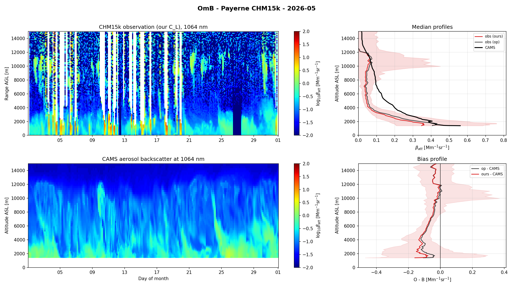
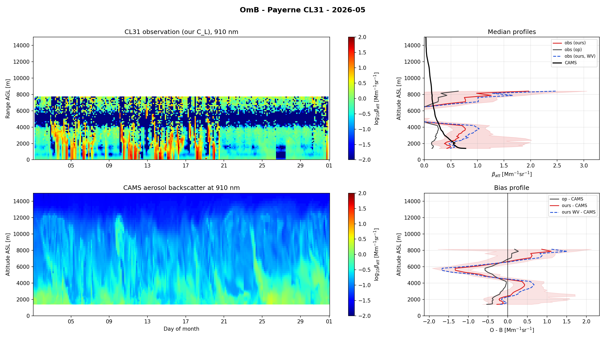
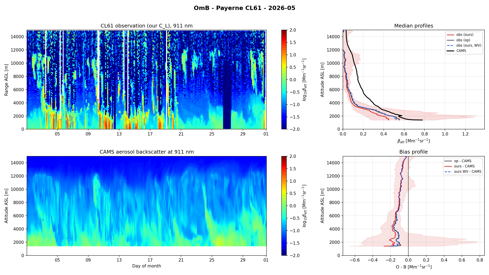

# OmB — Observation-minus-Background against CAMS (Payerne spot-check)

*Consolidated 2026-07-10 (M. Hervo, MeteoSwiss E-PROFILE ALC). Merges: omb_payerne.md.*

Per-station **Observation-minus-Background (OmB)** against the CAMS aerosol forecast,
comparing the **operational L2 calibration constant** against **our Kalman best-estimate
`C_L`** (Wiegner lidar constant, `C_L = RCS / β_att`). This report is the **method + Payerne
spot-check results**; the end-to-end OmB **production runbook** (CSCS/SLURM steps) lives in the
Operations report — see [`10_operations_deployment.md`](10_operations_deployment.md).

Bias is defined as **observation − background**, in Mm⁻¹ sr⁻¹.

## Method

OmB is a Python port of the per-station O−B logic in `E_PROFILE_ALC_Monthly_OB.m`
(`calibration/omb/omb.py`), updated to the E-PROFILE aerosol-processing recommendation
(2026-06). For each instrument-day the calibrated attenuated backscatter is compared to the
modelled CAMS aerosol backscatter through the following chain:

1. **Cloud-screen each native profile** — O−B is a clear-sky comparison. Low-cloud profiles
   (CBH < 1800 m) are dropped; for higher clouds the gates at/above the cloud base (minus a
   500 m guard) are masked. Screening is done **per native L1 profile**, not per aggregated
   bin: at native L1 density (~hundreds of profiles per 3 h bin) almost every bin contains at
   least one low cloud, so the MATLAB whole-bin rule would discard nearly all data; screening
   each profile keeps the clear sub-windows of partly-cloudy bins.
2. **Pre-average to 5 min** — reproducing the operational L2 cadence.
3. **Per-profile SNR screen** — the noise floor σ is a robust `1.4826·MAD` of the
   de-range-corrected signal (`β/r²` ≈ raw signal, `C_L`-invariant) over the top 2000 m of the
   finite gates; gates below `snr_min·σ` (default `snr_min = 3`) are dropped. Because that
   keep-rule is one-sided (it would otherwise admit only the positive noise tail at sub-noise
   altitudes, biasing O−B high), the 2-D (5 min-time × range) keep mask is morphologically
   **opened** so only signal coherent in *both* time and range survives. The screen is
   scale-invariant, so identical gates are kept for every observation source.
4. **Aggregate onto the CAMS grid** — the valid 5 min profiles within ±15 min of each CAMS step
   are averaged onto a coarse 150 m vertical grid.
5. **Water-vapour correction (910 nm)** — the observation is divided by the two-way water-vapour
   transmission, **reusing** `calibration.cloud.calibration.compute_wv_transmission` (the same
   correction as the liquid-cloud calibration; see the cloud-calibration report). The WV
   correction is applied to the *observation*, never to the CAMS aerosol backscatter (a
   modelled, absorption-free quantity).
6. **Interpolate + form the bias** — the observation is interpolated onto the CAMS height grid
   (ASL) and `bias = observation − background`.
7. **Period statistics** — altitudes valid in < 25 % of CAMS steps are dropped before the
   median/RMS.

Several observation *sources* are passed at once (here the operational L2 constant `C_op` and
our Kalman best-estimate `C_L`), all sharing a single CAMS read, one SNR screen, and one
water-vapour correction.

### Wavelength handling

CAMS carries aerosol backscatter at 355 / 532 / 1064 nm (`aerbackscatgnd*`, m⁻¹ sr⁻¹, on the
model levels). The observation is compared to the model at the instrument wavelength:

* **1064 nm (CHM15k)** — `aerbackscatgnd1064` directly (native, no WV correction).
* **532 nm (Mini-MPL)** — `aerbackscatgnd532` directly.
* **910/911 nm (CL31/CL51/CL61)** — **Ångström interpolation** between the 532 and 1064 nm
  anchors:

  ```
  ang  = -log(b532 / b1064) / log(532 / 1064)
  b910 =  b1064 * (910 / 1064) ** (-ang)
  ```

  plus the reused two-way water-vapour correction on the observation.

### CAMS source

OmB uses the **same CAMS as the water-vapour correction**: the operational monthly **0.4°**
archive (`ALC_CAMS_DIR`) with a per-month **1° fallback** (`ALC_CAMS_DIR_FALLBACK`) for months
the 0.4° download has not yet covered — **both are L137 model levels**, so vertical resolution in
the boundary layer is preserved. CAMS resolves per day to that day's monthly file (0.4° first,
then the 1° fallback); both must carry the aerosol-backscatter columns (`aerbackscatgnd*`),
otherwise the day is skipped.

> **CAMS-grid caveat (complex terrain).** On the coarse CAMS grid the nearest point to Payerne
> falls in an **Alpine cell whose surface is ~1400 m ASL**, so the comparison starts **~900 m
> above the Payerne plateau (490 m)**. This is inherent to CAMS resolution over complex terrain
> (as in the MATLAB reference). Because the near-surface — where 910 nm water-vapour absorption is
> largest — is below this floor, the reported WV-correction shift is a **lower bound** on the
> full-column effect.

## Payerne results (2026-05)

Median bias by instrument, in Mm⁻¹ sr⁻¹. `C_L ours` is the Kalman best-estimate; `C_op` is the
operational L2 constant. `bias ours (WV)` is the water-vapour-corrected observation (910 nm
only). 910 nm streams (CL31, CL61) use the Ångström interpolation (532/1064) plus the reused
water-vapour correction; CHM15k (1064 nm) is native.

| Instrument | λ [nm] | median C_L ours | median C_op | bias ours | bias op | bias ours (WV) | RMS ours |
| --- | --- | --- | --- | --- | --- | --- | --- |
| CHM15k | 1064 | 7.267e+11 | 6.240e+11 | -0.0710 | -0.0605 | nan | 1.4814 |
| CL31 | 910 | 3.434e+07 | 1.000e+08 | -0.0474 | -0.2719 | 0.0421 | 4.9019 |
| CL61 | 911 | 1.237e+00 | 1.000e+00 | -0.1150 | -0.1038 | -0.1029 | 1.7010 |

Notes on the table:

* **CL31** shows the clearest gain: our `C_L` (3.43e7) departs sharply from the operational
  default (1.00e8), and the median bias improves from **−0.272** (operational) to **−0.047**
  (ours), with the water-vapour correction moving it to **+0.042** — i.e. the operational
  default constant leaves a large negative OmB that our calibration largely removes.
* **CHM15k** (1064 nm, native) shows small negative biases for both constants (−0.071 vs
  −0.061); no WV correction applies at 1064 nm (`nan`).
* **CL61** biases are close between the two constants (−0.115 ours vs −0.104 op); the WV
  correction shifts ours to −0.103.

## CHM15k (1064 nm)



## CL31 (910 nm)



## CL61 (911 nm)


