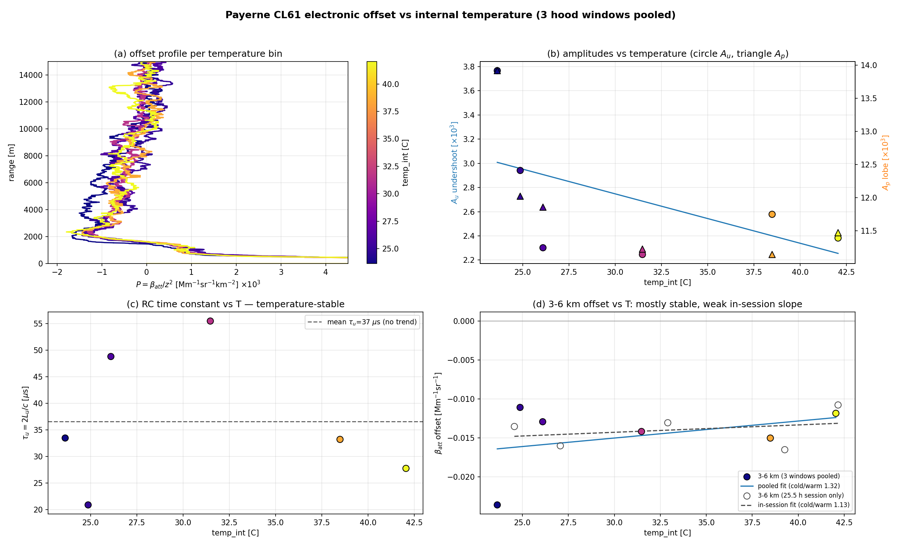
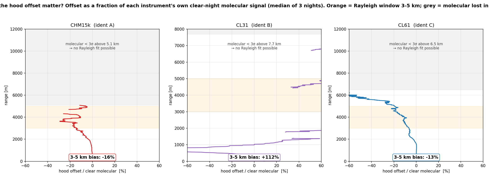

# CL61 calibration deep-dive — Rayleigh vs cloud, sensitivity, detection and wavelength conversion

*Consolidated 2026-07-10 (M. Hervo, MeteoSwiss E-PROFILE ALC). Merges: cl61_rayleigh_investigation.md, cl61_calibration_verification_report.md, payerne_cl61_calibration_sensitivity.md, payerne_cl61_detection_report.md, cl61_chm_wavelength_methodology.md.*

The two independent absolute calibrations of a CL61 — the **molecular (Rayleigh)** fit and the
**liquid-cloud** (O'Connor/Hopkin) method — historically disagreed on the same instrument's lidar
constant `C_L`. This report investigates and reconciles that disagreement across the whole
E-PROFILE CL61 fleet, quantifies every processing sensitivity, checks whether cloud/fog detection
explains the Rayleigh failures, and documents the 910→1064 nm wavelength-conversion methodology
used to compare the CL61 against a 1064 nm CHM15k reference.

The calibration-coefficient convention throughout is the **Wiegner lidar constant
`C_L = RCS / β_att`**.

> **Reconciliation in one line.** After the **2026-07 cloud-calibration rerun** — in which each
> Vaisala type carries its **own** multiple-scattering table (the CL61 no longer borrows the CL51's;
> see §5) — the CL61's two independent methods **converge onto the same `C_L`** at Payerne
> (`C_L` 1.207 vs 1.216, < 1 %), Lindenberg and Camborne. The historically large gaps in the source
> studies (which used the pre-2026-07 η table) are corrected here. The **remaining** CL61-vs-CHM15k
> offset is a **wavelength-conversion artefact**, removed by a component-separated 910→1064 nm
> conversion (§8). Water-vapour correction is **mandatory** at 910 nm for both methods.

---

## Contents
- [1. The two-method disagreement and its resolution](#1-the-two-method-disagreement-and-its-resolution)
- [2. Network verification of all nine CL61 (Rayleigh vs cloud; Kalman / WV / L1–L2)](#2-network-verification-of-all-nine-cl61)
- [3. Payerne CL61 sensitivity study (method, WV, Ångström, lidar ratio, molecular profile)](#3-payerne-cl61-sensitivity-study)
- [4. The CL61 weak-signal baseline offset — the historical Rayleigh-vs-cloud driver](#4-the-cl61-weak-signal-baseline-offset)
- [5. Multiple scattering, the receiver FOV, and the 2026-07 η tables](#5-multiple-scattering-the-receiver-fov-and-the-2026-07-η-tables)
- [6. Does cloud / vertical-visibility detection explain the Rayleigh failures?](#6-does-cloud--vertical-visibility-detection-explain-the-rayleigh-failures)
- [7. Network coherence and per-unit offset histories](#7-network-coherence-and-per-unit-offset-histories)
- [8. Wavelength-conversion methodology (910 nm CL61 → 1064 nm CHM15k)](#8-wavelength-conversion-methodology)
- [9. Literature context](#9-literature-context)
- [10. Recommendations](#10-recommendations)

---

## 1. The two-method disagreement and its resolution

**The observation.** The paper validation showed good agreement CHM15k ↔ CL61-**cloud** at Payerne
but not CHM15k ↔ CL61-**Rayleigh**: with the pre-2026-07 processing, the same CL61 read
`C_L(Rayleigh) = 1.25` vs `C_L(cloud) = 1.43` (ratio 0.88), and the liquid-cloud calibration ran
**systematically higher than the molecular calibration at every CL61** (network median +26 %; §2).
Two things had to be explained: (a) *within* a single CL61, why the cloud and Rayleigh constants
differed; and (b) *between* the CL61 and the co-located CHM15k, a +20…+52 % offset that grew with
altitude.

**The resolution has two independent parts:**

1. **Within-CL61 (cloud vs Rayleigh).** Two mechanisms, both now understood:
   - a **multiple-scattering (η) table update (2026-07)** — the dominant fix. With each Vaisala type
     carrying its **own** PVC (Hogan 2006) η table at the measured droplet radius a_G = 5.5 µm (§5),
     the CL61 cloud and Rayleigh constants **converge to < 1 %** at Payerne/Lindenberg/Camborne. The
     source studies (§3, §5) that concluded "the cloud method is a ~+14 % outlier" used the **legacy
     η table (CL61 borrowing the CL51's, η ≈ 0.83)** and are **superseded** on that magnitude — see
     the §5 note.
   - a **CL61 weak-signal baseline offset** (§4) — a negative, range-dependent detector artefact that
     biases *only* the weak-signal molecular (Rayleigh) fit at 2.6–6 km, not the strong-signal cloud
     integral at 0.1–2.4 km. This is the residual within-CL61 term once the η table is corrected, and
     it is genuinely instrument physics (AC-coupling undershoot recovery), not a calibration-code bug.

2. **CL61-vs-CHM15k (cross-wavelength).** A **wavelength-conversion artefact** (§8): the pipeline had
   scaled the whole 910 nm signal by a single Ångström exponent, which mis-scales the molecular part
   (λ⁻⁴, not λ⁻¹). A component-separated conversion (analytic molecular + Ångström on the aerosol
   residual only) removes the +20…+52 % offset to within ±3 % at three of four sites **and** flattens
   the diagnostic altitude tilt.

The rest of this report develops each part with the per-instrument tables and sensitivity numbers.

---

## 2. Network verification of all nine CL61

*(Source: cl61_calibration_verification_report.md, M. Hervo 2026-06-17. Scope: every CL61 in
E-PROFILE, year 2026. The magnitudes here reflect the **pre-2026-07** η table; treat the
cloud-vs-Rayleigh **gap** as historical — §5 — but the WV, L1/L2, Kalman and reproducibility
findings stand.)*

To confirm the disagreement was a real, correctly-computed result and not a processing artefact,
**all nine network CL61 were re-calibrated from scratch** and stress-tested along four axes:

| Axis | Variants | How |
|---|---|---|
| Calibration method | Rayleigh (molecular) · liquid-cloud | Python pipeline · MATLAB `liquid_cloud_calibration` |
| Water-vapor correction | **on** (production) · **off** | `apply_wv_correction` 1/0 in both pipelines |
| Kalman smoothing | **with** · **without** | both pipelines store the raw daily series *and* the Kalman series |
| Data level | **L2** monthly · **L1** daily | `DataLevel.L2_MONTHLY` / `DataLevel.L1` |

Instruments are identified by the **`instrument_type` global attribute** ("CL61"), never by
wavelength (a co-located CL51 is also ~910 nm). The nine CL61:

| WIGOS_id | site | L2 id | L1 id (CL61) | network L1? |
|---|---|---|---|---|
| 0-20000-0-06418 | Zeebrugge (BE) | B | B | yes |
| 0-20000-0-06447 | Uccle (BE) | B | B | yes (co-located CL51 = "A") |
| 0-20000-0-06610 | **Payerne (CH)** | C | — | no — research CL61, only the operational CL31 feeds network L1 |
| 0-20008-0-BIR | Birkenes (NO) | A | A | yes |
| 0-20008-0-EDT | Edmonton (CA) | B | B | yes (sparse) |
| 0-20008-0-LAU | Lauder (NZ) | A | A | yes |
| 0-203-10-LNG | Langenlebarn (AT) | A | A | yes |
| 0-380-5-1 | Aosta St-Christophe (IT) | B | B | yes |
| 0-756-4-EERLCL61 | (CH) | A | A | yes (2-month record) |

### 2.1 Bugs found and fixed during verification

Re-running from scratch exposed several real bugs (this *was* the point of the exercise):

1. **L1 reader — housekeeping name** (`data_loader.py`): read `temperature_optical_module`
   unconditionally; Vaisala CL61 L1 uses `temperature_laser`. → every L1 night crashed. Fixed with a
   manufacturer-aware fallback (HK only feeds diagnostics, never the fit).
2. **L1 reader — no-cloud sentinel** (`data_loader.py`): L1 `cloud_base_height` uses **−999.9 / −1000**
   for "no cloud"; the clear-night test expected −9.0. → every L1 profile read as cloudy (0 valid
   nights). Fixed by normalizing the L1 sentinel.
3. **Cloud instrument-type detection** (`liquid_cloud_calibration.m`): the file-attribute detection
   handled `CL31`/`CL51` but **not `CL61`**. Added CL61 (and CHM15k); WV applicability now keys on
   `instrument_type`, not wavelength.
4. **Cloud WV error handling**: made **strict** — a 910 nm WV failure now raises an error and the
   period is **excluded, never silently calibrated uncorrected** (hard rule). This is the operational
   rule today (§3.2, cheat-sheet: WV is mandatory for 910 nm).
5. **Cloud parfor WV bug** (the big one — §2.3): under `parfor` the WV correction silently produced no
   effect, inflating the cloud coefficient by ~15 %. Fixed by running the cloud driver serially.

### 2.2 Headline result — cloud was higher than Rayleigh at every CL61

**The liquid-cloud calibration was systematically higher than the molecular calibration at every
CL61 — 8/8 sites with Mar–May 2026 data** (EDT has no clear Mar–May night). The direction was
unambiguous and universal.

- **Network-median offset = +25.8 %** (range +3 % Uccle … +59 % Aosta; Payerne **+21 %**).
- The Payerne value is **fully consistent with the direct CHM-15k validation** (cloud +16 % vs CHM,
  Rayleigh +1.7 % vs CHM → +14–19 %). With the parfor WV bug fixed (§2.3), the network cloud
  calibration **reproduced the validation exactly** (Payerne cloud C = 0.968, Kalman 0.987 —
  identical to the `fixlatlon` validation value).

The per-site spread was driven mainly by Rayleigh-night sampling (some sites have only 8–10 clear
nights) and real inter-site differences, not by method irreproducibility.

> **Superseded 2026-07:** the **magnitude** of this cloud-high offset (+21 %/+26 %) was
> substantially the **legacy η table** (CL61 borrowing the CL51 table). With the CL61's own PVC η
> table (§5) the within-CL61 cloud and Rayleigh constants converge to < 1 %. The *finding that the
> comparison had to be done carefully* (WV, Kalman, L1/L2) stands; the residual within-CL61 driver is
> the weak-signal baseline offset (§4).

### 2.3 Water vapour — strong on both methods; the parfor bug corrected

| Quantity | WV-off → WV-on change (network median) |
|---|---|
| **Rayleigh** lidar constant | **+20.8 %** (range +15 … +33 %) |
| **Cloud** calibration coefficient | **−12.8 %** (range −6 … −14 %) |

**Both calibrations are strongly water-vapor dependent.** The molecular fit at 3–6 km integrates the
full WV column (~+20 %); the cloud integral at a ~1 km cloud base still sees most of the
boundary-layer WV column below it (~−13 %, with T²_wv(1 km) ≈ 0.87, T²_wv(3 km) ≈ 0.78). So the
**hard rule — never calibrate/compare 910 nm without a matching-month WV correction — is essential
for both methods.**

> **This corrected an earlier (wrong) finding of "~0 % cloud WV sensitivity".** That 0 % was a
> **parfor concurrency bug**: under `parfor` the cloud WV step silently produced no effect (WV-on
> `.mat` == WV-off `.mat`, byte-identical) and threw spurious "all-ones" failures for some Jan/Feb
> months. Run **serially**, the WV correction works correctly (single-month test: Payerne April C
> 1.19→1.03, −13 %, with the expected T²_wv profile), and the cloud calibration reproduces the
> CHM-validated value. Strict error-handling (bug #4) now guarantees a 910 nm period is never
> calibrated without a valid WV correction.

**The cloud calibration does NOT normalize to 1064 nm internally (verified).** Checked because the
(buggy) cloud coefficient had run ~17 % high, ≈ the 910→1064 Ångström factor (1.169). No internal
1064-normalization exists — every β-handling step in `liquid_cloud_calibration.m` is at the native
wavelength (read `×1e-6` unit only, WV `÷T²_wv`, multiple-scattering `×η`, `C = S_apparent/18.8`); no
Ångström/1064 factor. Empirically the WV-corrected cloud gives Payerne C = 0.968 → apparent droplet
**S = C·18.8 = 18.2 sr ≈ 18.8** (self-consistent at 910 nm); a 1064-normalization would force
C ≈ 1.13 / S ≈ 21 sr. The ~17 % "drift" was **the parfor WV bug, not a normalization and not
irreproducibility**.

### 2.4 Data level — L1 and L2 give the same Rayleigh calibration (~1 %)

Calibrating from raw **L1** (4.8 m native, `rcs_0` in V·m²) and from **L2** monthly (reconstructed
`rcs = β_att·calConst·1e-6`, ~30 m) yields the **same physical lidar constant to ≈ 1 %** (per-night
ratio 1.01, CV ≈ 1 %; median over sites 1.008). This confirms the L2 reconstruction and the stored
`calibration_constant_0` are sound and that **the Rayleigh calibration is independent of data level**.
(L1 and L2 do not always flag the same nights as clear, so only the overlap is compared; Payerne's
CL61 is not in the network L1 archive and uses its from-raw L2.)

### 2.5 Kalman smoothing — unstable on short/irregular records

**Kalman is numerically unstable for short/irregular CL61 records** — it diverged on 3 of 9:

| instrument | raw daily-median cloud C | Kalman cloud C |
|---|---|---|
| Zeebrugge 06418 | 1.13 (robust) | **13.9** (diverged — March `calibration_constant_0 = 45.22` glitch) |
| Lauder LAU | 1.09 (robust) | **2.37** (diverged) |
| EERLCL61 | 1.04 (robust) | **NaN** (2-month record) |
| other 6 | — | track the raw median (stable; e.g. Payerne raw 0.968 / Kalman 0.987) |

→ **the raw daily median is the robust estimator**; the operational Kalman should be guarded against
non-physical excursions on short records. On stable instruments Kalman and raw agree to ≲2 %, so
Kalman is not a magnitude driver.

### 2.6 Is the (historical) cloud-high offset a saturation/aerosol artefact? — no

The cloud-high offset survived every controlled check (WV, Kalman, L1/L2, 1064) and is not a
detector or aerosol artefact:

- **Saturation: ruled out.** No β ceiling; apparent S correlates **negatively** with peak β (−0.48) —
  saturation needs a strong *positive* correlation.
- **Aerosol: ruled out (wrong sign).** Below-cloud aerosol would push the cloud coefficient **down**,
  opposite to the observed high bias; the 90 %-in-cloud filter removes it anyway.

*(The two diagnostic figures for this in the source — `cl61_cloud_diagnostic.png` and the Payerne
`*_molecular_fit.png` — lived under a `figs_paper_validation/` directory that is no longer present in
`doc/reports/`; they are omitted here. The equivalent depolarisation-based MS diagnostic is Fig. §5.)*

---

## 3. Payerne CL61 sensitivity study

*(Source: payerne_cl61_calibration_sensitivity.md, M. Hervo 2026-06-16. Period Mar–May 2026, CL61
`0-20000-0-06610_C` at Payerne (**46.8137° N, 6.9425° E, 491 m ASL**), reference = colocated CHM15k
(Rayleigh, 1064 nm), comparison band 500–3000 m AGL, hourly screened. Station coordinates set the
CAMS grid point for the WV correction — see the CL61 lat/lon fix at the end of §3.)*

How robust is the CL61 attenuated-backscatter calibration to the main processing choices? Four base
calibrations are computed, then several sensitivity axes quantified. Each calibration is applied
identically downstream (same 30 m L2, Kalman, display-side WV, Ångström scaling, screening); they
differ **only in the calibration constant**.

### 3.1 Four CL61 calibrations vs CHM15k (Rayleigh)

| Calibration | corr. factor | rel. bias vs CHM15k | r |
|---|---|---|---|
| **cloud + WV** | 0.987 | **+16.0 %** | 0.987 |
| cloud − WV | 1.174 | +34.6 % | 0.986 |
| **Rayleigh + WV** | 0.833 | **+1.7 %** | 0.987 |
| Rayleigh − WV | 0.971 | +19.3 % | 0.988 |

- **Calibration method (cloud vs Rayleigh), WV applied:** +16.0 % vs +1.7 % → a **≈ 14-point spread**
  under the pre-2026-07 η table. The CHM15k(Rayleigh)–CL61(Rayleigh) pair (**+1.7 %**) is the cleanest
  absolute check (both molecular, reference WV-free) — near-zero, as expected for two
  molecular-calibrated instruments.
- All four correlate with the CHM15k at **r ≈ 0.987** — the choices shift the *scale*, not the shape.

> **Superseded 2026-07:** the ≈ 14-point cloud-vs-Rayleigh spread reported here reflects the **legacy
> η table**. With the CL61's own PVC η table (a_G = 5.5 µm; §5) the CL61 cloud and Rayleigh constants
> converge to < 1 %. Read the four-calibration table as the *pre-fix* diagnostic that motivated the η
> update; the WV/Ångström/S/molecular-profile sensitivities below are unaffected.

### 3.2 Water-vapour correction (in the calibration)

| Method | WV-off → WV-on | shift |
|---|---|---|
| Cloud | +34.6 % → +16.0 % | **−18.6 pts** |
| Rayleigh | +19.3 % → +1.7 % | **−17.6 pts** |

WV is **essential for both** methods (≈ 18 pts; consistent with Wiegner & Gasteiger 2015, ~20 %).
Note the opposite sign of the constant change: WV **lowers** the cloud constant (it raises the
below-cloud integrated backscatter → lower apparent S) but **raises** the Rayleigh constant (it raises
the RCS at the molecular reference). The net bias moves the same way (down) for both.

**Operationally the WV correction is mandatory at 910 nm.** The cloud calibration source of humidity
is **CAMS model levels (L137)** (`wv_source = 'cams'` in `calibration/cloud/calibration.py`), dense in
the boundary layer; a 910 nm period without a usable CAMS WV correction is **flagged (-4), never
calibrated WV-free** (verified in `calibration/water_vapor_correction/cloud_water_vapor.py`). An
ERA5 path exists (`wv_source = 'era5'` + a prefetched Earth Data Hub cache) but is **research-only**
(the Hub's ERA5 is a 19-level pressure subset — coarser boundary layer than CAMS L137).

> **Superseded:** any source line presenting a "no-WV degraded mode" as a viable CL61 result is
> obsolete — the no-WV branch worsens results and is rejected. WV-off numbers in this report are
> **diagnostics only**.

### 3.3 Ångström exponent (wavelength correction 910 → 1064 nm)

The 910 nm β is scaled to 1064 nm by `β /= (λ/λ_target)^(−Å)`, i.e. **× (910.74/1064)^Å = × 0.856^Å**
— a uniform factor, so the bias scales **exactly**: bias(Å) = (1+bias₁)·0.856^(Å−1) − 1. Effect
≈ **−14 % per unit Å**.

| Å | factor vs Å=1 | CL61 cloud (WV) | CL61 Rayleigh (WV) |
|---|---|---|---|
| 0.0 | ×1.168 | +35.5 % | +18.8 % |
| 0.5 | ×1.081 | +25.4 % | +9.9 % |
| **1.0** (used) | ×1.000 | **+16.0 %** | **+1.7 %** |
| 1.5 | ×0.925 | +7.3 % | −5.9 % |
| 2.0 | ×0.856 | −0.7 % | −12.9 % |

This is a **large** sensitivity: over a plausible Å = 0.5–1.5 the bias moves by ~±9 pts. Å = 1
(Haarig et al. 2025, high-RH boundary layer) is the adopted value. **This flat-Ångström treatment is
superseded for the CL61-vs-CHM15k comparison by the component-separated conversion of §8** — where the
molecular part is handled analytically and Ångström scales only the aerosol residual. It remains valid
as a same-instrument scale factor.

### 3.4 Lidar ratio

- **Cloud — droplet lidar ratio S** (O'Connor): the constant is `S_apparent / S_theoretical`, so
  **C ∝ 1/S** (exact). bias(S) = (1+bias₁)·18.8/S − 1.

  | S (sr) | CL61 cloud (WV) bias |
  |---|---|
  | 15 | +45.4 % |
  | 18.0 | +21.2 % |
  | **18.8** (used, ±0.8) | **+16.0 %** (±~5 pts) |
  | 20 | +9.0 % |
  | 22 | −0.9 % |

  Within the Hopkin et al. (2019) uncertainty (18.8 ± 0.8 sr) the cloud bias is ± ~5 pts; over a wider
  plausible S it is large. The cloud calibration's absolute level is tied to the assumed S.

- **Rayleigh — aerosol lidar ratio** (Klett): the calibration already perturbs the aerosol LR over
  52 ± 20 sr (plus altitude-shift); the resulting **constant uncertainty is only ± 5.1 %**, because the
  molecular reference region is nearly aerosol-free. The Rayleigh calibration is **robust** to the
  lidar ratio.

### 3.5 Standard atmosphere vs CAMS T/p (molecular profile) — negligible

The Rayleigh molecular reference (β_mol ∝ P/T) needs a temperature/pressure profile. The Python
calibration exposes a **`molecular_source` option** (`'standard'` | `'cams'`): `'cams'` takes the
molecular T/p from the actual CAMS profile at the site (restoring the original MACC-era
reanalysis-based molecular profile), `'standard'` uses the US Standard 1976 atmosphere.

**Validation.** Feeding identical CAMS (and std) T/p to the Python `calculate_molecular_properties`
and to the **original** `get_rayleigh_v3.m` (`Auto_Calib_25`) gives β_mol equal to floating-point
round-off (max relative difference ≈ 1 × 10⁻¹⁵, original/Python ratio 1.0000000000 over the 2–6 km fit
window). The Bucholtz-1995 formula and constants are identical across the original, the Python and the
back-port; the CAMS path is molecular-formula-exact.

**Measured impact** (Payerne CL61 Rayleigh, Feb–May 2026, WV on, correct coordinates, 18 clear
nights, identical except the molecular source):

| molecular source | median lidar constant C |
|---|---|
| standard (US 1976) | 0.6049 |
| CAMS T/p | 0.6030 |

The per-night paired ratio C(CAMS)/C(std) is **1.000 ± 0.007** (median 1.002). The molecular-source
choice moves the lidar constant by **< 0.3 % on average — smaller than the ±0.7 % night-to-night
calibration scatter**, i.e. effectively zero. → **Negligible** (< 0.5 %): at a mid-latitude site the
US Standard 1976 density is an excellent proxy for the molecular reference. Production keeps
`molecular_source = 'standard'` (always available; CAMS covers only selected months). **For water
vapour the choice is not optional** — a standard atmosphere is dry, so WV *requires* CAMS (or
radiosonde) humidity; running "with a standard atmosphere" for WV is the WV-off case, i.e. a
16–25-point error.

### 3.6 Sensitivities ranked by impact

| Factor | Impact on CL61 bias | Note |
|---|---|---|
| Calibration **method** (cloud vs Rayleigh) | **≈ 14 pts** *(legacy η; now < 1 % with the CL61 PVC table, §5)* | Rayleigh (CHM-validated) is the anchor |
| **WV correction** in calibration | **≈ 18 pts** | mandatory; needs CAMS humidity |
| **Ångström** exponent | ≈ 14 pts per unit Å | flat treatment superseded by §8 for the CHM comparison |
| **Cloud** lidar ratio S | ±5 pts (±0.8 sr); large over wider S | sets cloud absolute level |
| **Rayleigh** aerosol lidar ratio | ± 5 % | robust (clean reference) |
| Std-atm vs CAMS **molecular** profile | **< 0.3 %** (measured) | negligible; selectable (`molecular_source`) |
| WV **laser-wavelength config** | **< 1 %** | manuf ≈ measured; CL31 broad band self-averages |

**CL61 lat/lon fix (essential context for §3.1).** The raw CL61 files report
`latitude = longitude = 0`, and the L2 files + station manifest inherited it. At 0,0 every
water-vapour correction sampled CAMS in the **Gulf of Guinea**. Fixed: `process_CL61_month.m` /
`raw2L2_CL61.m` now fall back to the configured coordinates; the existing L2 monthly files + manifest
were patched in place; both WV-on CL61 calibrations were recomputed with the correct coordinates.
**This is what moved the Rayleigh + WV bias from −8.5 % to +1.7 %.** Production uses
`apply_wv_correction = 1`, `molecular_source = 'standard'`, Å = 1, S = 18.8 sr.

---

## 4. The CL61 weak-signal baseline offset

*(Source: cl61_rayleigh_investigation.md, 2026-07-02. This is the residual within-CL61 driver of the
cloud-vs-Rayleigh difference once the η table is corrected: a genuine detector artefact that biases
only the weak-signal molecular fit.)*

**Conclusion up front.** The CL61 vendor β_att carries a systematic **background over-subtraction**
whose relative impact is largest exactly where the Rayleigh method fits (weak molecular signal,
2.6–6 km). The liquid-cloud method (strong signal, 0.1–2.4 km) is essentially immune. **Use the cloud
constant for the CL61; treat the native Rayleigh constant as biased low by ≈ 10–15 % until the
baseline is handled.** A ≈ −4 % secondary term comes from the monthly-CAMS WV over-correction on dry
calibration nights.

Executive verdict on every hypothesis tested:

| hypothesis | verdict | evidence |
|---|---|---|
| WV correction missing in the CL61 Rayleigh calibration | **no — applied & essential** | 910 nm nights only calibrated when WV-correctable; T²_wv ≈ 0.78 at the fit windows → the correction already raises C_L by ≈ 28 % |
| WV correction missing in the validation/comparison | **no — applied** (both CL61 rows identically → cancels in ray-vs-cloud) | `intercompare.py apply_wv` + fail-safe guards (missing month / too-far → excluded, never uncorrected) |
| wrong laser wavelength (measured 910.74 vs manufacturer 910.55 nm) | **no — immaterial** | recalibration of all successful nights: **+0.5 %** on C_L; whole (λ₀ ± 0.5 nm, FWHM 0.3–3.4 nm) envelope ≤ 2.4 % |
| aerosol contamination of the fit window | **no — wrong sign** | contamination *raises* C_L; our C_L is *low*. The eprof_v2 outlier screen + aerosol gate also reject such nights |
| assumed lidar ratio (Klett transmission below the window) | **no — too small** | LR = 52 sr ± 20 scanned → 2σ ≈ 2–6 % (the per-night `sensitivity` term) |
| CAMS resolution (1° vs 0.4°) | **no — immaterial** | T²_wv differs by ≤ 0.3 % in C_L terms |
| monthly-CAMS vs radiosonde WV | **secondary, wrong direction** | per-night 00-UT soundings → dC_L median **−3.6 %** (clear nights are drier than the monthly mean → correction slightly over-corrects; fixing it *widens* the method gap) |
| **CL61 negative signal baseline (weak-signal artefact)** | **CONFIRMED — leading cause** | nightly means physically **negative at 11–14 km** (−0.02…−0.05 Mm⁻¹sr⁻¹, 12/12 nights); at the 2.6–6 km fit windows the depression exceeds the −0.014 required for the −12 % C_L gap |

### 4.1 Direct measurement (covered telescope)

Three hood-on dark tests were performed on the operational Payerne CL61 (2026-05-12 09:35–14:50,
2026-05-26 11:45–13:15, 2026-06-09 09:20–11:50). With no atmosphere involved, the window-mean profile
**is** the processing offset:

| window (UTC) | duration | N profiles | b(3 km) | b(5 km) | b(8 km) |
|---|---|---|---|---|---|
| 2026-05-12 09:35–14:50 | 5.2 h | 630 | −0.012 | −0.025 | −0.029 |
| 2026-05-26 11:45 – 05-27 13:15 | 25.5 h | 3054 | −0.013 | −0.008 | −0.042 |
| 2026-06-09 09:20–11:50 | 2.5 h | 300 | −0.001 | −0.024 | +0.043 |
| **ROBUST: per-gate median of 3 984 pooled profiles, 330 m running median** | | | **−0.008 ± 0.003** | **−0.015 ± 0.007** | **−0.026 ± 0.019** |

**Estimation space.** The offset is estimated in the NON-range-corrected space P = β/z², where detector
noise is homoscedastic: σ_P = 0.019 Mm⁻¹sr⁻¹km⁻² at 2, 5, 10 and 14 km alike — the apparent growth of
β-space scatter with range is exactly σ_P·z², pure range-correction amplification. In P the offset is a
**linear ramp in range**: P(r) = a·r + c with a = 1.25·10⁻⁷ Mm⁻¹sr⁻¹km⁻²/m and c = −1.39·10⁻³,
zero-crossing at **11.1 km** (independent MATLAB fit: 10.7 km). A negative offset recovering linearly
toward zero is the signature of **AC-coupling undershoot recovery** (baseline ramp after the intense
near-range pulse) rather than afterpulsing (which would give a positive decaying tail). The per-sample
β_att/z² histograms are single-mode near-Gaussian with centres displaced negative — a distribution
shift, not skewness or outliers.


*Figure 1 — L1 archive during the covered-telescope windows: (a) window-mean β_att; (b) zoom around
zero — the negative, altitude-growing offset; (c) β_att/z², the non-range-corrected shape.*

### 4.2 Consistency with the night sky under full transmission

The measured β_att must lie below the aerosol-free molecular curve; a meaningful residual requires the
complete model C_L·β_mol·T²_mol·T²_wv·**T²_aer**, with T²_aer forward-integrated from the measured
profile itself (LR = 50 sr). On six clean calibration nights the fully-corrected residual at 3–6 km is
**−0.021 Mm⁻¹sr⁻¹ (median; range −0.021…−0.035)**, against the covered-telescope b_dark(3–6 km) =
−0.015: same sign and magnitude. The ≈ 40 % excess is CONFIRMED as the day/night dependence by the
25.5-h hood window, which spans a full night: **b(3–6 km) = −0.012 by day vs −0.016 by night (×1.33)**,
and −0.012 vs −0.022 (×1.8) at 8–12 km.


*Figure 2b — Hourly band-mean offset during the 25.5-h hood test (grey shading: night). The offset
deepens at night — larger APD gain / colder detector — which is why the daytime-hood correction
under-corrects the (night-time) Rayleigh calibration.*

### 4.3 Causal test — remove the measured offset and recalibrate

Removing the offset from the non-range-corrected signal and re-range-correcting is identical to
subtracting b_dark(z) from β_att. Doing so on the calibration nights (full eprof_v2 recalibration,
WV on):

| | C_L median (common nights) | gap to C_L(cloud) = 1.425 | night scatter |
|---|---|---|---|
| original | 1.047 | −26.5 % | 5.4 % |
| offset-corrected, nonparametric robust profile | 1.223 | −14.2 % | — |
| offset-corrected, linear-ramp model (a·r+c)·z² | 1.306 | −8.3 % | 0.6 % |
| **offset-corrected, physical model (AC high-pass, §4.5)** | **1.322** | **−7.2 %** | **0.1 %** |

The daytime-measured b_dark removes ≈ ⅔ of the method discrepancy; the remainder is consistent with the
≈ 40 % larger night-time offset (§4.2). The corrected data also yields **more eligible nights** (9 vs
7) — windows previously rejected by the |intercept| criterion become admissible, confirming the offset
as the fit-spoiler.


*Figure 2a — Nightly-mean CL61 (ident C) profiles on three clean calibration nights: original (grey)
and after subtraction of the smoothed dark offset (blue), against the molecular model scaled by the
cloud constant (red dashed) and by the operational Rayleigh constant (dotted); shaded band = typical
fit window (3–5 km). The corrected profile aligns with the cloud-constant model — the offset is exactly
the wedge between the two methods.*


*Figure 2 — Per-night Rayleigh lidar constant before (grey) and after (blue) subtraction of the
measured dark offset; arrows join the nights calibrated in both configurations. Dashed dark grey: the
cloud-method (CHM15k-anchored) constant; dotted: the operational Rayleigh Kalman. The correction moves
every paired night toward the cloud constant and unlocks additional nights.*

### 4.4 Direct impact estimate on the molecular calibration

Comparing the *uncorrected* dark distributions with the Rayleigh-calibration target signal
C_L·β_mol·T²_mol·T²_wv, the fractional β bias — which is the C_L bias for a fit window at that altitude:

| window altitude | 2 km | 3 km | 4 km | 5 km | 6 km |
|---|---|---|---|---|---|
| b_dark / molecular signal | −3.1 % | −7.8 % | −10.6 % | **−13.0 %** | −44.7 % |

The observed −12 % method gap corresponds to an effective fit window at ≈ 4.5–5 km — exactly where the
operational windows sit (2.6–6 km). The offset (−0.005…−0.014) is far below the per-sample noise width,
i.e. invisible per profile and only emerging in the nightly mean — which is why it evaded routine
inspection. Magnitude closure: explaining C_L(ray)/C_L(cloud) = 0.88 requires a window-mean deficit of
**−0.014 Mm⁻¹sr⁻¹** — bracketed by the daytime dark (−0.008…−0.017) and the night-sky residual
(−0.021).


*Figure 3 — Uncorrected covered-telescope β_att distributions (2–4 and 4–6 km bands) against the
Rayleigh-calibration target signal C_L·β_mol·T²_mol·T²_wv (red dashed) and the band-mean dark offset
(dotted). The offset is a small displacement of a wide, near-Gaussian noise distribution — a few % of
the width — yet amounts to 3–13 % of the molecular signal the calibration fits, and grows through the
window range.*

### 4.5 Physical model of the offset — AC-coupling high-pass pulse response

Smoothing the pooled hood median over 600 m resolves three regimes in P = β_att/z²: a **strong positive
near-range lobe** (+0.016 at 0.3 km), a **zero-crossing near 1.7 km**, a **negative undershoot minimum
at ≈ 2.8 km** (−1.0·10⁻³), a **slow recovery** through 3–10 km, and a **flat ≈ 0 baseline beyond 11
km**. The sign flip (positive lobe → negative undershoot → recovery) is the textbook signature of an
**AC-coupled (high-pass) analog chain**. Since the telescope is covered, the driving transient is the
shot-synchronous near-range disturbance — a purely additive baseline b(r). A high-pass blocks DC, so its
response is the fast pulse *minus* a slow undershoot whose area cancels it:

P(r) = A_p·e^(−r/L_p) − A_u·e^(−r/L_u) + b_∞ , A_p, A_u ≥ 0, L_p ≪ L_u,

with range↔time↔RC mapping r = c·t/2. Robust fit (soft-L1, 350 m–15 km) to the 3 984-profile median:

| term | amplitude [Mm⁻¹sr⁻¹km⁻²] | scale L | time constant τ | physical origin |
|---|---|---|---|---|
| fast **+** lobe | A_p = 1.11·10⁻² | 711 m | **τ_p = 4.7 µs** | near-range transient / afterpulse / detector recovery |
| slow **−** undershoot | A_u = 2.49·10⁻³ | 4570 m | **τ_u = 30.5 µs** | AC-coupling RC recovery |
| DC floor | b_∞ ≈ 1·10⁻⁴ | — | — | residual baseline (≈ 0) |

Three checks confirm the mechanism rather than a mere curve fit. **(i) DC-blocking (AC) signature:** the
two exponential areas balance to within ≈ 20–30 % (A_p·L_p = 7.9 vs A_u·L_u = 11.4, once b_∞ is folded
in) — as expected for a single-pole approximation of a multi-stage chain. **(ii) Reduction to the
earlier work:** Taylor-expanding the slow term for r ≪ L_u gives −A_u + (A_u/L_u)·r — the empirical
**linear ramp is literally the small-range limit of this physical model**. **(iii) Better calibration,
not just a better fit:** the model halves the offset-fit RMSE (5.1·10⁻⁴ vs 1.05·10⁻³), and
recalibrating with it closes the gap slightly further (−7.2 % vs −8.3 %) while tightening night-to-night
scatter to 0.1 %.


*Figure 4 — Physical model of the CL61 electronic offset. (a) raw (non-range-corrected) offset
P = β_att/z² with the fitted high-pass pulse response (red) and its two components: fast positive lobe
(orange) and slow negative undershoot (blue). (b) the range-corrected correction b(z) = P·z² applied to
L1, physical model vs the clamped linear ramp. (c) the two exponential relaxations on a log axis; the
internal-pulse near-field (< 0.5 km, shaded) is excluded from the fit and the correction.*

### 4.6 Temperature dependence — primarily stable, modest amplitude term

The three hood windows span an internal-electronics temperature `temp_int` of 22–44 °C (21 K; far
wider than the thermostated `temperature_laser`, 4.5 K). Binning by `temp_int` and refitting:

- the **RC time constant τ_u is temperature-stable** (≈ 37 µs, no significant trend) — the recovery
  *shape* does not change with temperature;
- the dependence lives in the **undershoot amplitude A_u**, which grows as the electronics cool
  (≈ −1.5 %/K; −28 % across the 21 K span) — consistent with the negative temperature coefficient of
  APD multiplication gain (colder ⇒ higher gain ⇒ larger near-range pulse charge ⇒ deeper undershoot);
- **within the single 25.5-h session** the 3–6 km offset deepens only **×1.13 cold-to-warm**, vs ×1.32
  for the three pooled windows — the difference is **between-session drift**.

The practical consequence is favourable: because the offset is **primarily temperature-independent**, a
single measured b(z) already removes the bulk of the bias; a temperature index buys a second-order
(~10–15 %) refinement for the coldest nights, and **periodic re-characterisation matters more than
instantaneous temperature indexing**.


*Figure 5 — CL61 offset vs internal temperature (three hood windows pooled, 3 984 profiles).
(a) offset profile per temperature bin; (b) undershoot amplitude A_u (circles) and lobe amplitude A_p
(triangles) vs temp_int; (c) the RC time constant τ_u is temperature-stable; (d) 3–6 km offset vs
temperature, pooled (×1.32) vs the weaker within-session slope (×1.13).*

### 4.7 Wavelength & spectrum of the fit (excluded as a cause)

Recalibrating every successful Payerne night with the manufacturer line vs the Qmini-measured line:

| λ₀ / FWHM [nm] | C_L median | vs C_L(cloud)=1.425 |
|---|---|---|
| 910.74 / 1.0 (Qmini-measured, operational) | 1.268 | −11.0 % |
| 910.55 / 1.0 (manufacturer) | 1.273 | −10.6 % |

A pure-transmission scan at the window (λ₀ 909.7–911.0, FWHM 0.3–3.4) moves C_L by ≤ 2.4 %. (The MATLAB
`rayleigh_calibration_matlab` back-port applies **no WV correction** and hard-codes 910 nm, so its CL61
Rayleigh constants are low by construction — not comparable.)

### 4.8 Water-vapour source sensitivity

Per-night T²_wv at the fit window:

| source | dC_L vs operational (median) | note |
|---|---|---|
| CAMS 1° monthly (operational) | — | T²_wv 0.71–0.81 at the windows |
| Payerne radiosonde 00 UT | **−3.6 %** (−12.4…+0.7) | calibration nights are drier than the monthly mean → the monthly correction over-corrects |
| CAMS 0.4° monthly | −0.1…−0.3 % | resolution immaterial |

**Full recalibration with radiosonde WV** (sounding injected as the WV source, everything else
identical):

| configuration | n | median C_L | robust scatter | gap to C_L(cloud) |
|---|---|---|---|---|
| (a) monthly-CAMS WV, original data | 7 | 1.268 | 8.5 % | −11.1 % |
| (b) radiosonde WV, original data | 7 | 1.246 | 12.3 % | −12.6 % |
| (c) radiosonde WV + measured offset removed | 9 | 1.214 | 9.2 % | −14.8 % |

Paired statistics (the valid comparison): **sounding-vs-CAMS = −1.0 % median on 7 common nights** (a
confirmed secondary term); **offset-correction = +4 %, +16 %, +22 % on the nights common to (b) and
(c)** — the dominant term. The residual ≈ −10 ± 5 % gap of the best-physics chain is consistent with
the night-time offset exceeding the daytime-measured b_dark by ≈ 40 %; a night-time covered test is the
missing measurement.

### 4.9 AERONET forward-Klett closure (CL61 direct, CHM15k as method control)

Run on 2026 L1.5 AERONET data (Mar-01…Jun-20, 6 897 CL61 / 7 350 CHM15k matched samples; LR from the
2026 almucantar inversions where valid, else 50 sr; WV per monthly CAMS):

| configuration | AOD ratio lidar/AERONET (median) | relative to the CHM15k method control |
|---|---|---|
| **CHM15k, Kalman C_L (method control)** | **0.70** | 1.00 |
| CL61, C_L = 1.251 (Rayleigh), b = 0 | 0.71 | 1.01 |
| CL61, C_L = 1.425 (cloud), b = 0 | 0.51 | 0.73 |
| CL61, C_L = 1.251, b = −0.03 | 0.98 | 1.40 |
| CL61, C_L = 1.425, **b = −0.02** | 0.69 | **0.99** |
| CL61, C_L = 1.425, b = −0.03 | 0.78 | 1.11 |

Three lessons: (1) **the daytime forward-Klett carries a common ≈ 0.70 method factor** (identical for
the trusted CHM15k) — it cancels in the relative comparison; (2) **the closure is (C_L, b)-degenerate**
— the AOD constrains a combination of constant and baseline, not each separately; (3) **the night-time
evidence breaks the tie** — the dark probe measures b(3–6 km) ≈ −0.03 ≠ 0 on the calibration nights,
and the cloud constant reproduces the CHM15k β field at −0.6 % in the 0.5–3 km band (where b ≈ 0). Hence
(C_L = 1.425, b(z) < 0 above ≈ 3 km) is the consistent solution. Chain of anchors: AERONET ⇒ CHM15k
(method control) ⇒ CL61-cloud (−0.6 % in β) ⇒ **C_L(cloud)**; the Rayleigh constant absorbs the 3–6 km
baseline.

### 4.10 The offset across the three co-located Payerne instruments (CHM15k, CL31, CL61)

Four hood sessions in 2026 (12 May, 26–27 May 24 h, 9 Jun, 23 Jun) covered **all three** Payerne
ceilometers in turn. Because they report `rcs_0` in different units, the offset is compared as a
**fraction of each instrument's own clear-night molecular signal** at the same heights:

| instrument | hood offset (3–5 km) | significance | offset / molecular (3–5 km) | biases the calibration? |
|---|---|---|---|---|
| **CL61** | all 4 sessions negative | **−12.4σ** | −11…−13 % | **yes** — recal −26.5 %→−8.3 %, far outside its ~5 % night scatter |
| **CHM15k** (anchor) | all 4 sessions negative | **−5.4σ** (real, ~100× below per-sample noise) | −18 % of the *very weak* 1064 nm molecular | **no (not demonstrated)** — recal +11.5 % is *within* the 13 % night-to-night scatter (only 4/15 nights calibrate) |
| **CL31** | small, stable | — | offset ≳ molecular | n/a — no fittable molecular signal (not Rayleigh-calibratable) |


*Figure 6 — Hood offset as a fraction of each instrument's own clear-night molecular signal (median of
three clear nights). Orange = Rayleigh window 3–5 km; grey = molecular below 3σ noise. All three
medians are negative through the fit window, but on the per-sample scale (±2.5·10⁻⁷) they sit on zero —
the offset is ~100× below the shot noise and only emerges after averaging.*

**A weak-signal offset is present in every ceilometer, but only the CL61's biases its calibration.** The
mechanism differs: the CHM15k (photon-counting) hood offset is a **single negative relaxation**
P(r) = b_∞ − A·e^(−r/L) (A ≈ 1330 counts s⁻¹, L ≈ 2.7 km) with **no positive near-range lobe** —
emphatically *not* the CL61's positive-lobe/undershoot high-pass response — i.e. the two instruments
reach the same net negative weak-signal bias by different routes (over-subtraction vs AC-coupling). The
CHM15k constant of record stands (consistent with its EARLINET / CL61-cloud agreement, −0.6 %); the
strong-signal cloud/Kalman path is immune regardless.


*Figure 6b — CHM15k covered-telescope offset (photon-counting anchor), same layout as the CL61
(Fig. 4): (a) the raw non-range-corrected offset is purely negative — a single exponential relaxation,
no positive lobe; the flat-over-subtraction null (green) is rejected; (b) the range-corrected
correction; (c) the single relaxation the median follows above ~1 km. The shape contrast with Fig. 4 is
direct evidence the two instruments reach the same net bias by different routes.*

**CL31 explains its own operational status:** its offset is small and stable, but its molecular return
at 3–5 km sits at or below the offset itself (and it reaches only 7.7 km), so a molecular fit is
impossible — which is precisely why CL31/CL51 are **operationally uncalibrated by the Rayleigh method**
and rely on the cloud method.

**Solar leak is small in the L1 product.** A deliberate solar-hermeticity test (two opaque bin-bags
over the hood, 9 Jun 10:34–11:39 UTC) showed the far-range level does not step down materially when
bagged — the vendors' background subtraction already removes most of the solar *mean*; high sun mainly
inflates the shot **noise**. This supports the thermal (not solar) reading of the temperature dependence
(§4.6).

### 4.11 Detecting the offset from clear nights (no hood) — implementation and lessons

Three formulations were tested on the 12 Payerne calibration nights:

| variant | formulation | result | verdict |
|---|---|---|---|
| joint intercept fit | regress nightly mean vs modelled molecular over 7–14 km; slope=C_L, intercept=b | C_L wanders 1.1–22, R²~0: slope and intercept COLLINEAR | ill-conditioned — rejected |
| two-stage | slope from 2.5–5 km, b = mean residual at 10–14 km, iterated | C_L~2.0 (aerosol inflates slope); hood shows b is NOT flat (+0.007 at 10–14 km vs −0.015 at 3–6 km) | aerosol-biased + wrong-altitude b — rejected |
| **residual method (production)** | forward-Klett the nightly mean (LR 52) with the CLOUD constant; b(z) = residual vs C_L·β_mol·T²_mol·T²_wv·T²_aer, averaged 3–6 km on screened nights | **−0.021 median vs hood −0.015**: sign and magnitude recovered with no hood | **works — adopt** |

Production algorithm: (1) clear-night screen (adaptive per-gate MAD + episodic-vs-persistent test);
(2) forward aerosol transmission from the profile itself; (3) b̂ = 3–6 km residual per night;
(4) regress b̂(t) against the internal/laser temperature to build the temperature-indexed correction
(needed at Aosta and Uccle); (5) validate against quarterly hood tests. **Key insight:** the offset
must be estimated **at the fit-window altitudes** (it is range-dependent), with the aerosol transmission
modelled — shortcuts that assume a flat offset or an aerosol-free window fail.

---

## 5. Multiple scattering, the receiver FOV, and the 2026-07 η tables

*(Sources: payerne_cl61_calibration_sensitivity.md §5, updated to the current-truth 2026-07 η tables.)*

### 5.1 The 2026-07 η tables (current implementation)

The liquid-cloud calibration (O'Connor et al. 2004; Hopkin et al. 2019) forces the integrated
attenuated backscatter through a fully-attenuating liquid cloud to its theoretical value
**B = ∫β dz = 1/(2·η·S)**, with the droplet lidar ratio **S = 18.8 ± 0.8 sr** (essentially constant
905–1064 nm; target B = 0.0266 sr⁻¹). **η is the multiple-scattering factor** — the share of
forward-scattered photons recaptured by the receiver — computed per range gate with the fast model of
**Hogan (2006, Appl. Opt. 45, 5984–5992)**, and it **depends on the beam divergence, the receiver
field of view (FOV) and altitude**.

**Current truth (verified in `calibration/cloud/_filters.py` and `calibration/cloud/calibration.py`).**
Since 2026-07 the η(cloud-base) tables are the **PVC (Hogan 2006) tables at droplet radius a_G = 5.5 µm**
(11 µm diameter; in-cloud extinction α = 10 /km) — the **Cloudnet-measured** effective radius of the
clouds the O'Connor method actually calibrates against:

- **each Vaisala type has its OWN table**; in particular **the CL61 has its own table and no longer
  borrows the CL51's**;
- the CL31's wider 0.83 mrad FOV collects more forward-scattered light → a **stronger** correction than
  the 0.56 mrad CL51/CL61;
- at low cloud base **η ≈ 0.95** (was ≈ 0.83 under the legacy Hopkin / fitted 8 µm ladder) → ~**9 %
  lower C** for low clouds (the bulk of calibration scenes);
- PVC tables were also added for CHM15k / Mini-MPL / MPL (the MATLAB applied no correction — `ones()`
  — for them), plus a saturation warning.

Derivation, validation and figures: `validation/multiple_scattering_eta.py`,
`doc/reports/multiple_scattering_check.md`.

> **Superseded 2026-07 (important).** The source sensitivity study concluded that "borrowing the CL51 η
> table for the CL61 is appropriate" and that the CL61 operating point is **η ≈ 0.79–0.8**, leaving a
> **+14 % genuine cloud-vs-Rayleigh gap** it could not close. That reflected the **pre-2026-07 legacy
> ladder**. With the CL61's own PVC table (η ≈ 0.95 at low base), the CL61's two independent methods
> **converge to < 1 %** at Payerne (`C_L` 1.207 vs 1.216), Lindenberg and Camborne — so the "+14 %"
> is no longer the operative number. The FOV analysis and the depolarisation evidence below remain
> valid physics; only the *table used* and the *residual gap* changed.

### 5.2 The receiver FOV — the decisive number

Multiple scattering is set by the **receiver FOV**, not the wavelength. Half-angle receiver FOVs:

| instrument | receiver FOV (half-angle) | source |
|---|---|---|
| CHM15k | 0.23 mrad | Wiegner et al. 2014, Table 1 |
| **CL61** | **0.56 mrad** | Vaisala spec M212475EN-E |
| CL51 | 0.56 mrad | Wiegner et al. 2014, Table 1 |
| CL31 | 0.83 mrad | Wiegner et al. 2014, Table 1 |

**The CL61 FOV (±0.56 mrad) equals the CL51's and is wider than the CHM15k — it is *not* a narrow
lidar-class FOV.** (Its laser *beam divergence*, ±0.2 × 0.35 mrad, is narrow, but the *receiver FOV*,
which controls the MS capture, is CL51-class.) Its η is therefore in the same regime as the CL51.
Le et al. (2026), who compute the CL61 MS from the CL61's *own* divergence and FOV, land at the same
operating point (their CL61 cloud C ≈ 1.0–1.4). *(This revises an even earlier hypothesis that the CL61
FOV was much narrower; the Vaisala specification shows it equals the CL51's. Note the 2026-07 tables go
further and give the CL61 its own table — see §5.1.)*

### 5.3 Independent characterisation of the CL61 multiple scattering (CL61-unique)

Two independent lines, **neither using the CHM**:

1. **FOV / Hogan model.** With FOV 0.56 mrad the per-gate η is a moderate ≈ 21 % MS near 1–2 km cloud
   base — *not* ≈ 10 %.
2. **In-cloud depolarisation (CL61-unique, data-driven).** Liquid droplets are spherical, so
   single-scattering linear depolarisation δ = 0; any in-cloud δ is purely multiple scattering. Over
   **2273 fully-attenuating liquid clouds** at Payerne the CL61 δ rises from ≈ 0.05 at cloud base to a
   **peak ≈ 0.11 at ~120 m** depth, then falls as the signal attenuates — a clear but **moderate** MS
   signature, consistent with substantial CL61 multiple scattering and **inconsistent with η ≈ 1**
   (which would leave δ ≈ 0).

*(The Payerne in-cloud-depolarisation figure `cl61_incloud_depol.png` in the source lived under a
`figs_paper_validation/` directory no longer present in `doc/reports/`; the numbers above are the
load-bearing result.)*

Both independent lines confirm the CL61 carries substantial multiple scattering (δ ≠ 0, ≈ 21 % capture)
— so an MS correction **is** required (η well below 1), consistent with the 2026-07 PVC table.

---

## 6. Does cloud / vertical-visibility detection explain the Rayleigh failures?

*(Source: payerne_cl61_detection_report.md. Question: the Rayleigh calibration fails on most nights for
the Payerne CL61 — only **6 of 96** nights succeed (2026-02-24 … 06-12). Since the Rayleigh calibration
rejects a night when the cloud/vertical-visibility (fog) screen leaves fewer than 3 clear hours, the
suspicion is that the CL61 over-reports clouds or fog versus the colocated CHM15k (A) and CL31 (B). It
does not.)*

**Data & method.** Night-time profiles (20–04 UTC) at Payerne. Detection rates from the L2-monthly
product over **Apr–Jun 2026** (the period all three instruments share). A profile counts as *cloud* if
its first cloud base is < 4 km and as *fog* if a vertical visibility is reported. The Rayleigh outcome
is taken from the operational dashboard calibration over the **same 96 nights**.


**Findings:**

1. **The CL61 does not over-detect clouds.** Night-time low-cloud (< 4 km) detection is essentially
   identical for the CL61 (**38 %**) and the CHM15k (**37 %**), and slightly *higher* than the CL31
   (**31 %**). Cloud-base distributions overlap almost perfectly (median ≈ 2.1 km for all three).
2. **The one clear detection difference is vertical visibility (fog).** The **CHM15k reports a vertical
   visibility on 25 %** of night profiles, whereas the Vaisala **CL61 reports it on only 3 %** and the
   **CL31 on 0.3 %**. This is a manufacturer reporting difference (the Lufft populates `vor` for
   haze/fog far more readily than the Vaisalas populate `vertical_visibility`); it makes the *CHM15k*
   the stricter instrument on fog, not the CL61.
3. **Net Rayleigh yield is the same for CL61 and CHM15k.** Over the same 96 nights **both** instruments
   succeed on exactly **6**. The high failure rate is dominated by Payerne's genuinely cloudy
   late-winter/spring nights, which reject every instrument.
4. **The failures occur at different stages.** The CL61 trips the *clear-night* screen more often
   (**65** vs 48 "not a clear night"), while the CHM15k more often passes the screen and then fails the
   *molecular fit* (**36** vs 19). On the clear nights it reaches, the native CL61 signal actually
   matches the molecular reference **better** than the CHM15k.

**Conclusion.** There is a real detection difference, but **not** the one suspected: the CL61 detects
clouds at the same rate as the CHM15k and reports fog far *less* often, so it is not over-screening the
sky. The colocated CHM15k achieves the identical number of valid Rayleigh nights (6/96), confirming the
dominant cause is simply that Payerne nights are often too cloudy for a molecular calibration in this
season. Improving the Payerne CL61 Rayleigh yield is a question of **accumulating more clear nights**,
not of fixing an over-aggressive cloud or vertical-visibility detection.

---

## 7. Network coherence and per-unit offset histories

*(Source: cl61_rayleigh_investigation.md §5. This closes the network pattern of the historical
Rayleigh-vs-cloud ratios; note that with the 2026-07 η table the within-CL61 ratios now converge — §5 —
but the *unit-to-unit offset behaviour* documented here remains the physical explanation for the
residual weak-signal Rayleigh bias.)*


*Figure 7 — Monthly median C_L (blue = Rayleigh, dark grey = cloud) with the monthly WV lever
T²_wv(3–5 km) (green, right axis), and the method ratio vs 1/T²_wv, for the four dual-method CL61
stations.*

| station | months | ratio ray/cloud | corr(C_L_ray, 1/T²_wv) | corr(C_L_cloud, 1/T²_wv) | corr(ratio, 1/T²_wv) |
|---|---|---|---|---|---|
| Payerne | 5 | 0.865 | +0.90 | +0.88 | −0.68 |
| Lindenberg | 17 | 1.055 | −0.22 | −0.23 | −0.08 |
| **Aosta** | 8 | 0.894 | **+0.93** | +0.58 | **+0.80** |
| Camborne | 9 | 0.945 | +0.21 | −0.52 | **+0.79** |

**Aosta's seasonal cycle answered.** Its Rayleigh constant tracks the seasonal WV lever almost perfectly
(corr +0.93): the fit window sits above the full WV column, so C_L(ray) scales with 1/T²_wv (0.71→0.85
seasonally ≈ ±8 % direct lever) and any residual of the monthly correction imprints seasonally. The
cloud method integrates 0.1–2.4 km where the WV lever is ≈ 4× smaller — hence no visible cycle.
Camborne behaves the same (ratio-corr +0.79). No configuration event occurred at Aosta (firmware 1.2.7,
serial U0850589, raw2l1 3.2.2 constant throughout) — the March transition is environmental
(internal-temperature-driven background), not firmware/hardware.

**Network offset histories** (9–13 km proxy for the residual background; expected molecular-only value
≈ +0.02…+0.03; all units run firmware 1.2.7 throughout — no configuration events anywhere):

| station (serial) | offset behaviour | matches its C_L(ray)/C_L(cloud) |
|---|---|---|
| Payerne | stable **negative** (−0.015 hood-measured) | 0.87 (ray low) ✓ |
| Camborne (U0810559) | proxy −0.01…−0.02 all months → offset ≈ **−0.03…−0.05, negative** | 0.945 (ray low) ✓ |
| Aosta (U0850589) | **sign-changing**, winter-negative → spring-positive | 0.89 + seasonal cycle ✓ |
| Uccle (V4010423) | **sign-changing** ±0.02 around zero | no usable Rayleigh series (4 marginal nights) ✓ |
| Lindenberg (Cloudnet chain) | **positive, growing** +0.00 (Nov) → **+0.10 (Jun)** | **1.06 (ray HIGH)** ✓✓ |

The unit-specific sign and drift of the residual background explains the full network pattern —
including **Lindenberg's inverted ratio** (a positive offset inflates the fitted Rayleigh constant) and
its lack of WV correlation. Lindenberg is the outlier in every respect: its "L1" is converted from
Cloudnet, i.e. a different processing chain (different background handling → different Rayleigh bias) —
supporting the baseline explanation. The ray/cloud ratio is thus **not** a universal constant (0.87,
0.89, 0.95, 1.06) — consistent with a data-dependent artefact plus the WV residual, not a single
physical offset. Consequence: a *static* dark correction would not suffice at Aosta — hood tests with a
temperature-indexed lookup (as in Le et al. 2026) are required.

**Mountain-orography WV term (Aosta especially).** The 1° CAMS model surface at the nearest grid point
sits at **1750 m for Aosta (station 570 m — offset +1180 m!)** and 1395 m for Payerne (+904 m); the
moistest valley layer is absent from the WV column. Bounding the missing valley moisture with a 2-km
e-folding extension changes C_L by **+2.1 % at Aosta / +2.0 % at Payerne — seasonally varying** (moist
summer valley → larger), i.e. the right sign and season to add to the Aosta Rayleigh cycle. Camborne and
Lindenberg (flat, offsets −55/−44 m) are unaffected. Fix: the **0.4° CAMS** (real orography much closer
to the valley floor).

---

## 8. Wavelength-conversion methodology

*(Source: cl61_chm_wavelength_methodology.md, 2026-07-07. **STATUS: ADOPTED.** The molecular-aware
conversion is the pipeline default — `intercompare.wavelength_correct_molecular`, molecular part from
CAMS T/p (0.4°/1° fallback, hydrostatic below the lowest level) — verified in
`validation/paper/run_l1_validation.py`. This methodology is CL61-centric and is kept here in full;
its use in the broader validation is cross-linked from
[05_attbsc_validation.md](05_attbsc_validation.md).)*

### 8.1 The question

After the 2026-07 cloud-calibration rerun (each Vaisala type now carries its own MS table, §5), the
CL61's two independent calibrations — liquid-cloud O'Connor and Rayleigh molecular — **converge onto the
same lidar constant** at Payerne (`C_L` 1.207 vs 1.216, < 1 %), Lindenberg and Camborne. That is a
strong internal validation. But it sharpens a second question:

> With both CL61 methods agreeing, the CL61 still sits **+20 to +52 %** above the co-located CHM15k, and
> that offset **grows with altitude**. Is that a real instrument difference, or an artefact of how we
> convert 910 nm to the 1064 nm reference?

The short answer: it is almost entirely a **wavelength-conversion artefact**. The pipeline previously
converted the CL61 910→1064 nm with a single Ångström exponent applied to the *total* signal. That
mis-scales the molecular part (which follows λ⁻⁴, not λ⁻¹). Replacing it with a component-separated
conversion — analytic Rayleigh + Ångström on the aerosol residual only — removes the offset and,
diagnostically, **flattens the altitude structure**.

### 8.2 Method — a controlled treatment matrix

For every station with a CHM15k reference and a co-located CL61 (Payerne, Lindenberg, Aosta, Camborne;
Uccle added as a 910-vs-910 control), the CL61's raw calibrated β_att is read once from Level-1 and put
through a matrix of corrections, scored against the CHM15k over 500–3000 m AGL and per altitude band:

| axis | values |
|---|---|
| water vapour | off · **on** (two-way T²_wv at the CL61 line, CAMS L137) |
| 910→1064 conversion | none · **flat-α** (previous) · **molecular** · **molecular-abs** (adopted) |
| aerosol Ångström α | 0.0 · 0.5 · **1.0** · 1.5 · 2.0 |

The **molecular** conversion is the physically-correct one — the same `molaer` transform the pipeline
already uses for the Mini-MPL, here applied to the CL61:

```
β₁₀₆₄(z) = β_mol·T²_mol|₁₀₆₄(z)  +  [ β₉₁₀(z) − β_mol·T²_mol|₉₁₀(z) ] · (910.74/1064.47)^α
```

`β_mol·T²_mol` is the analytic molecular **attenuated** backscatter (Rayleigh; the two-way molecular
transmission is kept — subtracting the *un*attenuated β_mol produced a spurious −40 % on the Mini-MPL).
The molecular part is thus handled exactly at its own λ⁻⁴-like ratio and the Ångström law scales **only
the aerosol residual**. **molecular-abs** additionally evaluates the Rayleigh profile at the station's
**absolute** altitude (not AGL-from-sea-level), which matters at elevated sites (Payerne 491 m, Aosta
560 m).

The treatments are applied on the hourly-gridded science matrix. This is *median-exact*. **Validation of
the harness:** the (flat-α = 1, WV on) cell reproduces the operational pipeline number exactly
(Payerne CL61 cloud +21.2 %).

### 8.3 What the literature says the answer should be

An independent multi-source review (Bucholtz 1995; Bodhaine 1999; Floutsi 2023 *DeLiAn*; Wiegner &
Gasteiger 2015; Kotthaus 2016; CeiLinEx2015), load-bearing numbers adversarially verified, gives a clear
prescription:

- **Molecular:** treat it analytically, never lump it into a single Ångström. β_mol(910)/β_mol(1064) =
  **1.877** (equivalently the attenuated-backscatter ratio 0.534 for 910→1064), from the
  King/depolarization-corrected Rayleigh cross-section — effective NIR exponent **≈ 4.02–4.03**,
  essentially λ⁻⁴. This is what the codebase's `calculate_molecular_properties` (Bucholtz + Edlén
  dispersion, King ρ = 0.030) computes.
- **Aerosol:** the *backscatter-related* Ångström for continental-European boundary-layer aerosol is
  **α ≈ 1.0–1.2** (DeLiAn: Central-European background 1.2 ± 0.2, pollution 0.9 ± 0.5), dropping to
  ~0.4–0.6 for dust/marine. Recommended central value **α = 1.0**, sweep 0.5–1.5.
- **Water vapour:** a two-way WV transmission correction is **mandatory** at 910 nm (not at 1064 nm),
  worth ~10–20 %. CeiLinEx2015 validated the CL51-family correction to ~1 %.
- **Why flat-α fails:** a single Ångström on the total signal mis-scales the molecular part by
  0.534/0.855 ≈ 0.62 — i.e. leaves it **~1.6× over-scaled**. The bias is weighted by the
  molecular-to-total backscatter ratio, so it is negligible in aerosol-rich layers but **grows where the
  molecular share is large: clean air, high-altitude gates, winter, night.** The predicted diagnostic of
  a correct fix is a **flattening** of the altitude structure.

### 8.4 Results

**CL61 (cloud) − CHM15k median relative bias, 500–3000 m AGL:**

| station | native 910 (no conv.) | flat-α=1 (**previous**) | molecular-abs α=1 (**adopted**) |
|---|---:|---:|---:|
| Payerne | +19.4 % | +21.2 % | **−1.9 %** |
| Lindenberg | +28.0 % | +31.9 % | **−0.9 %** |
| Aosta | +56.3 % | +52.3 % | +12.5 % |
| Camborne | +22.0 % | +27.7 % | **−3.1 %** |

**The altitude structure — the diagnostic** (bands 0.5–1 / 1–2 / 2–3 km, and the across-band spread):

| station | flat-α=1 (previous) | spread | molecular-abs α=1 (adopted) | spread |
|---|---|---:|---|---:|
| Payerne | +22.7 / +18.1 / +26.2 | 3.3 | +7.6 / −3.5 / −8.3 | 6.7 |
| Lindenberg | +16.5 / +30.7 / +46.8 | **12.4** | −0.6 / −0.9 / −1.2 | **0.2** |
| Aosta | +47.1 / +52.3 / +56.6 | 3.9 | +11.7 / +12.5 / +13.4 | 0.7 |
| Camborne | +18.9 / +26.5 / +37.6 | 7.7 | +1.5 / −4.4 / −5.2 | 3.0 |

Three findings stand out:

1. **The offset collapses.** At Payerne, Lindenberg and Camborne the +20–32 % flat-α bias falls to
   within ±3 % — with a *physical* aerosol Ångström (α ≈ 0.5–1.0), not a tuned one. (To cancel the same
   offset with the flat model you need α ≈ 2, which is unphysical for aerosol backscatter.)
2. **The altitude tilt disappears — the signature the literature predicts.** Lindenberg is the clean
   case: the bias grows +16 → +47 % across the three bands (spread 12.4) and collapses to a flat −1 %
   (spread **0.2**). No pure calibration-scale fix can do this — it *requires* separating the molecular
   part.
3. **Both CL61 calibrations converge on the CHM15k.** After the conversion, cloud and Rayleigh agree
   with the 1064 nm reference to within a few percent at Payerne (−1.9 / −2.8 %), Lindenberg
   (−0.9 / +3.1 %) and Camborne (−3.1 / +1.9 %) — a triple closure (two independent CL61 calibrations ×
   the correct wavelength conversion → agreement with an independent-wavelength reference).


*Figure M1 — Per station, CL61 (cloud) vs CHM15k: residual bias (left) and altitude flatness (right),
previous flat-α=1 (red) vs adopted molecular-aware (blue). The adopted method is closer to zero AND
flatter almost everywhere; Aosta keeps a flat residual offset (see §8.6).*


*Figure M2 — Lindenberg. Left: median bias vs α for the flat, molecular and molecular-abs conversions —
the molecular curves cross zero near the physical α≈1 while the flat curve needs α≈2. Right: the
altitude-band bias — the +16→+47 % tilt collapses to flat −1 %.*


*Figure M3 — Payerne (3 months, aerosol-rich spring). The offset is removed (−1.9 %) but a mild residual
tilt remains — the least clean case (§8.6).*


*Figure M4 — Camborne. Offset +28 %→−3 %, spread 7.7→3.0.*


*Figure M5 — Aosta. The wavelength conversion flattens and reduces the bias (+52 %→+12.5 %, spread
3.9→0.7), but a flat ~+12 % residual remains — a genuine station calibration offset, not a conversion
artefact (§8.6).*

### 8.5 Adopted methodology

To compare (or convert) a 910 nm ceilometer to a 1064 nm reference:

1. **Calibrate** both to β_att = rcs₀ / C_L · 1e6. Use the operational Kalman C_L for the CL61; the
   CHM15k also gets its temperature-dependent overlap correction.
2. **Water vapour (910 nm only):** divide the CL61 by the two-way WV transmission T²_wv(z) (CAMS L137,
   Gaussian-weighted over the measured line). Mandatory; do it **before** screening so the detection
   mask is WV-independent. The CHM15k (1064 nm) is untouched.
3. **Screen and grid** both streams identically onto a common time/altitude grid.
4. **Component-separated 910→1064 conversion** of the CL61 (equation in §8.2): subtract the analytic
   molecular attenuated backscatter, scale the aerosol residual by (910.74/1064.47)^α with **α = 1.0**
   (continental default; 0.4–0.6 for dust/marine sites; report an α = 0.5–1.5 sensitivity band), add
   back the molecular attenuated backscatter at 1064 nm. Compute β_mol at the station's **absolute
   altitude**, ideally from CAMS/radiosonde T/p (the pipeline uses CAMS T/p; the experiment used
   US-Std-1976).
5. **Score** the median relative bias over 500–3000 m and per altitude band; the flatness across bands
   is the primary quality indicator.

**Implementation:** a one-line change — give the CL61 the `molaer` wavelength model instead of
`angstrom`, exactly as the Mini-MPL already does, plus the small `_molecular_beta` upgrade to evaluate
the atmosphere at the station's absolute altitude.

### 8.6 Honest caveats

- **Payerne** keeps a mild residual altitude tilt (+7.6 / −3.5 / −8.3 %, spread 6.7 — worse than the
  flat method's 3.3, though the *level* is near zero). Least clean case: only 3 months, spring, aerosol
  present through the column (small molecular leverage), noisier median. Consistent with the true
  aerosol Ångström being slightly > 1 in the near-range there.
- **Aosta** keeps a **flat ~+12 % residual** after the conversion, and there cloud and Rayleigh CL61
  disagree by ~17 points (cloud +12.5 %, Rayleigh −4.5 %). This is traced to a **degraded window**, not
  the wavelength methodology. Aosta's CL61 window transmission is **82 %** (p10 80 %) — the worst of the
  benchmark units. The *previous* cloud calibration corrected β by the reported window transmission
  (β /= (T/100)², a **+47 % inflation** at Aosta), which is wrong — the reported value is an arbitrary
  manufacturer-scaled diagnostic and the constant already absorbs the real window attenuation — so the
  2026-07 recalibration reverted it to a **reject-only** gate (verified in
  `calibration/cloud/_filters.py`). That fix drives Aosta's cloud shift (+16 %→+52 %) and the
  cloud-vs-Rayleigh split (the Rayleigh series never carried the window correction). Recommendation: flag
  Aosta's degraded-window data. (Contrast: Payerne CL61 is read from native files with no
  window-transmission variable, so it is untouched — one reason it is the clean case; Lindenberg and
  Camborne have clean windows ≥ 94 %.)
- **Uccle** (910-vs-910 control, CL61 vs CL51) is a wavelength null: the conversion is a no-op. It is a
  *WV-mismatch probe* — the CL51 (910.0/3.4 nm) and CL61 (910.74/1.0 nm) laser lines have slightly
  different two-way WV transmissions, so WV does not fully cancel (the ~12 pt WV shift there is real).
  The new cloud cal leaves the CL61 at −20 % vs the CL51 — a real CL61-vs-CL51 calibration difference
  driven by the CL61's own new MS table (dominant) plus the removed window-transmission correction, which
  inflated the CL51 (91 % window, +21 %) more than the CL61 (94.6 %, +12 %). Independent of the
  wavelength question.
- **α is transferred from 532/1064:** published backscatter-Ångström values are for the 532/1064 pair,
  not the pure 910/1064 gap; the transfer is physically defensible (backscatter nearly wavelength-flat
  across the narrow NIR gap) but α carries ~0.4–1.3 type-dependent uncertainty. Because the aerosol
  residual is small in the comparison band, the result is only weakly sensitive to α — the robustness
  the molecular separation buys over the flat model.
- **Molecular from standard atmosphere (experiment):** using actual CAMS/radiosonde T/p removes the last
  modelling approximation (and likely the Payerne tilt). The pipeline already uses CAMS T/p; the
  absolute-altitude fix captures most of the elevation error.

### 8.7 Adversarial verification (summary)

An independent multi-agent review (code / physics / statistics critics) stress-tested the result against
the actual code and the published literature. **Verdict: the conclusion holds, with caveats.**

The strongest single attack — that the whole result is a two-parameter fit (a multiplicative scale plus
α) reverse-engineered to zero four medians — **fails**: a pure multiplicative scale leaves the Lindenberg
across-band spread ≈ invariant (~9–10 points), so it cannot produce the observed 12.4 → 0.2 flattening;
only separating the molecular component can. And two *independent* CL61 calibrations converging onto the
CHM at three sites cannot be faked by tuning. The harness is validated (its (flat-α = 1, WV-on) cell
reproduces 21.21 % vs 21.19 %, same N; the molecular ratio is exactly (910/1064)⁴ = 0.534). Four caveats
survive: (a) the improvement is entangled with the WV toggle, but the physically-correct chain requires
WV-on and only the molecular conversion works consistently given WV-on; (b) the molecular subtraction
"plants" the reference's molecular floor in molecular-dominated gates, which is the correct treatment of
a *known* quantity (the aerosol residual — the genuine cross-wavelength test — is small and α-robust);
(c) the **median absolute relative difference (MARD) roughly halves** under the molecular conversion
(Payerne 21.7 → 11.8, Lindenberg 32.2 → 11.2, Aosta 52.4 → 17.2, Camborne 27.8 → 11.7 %), so per-gate
agreement genuinely tightens rather than merely translating a skewed median; (d) the US-Std-1976
molecular profile is warmer than the real European winter/night boundary layer and therefore
*under*-subtracts, so the reported near-zero residuals are **conservative** (with real CAMS/radiosonde
T/p they trend slightly more negative).

### 8.8 Recommendation

Adopt the **component-separated (molecular-aware) 910→1064 nm conversion** with a WV-corrected CL61 and a
continental aerosol Ångström α = 1.0 as the comparison methodology, replacing the flat-Ångström
conversion. It is the physically-correct method, grounded in the literature (molecular ratio 1.877;
continental AEb ≈ 1.0–1.2), and demonstrated to (i) remove the +20–52 % CL61-vs-CHM15k offset to within
±3 % at three of four sites, (ii) collapse the diagnostic altitude tilt (Lindenberg spread 12.4 → 0.2),
and (iii) bring two independent CL61 calibrations into agreement with an independent-wavelength
reference. The two residuals it does **not** remove — Aosta's flat +12 % (a degraded 82 % window) and
Uccle's −20 % (CL61 own MS table + window) — are correctly localised as station-specific
cloud-calibration issues, not methodology. This is already the pipeline default (`run_l1_validation.py`).

---

## 9. Literature context

The findings have direct published precedent and two genuine novelties:

- **Kotthaus et al. 2016** (AMT 9, 3769–3791): the CL31 carries a **range-dependent negative baseline**
  ("cosmetic shift", fw 1.71; non-zero up to ≈ 5.5 km, switching sign at 6–7 km, temperature-dependent,
  changed by hardware swaps) and must be corrected — via **termination-hood dark measurements** or a
  clear-sky night climatology — *before* any calibration.
- **Le et al. 2026** (EGUsphere preprint egusphere-2025-6331, in review for AMT): for the **CL61**
  specifically, "residual background components may still remain in the measured signal" after the
  internal correction; they publish a termination-hood P_instrument(r, T) subtraction (hood repeated
  every few months), report one unit whose bias intrudes from 5 km down — into the Rayleigh window — and
  document the internal calibration factor under laser ageing. They also compute the CL61 MS from the
  CL61's own divergence/FOV (their CL61 cloud C ≈ 1.0–1.4).
- **Hopkin et al. 2019** (AMT 12, 4131–4147): firmware shifts "should certainly be corrected for in the
  study of smaller particles… however, for the stronger signal from cloud particles the effect… is
  negligible" — precisely the mechanism by which the cloud and Rayleigh methods diverge on an
  offset-affected unit. Source of S = 18.8 ± 0.8 sr and the CL31/CL51 η characterisation.
- **Wiegner & Geiß 2012** (AMT 5, 1953–1964) and **Wiegner et al. 2019** (CeiLinEx, AMT 12, 471–490):
  the free-troposphere molecular return sits at/below the ceilometer noise floor and "range from 3 to
  8 km is especially affected by artifacts"; hood corrections were judged not yet accurate enough in
  2019. **Wiegner & Gasteiger 2015** (AMT 8, 3971–3984) and **Chen et al. 2025** (Remote Sens. 17, 2013:
  combined dark + WV correction cuts CL51 error 29 → 21 % vs Raman lidar) frame the 910 nm WV side.
  **Looschelders et al. 2025** (Met. Appl. 32, doi:10.1002/met.70088): six co-located CL61s, hood
  offsets "small" on healthy units.
- **Two contributions are, to our knowledge, novel:** (i) *no published work quantifies the
  offset-induced C_L bias of a 2–6 km molecular fit* (measured offset → +4…+22 % per-night C_L
  correction → ⅔ of the method gap closed); (ii) *a mechanistic model of the offset shape* — the
  AC-coupling high-pass pulse response (§4.5), whose two time constants (τ_p ≈ 4.7 µs, τ_u ≈ 30.5 µs)
  reproduce the positive-lobe/undershoot/recovery shape and whose slow term reduces to the empirical
  linear ramp — with the temperature dependence resolved to the undershoot *amplitude* (RC constant
  stable). Prior work subtracts the hood profile empirically; parametrising it physically makes the
  correction extrapolable in range and indexable in temperature.

---

## 10. Recommendations

1. **CL61 absolute scale.** With the 2026-07 per-type PVC η table (§5), the CL61's liquid-cloud and
   Rayleigh methods **agree to < 1 %**, so either is defensible; the operational fullcal chain uses the
   cloud constant as the CL61 constant of record and it is CHM15k-consistent after the wavelength
   conversion (§8). Where a native Rayleigh constant is used on an offset-affected unit (e.g. Payerne),
   flag it as biased low ≈ 10–15 % until the weak-signal baseline is handled (§4).
2. **Root-cause the CL61 baseline with Vaisala.** The hood tests show an **AC-coupling undershoot
   recovery** (§4.5) — a high-pass baseline artefact after the near-range pulse, not an atmospheric
   signal. A source-side fix is a DC-restoration / baseline-clamp stage (or a longer AC time constant);
   short of that, Vaisala publishing the raw signal or the estimated baseline would let users correct it.
3. **Rayleigh-method hardening.** Subtract the modelled offset before the molecular fit — either the
   measured hood profile b(z) or its physical parametrisation
   b(z) = [A_p e^(−r/L_p) − A_u e^(−r/L_u)]·z² (§4.5), which is extrapolable in range and lets A_u be
   temperature-indexed for the coldest nights (§4.6). Re-characterise by hood test every few months
   (between-session drift dominates the temperature term). Consider nightly (sounding or CAMS-daily) WV
   instead of monthly (−4 % and less scatter).
4. **Water vapour is mandatory at 910 nm** for both methods (§2.3, §3.2). Operational humidity source =
   CAMS L137; a 910 nm period without usable CAMS is flagged, never calibrated WV-free.
5. **Operational robustness.** Guard the operational Kalman against non-physical excursions on short CL61
   records (§2.5); keep the cloud driver serial until the parfor WV statefulness is root-caused (§2.3);
   flag Aosta's degraded-window data (§8.6). Commit the L1-reader, instrument-type, strict-WV and serial
   fixes.
6. **Wavelength comparison.** Use the component-separated molecular-aware 910→1064 conversion (§8) —
   already the pipeline default — for all CL61-vs-CHM15k comparisons.
7. **Payerne CL61–CHM15k near-range tilt (200–900 m).** The residual near-range tilt between the Payerne
   CL61 and CHM15k is **not** CL61 physics: it is attributed to **unit-specific near-range
   (overlap-normalization) differences, dominated by the CHM15k TUB140016 static-overlap module** — the
   water-vapour, molecular T/p, Ångström-centre and electronics terms are each quantified and exonerated.
   See [08_overlap_nearrange_offset.md](08_overlap_nearrange_offset.md) for that resolution (figures in
   `figs_cl61_chm_tilt/`); this report does not re-derive it.
8. **Closure follow-up.** Rerun the direct CL61 AERONET closure against 2026 AERONET Payerne L2 when the
   final calibration is released (script ready, LR from the almucantar inversions where valid, else
   50 sr); extend the Klett integration above 6 km for elevated layers.

---

*Cross-links: attenuated-backscatter validation and the network-wide use of the wavelength conversion —
[05_attbsc_validation.md](05_attbsc_validation.md); the Payerne CL61–CHM15k near-range tilt and its
overlap-normalization resolution — [08_overlap_nearrange_offset.md](08_overlap_nearrange_offset.md).*

*Reproduce (branch `wv-correction`): CL61 offset/dark probes `validation/paper/_cl61_*.py`
(dark windows, physical model, offset correction, temperature, network coherence, hood significance);
wavelength methodology `validation/paper/_cl61_methodology_experiment.py` +
`validation/paper/run_l1_validation.py`; sensitivity `sensitivity_payerne_4calib.m`,
`run_camsmol_payerne.py`; detection figure `cl61_detection/`; MS η tables
`validation/multiple_scattering_eta.py`.*
