# Overlap, near-range tilt and electronic-offset correction

*Consolidated 2026-07-10 (M. Hervo, MeteoSwiss E-PROFILE ALC). Merges: overlap_from_clearsky_noise.md,
cl61_chm_nearrange_tilt_payerne.md, cl61_chm15k_offset_correction.md, network_offset_coefficients.md,
dark_measurement_payerne.md, ambient_noise_report_20260529-30.md.*

This report brings together the near-range instrument characterisation for E-PROFILE ALC: how the
**applied (firmware) overlap** can be recovered hood-free from clear-sky night noise, the **resolution
of the Payerne CL61–CHM15k near-range tilt**, the **electronic-offset / dark characterisation** of the
Vaisala and Lufft ceilometers (single-site + network coefficients), and the **ambient-noise / detection-
threshold** methodology that underpins all of the above. The unifying physical thread is that in the
range-normalised view `P = rcs_0/z²` the detector noise is homoscedastic and any signal-independent
electronic term (offset, overlap amplification) is separable from the signal-dependent shot and
turbulence terms — the same principle drives the overlap retrieval, the dark-offset models, and the
noise floor.

The calibration-coefficient convention throughout is the **Wiegner lidar constant** `C_L = RCS/β_att`.

## Contents

1. [Overlap reconstruction from clear-sky night noise (hood-free)](#1-overlap-reconstruction-from-clear-sky-night-noise-hood-free)
2. [The Payerne CL61–CHM15k near-range tilt — investigation and resolution](#2-the-payerne-cl61chm15k-near-range-tilt--investigation-and-resolution)
3. [Electronic-offset / dark characterisation — single-site and network](#3-electronic-offset--dark-characterisation--single-site-and-network)
4. [Ambient (no-hood) noise and detection thresholds](#4-ambient-no-hood-noise-and-detection-thresholds)
5. [Dark-measurement reproduction on operational L1](#5-dark-measurement-reproduction-on-operational-l1)
6. [Cross-cutting take-aways](#6-cross-cutting-take-aways)

---

# 1. Overlap reconstruction from clear-sky night noise (hood-free)

**CHM15k / Lufft-Jenoptik ceilometers · Payerne + 4 network stations · 2025–2026.**

The temperature-dependent overlap model (Hervo et al. 2016) only corrects the *temperature* part of the
near-range overlap; it cannot see a **static** error in the onboard overlap function the firmware already
divided by. To get that static overlap **without a hood / obturated measurement**, we recover it from the
**noise of routine clear-sky night profiles**. The firmware outputs `rcs_0 = raw · z²/O_applied(z)`, so in
the range-normalised view `P = rcs_0/z²` the **electronic (detector) noise is amplified by 1/O_applied** —
exactly as under a hood. The only obstacle is that a clear-sky profile also contains **shot noise**
(∝ √signal) and **turbulence** (∝ signal), which a hood does not. Because the electronic noise is the
**only signal-independent** component, a per-gate regression of the white-noise variance against the mean
signal isolates it as the intercept.

Validated at Payerne against a contemporaneous hood measurement, the retrieval reproduces the applied
overlap to **1–4 %** over 150–1500 m (2.0 % median, 500–1500 m). Applied blind to four more network CHM15k
it matches the **manufacturer `.cfg` overlap** to **0.7 % (Eriswil), 3.2 % (Western Canada), 4.2 % (Kleine
Scheidegg), 5.7 % (Melpitz)**. This gives a hood-free, on-demand overlap check for any CHM15k in the
network, and independently confirms the root cause of the Payerne CHM/CL61 near-range tilt (§2): the
model's **generic short reference** (TUB120011, complete by ~750 m) under-corrects instruments whose true
overlap only completes near ~1500 m.

## 1.1 Principle — the electronic noise carries the overlap

Under a hood only detector noise is present, homoscedastic in raw counts; after the firmware's
`× z²/O_applied` it becomes, in the `P = rcs_0/z²` view,

```
    σ_elec_P(z) = σ_elec_raw / O_applied(z)              (signal-INDEPENDENT)
```

so `O_applied(z) = σ_elec_raw / σ_elec_P(z)`, normalised to 1 where the overlap is complete. On a clear-sky
night the same 1/O amplification applies, but two extra white/coloured terms appear:

```
    shot        σ_shot_P²(z)  ∝ P(z)                     (∝ signal   — Poisson)
    turbulence  σ_turb_P²(z)  ∝ P(z)²                    (∝ signal²  — δβ/β ≈ const eddies)
```

Both scale **with the signal**; only the electronic term does not. Hence, at a fixed gate `z`, fitting

```
    σ_white²(z) = β(z) + α(z)·P + γ(z)·P²
```

to many (mean-signal `P`, white-variance) samples returns the electronic variance as the **intercept**
`β(z)` (shot → α, turbulence → γ), and `O_applied(z) ∝ 1/√β(z)`. The white variance itself is measured from
**lag-1 successive profile differences** (which cancel the slowly-varying atmosphere), robustly via the MAD.


*(a) On clear nights the **electronic** noise (√β, red) dominates the total white noise above ~250 m; shot
(blue) and turbulence (green) are ~10× smaller — which is why even the crude estimators below work.
(b) The measured electronic noise √β follows `1/O_capot` across the whole profile: the electronic noise
**is** the overlap, read off the fluctuations.*

## 1.2 Three estimators (mutual cross-check)

| method | idea | bias |
|---|---|---|
| **M1** clean-night floor | median `σ_white` over the cleanest third of bins per gate; `O ∝ 1/σ_white` | reads a few % low (residual shot/turb) |
| **M2** regression intercept | NNLS quadratic `β+αP+γP²` per gate → `O ∝ 1/√β` | **principled** — removes shot & turbulence |
| **M3** min-statistics | 10th-percentile of `σ_white` per gate as the electronic floor | reads a few % low |

M2 is the primary estimator; M1 and M3 bracket it from below (they do not extrapolate to zero signal).
Agreement of the three is the internal consistency check.

## 1.3 Validation at Payerne against a hood measurement

Twenty clear Payerne nights (00–06 UTC, cloud-free below 6 km, 120-min white-noise bins, 334 bins total)
reconstruct the TUB140016 overlap and match the contemporaneous **hood** retrieval:


| height | M1 | **M2** | M3 | **hood (truth)** |
|---|---|---|---|---|
| 300 m | 0.32 | **0.34** | 0.30 | **0.355** |
| 600 m | 0.66 | **0.73** | 0.65 | **0.730** |
| 900 m | 0.84 | **0.87** | 0.82 | **0.876** |
| 1200 m | 0.91 | **0.94** | 0.91 | **0.941** |

M2 tracks the hood to **1–4 %** everywhere from 150 to 1500 m (median 2.0 %, 500–1500 m). Panel (c) makes
the mechanism concrete: at 300 m the turbulence term lifts `σ²` steeply above the electronic floor β; at
1000 m it is nearly flat (electronic dominates). The **generic reference** used by the temperature model
(grey dotted, panel a) sits far above the true overlap in the near range — it is the wrong overlap, not a
wrong temperature correction.

## 1.4 Parametric fit — a single sigmoid is wrong; use a two-inflection model

A single logistic fits the overlap **poorly** (RMSE 0.057) because the overlap is **not** a single sigmoid:
it has a steep near-range rise **and** a second, gentler bend ("knee") on the approach to 1. This is exactly
how the **manufacturer itself parametrises it** — the Jenoptik `.cfg` metadata lists an `inflection point`
**and** a `second inflection point` (plus `slope`, `scaling`, `trans`, an `etalon` base file, and a `fit`
window): a **two-inflection** curve, not one sigmoid.

A **double-logistic** (two logistic transitions, inflections at `z1`, `z2`) halves the error and captures
the knee:

```
    O(z) = a·σ((z−z1)/s1) + (1−a)·σ((z−z2)/s2)              σ = logistic
    Payerne TUB140016 :  z1=303 m, s1=58 m,  z2=745 m, s2=204 m, a=0.58   RMSE 0.024   (single: 0.057)
```


*(a) the double-logistic (red) hugs the data where the single sigmoid (blue) and even Richards miss — at the
~300 m knee and through the mid-range. (b) the slope `dO/dz` has **two peaks** (two inflections) that a
single sigmoid (one peak) structurally cannot reproduce. (c) the **same** two-inflection model fits the
factory Eriswil `.cfg` to RMSE **0.013** (vs 0.046 for a single sigmoid), and with near-identical parameters
(z1≈284 m, z2≈638 m) — confirming this is the manufacturer's functional form.*

**How the manufacturer builds the overlap (from the `.cfg` metadata).** The factory does not store a
sigmoid; it stores the overlap array plus the fit that produced it: an **etalon** (reference-instrument)
overlap is adapted to the unit by matching the measured near-range signal — a line `fit` over a window, its
`slope`, the `inflection point` and `second inflection point` of the rise, and amplitude factors
`scaling`/`trans`. Operationally this is the **same idea as the overlap-probe** (fit the clean-air
log-signal, overlap = signal/fit), anchored to an etalon and summarised by two inflection points. Our noise
retrieval recovers the *result* of that construction directly, and the two-inflection model is the right
parametric summary of it (use the retrieved curve itself for correction; the double-logistic as the smooth
parametric form).

### Reproducing the factory curves exactly — sum of K logistic transitions

The double-logistic is good but not perfect, and it is **monotone** — so it cannot render the factory curves
that **overshoot** above 1 (Melpitz to 1.15, TUB140106 to 1.34) before relaxing back to 1. A single
**unified** model does: a **sum of K logistic transitions, one of which may be negative** (the negative
component is exactly the overshoot relaxation):

```
    O(z) = Σ_{k=1..K}  a_k / (1 + e^{-(z−z_k)/s_k})           O(∞) = Σ a_k ≈ 1
```

With **K = 3** it reproduces every manufacturer `.cfg` to **RMSE ≈ 0.001–0.007**, monotone and overshoot
alike:


| factory cfg | shape | K=2 | **K=3** | K=4 |
|---|---|---|---|---|
| Eriswil TUB210008 | monotone | 0.0100 | **0.0036** | 0.0020 |
| Melpitz TUB160061 | overshoot 1.15 | 0.0071 | **0.0028** | 0.0025 |
| Western Canada TUB120012 | monotone | 0.0094 | **0.0020** | 0.0011 |
| Kleine Scheidegg TUB120011 | monotone | 0.0134 | **0.0009** | 0.0008 |
| TUB140106 | overshoot 1.34 | 0.0082 | **0.0071** | 0.0060 |

The K=3 components are interpretable — the overlap opens in **stages** (each positive logistic = a near-range
geometric transition as the beam/field-of-view overlap grows), and the **negative** component is the
manufacturer's empirical **overshoot/over-correction** that pulls the curve back to 1 (Melpitz `a₃=−0.18` at
1447 m; TUB140106 `a₂=−1.50` at 1151 m). K=3 fitted parameters (`z_k`,`s_k`,`a_k`, metres):

```
    Eriswil       z=(227,421,764)  s=(39,82,180)   a=(+0.38,+0.33,+0.29)          RMSE 0.0036
    Melpitz       z=(618,749,1447) s=(38,53,215)   a=(−0.17,+1.35,−0.18)  overshoot RMSE 0.0028
    Western Canada z=(358,580,1463) s=(45,104,293) a=(+0.75,+0.20,+0.05)          RMSE 0.0020
    K. Scheidegg  z=(338,406,…)    s=(33,92,…)     a=(+0.47,+0.59,…)              RMSE 0.0009
    TUB140106     z=(183,1151,1430) s=(47,418,352) a=(+1.52,−1.50,+0.96) overshoot RMSE 0.0071
```

**K=2 vs K=3 on the noise-reconstructed overlaps.** For the noisy retrieved curves, lower training RMSE can
just mean fitting noise — so we judge by **generalisation to the independent truth** (hood at Payerne,
factory cfg elsewhere), not by the fit residual:


| retrieved overlap | train K=2 | train K=3 | **vs truth K=2** | **vs truth K=3** |
|---|---|---|---|---|
| Payerne (vs hood) | 0.023 | 0.016 | **0.015** | 0.016 |
| Eriswil (vs cfg) | 0.017 | 0.014 | **0.026** | 0.023 |
| Western Canada | 0.012 | 0.009 | **0.060** | 0.061 |
| Kleine Scheidegg | 0.026 | 0.026 | **0.105** | 0.106 |
| Melpitz | 0.046 | 0.043 | **0.081** | **0.096** |

K=3 **always** lowers the training residual (more parameters) but **never** improves the distance to the
truth — it is equal (Payerne, Western Canada, Kleine Scheidegg), marginal (Eriswil), or **worse** (Melpitz,
where the third component chases the M2 noise bump near 950 m and pulls away from the smooth truth). So the
extra flexibility fits noise, not real structure.

**Note — the fitted curves do not reach 0 at the ground.** A sum of logistics has `O(0)=Σ a_k·σ(−z_k/s_k) > 0`
(0.016 for K=2, 0.013 for K=3 at Payerne) — a logistic is 0 only at z→−∞. Compounding this, the real overlap
rises almost **vertically** near ~150–200 m (0.007→0.067), a corner steeper than any logistic tail, so a
smooth fit that matches the 200–500 m rise sits too high at 150 m and only crosses 0 at negative z. This is
cosmetic (below ~200 m O<0.07 → 1/O>15, unusable). **How the factory avoids it:** it does not fit a smooth
function at all — it stores a **tabulated array** (one value per gate), so there is no floor; the first gate
simply holds a tiny measured value (~2×10⁻⁵ at 15 m for Eriswil/Western Canada/Kleine Scheidegg) that rises
smoothly — i.e. it too is **not anchored to exactly 0**, just negligibly small. The one exception is
**Melpitz**, which hard-**masks** the first 128 gates to exactly 0 (=480 m, the `startAtIndex` behaviour)
when the near range is unreliable. If we want an analytic curve that touches 0, **anchor** it —
`O(z)=(f(z)−f(0))/(f∞−f(0))`, identical above 250 m. Tested on all five retrieved overlaps, anchoring
**modestly improves the near range** at the clean sites (near-band 150–450 m RMSE vs truth: Payerne
0.031→0.028, Eriswil 0.064→0.052, Western Canada 0.098→0.091) and is neutral in the full band; it does not
help where M2 itself disagrees with the factory curve in the near range (alpine Kleine Scheidegg; Melpitz
mask). **Guard:** only anchor when `f(0)>0` — for an *overshoot* fit the extrapolated floor can be
**negative** (Melpitz −0.056) and anchoring then shifts the curve the wrong way. A Weibull CDF
`1−exp(−(z/λ)^k)` is exactly 0 at z=0 by construction. The most faithful approach, like the factory, is to
**use the retrieved curve as a table** below the knee rather than force a parametric floor.


**Bottom line on fitting.** For a *smooth factory `.cfg`* use **K=3** (near-exact, handles overshoot). For a
*noisy retrieved* overlap use **K=2** (the double-logistic) — K=3 does not generalise better and can be
worse. Either way the overlap is **not a single sigmoid**: it is a small stack of logistic transitions,
matching the manufacturer's own multi-inflection parametrisation. (The truth-RMSE also ranks site quality:
Payerne 0.015 ≪ Eriswil 0.026 < Western 0.060 < Melpitz/Kleine Scheidegg 0.08–0.11 — flat contemporaneous
sites best, alpine/old-cfg/overshoot sites worst, as expected.)

## 1.5 Multi-station validation against the manufacturer `.cfg`

Applied blind (25 clear nights each) to four more network CHM15k whose factory `.cfg` overlap files we hold,
the retrieval reproduces the **manufacturer overlap** with no hood and no per-site tuning:


| station | serial | reference | median \|M2/ref−1\| (500–1500 m) |
|---|---|---|---|
| Payerne | TUB140016 | hood (2025-26) | **2.0 %** |
| Eriswil | TUB210008 | cfg 2021 | **0.7 %** |
| Western Canada | TUB120012 | cfg 2012 | **3.2 %** |
| Kleine Scheidegg | TUB120011 | cfg 2012 (alpine 2061 m) | **4.2 %** |
| Melpitz | TUB160061 | cfg 2016 | **5.7 %** |

- **Eriswil, Western Canada** — near-perfect, even against a **13-year-old** cfg (the overlap is stable).
- **Kleine Scheidegg** — good above ~900 m; the high-alpine nocturnal drainage layer degrades the deep
  near-range separation. Note this instrument's overlap **completes early (~750 m)**.
- **Melpitz** — the 2016 cfg is masked below ~480 m and **overshoots to 1.15** (unphysical for a pure
  overlap, O≤1); the retrieval returns a clean monotone O→1, so it deliberately does *not* reproduce the
  overshoot. Completion range still agrees.
- **Budapest** (TUB150059) — no usable clear nights (urban haze always < 6 km); skipped.

## 1.6 A spectral, aerosol-immune estimator (2× tighter vs the hood)

The estimator above (M2) isolates the white variance from **lag-1 successive differences** — a crude
high-pass whose transfer `4·sin²(πfΔt)` still passes a good share of the low frequencies. On aerosol-heavy
nights the **coherent aerosol gradient** therefore leaks into the "white" variance and biases the overlap. A
cleaner separation works in the **frequency domain**: aerosol structure (layers, growth, advection) is
**low-frequency and temporally coherent**, so it sits in the low-f part of the per-gate temporal PSD; the
detector **electronic + shot noise is white**, a flat **high-frequency plateau**. Taking the median PSD above
`f_cut = 0.4·f_Nyq` gives an **aerosol-immune white floor** `W(z)`; a per-gate linear shot regression across
nights `W = β + αP` (no `γP²` turbulence term — the atmosphere is already removed in the frequency split)
isolates the electronic `β`, and `O ∝ 1/√β` exactly as before.


Panel (c) is the crux: on a strong evolving Wittenberg layer the **lag-1 σ² (blue) is inflated 500–1500 m**
by the aerosol gradient, whereas the **PSD white floor (red) stays clean** — the two agree only where the air
is quiet.

**Validation against the Payerne hood.** The spectral floor **halves the error** vs the hood-measured applied
overlap: **RMSE 0.016 (spectral) vs 0.030 (M2)** over 200–1500 m, and it stays inside the ±3 % band where M2
wanders to +7 % around 900–1250 m.


On the three aerosol-heavy stations that have **no hood truth** (panel c, plausibility check only), the
spectral curves (solid) stay **monotone**, while M2 (dotted) develops the spurious non-monotone bumps and >1
overshoots that betray aerosol contamination (overlap must be monotone, O≤1). The residual limit is
**GilzeRijen** (worst coastal haze): its spectral overlap saturates **too early (~400 m)** because the
far-field normalisation band (1500–3500 m) is itself never aerosol-free there — where even the frequency
split cannot help, only a hood or a truly clean night can. Oslo (still rising at 1600 m) is the most physical.

**Bottom line.** For flat, occasionally-clean sites the spectral floor is the better estimator (2× tighter at
Payerne) and the natural default for the network QC; on permanently hazy coastal sites both methods are
normalisation-limited and should be flagged rather than trusted.

## 1.7 Network re-run (spectral vs M2) and a day-to-day quality control

The whole network was re-run with **both** estimators — **132/140 CHM15k** returned a curve (the other 8
never reach 6 clear homogeneous nights in Apr–Jun 2026).


- **The network median is unchanged** (panel a, c): spectral and M2 agree to **≈0 %** in the median at every
  height, and the half-overlap height barely moves (`z(O=0.5)` median **441 m** M2 → **415 m** spectral). So
  the network-average overlap — and the tilt argument built on it — **does not depend on the estimator**.
- **Per-station they differ where it matters**: median `|spectral−M2|` = **10 %** over 200–900 m (90th pct
  **36 %**), and panel (b) colours those disagreements by day-to-day variability — **the high-variability
  (aerosol) stations are exactly the ones where the two methods part**. Since the spectral floor is the
  hood-validated one, those per-station gaps are **M2's residual aerosol bias**, concentrated in the near
  field. In other words the spectral re-run mostly **corrects the contaminated stations**, and leaves the
  clean ones alone.

**Day-to-day variability as QC.** The applied overlap is a **fixed instrument property**, so the
night-to-night scatter of the *single-night* retrieval is a direct, truth-free quality signal: if it moves
from night to night, the retrieval is reading **variable aerosol**, not the overlap. We define `nvar` = median
over 200–1200 m of the night-to-night **IQR** of the single-night overlap, and fold in the count of nights as
`agg_unc = nvar/√N` ≈ the uncertainty of the aggregate product.


- Clean Payerne sits at **nvar 0.03**; the network median is **0.08**, with a tail past 0.20 (coastal/urban
  haze). `nvar` is **robust to the estimator** (spectral vs M2 `nvar` correlate **r = 0.80**), so the QC is a
  property of the *site*, not of the method.
- The **trust map** (panel b) is the operational rule: a station is trustworthy when `agg_unc` is small —
  achieved **either** by a quiet site (low `nvar`) **or** by accumulating nights. Flagging `agg_unc > 0.03`
  (aggregate overlap uncertain to > 3 %) marks **24/131 stations** — led by **Stornoway** (Scottish coast,
  only 5 clear nights), several **Dutch coastal** sites (Voorschoten, HKN, Eindhoven) and **Jülich** (4
  nights). Panel (c) shows the extremes directly: a trustworthy site's single-night curves lie on top of each
  other, a flagged site's fan out.


**QC takeaway.** Report each network overlap with its `nvar`/`agg_unc`; **trust `agg_unc ≤ 0.03`**, treat the
flagged 18 % as *needs more clear nights* rather than wrong, and prefer the spectral curve wherever the two
estimators disagree.

## 1.8 Why this explains the Payerne CHM/CL61 tilt

Overlaying every reconstructed overlap with the model's **generic reference (TUB120011)** exposes the
mechanism directly. That reference — which happens to be the Kleine Scheidegg instrument — **completes by
~750 m**, whereas Payerne (TUB140016), Eriswil and Melpitz only complete near **~1500 m**. Building the
Payerne overlap correction on the short generic scaffold therefore **under-corrects the 200–900 m band**,
leaving the CHM attenuated backscatter low against the co-located CL61 — precisely the observed tilt (§2). The
temperature model cannot repair it because it only adds a percentage `a·T+b` that is ≈0 above 500 m.

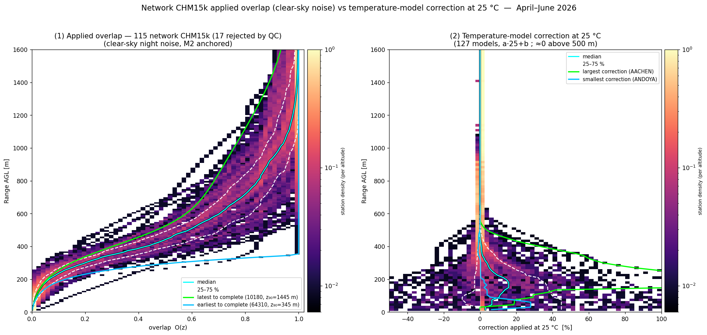

## 1.9 Temperature confound, limits and recommendations

- **The clear-sky noise method cannot build a temperature–overlap model.** The retrieval is night-only, and
  `temp_int` is ~74 % seasonally confounded; the `temperature_optical_module` is Peltier-locked (use
  `temp_int`). So the deliverable here is the **static reference overlap**, not a T-model. In the **deep near
  range (<300 m)** the overlap is strongly *temperature-dependent*; a single multi-night retrieval returns a
  seasonal mean — the temperature model of Hervo et al. (2016) remains the right tool there.
- **Flat sites**: excellent (Payerne, Eriswil, Western Canada, Melpitz plain). **Complex terrain** (alpine
  Kleine Scheidegg): near-range degraded by drainage / residual-layer structure the noise split cannot fully
  remove. **Urban/hazy** (Budapest): may lack clear nights.
- The method is **hood-free, purely passive, and needs only routine L1** — it can be run on demand for any
  CHM15k in the network to flag a drifted or wrong onboard overlap (as at Payerne).
- **Recommendation**: adopt the M2 (or spectral) clear-sky retrieval as a **network overlap-QC** and, for
  Payerne, replace the generic short reference with the retrieved TUB140016 curve (validated against the hood).

*Method & figures: `validation/overlap_clearsky/clearsky_overlap.py` (3 estimators), `drive_stations.py`
(multi-stations vs cfg), `sigmoid_fit.py`, `fig_*_clearsky.py`; cfg comparisons via `cfg_tools.py`; spectral
estimator `spectral_overlap.py` + `spectral_validate.py`; network re-run + QC `drive_network_spec.py` →
`network_overlaps_spec.npz`, `fig_network_spectral_vs_m2.py` / `fig_network_qc_variability.py`.*

---

# 2. The Payerne CL61–CHM15k near-range tilt — investigation and resolution

*Status: **RESOLVED (2026-07-08/09)** — attributed to **unit-specific near-range (overlap-normalization)
differences, dominated by the CHM15k TUB140016 static-overlap module**. The correction chain — water vapour,
molecular T/p, Ångström centre, electronics — is **exonerated** quantitatively; supporting evidence from the
terminal-hood darks, the 3-instrument triangle, and the 2025 instrument swaps.*

## 2.1 The observation

After the full harmonisation pipeline (temperature-overlap, Rayleigh+Kalman calibration, water-vapour
correction, molecular-aware 910→1064 nm conversion; `run_paper_validation.run_site`), the Payerne CL61
(910 nm) reads **higher than the CHM15k (1064 nm) below ~1 km**, as a smooth height **tilt** that averages to
~0 over the 500–3000 m headline band (hence the paper's +0.1 %):

| Range AGL | 300 m | 450 m | 600 m | 800 m | 1000 m | 1200 m |
|---|---|---|---|---|---|---|
| (CL61−CHM)/CHM | +19 % | +15 % | +12 % | +4.6 % | 0 % | −2.8 % |

The **tilt is present day and night** with nearly the same shape (day +10→−8 %, night +17→+2 % over
500→1200 m); night adds a roughly uniform ~+8 % offset on top. The tilt is **Payerne-specific** (Lindenberg:
flat, §2.2). Concern band: 200–900 m.


## 2.2 Corrections exonerated (quantified)

Every candidate in the correction chain was quantified and **cleared** — none produces the 450–900 m tilt.

| candidate | test | result |
|---|---|---|
| Temperature-overlap model | acts < ~720 m; day/night decomposition | not the 450–900 m tilt |
| **Water vapour** | sounding vs CAMS 1°/0.4°/ERA5 at 800 m; below-floor extrapolation swept | ~2–3 % and **wrong sign** (models under-correct) — Fig. 3 |
| **Molecular (Rayleigh) T/p** | β_mol·T² at 910/1064 + additive term M(z) from CAMS 0.4°/1°, US-Std fallback, **radiosonde** (28 launches) | **ΔM ≤ 0.4 % of signal** at all heights (US-Std AGL bug ≤ 0.85 %) — Fig. 9. *Not the Rayleigh profile.* |
| Ångström centre | AERONET **backscatter** Ångström (β=AOD/S, 870–1020, 448 inversions) | median **1.08 ≈ α=1** → conversion well-centred; single-α sweep only rotates, never flattens (Fig. 4) |
| Additive electronics CL61/CHM | terminal-hood darks, correctly scaled | CL61 **+0.1…+0.3 %**, CHM **−0.05…−0.65 %** in 300–1200 m — negligible (Fig. 6) |
| Receiver nonlinearity | residual vs signal level at fixed height | flat (ρ ≈ +0.03…+0.15) → artefact is **height-locked (geometric)** |
| BL aerosol stratification | day/night | tilt persists in the well-mixed daytime BL → **not** the primary cause |


> The US-Standard `_molecular_beta` AGL-vs-ASL bug in the fallback path was **fixed 2026-07-09**
> (`validation/paper/intercompare.py`: T/p interpolated at `z_agl + station_alt`, transmission integrated
> from the instrument, mirroring `_mol_att_cams`). Verified: station_alt=0 regression exact; Payerne β_mol
> error vs 28 soundings +5.1 % → +0.2 %; M-term error −0.7 % → −0.03 % of signal; 532 nm molaer subtraction
> −1.5 % at SIRTA. This is a real-but-small pipeline nit, not the tilt.

## 2.3 Attribution: instrument near-range normalization, dominated by TUB140016

**(a) The hood-corrected triangle.** The co-located CL31 (910 nm) carries a large **negative** hood-measured
electronic deficit (−14 % at 450 m, −60 % at 600 m of its own signal — the reason the `network_offset` ripple
correction is insufficient; the *measured hood dark* must be used, see §3). After correcting it, at
300–450 m the two 910 nm instruments **agree with each other (CL61−CL31 ≈ 0…+4 %) and both sit +15…+22 % above
the CHM15k** — the CHM is the common low outlier in the band where all three instruments are healthy
(Figs. 5, 6).

**(b) The 2025 swaps (natural experiment).** Payerne changed the **CL31 unit in Feb 2025** and the **CHM
optical module (TUB200009→TUB140016) in late April 2025**. The near-range shape metric
[CL31/CHM]₍z₎/[CL31/CHM]₍1.15 km₎ at daily resolution (Figs. 7, 8):

| period | 300 m | 450 m |
|---|---|---|
| old CL31 + TUB200009 (Jan–early Feb) | 0.97 | 0.87 |
| **new CL31** + TUB200009 (mid Feb–Mar) | 1.23 (**+27 %**) | 0.90 (+4 %) |
| new CL31 + **TUB140016** (Apr–Jun) | 1.40 (**+14 %**) | 0.96 (**+7 %**) |

Both swaps moved the near-range shape: **unit-to-unit near-range normalization differences of tens of percent
are the instrumental reality** (consistent with Amsterdam CHM15k unit B). With the *same* CL31 as reference
across the CHM swap, the **TUB140016 installation lowered the CHM near-range response by ~+14 % (300 m) /
+7 % (450 m) relative to TUB200009** — a direct, atmosphere-independent detection of a **static
reference-overlap difference/error of the TUB140016 module** (the module dates from 2014; its factory overlap
is 12 years old, and the module was re-installed in 2025 after storage).

**(c) Why the overlap-probe validation did not see it.** The Hervo-2016 candidates "confirm" the reference to
0.2 % at 650–900 m — but the method fits the *log-linearity* of the corrected signal inside the fit window: a
**smooth multiplicative error spanning the window is degenerate with the fit line / calibration constant** and
passes undetected. The candidate agreement is internal consistency, not an absolute validation of the reference
overlap. (The temperature model on top is validated and unaffected — it corrects the *T-dependence*, not the
static reference.)

**(d) The applied overlap extracted from the hood NOISE (smoking gun).** Under the hood the only signal is
homoscedastic detector noise; the chain outputs rcs₀ = raw·z²/O_applied, so in the P view
σ_P(z) = σ_det/O_applied(z) → **O_applied(z) = σ_det/σ_P(z)** (idea: M. Hervo). The method self-validates on the
CL61: the noise-derived overlap reproduces the firmware `overlap_function` variable to **±1 %** at every range
(Fig. 10b; CL61 overlap complete by ~350 m — the CL61 near field is clean). For the CHM15k (Fig. 10a, N=8540
hood profiles, σ flat to 1 %):

| range | O applied (noise) | O reference file | O true (reconstr. vs CL61) |
|---|---|---|---|
| 450 m | 0.60 | 0.75 | 0.52 |
| 600 m | 0.73 | 0.95 | 0.65 |
| 750 m | 0.81 | **1.00** | 0.76 |
| 1050 m | 0.91 | 1.01 | 0.92 |
| 1500 m | 0.98 | 1.01 | 0.98 |

**Provenance check (M. Hervo):** the "reference" curve is `overlap_ref` of the temp-model `.nc` — verified
**identical (max|Δ| 5×10⁻⁸) to the GENERIC `TUB120011_20121112_1024.cfg`**, the default of both the MATLAB
`script_overlap_routine_v3_EPROF.m` ("No overlap function found. Using TUB120011") and the overlap-probe
examples. **No TUB140016 `.cfg` exists on the local disks.** So three distinct functions are in play:

1. **O_generic (TUB120011 file)** — a *scaffold by design*: no per-module `.cfg` exists for this site, and none
   is needed for the temperature model, whose applied correction `rcs₀ × (1+(a·T+b)/100)` is a pure percentage
   in which the reference **cancels** (M. Hervo). It never enters the measured data and does not bias the
   correction. Its only side effect is on *absolute range statements* derived from it in this investigation
   ("ov>0.6 at 405 m", "complete at 750 m" — properties of the scaffold, not of this unit);
2. **O_onboard (hood noise)** — what the TUB140016 firmware actually divides into beta_raw: 0.60 @450 m,
   complete only ~**1.5–2 km**;
3. **O_true (reconstructed vs CL61)** = O_onboard/(1+tilt) ≈ 0.52 @450 m — the module's *current* optics,
   another ~13 % slower than onboard through 450–900 m (aging/drift since the onboard calibration of the 2014
   module, re-installed 2025).

The **tilt = O_onboard vs O_true mismatch** — a *static* near-range error that the temperature model cannot
capture by construction (it corrects the T-*dependence* around the static state, as a percentage). `O_applied`,
`O_ref(generic)` and `O_true` are saved in `figs_cl61_chm_tilt/tub140016_overlap_noise.npz`; `rcs₀ ×
O_applied/O_true` is the ready-to-use static near-range correction (+15 % @450 m, +12 % @600 m, +7 % @750 m,
~0 @1050 m), derived from hood noise + CL61 only, **independent of any reference file**.


**Remaining open:** the exact split above ~550 m (the CL31 cannot arbitrate there) — the CL61 tilt at
600–900 m is consistent with the same TUB140016 deficit tapering to zero by ~1 km, but a CL61-side near-field
contribution cannot be fully excluded (Lindenberg's CL61 is a different unit/chain); and the ~+8 %
night-uniform offset (atmospheric — nocturnal column Ångström; AERONET cannot measure at night).

## 2.4 CL61-independent confirmation — the high-window overlap-probe (method B)

The noise+CL61 reconstruction would be circular if validated against the CL61 alone. An independent, CHM-only
route places the overlap-probe fit window **above** the suspect zone and reads O_true from the log-linear
extrapolation. Several iterations were run locally (driver monkey-patching the config; the operational overlap
repo was untouched).

**First attempt (naive high window, 1000–2200 m, full TUB140016 period, 456 days):** yields 31 candidates on 3
days but the derived overlap is **physically WRONG** — it over-corrects to +55 % @600 m and +14 % @1000 m vs
the CL61 truth of +12 % and 0 %. **Root cause is a structural wall, not thresholds:** the probe fits a
log-linear molecular line in the window and **extrapolates it ~700 m down**. A window at 1000–2200 m sits
*in/above* the residual layer, so (i) the fitted slope is contaminated by aloft aerosol (too steep) and (ii)
the extrapolation crosses the aerosol-laden **boundary layer** — a different air mass — and the slope error
**amplifies with distance**, monotonically worsening downward. More days / stricter gates cannot fix a
*systematic* extrapolation bias.


**Method B done properly — fit window INSIDE a homogeneous layer (key correction, M. Hervo).** At 1000 m one is
*inside* the boundary layer (convective by day, residual by night), not above it — so the fix is **scene
selection**: the fit window must sit *inside a homogeneous layer*, not above the BL. Payerne's aerosol-layer
top is median **3.6 km** (p10 2.7 km), so clean air below ~1 km is essentially never available (only 2 of 414
days) — the low-BL-clean → Rayleigh regime is a dead end. The **deep well-mixed → Hervo** regime gives **127
days**; by day the convective layer is homogeneous in the mean but **turbulent in time** (fails the variance
gate), while at **night the residual layer is the sweet spot** (homogeneous *and* temporally stable). Direct
measurement of the stable-air ceiling (573 night windows over the 127 days): median **764 m**, p90 **1214 m**;
**30 % of night windows reach ≥1000 m**, ~0 % reach 1500 m. A 1000 m window is reachable — but only with a
**short** fit length (the earlier `min_fit_length=300` demanded a 1300 m ceiling Payerne never gives; that,
not physics, was the block).

**Result (window 1000–1350 m, `min_fit_length=150`, night, deep-mixed days): 10 candidates on 2 nights reveal
the overlap up to 1000 m, CHM-only, matching the CL61 reconstruction to ~1–2 % at every height:**

| h [m] | 400 | 500 | 600 | 700 | 800 | 900 | 1000 |
|---|---|---|---|---|---|---|---|
| corr via **CL61** [%] | +16.3 | +14.3 | +12.3 | +8.3 | +4.8 | +2.3 | −0.1 |
| corr via **regime-A (CHM only)** [%] | +18.7 | +16.1 | +14.0 | +9.0 | +5.7 | +2.7 | +0.4 |

The two agree and converge to 0 at 1000 m — an **independent, CL61-free** confirmation of the TUB140016
overlap deficit all the way to 1000 m. Unlike the naive high window (over-corrected +55 % by extrapolating
through the BL), regime-A works because the fit window is **inside the homogeneous residual layer**, so the
extrapolation stays in one air mass.


**Per-night diagnostics (the 2 working nights):** each shows (a) log₁₀ rcs₀ time–height (the homogeneous,
stable residual layer that lets the fit reach the marked 1000–1200 m window), (b) the vertical gradient
(overlap signature confined below ~250 m; flat aloft), (c) profiles — raw vs overlap-corrected (rcs₀ × ov/ovp_fc)
vs pure molecular reference, and (d) the overlap functions — generic file, candidate ovp_fc, onboard (hood
noise) and the derived true optics O = O_onboard·ovp_fc/ov.


**Does the temporally-turbulent BL bias the retrieval?** Tested directly (variance threshold
0.05→0.10→0.20→0.40 and a 30-min window): (i) the retrieved O_true is **identical** across variance thresholds
(O@600 m = 0.641/0.641/0.632) and matches CL61 (0.650) — so the rejected temporal "variance" at 1 km is **shot
noise + turbulence that averages out in the mean profile**, *not* a bias source; the retrieval is robust. (ii)
Relaxing variance does **not** raise the yield (0.05 and 0.10 give the *same* 10 candidates) — the binding
constraint is **fit quality / SNR at 1 km**, not the variance gate. (iii) **Shorter windows are worse** (30 min
→ 0 candidates). So the route to more candidates is **more nights (accumulate the archive)** and/or **longer**
averaging, not looser gates.


**Synthesis — the TUB140016 overlap function, three independent estimates:**

| h [m] | generic file | ① O_onboard (dark) | ② O_true (CL61) | ③ O_true (method B) |
|---|---|---|---|---|
| 375 | 0.49 | 0.50 | 0.43 | 0.37 |
| 450 | 0.75 | 0.60 | 0.52 | 0.46 |
| 525 | 0.87 | 0.66 | 0.58 | 0.53 |
| **600** | 0.95 | 0.73 | **0.650** | **0.649** |
| 675 | 0.98 | 0.78 | 0.71 | 0.76 |
| 750 | 1.00 | 0.81 | 0.76 | (blind) |

O_onboard (①, firmware, from hood noise) completes only ~1.5–2 km, not 750 m (generic). The two independent
reconstructions of the *true* current optics — ② from the CL61 tilt, ③ from the CHM-only high-window
overlap-probe — **coincide at 600 m** (0.650 vs 0.649) and bracket ~13 % below onboard through 450–600 m.

**Comparison with the existing temperature-overlap model (`.nc`):** its correction Dif(z,T)=a·T+b is
**concentrated below ~350 m and is exactly 0 above 500 m** (a,b→0):

| h [m] | 200 | 300 | 400 | 500 | 600 | 700 | 800 |
|---|---|---|---|---|---|---|---|
| Dif @25 °C [%] | +59 | +14 | +2.0 | +0.2 | +0.1 | 0 | 0 |
| static deficit needed [%] | (T-part) | ~+30 | ~+22 | ~+18 | **+12** | +9 | +5 |

So the existing model's *effective* overlap sits **on top of O_onboard above 400 m** — it corrects the
near-range **temperature-dependent** artefact (<350 m) and applies **nothing** to the 450–900 m **static**
deficit. The two corrections are **complementary**: the static overlap correction (O_onboard→O_true) must be
applied *first*, the T-model on the residual *second*. This is exactly why the tilt survives the full pipeline.


**Verdict on pushing the overlap-probe higher:** it **cannot** be pushed above ~900 m at Payerne by
re-windowing — the binding physics is the molecular-line extrapolation through the aerosol BL, confirmed
empirically. Where the overlap deficit is already flat by 1000 m (as here) this is moot; the only sound way
strictly higher is a **Rayleigh-normalised variant** (divide rcs₀ by β_mol·T²_mol and fit the scattering
ratio — flat in clean *and* homogeneous-aerosol air, so there is no molecular slope to extrapolate) — a
rewrite of the fit core, not a config change. The practical correction remains the **noise+CL61 npz**,
independently anchored at 600 m by the (correctly-windowed, ≤1000 m) method B.

## 2.5 Actions

1. **Derive an in-situ static overlap correction for TUB140016** below ~1 km — from the hood-corrected
   CL61/CL31 median shape on clear days, or a dedicated overlap recalibration (horizontal/tilted shots). Flag
   Payerne CHM15k < 900 m until then.
2. **Use the measured terminal-hood dark for the CL31 offset channel** (`cl31_b_dark.npz`), **not** the
   ~30×-smaller clear-night ripple (the current paper channel uses the ripple → effectively uncorrected). See
   §3 for the GOTCHA in full.
3. Pipeline nit (done): the US-Std `_molecular_beta` AGL-vs-ASL bug — **FIXED 2026-07-09**. Prefer CAMS
   0.4°/ERA5 or const-RH+lapse below-floor extrapolation for the WV correction at elevated Alpine stations
   (~2 %).
4. For the paper: report the 500–3000 m band (+0.1 %) and document the near-range band as limited by
   **unit-specific near-range normalization** (both 910 nm and 1064 nm families), with the Payerne tilt as the
   worked example.

---

# 3. Electronic-offset / dark characterisation — single-site and network

Covered-telescope ("terminal hood") dark measurements on the co-located Payerne **CL61** (910 nm, analog) and
**CHM15k** (1064 nm, photon-counting) reveal a small **negative electronic offset** in the vendor L1 `rcs_0`.
It is ≈ 100× below the per-shot noise — invisible profile-by-profile — but **statistically significant** in
the deep average (CL61 **−12.4σ**, CHM15k **−5.4σ**). Each offset is reproduced by a **physical model**.
Subtracting the CL61 model and recalibrating the full CL61 record both *unlocks nights* and shifts the constant
**+15 %** toward the CHM15k-anchored cloud value. **Only the CL61 offset is material for calibration**; the
CHM15k's is within its own 13 % night-to-night scatter, so the CHM15k constant stands.

## 3.1 Instruments and hood sessions

Three ceilometers share the Payerne roof (WMO `0-20000-0-06610`, 46.81 °N, 6.94 °E, 491 m): CHM15k (ident `A`,
Lufft, 1064 nm, photon-counting), CL31 (ident `B`, Vaisala, 910 nm), CL61 (ident `C`, Vaisala, 910 nm). Four
**terminal-hood** sessions were performed in 2026 (each instrument's telescope covered in turn):

| session | CHM15k (UTC) | CL31 (UTC) | CL61 (UTC) | note |
|---|---|---|---|---|
| 12 May | 09:24–14:53 | 09:33–14:55 | 09:17–14:58 | daytime |
| 26–27 May | 26 12:00 → 27 13:15 | 26 12:00 → 27 13:10 | 26 11:45 → 27 13:15 | **~24 h diurnal cycle** (heat dome) |
| 9 Jun | 09:16–11:55 | 09:16–11:57 | 09:10–11:51 | bin-bag solar-hermeticity test 10:34–11:39 |
| 23 Jun | 12:32–15:09 | 10:12–12:13 | 10:00–12:25 | midday peak-summer (temp_int 43 °C) |

With the telescope covered there is no atmospheric return, so the window-mean profile **is** the processing
offset. The offset is estimated in the **non-range-corrected space** P = rcs_0 / z² (= β/r² for the CL61),
where the detector noise is homoscedastic. The DC bias is the per-gate **median** (spike-immune); its
uncertainty is the standard error of the median (1.253·σ/√N) plus a 3000-sample bootstrap CI. A per-profile
3–5 km band-mean, medianed over all shots, gives the significance in σ. Comparability across the different
`rcs_0` units is achieved by expressing each offset as a **fraction of that instrument's own clear-night
molecular signal** at the same heights.

Time-height pcolors confirm the covered windows are otherwise uniform noise, except the **first ~1 minute** of
a session (hood placement, still-open telescope catches real atmosphere). Profiles with a **coherent**
mid-range return (median β_att over 1.5–4 km > 0.1 Mm⁻¹sr⁻¹) are screened before the temperature analysis (CL61
0.1 %, CHM15k 5.4 %).


*Figure — Time-height β_att of the four hood sessions (0–6 km), CL61 (top) and CHM15k (bottom); green =
screened profiles. Uniform dark noise apart from the hood-placement transition at each session start.*

## 3.2 The dark measurements: a real but tiny offset


*Figure — Terminal-hood dark binscatter (pooled over the four 2026 sessions). Per-sample β/r² (2-D histogram)
with the per-gate median (black) and its ±3× precision band (red); orange = 3–5 km Rayleigh window. On the
per-sample scale (±2.5·10⁻⁷) both medians sit on zero — the offset is ~100× below the shot noise.*

On the per-shot scale the offset is invisible; averaged over the 3–5 km band **and** the full session, it is
significant:

| | offset (3–5 km) | significance | offset / clear-night molecular |
|---|---|---|---|
| **CL61** | negative, all 4 sessions | **−12.4σ** | −11 … −13 % |
| **CHM15k** | negative, all 4 sessions | **−5.4σ** | −18 % (of a *very weak* 1064 nm molecular) |
| **CL31** | small, stable | — | offset ≳ molecular (no fittable signal → not Rayleigh-calibratable) |

## 3.3 Physical models — three distinct hardware mechanisms

Each offset is fitted in P-space by robust non-linear least squares (soft-L1). The **shape contrast** is the
diagnostic.

- **CL61 (over-damped undershoot).** The pulse response of a high-pass (AC-coupled) chain,
  P(r) = A_p e^(−r/L_p) − A_u e^(−r/L_u) + b_∞ — a fast positive lobe (τ_p ≈ 4.7 µs) minus a slow negative
  undershoot (τ_u ≈ 30.5 µs); the DC-blocking property forces the two areas to nearly cancel.
- **CHM15k (over-subtraction relaxation).** A single negative relaxation P(r) = b_∞ − A e^(−r/L)
  (A ≈ 1330 counts s⁻¹, L ≈ 2.7 km), **no positive lobe** → photon-counting background/afterpulse
  over-subtraction, not AC-coupling. Beats a flat-over-subtraction null (RMSE 381 vs 445). Lower SNR than the
  CL61.


*Figure — CL61 offset (910 nm, analog): AC-coupling high-pass pulse response.*


*Figure — CHM15k offset (1064 nm, photon-counting): single negative relaxation, no positive lobe →
background/afterpulse over-subtraction.*

- **CL31 (two under-damped resonances), improving on Kotthaus et al. (2016).** Kotthaus et al. (AMT 9, 3769)
  remove the CL31 instrument background P^bgi(r) *empirically* (their Eq. 1, P̂ = P − P^bgi) and explicitly
  decline to model the transmitter **"ripple"**. We model it: the CL31 hood offset is the **superposition of
  two under-damped resonances**, P(r) = b_∞ + Σ e^(−r/Lₖ)[aₖcos(2πr/Λₖ) + bₖsin(2πr/Λₖ)], each range period
  mapping to a frequency f = c/2Λ. **R² = 0.98** (vs 0.74 for a single sinusoid).

  | mode | Λ | L | f = c/2Λ | origin |
  |---|---|---|---|---|
  | fast | 1053 m | 387 m | **142 kHz** | AC-coupling **amplifier ring** — matches Kotthaus's stated 159 kHz high-pass corner |
  | slow | 5080 m | 5354 m | 30 kHz | the transmitter **ripple** (CLT321) |

  The 142 vs 159 kHz match confirms the fast mode *is* the amplifier's high-pass resonance.


*Figure — CL31 background as two under-damped resonances (R² = 0.98): fast AC-coupling amplifier ring
(142 kHz) dominates the near-range undershoot, slow transmitter ripple (30 kHz) carries the 2–7 km oscillation.
σ_P is flat white noise (the CL31's low-SNR limit).*

### Does the model transfer? — a second Vaisala (Uccle CL51)

Applied to the **Uccle CL51** (`0-20000-0-06447` A) — a different unit of the same single-lens family, no hood
(offset from **clear-night per-gate medians** of P = rcs_0/z², 75 640 profiles, a gaussian high-pass σ ≈ 350 m
removing the smooth baseline). **The two-resonance CL31 model does *not* transfer.** The CL51 offset is
dominated by a **fixed 40 m (exactly 4 range-gate) ripple**, *undamped* out to >10 km. 40 m = 4× the 10 m gate
⇒ f = c/2Λ = **3.75 MHz = f_sample/4** (the 15 MHz range-gate clock) — a **4-way ADC-interleave / digitizer
fixed-pattern ripple**, fit by a period-4 model at **R² = 0.98**. This same 40 m ripple is **absent** as a
coherent feature in the Payerne CL31 (autocorrelation 0.26, incoherent noise).

| | Payerne CL31 | Uccle CL51 |
|---|---|---|
| dominant offset | two under-damped resonances (1053 m, 5080 m) | fixed **40 m** ripple (f_sample/4) |
| damping | ring decays by ~1.5 km | **undamped** to >10 km |
| frequency | 142 kHz + 30 kHz (analog) | **3.75 MHz** (digitizer) |
| coherent 40 m ripple? | no (noise) | yes (autocorr 0.99) |

This is exactly the picture Kotthaus et al. anticipated: the ripple is a **sensor-specific frequency**. Each
Vaisala unit imprints its *own* fixed additive pattern — so the *universal* principle is the **fixed electronic
offset** (their empirical P^bgi), not a universal spectral shape. A physical model must be re-fit per unit.


*Figure — Uccle CL51 offset from clear-night medians (no hood): the fixed 40 m ripple with the period-4 fit;
undamped to 10 km; the CL31 has no coherent ripple.*

## 3.4 The correction profiles and full-period CL61 recalibration

The correction subtracts the modeled b(z) = P_model(z)·z² from L1 `rcs_0`, gate by gate, **before** the
water-vapour division (the offset is an additive term in the raw signal).


*Figure — The offset correction b(z) subtracted from L1 rcs_0 for each instrument. CL61: fast lobe + slow AC
undershoot, ≈ −0.02 Mm⁻¹sr⁻¹ at the 3–5 km window. CHM15k: single negative relaxation.*

The eprof_v2 Rayleigh calibration (WV correction on, monthly CAMS) run for every day of the CL61 record
(2026-02-24 … 06-30) with and without the correction, per-night `C_L` compared to the CHM15k-anchored cloud
constant `C_L = 1.4252`:


*Figure — Payerne CL61 Rayleigh over the whole record with/without the hood-offset correction. (a) per-night
C_L; (b) paired nights; (c) distribution.*

| metric | original | offset-corrected |
|---|---|---|
| good (flag = 1) nights | 3 | **10** |
| any-flag calibrated nights | 13 | **29** |
| median C_L (any-flag) | 1.231 | 1.297 |
| **gap to cloud constant 1.4252** | **−13.7 %** | **−9.0 %** |
| paired-night median shift | — | **+15 %** |

The correction removes roughly ⅔ of the method gap and more than triples the number of successfully-calibrated
nights — the offset was not only biasing the constant but spoiling the fit outright on many nights. The residual
≈ −9 % is consistent with the night-time deepening of the offset plus the monthly-CAMS WV over-correction.

## 3.5 Temperature analysis (Le et al. 2026 style)

Pooling the four sessions and binning by internal temperature `temp_int` (22–44 °C), the **instrumental bias**
μ(β/r²) and the **noise** σ²(β/r²) are decomposed vs range:


*Figure — Instrumental bias μ(β/r²) and noise σ²(β/r²) vs range, per internal-temperature bin. Top: CL61;
bottom: CHM15k. σ² is flat (homoscedastic) and rises with temperature (more dark current when warm); μ carries
the offset, largest toward the surface; for the CL61 it deepens at the cold (night) end.*

- **Noise σ²** grows with `temp_int` (dark current) — flat with range, as expected for a background-limited
  detector.
- **Bias μ** is the offset; its amplitude has a modest temperature dependence (within a single session,
  cold/warm ≈ ×1.13 at 3–6 km), sitting in the CL61 undershoot *amplitude* while the RC time constant τ_u stays
  fixed.

## 3.6 Multi-instrument intercomparison — does correcting the offset improve agreement?

Regenerating the Payerne intercomparison (Mar–May 2026, β_att vs the CHM15k Rayleigh reference over 500–3000 m,
**L1 only** with the operational calout Kalman constants; offset models subtracted from L1 rcs_0):

| channel | relbias vs CHM15k (Rayleigh) | r |
|---|---|---|
| CL61 (cloud) — trusted anchor | −1.5 % | 0.99 |
| CL61 (Rayleigh) | +12.6 % | 0.99 |
| **CL61 (Rayleigh, offset-corr)** | **+0.2 %** | 0.98 |
| **CHM15k (Rayleigh, offset-corr)** | **−6.3 %** | 1.00 |
| CL31 (cloud) | +27.0 % | 0.51 |
| **CL31 (cloud, offset-corr)** | **+22.6 %** | **0.64** |

The result is **asymmetric across the three instruments**:

- **Correcting the CL61 works:** its Rayleigh bias collapses from **+12.6 % to +0.2 %**, into agreement with
  both the CL61 cloud method (−1.5 %) and the CHM15k reference. Full-record confirmation that the CL61 offset
  is a real, correctable calibration bias.
- **Correcting the CL31 helps but doesn't fix it:** removing the two-resonance ringing from the L1 rcs_0
  **improves the correlation r 0.51 → 0.64** (the ripple was a systematic range-pattern *decorrelating* the
  CL31 from the reference) and trims the bias +27.0 % → +22.6 %. The large residual is the CL31's own low-SNR
  limit (σ_P is white noise, irreducible).
- **Correcting the CHM15k *degrades* the agreement:** it shifts the CHM15k **−6.3 % away** from the
  cloud-anchored agreement. This is **not** because the correction does nothing — the CHM15k full-period
  recalibration shows a real **+10.3 % paired shift** and night-unlocking (flag=1 6→13), a magnitude *like the
  CL61* (+15 %, 3→10). The two are separated not by the recalibration *magnitude* but by its **direction
  relative to the trusted anchor**: the CL61 native Rayleigh was biased (+12.6 %) so the correction fixes it,
  whereas the CHM15k native already agreed with the CL61 cloud method (−1.5 %) so the same correction pushes it
  off.


*Figure — Payerne multi-instrument intercomparison (Mar–May 2026) with the offset-corrected channels added.
CL61 (Rayleigh, offset-corr) collapses onto the cloud/reference agreement; CHM15k (Rayleigh, offset-corr)
moves away from it.*


*Figure — CHM15k full-record recalibration with/without the offset correction. The paired shift (+10.3 %) and
night-unlocking mirror the CL61 — so the recalibration alone does not distinguish the two instruments; only the
intercomparison does, via the sign relative to the cloud anchor.*

**Operational take-away:** apply the offset correction to the **CL61** (and, by the same mechanism, CL51/CL31
where a molecular signal exists); **retain the native CHM15k** constant — the one consistent with the
cloud/EARLINET anchor.

## 3.7 The cloud calibration is offset-immune

The CL31/CL51 are calibrated by the **liquid-cloud (O'Connor) method**, not Rayleigh. Rerunning that
calibration on **L1** with the electronic-offset correction subtracted from rcs_0, paired day-by-day against the
native calibration over Mar–Jun 2026:

| instrument | cloud-days | median C (native) | **median shift (corr − native)** | \|95 pct\| | max \|shift\| |
|---|---|---|---|---|---|
| Payerne CL31 | 28 | 3.079 | **−0.00 %** | 2.21 % | 3.10 % |
| Uccle CL51 | 25 | 1.299 | **+0.01 %** | 0.02 % | 0.02 % |

The cloud-derived constant is **unchanged in the median** for both — the O'Connor method integrates the
*strong* near-range liquid-cloud return, which dwarfs the weak electronic offset. The CL31 offset can perturb
an *individual* day by up to ~3 % (cloud height relative to ripple phase) but these average to zero; the CL51
ripple-only correction (valid >1.8 km) barely overlaps the cloud gate at all. This is the quantitative basis
for treating the strong-signal cloud method as the **offset-immune cross-instrument anchor** — the correction
is a weak-signal (Rayleigh) fix, not a cloud-calibration fix.


*Figure — Cloud calibration with vs without the offset correction (L1, operational O'Connor). Daily and
Kalman-smoothed constants overlie almost exactly; per-day shift histograms centre on 0.*

## 3.8 Network offset coefficients — clear-night extraction, all altitudes

The single-site analysis is extended to the **network**: 10 CL61, 11 CL51 and 10 CL31 across **~20 countries**
(Lauder NZ → Birkenes NO), using the **clear-night** method (no hood), delivering a per-instrument coefficient
set (`network_offset_coeffs.csv` + per-unit `b_phys`) to de-ripple the aerosol backscatter. Two design choices,
both driven by operator review:

1. **Correctability is decided by SPLIT-HALF REPRODUCIBILITY**, not a single-set autocorrelation. The clear
   nights are split into two independent halves (even/odd profiles); a *fixed instrumental* pattern reproduces
   in both (corr→1), atmosphere/noise does not — robust, and it catches the larger CL31 distortions an
   autocorrelation threshold missed.
2. **The correction spans ALL altitudes.** A digitizer ripple is locked to the range-gate clock, so its fixed
   *N-gate pattern* is estimated from the clean free troposphere and reconstructed at **every** gate (a
   **gate-fold**), including the near range — no artificial cut-off, no sinusoid-extrapolation dephasing.

**Correctable = reproducible (split-half ≥ 0.6) AND significant (≥ 1.5 % of the mid-range signal) AND not
decaying with range** (`undamped ratio ≥ 0.5` — an electronic offset stays ~flat in `P=rcs_0/z²`, a persistent
aerosol layer decays). Result:

- **CL51: 4/11** — Uccle 9.4 %, Diepenbeek 4.9 %, Chilbolton 1.8 %, Kuopio 1.5 %.
- **CL31: 6/10** — Lerwick 10.2 %, Akrotiri 8.3 %, Payerne 5.9 %, Delémont 3.8 %, Evaso 3.6 %, Caen 3.2 %.
- **CL61: 0/10** — no recoverable clear-night offset (its offset is the smooth near-range undershoot, which
  decays with range and needs a hood).
- **Internal (laser) temperature** is a weak refinement (|slope| mostly < 0.02 /°C) — not parameterized.

The kernels (`_offset_lib.py`): the offset is a **fixed additive range pattern** (Kotthaus P^bgi) from the
per-gate robust **median of P = rcs_0/z²** over clear nights; **split-half reproducibility** (median of even vs
odd, correlated 2–8 km); **gate-fold** (N-value pattern measured in the clean free troposphere, evaluated at
every gate, phase-locked); **undamped ratio** = RMS(6–10 km)/RMS(2–4 km).

**Validation gate — does clear-night recover the hood offset?** (Payerne CL31): the far-range persistent ripple
is recovered (corr **+0.60**, amplitude ratio 0.86); the near-range damped ring is **4.9× masked** by
boundary-layer aerosol (recoverable only with a hood).


*Figure — Payerne CL31 clear-night vs hood: far-range ripple recovered, near-range ring masked by BL aerosol.*


*Figure — (a) offset amplitude per instrument (solid = correctable); (b) the two thresholds (reproducibility
≥ 0.6, amplitude ≥ 1.5 %); (c) strongest correctable offset per type; (d) temperature slope (weak).*

Every station's verdict is auditable: the two night-halves are overlaid — they **coincide** for a real fixed
pattern (green), **diverge** for noise/atmosphere (grey).

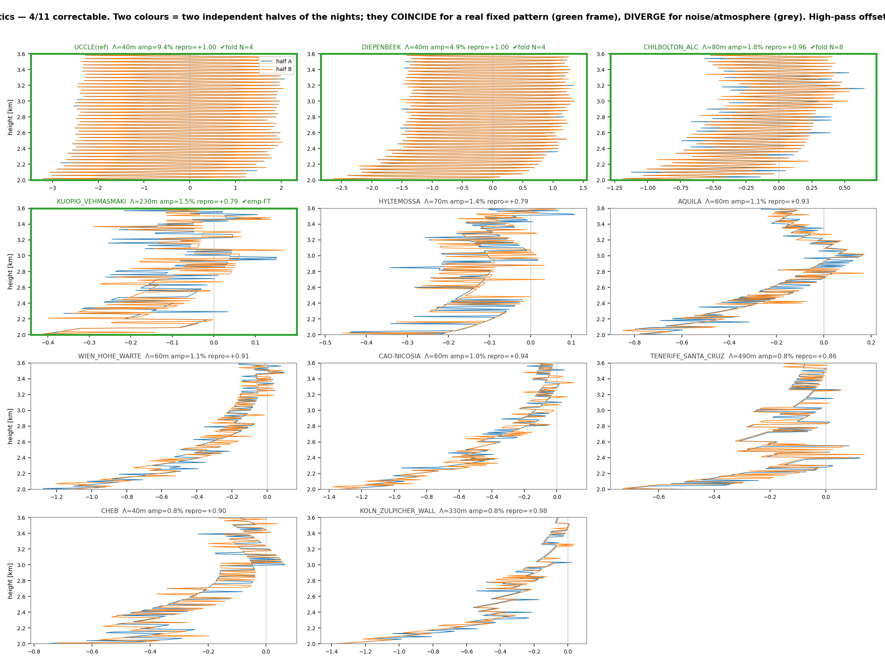
*Figure — CL51: 4/10 correctable. Uccle/Diepenbeek carry a strong, clean 40 m (4-gate) ripple.*

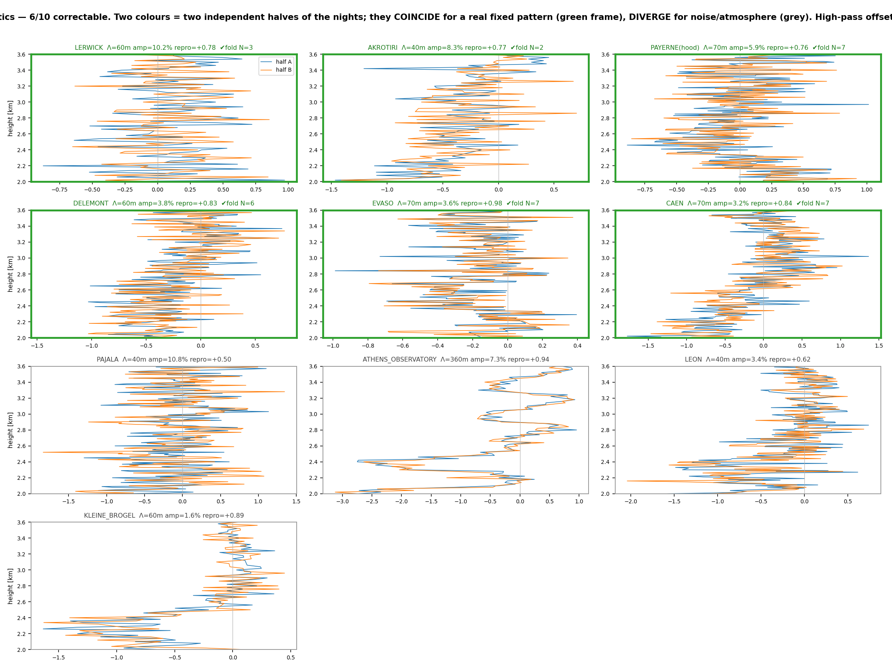
*Figure — CL31: 6/10 correctable. **Athens** (7.3 %, repro 0.94) is **rejected**: it *decreases* with range
(undamped 0.14) — a persistent near-range atmospheric feature, not a range-flat electronic offset. **Pajala**
rejected as too noisy (repro 0.50).*

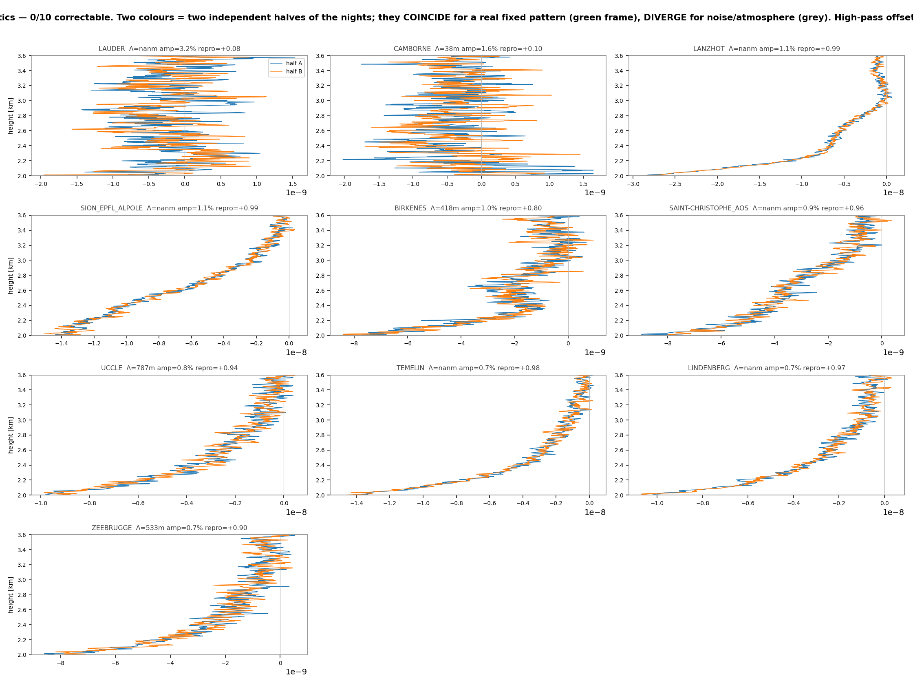
*Figure — CL61: 0/10. Several show a reproducible pattern, but it decays with range (undamped ≈ 0.1) — the
smooth near-range undershoot the clear-night high-pass cannot isolate (needs a hood).*

The correctable offsets are mostly **short-period gate-locked ripples** (the Vaisala digitizer fixed-pattern
ripple), whose period is **unit-specific** (40/60/70/80 m) — Kotthaus's "sensor-specific frequency". Their
amplitude relative to the *mid-range* signal is 1–10 %, but because it is a fixed additive error while the
atmospheric signal decays, it is a **large fractional error in the weak free troposphere** — exactly where
aerosol profiling needs it removed. Clear-day time-height quicklooks for all stations
(`fig_offset_pcolor_CL51/CL31/CL61.png`) confirm the classification per unit.

**Operational correction (all altitudes).** For each correctable unit, `network_offset/<key>.npz` holds
**`b_phys(range)`** (rcs_0 units, full range); the correction is a straight subtraction on L1:

```
rcs_0_corrected = rcs_0 − b_phys(range)          # then β_att = rcs_0_corrected / C_L
```

Worked examples (one figure per correctable station, each zooming 1.5–3.5 km across the old 1.8 km cut-off):
Uccle CL51 40 m 9 %, Diepenbeek CL51 40 m 5 %, Chilbolton CL51 80 m 1.8 %, Kuopio CL51 (empirical FT pattern)
1.5 %; Lerwick CL31 60 m 10 %, Akrotiri CL31 45 m 8 %, Payerne CL31 70 m 6 %, Delémont CL31 60 m 3.8 %, Evaso
CL31 70 m 3.6 % (tightest split-half, repro 0.98), Caen CL31 70 m 3.2 %.


*Figure — Uccle CL51 (40 m, 9 %): the fixed banding is removed at **all** altitudes, the zoom mean profile
flattened. On the strong boundary-layer signal the correction is invisible — it matters in the weak free
troposphere.*

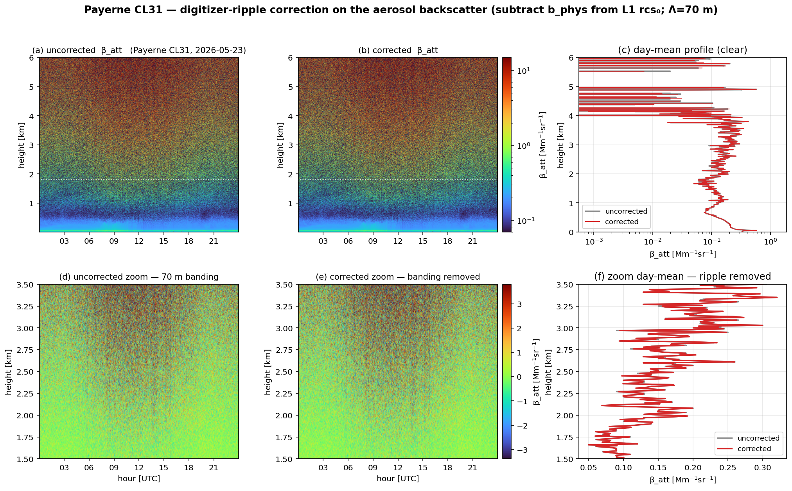
*Figure — Payerne CL31 (70 m, 6 %): the hood-anchored reference unit. The CL31 free-troposphere β_att is
near-zero (even negative, from background over-subtraction), so the correction sits on near-noise; the ripple
banding is nonetheless removed.*

The correction does **not** change the cloud-derived calibration constant (§3.7); it is purely an
aerosol-profile improvement, per flagged unit.

**Honest scope.** Clear-night recovers the **range-flat / periodic** offset only; the near-range *damped* ring
(CL31) and *smooth undershoot* (CL61) decay with range and need a hood (only Payerne has one). "Reproducible" ≠
"instrumental" without the undamped/periodicity check (Athens). Coefficients are from Mar–Jun 2026 clear nights;
a firmware/board change requires re-extraction.

## 3.9 GOTCHA — use the MEASURED hood dark, not the clear-night ripple

For the offset-correction / dark channel (in the paper's CL31/CHM15k offset-corrected comparison), the
correction **must use the MEASURED terminal-hood dark** (`cl31_b_dark.npz`), **NOT** the ~30×-smaller
clear-night ripple. Only **Payerne** has a hood. The clear-night method recovers only the range-flat/periodic
part; the CL31's dominant near-range feature is a **damped ring** that boundary-layer aerosol masks (4.9×, §3.8)
— so on any station without a hood the near-range static deficit is simply not recoverable from clear-night data
and must not be substituted by the small ripple. Using the clear-night ripple in the CL31 offset channel leaves
the near range **effectively uncorrected** (the ripple is ~30× too small to stand in for the true hood-measured
deficit of −14 % at 450 m / −60 % at 600 m).

**Magnitudes to remember:** CL61 and CHM15k darks are **negligible** for the near-range shape (CL61 +0.1…+0.3 %,
CHM −0.05…−0.65 % over 300–1200 m); the **CL31 hood dark is large and negative (−14 … −60 %)** across
450–600 m. This is why the CL31 in the tilt triangle (§2.3) can only be brought into agreement with the CL61/CHM
after applying its measured hood dark, and why the network `b_phys` ripple correction, useful as it is in the
free troposphere, does **not** substitute for the hood dark in the near range.

## 3.10 Discussion — which offset matters

Significance of the offset is **not** the same as a calibration bias:

- **CL61 (material):** the offset biases the 910 nm Rayleigh fit — a −26.5 %→−8.3 % recalibration shift on the
  curated nights, +15 % on the full-record paired nights, and it unlocks 3→10 good nights. Correct it.
- **CHM15k (real offset, correction not warranted):** the offset is real (−5.4σ) and −18 % of the weak 1064 nm
  molecular; removing it shifts the CHM15k Rayleigh **+10.3 %** and unlocks nights — a *consistent* effect. But
  this moves the CHM15k **off** its −1.5 % agreement with the CL61 cloud method and its EARLINET closure
  (intercomparison −6.3 %), so the **native CHM15k constant is retained**. Operationally the strong-signal
  cloud/Kalman path is offset-immune regardless.
- **CL31 (real offset, cloud-calibrated):** the two-resonance ringing cannot be Rayleigh-fit, but removing it
  from L1 rcs_0 measurably **improves the CL31↔reference correlation (r 0.51→0.64)** and trims the
  intercomparison bias — the ripple was a systematic range-pattern decorrelating the CL31; the large residual
  is its own low-SNR floor.

**Take-away:** a weak-signal electronic offset is present in every ceilometer and measurably shifts the Rayleigh
fit when removed — but whether *correcting* it is right depends on whether the native Rayleigh was biased
against a trusted anchor. It was for the CL61 (correct it); it was not for the CHM15k, whose native agrees with
the cloud method (retain it); the CL31 cannot Rayleigh-fit at all. The cloud method's strong-signal, near-range
immunity is why it is the robust cross-instrument anchor.

*Scripts (branch `wv-correction`): `validation/paper/_hood_binscatter.py`, `_cl61_offset_physical_model.py`,
`_chm15k_offset_physical_model.py`, `_cl31_offset_physical_model.py`, `_cl51_uccle_offset_model.py`,
`_hood_correction_profiles.py`, `_cl61_fullperiod_recal.py`, `_hood_temperature_leetal.py`,
`_cloud_offsetcorr_recal.py`, `_hood_offset_significance.py`, `_chm15k_offset_verify.py`; network:
`_offset_lib.py`, `_cl31_clearnight_vs_hood.py`, `_network_offset_scan.py`, `_network_offset_coeffs.py`,
`_offset_diagnostics.py`, `_correctable_signal_figures.py`. Offset models cached in `cl61_b_dark.npz` /
`chm15k_b_dark.npz` / `cl31_b_dark.npz` / `cl51_b_dark.npz` + `network_offset_coeffs.csv`.*

---

# 4. Ambient (no-hood) noise and detection thresholds

**CL31 / CL61 / CHM15k, Payerne · 29–30 May 2026 (cloud-free periods) · dark reference 12 May 2026 (termination
hood).**

The dark-measurement campaign characterised instrument noise vs altitude, Allan behaviour and aerosol detection
thresholds at Payerne with the hood on. Network instruments can never be hooded, so this study derives the
**same quantities from ambient measurements**: if a robust ambient method reproduces the dark results, it can be
applied to **every instrument in the network** where only ambient data exist. E-PROFILE L2 is time-averaged and
unsuitable — all analysis runs on raw data at native resolution.

> **Headline result: night-time ambient noise reproduces the dark measurement within 0–10 % at all altitudes
> for all three instruments. Clear nights are a free dark measurement.**

*Figures for this section live on the MATLAB side (`figs_ceilo_ambient\01…17`) and are not present in
`doc/reports/`; the quantitative tables below are the durable content.*

## 4.1 Data and cloud screening

| Instrument | λ | Native resolution | Signal variable |
|---|---|---|---|
| CL31 | 910 nm | 30 s / 10 m / 770 gates (7.7 km) | `rcs_910` (1 LSB = 10⁻⁸ m⁻¹sr⁻¹) |
| CL61 | 910.55 nm | 30 s / 4.8 m / 3276 gates (15.7 km) | `beta_raw` (**unscreened** β_att) |
| CHM15k | 1064 nm | 15 s / 15 m / 1024 gates (15.3 km) | `beta_raw` / CHM_CAL, CHM_CAL = 5×10¹¹ |

A bin is clear only if **all three instruments** have data **and** none flags it (the CHM15k acts as cirrus
safety net for the 910 nm pair and vice versa). The **cirrus test** must be **adaptive per gate**: flag where
the smoothed signal exceeds `median + 6·1.4826·MAD` of that gate (absolute floor 0.3 Mm⁻¹sr⁻¹), evaluated
4–12 km — a fixed threshold on the r²-growing range-corrected noise flagged 100 % of data. The combined flag is
dilated ±10 min; segments ≥ 20 min are kept. **Result: 33.2 % clear = 15.9 h** (11.0 h day, 3.6 h night). 30 May
is entirely excluded by cirrus at 8–12 km visible to CL61/CHM15k but **invisible to CL31** (7.7 km range) — which
alone would have called the day clear. Multi-instrument screening matters.

## 4.2 Noise estimators and why the first difference is recommended

Three estimators of σ(z), per class (day = solar elevation > 5°, night < −6°), 30 m bins, robust scale
(1.4826·MAD):

- **(a) Vertical-profile-only** — per profile, subtract a centred ~150 m moving mean along range; residual σ
  corrected by 1/√(1−1/L). A linear vertical gradient cancels; only sub-150 m curvature leaks.
- **(b) Temporal first difference** — per gate, σ = robust_std(β(t+Δt)−β(t))/√2 within contiguous clear runs.
  The noise terms are independent (Var = 2σ²); the atmosphere changes negligibly in one Δt (15–30 s) →
  A(t+Δt)−A(t) ≈ 0. Hence **σ_inst = std(d)/√2**, the atmospheric profile cancelling *exactly*. Differencing is
  a high-pass |H(f)|² = 4·sin²(πfΔt): ~zero gain at low f (drift, solar cycle, aerosol evolution, laser ageing),
  average gain 2 over white noise.
- **(c) 30 m × 10 min blocks** — fitted plane removed per tile, **median over tiles** (rejects aerosol-filament
  tiles), IQR as uncertainty.

**Estimator (b) is the recommended default:** weakest assumptions (atmosphere frozen over 30 s per gate, and
*tested* — the 10-min windowed linear-detrend variant overlaps it); per-gate at native resolution (exactly what
the detection-threshold formula consumes); gap-robust (needs only *pairs* of consecutive profiles); least
leakage; and mathematically the **first point of the Allan curve** (for white noise ADEV(Δt) = std(diff)/√2).

**Validation on the dark block** (hood on → all estimators must equal plain std):

| Instrument | a/std | b/std | c/std | windowed/std |
|---|---|---|---|---|
| CL31 | 0.99 | 0.99 | 0.98 | 0.98 |
| CL61 | 0.95 | 1.01 | 0.96 | 0.98 |
| CHM15k | 0.95 | 1.00 | 0.99 | 0.99 |

## 4.3 Separating instrument noise from atmosphere (FFT + Allan)

Welch PSD per altitude band: atmospheric variability is a red f^(−1…−2.4) branch at low f, instrument noise a
flat white floor at high f (σ_inst = √(C/(2Δt))). **Closure:** σ_inst from the PSD floor matches estimator (b)
within **±9 %** at all bands/classes (one exception, CL61 day 500 m, correctly auto-flagged). **The atmosphere
is detectable only below ~1–2 km**; at ≥ 2 km the spectra are white for all three instruments — everything
measured there is instrument noise, which is why ambient night profiles reproduce the dark measurement. Allan
deviations follow τ^(−1/2) in the white region, with the estimator-(b) anchor at τ=Δt on the curves.

## 4.4 Ambient vs dark noise

σ_β (estimator b, native Δt, Mm⁻¹ sr⁻¹):

| z | CL31 day / night / **dark** | CL61 day / night / **dark** | CHM15k day / night / **dark** |
|---|---|---|---|
| 500 m | 0.067 / 0.049 / **0.042** | 0.0105 / 0.0051 / **0.0047** | 0.030 / 0.026 / **0.022** |
| 1 km | 0.290 / 0.210 / **0.187** | 0.031 / 0.020 / **0.018** | 0.077 / 0.066 / **0.064** |
| 2 km | 1.174 / 0.735 / **0.737** | 0.099 / 0.078 / **0.075** | 0.256 / 0.235 / **0.227** |
| 3 km | 2.39 / 1.69 / **1.59** | 0.231 / 0.158 / **0.165** | 0.564 / 0.511 / **0.485** |
| 5 km | 7.06 / 4.67 / **4.60** | 0.66 / 0.49 / **0.46** | 1.55 / 1.40 / **1.38** |

- **Night ambient = dark within 0–10 %** (≤ 19 % at 500 m where aerosol-signal shot noise contributes). The
  ambient method recovers the dark noise profile without a hood.
- **Day/night ratio:** ×1.4–1.6 (CL31), ×1.3–2.1 (CL61), ×1.1 (CHM15k — 1064 nm is least affected by solar
  background).
- **Hardware-level sensitivity** (noise density σ·√(Δt·Δr) at 3 km night): **CL61 1.9** ≪ CHM15k 7.7 ≪ CL31 29
  Mm⁻¹sr⁻¹·√(s·m). The CL61 is by far the most sensitive instrument per unit bandwidth.

## 4.5 Detection thresholds

β_min(z) = SNR·σ(z)·√(Δt/τ) / T²_mol(z), SNR = 3; extinction α_min = LR·β_min; mass M_min = α_min/MEC
(volcanic ash: LR = 60 sr, MEC = 0.60 m²/g). ICAO ash zones 200/2000/4000 µg/m³.

**Minimum detectable mass M_min [µg/m³], τ = 30 min, SNR = 3:**

| z | CL31 day / night | CL61 day / night | CHM15k day / night |
|---|---|---|---|
| 500 m | 2.6 / 1.9 | 0.41 / 0.20 | 0.81 / 0.71 |
| 1 km | 11.3 / 8.1 | 1.2 / 0.8 | 2.1 / 1.8 |
| 2 km | 45.6 / 28.6 | 3.8 / 3.0 | 7.0 / 6.5 |
| 3 km | 93.1 / 65.6 | 9.0 / 6.1 | 15.5 / 14.0 |
| 5 km | 275.6 / 182.2 | 25.8 / 19.0 | 42.5 / 38.4 |

(τ = 5 min values are √6 ≈ 2.45× higher.) All three detect the **200 µg/m³ ICAO low-contamination edge** up to
≥ 5 km with 30 min averaging (CL31 only marginally by day at 5 km). CL61 detects **2 µg/m³ at 1 km / 20 µg/m³ at
5 km** at night — an order of magnitude better than CL31.

## 4.6 Minimum data, seasonal stability, and a parametrised noise model

**Estimator (b) is usable on as little as 5 minutes** (it needs only pairs of consecutive profiles; the median
is unbiased). Empirical scatter of the 5/10/30-min estimate about a 3 h reference (per 30 m bin): 5 min 17–27 %,
10 min 11–21 %, 30 min 4–11 %. Daytime (clear) works (σ_b rises with solar-background shot noise but is as stable
as at night); clouds must be screened (σ_b biased ~×2 high and unstable).

**The range-corrected noise is z² × (constant raw-signal noise)** (log-log slope 2.01, σ_b/z² flat 2–14 km). The
night floor is **stable across seasons** (CHM15k high-gate noise ±5 %, CL31 ±3 % over Jan→Jul). The **CHM15k APD
is Peltier-stabilised at exactly 30.0 °C** (`temp_det` invariant 2024–2026) → its dark floor is a fixed
instrument constant. Dense single-season temperature fits (20th-percentile of σ per 2 °C bin):

| Instrument | temperature variable (range) | slope | fit |
|---|---|---|---|
| CL31 | `laser_temp` (25–37 °C) | **+0.25 %/°C** | r = 0.86, 114 nights |
| CHM15k | `temp_int` (16–25 °C) | **+0.34 %/°C** | r = 0.84, 120 nights; `temp_det` locked 30 °C |
| CL61 | `internal_temperature` (15–37 °C) | **+2.67 %/°C** | r = 0.66, 225 points |

The two instruments with stabilised/quiet detection (CHM15k, CL31) are essentially flat (≈0.3 %/°C); the
**unstabilised CL61 APD** shows the expected but modest positive trend (~2.7 %/°C, ≈60 % over its 22 °C range),
in line with the exponential rise of APD dark counts with temperature. Across *multiple years* the CHM15k
`beta_raw`-unit floor drifts ×2 — this is **laser-energy / calibration normalisation drift, not temperature**
(zero within-season correlation).

**Parametrised model (validated to ±8 % across the whole column with a single coefficient):**

> **σ(z)² = σ_night(z)² + (k·z²)²,  with  k = c·√B**

(quadrature sum of independent noises, z² geometry, k ∝ √B background shot noise). Operational recipe (no 24/7
estimation): measure σ_night(z) once per instrument from a few clear nights (stable ±5–6 % year-round); fix the
instrument constant c once from any clear day (c = k/√B); at any time
**σ(z,t) = √(σ_night(z)² + c²·B(t)·z⁴)**, reading the background B(t) from housekeeping (CL31 `bckgrd_rcs_910`;
CHM15k `base`; CL61 `beta_att_noise_level` r = 0.94) or, where none exists, from solar elevation.

## 4.7 Related work

Kotthaus et al. (2016, AMT 9, 3769) is the reference for Vaisala CL31 attenuated backscatter and notes the
per-gate std as a noise estimate "assuming no temporal variations" — the first-difference estimator here is
precisely a refinement that **drops that assumption**. O'Connor et al. (2004, JTECH 21, 777) is the
methodological basis for the elastic-lidar processing and SNR use. Liu et al. (CALIPSO shot-noise) formalises the
boundary-layer over-estimation the first difference avoids. Also Wiegner & Geiß (2012), Flentje/Heese (2010, DWD
network), Córdoba-Jabonero et al. (2022, ash mass from CL51/CL61). **What is new:** a lag-1 per-gate noise
estimator validated against a covered-telescope reference; a network-applicable ambient method (night ambient
reproduces the dark noise); a parametrised detection-limit model with a season-stable night floor; and a
like-for-like CL31/CL61/CHM15k comparison under one methodology.

---

# 5. Dark-measurement reproduction on operational L1

A Python port of the MATLAB `dark_measurement_cl61_chm_cl31.m` run on the **operational L1** files for Payerne
(`0-20000-0-06610`), window **2026-05-12T09:35 … 14:50 UTC**.

> **Data caveat.** The MATLAB experiment used hood-on (covered) raw files; this reproduction reuses the
> operational L1 **network archive** for the same dates, so the telescopes are **uncovered** and the
> low-altitude field contains real atmosphere. The per-gate noise below ~1 km is therefore an **upper bound**.
> Estimator (b) (temporal first difference) is used because it cancels the static atmosphere and slow
> variability; the 4–7 km floor and the detection-threshold methodology reproduce the MATLAB experiment.

> **Absolute-scale caveat.** CL61 L1 is already physical attenuated backscatter (m⁻¹sr⁻¹), so its noise floor
> and thresholds are absolute. CL31 and CHM15k are operationally **uncalibrated**: their raw rcs_0 is divided by
> the default constants (CL31 1e8, CHM15k 3e11), so their β, β_min, M_min and ICAO altitudes scale inversely
> with those defaults — treat the CL31/CHM15k absolute numbers as default-constant-dependent (the MATLAB used
> CHM_CAL=5e11, a 5/3 shift). The relative behaviour and methodology are unaffected.

| Instrument | Stream | λ [nm] | Profiles | Gates | dt [s] | Top [m] |
|---|---|---|---|---|---|---|
| CL31 | B | 910.0 | 630 | 770 | 30 | 7700 |
| CL61 | C | 910.5 | 630 | 3276 | 30 | 15720 |
| CHM15k | A | 1064.0 | 1260 | 1024 | 15 | 15345 |

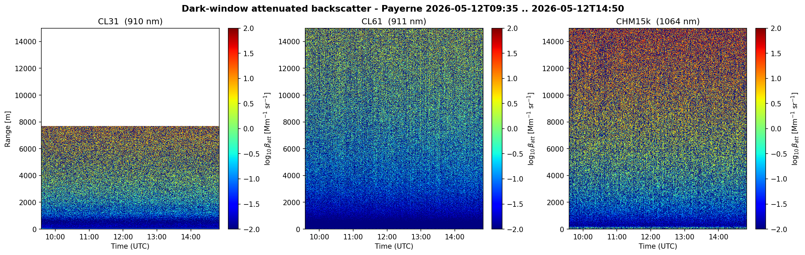
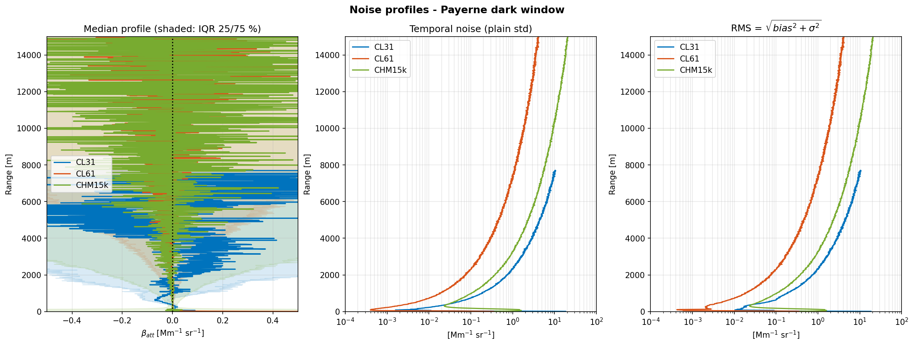
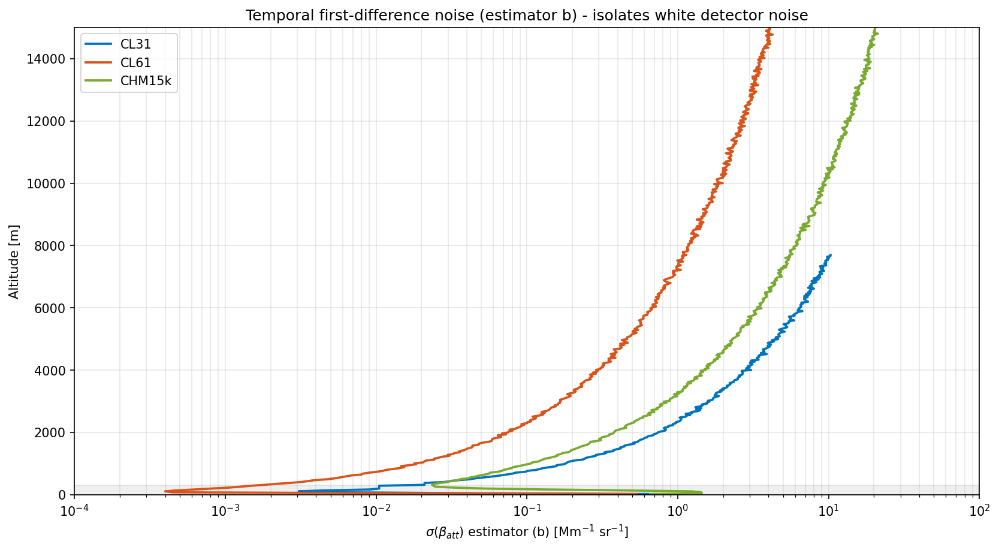

**Estimator (b) noise σ(β_att) at probe altitudes [Mm⁻¹ sr⁻¹]** *(500–2000 m rows are upper bounds in this
uncovered-L1 reproduction; the 4–7 km mean is the representative detector-noise floor):*

| Altitude [m] | CL31 | CL61 | CHM15k |
|---|---|---|---|
| 500 | 0.04193 | 0.004721 | 0.03579 |
| 1000 | 0.1887 | 0.01803 | 0.1079 |
| 2000 | 0.7863 | 0.07637 | 0.3926 |
| 3000 | 1.531 | 0.1745 | 0.8256 |
| 5000 | 4.393 | 0.483 | 2.256 |
| mean 4–7 km | 5.47 | 0.5731 | 2.924 |

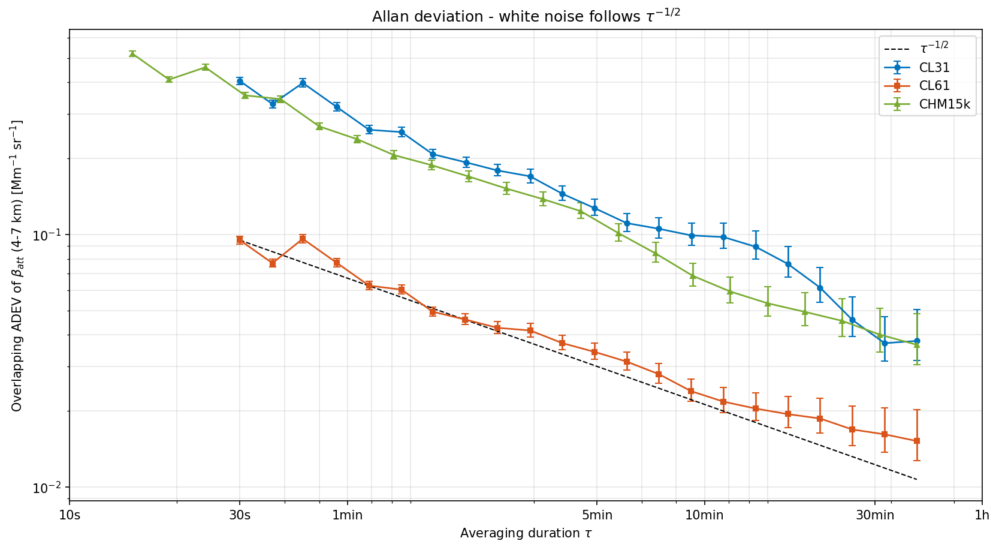
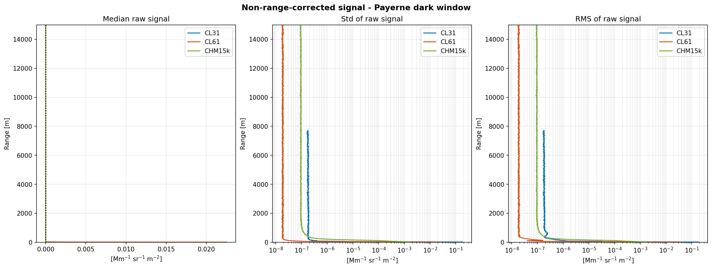
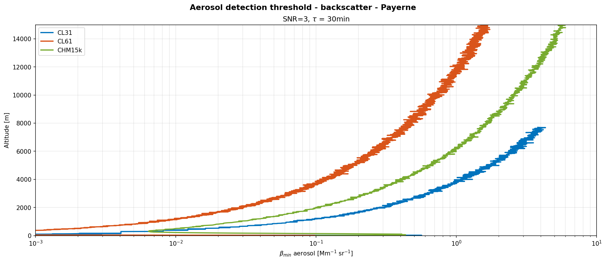
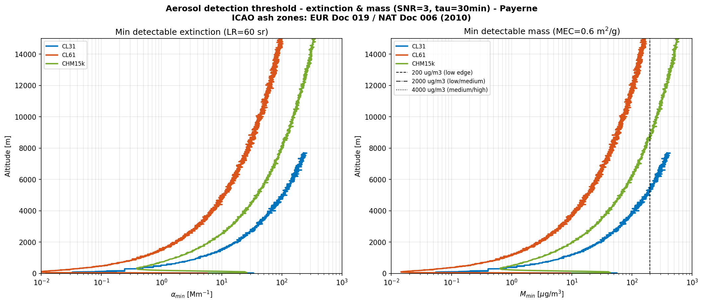

**Detection thresholds at SNR=3, ash: LR=60 sr, MEC=0.60 m²/g, τ = 30 min** (β in Mm⁻¹sr⁻¹, α in Mm⁻¹, M in
µg/m³):

| Instrument | z [m] | β_min | α_min | M_min |
|---|---|---|---|---|
| CL31 | 500 | 1.626e-02 | 9.754e-01 | 1.6 |
| CL31 | 1000 | 7.322e-02 | 4.393e+00 | 7.3 |
| CL31 | 2000 | 3.056e-01 | 1.834e+01 | 30.6 |
| CL31 | 3000 | 5.958e-01 | 3.575e+01 | 59.6 |
| CL31 | 5000 | 1.714e+00 | 1.028e+02 | 171.4 |
| CL61 | 500 | 1.829e-03 | 1.097e-01 | 0.2 |
| CL61 | 1000 | 6.994e-03 | 4.196e-01 | 0.7 |
| CL61 | 2000 | 2.967e-02 | 1.780e+00 | 3.0 |
| CL61 | 3000 | 6.787e-02 | 4.072e+00 | 6.8 |
| CL61 | 5000 | 1.884e-01 | 1.130e+01 | 18.8 |
| CHM15k | 500 | 9.806e-03 | 5.884e-01 | 1.0 |
| CHM15k | 1000 | 2.959e-02 | 1.775e+00 | 3.0 |
| CHM15k | 2000 | 1.077e-01 | 6.462e+00 | 10.8 |
| CHM15k | 3000 | 2.267e-01 | 1.360e+01 | 22.7 |
| CHM15k | 5000 | 6.200e-01 | 3.720e+01 | 62.0 |

**ICAO-threshold detection altitude (night, τ = 30 min, SNR = 3):**

| Instrument | 200 µg/m³ | 2000 µg/m³ | 4000 µg/m³ |
|---|---|---|---|
| CL31 | 5500 m | 7700 m | 7700 m |
| CL61 | 15710 m | 15720 m | 15720 m |
| CHM15k | 8841 m | 15345 m | 15345 m |

This per-station ICAO detection altitude is the headline scalar that populates the network map on the dashboard.

---

# 6. Cross-cutting take-aways

- **One physical principle underlies the whole theme.** In `P = rcs_0/z²` the detector noise is homoscedastic;
  the electronic offset and the 1/O overlap amplification are **signal-independent** and thus separable from the
  signal-dependent shot (∝P) and turbulence (∝P²) terms by a per-gate regression. The hood, the clear-sky noise
  retrieval and the ambient-noise estimator (b) are three windows onto the same detector physics.

- **The Payerne CL61–CHM15k near-range tilt (200–900 m) is RESOLVED**: unit-specific near-range
  (overlap-normalization) differences, **dominated by the CHM15k TUB140016 static-overlap module** (a static
  reference-overlap error the temperature model cannot capture). Three independent estimates of the TUB140016
  overlap (hood-noise onboard, CL61-tilt true, CHM-only high-window method B) coincide at 600 m. The correction
  chain — **water vapour, molecular T/p, Ångström centre, electronics — is EXONERATED**, each quantified and
  cleared. A **generic reference overlap (TUB120011, complete ~750 m) under-corrects the real ~1500 m overlaps**
  — this is the mechanistic root of the tilt, confirmed network-wide by the clear-sky noise retrieval.

- **The clear-sky noise method cannot build a temperature–overlap model** (night-only + `temp_int` seasonal
  confound; `temperature_optical_module` Peltier-locked). Its win is the **static reference overlap**, validated
  against the Payerne hood (2 %) and four manufacturer `.cfg` files (0.7–5.7 %); the Hervo-2016 temperature
  model remains the right tool below ~300 m.

- **GOTCHA (offset/dark channels): use the MEASURED terminal-hood dark** (`cl31_b_dark.npz`), **NOT** the
  ~30×-smaller clear-night ripple — only **Payerne** has a hood. **CL61 and CHM15k darks are negligible**
  (+0.1…+0.3 % / −0.05…−0.65 %); the **CL31 hood dark is large and negative (−14 … −60 %)** across 450–600 m and
  cannot be substituted by the clear-night ripple, which recovers only the range-flat/periodic part.

- **Which offset to correct depends on the anchor**, not the offset's significance: correct the **CL61** (its
  native Rayleigh was biased +12.6 % → +0.2 %); **retain the native CHM15k** (already agrees with the
  cloud/EARLINET anchor at −1.5 %; correcting pushes it −6.3 % off); the **CL31** cannot Rayleigh-fit at all
  (cloud-calibrated). The **strong-signal O'Connor cloud method is offset-immune** (median shift −0.00 % / +0.01
  %) — the robust cross-instrument anchor.

- **Network offset coefficients** (`network_offset_coeffs.csv`): correctable = split-half reproducible (≥0.6) +
  significant (≥1.5 %) + undamped (≥0.5). **CL51 4/11, CL31 6/10, CL61 0/10** (CL61's undershoot needs a hood).
  The correction is a full-altitude gate-fold, a weak-free-troposphere aerosol-profile fix that does not touch
  the cloud calibration.

- **Ambient night noise = the hooded dark within 0–10 %** at all altitudes for all three instruments (clear
  nights are a free dark measurement); estimator (b) (first difference /√2) is the recommended network
  estimator, and the parametrised model σ(z)² = σ_night(z)² + (k·z²)² attaches a detection limit to every
  profile without continuous estimation. Instrument sensitivity ranking (noise density at 3 km night): **CL61
  ≫ CHM15k ≫ CL31**.
