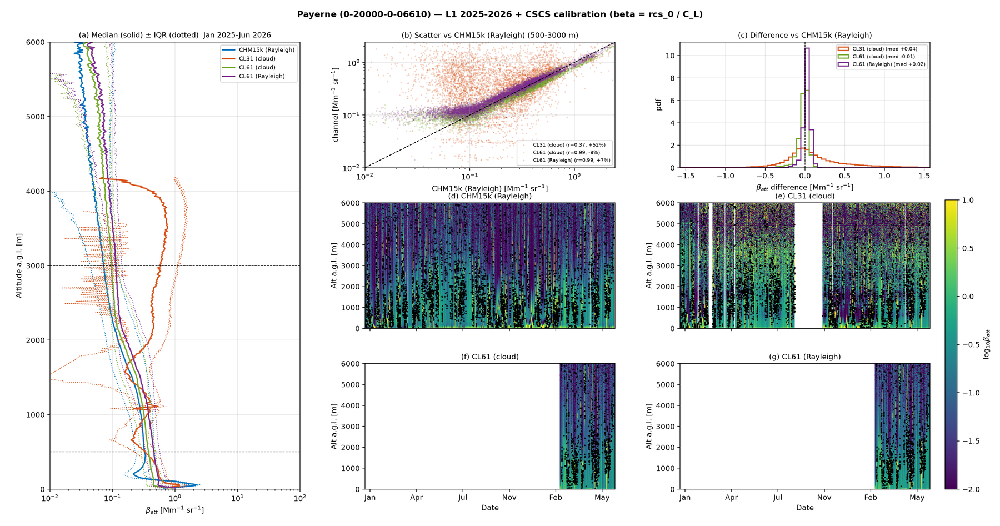
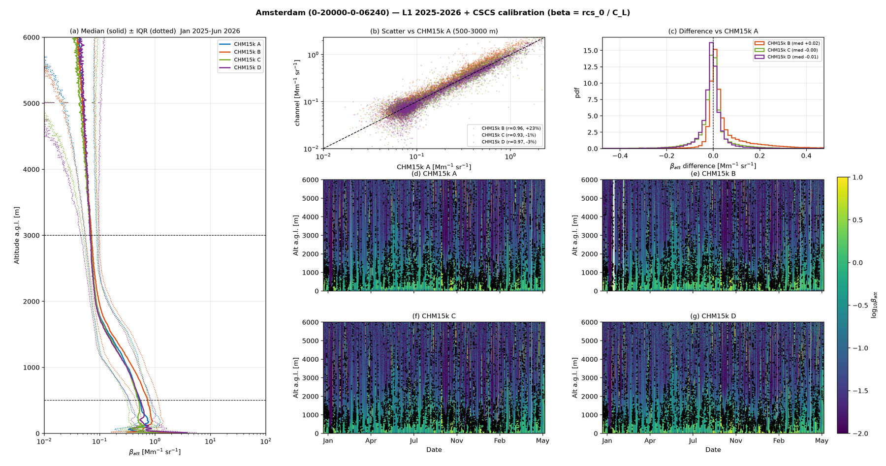

# Operations, deployment and pipeline architecture

*Consolidated 2026-07-10 (M. Hervo, MeteoSwiss E-PROFILE ALC). Merges: phase_b_readonce_design.md, cscs_omb_sens_runbook.md, ewc_dashboard_deployment.md, ceiloclass_integration_plan.md.*

This is the durable reference for **how the E-PROFILE ALC calibration pipeline is built, deployed
and operated**: the read-once / share-many software architecture that underpins the daily runner,
the CSCS runbook for the OmB and sensitivity products, the European Weather Cloud dashboard
deployment, and the (still-planned) Cloudnet target-classification integration.

**Operational location (authoritative).** The pipeline and dashboard run on
**`zueub434.meteoswiss.ch`** under **`/data/zue/E_PROFILE/ALC/Calibration/`** (code in
`ALC_calibration_v2.0_code/`, fullcal output in `ALC_calibration_v2.0/`, dashboard build in
`dashboard/`). The former `/mnt/amaroc_data/alc_calib` NAS is **retired** (inode ceiling) and must
not be written to. All operational paths are exported by `ops/config.sh` as `ALC_*` env vars.

## Table of contents
1. [Pipeline architecture — read-once / share-many](#1-pipeline-architecture--read-once--share-many)
2. [Daily operational flow](#2-daily-operational-flow)
3. [CSCS runbook — CAMS 0.4° + OmB + sensitivity (resumable)](#3-cscs-runbook--cams-04--omb--sensitivity-resumable)
4. [EWC dashboard deployment](#4-ewc-dashboard-deployment)
5. [Cloudnet target classification (`ceiloclass`) — integration plan/status](#5-cloudnet-target-classification-ceiloclass--integration-planstatus)

---

## 1. Pipeline architecture — read-once / share-many

**Status: IMPLEMENTED.** What earlier lived here as a "Phase B design" is now the live pipeline.
Each instrument-day loads its **L1 once** and **CAMS once**, coarsens to a shared working grid,
computes the water-vapour (WV) transmission once, and fans that single in-memory object out to
Rayleigh + cloud + housekeeping + OmB + sensitivity. The realizing commits are
`Read-once shared loader (Phase B1+B2): InstrumentDayData + WV-once`,
`Phase B5: wire Rayleigh + cloud to ONE shared night read`,
`Phase B5: wire OmB + sensitivity to the shared read`,
`Coarse 30s/10m everywhere: Rayleigh/cloud/OmB/sens all consume the shared working grid`,
`Consolidate to one L1/L2 reader`, `Split the cloud calibration module: extract
_water_vapor.py + _filters.py`, and `Rename for clarity: build_cloud_input, load_l2_data,
run_network_calibration`.

The concrete artefacts on disk today: `calibration/io/instrument_day.py` (the shared loader +
`InstrumentDayData` dataclass + `average_ceilometer_data`), the split cloud module
(`calibration/cloud/calibration.py` + `calibration/cloud/_filters.py`, with the WV code
co-located in `calibration/water_vapor_correction/cloud_water_vapor.py`), one L1/L2 reader, and the
renamed entry points `build_cloud_input` / `load_l2_data` / `run_network_calibration`.

### 1.1 The two efficiency questions that drove the design (answered)

| Question | Verdict | Evidence / outcome |
|:--|:--|:--|
| **Compute WV two-way transmission once?** | **Yes.** | It used to be computed 3× per day (`rayleigh/calibration.py`, `cloud/calibration.py`, `omb/omb.py` each called it independently). It is a pure function of (CAMS WV profile, λ, range grid, CAMS times) → now computed **once per 910 nm day** on the shared grid and shared. CHM15k (1064 nm) skips WV. |
| **Lazy-load L1?** | **No — read-once is the lever.** | L1 opens with `netCDF4.Dataset`; every consumer needs the **full** `rcs_0`, so there is nothing to skip lazily. netCDF4 is kept (fast, no xarray/pandas). |
| **Lazy-load CAMS?** | **Yes — big lever.** | The 0.4° monthly file is ~8.5 GB, chunked. A closest-cell lazy read is **~2.7 s** vs a full-domain **~41 s** (**~15×**). Read the one cell once, share. |

### 1.2 One read, in-memory views

```
load_instrument_day(stream, dates)   # calibration/io/instrument_day.py
├─ L1  : netCDF4, read the day/night span ONCE → native arrays
├─ CAMS: xarray .sel(nearest).values ONCE → single-cell columns (t,q,z,lnsp,aer532/1064)
└─ build InstrumentDayData:
     • native  rcs/cbh/HK/range/time             (for sensitivity & OmB noise fidelity)
     • working = coarsen(native)                 (default 30 s / 10 m; Rayleigh, cloud, classification, HK)
     • CamsProfile: heights (a/b + lnsp), T, P, n_wv, aerosol β   (closest cell)
     • wv_transmission(z, cams_time): two-way WV transmission, computed ONCE on the working grid (910 nm)
```

Consumers **never re-open a file** — they select the view they need. The expensive operations
(L1 full read, CAMS 8.5 GB open, WV HITRAN convolution) each happen exactly once per
instrument-day. Because every step for one stream already runs inside a single subprocess
(`_process_stream` in `scripts/run_network_calibration.py`), this was threading one object through
the existing `_do_*` steps — **not** a process re-architecture. The working grid is built lazily
(`build_working`) so the shared read carries no overhead for paths that only need the native view.

### 1.3 Fan-out — which view each consumer uses

```
L1 ─┐                          ┌─▶ Classification (working)   [planned; see §5]
    ├─▶ load_instrument_day ──▶│─▶ Rayleigh cal   (native fit window)
CAMS┘   read once + coarsen    │─▶ Cloud cal      (working / slice_to_date)
        → InstrumentDayData    │─▶ Housekeeping   (working)
                               │─▶ OmB            (native view)
                               └─▶ Sensitivity    (native view)
                                        └─▶ Outputs: CSV · curtains · nc
```

In the runner today: Rayleigh consumes `idd.working`/`.native` in its fit window, cloud uses
`.slice_to_date()`, and OmB/sensitivity use `.slice_to_date().to_omb_dict()` on the **native**
arrays. The rule that decides the split:

- **Classification & housekeeping** use the **coarsened** (working) stack.
- **Rayleigh / cloud** keep their native-resolution view of the same arrays in the fit window.
- **Sensitivity and OmB's SNR screen** read the **native view**. This is deliberate: block-averaging
  *N* gates drops per-gate noise by √*N*, so feeding the coarsened stack to sensitivity would report
  a *better* detection limit than the instrument achieves natively. The native view is free — it is
  already in memory from the single read.

### 1.4 Resolution normalization — dynamic, per-file, shared

Resolution varies by station and over time, so it is **never** hardcoded per instrument type; the
coarsening factor is derived from *each file's own* grid against the config target (default
**10 m / 30 s**; the time floor was moved from 15 s to 30 s in commit
`Default the working-grid time floor to 30 s`).

```python
def coarsen_factor(native, target, tol=0.9):
    # 1 unless the file is meaningfully finer than the target; then nearest whole factor.
    return 1 if native >= tol * target else max(1, round(target / native))

def block_average(a, ft, fr):                 # simple mean of consecutive bins, no interpolation
    nt, nr = a.shape
    a = a[:(nt // ft) * ft, :(nr // fr) * fr]
    return ma.mean(a.reshape(nt // ft, ft, nr // fr, fr), axis=(1, 3))
```

Only the config target is a knob; the factor is per-file. Measured, for the 10 m range target:

| Type | native | factor | working grid |
|:--|:--|:--|:--|
| CHM15k | 15 m / 15 s | r÷1 t÷1 | unchanged |
| CL31 / CL51 | 10 m / ~30 s | r÷1 t÷1 | unchanged |
| **CL61** | **4.8 m** / 30 s | **r÷2** t÷1 | **9.6 m** (≈50 % fewer range cells) |

Range averaging preserves the layers (9.6 m still resolves thin liquid); time stays ≥ 15 s so
nothing is smeared. Coordinates (`range`, `time`) are block-averaged too; per-profile fields
(`cbh`, HK) are time-averaged only (median of the finite values for CBH — it is a height, not a
signal). The rule therefore **only bites CL61**, which is the expensive instrument (3276 gates).

*The tolerance guard matters:* `tol=0.9` keeps CHM15k at ~14.99 s from being halved by a
floating-point rounding of the 15 s target. A second guard removed a latent double-average — the
cloud step used to hardcode `average_time_s=30, average_range_m=10`; it now consumes the shared
working grid instead (and may further time-average *on top* of it if it still wants 30 s, which is
cheap on the already-small array).

### 1.5 CAMS — closest cell, lazy, once; WV once; correct ground

- **One lazy cell read.** `ds = xr.open_dataset(f); sub = ds.sel(latitude=lat, longitude=lon,
  method="nearest")` then pull `t, q, z, lnsp, aerbackscatgnd532, aerbackscatgnd1064` as `.values`
  — ~2.7 s vs ~41 s full-domain. Uses `ALC_CAMS_DIR` (operational monthly **0.4°**) with a per-month
  **1°** fallback; both are L137 model levels, so vertical resolution is preserved (applies to the
  cloud-WV correction and OmB alike).
- **Heights.** `z`/`lnsp` are *surface* fields → per-level pressure from the L137 a/b coefficients
  and `exp(lnsp)`, then hydrostatic height (reuses `water_vapor._cams_levels`).
- **Ground extrapolation (temperature).** Below the lowest CAMS level, use the **standard ISA lapse
  (6.5 K/km) anchored at the lowest level**, *not* a two-point slope. The ~20 m-spaced, often
  surface-inverted lowest levels give a wild slope (→ −110 °C at the surface if used naively). With
  the 0.4° cell the extrapolation span is only ~300 m (e.g. station 490 m, cell surface ~789 m), and
  T then matches Cloudnet to ≤ 1 °C from ~1 km up. `n_wv` keeps the existing constant-fill below
  surface.
- **WV transmission once (910 nm).** `two_way_wv_transmission` is computed on the **working grid** at
  the CAMS time steps a single time and stored in `InstrumentDayData`; Rayleigh, cloud and OmB each
  time-interpolate it to their grid. This is only possible because they now share one range grid.
- **Cross-stream pre-pass (future, not blocking).** ~400 European streams share the *same* box
  file. A pre-pass that extracts all station columns in one open (2.7 s × 400 → one pass) is a
  further win beyond the per-stream read-once — noted as a future lever, not yet implemented.

### 1.6 Output-preservation and performance envelope

The refactor was flag-gated and diff-checked step by step: old vs new calibration/OmB/sensitivity
CSVs must match. The **only** intended numeric change is CL61 range 4.8 → 9.6 m for Rayleigh/cloud
(ΔC_L expected ≪ 1 % on CL61 nights); CHM15k/CL31/CL51 have factor 1 → bit-identical; sensitivity
and OmB use the native view → unchanged. Performance: L1 opens 3–5× → 1×, CAMS 2–3× → 1× (and
41 s → 2.7 s wherever a path had been reading full CAMS fields), WV 3× → 1×. Memory holds the native
plus the working view (CL61 ~0.5 GB/worker — fine at 6 workers).

> The **L1 attenuated-backscatter curtains** below illustrate the raw input the pipeline reads once
> per instrument-day (Payerne CHM15k/CL31/CL61 triple; Amsterdam CL51). These are the `rcs_0`
> arrays that `load_instrument_day` coarsens to the working grid before fan-out.





---

## 2. Daily operational flow

The production daily run is driven entirely by the `ALC_*` env vars in `ops/config.sh` (the single
file an operator edits). A `cron 0 15 * * *` fires `ops/run_daily.sh` → `ops/ops_daily.py`, which:

1. **Refresh census** (`scripts/refresh_census.py`) — scan the L1 archive and merge new stations into
   `validation/scope_l1_2026_census.json` (new streams appended, existing never dropped), so a
   newly-installed station is calibrated the same day.
2. **Fetch CAMS** for D-1 (ADS download, retried). A separate `cron 02 06 * * *`
   (`ops/prefetch_cams.sh`) pre-downloads the day's regional CAMS boxes ahead of the 15:00 run.
3. **Calibrate** D-1 across the network: `scripts/run_network_calibration.py --sens --omb`
   (Rayleigh + liquid-cloud + Kalman; per-day caches in `calibration/incremental.py` with a
   regression guard so a missing cache never overwrites a rich history; MERGES into per-stream CSVs,
   no overwrite).
4. **Update operational coefficients** (`extract_l2_opcoeff.py` → `operational_coefficients.csv`).
5. **Build dashboard** (`build_dashboard.py --changed-only`, bucket-mode: images referenced by
   bucket URL).
6. **Publish** (`ops/publish.sh`: images → S3 bucket `eprofile-alc-dashboard`, HTML → web VM, then
   prune local diagnostic PNGs once they are on the bucket).

Target days = D-`ALC_DAY_LAG` (=1) plus the last `ALC_BACKFILL_DAYS` (=5) unprocessed days, so the
run is **self-healing**. Dates are UTC. E-PROFILE **L1 for a given day lands the next morning**
(~03:30Z), so a daily run must fire after that (the 15:00 cron is fine; a pre-dawn run would find no
data for "yesterday"). This is also why OmB and sensitivity are computed for **D-1** — OmB needs that
day's CAMS forecast, which publishes ~next day.

---

## 3. CSCS runbook — CAMS 0.4° + OmB + sensitivity (resumable)

End-to-end steps to produce the Observation-minus-Background (OmB) and instrument-sensitivity
products for the E-PROFILE network on **CSCS (balfrin)**, and rebuild the dashboard. Everything is
**resumable** — re-run any step after an interruption.

> **Why this can't be launched from the dev machine:** the ADS download and the CSCS jobs must run
> on CSCS (internet/ADS auth + the cluster filesystem). The dev machine has no CSCS session. Run the
> steps below on CSCS.

### 3.0 Environment (once per shell / in `ops/config.sh`)
```bash
conda activate alc
export ALC_L1_ROOT=/capstor/scratch/<user>/E-PROFILE_L1          # L1 archive (<wmo>/<YYYY>/<MM>/)
export ALC_L2_DIR=/capstor/scratch/<user>/E-PROFILE_L2           # L2 (for the OmB operational overlay)
export ALC_CAMS_DIR=/capstor/scratch/<user>/CAMS                 # CAMS_Beta_*.nc (this runbook fills it)
export ALC_FULLCAL_DIR=/capstor/scratch/<user>/fullcal_l1_2026   # calibration + OmB/sens outputs
export ALC_CENSUS=$REPO/validation/scope_l1_2026_census.json
export ADS_API_KEY=<your-ADS-key>            # or have ~/.cdsapirc with the key
export HTTPS_PROXY=http://proxy.cscs.ch:8080 # only if CSCS requires a proxy for outbound HTTPS
```

### 3.1 CAMS 0.4° download (aerosol + T/RH) — run on a LOGIN / DATA node
The ADS download is network-bound and needs internet, which CSCS **compute nodes lack**. Run it on
a login/data-mover node inside `tmux`/`screen` (it is resumable, so a dropped session is fine).
Native 0.4° grid (`REGRID_TO_1DEG=False`), Europe+Arctic box `AREA=[80,-30,27,45]` covering 421/427
stations.
```bash
tmux new -s cams
python scripts/download_cams_cscs.py --start 202501 --end 202612
```
- ~5–8 GB per monthly file (0.4°), ~100–200 GB for 24 months; ADS is queued → can take **days** of
  wall-clock. The per-month skip (file present AND has backscatter) makes re-runs safe.
- The 6 non-European affiliates (Canada×3, Bonaire, NZ×2) are outside the box → no OmB (sensitivity
  still works for them; it needs no CAMS aerosol). For those, either accept sensitivity-only or run a
  separate small-box download (`ALC_CAMS_AREA="N,W,S,E"`).

### 3.2 Calibration (only if not already done for 2025–2026)
The OmB/sens pass REUSES the existing per-stream Kalman, so this is only needed if the calibration
has not been run for the window. SLURM array as usual (~3–5 min/month).
```bash
python scripts/run_network_calibration.py --start 20250101 --end 20261231 \
    --per-type 0 --workers <N> --ignore-coverage
```
This writes `<key>_cal.csv`, `<key>_kalman.csv`, `<key>_hk.csv` per stream.

### 3.3 OmB + sensitivity (reuse the Kalman) — needs step 3.1 done
```bash
python scripts/run_network_calibration.py --no-cal --omb --sens \
    --start 20250101 --end 20261231 --per-type 0 --workers <N> --ignore-coverage
```
- Reads `<key>_kalman.csv` (no recalibration), writes per stream: `<key>_omb.png` + `<key>_omb.csv`
  and `<key>_sens.png` + `<key>_sens.csv`.
- A stream with no Kalman C_L, or no CAMS-with-backscatter for the month, is **skipped** (no
  fabricated numbers). Resumable on the `_sens.csv` marker.
- **Run month-by-month** (e.g. `--start 20250101 --end 20250131`, then 20250201…): OmB resolves the
  CAMS file for the window's month, so a single multi-month window only compares the end month.
  Sensitivity is unaffected by this, but month-aligned runs keep both correct and the figures show
  one month of "evolution over time".
- Memory: OmB loads a full month of native L1 per stream (CL61 ~2 GB → float64 copies in
  `compute_omb` ~9 GB). Size the SLURM task memory accordingly, or lower `--workers`.

### 3.4 Real-time / daily (D-1)
```bash
Y=$(date -u -d 'yesterday' +%Y%m%d)
python scripts/run_network_calibration.py --start $Y --end $Y --ignore-coverage   # cal + Kalman update
python scripts/run_network_calibration.py --no-cal --omb --sens --start $Y --end $Y --ignore-coverage
```
(OmB needs that day's CAMS forecast, which publishes ~next day — hence D-1.)

### 3.5 Dashboard
```bash
python scripts/build_dashboard.py --fullcal $ALC_FULLCAL_DIR \
    --manifest $ALC_CENSUS --l2dir $ALC_L2_DIR --start 20250101 --end 20261231
```
Picks up `<key>_omb.csv`/`<key>_sens.csv` for the two new summary maps (mean OmB bias, ICAO
detection altitude; markers symboled by instrument type) and embeds `<key>_omb.png`/`<key>_sens.png`
on each station page.

> **CSCS partition reminder (from ops):** on balfrin, submit CPU-only partitions (`pp-short`,
> `pp-serial`, `postproc`, `pp-long`, …). **Never** use the GPU partitions — a recent GPU batch cost
> > $10,000. If a job seems to need a GPU, stop and ask first.

---

## 4. EWC dashboard deployment

**Deployed 2026-06-26.** Live: **https://alc-calib.ch-meteoswiss-emermet.f.ewcloud.host/**

Publish-only port of the calibration monitoring dashboard onto the **European Weather Cloud (EWC)**:
the site is *built* where the calibration runs (on-prem / CSCS balfrin); only *publishing* lives on
the EWC. The bulky per-night diagnostic images go to a public S3 bucket; the static HTML is served by
a small VM. The HTML points at the images by absolute URL, so the browser fetches them straight from
object storage.

```
 build host (balfrin / on-prem)                EUROPEAN WEATHER CLOUD (cci2, meteoswiss-emermet)
  build_dashboard.py --img-base-url ┌── rsync HTML ──▶ VM alc-calib (136.156.139.31)
   -> dashboard_ewc/ (HTML+images) ─┤                  nginx /var/www/alc, Let's Encrypt TLS (443)
                                     └── aws s3 sync ─▶ bucket eprofile-alc-dashboard (public-read)
                                        (diag/ombsens)   object-store.os-api.cci2.ecmwf.int
 browser → HTML from the VM, images straight from the bucket (no CORS needed for )
```

### 4.1 Components

- **Bucket** `eprofile-alc-dashboard` on cci2 (`object-store.os-api.cci2.ecmwf.int`), public-read
  (anonymous `s3:GetObject`, no listing — see `ops/ewc_bucket_policy.json`). Public base URL =
  `https://object-store.os-api.cci2.ecmwf.int/eprofile-alc-dashboard/` → this is `ALC_IMG_BASE_URL`.
  S3 keys live in Morpheus → Tools → Cypher; **region-bound to cci2**; use **path-style** addressing.
- **VM** `alc-calib` (Ubuntu 22.04, public IP `136.156.139.31`, security group `ssh-https` = 22+443).
  Login user **`hem`** (passwordless sudo via `/etc/sudoers.d/90-hem`). nginx docroot `/var/www/alc`.
  DNS `alc-calib.ch-meteoswiss-emermet.f.ewcloud.host`.
- **TLS**: Let's Encrypt ECC cert via **acme.sh** TLS-ALPN-01 on 443 (certbot's standalone does *not*
  support tls-alpn-01; only http-01/dns-01 — and port 80 is closed). Auto-renews via acme.sh cron
  with stop/start-nginx hooks. nginx redirects 80 → 443.
- **Code**: `ALC_IMG_BASE_URL` / `--img-base-url` makes the diagnostic, OmB/sensitivity and
  flag-example image references absolute under the bucket base (`monitoring/config.py`, `render.py`,
  `static/diag.js`, `scripts/build_dashboard.py`); empty = unchanged relative behaviour.
- **Publish step**: `ops/publish.sh` (images → bucket via rclone/aws, HTML → VM via rsync
  `--chmod=D755,F644`) + `ops/ops_daily.py` `publish()` (gated on `ALC_PUBLISH=1`, non-fatal) +
  `ops/config.sh` vars.

### 4.2 Build + first publish (run on balfrin, 2026-06-26)

```bash
source ~/ALC_rayleigh_calibration/cscs_env_2025_2026.sh
source ~/miniforge3/etc/profile.d/conda.sh && conda activate alc
python scripts/build_dashboard.py --fullcal "$ALC_FULLCAL_DIR" --out /scratch/mch/mhrvo/dashboard_ewc \
  --img-base-url https://object-store.os-api.cci2.ecmwf.int/eprofile-alc-dashboard/ \
  --opcoeff /scratch/mch/mhrvo/opcoeff.csv --oldray "$ALC_OLDRAY_DIR" \
  --l2dir /scratch/mch/mhrvo/E_PROFILE_L2 --workers 8           # 427 stations, ~5 min
# HTML -> VM (aws/rsync profile 'ewc' uses ca_bundle=/etc/ssl/ca-bundle.pem, path-style, region us-east-1)
rsync -az --delete --chmod=D755,F644 -e "ssh -i ~/.ssh/ewc_vm_key" \
  --exclude 'diag/' --exclude 'ombsens/' --exclude 'flagex/' --exclude 'calib_index.sqlite' \
  /scratch/mch/mhrvo/dashboard_ewc/ hem@136.156.139.31:/var/www/alc/
# images -> bucket (recent subset first; full set is ~212 GB)
aws --profile ewc --endpoint-url https://object-store.os-api.cci2.ecmwf.int s3 sync \
  /scratch/mch/mhrvo/dashboard_ewc/diag s3://eprofile-alc-dashboard/diag --follow-symlinks \
  --exclude '*' --include '*_202604*' --include '*_202605*' --include '*_202606*'
aws ... s3 sync /scratch/mch/mhrvo/dashboard_ewc/ombsens s3://eprofile-alc-dashboard/ombsens --follow-symlinks
```

### 4.3 Maintenance / follow-ups

- **Daily publishing**: set `ALC_IMG_BASE_URL`, `ALC_S3_REMOTE`/`ALC_S3_BUCKET` (or the aws profile),
  `ALC_VM_RSYNC_TARGET`, `ALC_PUBLISH=1` in `ops/config.sh`; `ops_daily.py` then publishes after each
  incremental build. A one-time full rebuild with `--img-base-url` is needed at cutover so every page
  carries absolute URLs. (The publish rsync intermittently returns rc=2 yet the HTML usually still
  lands; if the live site lags, just re-run `bash ops/publish.sh`.)
- **Image backfill**: the first push uploaded only **recent diag images (Apr–Jun 2026, ~35 GB of
  212 GB)**. Backfill older months by re-running the `aws s3 sync` of `diag/` without the date
  `--include` filters.
- **TLS** renews automatically (acme.sh); no action unless the DNS name changes.
- **Rotate** the bucket S3 keys in Cypher (they passed through a chat session during setup).
- **Trust note**: the Windows dev box's curl/schannel distrusts LE's ECDSA root (stale local store)
  — the cert is valid (verified from the VM); browsers are fine.

### 4.4 Rayleigh overlay on the dashboard

Station time-series charts carry **one** extra Rayleigh overlay, hidden by default
(`visible="legendonly"`, appears only when clicked in the legend), reloaded fresh each build via
`monitoring/render.py::_load_oldray`: the **v1.0 operational** series from `ALC_OLDRAY_DIR`
(`/data/pay/REM/ACQ/E_PROFILE_ALC/Calibration/rayleigh`, the raw
`ALC_calibration_<key><YYYY>.nc`).

> **Superseded 2026-07:** the earlier v1.0.2 / "v13" test overlay (`ALC_V13_DIR`) was retired and
> removed from code, config and docs. Only the single v1.0 operational overlay remains.

---

## 5. Cloudnet target classification (`ceiloclass`) — integration plan/status

**Status: PLANNED (not yet in the daily runner).** The read-once shared loader that this plan
depended on is now live (§1), but the classification consumer itself
(`_do_classification`) is **not** wired into `scripts/run_network_calibration.py` yet. This section
is the design of record for adding it. Companion code:
`…/Python/ceiloclass/payerne_eprofile_test/` (`eprofile_l1.py`, `cams_model.py`, drivers), validated
on Payerne CL31/CHM15k/CL61.

**Goal.** Run `ceiloclass` (CloudnetPy-style aerosol/cloud/ice/drizzle classification) for all
~433 E-PROFILE streams daily, show the curtains on the dashboard, drive it from **CAMS**
temperature, and have it ride along on the shared read-once `InstrumentDayData` — its inputs are
already in memory, so classification is effectively free.

### 5.1 Resolution normalization for classification (≥10 m / ≥15 s)

Classify on a grid **no finer than 10 m in range and 15 s in time**; where the native grid is finer,
block-average consecutive bins down to it. This uses the same per-file rule as §1.4; at the finer
**15 s** classification time floor the CL61 range factor is ÷3 (14.4 m) rather than the ÷2 (9.6 m)
of the 30 s operational grid. Measured per type:

| Type | Native range × time | Action | Cells saved |
|:--|:--|:--|:--|
| CHM15k | 15 m × 15 s | none | — |
| CL31 | 10 m × 30 s | none | — |
| CL51 | 10 m × 36 s | none | — |
| **CL61** | **4.8 m** × 30 s | **average 3 range gates** → 14.4 m | **67 %** |
| Mini-MPL | 30 m × 300 s | none (also: no reader) | — |

So the rule **only bites CL61** — exactly the expensive instrument (3276 gates). Averaging range ÷3
cuts its classify cost ~⅔ (measured ~80 s → ~25 s). The `tol=0.9` guard keeps CHM15k at ~14.99 s
from being halved by floating-point.

### 5.2 Classification stack (external + our adapters)

| Layer | What |
|:--|:--|
| `ceilopyter` | native readers, `Ceilo`/`CeiloRaw`, `screen_noise` (per-instrument floors), `average_time` |
| `ceiloclass` | `classify()` (adaptive β threshold, liquid/ice/depol logic), `Model`/`read_model`, `plot_classification`, `write_classification` |
| **our port** | `eprofile_l1.py` — L1 `rcs_0` → `Ceilo` (per-type β factor: CHM15k ×3e-12, CL31/51 ×1e-8, CL61 ×1.0). `cams_model.py` — CAMS → temperature `Model` (reuses the parent `cams_temperature_pressure_profile`; ISA lapse below the CAMS surface) |

Classification's β is just `rcs_0 × factor` (no new read); its temperature is the CAMS profile
already loaded for WV/molecular. So on the shared object it adds no disk I/O.

### 5.3 Rollout plan

**Phase A — standalone batch (low risk, ~1 week).** Independent of the pipeline; produces dashboard
images and validates at scale.
- Enumerate streams from `validation/scope_l1_2026_census.json` (**skip Mini-MPL** — no ceilopyter
  reader; 5 streams).
- Per stream/day: `eprofile_l1.read_eprofile_l1` → coarsen (§5.1) → `cams_model.cams_to_model` (0.4°
  `ALC_CAMS_DIR`, 1° fallback) → `classify` → curtain PNG.
- Parallelize over streams (ThreadPool, like `run_network_calibration`).
- **Compute:** ~110 min/day single-thread → **~10–15 min at 8–16 workers**; CL61 ÷3 trims it.
- **Storage:** ~150 KB/curtain × 433 ≈ **65 MB/day ≈ 24 GB/yr**; prune-after-upload as today.

**Phase B — fold into the daily runner.** Add `--classify`; classification becomes a consumer of the
already-live shared `InstrumentDayData`. Do it behind a flag and diff outputs against Phase A to
confirm equivalence. This is the one remaining piece — the read-once refactor it was paired with is
done.

### 5.4 Operations integration

- `ops/config.sh`: add `ALC_CLASSIFY=1` (+ optional `ALC_CLASSIFY_MAXY`, coarsening targets).
  `ALC_CAMS_DIR` (0.4°) already exists — reuse it.
- `ops_daily.py` / `run_network_calibration.py`: pass `--classify`; add `_do_classification` after
  the shared load; write the curtain into the per-station `plots/` dir with the existing
  `<date>_<wmo>` tag convention.
- **910 nm nights without usable CAMS**: classification needs temperature only for the ice/liquid
  split — fall back to dry-bulb or skip the phase gracefully (never hard-fail the stream). These are
  the same nights the WV correction already flags. (WV itself is mandatory for 910 nm calibration; a
  no-CAMS 910 nm night is flagged, never calibrated WV-free — classification degrades gracefully on
  the same nights rather than blocking the stream.)
- **Mini-MPL** (5 streams): skip until a reader is added.

### 5.5 Dashboard integration

- Render the curtain in repo style (reuse `ceiloclass.plot` or a `calibration/plotting.py`
  `plot_classification_curtain`), saved as `<tag>_classification.png`.
- `monitoring/render.py` already **auto-discovers** `plots/`; add a "Classification" panel per
  station (day-picker reuse). `ops/publish.sh` syncs it to the S3 bucket unchanged. **~1 day.**

### 5.6 Bonus — classification → Rayleigh screening

Once the mask exists per instrument-day it is ~free to feed the fit screening. Injection point:
`calibration/rayleigh/molecular_methods.flag_contaminated_cells` (union the aerosol/cloud/ice mask
into the existing MAD / scattering-ratio gate). **Validated on CL61 2026-03-06**: a persistent
0.2-depol layer at 2.5–3.7 km — weak in backscatter, so it slips the scattering-ratio gate — is
flagged decisively via depol, and would have contaminated a 3.5–4.5 km fit window in 99.7 % of
profiles. **Value is concentrated in the 13 CL61s** (depol); marginal for single-channel
CL31/CHM15k/CL51. Ship it as an **overlay/diagnostic first**, gate only where the overlay shows it
beats the current screen.

### 5.7 Effort, risks, recommendation

| Item | Effort |
|:--|:--|
| Phase A standalone batch + dashboard images | **~1 week** |
| CAMS→model (done) + resolution rule (done) | — |
| Phase B fold into runner (shared-load refactor already done) | ~few days |
| Rayleigh-screening overlay (CL61) | ~2–3 days |
| **Total to fully integrated + dashboard** | **~1.5–2 weeks** (down from the original ~2.5–3.5 wk, since the read-once refactor is complete) |

**Risks & mitigations.**
- *Refactor regression* — the shared load touches every step; it is already flag-diffed and live, so
  adding classification is additive. Still diff CSV outputs before/after (must stay bit-identical for
  cal/OmB/sens).
- *Coarsening vs calibration* — Rayleigh/cloud stay on their native view; only the classification/HK
  view is coarsened, so the rule can't shift calibration numbers.
- *CAMS orography in complex terrain* — near-surface T bias (see the WV-resolution study); irrelevant
  to the Rayleigh fit (3.5–5 km), matters only for boundary-layer classification.
- *Compute* — classification (12–18 s) dwarfs the calibration (1–4 s); it becomes the new
  bottleneck. Parallelism + CL61 coarsening keep the daily batch ~10–15 min.

**Recommendation.** Ship **Phase A** first — standalone curtains on the dashboard using CAMS. It is
de-risked (touches nothing operational), delivers the visual immediately, and doubles as the scale
test for the §5.6 screening. Then wire **Phase B** onto the now-live shared `InstrumentDayData` as a
separate, output-preserving change. Wire the Rayleigh screening for **CL61 only**, after the overlay
validation.
