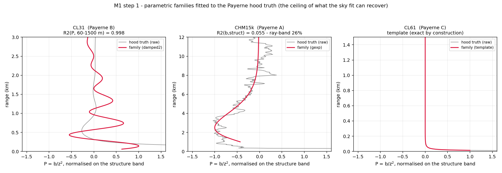
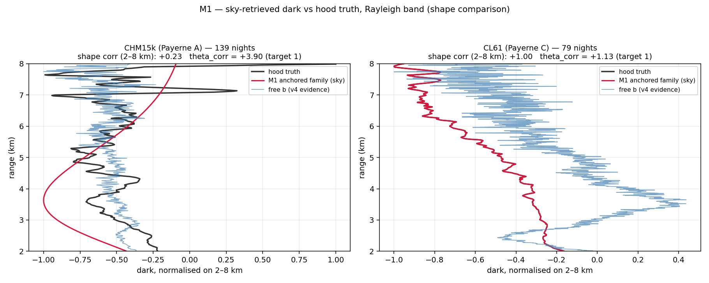
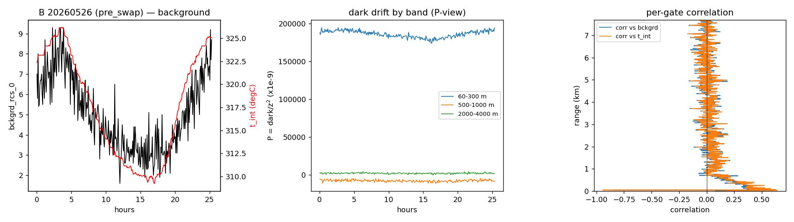
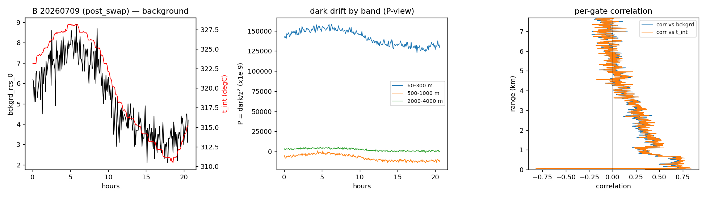
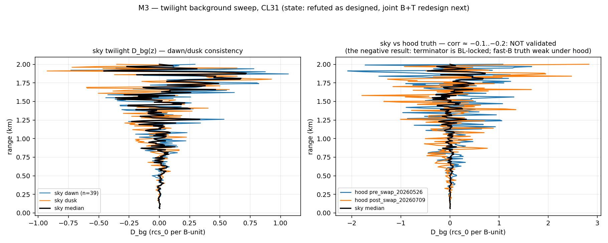
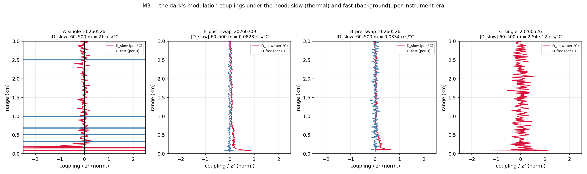

# Remote retrieval of the ceilometer electronic baseline — campaign report (M1 + M3)

**2026-08-20 · branch `remote-dark` · code `remote_dark/` · outputs
`C:/DATA/Projects/202606_E-PROFILE_calibration/remote_dark/`**

Aim (operator's brief): estimate the electronic dark structure of every network instrument
**without a site visit**, verified against the Payerne termination-hood measurements. Plan and
methodology selection: `14_remote_dark_methodologies_plan.md`; session log:
`15_remote_dark_m1_m3_progress.md`. This report is the campaign synthesis: every number below
comes from a run on real data, and the negative results are reported with the same weight as the
positive ones — they are the fence posts of what a sky-only method can ever do.

---

## 1. Executive summary — one verdict per instrument type

| type | remote dark from one station's sky | route forward |
|---|---|---|
| **CL61** | **CLOSED.** Shape corr +1.00 vs hood over 2–8 km; injection-corrected amplitude θ_corr = **+1.13** (target 1) from 105 clear nights. The remote retrieval reproduces the hood within ~13 %. | productise M1 as-is; network rollout possible now |
| **CHM15k** | **Amplitude not closable from one station** — and now *measured* rather than argued: the injection self-test recovers a true dark at gain 0.48 while the raw estimate carries θ_raw ≈ 2.5 of contamination (aerosol/misfit projecting onto the dark's shape). Near-range shape is recovered (corr +0.98); the 2–8 km amplitude needs the network. | **M2** (the network as the hood) |
| **CL31** | **No sensitivity via the molecular route, proven**: injection gain −0.03 — an injected true CL31 dark is invisible to the clear-night estimator (910 nm night SNR; the dark lives in the aerosol-dominated near range the regression cannot model). | gate-fold ripple (already network-proven) + M3 couplings + M2 |

The self-test is the methodological product of the campaign: **no retrieved amplitude is reported
without the estimator's own measured gain on a known injected dark.** It validated the CL61
number, quantified the CHM15k wall per-stream, and stopped a meaningless CL31 number from
existing.

## 2. The truth base: Payerne hood library

Seven CL31 sessions, six for CHM15k and CL61 (logbook in `rayleigh_availability/dark_profiles.py`),
including two multi-hour diurnal cycles (26–27 May ~25 h for A/B/C; 09–10 Jul ~21 h for the
post-swap B). The pooled profiles live in `dark_profiles_payerne.npz` with **two views**:
`_b_rcs` (rcs_0 units — the subtractable product) and `_b` (P = b/z², the electronics' natural
view). Confusing the two cost half a session (§6.1) and is now impossible to repeat silently:
the loader names them.

The CL31 optic-block swap of 2026-07-07 splits its record into two instruments (gain ×2.255) —
every comparison in this campaign is era-consistent.

## 3. M1 — physics-anchored parametric retrieval

### 3.1 The families and their ceilings

Per type, a parametric family whose shape comes from the electronics, fitted to the hood truth:

| type | family (P-view) | ceiling vs hood |
|---|---|---|
| CL31 | flat + two damped resonances (9 par) | R²(P, 60–1500 m) = **0.998** — the near-range ring is fully representable |
| CHM15k | **peaked** gamma-exponential −A·(z/1 km)^k·e^(−z/τ) | R²(b) 2–8 km = 0.78; peak at k·τ = 2.7 km and the ~9 km sign flip reproduced |
| CL61 | hood template × amplitude | exact by construction |

Two structural findings along the way: the hood's CHM15k P-view **peaks** at ~3 km — a monotone
exponential cannot, which is why the first prior failed; and below 1 km the CHM15k hood shows a
*positive* P spike that is overlap territory, not subtractable dark — the family fit starts at
1 km on purpose. The CL31's Rayleigh-band remainder is the gate-locked ripple, which belongs to
the (already solved, network-proven) gate-fold channel, not to the smooth family.

### 3.2 The estimator

The v4 clear-sky machinery provides the per-night evidence (per-gate weighted lines across
nights, CAMS molecular + aerosol regressors, cached); M1 replaces the free per-gate baseline —
degenerate with molecular by proven principle — with the family, under three rules each forced by
a measured failure (§6):

1. **bounds anchored on the hood prior, never on the iterate** (walking bounds contracted τ ×0.6
   per iteration);
2. **v4's `median(d)=0` convention reinstated** — the static part of the firmware z² term belongs
   to the evidence, or the night step absorbs any z²-collinear family (the CL61 template died of
   this);
3. **no anchored alternation for the template/gexp families** — their far-range shapes brush the
   molecular/z² directions and every anchored night step measurably drains them; the single
   family step on the v4-initialised state is the stable configuration.

The amplitude anchor is **relative, per night**: A_n ~ N(k̂·C_n, σ) with C_n the archive's raw
per-night constants (never the Kalman — it smooths across instrument swaps) and k̂ a one-shot
units factor (the v4 cache and the archive differ by a convention factor ~2.25; importing the
archive's absolute scale dragged everything).

### 3.3 The self-test, and the verdicts

Every run re-executes the identical estimator on the same nights **plus 1× the hood dark**; the
recovered increment is the estimator's gain, and θ_corr = θ_raw / gain.

| stream | nights | shape corr 2–8 km | θ_raw | gain | **θ_corr** |
|---|---|---|---|---|---|
| Payerne C (CL61) | 105 | **+1.00** | +0.85 | 0.76 | **+1.13** |
| Payerne A (CHM15k) | 216 | +0.24 (near +0.98) | +2.52 | 0.48 | +5.2 ≠ 1 |
| Payerne A (era 2) | 190 | +0.23 (near +0.98) | +2.43 | 0.62 | +3.9 ≠ 1 |
| Payerne B (CL31, 189 borrowed nights) | 189 | −0.44 | −0.08 | **−0.03** | undefined |

*CL61*: the figure's right panel shows the retrieved profile lying on the hood truth. This is the
first fully validated remote dark of the campaign.

*CHM15k*: θ_corr far from 1 means the raw estimate contains a component **not proportional to any
true dark** — the aerosol/misfit contamination v4 could only bound globally (~2–3×) is now
measured per-stream. The far-gate anchor cannot rescue it (the gexp hump is e-suppressed at
10 km). This is the case the plan reserved for M2, on schedule.

*CL31*: the night cache was built with the co-located CHM15k's 189 clear nights (the CL31
certifies no clear nights of its own — the sky's clarity is the CHM15k's testimony, valid ten
metres away). The self-test then proves the stream carries no sensitivity to its own dark:
gain −0.03. At 910 nm the night molecular evidence is too weak, and the dark lives in the
aerosol-dominated near range that the clear-night regression is structurally unable to model.
A negative with a proof is worth more than a number without one.

## 4. M3 — the dark's dynamics

### 4.1 What the long hood sessions taught first

* the background variable **sweeps under the hood** (0→18) — `bckgrd_rcs_0` is partly
  detector-driven, not a pure solar readout;
* the modulated response is **near-range concentrated** (|corr| to 0.72 at 60–500 m, ~0.1 above
  2 km) — it lives exactly where the static CL31 dark lives;
* it is **unit-dependent**: the post-swap optic responds ~2× the pre-swap one.

### 4.2 The twilight sweep — refuted, and why that is a result

The designed estimator (per-gate regression of the signal on the background across 78 dawn/dusk
events, drift-controlled, IRLS) **anticorrelates with the hood truth** (−0.2): at the terminator
the background is locked to the boundary-layer evolution itself — dawn convection rises with the
sun — so the regression hands real atmospheric change to B. High-passing the regressor (cloud
shadows only) improves it merely to −0.1, and the deeper problem is on the truth side: under a
hood there are no cloud shadows, so the fast-B truth is barely defined. Component-wise validation
of B-coupling from twilight is a dead end; kept in the module docstring as such.

### 4.3 The joint decomposition — the couplings, per instrument-era

The redesign: within a diurnal cycle B and T are collinear, so the identifiable split is
**slow** (thermal, T-attributed, B's slow part deliberately absorbed — the quantity FMI tabulate
as `P_instrument(r, T)`) vs **fast** (high-passed background). On the four multi-hour sessions,
with corr(T, B_hp) ≈ 0 by construction:

| session | |D_slow| 60–500 m | note |
|---|---|---|
| A (CHM15k, 25 h) | 21 rcs/°C | |
| B pre-swap (25 h) | 0.033 rcs/°C | |
| B post-swap (21 h) | **0.082 rcs/°C** | ×2.5 the pre-swap unit — the probe's factor, now quantified |
| C (CL61, 25 h) | 2.5·10⁻¹² rcs/°C | essentially athermal — consistent with Looschelders' stability |

These profiles are the hood-side truth for any future sky-side modulation retrieval, and a
deliverable in their own right: they are the derivative of the FMI lookup table, per Payerne unit.

*Sky-side slow coupling — refuted too, completing M3's honest boundary.* The within-night T
regression (per gate, linear drift removed, night-median over the fleet of clear nights):

| | nights | sky vs hood D_slow (60–1500 m) |
|---|---|---|
| A (CHM15k) | 120 | corr −0.12, gain −1.29 — no agreement |
| C (CL61) | 105 | corr +0.13 against an essentially zero truth — nothing to retrieve, nothing retrieved |

The nocturnal atmosphere's own evolution (boundary-layer collapse, aerosol settling) co-varies
with the cooling, and a median over 120 nights does not purge it. **M3's final state**: the
per-unit coupling profiles are measurable — under the hood, where they are now measured; neither
the fast (twilight) nor the slow (within-night) coupling is retrievable from this station's sky
with regression designs of this class. The one untested M3 lever is the **laser-power epoch**
route (months-timescale, Le & O'Connor's §4.1 observation) — different physics, different
timescale, not reached this campaign.

## 5. What the network step (M2) inherits

* the CHM15k amplitude is THE M2 target — everything else about its dark is in hand (family,
  shape, self-test machinery);
* the shared-basis assumption has direct support (Looschelders: six CL61s, one dark) and the
  per-unit exceptions are known (CL31 ripple frequencies are unit-specific);
* the identification levers are ready to use: station elevation shifts the molecular shape in
  gate space across ~0–2000 m ASL; unit swaps give absolute pairwise differences; the Payerne
  streams inject the absolute anchor;
* the network-scale injection self-test is non-negotiable — this campaign demonstrated three
  times that a raw amplitude from this problem class means nothing until the estimator measures
  its own gain.

## 6. Defect log (the lessons, so they are never re-learned)

1. **P-view vs rcs-view**: the hood npz stores both; comparing a retrieved rcs profile against
   the P-view array inflates "amplitude" by z² (+2.4·10⁷ at 5 km). The loader now names the
   views; every comparison states its view.
2. **Walking bounds**: bounding a family step around the previous iterate contracts the
   parameters geometrically (τ ×0.6 per pass, pinned at the floor). Bounds anchor on the fixed
   hood prior.
3. **Wrong family beats no family**: the monotone exponential could not represent the peaked
   CHM15k P-view; its compromise prior (τ = 14.8 km) then poisoned the bounded sky fit. Model
   selection against the hood comes before any sky fitting.
4. **The Kalman smooths across swaps** (the documented CL31 failure): anchors take raw per-night
   constants, era-scoped.
5. **Units conventions differ between pipelines** (~2.25× between the v4 cache and the archive):
   absolute anchors imported across conventions drag everything; relative per-night anchors with
   a one-shot factor do not.
6. **Anchored alternation drains molecular-adjacent families** — measured on the CL61 template
   (amplitude ×10 down per iteration) and the CHM15k gexp (A −35 %). Single family step.
7. **A frozen-parameter epsilon can invert an interval**: `clip(p0, lob+ε, hib−ε)` with a ±10⁻³⁰
   box makes lower > upper and the optimiser rejects its own start point.

## 7. Next steps

1. **M3 closes as measured**: hood-side coupling products delivered; sky-side coupling retrieval
   refuted on both timescales tried. The laser-power epoch route stays open as the one untested
   lever.
2. **M2 design** (separate plan): hierarchical shared-basis fit over the CHM15k fleet with the
   elevation/gate dissociation, Payerne anchor, swap constraints, and the network-scale injection
   test. The CHM15k amplitude is the deliverable M1 hands over.
3. **Productise the CL61 path**: run M1 on the ~60 CL61 units (the v4 cache machinery scales),
   with θ_corr and the self-test per unit; compare the network distribution against
   Looschelders' six-unit stability claim.
4. The gate-fold ripple channel (CL31/CL51) is already a product; fold it into the same output
   format so a station page can carry one `b̂(z)` with per-component provenance.
