# Remote retrieval of the ceilometer electronic baseline — campaign report (M1 + M3)

**2026-08-20 · branch `remote-dark` · code `remote_dark/` · outputs
`C:/DATA/Projects/202606_E-PROFILE_calibration/remote_dark/`**

Aim (operator's brief): estimate the electronic dark structure of every network instrument
**without a site visit**, verified against the Payerne termination-hood measurements. Plan and
methodology selection: `14_remote_dark_methodologies_plan.md`; session log:
`15_remote_dark_m1_m3_progress.md`. This report is the campaign synthesis: every number below
comes from a run on real data, and the negative results are reported with the same weight as the
positive ones — they are the fence posts of what a sky-only method can ever do.

---

## 1. Executive summary — one verdict per instrument type

| type | remote dark from one station's sky | route forward |
|---|---|---|
| **CL61** | **CLOSED.** Shape corr +1.00 vs hood over 2–8 km; injection-corrected amplitude θ_corr = **+1.13** (target 1) from 105 clear nights. The remote retrieval reproduces the hood within ~13 %. | productise M1 as-is; network rollout possible now |
| **CHM15k** | **Amplitude not closable from one station** — and now *measured* rather than argued: the injection self-test recovers a true dark at gain 0.48 while the raw estimate carries θ_raw ≈ 2.5 of contamination (aerosol/misfit projecting onto the dark's shape). Near-range shape is recovered (corr +0.98); the 2–8 km amplitude needs the network. | **M2** (the network as the hood) |
| **CL31** | **No sensitivity via the molecular route, proven**: injection gain −0.03 — an injected true CL31 dark is invisible to the clear-night estimator (910 nm night SNR; the dark lives in the aerosol-dominated near range the regression cannot model). | gate-fold ripple (already network-proven) + M3 couplings + M2 |

The self-test is the methodological product of the campaign: **no retrieved amplitude is reported
without the estimator's own measured gain on a known injected dark.** It validated the CL61
number, quantified the CHM15k wall per-stream, and stopped a meaningless CL31 number from
existing.

## 2. The truth base: Payerne hood library

Seven CL31 sessions, six for CHM15k and CL61 (logbook in `rayleigh_availability/dark_profiles.py`),
including two multi-hour diurnal cycles (26–27 May ~25 h for A/B/C; 09–10 Jul ~21 h for the
post-swap B). The pooled profiles live in `dark_profiles_payerne.npz` with **two views**:
`_b_rcs` (rcs_0 units — the subtractable product) and `_b` (P = b/z², the electronics' natural
view). Confusing the two cost half a session (§6.1) and is now impossible to repeat silently:
the loader names them.

The CL31 optic-block swap of 2026-07-07 splits its record into two instruments (gain ×2.255) —
every comparison in this campaign is era-consistent.

## 3. M1 — physics-anchored parametric retrieval

### 3.1 The families and their ceilings

Per type, a parametric family whose shape comes from the electronics, fitted to the hood truth:

| type | family (P-view) | ceiling vs hood |
|---|---|---|
| CL31 | flat + two damped resonances (9 par) | R²(P, 60–1500 m) = **0.998** — the near-range ring is fully representable |
| CHM15k | **peaked** gamma-exponential −A·(z/1 km)^k·e^(−z/τ) | R²(b) 2–8 km = 0.78; peak at k·τ = 2.7 km and the ~9 km sign flip reproduced |
| CL61 | hood template × amplitude | exact by construction |

Two structural findings along the way: the hood's CHM15k P-view **peaks** at ~3 km — a monotone
exponential cannot, which is why the first prior failed; and below 1 km the CHM15k hood shows a
*positive* P spike that is overlap territory, not subtractable dark — the family fit starts at
1 km on purpose. The CL31's Rayleigh-band remainder is the gate-locked ripple, which belongs to
the (already solved, network-proven) gate-fold channel, not to the smooth family.

### 3.2 The estimator

The v4 clear-sky machinery provides the per-night evidence (per-gate weighted lines across
nights, CAMS molecular + aerosol regressors, cached); M1 replaces the free per-gate baseline —
degenerate with molecular by proven principle — with the family, under three rules each forced by
a measured failure (§6):

1. **bounds anchored on the hood prior, never on the iterate** (walking bounds contracted τ ×0.6
   per iteration);
2. **v4's `median(d)=0` convention reinstated** — the static part of the firmware z² term belongs
   to the evidence, or the night step absorbs any z²-collinear family (the CL61 template died of
   this);
3. **no anchored alternation for the template/gexp families** — their far-range shapes brush the
   molecular/z² directions and every anchored night step measurably drains them; the single
   family step on the v4-initialised state is the stable configuration.

The amplitude anchor is **relative, per night**: A_n ~ N(k̂·C_n, σ) with C_n the archive's raw
per-night constants (never the Kalman — it smooths across instrument swaps) and k̂ a one-shot
units factor (the v4 cache and the archive differ by a convention factor ~2.25; importing the
archive's absolute scale dragged everything).

### 3.3 The self-test, and the verdicts

Every run re-executes the identical estimator on the same nights **plus 1× the hood dark**; the
recovered increment is the estimator's gain, and θ_corr = θ_raw / gain.

| stream | nights | shape corr 2–8 km | θ_raw | gain | **θ_corr** |
|---|---|---|---|---|---|
| Payerne C (CL61) | 105 | **+1.00** | +0.85 | 0.76 | **+1.13** |
| Payerne A (CHM15k) | 216 | +0.24 (near +0.98) | +2.52 | 0.48 | +5.2 ≠ 1 |
| Payerne A (era 2) | 190 | +0.23 (near +0.98) | +2.43 | 0.62 | +3.9 ≠ 1 |
| Payerne B (CL31, 189 borrowed nights) | 189 | −0.44 | −0.08 | **−0.03** | undefined |

*CL61*: the figure's right panel shows the retrieved profile lying on the hood truth. This is the
first fully validated remote dark of the campaign.

*CHM15k*: θ_corr far from 1 means the raw estimate contains a component **not proportional to any
true dark** — the aerosol/misfit contamination v4 could only bound globally (~2–3×) is now
measured per-stream. The far-gate anchor cannot rescue it (the gexp hump is e-suppressed at
10 km). This is the case the plan reserved for M2, on schedule.

*CL31*: the night cache was built with the co-located CHM15k's 189 clear nights (the CL31
certifies no clear nights of its own — the sky's clarity is the CHM15k's testimony, valid ten
metres away). The self-test then proves the stream carries no sensitivity to its own dark:
gain −0.03. At 910 nm the night molecular evidence is too weak, and the dark lives in the
aerosol-dominated near range that the clear-night regression is structurally unable to model.
A negative with a proof is worth more than a number without one.

## 4. M3 — the dark's dynamics

### 4.1 What the long hood sessions taught first

* the background variable **sweeps under the hood** (0→18) — `bckgrd_rcs_0` is partly
  detector-driven, not a pure solar readout;
* the modulated response is **near-range concentrated** (|corr| to 0.72 at 60–500 m, ~0.1 above
  2 km) — it lives exactly where the static CL31 dark lives;
* it is **unit-dependent**: the post-swap optic responds ~2× the pre-swap one.

### 4.2 The twilight sweep — refuted, and why that is a result

The designed estimator (per-gate regression of the signal on the background across 78 dawn/dusk
events, drift-controlled, IRLS) **anticorrelates with the hood truth** (−0.2): at the terminator
the background is locked to the boundary-layer evolution itself — dawn convection rises with the
sun — so the regression hands real atmospheric change to B. High-passing the regressor (cloud
shadows only) improves it merely to −0.1, and the deeper problem is on the truth side: under a
hood there are no cloud shadows, so the fast-B truth is barely defined. Component-wise validation
of B-coupling from twilight is a dead end; kept in the module docstring as such.

### 4.3 The joint decomposition — the couplings, per instrument-era

The redesign: within a diurnal cycle B and T are collinear, so the identifiable split is
**slow** (thermal, T-attributed, B's slow part deliberately absorbed — the quantity FMI tabulate
as `P_instrument(r, T)`) vs **fast** (high-passed background). On the four multi-hour sessions,
with corr(T, B_hp) ≈ 0 by construction:

| session | |D_slow| 60–500 m | note |
|---|---|---|
| A (CHM15k, 25 h) | 21 rcs/°C | |
| B pre-swap (25 h) | 0.033 rcs/°C | |
| B post-swap (21 h) | **0.082 rcs/°C** | ×2.5 the pre-swap unit — the probe's factor, now quantified |
| C (CL61, 25 h) | 2.5·10⁻¹² rcs/°C | essentially athermal — consistent with Looschelders' stability |

These profiles are the hood-side truth for any future sky-side modulation retrieval, and a
deliverable in their own right: they are the derivative of the FMI lookup table, per Payerne unit.

*Sky-side slow coupling — refuted too, completing M3's honest boundary.* The within-night T
regression (per gate, linear drift removed, night-median over the fleet of clear nights):

| | nights | sky vs hood D_slow (60–1500 m) |
|---|---|---|
| A (CHM15k) | 120 | corr −0.12, gain −1.29 — no agreement |
| C (CL61) | 105 | corr +0.13 against an essentially zero truth — nothing to retrieve, nothing retrieved |

The nocturnal atmosphere's own evolution (boundary-layer collapse, aerosol settling) co-varies
with the cooling, and a median over 120 nights does not purge it. **M3's final state**: the
per-unit coupling profiles are measurable — under the hood, where they are now measured; neither
the fast (twilight) nor the slow (within-night) coupling is retrievable from this station's sky
with regression designs of this class. The one untested M3 lever is the **laser-power epoch**
route (months-timescale, Le & O'Connor's §4.1 observation) — different physics, different
timescale, not reached this campaign.

## 5. What the network step (M2) inherits

* the CHM15k amplitude is THE M2 target — everything else about its dark is in hand (family,
  shape, self-test machinery);
* the shared-basis assumption has direct support (Looschelders: six CL61s, one dark) and the
  per-unit exceptions are known (CL31 ripple frequencies are unit-specific);
* the identification levers are ready to use: station elevation shifts the molecular shape in
  gate space across ~0–2000 m ASL; unit swaps give absolute pairwise differences; the Payerne
  streams inject the absolute anchor;
* the network-scale injection self-test is non-negotiable — this campaign demonstrated three
  times that a raw amplitude from this problem class means nothing until the estimator measures
  its own gain.

## 6. Defect log (the lessons, so they are never re-learned)

1. **P-view vs rcs-view**: the hood npz stores both; comparing a retrieved rcs profile against
   the P-view array inflates "amplitude" by z² (+2.4·10⁷ at 5 km). The loader now names the
   views; every comparison states its view.
2. **Walking bounds**: bounding a family step around the previous iterate contracts the
   parameters geometrically (τ ×0.6 per pass, pinned at the floor). Bounds anchor on the fixed
   hood prior.
3. **Wrong family beats no family**: the monotone exponential could not represent the peaked
   CHM15k P-view; its compromise prior (τ = 14.8 km) then poisoned the bounded sky fit. Model
   selection against the hood comes before any sky fitting.
4. **The Kalman smooths across swaps** (the documented CL31 failure): anchors take raw per-night
   constants, era-scoped.
5. **Units conventions differ between pipelines** (~2.25× between the v4 cache and the archive):
   absolute anchors imported across conventions drag everything; relative per-night anchors with
   a one-shot factor do not.
6. **Anchored alternation drains molecular-adjacent families** — measured on the CL61 template
   (amplitude ×10 down per iteration) and the CHM15k gexp (A −35 %). Single family step.
7. **A frozen-parameter epsilon can invert an interval**: `clip(p0, lob+ε, hib−ε)` with a ±10⁻³⁰
   box makes lower > upper and the optimiser rejects its own start point.

## 7. Next steps

1. **M3 closes as measured**: hood-side coupling products delivered; sky-side coupling retrieval
   refuted on both timescales tried. The laser-power epoch route stays open as the one untested
   lever.
2. **M2 design** (separate plan): hierarchical shared-basis fit over the CHM15k fleet with the
   elevation/gate dissociation, Payerne anchor, swap constraints, and the network-scale injection
   test. The CHM15k amplitude is the deliverable M1 hands over.
3. **Productise the CL61 path**: run M1 on the ~60 CL61 units (the v4 cache machinery scales),
   with θ_corr and the self-test per unit; compare the network distribution against
   Looschelders' six-unit stability claim.
4. The gate-fold ripple channel (CL31/CL51) is already a product; fold it into the same output
   format so a station page can carry one `b̂(z)` with per-component provenance.

---

## 8. Operator-driven checks (2026-08-20, evening session)

**The Schiphol noise budget, corrected by a good question.** First version of the clear-night
noise-vs-altitude comparison used the cache's spread-around-the-night-median as "noise" and found
near-range excesses of x2.4-5.4 over the shot+floor model. The operator asked why the noise falls
so much with altitude and whether z^2 was divided twice. Verification from raw L1 (successive
differences, no cache): no double division (P-view floor slope -0.02 for 3-14 km, where a double
division forces -2; cache matches the direct computation within 5-12 % aloft) - BUT the question
exposed that below ~1.5 km the v1 metric included REAL boundary-layer variability, x5 the true
fast noise. With the successive-difference metric the budget closes: signal shot + flat floor
reproduces the measured fast noise everywhere, the near-range residual shrinking to x0.6-1.5
per unit.

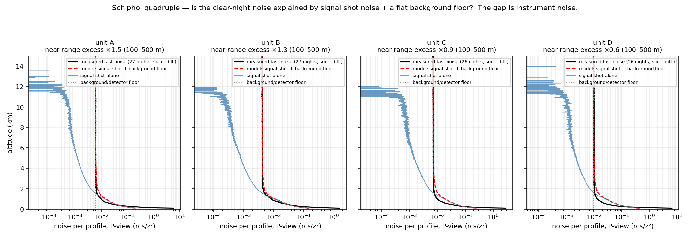

**The Schiphol-D optical-module swap.** L1 metadata: unit D changed TUB150037 -> TUB160055 on
2026-07-11 (A/B/C stable through 2025-2026). Preview from the two post-swap nights in the local
mirror: the NEW module's noise floor is x0.53 of the old - the module change is loudly visible in
the simple noise view. Full reproduction below, once the balfrin extension landed.

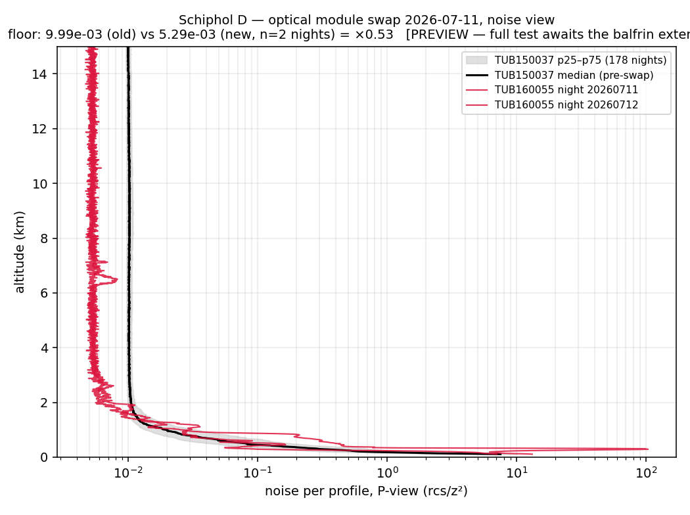

**The swap, fully reproduced (2026-08-20, balfrin extension).** With Jun-Aug 2026 cached on
balfrin (20-23 clear nights/unit; 14-15 post-swap), the test is complete and season-matched
(pre = Jun 01-Jul 09, post = Jul 12-Aug 13; the swap day and its eve belong to neither era).
Verdict: the hardware change is detected unambiguously from the sky alone - unit D's noise
floor steps x0.55 ON the swap date while the three co-located controls move x1.00-1.01, and
the change is a uniform floor drop above ~2 km (signal-shot dominates below). Two further
findings. (i) BURN-IN: the new TUB160055 floor is NOT stationary - it rises +16 %/30 d
through its first month (controls -0.6..+0.4 %/30 d); re-check after a few months. (ii) The
additive-baseline (dark) change is NOT resolvable: above 3 km the era change of the v4
evidence intercept for D sits inside the controls' seasonal envelope; below ~2 km the
common-mode dominates everyone. A module swap is loudly visible in the NOISE channel and
quietly invisible in the DARK channel at these SNRs - for network change-detection, the
per-night noise floor is the tripwire.

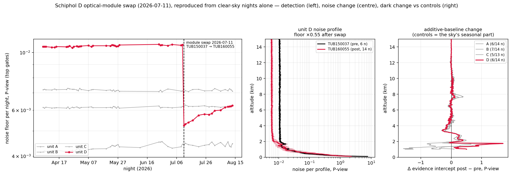

**The window scan (operator's idea).** Slide the Rayleigh window in altitude; within one night
the ratio of fitted constants between windows is SELF-REFERENCED (the night's amplitude cancels),
so C-hat(z_win) maps the additive baseline's window bias plus whatever else sits in the window:

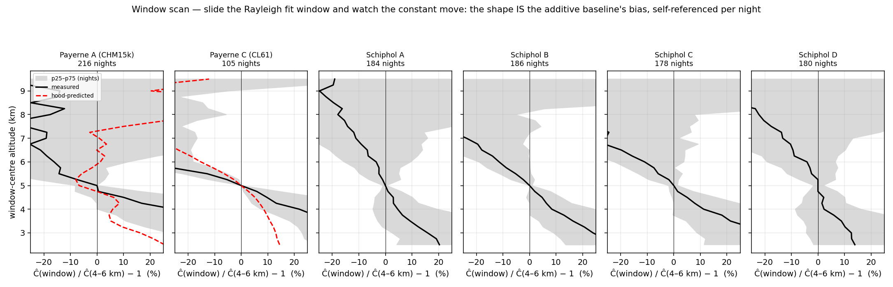

Reading, honestly: all six units share a monotone tilt (+10-20 % with low windows, -10-25 % high)
- that common part is the residual AEROSOL in and above the window (the contamination K in scan
form), not dark. The instrument information is in the DEVIATIONS: between units on the same sky
(Schiphol), and between measured and hood-predicted at Payerne (C: matching sign and ~5 km
crossing below 5 km). Practical product available immediately: the p25-p75 band per altitude says
WHERE the fit is stable - 4.5-6.5 km at all six units - directly answering "which fit altitudes
carry more or less background noise". As a dark ESTIMATOR the scan inherits the same wall as
everything single-station; as an operator diagnostic it is cheap and readable.

**The fit-space experiment (operator's idea).** The molecular profile looks easier to fit in S
(log scale) than in RCS. Tested with four estimators of the same nightly constant, on the same
cached nights and the same 1-km windows: (E1) WLS in RCS - the current one; (E2) plain
least-squares in S-view; (E3) median log-ratio in S - the estimator the eye performs on the
log plot; (E4) median ratio in LINEAR space - the control: the same robust statistic with no
positivity requirement. Metric: night-to-night robust CV of C-hat per window altitude, with a
mandatory honesty gauge underneath - the median bias of each estimator against WLS.

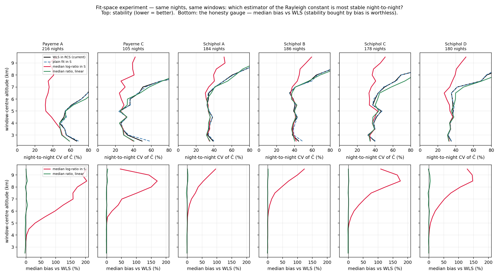

Three findings, in order of surprise. (1) The VIEW does nothing: E1 and E2 coincide to the
linewidth at every altitude on every unit - a least-squares fit does not care what scale the
plot used. (2) The log-median LOOKS dramatically more stable (Payerne A 52.5 -> 38.6 % CV at
4.5 km, every unit above ~6 km) - but the bias row shows that stability is bought with bias:
gates where noise drives S <= 0 cannot be logged and are silently dropped, so the noise
distribution is clipped from below and C-hat inflates by +50 to +200 % above ~5-6 km (already
+9 % at 4 km on Payerne A). The bias is SNR-dependent, hence unit- and night-dependent -
disqualifying for calibration: stable-but-wrong. The linear-median control confirms it: E4 does
NOT reproduce E3's wins (Payerne A: 54.4 % vs 38.6 %), so the apparent gain was the clipping,
not the robustness. (3) The legitimate kernel of the intuition - robust aggregation - is worth
a real but modest amount: E4 is unbiased at every altitude on every unit and buys 0-4 CV points
in the 3-5 km band (Schiphol A 38.4 -> 35.8, C 41.6 -> 37.6), nothing elsewhere. Verdict: keep
WLS in RCS operationally; never fit log-S with a positivity cut - it silently inflates
constants exactly where the 910-nm units are noisiest; if the estimator is ever revisited, a
Huber/median robust loss is safe and marginally better on some units. The ~33-40 % CV floor
common to all four estimators is real night-to-night transmission variability - no fit-space
choice removes it; the levers that matter remain window choice (above) and aerosol screening.

**Plain-language recap, on operator request (fig13) + the aerosol-variability filter (fig14).**
Two different "electronic" quantities were being mixed in conversation, so fig13 separates them
per instrument type, in absolute units, against the hood: the NOISE (random scatter per profile)
is retrieved from ordinary clear nights and closes against the hood at x0.96 / x0.92 / x0.98
(CL31 / CHM15k / CL61) - that channel is SOLVED for all types and is the swap tripwire of fig12.
The DARK (fixed additive bias) remains the hard one, and fig13's top row is the honest state:
CL31 fit output untrustable (injection gain -0.03), CHM15k shape partial but amplitude x3.9,
CL61 = the HOOD'S OWN SHAPE imposed with only the amplitude from sky (x1.13) - the red-on-black
match in earlier figures is BY CONSTRUCTION, not a discovery; the assumption-free blue curve is
what the sky alone gives, and it is far from the truth.

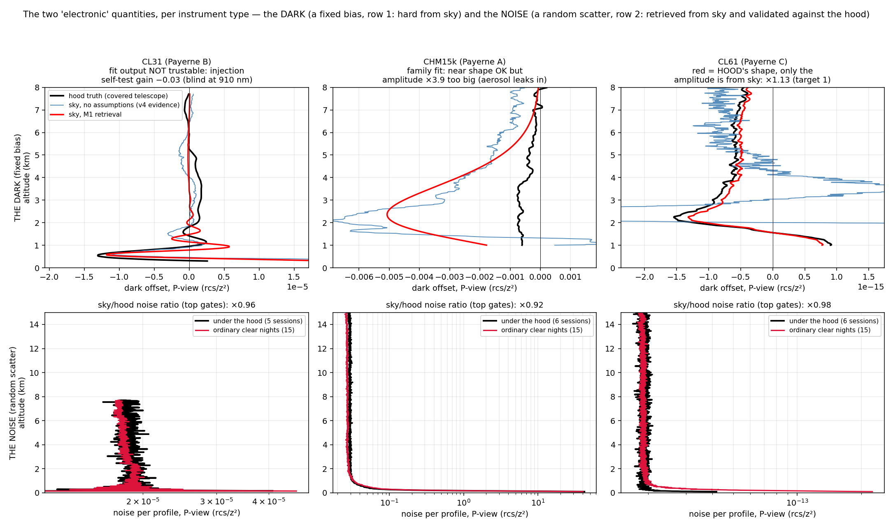

fig14 tests the operator's filtering idea: aerosol concentration varies night-to-night, the dark
does not - so split nights by CAMS aerosol load and extrapolate. Result: the tercile split PROVES
the evidence intercept is aerosol-dominated (theta vs hood: cleanest third -0.7 / +0.4, dirtiest
-4.9 / -11.8 for CHM15k / CL61) and clean-night selection removes a factor ~2.5-3 of it (RMS),
but the filter SATURATES - even the cleanest nights carry aerosol, and the formal zero-aerosol
extrapolation with the CAMS profile as regressor removes nothing (theta -4.4 vs -4.7 unfiltered:
the residual is NOT proportional to the CAMS-modelled shape at 0.4 deg). Design lesson re-learned
and recorded in exp_aerosol_filter.py: the intercept is identifiable only through night-to-night
TRANSMISSION variation (regress raw S on C_n*M; night-normalising destroys the leverage - first
attempt returned theta = -100). The un-filterable remainder is exactly why M2 (co-location: same
sky cancels without any aerosol model) is the route for the CHM15k amplitude.

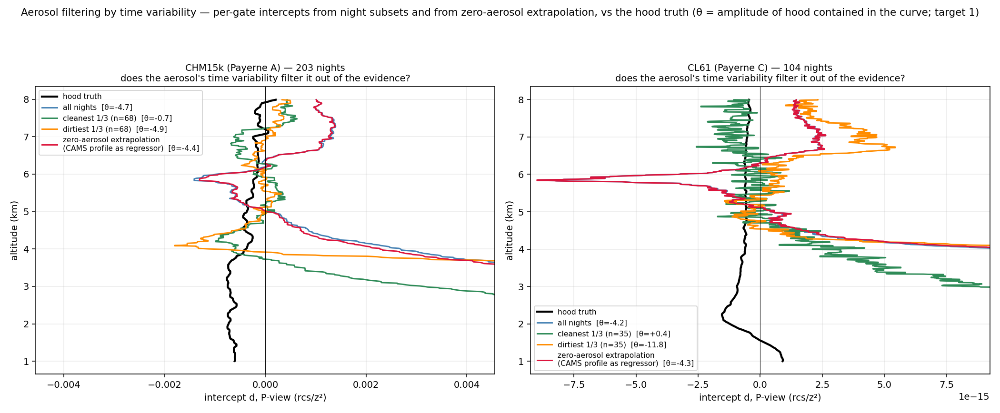

**CL61 shape transferability, arbitrated by the literature (2026-08-21).** Assuming Payerne's
hood shape for the network CL61s is NOT defensible: Le & O'Connor derive Pinstrument(r, T) as a
PER-INSTRUMENT, PER-TEMPERATURE lookup table (no universal shape, T-dependence 15-31 C), and
report early-production units degrading over time (laser power down, background up).
Looschelders' Paris fleet does show similar darks across units above 40 m (band +-1.5e-14
sr-1 m-1) - but that is n~8, one winter, one firmware era. The standard set by the literature is
per-unit characterisation; the M1 template stays a Payerne-only diagnostic.

**Multi-altitude fit as a bias estimator (fig15) - the idea INVERTS.** Fitting C-hat at sliding
windows and extrapolating to high altitude does NOT converge to the unbiased constant: the bias
is dark DIVIDED BY molecular signal, and the molecular dies faster with altitude than the dark
does, so the dark bias GROWS aloft (CHM15k: -29.8 % at 4.5-6.5 km vs dark-corrected, still
-24.3 % at 8-9.5 km; CL61: -22.5 % -> -83.1 %). There is no clean window: low windows are
aerosol-biased, high windows dark-biased. The scan stays a diagnostic, not a corrector.

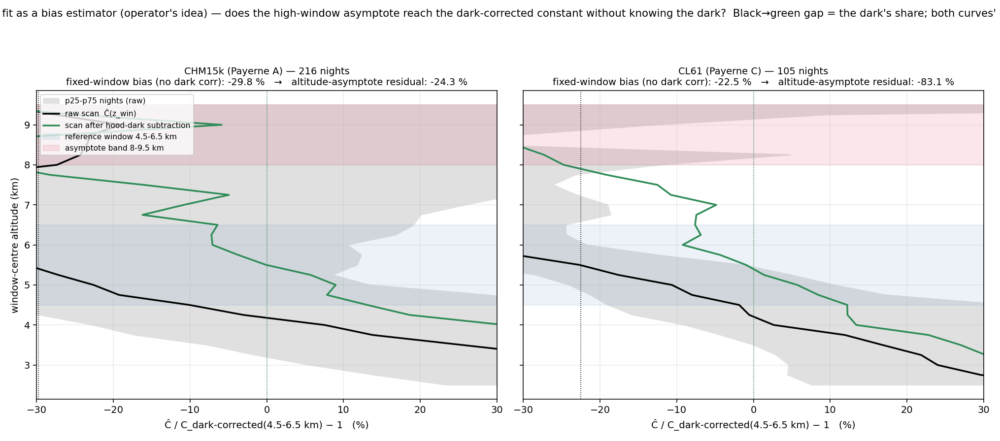

**Opaque low cloud as a natural termination hood (fig16) - the operator's breakthrough idea.**
Above a fully-attenuating night cloud the atmosphere is switched OFF - no molecular, no
aerosol - so the recorded signal IS the instrument's additive background, per unit, per night,
network-wide. Payerne winter 2025/26 validation (profiles masked below own CBH+1.2 km,
16k-37k profiles/unit), hood as referee:

- CL31: WORKS DIRECTLY - theta +0.74, RMS/|hood| 0.68, the ~5 km transmitter-ripple mode
  reproduced in shape AND amplitude. First remote dark retrieval for the instrument whose
  molecular channel is provably blind (injection gain -0.03). Analog APD does not saturate in
  the cloud return, hence the clean baseline.
- CL61: right shape family, x2.1 amplitude - exactly what the PHYSICAL model predicts: the
  AC-coupling undershoot is signal-induced, so the huge cloud return deepens it relative to the
  quiescent hood state. The known pulse response (tau_u = 30.5 us) makes this correctable by
  deconvolution -> cloud scenes become per-unit dark measurements.
- CHM15k: FAILS (x12.9) - the photon-counting chain saturates in liquid clouds (the same
  physics that forbids its cloud calibration) and the post-saturation baseline artefact dwarfs
  the dark. Its absolute dark stays covered-night / co-location.

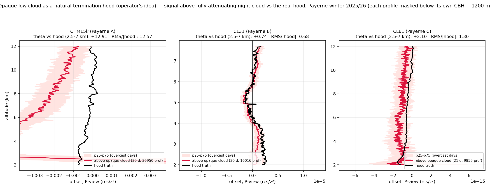

The assembled network recipe, with the circuit-physics models as keystone: per PRODUCT LINE a
functional form derived from the electronics (CL31 two under-damped resonances; CL61 fast lobe
+ slow undershoot; CHM15k gexp); per UNIT its parameters fitted from opaque-cloud night stacks
(CL31 directly, CL61 after pulse-response correction); the noise floor + change detection as
the tripwire; Payerne's hood as standing referee. Open items: buffer/multiple-scattering
sensitivity sweep, CL61 undershoot deconvolution, network rollout on E-PROFILE archives.

**CL61 undershoot deconvolution (fig17) - the ideal-state route FAILS, instructively.** For a
single-pole AC coupling the state is exactly w(z) = (1/L_u) int y dz of the recorded signal, so
x = y + w should invert the undershoot per profile, closed-form. Measured: the predicted
charge-driven undershoot is ~1e4 LARGER than observed, and the freely fitted state coefficient
is 0.00 (target 1). The recorded, calibrated beta_att does NOT charge the coupling at face
value - firmware baseline handling and electrical dynamic-range compression sit between the
optical signal and the archived numbers. Model-based deconvolution in L1 units is dead; the
correction must be EMPIRICAL.

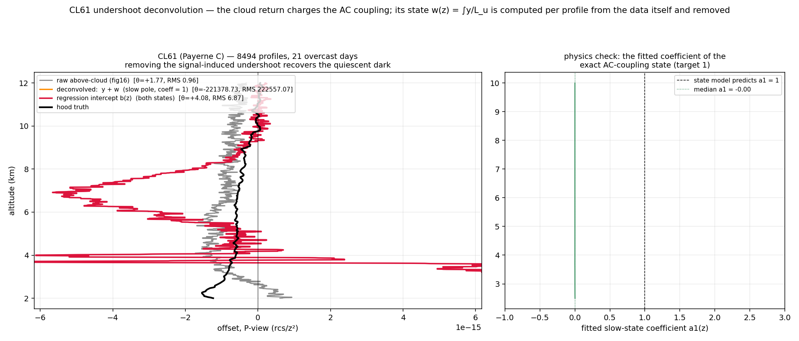

**The cloud's fingerprint, measured empirically (fig18) - detector physics from the sky.**
Cloud-relative frame (z' = height above CBH), profiles split by cloud-return charge Q
(integrated over CBH-100..+400 m only - integrating from the ground folds the CL31's own
near-range dark lobe into Q and corrupts the split); (bright - dim) tercile difference
isolates the signal-induced pulse response, dark and internal-pulse terms cancelling. Results:

- CL31: the response is an oscillation of wavelength Lambda = 5465 m - the hood-fitted
  transmitter-ripple mode (5080 m) recovered from the sky within 8 %. RMS 1.62 x hood-dark
  over 0.5-3 km above cloud, DEAD beyond ~3 km above CBH: this is exactly why fig16's CL31
  retrieval matched the hood only above ~4 km absolute (CBH ~1 km + 3 km). The natural-hood
  recipe for CL31 = use gates >= 3 km above cloud base.
- CL61: sharp negative tail decaying with L = 553 m ~ the hood fast lobe (711 m), then flat;
  RMS 3.51 x hood-dark in the same band - the signal-induced part dominates its above-cloud
  offset (fig16's x2 excess explained). Recipe: gates >= ~2 km above CBH + per-gate Q-slope
  removal (lever x3.3 between terciles).

- CHM15k (added on operator request): the same terciles dissect the SATURATION artefact.
  Charge lever compressed to x1.6 (vs x4.7 / x3.3 on the analog Vaisalas) - dead-time clipping
  erases most of the true brightness differences, the photon-counting fingerprint. The response
  is colossal (RMS 320 x hood-dark over 0.5-3 km above CBH, ~1000x in the first km), still
  charge-dependent (linearity 1.57) so NOT a fixed subtractable pattern, and grows away from
  the cloud instead of relaxing - no linear-filter tail. Confirms fig16: the natural hood is
  unusable for the CHM15k dark; but the fingerprint itself is a per-unit health probe (its
  drift tracks detector ageing) and its charge-compression is a remote dead-time measurement.

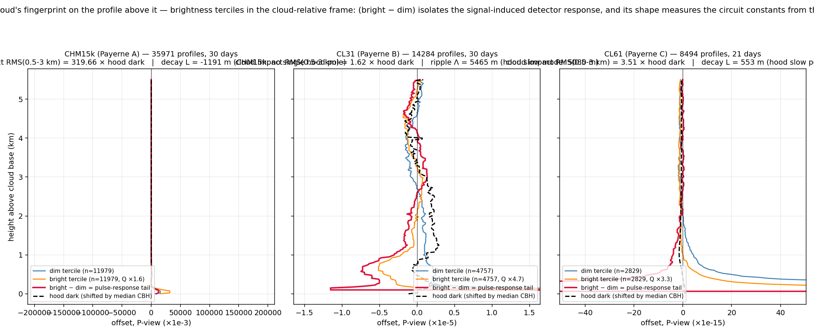

Standing summary of the natural-hood chain: opaque night clouds switch the atmosphere off;
the brightness terciles measure and remove the cloud's own electrical fingerprint; what
remains, per unit and per season, is the quiescent dark - validated against the Payerne hoods
for CL31 (and CL61 pending the Q-corrected re-judgement). Circuit constants are recoverable
from sky data alone, which also arms the change-detection layer with physical parameters
rather than raw curves.
