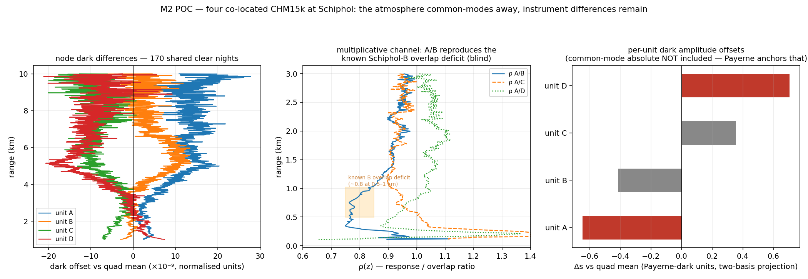

# M2 — the network as the hood: plan

**Plan only** (2026-08-20, branch `remote-dark`). Objective: the one piece M1 provably cannot
deliver — the **CHM15k dark amplitude per unit** — by fitting the fleet jointly. Companion
by-product: the CL61 network rollout of the already-closed M1 recipe. Verification standard
unchanged: Payerne hood, plus the network sanity anchors the v4 scan established.

Inputs this plan builds on, all measured: the M1/M3 campaign verdicts
(`16_remote_dark_campaign.md` — CHM15k contamination θ_corr 4–5 per-stream, CL61 closed at
θ_corr 1.13); the v4 scan anchors (Messina θ̂ = +5.3 ≈ 5× Payerne confirmed strong; Montsec and
Twenthe null); the injection self-test machinery; and the fleet audit below.

---

## 0. What M2 must deliver, and its acceptance gates

Deliverable: per CHM15k unit-era, an amplitude ŝ_u (in hood-template units, ŝ_PAY ≡ 1) with a
standard error and a recoverability factor, such that b̂_u(z) = ŝ_u·D(z) is subtractable in the
Rayleigh windows.

Acceptance gates, fixed now:

* **G1 — network injection**: hood darks injected at known amplitudes into a random 15 % of
  units are recovered unbiased (slope 1 ± 0.15, no AOD-correlated residual).
* **G2 — Payerne holdout**: with Payerne excluded from the fit, its predicted ŝ lands within
  ±30 % of 1.
* **G3 — sanity anchors**: Messina ŝ ≈ 5 (±40 %), Montsec/Twenthe ŝ ≈ 0 (|ŝ| < 0.3).
* **G4 — no contamination leak**: ŝ_u uncorrelated with site aerosol climatology (|r| < 0.25)
  — the dark is electronics, not air.

No amplitude ships if any gate fails; a failed gate plus its diagnosis is the deliverable then.

## 1. Fleet audit (measured 2026-08-20 — the design matrix this plan actually has)

| fact | value | consequence |
|---|---|---|
| CHM15k streams | **154** | the fleet is big enough for shared-basis estimation |
| elevations | 101 units < 200 m; 24 in 200–500; 13 in 500–800; **8 above 800 m** (Monte Cimone 2165, Kleine Scheidegg 2060, Davos 1590, Hohenpeißenberg 977, …) | the gate-vs-altitude dissociation rests on FEW units — it is a *secondary* lever, not the primary identification as plan 14 hoped |
| Kleine Scheidegg | = TUB120011, the generic-reference unit with documented degraded near range | one of the 8 high sites needs special handling — flag, don't trust blindly |
| existing v4 caches | **43 units** ready (the earlier scan) | Stage 0 runs today, before any balfrin spend |
| CL61 streams | 13 | the rollout by-product is a day of compute, not a campaign |

The audit changes the identification strategy: with a hundred near-identical sea-level molecular
shapes, the aerosol/misfit contamination — always positive, mechanically similar across units —
is a **common mode**. A naive cross-unit SVD would crown it as "the dark". M2's core problem is
therefore not elevation leverage; it is **separating two shared components**:

```
evidence_u(z)  ≈  s_u · D(z)  +  c_u · K(z)  +  noise
                   dark            contamination
```

## 2. Why this is identifiable anyway — the four discriminators

1. **Shape**: D is hood-informed (the peaked gamma-exponential cuvette, peak ~3 km, sign flip
   ~9 km); K is molecular-smooth (it is CAMS misfit × molecular). The M1 families make the basis
   distinction explicit instead of hoping SVD finds it.
2. **Covariate structure**: c_u must scale with the site's aerosol climate (each cache carries
   its own CAMS aerosol regressors — the site-median Aer level is already in hand); s_u must
   NOT. This is testable per fit (gate G4) and usable as a prior.
3. **Absolute anchors**: Payerne measures BOTH components exactly — s_PAY = 1 by the hood, so
   K's Payerne loading is `evidence_PAY − 1×hood`, i.e. **the contamination profile itself is
   measured at one site** and enters the fit as a known basis vector, not a free one.
4. **Zero/strong anchors**: Montsec and Twenthe (θ ≈ 0 with strong FE gradients — proof their
   evidence is contamination-only) pin K's loading scale from the other side; Messina (~5×) pins
   the high end of s.

Elevation and unit swaps remain in the model as secondary constraints, honestly weighted by how
few units carry them.

## 3. Staged execution

### Stage 0a — EXECUTED: the Schiphol quadruple proof-of-concept (operator's proposal)

Four CHM15k at one coordinate (0-20000-0-06240 A–D, 170 shared clear nights, all four already in
the v4 cache) — the cleanest possible test of M2's machinery, because co-location makes the
contamination K(z) common-mode: unit v IS the atmospheric reference for unit u, no CAMS anywhere.
Per gate, across nights: S_u = ρ_uv(z)·S_v + db_uv(z), after per-night calibration normalisation
(S/C_n — without it the units' ~20 % calibration spread pollutes both channels).



**Validated:**

* **the multiplicative channel reproduces prior knowledge blind**: ρ_A/B = 0.777 at 500–1000 m
  recovering to 0.94 by 1.6–3 km — the documented Schiphol-B static overlap deficit (~0.8
  expected in that band), obtained with no overlap model at all;
* **dark differences are measurable from sky data**: per-unit offsets Δs = −0.65 (A), −0.42 (B),
  +0.36 (C), +0.71 (D) in Payerne-dark units, internally consistent (six pairs → four nodes,
  residual 17 % of the typical difference);
* the two-basis projection [hood family, mean-signal leakage] is necessary and works: the
  ρ-noise×signal leakage direction carries up to 0.3 units of Δs on two of the four units, and is
  now absorbed explicitly instead of contaminating silently.

**Design corrections the POC forces on the fleet stage (the point of a POC):**

1. **a rank-1 shared D is insufficient** — the leak-controlled node profiles still leave family
   R² ≈ 0.2: co-located CHM15k darks differ in SHAPE, not only amplitude. Stage 2's shared basis
   becomes rank-2 (or per-unit gexp shape parameters within hood-prior bounds);
2. **per-night calibration normalisation is mandatory** fleet-wide, not optional;
3. the common-mode absolute is invisible here by construction — confirming, from the other side,
   that the Payerne anchor is irreducible.

### Stage 0 — the decision gate, on the 43 existing caches (local, ~half a day)

Recompute the per-unit free-b evidence from the caches (seconds each, v4 machinery), stack the
[43 × gates] matrix with SEM weights, and run the *confirmatory* two-basis fit:
`evidence_u = s_u·D_hood + c_u·K_PAY + r_u` with D_hood the Payerne hood template and K_PAY the
Payerne-measured contamination. Then check the four discriminators on known ground:

* Payerne recovers s ≈ 1 (it is in the basis — a consistency check, not a validation);
* Messina s ≈ 5, Montsec/Twenthe ≈ 0;
* the c_u regress on the cache's own site-median aerosol level; the s_u do not.

**Decision**: if the anchors separate cleanly, M2 proceeds to the fleet. If Messina and the
nulls cannot be told apart at 43 units, the fleet run would only add sea-level replicas of the
same confusion — stop and report that instead.

Also in Stage 0: the **exploratory** weighted SVD of the same matrix, kept as a diagnostic
(which components exist at all, what the common mode looks like), never as the estimator.

### Stage 1 — fleet caches on balfrin (one job, ~hours)

The v4 night-extraction for every CHM15k stream with ≥ 40 archive clear nights, era-split at
documented breaks; L1 and CAMS are already on scratch, the archive gives the clear-night lists.
One `postproc` node, per-stream parallelism, the existing sbatch pattern (CPU partitions only).
Output: one cache npz per unit-era, pulled back locally (~a few GB).

### Stage 2 — the joint fit (local, fast once caches exist)

Alternating, everything reusing M1 parts:

* per unit: v4 per-gate state (A, B, d, g) given the current shared components;
* global: SEM-weighted two-basis regression across units → s_u, c_u; D refined *within the
  hood-informed gexp family only* (bounds on the fixed hood prior — the walking-bounds lesson);
  K refined within the span of {K_PAY, m̄-shaped} — never free per gate;
* anchors as rows: s_PAY = 1 (exact), Montsec/Twenthe s = 0 (soft), elevation/swap constraints
  where they exist;
* the CL31/CL51 gate-fold ripple channel stays separate (already a product); CL61 units run the
  closed M1 recipe per unit (the by-product) — M2's shared basis is CHM15k-only until Looschelders-
  style type-commonality is demonstrated for CHM15k too.

### Stage 3 — validation = the acceptance gates

G1 network injection (the M1 self-test generalised: inject into 15 % of units, refit, recover);
G2 Payerne holdout; G3 sanity anchors; G4 the AOD-decorrelation test. All four reported per
run, in the output npz, exactly as θ_corr travels with every M1 result.

### Stage 4 — products

* `remote_dark/m2/` per unit-era: ŝ_u, SE, recoverability, b̂_u(z); a fleet summary table and a
  landscape figure (ŝ vs unit, anchors marked);
* the CL61 fleet table (13 units × θ_corr) from the by-product run;
* campaign report §5 updated from "inherits" to "delivered/failed per gate".

## 4. Risks, named with their controls

| risk | control |
|---|---|
| contamination common-mode crowned as dark | the two-basis design with K measured at Payerne; gate G4; Stage 0 decision before fleet spend |
| elevation leverage concentrated in 8 units, one of them (Kleine Scheidegg) known-degraded | elevation is a secondary constraint only; KS flagged; conditioning of the design reported |
| firmware cohorts with different baseline handling | fit cohort offsets if the L1 attributes expose the version; else cohort = era heuristics; a cohort-level residual r_cohort is cheaper than a wrong shared D |
| era mixing across undocumented unit swaps | the earlier change-detection scan marks breaks; era-split before fitting; a unit failing split-half reproducibility across its own record is fit per segment |
| mountain sites' cleaner aerosol biasing the c–s separation exactly where elevation leverage lives | the injection test randomises injected amplitudes across the elevation range — a slope estimated only from sea-level units would show it |
| grid heterogeneity (D lives on the gate index) | Stage 1 asserts the gate grid per unit; units off the common grid are fitted with D interpolated in GATE index, never in altitude — misalignment is exactly what M2 exploits, so it must never be "corrected" away |

## 5. Effort

| stage | where | wall time |
|---|---|---|
| S0 decision gate | local | ~half a day |
| S1 fleet caches | balfrin, 1 postproc node | ~2–4 h + transfer |
| S2 joint fit | local | minutes per iteration, ~a day of analysis |
| S3 gates | local | ~half a day (injection refits dominate) |
| S4 products + report | local | ~half a day |

Total ≈ 3 working days if S0 passes; S0 alone if it does not — which is the point of running it
first.
