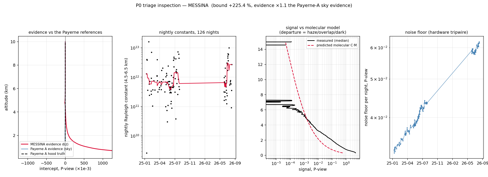
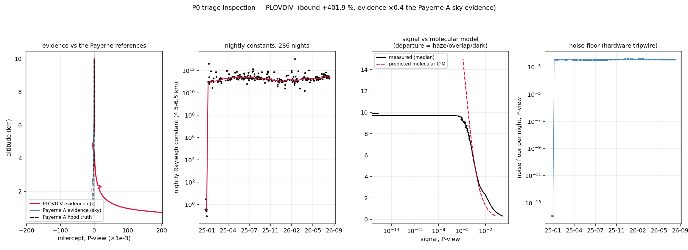
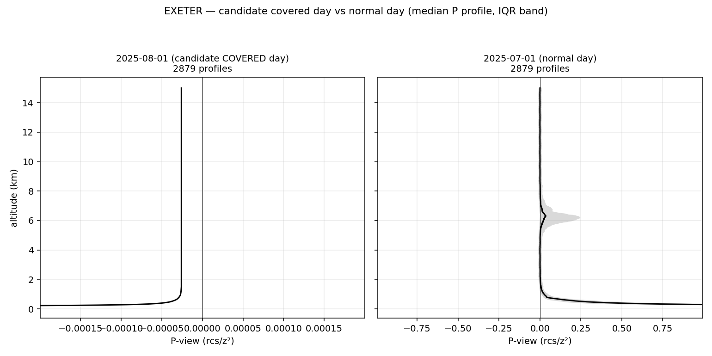
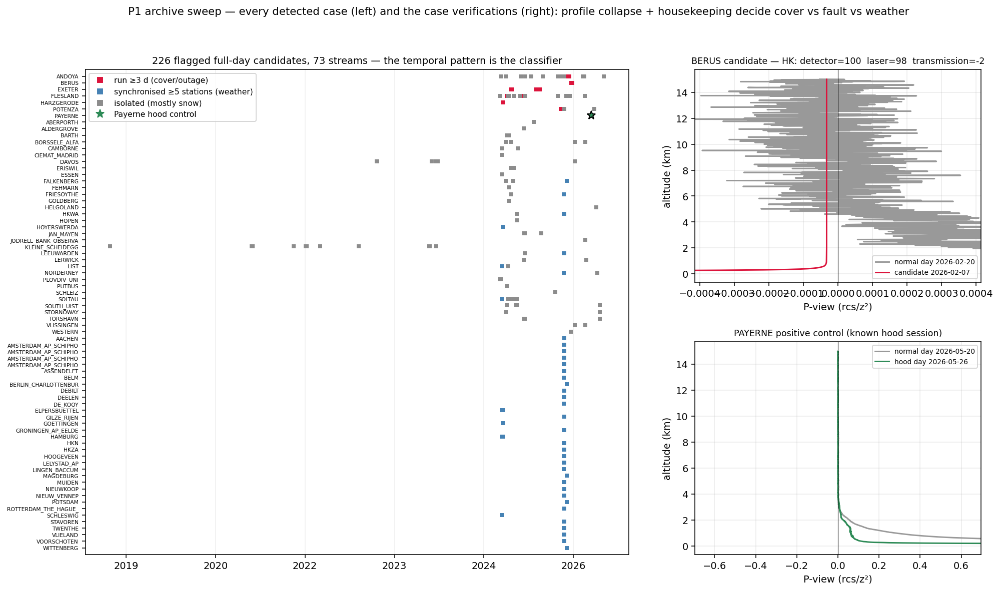
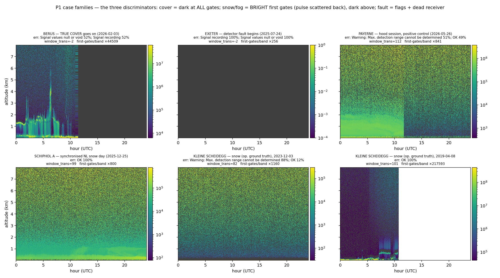

# 18 — CHM15k: identify the electronic distortion, deliver an unbiased Rayleigh constant

Status: PLAN (2026-08-23), built from the remote-dark campaign's measured verdicts (report 16).
The stake, measured at Payerne: the dark is worth **+24 % on C_L**, most of the profile
gradient (−10.5 → −2.5 %/km), and +24 usable nights/yr — and the CHM15k has no cloud-
calibration fallback (it saturates in liquid clouds).

## The evidence this plan stands on

| # | Fact (all measured, fig refs in report 16) | Consequence for the plan |
|---|---|---|
| 1 | Single-station sky retrieval of the dark amplitude is impossible (injection gain 0.48, contamination ×4; fig13/14) | absolute amplitude must be MEASURED, not fitted |
| 2 | The near-range dark SHAPE is sky-retrievable (corr 0.98) | shape checks and triage are remote |
| 3 | Clean-night selection removes ⅔ of the aerosol pollution, then saturates (fig14) | evidence-based upper bounds are usable for triage |
| 4 | No clean fit window exists: low = aerosol-biased, high = dark-biased (fig15) | window retuning mitigates nothing by itself |
| 5 | Opaque-cloud natural hood fails for CHM15k: saturation artefact ×320–3000, non-monotonic in charge, no Q→0 rescue (fig16/18/19) | clouds are a *health probe*, never a dark source |
| 6 | Co-location gives exact per-unit differences; one anchored unit calibrates a cluster (M2 POC) | multi-unit sites need ONE covered unit |
| 7 | Covered-telescope nights work but drift for hours; T-resolved reduction needed; dark is per-optical-module (D swap; fig9/12/20) | protocol: ≥24 h, T_int-binned, era-keyed by module serial |
| 8 | Noise floor per night detects hardware changes (×0.55 step, burn-in +16 %/30 d); cloud y(Q) knee tracks detector state (fig12/19) | monitoring layer says WHEN to re-measure |
| 9 | ALC_DARK_PROFILE subtraction is already plumbed into the operational pipeline | application is a registry + config problem, not new physics |

Principle: **identification is remote, the absolute amplitude is measured once per unit-era,
monitoring keeps it valid.**

## P0 — Stakes and triage (desk, existing data + one balfrin job)

1. Extend the v4 night caches to every network CHM15k (balfrin, same machinery as the
   Schiphol extension).
2. Per unit: upper bound on the dark's calibration impact = rerun the Rayleigh fit with the
   (contaminated, hence conservative) evidence intercept subtracted → ΔC/C bound. The
   contamination only inflates the bound, never hides a large dark.
3. Classify: **< 2 %** ignore; **2–5 %** monitor only; **> 5 %** campaign list, geographic
   spread respected. Expected outcome: a minority of units justify a covered night at all.
4. Byproduct: near-range shape stability across units (fact 2) — if the gexp family shape is
   uniform, future amplitude-only reductions get cheaper.

## P1 — Covered-night reduction pipeline (code, validated on Payerne before any campaign)

- **Auto-detection of covered periods** in the whole archive first: a covered telescope is
  unmistakable (no atmospheric structure, no clouds, profile ≈ dark family, noise floor
  unchanged). Maintenance covers happen — free darks may already exist network-wide.
- Reduction: discard settle, then **T_int-binned median profiles** (Pinstrument(r, T) à la
  Le & O'Connor — fig20 proved a single session median under-resolves the hour-scale drift),
  era-keyed by `optical_module_id`, uncertainty from within-session spread.
- QC gates: session ≥ 24 h target (diurnal T span), repeat-session agreement, and the
  validation: reproduce Payerne's +24 % / gradient repair from its hood sessions.
- Output: per-unit-era dark npz in the exact `ALC_DARK_PROFILE` format.

## P2 — Campaign wave 1 (operator email, triaged units only)

One-page instruction sheet: cover the **receiver telescope** (not the laser) for ≥ 24 h,
note begin/end, done — the data arrives through the normal L1 flow, weather-independent.
Reduction is passive as files land. Wave 1 = the P0 ">5 %" list.

## P3 — Co-location multiplier

At multi-unit sites (Schiphol, Lindenberg, …): one covered unit anchors the cluster; the
M2 same-sky regression transfers the absolute dark to siblings; triangle closure is the QC.

## P4 — Operational application (v2.3)

- Registry keyed `(wmo, ident, optical_module_id, era)` feeding `ALC_DARK_PROFILE`.
- **Kalman restart at era boundaries** (the CL31 whole-year lesson: smoothing across a swap
  is 2.5× wrong).
- Acceptance: Payerne canaries still rejected, availability/gradient indicators improve or
  hold, network ΔC distribution matches the P0 bounds.

## Monitoring layer (already built — productize into the daily/weekly run)

- Nightly noise floor + step alarm per unit (fig12 machinery) → detects swaps even when
  metadata is silent, triggers re-measurement.
- Winter cloud-fingerprint y(Q) knee + kernel (fig19) → detector ageing between campaigns.
- Evidence near-range shape check (fact 2) → flags shape changes.

## Cheap asks and long shots

- **One email to Lufft**: does factory QC keep per-serial termination/dark profiles? A yes
  shortcuts the whole campaign.
- The archive sweep for accidental covers (in P1) — potentially large free coverage.

## Explicitly out

Sky-only absolute retrieval (proven impossible), cloud-derived darks for CHM15k (proven
impossible), network-wide window retuning as a dark fix (fig15), and any shape transfer
between units without a per-unit measurement (the CL61 lesson generalized).

## P0 execution log

**2026-08-23 — jobs launched**: caches+bounds for all 154 census CHM15k (balfrin postproc,
restartable), archive cover-sweep back to 2015 (no CAMS needed).

**First flagged unit inspected — MESSINA (0-20000-0-00203_A, bound +225 %), fig21.** Not a
monster dark in absolute terms (evidence amplitude only x1.1 Payerne's) but a SICK unit:

- noise floor DOUBLED smoothly over 20 months (no step -> not a swap; progressive laser-power
  decay, the Le & O'Connor early-unit pattern);
- the measured signal flattens to a positive pedestal above ~5 km where the molecular should
  keep decaying -> the 4.5-6.5 km "Rayleigh" fit is mostly fitting OFFSET, nightly constants
  scatter over 3 decades, and v2.2's validity gates already reject most recent nights;
- the two are one mechanism: rcs_0 is laser-normalised, so a FIXED raw electronic offset
  inflates as 1/laser exactly like the noise floor - the bound and the floor rise together.

Triage consequences: (i) cross-reference every bound with the unit's noise-floor TREND -
rising-floor units have 1/laser-inflated bounds and are maintenance cases first, campaign
cases second; (ii) Messina goes to the operator-notification list (laser end-of-life), and
any covered night there should wait until after servicing.

**Second flagged unit — PLOVDIV_UNI (0-100-20000-000627_A, bound +402 %), fig21b.** The
opposite pathology to Messina, and the pair validates the triage cross-check by example:

- noise floor FLAT over 20 months (healthy laser) - not a degradation case;
- one era step in Jan-2025: the first days sit x1e11 away in units (firmware/processing
  change) - era-key any dark work from ~2025-01-15;
- the measured signal saturates on a constant positive PEDESTAL above ~7 km where the
  molecular should keep decaying; the pedestal/molecular crossing sits right at the 4.5-6.5 km
  fit window, so the fit splits between pedestal and atmosphere -> bound +402 % with an
  otherwise stable constant series.

A fixed pedestal on a healthy unit is exactly what a covered night measures directly ->
Plovdiv goes on the P2 campaign list (era-keyed), and its stability makes it a good first
target. Contrast card: Messina = maintenance first; Plovdiv = campaign first.

## P1 archive sweep — results (2026-08-23)

Sweep done: 89,921 stream-days with data (154 CHM15k + Payerne control, back to 2015). Two
design lessons paid for and fixed IN THE FLAGGING, no re-run needed: (i) a covered day's
near-band p95 statistic is NOISE-limited at ~0.08-0.10x the normal level, so the initial x50
threshold sat on the noise deck (mass-flagging ultra-clean synoptic nights at hazy sites and
missing the hoods) -> criterion is now ratio < 0.15 with era-awareness; (ii) 'normal' must be
computed PER YEAR - Payerne's units changed x3500 between 2016 and 2017.

**Positive control PASSES**: Payerne flags exactly its 25-h hood session (2026-05-26..27) and
nothing else (the 5-h 05-12 session is not a full day, by design).

**226 full-day candidates on 73 streams** (`remote_dark/p1_cover_candidates.csv`), three
families: (a) CONSECUTIVE RUNS uncorrelated with neighbours = cover/outage candidates - Exeter
23 d (incl. 2025-07-24..08-12), Berus 8 d (2026-02), Potenza 3 d; (b) SYNCHRONISED regional
single days = weather blockage (all NL on 2025-12-25/26, DE on 2026-01-11) - snow on windows,
not usable; (c) scattered alpine/high-latitude winter singles (Kleine Scheidegg, Davos,
Flesland, Andoya) = snow.

**Housekeeping verification is mandatory before use** - demonstrated on Exeter 2025-08-01
(fig22): the profile is a textbook dark (structure 20,000x below a normal day, 2879 profiles)
BUT status_detector = -127 (vs 100) with the laser firing normally -> a RECEIVER FAULT period,
not a cover; the data are not an operating-state dark. The find is still valuable: it dates an
Exeter era boundary (~2025-08-12, post-repair) for era-keyed calibration. Candidate-day HK
triage (status_detector / status_laser / window_transmission) goes into the P1 verification
pass alongside the profile-shape check.

**P1 results figure (fig23) + the Berus verdict.** The one-page view: the temporal pattern
classifies the 226 candidates without opening files (runs = cover/outage; synchronised columns
= weather; isolated singles = snow; the Payerne hood = the green-star control). Case
verifications on the right: **BERUS (DWD, 2026-02-04..11) is a TRUE COVER** — textbook
collapsed profile AND healthy housekeeping (status_detector 100, status_laser 98 firing,
window_transmission -2 = blocked): an operating-state dark, 8 consecutive days with full
diurnal temperature cycles, free in the archive. It becomes the first P1-reduction target
after the Payerne validation. Exeter stays classified as a detector-fault era (fig22).

**Case quicklooks + the cover / snow / fog / fault discrimination (fig24).** Operator ground
truth folded in: Kleine Scheidegg NEVER hosted a hood - all its flagged days are snow - and it
becomes the negative-control family. The six pcolor panels give the recipe:

| signature | cover/hood | snow on window | fault | (fog) |
|---|---|---|---|---|
| first gates | DARK (nothing scattered back; Berus) | BRIGHT x1e3-1e5 (pulse scatters off snow; KLS 2019 x217593) | dead | bright fog layer, structured top |
| above 1 km | dark / pure noise speckle (Payerne telescope-only keeps live noise) | attenuated noise | nothing at all | attenuated |
| window_transmission | -2 (invalid) on full covers | degraded-but-alive (82-101, variable) | -2 | normal-ish |
| error_ext | "Signal values null/void" (Berus 52 % = covered fraction) or benign "max range" warning (Payerne) | "Max. detection range cannot be determined" (KLS 88 %) | "Signal null/void" 100 % all day | SCI / VV codes |
| time pattern | consecutive days, season-agnostic | regional synchrony, winter, intermittent (melts) | consecutive until repair | diurnal lifecycle |

Edge case documented: deep alpine burial (KLS 2023-12-03) can null even the first gates and
mimic a cover in the profile alone - there the window_transmission (82, not -2), the warning-
type error bits and the alpine-winter context decide. Caveat: transition-day aggregate ratios
mix normal and event segments (Berus x44509 is driven by its normal morning) - the production
verifier must compute discriminators on the flagged SEGMENT.

**Correction (operator's catch): the synchronised NL family is NOT snow — it is clean-air
false positives.** Schiphol 2025-12-25 shows a perfectly visible boundary layer; it flagged
because the detection band starts at 400 m and that day the whole BL sat BELOW it (p95|P|:
161 at 0-400 m, 0.32 at 0.4-1 km, 0.028 = noise at 1-3 km) with zero clouds -> band ratio
0.127 < 0.15. The NL-wide Christmas synchrony is a shallow stable winter airmass, not snow on
windows. Consequence, now part of the verifier: the FIRST-GATES VETO - a true cover nulls the
0-400 m gates too (Berus: dark; Payerne hood: dark), weather never does (here x161). The
sweep's summary CSV lacks a 0-400 m column, so the veto runs in the per-candidate
verification pass (226 days, cheap) and the column is added to future sweeps. The manually
verified cases (Berus TRUE COVER, Exeter fault, Payerne control, KLS snow) are unaffected.
