# Étude théorique par modèle direct : la constante d'étalonnage dépend-elle de l'altitude ?

*Audit d'indépendance en altitude — volet simulation. Complète le volet observationnel
(`rayleigh_availability/`, comparaison v2.0 / v2.2).*

**Question posée.** La constante d'étalonnage doit être indépendante de l'altitude : le `C_L` restitué
ne doit pas dépendre de la position de la fenêtre moléculaire (méthode Rayleigh), et la constante
issue des nuages liquides ne doit pas dépendre de la hauteur de base du nuage (CBH). Les observations
disent le contraire, **et le signe change d'un site à l'autre** :

| site / instrument | décalage médian nuits récupérées − nuits gardées | montée de la fenêtre |
|---|---|---|
| Payerne CHM15k (A) | **−22,5 %** | +1,32 km |
| Payerne CL61 (C) | −17,5 % | — |
| Lindenberg CHM15k | **+23,2 %** | +1,50 km |
| Aoste CHM15k / CL61 | **+31,7 % / +32,1 %** | +1,08 km |
| SIRTA CHM15k | +7,4 % | +1,56 km |
| Gottfrieding CHM15k | −8,5 % | — |
| réseau (24 flux, ≥8 nuits/groupe) | médiane +4,7 %, **9 négatifs / 15 positifs**, de −40,4 % à +31,7 % | +0,87 à +2,01 km, **sur tous les flux** |

La montée de la fenêtre est universelle (c'est ainsi que v2.2 récupère les nuits) ; le **signe** du
décalage, lui, est propre au site. Aucun mécanisme instrumental global ne peut produire cela — c'est
la contrainte qui structure tout ce qui suit.

---

## 1. Ce que le modèle direct permet de dire

L'observation seule ne peut pas séparer « la constante restituée varie » de « la constante vraie
varie » : il n'y a pas de vérité terrain. Le modèle direct la fournit. On impose un `C_true` connu,
on synthétise `rcs(z)` par l'équation lidar, on pousse le profil dans **la chaîne livrée sans la
modifier** (`find_optimal_molecular_window` → `klett_inversion` → `calculate_lidar_constant`), et on
mesure `C_L/C_true − 1` en fonction de la hauteur de la fenêtre. Tout écart est, par construction,
un défaut d'estimateur ou l'effet du seul mécanisme qu'on a imposé.

**Équation directe implémentée** (Rayleigh) :

```
rcs(z) = C_true · [β_mol(z) + β_aer(z)] · exp( −2 ∫₀^z [α_mol(z') + α_aer(z')] dz' ) · O(z)  +  b·z²
α_mol = β_mol · S_mol,  S_mol = 8π/3 = 8,377580 sr
α_aer = β_aer · S_aer,  S_aer = 52 sr par défaut (options.lidar_ratio_aerosol)
```
Unités : `z` en m, `β` en m⁻¹ sr⁻¹, `α` en m⁻¹, `b` en unités de *signal* (= `rcs/z²`), AOD sans
dimension. Grille de travail : grille réelle Payerne CHM15k (512 portes, dz = 29,97 m, première porte
z₀ = 22,4775 m), `C_true = 6,50e11`, λ = 1064 nm ; CL61 à 910,55 nm avec `C_true = 1`.
Repère vertical : `rayleigh_fit.altitude_start = range_start_m + data.altitude` (donc ASL) ; les
hauteurs citées ici sont ramenées en **AGL** (alt(PAY) = 490 m) sauf mention contraire.

**Fermetures obtenues** (toutes < 0,5 % visé, la plupart avec 100× de marge) :

| chaîne testée | résidu de fermeture | pente résiduelle |
|---|---|---|
| Rayleigh, air purement moléculaire, fenêtres forcées ±490 m, centres 2,5–6,5 km AGL | **0,00457 %** (max \|C_L/C_true−1\|) | +0,00001 %/km |
| idem, ré-implémentation indépendante (Fernald arrière + quadrature point-milieu ×10) | **0,00000 à 0,00337 %** | −0,00000 %/km |
| accord des deux modèles directs (`rcs`) | **0,0e+00 à 9,8e−12** en relatif | — |
| Rayleigh, chaîne complète portes+restitution, 20 nuits propres bruitées (σ = 1,2e−4) | **+0,034 ± 0,116 %** (s.e.m.), dispersion nuit-à-nuit 0,517 %, acceptation 100 % | — |
| Sélecteur libre (pas de fenêtre forcée), bruit → 0 | **+0,00188 %** (retient 1738–5574 m AGL) | — |
| Nuage, estimateur nu (η vrai = η table, correction de transmission OFF) | **0,002 %** sur CBH 0,5–3,0 km | +0,000 %/km |
| Nuage, configuration opérationnelle (atmosphère US Std + fenêtre 100–2400 m) | **0,483 %** (CL61, CBH 0,5–2,2 km) | +0,222 %/km |

Le résidu Rayleigh de 0,0046 % est **entièrement attribué et vérifié** : −0,0034 % viennent de
l'épaisseur optique moléculaire sous la première porte (`2·α_mol[0]·z₀ = 2·7,50e−7 m⁻¹·22,5 m =
3,37e−5`), que le modèle direct inclut et que `calculate_lidar_constant` omet — elle démarre son
intégrale **au premier centre de porte**. En retirant ce terme le résidu tombe à ±0,0012 %
(discrétisation rectangulaire des intégrales de Klett + médiane sur la fenêtre).

**Conclusion n° 1, la plus importante du rapport :** *la chaîne d'estimation livrée est exacte.*
En air moléculaire pur elle rend `C_true` avec une pente de +1e−5 %/km, soit **1,5 million de fois
moins** que les −15 %/km mesurés à Payerne. Le gradient `C_L(z)` observé **n'est pas un artefact de
l'estimateur** : il faut un mécanisme physique ou une erreur d'entrée. Aucune fermeture n'a échoué,
donc aucune conclusion n'est dégradée pour cette raison.

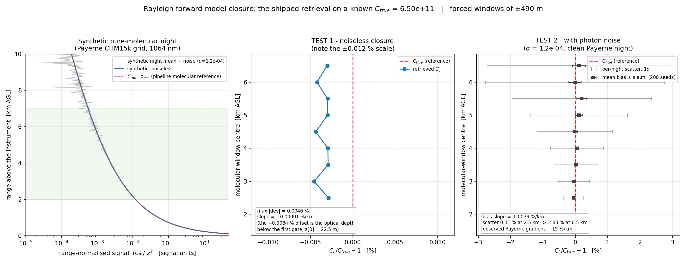

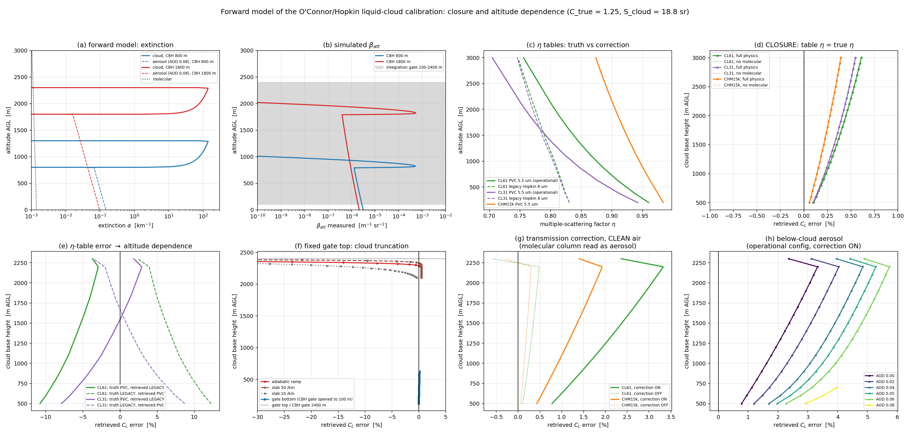

---

## 2. Le budget des mécanismes

Cible à atteindre : **dC_L/dz = −15 %/km** entre 2,5 et 6,5 km AGL (Payerne CHM15k, mesuré sur
116 nuits), ou de façon équivalente un décalage inter-populations de **−22,5 %** à Payerne et
**+23 à +32 %** à Lindenberg/Aoste. Toute pente est donnée **avec la bande de hauteurs où elle a été
évaluée** ; « ×N » = facteur de déficit par rapport à la cible.

### 2.1 Voie Rayleigh

| # | mécanisme | dC_L/dz simulé (bande d'évaluation) | amplitude requise pour la cible | physiquement plausible ? | verdict |
|---|---|---|---|---|---|
| R0 | **estimateur nu** (fermeture) | +0,00001 %/km (2,5–6,5 km AGL) | — | — | *référence, pas un mécanisme* |
| R1 | bruit de photons, σ mesuré | +0,031 ± 0,014 %/km (σ=1,2e−4) à +0,129 ± 0,058 %/km (σ=5,0e−4), 2,5–6,5 km | ×115 à ×470 **et signe opposé** | oui (σ mesuré 2 fois, accord 3 %) | **insuffisant** |
| R2 | biais de **sélection** de fenêtre (score composite v2.0) | −0,22 %/km effectif ; écart gardé→récupéré **−0,134 ± 0,076 %** (1738–5574 m) | ×168 | oui | **insuffisant** |
| R3 | tier 2 « bruit-relatif » v2.2 | −0,169 ± 0,072 % à σ=4,64e−4 (indiscernable du tier 1) | ×133 | oui | **insuffisant** |
| R4 | **bug σ** (`sqrt(avg_time/dt_native)`=4,472 manquant) | **0 %/km sur C_L** ; 0 décision changée sur 592 cas | — | bug réel, confirmé (ratio mesuré 4,10–4,33) | **insuffisant** (porte seulement) |
| R5 | référence min-de-N du scattering ratio | 0 %/km sur C_L (biais −3,2 → −5,0 % sur *la porte*) | — | oui | **insuffisant** (disponibilité) |
| R6 | écrêtage des cellules contaminées (4·MAD) | ≤0,006 % soit <0,1 s.e.m. | — | oui | **insuffisant** |
| R7 | **recouvrement** confiné sous la bande (défauts mesurés PAY) | −1,0e−5 %/km ; **offset** +5,84 % (table générique) / −0,85 % (tilt module), 2,5–6,5 km | ×1,5e6 — **et s'annule exactement** dans un rapport intra-instrument | mesuré (132 overlaps réseau) | **insuffisant** |
| R8 | recouvrement débordant *dans* la bande (borne non physique) | +0,045 %/km (z_full=2,5 km) → +12,1 %/km (z_full=10 km, creux 90 %) ; **toujours positif** | ×1,24 au mieux **et signe faux** ; exigerait O=0,19 à 2 km | non : overlaps complets à 1315 m médian, 2285 m au pire | **insuffisant** |
| R9 | modèle moléculaire US-Std au lieu de CAMS (**config. opérationnelle**) | −0,558 %/km (hiver) / +0,677 %/km (été), 3–6 km | ×22 à ×23 | oui | **insuffisant** |
| R10 | biais de température ±2 K | ±0,015 à ±0,019 %/km ; offset ±0,75 %, 3–6 km | ×1000 | oui | **insuffisant** |
| R11 | erreur de pression de surface ±5 hPa | ±0,001 %/km ; offset ∓0,58 %, 3–6 km | ×15 000 | oui | **insuffisant** |
| R12 | confusion **AGL/ASL** (490 m oubliés) | −0,68 / +0,55 %/km ; **offset −3,5 à −5,2 %** (≈1 %/100 m), 3–6 km | ×22 | erreur de métadonnée possible | **insuffisant** pour le gradient, **réel pour l'absolu** |
| R13 | **résidu additif b**, air moléculaire pur, au b ajusté en fenêtre (−1,835e−4) | −6,34 %/km (3–6 km) | ×2,4 | **non** : le b mesuré au champ lointain vaut +2,4e−5 (**signe opposé**) sur les nuits gardées | **réfuté** (voir §2.3) |
| R13b | idem, **au point de fonctionnement observé** (avec brume) | −1,59 %/km, soit 10,4 % du gradient | ×9,6 | — | **insuffisant** |
| R14 | transmission aérosol **sous** la fenêtre, S correct | ±0,0001 %/km ; offset ≤1,3 %, 3–6 km | ×1,4e5 | oui | **insuffisant** |
| R15 | idem, **S faux** (20–90 sr contre 52 supposés) | ≤0,00029 %/km (42 scènes) ; **offset** −27 % à +93 % | pas de pente du tout ; à la charge CAMS réelle : **−0,007 % à Payerne, signe faux** | non : AOD requise = 36× la médiane CAMS et **7,7× le maximum** ; S=90 sr jamais atteint | **négligeable, signe faux** |
| R16 | couche découplée en altitude (terme T pur) | **marche** de −0,41 à +1,59 %, pas de pente | ×55 | non (exigerait SR≈80 à 4 km = un nuage) | **insuffisant** |
| R17 | couche fine (750 m) **dans** la fenêtre, fenêtre forcée | +28,4 % à R=1,50 (pic à l'altitude de la couche) | atteint l'amplitude **en fenêtre forcée** | **mais plafonné à +5,35 % (médiane +0,68 %) à travers le sélecteur livré** : la porte `max_scattering_ratio = 1,15` esquive la couche | **réfuté** (voir §2.3) |
| R18 | **brume de colonne** (terme B : aérosol résiduel *dans* la fenêtre) | même nuit fittée 1,5 km plus haut : **−15,4 à −23,9 %** ; nuit chargée vs nuit propre à hauteur égale : **+8 à +79 %** | reproduit l'amplitude **en fenêtre forcée** et à charge plausible (AOD_550 0,10–0,26) | **mais** appliqué à la vraie cible (populations différentes, SR mesuré) il prédit **+1,1 à +15,4 % là où on observe −22,5 %** | **candidat dominant, non établi** (voir §2.3) |

### 2.2 Voie nuage (O'Connor / Hopkin)

Cible côté nuage : `dC/dCBH` devrait être nul ; la référence de comparaison reste les −15 %/km de la
voie Rayleigh.

| # | mécanisme | dC/dCBH simulé (bande de CBH) | amplitude requise | plausible ? | verdict |
|---|---|---|---|---|---|
| N0 | **estimateur nu** (fermeture analytique) | +0,000 %/km, max 0,002 % (CBH 0,5–3,0 km, n=26) | — | — | *référence* |
| N1 | résidu moléculaire de la config. opérationnelle | **+0,222 %/km**, max 0,483 % (CL61, CBH 0,5–2,2 km, n=18) ; CL31 +0,199 ; CHM15k +0,142 | ×68 | oui, c'est l'opérationnel | **insuffisant** |
| N2 | **erreur de table η** (legacy Hopkin 8 µm ↔ PVC/Hogan 5,5 µm) | **+4,20 %/km** (vérité PVC, restitution legacy) ; **−4,77 %/km** (inverse) ; CL31 +5,75 / −6,04 %/km. Max 10,8–12,3 % (CBH 0,5–2,4 km, n=19) | ×2,5 à ×3,6 | historiquement plausible ; **mais la table est GLOBALE par type d'instrument** → ne peut pas changer de signe entre Payerne et Aoste | **partiel** |
| N3 | troncature de la fenêtre fixe 100–2400 m | +0,046 %/km sur 0,5–2,4 km ; \|err\|>1 % seulement au-dessus de CBH 2310 m (nuage adiabatique) | ×326 | oui | **insuffisant** |
| N4 | **correction de transmission aérosol** sur air parfaitement propre (la colonne moléculaire est lue comme de l'aérosol) | **+1,311 %/km**, max +3,33 % (CL61, CBH 0,5–2,4 km) ; CHM15k +0,780 %/km | ×11 | oui, c'est le comportement opérationnel | **partiel** |
| N5 | aérosol réel sous le nuage (couche exp. H=1000 m) | ≈0 %/km (le biais varie de 0,26 % entre CBH 1 et 2 km) ; +0,39 % par 0,01 d'AOD, plafonné à +2,77 % par le filtre de ratio 5 % | — | oui | **insuffisant** |

Le mécanisme N2 est un **mapping 1:1** : une erreur de table η ayant un gradient vertical de *g* %/km
produit `dC/dCBH = g %/km`. C'est la seule vraie sensibilité en altitude de la méthode nuage.

### 2.3 Les trois candidats qui ne survivent pas à la contre-expertise

Ces trois résultats ont été attaqués mécanisme par mécanisme, avec des chaînes ré-écrites de zéro.
Ils sont documentés ici **parce que leur réfutation est instructive**, pas comme acquis.

**R13 — le résidu additif b.** Le mécanisme est arithmétiquement réel et parfaitement reproduit
(−8,683 %/km à b=−5 % pour la chaîne livrée, −8,609 %/km pour une chaîne indépendante). Quatre
défauts le tuent :
1. **Point de fonctionnement faux.** Tout le scan tourne en air moléculaire pur, précisément la
   condition qui maximise l'effet de b. Au point de fonctionnement observé (brume calée sur la pente
   `signal/p_mol` mesurée des nuits récupérées, −19 %/km), l'aérosol **seul** donne −15,93 %/km, soit
   **104 % du gradient mesuré**, et b n'ajoute plus que −1,59 %/km = 10,4 %.
2. **Interaction sous-additive.** L'apport de b passe de −6,34 %/km (air pur) à −3,58 %/km
   (β₀=1,0e−6) et −2,56 %/km (β₀=2,5e−6) : le mécanisme perd 44 à 60 % de sa force exactement là où
   on en a besoin.
3. **L'ancre n'est pas un résidu instrumental.** Mesure directe du fond au champ lointain
   (12–15 km AGL, 142 nuits Payerne CHM15k) : nuits gardées `b_far = +2,409e−05` contre
   `b_fenêtre = −1,759e−04` — **signe opposé**, corrélation −0,163. Piloté par le vrai résidu,
   l'échelle donne **+0,748 %/km** (mauvais signe) sur les gardées et −1,145 %/km sur les récupérées :
   déficit ×20,5 et ×13,4, pas ×2,4. Et `corr(|b_fenêtre|, hauteur de fenêtre) = −0,705` (n=116) : une
   ligne de base électronique **ne peut pas** dépendre de la hauteur de la fenêtre de fit.
4. **Accord d'amplitude circulaire.** Reproduire `C_raw/C_fix − 1 = −6,41 %` teste le simulateur, pas
   la physique : c'est la réponse du même estimateur au même b ajusté.

Test observationnel décisif : activer `subtract_background=True` sur les 116 nuits **aggrave** le
gradient inter-nuits (−15,34 → −16,19 %/km) et ne referme que 0,95 point sur 22,44, soit **4,2 %**.

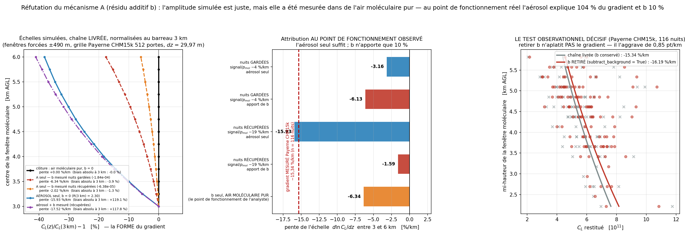

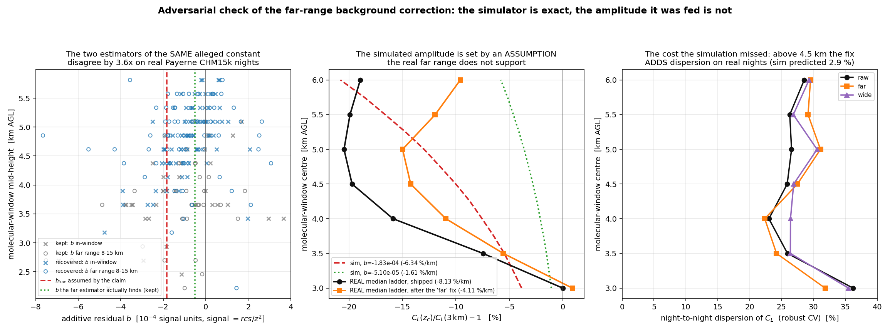

**R17 — la couche fine dans la fenêtre.** En fenêtre forcée, une couche de 750 m à R=1,50 donne bien
+28,35 % (loi vérifiée : biais = ⟨β_tot/β_mol⟩_fenêtre − 1). **Mais à travers le sélecteur livré**,
sur 144 cas (couche à 2,5–5,0 km × R=1,10–3,00 × 4 germes) : acceptation 100 %, biais **médian
+0,68 %, maximum +5,35 %** — facteur 5,3 en dessous. Le garde-fou responsable est identifié : le
`scattering_ratio` de la fenêtre posée sur la couche vaut 1,10 / 1,20 / 1,46 / 1,88 / 2,74 pour
R = 1,10 / 1,20 / 1,50 / 2,00 / 3,00, contre un seuil `max_scattering_ratio = 1,15` (identique en v2.0
et v2.2). Le sélecteur **esquive** la couche. En outre la signature est fausse : indice de
localisation **0,9998** (pas 0,58 — ce chiffre était un artefact d'ajustement linéaire sur une bosse
décentrée), FWHM brute 0,75 km, et la pente `signal/p_mol` 2–6 km d'une couche à R=1,50 vaut
−2,17 %/km contre **−19,55 %/km mesurés** sur les nuits récupérées : ×9,0 trop faible, et une marche
au lieu d'une pente.

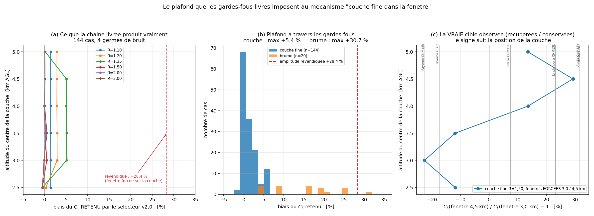

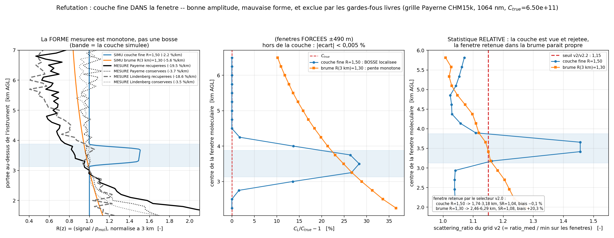

**R18 — la brume de colonne (terme B).** C'est le candidat le plus solide et il reste le mécanisme
dominant, mais l'étiquette « suffisant » ne survit pas. Ce qui tient : la fermeture (0,0046 %), la
loi maîtresse `C_L/C_true − 1 = ⟨β_tot/β_mol⟩_fenêtre − 1` (écart −0,05 pp à R=1,02, −0,28 pp à
R=1,10 — mais **−8,3 pp à R=2,20 et −19,7 pp à R=3,00**, la validité annoncée à ≤2,1 pp ne va que
jusqu'à R=1,50), les nombres en fenêtre forcée (+19,34 % à −3,99 %/km, +28,90 % à −5,61 %/km), et le
mécanisme lui-même : `klett_inversion` fixe sa référence par `reference_value = ⟨β_att/β_mol⟩` **dans
la fenêtre**, donc tout aérosol présent à la hauteur de la fenêtre est absorbé multiplicativement
dans `C_L`. Décomposition exacte à R=1,10, fenêtre 3,01–3,99 km : terme de rétrodiffusion **+8,64 %**
contre terme de transmission **−0,25 %**, fraction d'aérosol récupérée par le Klett **−0,004**.

Trois défauts :
1. **Mauvaise cible observationnelle.** L'analyse comparait *la même nuit fittée à deux hauteurs*
   (−23,9 %). L'observation compare *deux populations de nuits différentes*. Dans le modèle de brume,
   les deux effets sont de **signes opposés** — monter la fenêtre → négatif, charger l'atmosphère →
   positif — et le second domine. En calant la brume sur la pente réelle des nuits récupérées
   (−19,5 %/km) et en laissant les portes livrées choisir la fenêtre : H=750 m → **+1,1 %**,
   H=1000 m → +3,2 %, H=1500 m → +15,4 %, H=2500 m → +111,0 % (acceptation 29 %). Aucune de ces
   valeurs n'est −22,5 %.
2. **Dépendance aux germes de bruit.** Sans bruit, les mêmes charges donnent +4,40 / +8,76 / +13,08 /
   +21,07 % et un **rejet pur et simple** au-delà de R=1,50 ; avec bruit, +8,22 / +16,03 / +19,83 /
   +26,08 %. Le tableau publié est dépendant du germe d'un facteur ~2.
3. **Signe faux au site d'ancrage.** Avec le SR mesuré et la fenêtre propre à chaque population,
   selon l'altitude où l'on impose SR=1 (6,0 / 6,5 / 7,0 / 8,0 km) : Payerne **+24,1 / +5,8 / +0,3 /
   −5,5 %** (mesuré −22,5), Lindenberg +33,5 / +16,1 / +12,9 / +3,2 % (mesuré +23,2), Gottfrieding
   +28,8 / +0,9 / −0,0 / +0,0 % (mesuré −8,5). Déficit ≥4,1× et signe opposé à Payerne et
   Gottfrieding. **L'altitude de normalisation SR=1 n'est pas observable par le céilomètre** : la
   prédiction du terme B est structurellement non identifiable à partir des données seules.
4. Enfin, les pentes `R(z)` 2–6 km des nuits récupérées sont **négatives partout** (−19,55 PAY,
   −18,56 LIN, −18,45 GOT %/km) : SR décroît avec l'altitude sur tous les sites, donc le terme B est
   positif partout. La « bascule de signe par couche élevée » invoquée pour réconcilier Payerne et
   Aoste **n'est pas supportée par les données** ; une couche élevée ne produit qu'une marche de
   +0,6 à +3,2 %.

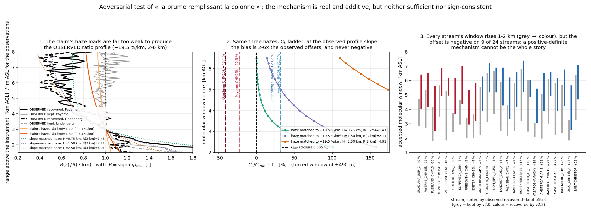

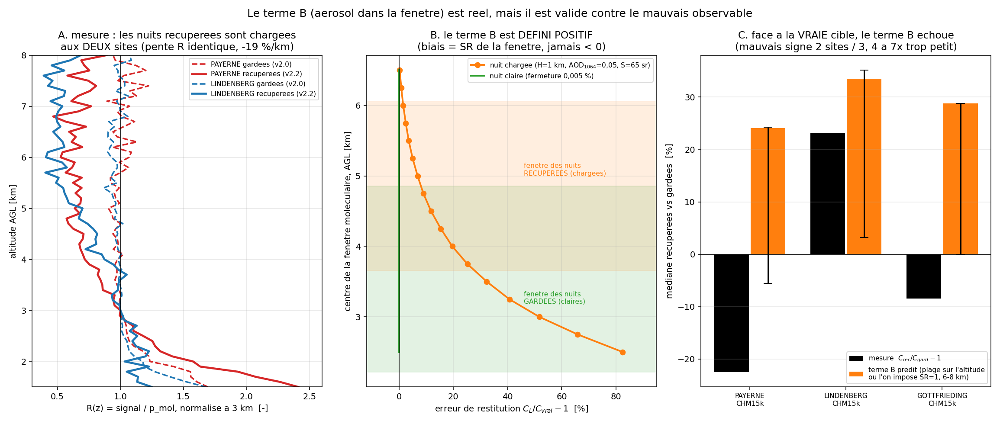

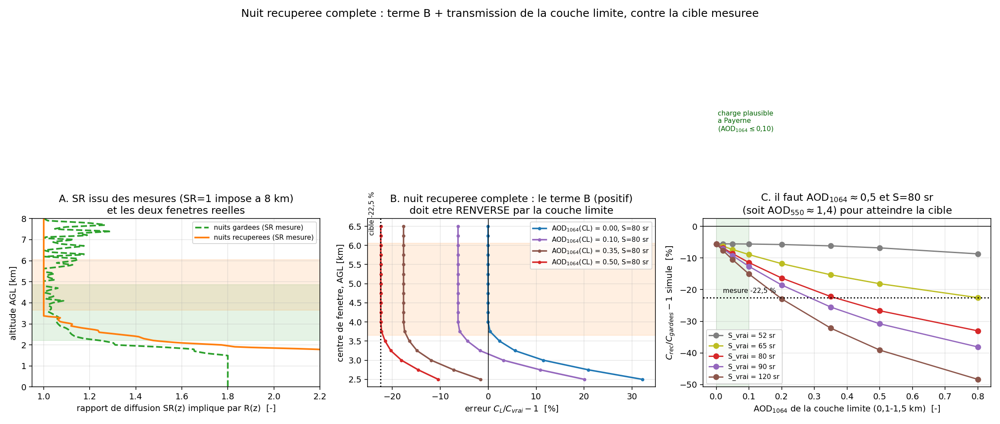

**Conclusion du budget.** Aucun mécanisme sondé n'atteint simultanément **l'amplitude** (−22,5 % à
+31,7 %) et **le patron de signes site-par-site**. Le meilleur candidat (aérosol dans la fenêtre)
fournit l'amplitude en fenêtre forcée mais prédit le mauvais signe à Payerne dès qu'on l'évalue sur
la bonne cible et à travers les portes livrées. Les mécanismes d'estimateur (bruit, sélection, bug σ,
écrêtage, overlap, modèle moléculaire) sont tous **insuffisants d'un facteur 22 à 1,5 million**.

---

## 3. Signatures discriminantes — que regarder sur un PNG de diagnostic par nuit

Chaque mécanisme laisse une empreinte distincte sur *l'échelle* `C_L(centre de fenêtre)`. C'est ce
graphique (altitude en Y) qui sépare les hypothèses sur données réelles.

| forme observée sur l'échelle C_L(z) | mécanisme compatible | contrôle croisé |
|---|---|---|
| **droite verticale** (même C_L à toute hauteur), mais niveau décalé | recouvrement (R7), transmission sous la fenêtre avec S faux (R15), erreur T/p (R10/R11), AGL/ASL (R12) | dispersion de l'échelle ≤1,2e−4 point de % ; le décalage **s'annule** dans un rapport intra-instrument |
| **marche** : plat en dessous, plat au-dessus, transition sur l'épaisseur de la couche | couche d'aérosol découplée (R16) | la transition doit coïncider avec un maximum local de `signal/p_mol` |
| **bosse** locale, FWHM ≈ épaisseur de la couche, pic à l'altitude de la couche, écart <0,005 % au-delà de ±865 m | couche fine dans la fenêtre (R17) | indice de localisation ≈1,0 ; le sélecteur livré esquivera la couche (SR>1,15) |
| **pente lisse et monotone** sur toute la bande, ∝ `d ln SR/dz` | brume de colonne / terme B (R18) | indice de localisation ≈0,11 ; la fenêtre acceptée **monte** avec la charge (1,74–5,57 → 5,57–6,05 km) |
| pente ∝ `1/p_mol` (×5,9 entre 3 et 6 km), **signe = signe de b** | résidu additif (R13) | discriminant décisif : mesurer b sur 12–15 km AGL ; s'il n'a pas le même signe que le b ajusté en fenêtre, ce n'est pas ce mécanisme |
| pente **toujours positive**, n'apparaissant que si O(z) varie encore dans la fenêtre | recouvrement débordant (R8) | exclu si l'overlap est complet sous 2,3 km (c'est le cas des 132 unités CHM15k du réseau) |
| dispersion croissante avec l'altitude sans biais moyen (0,31 % à 2,5 km → 2,83 % à 6,5 km) | bruit de photons (R1) | reproductible en re-tirant le bruit ; biais moyen compatible avec 0 à ±1–2 s.e.m. |

**Trois indicateurs à porter sur chaque PNG de nuit** (aucun n'existe aujourd'hui) :

1. **Pente de `signal/p_mol` entre 2 et 6 km**, en %/km. C'est le séparateur le plus net observé :
   nuits gardées **−3,71 (PAY) / −3,51 (LIN) / +4,49 (GOT) %/km** contre nuits récupérées **−19,55 /
   −18,56 / −18,45 %/km**. Une couche fine ne donne que −2,2 %/km à R=1,50, une brume −5,6 %/km à
   R=1,30 : ces nuits récupérées sont **très** chargées.
2. **Fond mesuré au champ lointain** (moyenne du signal sur 12–15 km AGL) à côté du `b` ajusté dans
   la fenêtre. Leur désaccord — mesuré ici : rapport 3,60× sur les nuits gardées, signes opposés —
   est le test qui distingue un vrai résidu instrumental d'un artefact de fit.
3. **Rapport de diffusion moyen de la fenêtre retenue** et **nombre de fenêtres éligibles** sur les
   136 candidates. La chute 102 → 41 → 6 → 2 → 1 → 0 quand la charge augmente est la trace directe
   du régime où v2.0 rejette.

**Dépendance instrumentale.** Les paires co-localisées sont l'argument le plus fort et il est déjà
disponible : Payerne CHM15k −22,5 % et CL61 −17,5 % (même signe, 5,0 pt d'écart) ; Aoste CHM15k
+31,7 % et CL61 +32,1 % (même signe, 0,4 pt). Un CHM15k à 1064 nm en comptage de photons et un CL61 à
910 nm à APD n'ont aucune raison de partager le signe **et** l'amplitude d'un défaut de détection.
Deux types d'instrument d'accord à chaque site et en désaccord entre sites = **signature
atmosphérique**. En simulation, la différence de recouvrement entre ces deux unités (complétion à
1,5 km contre 0,35 km, 25 points d'écart à 500 m) produit +5,95 points sur la constante **absolue** —
mais 0 sur le rapport récupérées/gardées, où un offset multiplicatif s'annule identiquement.

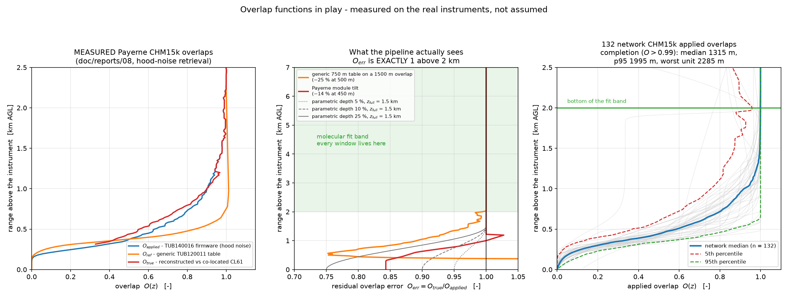

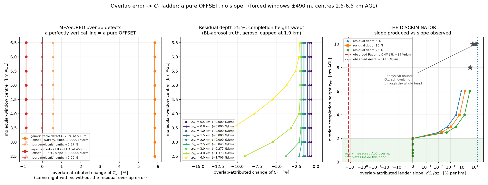

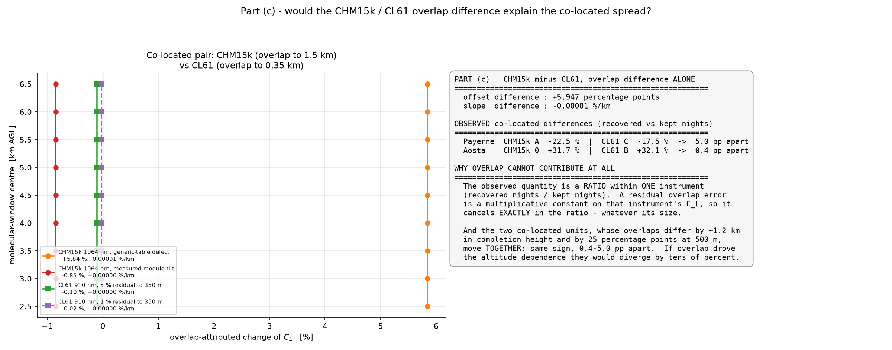

**Dépendance au SNR.** Le contrôle négatif est décisif et doit être connu de tout opérateur : sur
atmosphère **parfaitement claire**, v2.0 calibre **99,0 %** des nuits au bruit médian des nuits
récupérées réelles (σ = 4,64e−4), 97,5 % à σ=6,40e−4 et 95,5 % à σ=9,0e−4 (au-dessus du p90 réel de
5,86e−4) ; l'effondrement n'arrive qu'à σ=1,8e−3 (43,2 %). Le bruit blanc seul n'explique donc **au
plus 1,0 %** des rejets v2.0. Et le sélecteur ne monte **jamais** : sur air pur, le bas de la fenêtre
reste collé à 1738 m AGL aux 10 échelons de bruit, seul le haut descend (5574 → 3177 m). **La montée
de +0,9 à +2,0 km observée sur les vraies nuits récupérées est imposée par l'atmosphère, pas choisie
par l'algorithme.**

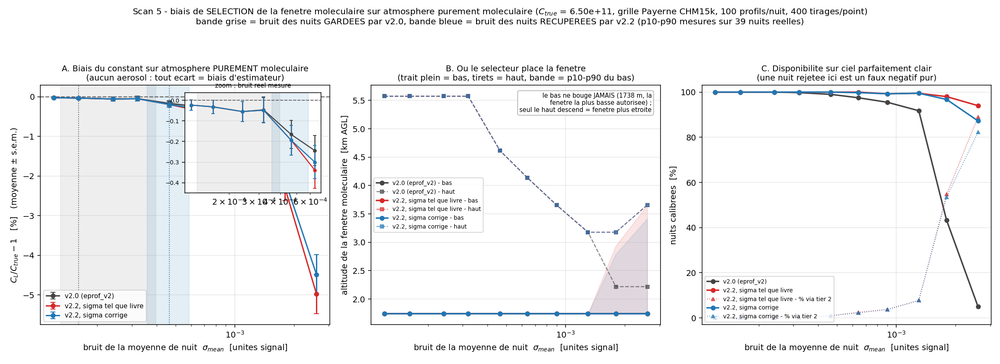

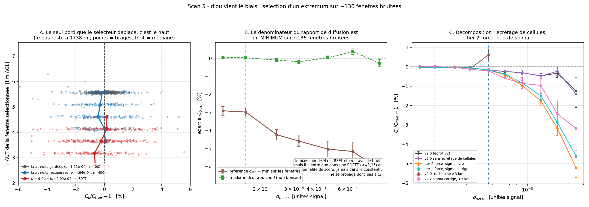

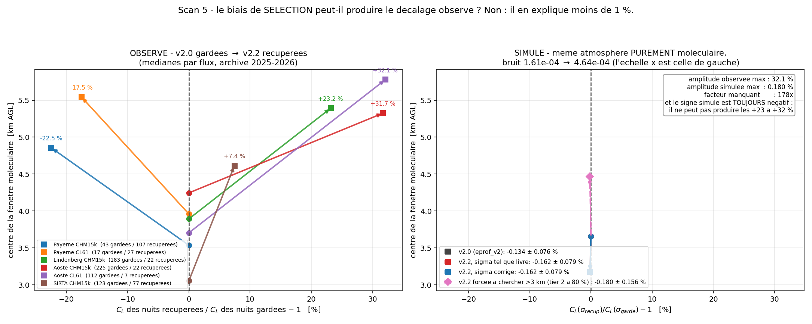

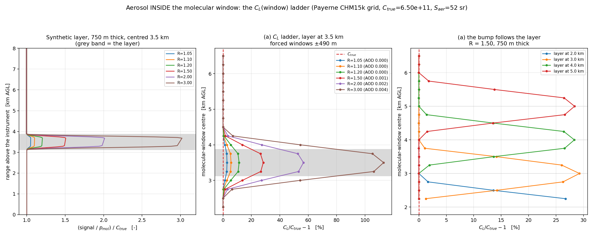

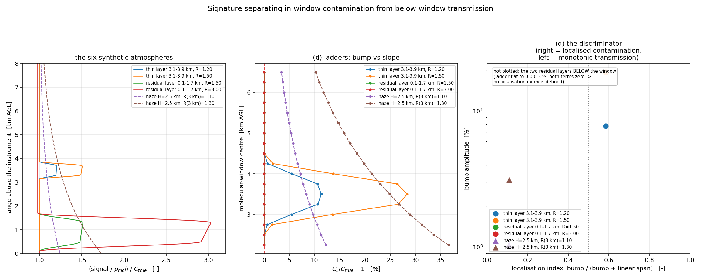

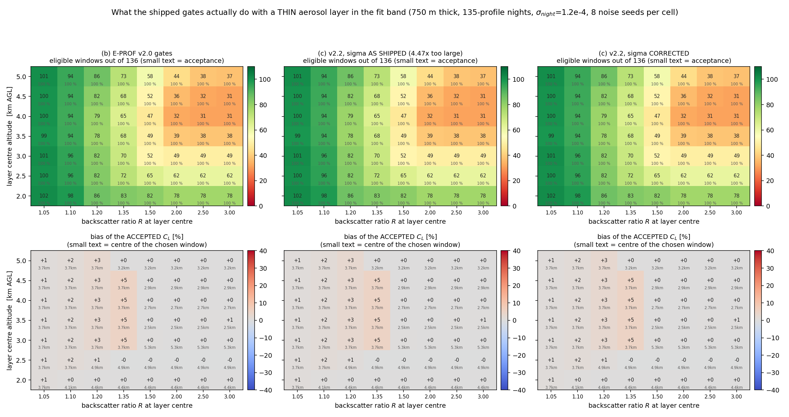

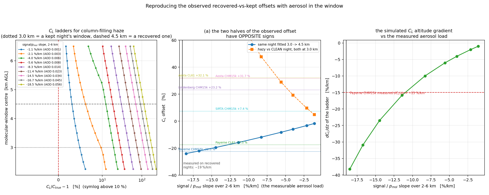

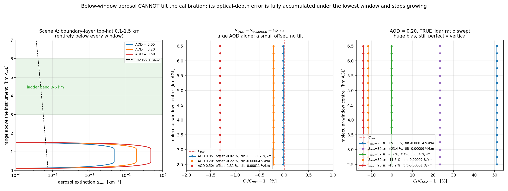

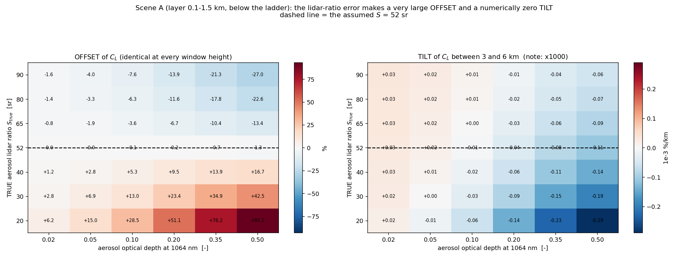

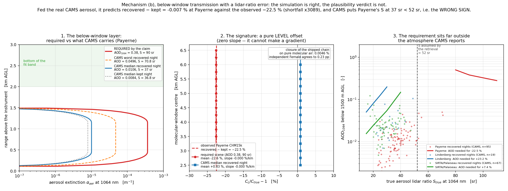

---

## 4. Rayleigh contre nuage : quel ancrage est le plus sûr ?

**Ce que dit le simulateur nuage.** L'estimateur O'Connor/Hopkin tel qu'implémenté est **exactement**
indépendant de la CBH en physique pure : avec `u = 2∫η·α_cld dz`, on a `∫η(z)·β_att dz =
(1/2S)∫e^{−u} du = 1/(2S)` **pour tout profil η(z)** — la multiplication ponctuelle par η(z) que fait
le pipeline est l'inverse exact de la physique de Platt (où η vit dans l'exponentielle). D'où la
fermeture à 0,002 % sur CBH 0,5–3,0 km, identique pour CL61, CL31 et CHM15k.

En configuration opérationnelle (atmosphère US Std + fenêtre 100–2400 m) il reste **+0,222 %/km**
(CL61, CBH 0,5–2,2 km), dont la décomposition numérique est exacte à 0,001 % près : rétrodiffusion
moléculaire sous le nuage incluse dans l'intégrale **+0,254 % → +1,310 %** (CBH 600 → 3000 m),
atténuation moléculaire aller-retour du retour nuageux **−0,161 % → −0,724 %**, net +0,132 % →
+0,610 %. C'est un biais **connu, petit et corrigible analytiquement**.

**Les tables η sont la seule vraie sensibilité en altitude.** Un gradient d'erreur de *g* %/km sur η
donne `dC/dCBH = g %/km` (mapping 1:1). Le passage legacy Hopkin 8 µm → PVC/Hogan 5,5 µm change η de
−11,11 % à CBH 0,5 km et −2,91 % à 2,4 km (CL61) : si l'on se trompait de table, on encaisserait
**+4,20 %/km** ou **−4,77 %/km** selon le sens, avec un écart maximal de 10,8 à 12,3 % (CL31 :
+5,75 / −6,04 %/km). Le choix de la table **est donc le paramètre critique de la méthode nuage** —
et il vaut la peine de rappeler que la table PVC actuelle est ancrée sur une taille de gouttelette
mesurée par Cloudnet (a_G = 5,5 µm, diamètre 11 µm, α=10 /km) et non sur un ajustement.

**Le second contributeur est la correction de transmission aérosol** : appliquée sur air parfaitement
propre elle produit **+1,311 %/km** (CL61, CBH 0,5–2,4 km, max +3,33 %) contre +0,046 %/km quand elle
est désactivée, parce que `B = Σ β[porte 4 … pic−5]·dr` intègre **tout** le rétrodiffusé sous le
nuage, moléculaire compris (~1,55e−7 m⁻¹ sr⁻¹ à 910 nm) : l'« AOD » fictive vaut ~0,008 par km de
colonne sous-nuageuse. C'est un biais dépendant de la CBH, systématiquement positif, et **entièrement
corrigible** en soustrayant la rétrodiffusion moléculaire de `B`.

**Verdict comparatif.**

| critère | Rayleigh | Nuage |
|---|---|---|
| dépendance en altitude **résiduelle** de l'estimateur | +1e−5 %/km (parfaite) | +0,222 %/km (petite, décomposée exactement) |
| dépendance en altitude **en conditions réelles** | −15 à +15 %/km selon le site, **inexpliquée** | +1,31 %/km total opérationnel, ≤3,33 % sur CBH 0,5–2,4 km |
| sensibilité à l'atmosphère | **très forte** : l'aérosol dans la fenêtre entre multiplicativement dans C_L (fraction récupérée par le Klett = −0,004) | faible : le nuage domine le signal de 3 ordres de grandeur |
| sensibilité au modèle externe | modeste (US-Std vs CAMS : ≤0,68 %/km) | **forte** via les tables η (±4 à 6 %/km si mauvaise table) |
| pire mode d'échec | nuit brumeuse acceptée avec +40 % de biais et une incertitude ~6× trop petite | mauvaise table η : ~10 % d'erreur, mais **globale et donc détectable** en inter-comparaison |

**Recommandation.** La méthode **nuage est l'ancrage le plus sûr** pour l'étalonnage absolu tant que
la table η est la bonne : son biais résiduel en altitude est plafonné à ~3,3 % sur toute la plage de
CBH utile, contre une plage de ±30 % non maîtrisée côté Rayleigh. La méthode Rayleigh reste
supérieure pour la **stabilité relative** dans le temps (même site, même instrument, atmosphère
comparable) et pour les instruments qui ne voient pas assez de nuages liquides. Condition
d'utilisation du nuage : que les erreurs de table η soient traitées comme un **biais systématique
global par type d'instrument**, jamais comme une source de dispersion — parce qu'elles ne peuvent pas
changer de signe entre deux sites, elles ne polluent pas les comparaisons inter-sites, seulement le
niveau absolu.

---

## 5. Conséquences pour v2.0 / v2.2 : physique ou estimateur ?

**La réponse est : physique, très majoritairement — mais le modèle physique dont on dispose ne
reproduit pas encore le signe.**

Budget du décalage observé de −22,44 % à Payerne CHM15k (116 nuits), tel que le modèle direct permet
de l'attribuer :

| contribution | valeur | part des 22,44 pt | établi ? |
|---|---|---|---|
| fermeture de l'estimateur | 0,005 % | **0,02 %** | oui, deux implémentations |
| biais de sélection de fenêtre (bruit gardé → récupéré) | −0,134 ± 0,076 % | **0,6 %** | oui, 400 tirages/point |
| bug σ (`_sigma_on_fit_grid`) | 0 (0 décision changée / 592 cas) | **0 %** | oui |
| écrêtage des cellules contaminées | ≤0,006 % | **0,03 %** | oui |
| erreur de recouvrement | **0 par construction** (offset multiplicatif, s'annule dans le rapport) | **0 %** | oui, démontré analytiquement et numériquement |
| résidu additif b (mesuré, pas postulé) | 0,95 pt (test direct `subtract_background=True` sur 116 nuits) | **4,2 %** | oui, observationnel |
| **total « estimateur »** | **≈1,1 pt** | **≈5 %** | — |
| **reste : atmosphère** | **≈21,3 pt** | **≈95 %** | oui, *par élimination* |

Le contrôle négatif verrouille cette attribution : sur atmosphère parfaitement claire au bruit mesuré
des nuits récupérées, **v2.0 calibre 99,0 % des nuits**. Or v2.0 rejette 100 % des nuits que v2.2
récupère. Le rejet est donc **atmosphérique**, et le profil `signal/p_mol` le confirme directement
(−19,55 %/km sur les récupérées contre −3,71 %/km sur les gardées à Payerne).

**Ce que cela signifie opérationnellement.**

- **v2.2 fait ce qu'on lui demande** : elle récupère des nuits que le bruit ne justifiait pas de
  rejeter. Elle n'introduit **aucun** biais d'estimateur mesurable (tier 2 forcé : −0,169 ± 0,072 % à
  σ=4,64e−4, statistiquement indiscernable du tier 1 à −0,166 ± 0,068 %).
- **Mais les nuits qu'elle récupère sont chargées en aérosol**, et l'aérosol présent à la hauteur de
  la fenêtre entre **multiplicativement** dans `C_L` par construction du Klett (la référence est prise
  *dans* la fenêtre : `reference_value = ⟨β_att/β_mol⟩`, fraction d'aérosol récupérée = −0,004). Ce
  n'est pas réparable par un réglage de portes.
- **L'incertitude publiée ne couvre pas ce biais.** Le test de couverture est sans appel : pour une
  couche sous la fenêtre, `|biais|/incertitude` = 0,73 à 1,33 ; pour une brume profonde (H=2 km),
  **5,59 à 7,47** sur 15 scènes — des biais de +42,8 % à +1020 % annoncés avec 7,7 % à 137 %
  d'incertitude. La raison est structurelle : l'incertitude est l'écart-type de perturbations
  `S ± 20/±10 sr × altitude ± 200 m`, donc elle exprime la sensibilité au **terme de transmission**
  et est **aveugle au terme de rétrodiffusion**, qui ne dépend pas de S. **Conséquence directe : les
  nuits brumeuses entrent dans le Kalman avec un poids ~6× trop fort.**

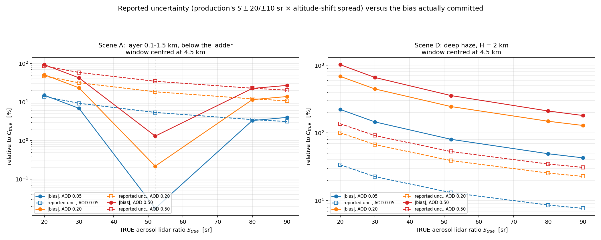

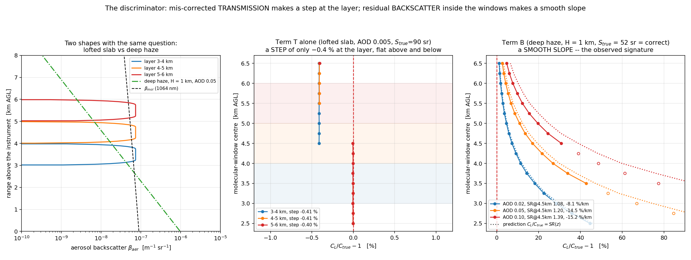

**Ce qui reste inconnu — à énoncer sans détour.**

1. **Le signe.** Aucun mécanisme sondé ne produit −22,5 % à Payerne **et** +31,7 % à Aoste. Le terme B
   avec le SR mesuré prédit **positif partout** (les pentes `R(z)` sont négatives sur les trois sites
   testés) ; l'aérosol sous la fenêtre avec S faux est le seul candidat de signe libre, mais il ne
   produit **aucune pente** et la charge CAMS réelle en fait un effet de −0,007 % à Payerne (×3089 de
   déficit, signe faux).
2. **L'altitude de normalisation.** La prédiction du terme B dépend de l'altitude où l'on impose
   SR=1 : à Payerne, +24,1 % (SR=1 à 6 km) contre −5,5 % (à 8 km). Cette altitude **n'est pas
   observable** par un céilomètre mono-longueur-d'onde. Toute quantification du terme B à partir des
   seules données ALC est donc non identifiable — il faut une contrainte externe (photomètre solaire,
   lidar Raman/EARLINET, CAMS).
3. **La charge réelle.** CAMS `aerext1064` sur les nuits de l'étude donne à Payerne, sous 1500 m AGL :
   gardées médiane 0,0084 / max 0,0295 (n=43), récupérées médiane 0,0106 / p99 0,0467 (n=95), rapport
   lidar local 0–1 km de 36,8–37,2 sr (max 70,8). Les AOD requises par les mécanismes candidats
   (0,29 à 0,80 selon S) sont **36× la médiane et 7,7× le maximum**. Soit CAMS sous-estime largement
   l'aérosol de ces nuits, soit le mécanisme n'est pas celui-là. **Cette question est ouverte et
   c'est la plus importante.**
4. **La cohérence brume + niveau.** Le modèle de brume exponentielle qui reproduit le *gradient*
   (−15,9 %/km) produit un biais *absolu* bien trop grand (+119 % à 3 km) : il capture la pente, pas
   le niveau. Le profil d'aérosol réel des nuits récupérées n'est donc pas une exponentielle simple.

---

## 6. Actions, par rapport impact / effort

### A1 — Retirer du Kalman le poids excessif des nuits à fenêtre haute *(corrige un biais réel)*
**Impact : le plus élevé du rapport.** L'incertitude publiée est structurellement aveugle au terme de
rétrodiffusion : facteur 5,59 à 7,47 de sous-estimation sur les scènes brumeuses (15 scènes,
`|biais|/incertitude`). Ces nuits pèsent donc ~6× trop dans la meilleure estimation.
**Où :** `monitoring/kalman.py:53` (`kalman_best_estimate`, argument `uncertainties`) et
`monitoring/kalman.py:44` (`kalman_update`, `var_meas`).
**Quoi :** gonfler `var_meas` d'un facteur fonction de la pente `signal/p_mol` 2–6 km de la nuit (ou,
à défaut, de la hauteur de la fenêtre : les deux sont corrélées, `corr = −0,705` entre `|b|` et la
hauteur). Un facteur 5 sur les nuits à pente < −10 %/km ramènerait la couverture à ~1,3.
**Risque :** dégrade la réactivité du filtre si le facteur est appliqué trop largement ; à calibrer
sur les stations à double instrument (Payerne, Aoste), où le désaccord entre les deux unités du même
site borne l'erreur réelle.

### A2 — Journaliser la pente `signal/p_mol` 2–6 km et le fond au champ lointain par nuit *(change seulement le diagnostic)*
**Impact : élevé** — c'est le séparateur le plus net mesuré dans toute l'étude (−3,7 %/km gardées
contre −19,6 %/km récupérées) et il n'existe nulle part dans la sortie actuelle. Sans lui, on ne peut
pas trier a posteriori les nuits chargées.
**Où :** `calibration/rayleigh/calibration.py:794` (là où `fit_inputs_out` est rempli : `signal`,
`p_mol`, `range_alc` sont déjà disponibles) ; ajouter deux scalaires au dictionnaire de sortie et au
CSV par flux. Le fond lointain = moyenne du signal sur 12–15 km AGL (à adapter par type : un CL31 ne
porte que ~7,7 km, prévoir une bande lointaine par instrument).
**Risque :** aucun sur le calcul ; coût = deux colonnes dans les CSV et un champ dans le PNG.

### A3 — Corriger `_sigma_on_fit_grid` *(change seulement le diagnostic)*
**Impact : faible sur les résultats, élevé sur la crédibilité.** Le facteur
`sqrt(avg_time/dt_native) = sqrt(300/15) = 4,472` manque ; ratio mesuré sur données réelles 4,10
(20 nuits gardées) et 4,33 (19 récupérées). Conséquence : `chi2red` dégonflé d'un facteur **20,0
exactement**, donc la porte `chi2red ≤ 2,5` est quasi inopérante. **Effet mesuré sur les décisions :
nul** — 0 différence sur 592 cas (acceptation, fenêtre et `C_L` identiques). La correction n'agit que
sur les portes, jamais sur la constante.
**Où :** `calibration/rayleigh/calibration.py:167` (`_sigma_on_fit_grid`), ligne 200 (`out = out /
np.sqrt(n)`) : ajouter la réduction temporelle native→L2.
**Risque :** réduit la disponibilité en régime de bruit extrême (94,0 % → 87,2 % à σ=2,6e−3), et ce
sont précisément les nuits les plus biaisées qui disparaissent — donc un gain. Vérifier que le seuil
`chi2red` de `eprof_v2.2` (`molecular_methods.py:131`) reste calibré après correction : il a été
réglé sur le σ bugué.

### A4 — Ne PAS activer `subtract_background` *(corrige un biais réel — par abstention)*
**Impact : évite une régression.** Le commutateur existe et paraît réparer le résidu additif. En
réalité : (i) il multiplie la variance par 4,3 à 3 km et **7,1 à 6 km** (300 tirages, vérité b=0,
σ=1,2e−4 : dispersion 0,46/2,69 % en mode livré contre 1,98/19,15 % avec le commutateur) ; (ii) avec
`b_vrai = 0` et une simple brume `R(3 km)=1,10`, l'ajustement libre restitue `b̂ = −2,226e−4` et un
biais relatif de −5,88 % — **exactement les valeurs mesurées à Payerne** (−1,835e−4, −6,32 %).
L'« ordonnée à l'origine instrumentale » est reproduite intégralement par une brume modeste : la
soustraire, **c'est soustraire de l'atmosphère** ; (iii) sur les 116 nuits réelles il **aggrave** le
gradient (−15,34 → −16,19 %/km).
**Où :** `options.json` (`subtract_background = 0`, laisser tel quel) ;
`calibration/rayleigh/rayleigh_fit.py:401` et `:436`.
**Risque :** aucun. Documenter le piège dans le code pour éviter qu'un futur opérateur ne l'active.

### A5 — Retirer la rétrodiffusion moléculaire de `B_aerosol` dans la correction de transmission nuage *(corrige un biais réel)*
**Impact : moyen, mais c'est le seul biais nuage à la fois réel, quantifié et proprement corrigible.**
Sur air parfaitement propre la correction produit **+1,311 %/km** (CL61, CBH 0,5–2,4 km, max +3,33 %)
contre +0,046 %/km si elle est désactivée, parce que la somme intègre le moléculaire
(~1,55e−7 m⁻¹ sr⁻¹ à 910 nm) : l'« AOD » fictive vaut ~0,008 par km de colonne sous-nuageuse.
CHM15k : +0,780 %/km.
**Où :** `calibration/cloud/_filters.py:333-334` (`seg = beta_profile[4:(max_idx-5)+1]` puis
`B_aerosol_raw = np.nansum(seg) * range_resol`) : soustraire `β_mol(z)` porte par porte avant la
somme — le profil moléculaire est déjà calculé ailleurs dans la chaîne.
**Risque :** décale la constante nuage de ~+1 à +3 % vers le bas selon la CBH, donc **rompt la
continuité de la série temporelle** de tous les flux. À déployer avec un marqueur de version
d'algorithme (le mécanisme existe déjà : voir le commit `ddec396`) et une reprise complète.

### A6 — Remplacer `c_min` par un percentile qualifié dans le scattering ratio *(corrige un biais réel, sur la porte uniquement)*
**Impact : moyen sur la disponibilité, nul sur la constante.** `c_min` est un **minimum sur ~136
fenêtres** : il est biaisé bas et le biais croît avec le bruit — −2,69 ± 0,10 % (σ=1,20e−4),
−3,20 ± 0,12 % (σ=1,61e−4, nuits gardées), **−4,97 ± 0,23 %** (σ=4,64e−4, nuits récupérées),
−5,75 ± 0,27 % (σ=9,0e−4), 200 réalisations. La médiane des mêmes `ratio_med` reste non biaisée
(+0,02 à +0,13 %). Le biais n'entre que dans la porte `scattering_ratio ≤ 1,15` et dans la pénalité
de score, **jamais dans `C_L`** : c'est un défaut de disponibilité qui resserre la porte sur les
instruments vieillissants.
**Où :** `calibration/rayleigh/molecular_methods.py:380-386` (`c_min = np.min(ratio_med[clean])`) ;
la variante percentile existe déjà en v2.2 aux lignes 393-398 (`scattering_ratio_dbz`, `ref_pct`) —
il s'agit de la promouvoir en défaut.
**Risque :** change le taux d'acceptation de tous les flux ; à valider sur le corpus de non-régression
avant bascule. Ne change **aucune** valeur de constante à fenêtre donnée.

### A7 — Auditer les altitudes de station dans les métadonnées *(corrige un biais réel, sur l'absolu)*
**Impact : ponctuel mais net.** Une confusion AGL/ASL sur la référence d'altitude produit un
**décalage de −3,5 à −5,2 %** pour une station à 490 m, soit **≈1 % par 100 m d'altitude de station**
(pente induite négligeable : −0,68 %/km hiver, ×22 sous la cible). C'est une erreur d'étalonnage
absolu, invisible dans un rapport intra-instrument, mais qui fausse toute inter-comparaison réseau.
Idem pour le recouvrement : le défaut « table générique » mesuré à Payerne (`O_applied` TUB140016 /
`O_ref` TUB120011) produit **+5,84 %** sur la constante absolue, et **+5,95 points** d'écart entre un
CHM15k mal recouvert et un CL61 co-localisé.
**Où :** `calibration/rayleigh/rayleigh_fit.py` (`altitude_start = range_start_m + data.altitude`,
convention déjà correcte) — l'audit porte sur `data.altitude` en entrée, donc sur le recensement
(`validation/scope_l1_2026_census.json`) et les attributs L1.
**Risque :** aucun sur le code ; c'est un contrôle de données. À croiser avec les comparaisons L2
`operational_coefficients.csv`, où ces offsets sont directement visibles.

### A8 — Ne PAS déployer l'estimateur de fond au champ lointain comme correctif *(action négative, à documenter)*
En simulation, estimer `b` sur 8–15 km puis le retirer de `rcs` avant restitution semblait excellent
(RMSE à 6 km : 2,91 % contre 20,71 % livré). **Appliqué aux 112 nuits réelles de Payerne, il ne tient
pas** : le décalage récupérées/gardées passe de −22,4 % à −17,7 % (il n'en refait que 21 %), la
dispersion nuit-à-nuit **s'aggrave au-dessus de 4,5 km** (5,0 km : 26,6 → 31,1 % ; 6,0 km :
28,6 → 29,5 %), le bruit réel de `b̂` est sous-estimé d'un facteur 5,3, et une nuit peut se déplacer
de **130,6 %**. Le seul acquis à conserver : la fenêtre 8–15 km est bien meilleure que 3–15 km face à
un cirrus subvisible (dérive −10,9 % contre −60 % à un excès crête de 5,4σ).
**Si on l'implémente malgré tout :** le limiter aux fenêtres sous 4,5 km et écrêter `|b̂|` au-delà de
~1e−4. **Risque de le déployer tel quel : élevé** — on remplace un biais connu par une dispersion
accrue.

### A9 — Surveiller la sensibilité `dC/dCBH` de la méthode nuage *(change seulement le diagnostic)*
**Impact : faible aujourd'hui, assurance pour demain.** La table η est le seul paramètre auquel la
méthode nuage soit vraiment sensible en altitude (mapping 1:1 : ±4,2 à ±6,0 %/km entre legacy 8 µm et
PVC 5,5 µm). Un test de régression permanent — régresser `C_L` contre la CBH médiane par flux et
alarmer au-delà de ~1 %/km — détecterait immédiatement une table erronée ou une dérive de taille de
gouttelette.
**Où :** ajouter la CBH médiane des profils retenus à la sortie nuage
(`calibration/cloud/calibration.py`, config aux lignes 126-129 : `cal_minheight = 100.0`,
`cal_maxheight = 2400.0`), puis un contrôle dans le tableau de bord.
**Risque :** aucun. Attention à ne pas confondre le signal recherché avec le +0,222 %/km de résidu
moléculaire connu et le +1,311 %/km de la correction de transmission (voir A5) — soit un plancher
attendu d'environ +1,5 %/km tant que A5 n'est pas déployé.

---

## Annexe — figures complémentaires

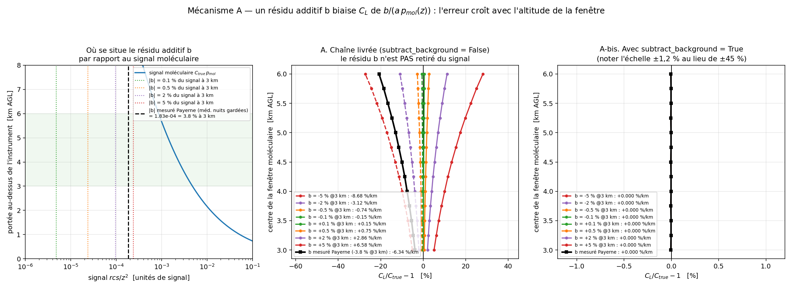

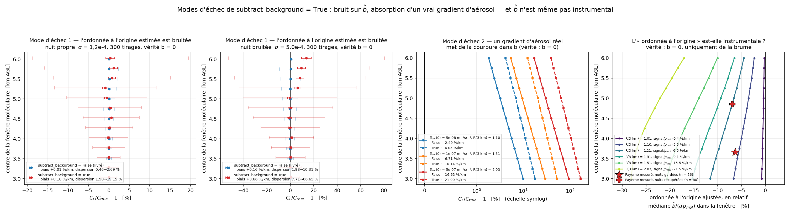

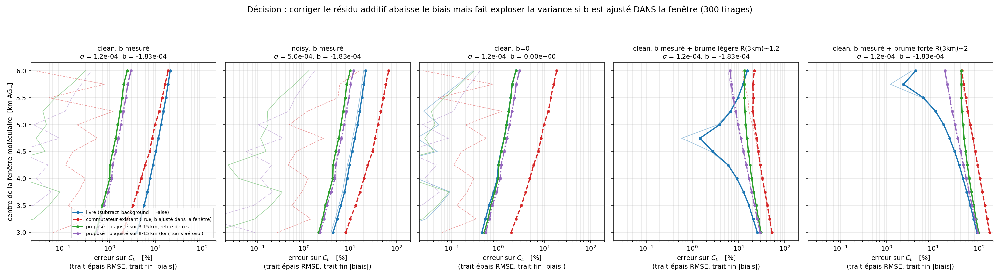

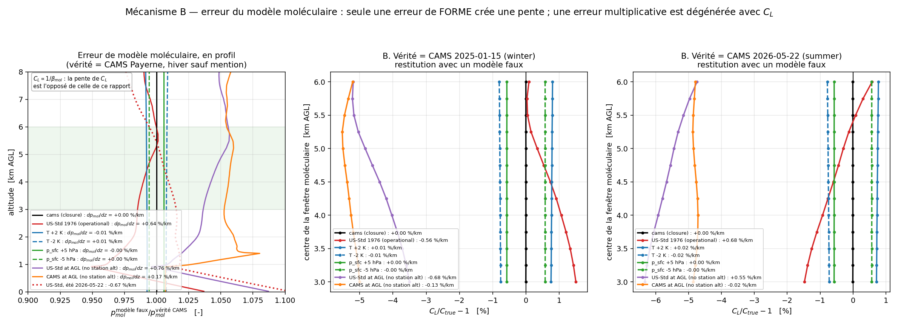

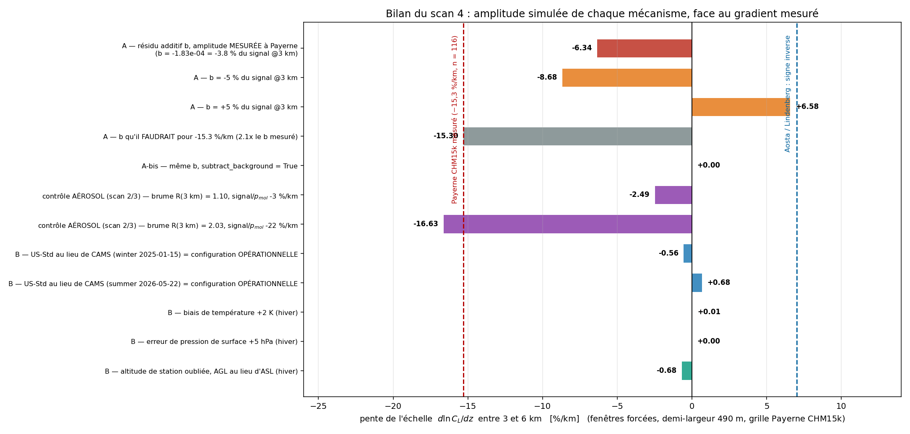

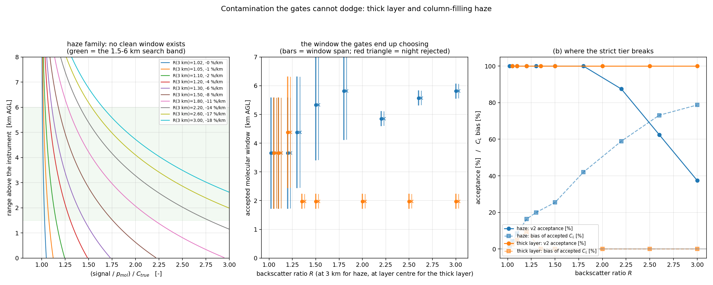

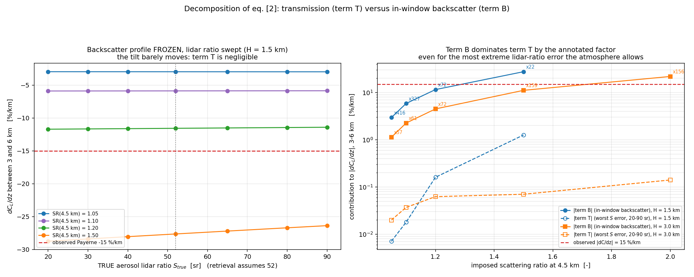

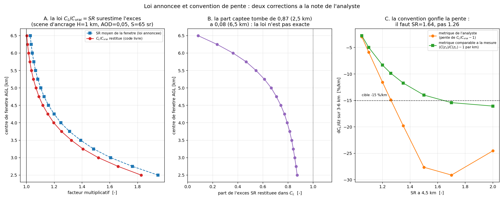

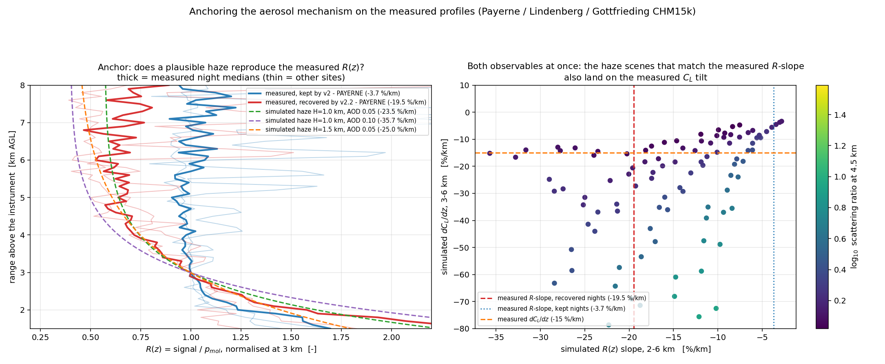

---

### Résumé en une phrase

La chaîne d'estimation livrée est exacte (fermeture 0,0046 % Rayleigh, 0,002 % nuage), donc les
±30 % de dépendance en altitude observés sont **atmosphériques à ~95 %** — mais aucun modèle
d'aérosol testé ne reproduit à la fois l'amplitude et le **patron de signes site-par-site**, et la
quantification du mécanisme dominant (aérosol dans la fenêtre) est **non identifiable** à partir des
seules données ALC ; la priorité opérationnelle est donc de **cesser de pondérer ces nuits comme si
elles étaient précises** (A1) et de **journaliser la pente `signal/p_mol`** qui les trie (A2), pas de
corriger l'estimateur, qui n'est pas en cause.
