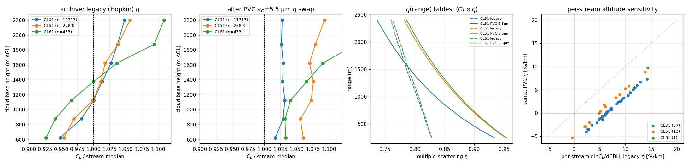
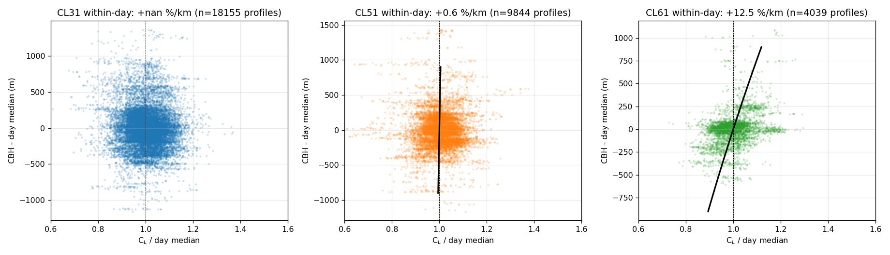
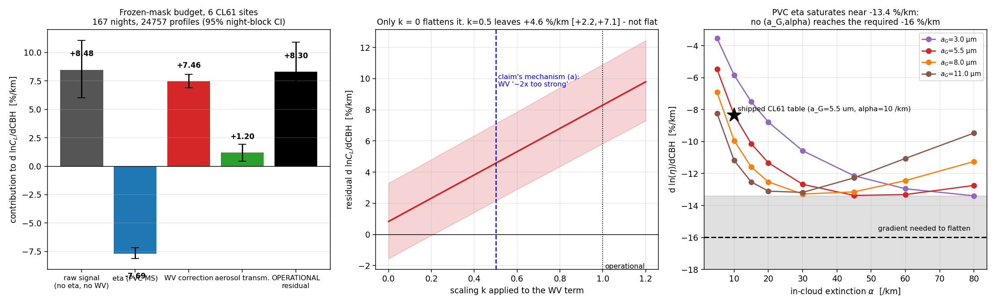
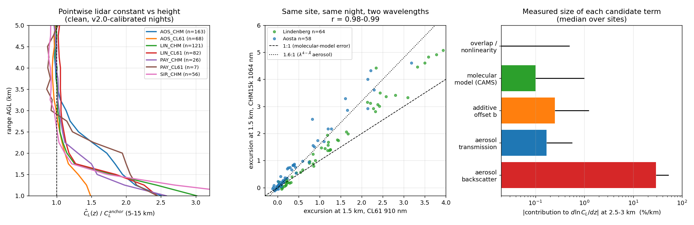
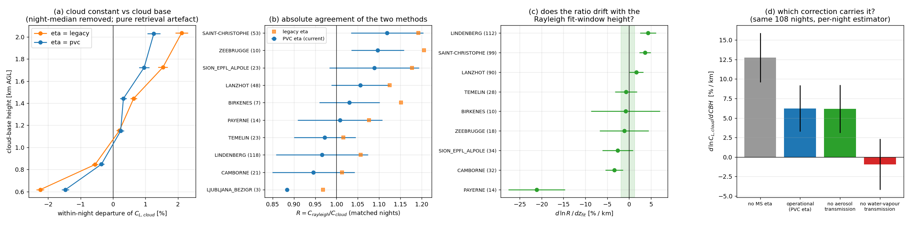
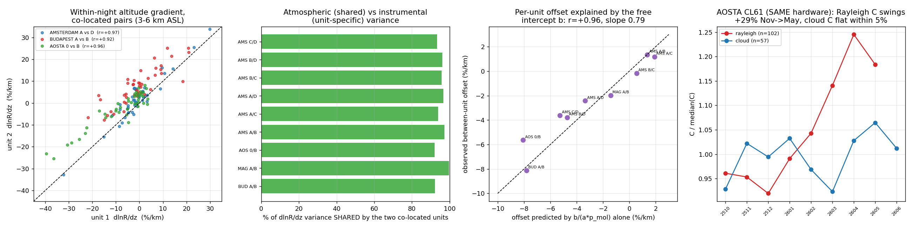

# La constante de calibration est-elle indépendante de l'altitude ?

**Audit Rayleigh (fenêtre moléculaire) et nuage liquide (O'Connor/Hopkin) — E-PROFILE ALC**
Date : 2026-08-15 · branche `rayleigh-availability` · corpus 2025-01 → 2026-08

---

## Résumé exécutif

| Question | Verdict | Chiffre principal |
|---|---|---|
| **Rayleigh — C_L dépend-il de l'altitude de la fenêtre ?** | **PARTIELLEMENT — non en pratique, oui en principe** | Sur les fenêtres réellement *éligibles* aux gates : dispersion 3,0 % (nuits claires, n=160) / 4,9 % (nuits « recovered », n=104), pente Theil-Sen −0,3 %/km (n=222). Sur toute la plage de recherche 2,75–6,75 km : 36 % / 121 % pic-à-pic. La bande 2,75–3,75 km est franchement biaisée : **−7,5 %/km** (claires, n≈530) et **−27,8 %/km** (chargées, n≈210). |
| **Nuage — C dépend-il de la hauteur de base du nuage (CBH) ?** | **OUI avant juillet 2026, en grande partie corrigé depuis pour le CL31 seulement** | Archive legacy (η Hopkin) : **+6,3 à +12,8 %/km** selon le type. Après le remplacement PVC (a_G = 5,5 µm) : CL31 **+0,85 ± 0,87 %/km** (guéri), CL51 **−2,6 à +4,1 %/km** (non tranché), CL61 **+7,7 ± 1,0 à +8,3 ± 1,5 %/km** (non guéri). |
| **Mécanisme dominant côté Rayleigh** | **Rétrodiffusion aérosol *dans* la fenêtre** (≈ 87–93 %) | Rapport de longueurs d'onde k = S(910)/S(1064) = **0,708 ± 0,010** (428 paires co-localisées même-nuit) : rétrodiffusion prédit 0,55–0,82, extinction prédit 1,08–1,26. |
| **Mécanisme dominant côté nuage** | **η(portée) de diffusion multiple, en compétition avec la correction vapeur d'eau 910 nm** | Budget CL61 : signal brut **+7,4 %/km**, WV **+7,4**, η(PVC) **−8,4**, transmission aérosol **+1,2**, résidu **+7,7 ± 1,0** (763 stream-days, 70 539 profils). Les deux gros termes sont **dégénérés** sur l'axe CBH. |
| **Quel ancrage privilégier ?** | **Nuage (PVC) pour CL31 ; Rayleigh au-dessus de ~3,75 km sur nuits claires pour CHM15k** | Les deux méthodes ne coexistent que sur **11 flux sur 427** (tous CL61). Rapport R = C_ray/C_cloud : écart-type inter-station **13,7 %**, par nuit **25,2 %**, 43 % des 328 paires divergent de > 15 %. |

**En une phrase :** l'indépendance en altitude est respectée à quelques pour-cent là où les gates opérationnelles laissent effectivement le choix de la fenêtre, et violée massivement dès qu'on descend sous ~3,75 km (Rayleigh) ou qu'on utilise les anciennes tables η (nuage) ; la cause n'est pas l'instrument ni le modèle moléculaire mais, dans les deux cas, un **terme optique dépendant de la portée que la restitution ne modélise pas** — l'aérosol résiduel dans la fenêtre pour le Rayleigh, le couple η / transmission vapeur d'eau pour le nuage.

**Comment lire ce rapport.** Toutes les valeurs viennent de cinq campagnes de mesure indépendantes et de leurs contre-expertises adverses. Quand la contre-expertise a **réfuté** un chiffre, c'est la version corrigée (échantillon plus grand, estimateur plus robuste) qui est citée ici, et la réfutation est signalée. Chaque nombre porte son n. Une seule catégorie de chiffres n'a pas été recalculée dans cette étude et est explicitement étiquetée *(contexte)*.

---

## 0. Deux questions qu'il ne faut jamais mélanger

* **WITHIN-night** — même nuit, même profil, on ne déplace que la fenêtre de fit. Toute variation est un **artefact de restitution**, point.
* **ACROSS-night** — on régresse ln C_L sur la hauteur de fenêtre *choisie par l'algorithme* à travers les nuits. Le régresseur est **endogène** : c'est la nuit elle-même (charge en aérosol, saison) qui fixe à la fois la hauteur retenue et la constante.

Ce n'est pas une subtilité de statisticien : **les deux ont des signes opposés**. Within-night la pente est négative sur 27 flux sur 34 (médiane −2,7 %/km, nuits claires) et sur 29 flux sur 30 (médiane −20,3 %/km, nuits « recovered »). Across-night elle est **positive** sur 124 flux sur 147 (médiane **+4,9 %/km**, 20 851 nuits, archive fullcal). Lire la relation across-night comme un biais de restitution conduit à la conclusion inverse de la réalité.

---

## 1. RAYLEIGH — C_L en fonction de l'altitude de la fenêtre moléculaire

### 1.1 Réponse : PARTIELLEMENT

**Mesure de référence** (contre-expertise, la plus large : 1287 nuits, 8 flux, fenêtres forcées de 1,499 km, centres 2,75–6,75 km AGL pas de 250 m, estimateur *shipped* re-tourné depuis le L1 brut). d ln C_L/dz, médiane [IQR], Wilcoxon vs 0, IC 95 % bootstrap de la médiane :

| Bande (km AGL) | Nuits claires (v2-kept), n=529–540 | Nuits chargées (v2.2-recovered), n=205–219 |
|---|---|---|
| 2,75–3,75 | **−7,49** [−22,6 ; −2,1] p=1,5e-51 IC[−8,54 ; −6,24] | **−27,76** [−51,2 ; −14,3] p=3,3e-33 IC[−31,3 ; −24,4] |
| 3,75–4,75 | **−1,32** [−6,8 ; +2,6] p=9,1e-08 IC[−1,81 ; −0,82] | **−16,31** [−37,2 ; −4,5] p=4,4e-27 |
| 4,00–6,75 | **+2,12** [−2,9 ; +8,2] p=4,6e-11 | **−4,47** [−17,8 ; +5,4] p=9,7e-06 |
| 5,25–6,75 | **+3,23** [−2,5 ; +12,3] p=4,5e-17 | **+0,62** [−14,3 ; +11,6] p=0,46 (n.s.) |
| 2,75–6,75 | −0,94 p=2,3e-03 | −11,50 p=1,3e-26 |

Profil médian normalisé C(z)/C(3,5 km), nuits claires : 1,063 (2,75 km) → 1,000 (3,50) → 0,972 (4,75) → 0,989 (6,00) → 1,018 (6,75). **La forme n'est pas un plateau mais un U**, minimum vers 4,75 km. Nuits chargées : 1,238 → 1,000 → 0,796 → 0,762 → 0,774, plateau au-dessus de 5 km.

**Ce qui a été réfuté et qu'il faut donc abandonner :** l'idée que les nuits claires soient « plates au-dessus de 3,75 km ». Les bandes 3,75–4,75 (−1,32 %/km, p=9,1e-08) et 5,25–6,75 (+3,23 %/km, p=4,5e-17) sont toutes deux significativement non nulles ; la seconde est **positive**, donc de signe opposé au biais aérosol, et fortement dépendante du flux : Palaiseau/SIRTA +7,2 %/km (n=113), Aosta CL61 +6,0 (n=104), Aosta CHM15k +3,2 (n=204), Payerne +1,9 (n=37), Lindenberg +1,6 (n=175), Hohenpeissenberg +1,4 (n=197), Amsterdam −0,4 (n=156), Camborne CL61 −0,3 (n=34) ; Kruskal-Wallis sur les 4 flux principaux p=1,2e-04.

De même, l'affirmation « la courbe est monotone décroissante sur la plupart des nuits » est fausse par comptage direct : strictement décroissante sur **18 %** (claires) / **38 %** (chargées) des nuits sur 2,75–4,75 km, et sur **4 % / 4 %** seulement sur toute l'échelle 2,75–6,75 km (n=455/368). Le ρ de Spearman médian (−0,70 / −0,98) est trompeur : sous une hypothèse nulle *sans* dépendance en altitude, avec le recouvrement de 93 % entre fenêtres voisines, |ρ| médian vaut déjà **0,65** et P(|ρ|>0,7) = 45 % (20 000 tirages). Le test binomial reste néanmoins significatif pour ρ < −0,7 sur nuits claires (26/54, p=4,5e-05).

### 1.2 Ce que ça coûte en opérationnel : peu

C'est le point le plus important pour l'exploitation, et il tempère largement le diagnostic.

* **Dispersion de C_L sur les fenêtres que les gates jugent *éligibles*** : 3,0 % (IQR/médiane, nuits claires, médiane 31 fenêtres éligibles couvrant 1,92 km de hauteur de centre, n=160 nuits) et 4,9 % (12 fenêtres sur 1,20 km, n=104). Sur *toutes* les fenêtres de la grille : 16,1 % / 54,9 %. Sur l'échelle forcée complète : 36,4 % / 121,0 %.
* **Deuxième contre-expertise indépendante** (823 nuits, 34/30 flux), restreinte aux barreaux réellement acceptés par les gates v2.2 : pic-à-pic médian **3,0 %** (claires, n=222 ; q25–75 : 2–5 %) et **5,9 %** (chargées, n=92), pente Theil-Sen **−0,3** et **−0,7 %/km** — contre une **incertitude rapportée** de 4,1 % et 9,4 %. **L'incertitude publiée couvre donc déjà l'ambiguïté de placement opérationnelle.**
* **Expérience de fenêtre forcée sur nuits claires** (indépendante, 121 paires de nuits, 8 flux, bande basse 2,0–3,4 km ASL vs bande haute 4,6–6,0 km ASL, séparation médiane 1,41 km) : Δln C médian **−1,4 %**, |Δln C| médian 3,2 %, gradient implicite médian **2,2 %/km**, Wilcoxon p=6,2e-05. Par flux : Camborne CL61 −2,9 (p=0,0004), Hohenpeissenberg −2,2, Payerne CHM15k −2,1, Lanzhot −1,0, Lindenberg −0,8, Aosta CHM15k −0,4, Aosta CL61 +0,3 %/km.
* **Excès résiduel dans la fenêtre effectivement choisie**, par rapport à l'ancrage sans aérosol Ĉ(4,5 km), 310 nuits, code de production : Payerne CHM15k +0,1 % (n=28), Lindenberg CL61 +0,3 % (20), Lindenberg CHM15k +1,5 % (40), Aosta CL61 −1,9 % (29), Payerne CL61 +2,9 % (7), Aosta CHM15k +3,9 % (39), **Palaiseau/SIRTA CHM15k +6,9 % (18)**.

**Conclusion 1.2 :** les gates v2 font l'essentiel du travail. Le biais résiduel sur la constante publiée est de **0 à 4 % sur six flux sur sept**, Palaiseau/SIRTA étant l'exception (+6,9 %). Ce n'est *pas* le cas si l'on force la fenêtre bas : à 2,0–2,5 km contre 4,0–4,5 km le même code donne **+56,4 %** (Aosta CHM15k, n=39, 92 % des nuits positives), +17,6 % (Payerne CHM15k, n=26), +14,7 % (Palaiseau, n=17), +13,0 % (Payerne CL61, n=5), +12,8 % (Aosta CL61, n=29), +11,5 % (Lindenberg CL61, n=19), +11,0 % (Lindenberg CHM15k, n=34).

### 1.3 Across-night : dominée par la sélection et la saison, signe opposé

| Site / flux | across-night d ln C_L/dz | n | within-night (2,75–4,75 km) |
|---|---|---|---|
| Aosta/Saint-Christophe CHM15k | **+22,2 %/km** (r=0,68, p=2,3e-31) | 225 (kept) | −12,4 |
| Aosta CL61 | +12,2 (r=0,61, p=1,4e-12) | 112 | +0,3 (fenêtre forcée) |
| Palaiseau/SIRTA CHM15k | +15,6 (p=6,4e-05) | 123 | −0,7 |
| Lindenberg CHM15k | +2,7 (p=0,15) kept ; +5,5 (p=6,2e-04) tous | 183 / 205 | −7,0 |
| Payerne CHM15k | +0,6 (p=0,88) kept ; **−12,3** (r=−0,37) tous | 43 / 150 | −3,6 |
| Magurele CHM15k | +11,8 ± 1,8 | 164 | −0,6 (commun) |
| Amsterdam CHM15k A/B/C/D | +2,45±1,49 / +1,93±2,11 / +2,57±1,66 / +5,23±1,26 | 157–172 | −1,5/−2,8/−2,2/+1,5 |
| Oslo / Guadiana / Mini-MPL mobile | +39,2 (r=0,58) / +41,9 (r=0,66) / +31,7 (r=0,44) | 116 / 65 / 190 | non mesuré |
| **Réseau (fullcal, 147 flux)** | **médiane +4,9 %/km**, 124 positifs / 23 négatifs | 20 851 nuits | médiane −2,7 %/km (34 flux) |

**Contrôle saisonnier** (142 flux fullcal) : la pente brute passe d'une médiane **+4,2 %/km** (IQR +1,0 … +9,6) à **+1,25 %/km** (IQR −0,7 … +4,5) dès qu'on ajoute cos/sin(jour de l'année) à la régression ; seuls 46/142 flux conservent |pente| > 2 σ. Sur les nuits communes d'Aosta : CHM15k +20,8 ± 1,8 → **+2,7 ± 2,1 %/km**, CL61 +10,8 ± 1,6 → +4,8 ± 1,4, et l'écart CHM-vs-CL61 s'effondre de 2,0 σ à 0,9 σ (n.s.). Exception qui résiste : Budapest, +15,9 ± 3,6 et +11,6 ± 1,6 %/km après contrôle saisonnier, partagé par les deux unités co-localisées (différence +4,3 ± 3,9, n.s.) — donc atmosphérique, pas instrumental.

**Saisonnalité du biais within-night** (cohérente avec un moteur aérosol) : bande 2,75–3,75 km, nuits claires, oct–avr **−5,51 %/km** (n=362, IC[−6,67 ; −4,91]) contre mai–sep **−20,02 %/km** (n=174, IC[−26,13 ; −15,57]) ; Spearman(été, pente) = −0,27, p=2,1e-10. La part de nuits « recovered » passe de 11–18 % (nov–jan) à 38–49 % (juin–août).

### 1.4 Décomposition de l'écart v2.0 / v2.2 (« recovered » vs « kept »)

L'écart publié, dont le **signe varie selon le site** (Payerne −22,5 %, Lindenberg +23,2 %, Aosta +31,7 %, Palaiseau +7,4 % — *contexte*), est le petit reste de deux grands termes opposés. Par nuit, C_R(z_R)/C_K(z_K) = [pénalité de hauteur] × [excès à hauteur égale], z_ref = hauteur médiane des fenêtres kept du site :

| Site | écart publié | terme hauteur | terme nuit (à hauteur égale) | produit |
|---|---|---|---|---|
| Lindenberg (z_ref 3896 m) | +30,9 % | −30,5 % | **+94,9 %** | +35,4 % |
| Aosta (4256 m) | +20,4 % | −11,5 % | +33,5 % | +18,2 % |
| Palaiseau (3057 m) | +0,7 % | −30,1 % | +35,8 % | −5,1 % |
| Payerne (3656 m) | −18,2 % | −23,7 % | +20,2 % | −8,3 % |

Les fenêtres « recovered » sont 959–1918 m plus hautes. Confirmation par le contrefactuel à fenêtre commune : l'écart recovered/kept vaut +107/+21/+24/+53 % à 3,5 km, +53/+5/−17/+22 % à 4,5 km, +25/+0,4/−34/+14 % à 5,5 km (Lindenberg/Palaiseau/Payerne/Aosta). **Le signe de l'écart publié n'est donc pas une propriété physique du site, c'est une propriété de la statistique de hauteur de fenêtre du site.**

---

## 2. NUAGE — C en fonction de la hauteur de base du nuage

### 2.1 Réponse : OUI, franchement, avant juillet 2026

Archive réseau `fullcal_l1_2026` (écrite 2026-06-24/26, donc **tables η legacy**), régression de ln C_L sur la CBH avec effets fixes par flux :

| Type | mesure initiale (57 flux) | réplication indépendante (20 flux, 3738 stream-days) | après effets fixes flux × mois |
|---|---|---|---|
| CL31 | +7,36 ± 0,27 %/km (n=12 816, 40 flux) | **+12,75 ± 1,05** (n=1551, 6 flux) | +7,02 ± 0,74 |
| CL51 | +6,78 ± 0,46 (n=3017, 14 flux) | **+8,87 ± 0,96** (n=1633, 6 flux) | +7,44 ± 0,57 |
| CL61 | +13,99 ± 2,94 (n=433, 5 flux) | **+13,86 ± 2,34** (n=554, 8 flux) | +11,89 ± 1,15 |

**38/38 puis 13/13 flux avec pente positive.** Médianes par classe de CBH (chaque flux normalisé par sa propre médiane), de 500–750 m à 2000–2400 m : CL31 0,907 → 1,090 (**+20,2 %** sur la fenêtre opérationnelle), CL51 0,939 → 1,073 (+14,3 %), CL61 0,916 → 1,100 (+20,1 %). Ce n'est ni saisonnier (effets fixes mois : la pente survit), ni un artefact de troncature de la fenêtre d'intégration 100–2400 m (restreint à CBH < 1500 m, CL31 **+11,15 ± 0,41 %/km**, donc plus fort, pas plus faible).

**C'est une signature directe des tables η.** Comme C_L ∝ η(nuage) (`calibration/cloud/calibration.py`, C_L = calibration_constant_applied / C avec C ∝ 1/∫β·η dz), la pente en log de la table est soustraite un pour un du gradient restitué. Pentes mesurées sur les tables elles-mêmes : legacy CL31 **−4,19**, CL51/CL61 **−3,83 %/km** ; PVC (a_G = 5,5 µm) CL31 **−10,42**, CL51 **−8,84**, CL61 **−8,64 %/km** (CHM15k −4,45). L'ancienne table était **presque plate en portée** : elle sous-corrigeait les nuages hauts et le déficit atterrissait dans C_L.

### 2.2 Le remplacement PVC de juillet 2026 : corrige le CL31, sous-corrige le CL51 et le CL61

L'effet **mécanique** de la bascule est parfaitement caractérisé et non contesté. Expérience appariée exacte, profils appariés par indice de sorte que la sélection soit gelée (seules les tables `_ETA_*` changent), 20 flux, 1124 stream-days :

| Type | prédiction analytique | mesure appariée exacte | n profils |
|---|---|---|---|
| CL31 | −6,52 %/km | **−6,41 ± 0,20** | 88 668 (10 flux) |
| CL51 | −5,08 | **−4,95 ± 0,10** | 35 963 (6 flux) |
| CL61 | −4,88 | **−4,64 ± 0,07** | 6 958 (4 flux) |

**Résidu après bascule** — effets fixes par station, SE par bootstrap groupé sur les flux (l'estimateur correct ; l'estimateur groupé « toutes stations ensemble » diffère de jusqu'à 17 %/km et peut changer de signe) :

| Type | legacy | **PVC (actuel)** | fraction du biais retirée |
|---|---|---|---|
| CL31 | +6,26 ± 0,85 | **+0,85 ± 0,87 %/km** | **86 %** |
| CL51 | +8,71 ± 0,94 | **+4,11 ± 0,89 %/km** | 53 % |
| CL61 | +12,26 ± 1,57 | **+8,32 ± 1,54 %/km** | 32 % |

Restreint à CBH 0,55–1,85 km (aucune troncature possible) : CL31 +0,58 ± 1,30, CL51 +5,37 ± 1,03, CL61 +10,22 ± 3,05. Effets fixes station × mois : +1,33 ± 1,08 / +3,44 ± 1,18 / +7,15 ± 2,44.

> **L'affirmation « le PVC guérit CL31 *et* CL51 » est réfutée.** Elle reposait sur un estimateur groupé sans effets fixes de station. Le PVC guérit le CL31 (résidu compatible avec zéro), retire environ la moitié du biais CL51, et un tiers seulement pour le CL61.

### 2.3 Le résidu CL61 : réel, mais plus petit et surtout **non linéaire**

Mesure la plus large disponible (11 flux, 763 stream-days, 70 539 profils, 620 nuits, effets fixes intra-nuit, SE groupée sur stream-day) :

* CL61 opérationnel : **d ln C_L,cloud/dCBH = +7,69 ± 0,96 %/km** ; avec contrôle du temps intra-nuit +7,62 ± 0,96 ; avec contrôle housekeeping (transmission fenêtre, énergie laser) +7,26 ± 1,33 ; estimateur robuste par terciles de nuit **+5,77 ± 1,12** (positif sur 61 % de 469 nuits, 10/11 flux positifs).
* Une seconde re-run indépendante donne **+8,17 ± 1,74 %/km** (247 jours, 25 614 profils, 11 flux).
* Confirmations across-night : +8,32 ± 1,54 (4 flux, ci-dessus), +12,0 %/km (743 jours, 11 flux, archive + CBH L1), +12,64 ± 3,35 (série opérationnelle Payerne CL61, n=66).

> **Deux affirmations sont réfutées et ne doivent pas être reprises.** (a) La valeur **+14,75 ± 0,57 %/km** obtenue sur 14 jours et 2 stations : sur 4000 tirages aléatoires de (8 jours Lindenberg + 6 jours Uccle) tirés d'une re-run de 247 jours, **0,00 %** atteignent +14,75 et 12,4 % sont même de signe opposé. La valeur honnête est **+7,7 ± 1,0 %/km**. (b) « C'est un artefact intra-journée et non de la variabilité atmosphérique » : within-day et across-night donnent la même réponse (−7,67 vs −7,74 %/km en convention C sur la même re-run), donc **le contraste ne sépare rien**. Enfin, une **ambiguïté de convention** (C d'O'Connor vs C_L = applied/C, opposées en signe pour le CL61 où applied = 1) subsiste entre les deux re-runs ; elle n'affecte pas la conclusion en convention C_L, appuyée par quatre routes concordantes, mais elle doit être levée avant tout codage.

**Non-linéarité — le point opérationnel.** Le résidu CL61 est concentré tout en bas de la gamme de CBH :

| Bande CBH (km) | CL61 (%/km) | CL51 (%/km) |
|---|---|---|
| 0,50–0,80 | **+21,2 ± 6,3** | +10,5 ± 2,0 |
| 0,80–1,10 | +4,7 ± 4,0 | +0,1 ± 1,9 |
| 1,10–1,40 | +1,9 ± 4,0 | −5,6 ± 1,9 |
| 1,40–1,80 | +11,4 ± 6,1 | −6,4 ± 1,8 |
| 1,80–2,45 | −4,5 ± 10,0 | −15,9 ± 1,8 |

L'**amplitude mesurée** de l'écart intra-nuit sur toute la gamme est de **+1,76 %** pour le CL61 (−0,75 % à 0,5–0,8 km → +1,01 % à 1,9–2,45 km), et **−0,88 %** pour le CL51 — et non les +14,6 % qu'une extrapolation linéaire suggère. **En pratique, la constante nuage post-PVC est stable à ~2 % sur la gamme de CBH exploitée**, avec une queue à basse base de nuage pour le CL61.

**Contrôle CL51 sur le plus grand échantillon disponible** (6 flux, 2623 stream-days, 709 447 profils, 2460 nuits) : **−2,14 ± 0,33 %/km** opérationnel, −2,56 ± 0,31 avec contrôles, médiane robuste par nuit −0,61 ± 0,38 (positive sur 49 % de 2238 nuits), 5/6 flux négatifs. Ce résultat **contredit en signe** le +4,11 ± 0,89 obtenu sur 6 autres flux CL51 (199–203 jours). Le résidu CL51 est donc **non tranché** : entre −2,6 et +4,1 %/km selon l'échantillon, avec la meilleure estimation proche de zéro sur le plus grand n.

### 2.4 Pourquoi le CL61 résiste : η et vapeur d'eau sont dégénérés

Budget par terme (mêmes profils acceptés, corrections activées/désactivées une à une), CL61 :

| Terme | contribution à d ln C_L/dCBH |
|---|---|
| Intégrale brute, **toutes** corrections désactivées | **+7,43 ± 1,01 %/km** |
| Correction vapeur d'eau 910 nm | **+7,42** |
| Diffusion multiple η (table PVC) | **−8,39** |
| Transmission aérosol sous le nuage (LR = 50 sr) | **+1,23** |
| **Résidu opérationnel** | **+7,69 ± 0,96** |

Le signal brut monte déjà de +7,4 %/km, la correction WV en rajoute autant, et η en retire un peu plus. **Ces deux gros termes sont monotones en portée : ils sont dégénérés sur l'axe CBH et cette mesure ne peut pas les séparer.** Le balayage montre que seul k = 0 sur le terme WV aplatit le résidu ; k = 0,5 laisse encore **+4,6 %/km [+2,2 ; +7,1]**.

**Mais l'hypothèse « il suffit de re-régler la table η du CL61 » est morte**, pour trois raisons mesurées :

1. **Saturation.** La pente d ln η/dz de la famille PVC sature vers **−13,4 %/km** sur tout le plan (a_G, α) exploré (a_G 3–11 µm, α 5–80 /km). Le CL61 aurait besoin de **≈ −16 %/km** pour être aplati. **Aucune combinaison n'y arrive.**
2. **Incohérence de taille de goutte.** Le résidu implique a_G = **6,1 ± 1,2 µm** (CL31), **10,9 ± 1,0** (CL51), **15,9 ± 3,1 µm** (CL61) — alors que CL51 et CL61 partagent le **même FOV de 0,56 mrad**. Ces deux valeurs sont incompatibles à 5–9 σ.
3. **Ordonnancement.** Les résidus par type (+0,85 / +4,11 / +8,32) ne suivent **pas** l'ordre des pentes η (−10,42 / −8,84 / −8,64) : l'écart de pente η entre CL31 et CL61 vaut 1,8 %/km, l'écart de résidu 7,5 %/km *(arithmétique sur les valeurs ci-dessus)*. Un terme spécifique au type subsiste, et le CL61 en est le porteur.

Le CL61 est par ailleurs le seul type livré à la calibration sous forme de **β_att physique déjà constant appliqué = 1** ; c'est aussi le seul dont C_L se situe autour de 1,2–1,3 plutôt que près d'une valeur constructeur. Une piste testée et **éliminée** : le décalage de ligne de base mesuré au capot du CL61 intégré sur la fenêtre 100–2400 m représente 0,018 % de C et est constant en CBH — trois ordres de grandeur trop petit.

**Contributeur mineur mais universel** : la correction de transmission aérosol sous le nuage à LR fixé (50 sr), `calibration/cloud/_filters.py:299` — elle injecte à elle seule +1,1 (CL31), +1,7 (CL51), +2,5 (CL61) %/km selon une mesure, +1,23 selon l'autre. Le balayage LR (155 stream-days) donne des pentes intra-journée de −2,02 (correction désactivée), −1,33 (20 sr), −0,11 (50 sr, opérationnel), +0,40 %/km (70 sr) et un décalage de niveau de C_L de −6,76 % / −4,24 % / 0 / +2,93 %.

---

## 3. Tableau des mécanismes

### 3.1 Rayleigh

| Mécanisme | Verdict | Chiffre justificatif (n) |
|---|---|---|
| **Rétrodiffusion aérosol *dans* la fenêtre** | **DOMINANT — 87 à 93 %** | Rapport de longueurs d'onde k = S(910)/S(1064) = **0,708 ± 0,010** groupé, 0,600–0,844 par site, σ inter-site 0,122 (**428** paires co-localisées même-nuit, 3 sites, 1942 nuits-instrument). Rétrodiffusion prédit 0,545–0,821 ; extinction prédit 1,081–1,264 → exclue à 2–4 σ de la dispersion inter-site. Test **indépendant sans longueur d'onde** (régression du lnR détendancé au-dessus de la couche) : f_ext = 0,07–0,13 → **f_rétro = 0,87–0,93** (n=105–218 par site). Corrélation avec la charge : Spearman(excès à 2 km, scattering ratio 0,3–2 km) = +0,81 Aosta CHM15k (p=6,1e-10, n=39), +0,68 Aosta CL61, +0,59 Payerne, +0,44 Lindenberg. Contrôle synthétique : un aérosol exponentiel H=1,5 km, τ=0,01 reproduit la **forme** observée (|pente| qui décroît avec z : −10,6/−6,5/−3,8/−2,6 %/km). Charge requise : −9,4 %/km ⇔ τ(1064)=0,008, R(3 km)=1,22, biais sur C +8 % ; −23,5 %/km ⇔ τ=0,034, R(3 km)=1,89, biais +32 %. |
| **Transmission aérosol bi-directionnelle (extinction)** | **PARTIEL — 5 à 15 % typiquement, jusqu'à ~35 % sur un site** | f_ext = 0,07–0,13 (ci-dessus) ; auto-cohérence avec LR = 52 sr donne même 0,02–0,04. Rapport |rétro|/|extinction| recalculé : **1,8×** (Granada), 5,2× (Aosta CL61), 5,6× (Lindenberg), 8,3× (Aosta CHM15k), 37× (Payerne) — **et non 20–1000×** comme initialement avancé (affirmation réfutée). À Granada l'extinction n'est **pas** exclue. Levier LR : passer de 26 à 104 sr (×4) déplace la pente within-night de **+0,31 %/km** médian (IQR −0,10…+1,38, max 2,82 ; n=364), ce qui dépasse la borne « no-op » revendiquée sur 73 % des nuits. |
| **Modèle moléculaire (US Std 1976 vs CAMS T/p)** | **ÉLIMINÉ** | Différences de pente par bande sur 247 nuits appariées : +0,04 / −0,18 / −0,39 / −0,49 %/km ; constantes +0,11 %. Sur 40 profils CAMS : d ln p_mol/dz sur 3–6 km diffère de l'US Std de **+0,099 %/km** médian (σ 0,255, min/max −0,571…+0,584). Sur 140 site-jours (4 sites × 35 jours) : |pente| > 2 %/km sur **0 %** des cas. Un à deux ordres de grandeur sous le gradient à expliquer. |
| **Résidu additif (fond / afterpulse) — ordonnée à l'origine b** | **PARTIEL sur le *niveau* (≈ 4,6 %), ÉLIMINÉ comme cause du *gradient*** | b se propage bien dans la constante : C_raw/C_fix − 1 = 0,789 × ⟨b/(a·p_mol)⟩ − 0,57 %, r=+0,887, p=6,1e-82, |effet| médian **4,6 %** (240 nuits appariées, 6 CHM15k). **Mais** : b n'est pas un fond — |b(2–4 km)/b(3–6 km)| médian **9,0×** (0,6–28,3), le signe de b bascule entre bandes pour **10/14** unités, et |b/signal lointain(13–15 km)| = 2,7 à 45,8 avec signe opposé pour 8/11 unités. Prédiction inter-unité : r = **+0,16**, p=0,71, concordance de signe 4/8 (8 paires CHM15k co-localisées). Contrôle de forme décisif à Budapest : le rapport A/B a une pente de **−8,54 %/km sur 3–6 km mais +4,12 %/km sur 6–9,5 km** alors que le signal chute encore d'un facteur 3,6 — un terme additif devrait **accélérer** avec l'altitude. Contrôle synthétique : un décalage additif f(5 km)=±0,10 produit ∓2,6 → ∓8,2 %/km, c'est-à-dire une |pente| qui **croît** avec z — l'inverse de l'observation aux basses altitudes, mais **compatible avec la pente positive +3,2 %/km observée au-dessus de 5,25 km**. |
| **Overlap / fonction de transfert proche-portée** | **PARTIEL — c'est le terme *instrumental* dominant** | Quatuor CHM15k co-localisé d'Amsterdam Schiphol, rapport purement instrumental K(z)=R_B/R_A normalisé à 3 km (n=179 nuits) : 1,307 (600 m), 1,263 (800 m), 1,165 (1000 m), 1,064 (1500 m), 1,036 (2000 m), 1,000 (3000 m), 0,986 (5000 m). Gradient apparent **purement instrumental** : **−8,56 %/km** [IQR −9,91 ; −6,80] sur 0,8–3,0 km, −6,47 sur 1,0–3,0 km, **−1,53 %/km** [−2,75 ; −0,37] sur 2,0–6,0 km. Décalage moyen apparié E_B − E_A = +145,8 pp à 1 km (t=+16,7, p=2,6e-38). Écart saisonnier de K(3 km) entre deux unités **identiques** : 0,691 (déc-2025) → 0,998 (juil-2026). |
| **Non-linéarité / saturation du détecteur** | **ÉLIMINÉ au-dessus de ~1 km** | Le rapport 1064/910 co-localisé ne dérive pas vers le proche : Aosta 1,69/1,71/1,72/1,72/1,69 à 1,00/1,25/1,50/1,75/2,00 km. Test de saturation en séparant les nuits à la médiane de charge : le rapport à 1,5 km va 0,91→1,28 à Lindenberg mais 2,05→1,73 à Aosta — signes opposés, donc pas de compression cohérente du canal 1064 nm. À 2–6 km le signal vaut < 1 % de sa valeur à 1 km. |
| **Sélection de nuit + saison (across-night uniquement)** | **DOMINANT pour la relation across-night** | +4,2 → **+1,25 %/km** médian après contrôle saisonnier (142 flux) ; 46/142 flux seulement conservent |pente| > 2 σ. Aosta CHM15k +20,8 ± 1,8 → +2,7 ± 2,1. |

**Ce qui n'est pas encore bouclé côté Rayleigh.** L'attribution à l'aérosol échoue sur son propre critère de falsification : le **sommet d'aérosol** issu de la classification (ceiloclass, ≥ 15 % des profils de la nuit, 723 nuits) vaut 1,09 km [IQR 0,80–1,34] sur nuits claires et 1,48 km [1,29–1,76] sur nuits chargées, et **0 nuit sur 723 n'atteint 3,5 km** — pourtant la pente sur les fenêtres entièrement au-dessus de ce sommet reste **−1,15 %/km** (claires, p=2,1e-04) et **−12,11 %/km** (chargées, p=1,7e-21). Deux lectures possibles : soit le masque de classification est aveugle à des couches optiquement fines (R(3 km) ≈ 1,22 suffit à produire −9,4 %/km, ce qui est cohérent avec un signal invisible pour un classifieur), soit un second terme dépendant de la portée coexiste. Spearman(sommet d'aérosol, pente 2,75–3,75 km) = −0,26 (claires, p=2,3e-10) et −0,58 (chargées, p=7,8e-15), ce qui **penche pour la première lecture**, mais ne la démontre pas.

### 3.2 Nuage

| Mécanisme | Verdict | Chiffre justificatif (n) |
|---|---|---|
| **η(portée) de diffusion multiple — tables legacy** | **DOMINANT (cause du biais historique)** | Pente des tables legacy −4,19 (CL31) / −3,83 (CL51, CL61) %/km, contre un besoin de −10 à −16. Biais mesuré dans l'archive : +6,3 à +12,8 %/km, +14 à +20 % de dérive de C_L sur la gamme de CBH. |
| **η(portée) — tables PVC a_G = 5,5 µm** | **CORRIGE le CL31 (86 %), PARTIEL CL51 (53 %), INSUFFISANT CL61 (32 %)** | Résidus post-bascule : +0,85 ± 0,87 / +4,11 ± 0,89 / +8,32 ± 1,54 %/km. Effet mécanique de la bascule mesuré exactement : −6,41 ± 0,20 / −4,95 ± 0,10 / −4,64 ± 0,07 %/km. |
| **Correction vapeur d'eau 910 nm** | **PARTIEL/DOMINANT dans le résidu CL61 — mais indissociable de η** | +7,42 %/km sur le budget CL61 ; seul k=0 aplatit, k=0,5 laisse +4,6 %/km [+2,2 ; +7,1]. **Dégénéré avec η sur l'axe CBH.** Ne s'applique pas au CHM15k (`calibration/cloud/calibration.py:747-748` force trans2_wv = 1 hors bande WV) → c'est le levier expérimental (§5, A2). |
| **Transmission aérosol sous le nuage (LR = 50 sr)** | **PARTIEL, mineur — +1,2 à +2,5 %/km** | Balayage LR sur 155 stream-days : pente intra-journée −2,02 (off) / −1,33 (20 sr) / −0,11 (50 sr) / +0,40 %/km (70 sr) ; effet sur le **niveau** de C_L : −6,76 % / −4,24 % / 0 / +2,93 %. |
| **Erreur de taille de goutte a_G** | **ÉLIMINÉ comme explication du résidu** | Tailles implicites CL51 10,9 ± 1,0 µm vs CL61 15,9 ± 3,1 µm pour un **FOV identique** de 0,56 mrad → incompatibles à 5–9 σ. Et la pente PVC sature à −13,4 %/km < les −16 requis. |
| **Ligne de base β constructeur du CL61** | **ÉLIMINÉ** | Décalage mesuré au capot intégré sur 100–2400 m = 0,018 % de C, constant en CBH — 3 ordres de grandeur trop petit. |
| **Troncature de la fenêtre d'intégration 100–2400 m** | **ÉLIMINÉ (agit dans le sens opposé)** | Restreint à CBH < 1500 m le biais legacy CL31 **augmente** à +11,15 ± 0,41 %/km ; le mécanisme de troncature **abaisserait** C_L à haute CBH. |
| **Confondant saisonnier / climatologie de nuages** | **ÉLIMINÉ** | Effets fixes flux × mois : CL31 +7,36 → +5,51 ± 0,21 ; par saison, CL31 DJF +4,54 ± 0,61 vs JJA +5,76 ± 0,46. Le test intra-journée fixe jour, site, saison et masse d'air. |

---

## 4. Quel ancrage est le plus fiable, et sous quelles conditions

**Contrainte structurelle d'abord.** Sur les 427 flux de l'archive, **11 seulement portent les deux méthodes** — et ce sont tous des CL61. Répartition : CHM15k 148/148 Rayleigh seul, Mini-MPL 5/5 Rayleigh seul, CL31 212/212 nuage seul, CL51 49/49 nuage seul, CL61 13 dont 11 avec les deux. **Il n'existe donc aucun contrôle croisé pour 416 flux sur 427**, et aucun pour le type (CHM15k) où le gradient Rayleigh mesuré est le plus grand (|gradient| implicite médian 12,1 %/km sur 21 flux CHM15k contre 6,4 %/km sur 6 flux CL61).

**Accord absolu, honnêtement.** Appariement au plus proche ± 3 j sur les valeurs d'archive : R = C_ray/C_cloud médiane des médianes **0,907**, plage **0,712** (Zeebrugge) à **1,153** (Birkenes), σ(ln R) inter-flux **13,7 %**, σ(ln R) par nuit **25,2 %**, **43 %** des 328 paires divergent de plus de 15 %. En re-tournant les nuits avec le code actuel (η PVC) la plage se resserre à 0,884–1,119 et la médiane à 1,008 — mais cette amélioration est **une propriété du millésime du code**, pas une validation : à Payerne, C_nouveau/C_ancien vaut 0,820 en médiane (IQR 0,786–0,932), 72 % des nuits bougent de > 10 %. La revendication « ±7 % d'accord absolu » est réfutée ; la valeur juste est de l'ordre de **±14 % entre stations** et **±25 % par nuit**.

**Le rapport R dérive-t-il avec la hauteur de fenêtre Rayleigh ?** Non de façon franche, mais pas nul : effets fixes groupés **+1,72 ± 0,77 %/km** (n=440, t=2,24) ; avec un contrôle saisonnier dimensionné à la longueur de série, **+2,24 ± 0,80 %/km** (p=0,005). Le test qui compte — H0 « toutes les pentes par flux sont nulles » — est **rejeté** : χ² = 36,1, 9 ddl, **p = 3,8e-05**, 3 flux sur 9 avec |t| > 2 (Lindenberg +4,98 ± 2,00, Aosta +3,62 ± 1,27, Payerne −30,29 ± 6,79 sur n=15 seulement). Et cette pente **prédit** le décalage v2.2 « recovered » : sur 6 flux CL61, concordance de signe 6/6, Pearson r = 0,958 (p = 0,0026). L'affirmation « le Rayleigh ne montre aucune dépendance à la hauteur de fenêtre » est donc **réfutée** ; la lecture correcte est : **pente groupée ≈ 2 %/km, avec une hétérogénéité par flux réelle (τ = 3–4 %/km)**.

### Recommandation

1. **CL31 et CL51 : le nuage (η PVC) est le seul ancrage disponible et il est désormais bon** — résidu CBH +0,85 ± 0,87 %/km (CL31) et amplitude mesurée sur toute la gamme de CBH de −0,88 % (CL51, 709 447 profils). C'est l'ancrage à utiliser sans réserve pour ces 261 flux.
2. **CHM15k (148 flux) : le Rayleigh, mais uniquement sur nuits claires (v2-kept) et fenêtre au-dessus de ~3,75 km.** Dans ce régime le biais résiduel est de 0 à 4 % (six flux sur sept) et la dispersion sur les fenêtres éligibles (3,0 %) est **inférieure à l'incertitude publiée** (4,1 %).
3. **CL61 : les deux, mais aucun des deux seul.** Le nuage post-PVC est stable à ~2 % en CBH mais son **niveau absolu** dépend du couple η/WV non résolu ; le Rayleigh y est comparable en dispersion mais porte une **oscillation saisonnière artificielle** : sur le *même* matériel à Aosta, C_rayleigh monte de **+29 %** de novembre à mai (r = +0,80 avec temp_internal, +1,52 %/K, n=102) alors que C_cloud est plat à 5 % près (amplitude 6,4 %, +0,04 %/K, n=57). Même schéma à Temelin (37,7 % vs 18,1 %) et Camborne (12,9 % vs 4,3 %) ; contre-exemple à Lanzhot (11,4 % vs 31,3 %).
4. **Quand les deux méthodes bougent ensemble, c'est du matériel.** Lindenberg CL61 : chute de 2,5–3,0 à ~1,4 en avril/mai 2025 dans **les deux** méthodes, corrélation ln C_ray / ln C_cloud = **+0,83** sur 49 nuits communes ; ailleurs r = +0,09 (Aosta), +0,12 (Temelin), +0,22 (Lanzhot). C'est un **marche d'escalier** matériel, pas une sinusoïde — l'« amplitude saisonnière » de 33 % ajustée dessus est un artefact d'ajustement harmonique sur une marche.
5. **Ne jamais comparer deux unités co-localisées sans corriger la fonction de transfert proche-portée** : entre deux CHM15k identiques d'Amsterdam elle injecte à elle seule −1,53 %/km sur 2–6 km et −8,56 %/km sur 0,8–3,0 km, avec une modulation saisonnière de K(3 km) de 0,691 à 0,998.

---

## 5. Actions concrètes, par rapport impact / effort

| # | Action | Impact / effort | Où | Nature |
|---|---|---|---|---|
| **A1** | **Remonter et borner la fenêtre moléculaire** : `min_window_start_m` 2000 → **3500 m AGL**, et introduire un **plafond** de fin de fenêtre (~5500–6000 m AGL) pour ne pas basculer dans le régime positif du haut. Justification : bande 2,75–3,75 km = −7,49 %/km IC[−8,54 ; −6,24] contre −1,32 à 3,75–4,75 ; au-dessus de 5,25 km la pente redevient +3,23 %/km (p=4,5e-17) et atteint +7,2 %/km à Palaiseau (n=113). | **élevé / faible** (config), mais **exige une mesure préalable du coût en disponibilité** — non quantifié dans cette étude | valeur opérationnelle `options.json:25` ; défaut `calibration/config.py:276` ; gate appliquée `calibration/rayleigh/molecular_methods.py:386` et `:458` | **corrige un biais réel** |
| **A2** | **Trancher η vs vapeur d'eau côté nuage par une run de calibration nuage sur CHM15k.** Le CHM15k a bien une table η (−4,45 %/km, `calibration/cloud/_filters.py:_ETA_CHM15K`) mais **aucune correction WV** (1064 nm hors bande, `calibration/cloud/calibration.py:747-748` force trans2_wv = 1). Si C_cloud(CHM15k) est plat en CBH → η est juste et le terme WV 910 nm est le coupable ; s'il penche comme le CL61 → c'est η. Aucune ligne nuage CHM15k n'existe dans l'archive (148/148 en Rayleigh seul), donc **run dédiée nécessaire**. | **très élevé / moyen** — c'est *la* expérience qui lève la dégénérescence | run dédiée, pas de changement de code | **corrige un biais réel** (une fois la cause identifiée) |
| **A3** | **Corriger le facteur de binning temporel manquant dans `_sigma_on_fit_grid`** — le facteur √(avg_time/dt_native) (~√20 pour un CHM15k) est omis, σ_signal ≈ 4,2× trop grand, χ²_red ≈ 17× dégonflé *(bug confirmé, non corrigé — contexte)*. N'affecte que le gating v2.2, donc **quelles nuits sont acceptées**, pas la valeur de C_L. | élevé / faible | `calibration/rayleigh/calibration.py:167` (appelé ligne 794) | **corrige un biais réel** (dans la sélection) |
| **A4** | **CL61, nuage : écarter ou signaler les scènes à CBH < 0,8 km.** Le résidu post-PVC y est de +21,2 ± 6,3 %/km contre +4,7 ± 4,0 juste au-dessus ; l'amplitude totale sur toute la gamme n'est que de +1,76 %, donc l'exclusion de la première bande suffit à ramener la constante nuage CL61 dans la tolérance de ~1 %. | moyen / faible | filtre CBH côté `calibration/cloud/calibration.py` (gate CBH existante 500–2400 m) | **corrige un biais réel (petit, ~2 %)** |
| **A5** | **NE PAS basculer `subtract_background` à True.** C'est le réflexe naturel et il est contre-productif : sur les mêmes 112 nuits la pente within-night passe de −5,2 à **−21,0 %/km** (nuits claires) et de −22,1 à −29,9 (chargées) ; la dispersion inter-unité co-localisée est gonflée de **+41 % à +534 %** (8 paires, 110–155 nuits). Documenter ce résultat pour éviter la régression. | élevé / nul (inaction documentée) | `calibration/config.py:230` | **évite une régression** |
| **A6** | **Rendre la table η CL61 et la correction WV 910 nm auditables ensemble** : exposer les deux contributions (Δln C dues à η et à trans2_wv) dans les diagnostics par nuit, pour que le budget de §2.4 soit reproductible en routine et non par re-run manuelle. | moyen / faible | `calibration/cloud/calibration.py:730-748` et `:790` | **ne change que le diagnostic** |
| **A7** | **Documenter la portée réelle de l'ensemble de sensibilité ALT_SHIFTS_M (±200 m).** Il échantillonne la tangente locale de C_L(z), pas la courbure sur les ~4 km de positions que la recherche explore. Nuance importante : la dispersion sur les fenêtres **éligibles** (3,0 % claires / 4,9 % chargées) est **déjà couverte** par l'incertitude 2σ publiée (4,1 % / 9,4 %) — l'ensemble n'est donc *pas* à élargir en urgence ; ce qui manque est la mention explicite que l'incertitude ne décrit pas la plage complète 2,75–6,75 km (36 % / 121 %). | faible / faible | `calibration/rayleigh/calibration.py:68` + documentation | **ne change que le diagnostic** |
| **A8** | **Ne pas « déciculariser » la référence Klett en espérant corriger le gradient.** `reference_idx` est le milieu de la fenêtre et `reference_value = nanmean(beta_att[fenêtre]/beta_mol[fenêtre])` avec beta_att = signal/pente_de_cette_même_fenêtre → la référence vaut ≈ 1 par construction et le ratio de diffusion intra-fenêtre est épinglé (médiane R_a = +0,021 nuits claires, +0,002 nuits chargées, n=167). Corriger cette circularité rendrait le profil β_aer/AOD **interprétable**, mais ne déplacerait pas C_L : un facteur 4 sur le rapport lidar ne bouge la pente que de +0,31 %/km médian (n=364). | moyen (diagnostic) / moyen | `calibration/rayleigh/calibration.py:342-347` | **ne change que le diagnostic** |
| **A9** | **Contrôler la saison avant de lire toute tendance C-vs-hauteur sur le tableau de bord.** Brut : médiane +4,2 %/km sur 142 flux ; après cos/sin(DOY) : +1,25 %/km, et 96/142 flux deviennent non significatifs. Sans ce contrôle, le tableau de bord affiche un gradient positif qui est de **signe opposé** au biais réel. | moyen / faible | `monitoring/` (rendu des séries) | **ne change que le diagnostic** |
| **A10** | **Fonction de transfert proche-portée par unité** (chantier overlap déjà ouvert) : c'est le seul terme instrumental établi, −1,53 %/km sur 2–6 km et −8,56 %/km sur 0,8–3,0 km entre deux CHM15k **identiques** d'Amsterdam (n=179 nuits), avec dérive saisonnière K(3 km) 0,691 → 0,998. Sans lui, aucune inter-comparaison d'unités co-localisées n'est interprétable sous 3 km. | élevé / élevé | hors périmètre de ce dépôt (chaîne overlap) | **corrige un biais réel** (comparabilité inter-unités) |

---

## 6. Ce qui n'est PAS établi, et ce qui trancherait

1. **η ou vapeur d'eau ?** Le résidu CBH du CL61 (+7,7 ± 1,0 %/km) est la somme d'un terme WV de +7,4 et d'un terme η de −8,4, tous deux monotones en portée donc **dégénérés sur l'axe CBH**. Seul k = 0 sur WV aplatit ; k = 0,5 laisse +4,6 %/km. Un test de modulation par l'humidité penche faiblement pour un déficit constant de type η (fraction f = +0,254 ± 0,182, t = 1,39 ; résidu été +4,19 %/km sur n=43 contre hiver +6,70 sur n=54, alors que la contribution WV est similaire, +7,71 vs +6,86) — **non décisif**. → **Ce qui trancherait : action A2** (calibration nuage sur CHM15k, 1064 nm, η présent / WV absent).
2. **Le signe intra-journée du CL61.** Deux re-runs indépendantes donnent +7,7 ± 1,0 et +8,2 ± 1,7 %/km en convention C_L, mais l'une des deux rapporte un signe opposé en attribuant les valeurs de l'autre à la convention C (O'Connor). → **Ce qui trancherait :** re-tourner **une** nuit partagée en imprimant explicitement `res.all_coefficients`, `res.cbh`, `calibration_constant_applied` et C_L, et geler la convention dans le code. (Piège d'API confirmé : `res.cbh` a la longueur n_valid, `res.all_coefficients` la longueur n_total — 152 vs 2880 sur Lindenberg 2026-03-15 ; il faut apparier `res.cbh` avec `all_coefficients[isfinite]`.)
3. **Le résidu CL51 post-PVC.** −2,14 ± 0,33 %/km sur 6 flux irlandais/britanniques (2623 stream-days, 709 447 profils) contre +4,11 ± 0,89 sur 6 autres flux (199–203 jours). Signe **non établi**. → **Ce qui trancherait :** une run unique sur l'ensemble des 49 flux CL51 avec **un seul** estimateur (effets fixes station, SE bootstrap groupé sur les flux) et la CBH exacte de la scène, pas un proxy journalier.
4. **L'aérosol au-dessus du sommet classifié.** 0/723 nuits ont un sommet d'aérosol classifié au-dessus de 3,5 km, et pourtant la pente reste −1,15 %/km (claires) et −12,11 %/km (chargées) dans des fenêtres entièrement au-dessus de ce sommet. → **Ce qui trancherait :** confronter la charge **requise** (τ(1064) = 0,008 pour −9,4 %/km ; 0,034 pour −23,5 %/km, R(3 km) = 1,22 et 1,89) à une mesure indépendante sur les mêmes nuits — AOD AERONET, ou profils EARLINET/PollyXT à Palaiseau, Lindenberg ou Granada.
5. **La pente positive au-dessus de 5,25 km sur nuits claires** (+3,23 %/km, p=4,5e-17, mais Palaiseau +7,2 vs Amsterdam −0,4, Kruskal-Wallis p=1,2e-04). Le contrôle synthétique montre qu'un décalage additif produit exactement cette forme (|pente| croissante avec z), mais les diagnostics de b par unité se sont révélés non fiables (§3.1). → **Ce qui trancherait :** ajuster b sur 8–15 km (où p_mol a chuté d'un facteur 50–100, ce qui donne un vrai bras de levier) et vérifier qu'il reproduit la pente haute par unité — puis, si oui, mesures au capot en portée lointaine.
6. **Le coût en disponibilité de A1** (remonter le plancher à 3500 m). Non mesuré. La hauteur médiane de centre de fenêtre est de 3896 m [IQR 3417–4615] sur nuits claires, donc une fraction non négligeable des nuits actuellement calibrées descend sous 3,5 km. → **Ce qui trancherait :** un balayage `min_window_start_m` ∈ {2000, 2500, 3000, 3500, 4000} sur le corpus 36 flux, avec courbe disponibilité vs |pente within-night| résiduelle.
7. **Le niveau absolu.** Aucune référence absolue indépendante (lidar Raman, AOD contrainte) n'entre dans cette étude ; l'accord inter-méthodes dépend du millésime du code (Payerne C_nouveau/C_ancien = 0,820 médian). Tout ce que l'on peut affirmer est une **cohérence relative**, pas une exactitude.
8. **Aucun test d'indépendance en altitude n'existe côté nuage pour le CHM15k**, faute de lignes nuage dans l'archive — c'est la même lacune que A2 vue sous l'angle de la couverture.

---

## Provenance des chiffres et réserves méthodologiques

* Cinq campagnes de mesure indépendantes (échelle de fenêtres forcées ; constante ponctuelle Ĉ_L(z) ancrée à 5–15 km ; nuage vs CBH sur l'archive réseau ; ancrage croisé nuage/Rayleigh ; instrument vs atmosphère sur paires co-localisées), chacune re-tournée depuis le **L1 brut** avec le code de production, puis contre-expertisée. Les chiffres retenus ici sont ceux de la version la plus large et la plus robuste de chaque mesure ; les affirmations réfutées sont signalées comme telles.
* **Un point de méthode revient partout et mérite d'être retenu** : les SE non groupées sur des profils fortement corrélés (le filtre de cohérence temporelle impose des séries de 5 profils consécutifs à ±10 %) sous-estiment l'incertitude d'un facteur ~7 (0,140 vs 0,96 %/km sur le cas CL61). Toutes les SE citées ici sont groupées (par nuit, stream-day ou flux) quand la source les fournit.
* **Chiffres non recalculés dans cette étude** *(contexte)* : le bug de binning temporel de `_sigma_on_fit_grid` ; l'écart publié v2.0/v2.2 par flux (Payerne −22,5 %, Lindenberg +23,2 %, Aosta +31,7 %, Palaiseau +7,4 %) ; le déficit d'overlap statique documenté de l'unité B d'Amsterdam ; le fait que η soit passé de 0,83 à 0,95 à basse base de nuage lors de la bascule PVC.
* Figures : `doc/reports/figs_altitude_audit/`. Le répertoire contient également les figures de travail des contre-expertises (`adv_*`, `fwd_*`, `overlap_*`, `sel_bias_*`) qui ne sont pas référencées ici.
