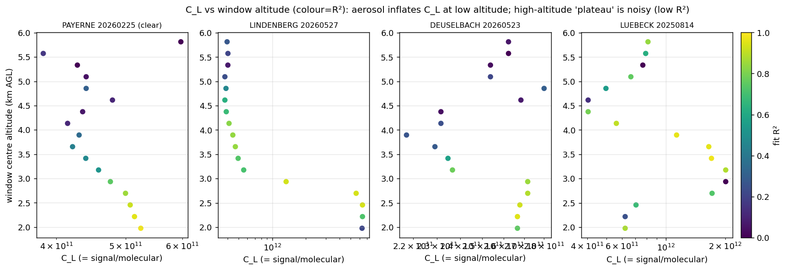

# ALC calibration & dashboard modifications — June 2026

**Branch:** `wv-correction`  ·  **Date:** 2026‑06‑26  ·  **Scope:** E‑PROFILE network, L1 2025‑2026.

This report documents the modifications made to the Rayleigh + cloud calibration and the monitoring
dashboard, the evidence behind each, how they were validated per instrument type, and the
network‑wide re‑deployment.

---

## Summary of changes

| # | Change | Type | Effect |
|---|--------|------|--------|
| 1 | **E‑PROF v2** is the default molecular‑window method everywhere | compute | Rayleigh windows now picked by the v2 (optimal) selector on every instrument |
| 2 | **New flag −10 "Closest CAMS data too far"** | compute | 910 nm stations outside the CAMS domain (e.g. New Zealand) now fail honestly instead of a false success |
| 3 | **Cloud station‑coordinate read fix** | compute (bug) | cloud no longer feeds fill‑value coords to the CAMS lookup |
| 4 | **Rayleigh diagnostic pcolor → datetime x‑axis** | plot | time–height curtains show wall‑clock hours + date, not "hours since start" |
| 5 | **Dashboard fixes** (success‑rate, calendars, ICAO, %op, OmB/timeseries labels) | dashboard | correct/clear monitoring UI |
| 6 | **Purity‑objective window selection (`eprof_v2p`)** | R&D (not deployed) | candidate fix for v2 picking aerosol‑tainted windows; under evaluation |

---

## 1. E‑PROF v2 as the default molecular method

`options.json` still shipped `molecular_method = eprof_v1.2`; the operational intent is **v2** (the
"optimal" selector: composite score + time‑resolved aerosol flagging, C8 defaults). v2 is now the
default in **all** production paths: `options.json`, `calibration/config.py` (dataclass default +
`from_json` fallback), `rayleigh_fit.find_optimal_molecular_window`, and the
`calibration.py` getattr fallback (regression‑guarded by `tests/test_default_method.py`). Method‑
comparison scripts that intentionally pin a version are unchanged.

**Known caveat (documented, not a regression):** v2's C8 tuning lowered the molecular‑window floor
`min_window_start_m` 2000→1500 m. On some clear nights with residual boundary‑layer aerosol up to
~2 km, v2 picks a window ~250 m lower than v1.2 — into the aerosol — which inflates the fit slope and
trips the slope‑vs‑Klett "method disagreement" gate (e.g. CHM15k Payerne 2026‑02‑25: v1.2 flag 1 /
C_L 4.72e11 → v2 flag −3 at 16.2 %). The cause is the v2 selector's **R²‑dominated** score (R² weight
1.0 vs aerosol penalties ~0.2): R² measures fit *linearity*, not molecular *purity*, so a smooth
aerosol layer yields a tight (high‑R²) line with the wrong slope and is *rewarded*. This motivated
the R&D in §6. It is a rare event (see §7) and v2 is otherwise cleaner network‑wide.

*C_L (=signal/molecular ratio) vs window‑centre altitude, colour = fit R². Aerosol inflates C_L at
low altitude (where R² is highest), while the clean high‑altitude "plateau" is noisy (low R²). This
aerosol‑vs‑noise trade‑off is why a fixed plateau‑rejection gate is not viable (§6) and why window
*placement* matters.*

## 2. New flag −10 "Closest CAMS data too far"

**Bug.** CL31/CL51/CL61 (910 nm) need CAMS for the water‑vapor correction. The CAMS download is
**regional** (Europe/N‑Atlantic, lat 27–74° lon −27–45°). For an out‑of‑domain station,
`xarray.sel(method="nearest")` silently returned the **domain‑edge** cell — for Lauder, NZ that is
**~125° (≈14 000 km) away** — and both the cloud and Rayleigh calibrations used it, producing a
**false success** with a meaningless WV correction.

**Fix.** `water_vapor.cams_point_too_far(file, lat, lon)` flags a station whose nearest CAMS grid
point is farther than `max(1.0°, 1.5×grid_spacing)`. Rayleigh returns `flag=-10` directly (WV block +
CAMS‑molecular block); the cloud `compute_wv_transmission` raises a recognizable error that the runner
maps to −10 (distinct from −4 *missing* CAMS and −99 *other*). Registered in `flags.py` and
`monitoring/config.py`.

**Verified:** Lauder NZ nights now return **rayleigh −10 and cloud −10**; European stations are
unaffected (nearest cell 0.2–0.3° away). Test `tests/test_cams_too_far.py`.

> Note: this correctly flags **every** out‑of‑domain 910 nm station. To *calibrate* such global
> stations instead, the CAMS download domain would need widening (or per‑station CAMS).

## 3. Cloud station‑coordinate read fix

While verifying §2, the in‑domain CL31/CL51 sample calibrations began failing — exposing a
**pre‑existing** bug: the cloud reader preferred the per‑profile `latitude`/`longitude` variables over
the canonical scalar `station_latitude`/`station_longitude`. In L2 files the per‑profile arrays are
often `_FillValue` (~1e36), so the cloud was feeding **garbage coordinates** to the CAMS lookup (again
grabbing the domain‑edge cell) — silently, because the tests only check that profiles exist, not WV
quality. Fixed to take the first **valid** coordinate (reject fill / out‑of‑range, prefer the scalar
station coord). Restores the cloud sample tests and removes a latent WV bias.

## 4. Rayleigh diagnostic pcolor — datetime x‑axis

The Rayleigh time–height curtain (`plot_rayleigh_diagnostics_compact` and `…_failure`) used "Hours
since start". It now uses a real **datetime axis** (matplotlib date numbers + `ConciseDateFormatter`):
wall‑clock **hours + date** ("Time (UTC)"), with the date shown at day boundaries. All overlays
(hatched excluded profiles, cloud‑base scatter, high‑cloud mask) move with it. Falls back to hours if
no timestamps are passed. Verified on CHM15k + CL61, success and failure plots; test
`tests/test_plotting_time_axis.py`. Regenerated network‑wide in this run (PLOTS=1).

## 5. Dashboard improvements

- **Success rate redefined to the true daily yield.** Was `valid / suitable` (excluded no‑data and
  the "no liquid cloud / not clear" flag), which read **~96 %** for cloud. Now `valid / all days`, so
  no‑data, no‑cloud and every rejection count against it: **cloud 95.8 → 53.1 %**, **rayleigh 48.3 →
  12.8 %** (matches the cloud‑yield study). Identical formula for both methods.
- **Station calendars**: a 3‑month window with prev/next arrows + a month dropdown, stacked
  **vertically**.
- **ICAO detection‑altitude map**: median (not mean); colorbar shortened to "alt [m]".
- **% of operational constant map**: fixed (it was simply built without `--opcoeff`; now passed).
- **OmB plots labelled "v2"** (not "our"); **Rayleigh C_L time series**: legend moved below the plot,
  lines renamed **"Applied in L2" / "v1.0" / "v2.0" / "v2.0 Kalman estimate"**.
- New flag **−10** added to the dashboard flag table/colours.
- Regression tests in `tests/test_dashboard.py` (16) guard all of the above.

## 6. R&D — purity‑first window selection (`eprof_v2p`), not deployed

To address the v2 caveat (§1), a flag‑gated variant `eprof_v2p` was added: among molecular‑**eligible**
windows it **minimises an aerosol cost** (curvature + scattering) instead of **maximising R²**, so a
tight but aerosol‑tainted low window can't win on R² alone.

- **Pilot (anchor cases):** flips Payerne 2026‑02‑25 −3→pass with the clean window (C_L 4.97e11 ≈
  v1.2), no regression on genuine aerosol nights.
- **Plateau‑rejection gate: ruled out** by the C_L‑vs‑altitude diagnostic (figure above) — the
  high‑altitude reference is too noisy and a ~15–20 % descent is *normal*, so such a gate would reject
  good calibrations.
- **Wider scan (216 nights, 12 continental CHM15k):** v2p **never changed a pass/reject outcome**
  (0 recoveries, 0 regressions, same 44 passes), but picked **systematically cleaner windows**
  (median curvature 4.2 → 1.5 %, scattering 1.077 → 1.031). So v2p is *safe* and *cleaner* — its value
  is **precision, not yield**.
- **Stage‑1 sweep (DECIDED — v2p NOT adopted).** A v2‑vs‑v2p sweep measuring **yield + σ_SD
  (night‑to‑night precision)** per type (`validation/_stage1_sweep.py`, parallel) gave:

  | type | streams | yield v2→v2p | σ_SD v2→v2p |
  |---|---|---|---|
  | CHM15k | 12 | 78→78 % | 13.8→13.9 (tied) |
  | Mini‑MPL | 5 | 85→85 % | 9.3→9.4 (tied) |
  | CL61 | 8 | 69→69 % | 7.6→9.2 (worse; but driven by low‑N noisy streams — inconclusive) |
  | CL51 | 0 | — | (no Rayleigh data — cloud‑method instrument) |

  **The "cleaner windows" did NOT translate into better precision** — σ_SD is tied on CHM15k/Mini‑MPL
  and shows no gain (possibly a loss) on CL61. The purity objective chases the cleanest *spot*, which
  moves altitude night‑to‑night and so doesn't improve *stability*; v2's R²‑max picks a consistent
  high‑SNR window and is fine. v2p only fixed the **rare** (~2/128) Payerne‑type false‑reject, at no
  measurable precision benefit. **Decision: keep v2; `eprof_v2p` stays registered but not deployed.**
  Probe scripts: `validation/_pilot_purity.py`, `_scan_wider.py`, `_probe_plateau.py`, `_stage1_sweep.py`.

## 7. Validation by instrument type

| type | wavelength | method | result |
|------|-----------|--------|--------|
| **CHM15k** | 1064 nm | Rayleigh v2 | works (44 passes in the 216‑night scan); the rare Payerne‑type −3 is the §1 caveat |
| **CL61** | 910 nm | Rayleigh + cloud | in‑domain OK; **out‑of‑domain (Lauder) → −10** ✓ |
| **CL31 / CL51** | 910 nm | cloud | in‑domain cloud OK after the §3 coord fix; CAMS guard does not false‑trigger ✓ |
| **Mini‑MPL** | 532 nm | Rayleigh v2 | 4/4 real clear nights flag 1, sensible C_L (no CAMS needed) ✓ |

## 8. Deployment (network re‑run)

Launched on CSCS (balfrin), 2025‑01‑01 → 2026‑05‑31, all 425 streams:
- **Calibration** array (`--force`, `PLOTS=1`) — v2 windows, the −10 guard, and regenerated
  datetime‑axis diagnostics.
- **Sensitivity** array (`--no-cal --sens`) — median ICAO altitude.
- **Dashboard** rebuild (`--opcoeff`) — auto‑runs after both, with all the §5 fixes + flag −10.

**Pending:** the OmB recompute (the "v2" plot label) is deferred — it needs the 0.4° CAMS with
aerosol backscatter (`CAMS_Monthly_04`), whose download is not yet complete. The OmB *map* (which
reads `omb.csv`) is unaffected; only the per‑station OmB plot label changes when OmB is re‑run.

## Files changed

`calibration/`: `flags.py`, `config.py`, `rayleigh/calibration.py`, `rayleigh/rayleigh_fit.py`,
`rayleigh/molecular_methods.py`, `cloud/calibration.py`, `water_vapor_correction/water_vapor.py`,
`plotting.py` · `monitoring/`: `index.py`, `render.py`, `metrics.py`, `charts.py`, `config.py`,
`static/diag.js`, `static/style.css` · `scripts/run_all_l1_2026.py` · `options.json` ·
`scripts/run_lindenberg_cl61_cal.py`.

**Tests added:** `test_cams_too_far.py`, `test_default_method.py`, `test_plotting_time_axis.py`,
and extensions to `test_dashboard.py` (16) — all passing locally; sample suite green except the two
*known* cases (v2 Payerne marginal; a not‑clear Mini‑MPL fixture day).
