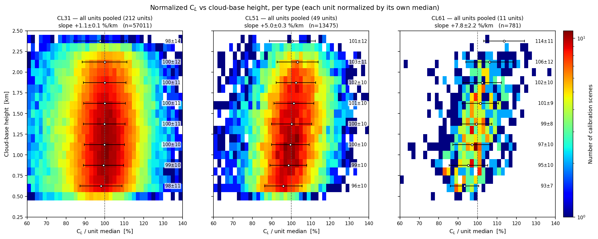
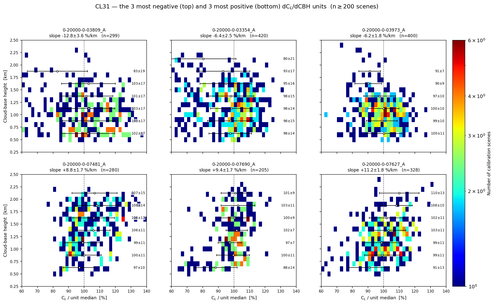
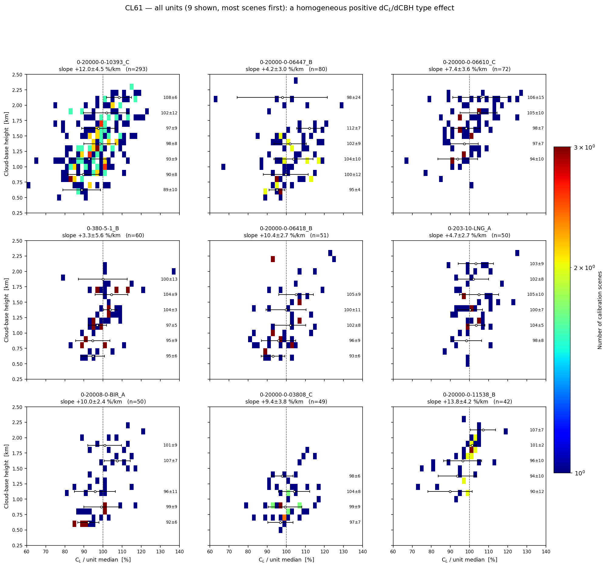
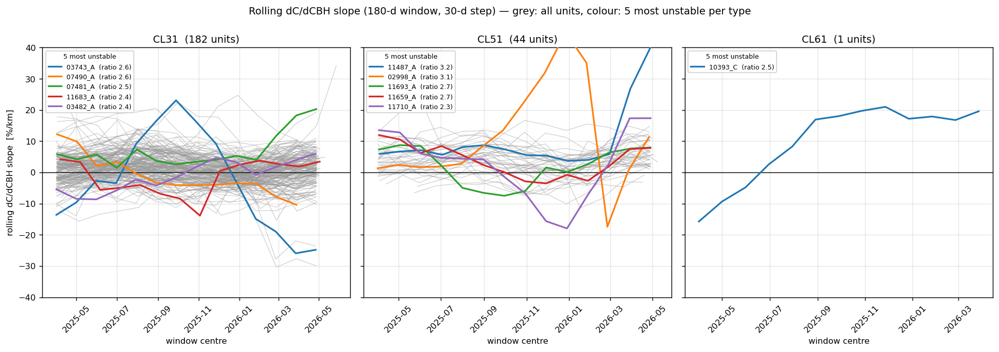
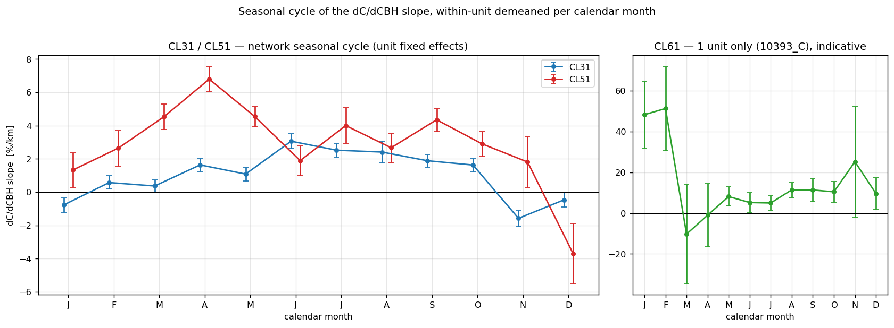
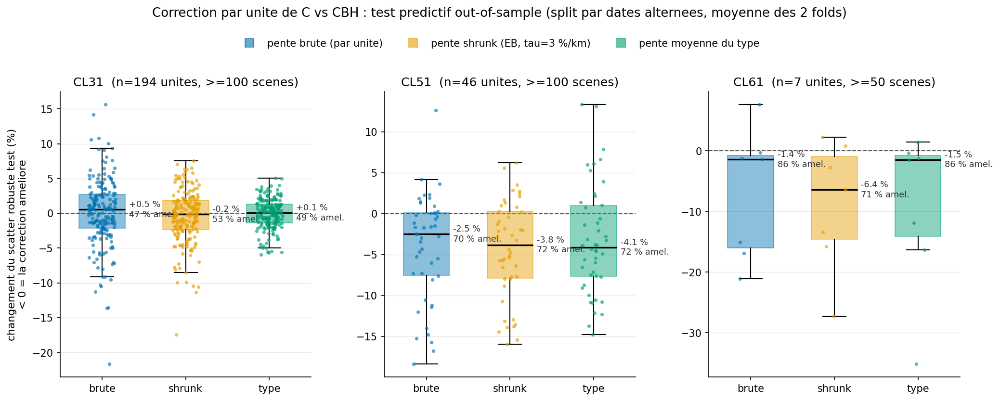

# Heatmaps Hopkin C_L(CBH) : confiance, stabilité temporelle et test de correction

*Campagne 2026-08-16 — prolonge `cbh_slope_heterogeneity.md` (les pentes dC/dCBH par unité sont
réelles : CL31 hétérogène autour d'une moyenne plate, CL51 décalé ET hétérogène, CL61 homogène à
+8,3 %/km). Le cadre visuel de référence est **Hopkin et al. 2019 (AMT 12, 4131), figures 6 et
11** : histogrammes 2-D du rétrodiffusé atténué intégré contre la hauteur, moyenne ± SD par bande
d'altitude — leur système corrigé (η par porte + WV NWP) y est plat à ~1 % près sur 200 m–2,4 km.
Corpus : `rayleigh_availability/cbh_native/cbh_scenes.csv` (~71 300 scènes de calibration nuage,
2025-01 → 2026-08, mêmes filtres que le rapport précédent ; flux Payerne scindés aux ruptures
instrumentales connues 06610_B 2026-07-07 et 06610_C 2026-06-11). Question de l'opérateur à trancher :
« je ne peux pas faire confiance à cette calibration si elle est fortement impactée par l'altitude
des nuages ».*

**Réponses en une ligne** (détail aux §1–§4) :

| Question | Verdict |
|---|---|
| Puis-je faire confiance vis-à-vis de l'altitude des nuages ? | **Oui pour la moyenne long-terme, avec 1 exception sur 266 unités** : l'impact \|pente\| × IQR(CBH) dépasse 10 % pour une seule unité (un CL51), et 92 % des unités restent sous 5 %. La **scène individuelle** à CBH atypique, elle, n'est pas protégée (jusqu'à ±8–13 % sur les unités extrêmes). |
| La pente est-elle une propriété stable de l'unité ? | **Oui au premier ordre** : ratio de stabilité ~1,2–1,3 pour le gros du parc, modulé par un **cycle saisonnier commun** de ±2–5 %/km ; 30/227 unités (11–20 % selon type) dérivent réellement. |
| Faut-il corriger C(CBH) ? | **Non.** Hors-échantillon : aucun gain CL31 (47–53 % d'unités améliorées ≈ pile ou face), gain modeste −4 % de scatter pour une pente de **type** fixe CL51, gains CL61 réels mais le mécanisme est instrumental (baseline additive) → traiter à la source, pas en aval. |

---

## 1. Les heatmaps Hopkin

### 1.1 Construction et galerie complète

Pour chaque flux à ≥ 100 scènes, un histogramme 2-D à la Hopkin fig. 6/11 : **X** = C_L normalisé
par la médiane de l'unité (%), **Y** = CBH (km, 0,25–2,5, bins de 100 m — l'altitude en Y,
toujours), couleur = nombre de scènes (échelle log), moyenne ± SD annotée par bande de 250 m sur
le bord droit, pente OLS dans le titre. Contrôle d'unités : la pente re-dérivée sur un flux témoin
(+3,62 %/km) reproduit la table `per_flux_slopes.csv` (+3,67) — mêmes unités, même signe.

**La galerie complète des 241 unités** (une PNG par flux, plus 45 figures de stabilité du §2) est
hors dépôt : `C:/DATA/Projects/202606_E-PROFILE_calibration/cbh_hopkin_gallery/<key>_hopkin.png`.
Le rapport n'embarque que la synthèse par type et les cas extrêmes.

### 1.2 Vue par type : le CL31 passe le test de platitude de Hopkin, CL51 et CL61 penchent

| type | unités | scènes | pente agrégée | moyennes de bande (0,5–2,25 km) |
|---|---|---|---|---|
| CL31 | 212 | 57 011 | **+1,1 ± 0,1 %/km** | 98–100 % — l'équivalent direct de la platitude Hopkin fig. 6 (B = 0,021 sr⁻¹ constant, écart max 0,002 ≈ 1 %) |
| CL51 | 49 | 13 475 | **+5,0 ± 0,3 %/km** | 96 → 103 % |
| CL61 | 11 | 781 | **+7,8 ± 2,2 %/km** | 93 → 106–114 % — le cœur de la distribution penche à l'œil nu |

Le réseau CL31, une fois chaque unité ramenée à sa médiane, reproduit la référence publiée d'un
système bien corrigé. Le CL61 montre l'effet de type +8–9 %/km du rapport précédent comme un
noyau incliné, visible sans statistique.

### 1.3 Les extrêmes CL31 : réels, mais bornés

Les 3 pentes les plus négatives (0-20000-0-03809_A −12,8 ± 3,6 ; 03354_A −6,4 ± 2,5 ; 03973_A
−6,2 ± 1,8 %/km) contre les 3 plus positives (07481_A +8,8 ± 1,7 ; 07690_A +9,4 ± 1,7 ; 07627_A
+11,2 ± 1,8). Même sur ces unités, les moyennes de bande restent dans ~±8 % de la médiane de
l'unité sur 0,5–2 km : l'hétérogénéité est réelle (rapport précédent) mais son expression sur la
gamme de CBH réellement vue reste bornée.

### 1.4 Tous les CL61 : l'effet de type, unité par unité

9/9 pentes positives, de +3,3 à +13,8 %/km (la mieux échantillonnée, 10393_C Lindenberg, n = 293 :
+12,0 ± 4,5). Aucune unité ne fait exception — cohérent avec une origine de type
(baseline additive dépendant de la portée, `cl61_cloud_vs_rayleigh_origin.md`), pas des défauts
par unité.

### 1.5 La métrique de confiance : impact = |pente| × IQR(CBH de l'unité)

La pente seule ne répond pas à la question de l'opérateur : ce qui compte est le déplacement de C_L
**sur la gamme de CBH que l'unité voit réellement**. Métrique : impact (%) = \|pente\| ×
IQR(CBH_med des scènes de l'unité). Unités à ≥ 30 scènes :

| type | unités | impact médian | p90 | > 5 % | > 10 % |
|---|---|---|---|---|---|
| CL31 | 209 | **1,6 %** | 4,3 % | 10 (4,8 %) | **0** |
| CL51 | 48 | **3,0 %** | 6,5 % | 9 (18,8 %) | **1** (0-20000-0-11487_A : 17,4 %/km × 0,72 km = 12,5 %) |
| CL61 | 9 | **4,5 %** | 7,9 % | 4 (44,4 %) | **0** (pire : 0-20008-0-BIR_A, 8,5 %) |
| **total** | **266** | | | **23 (8,6 %)** | **1 (0,4 %)** |

Restreint aux unités ≥ 100 scènes le tableau ne bouge pas (CL31 4,6 % > 5 %, 0 > 10 % ; CL51
19,6 % / 2,2 %). Pires CL31 : 08314_A 9,4 %, 08433_A 8,0 %, 03809_A 7,0 %. Le CL61, malgré la
plus forte pente de type, reste **partout sous 10 %** parce que ses IQR de CBH ne font que
~0,6–0,9 km.

### 1.6 Verdict de confiance (par type, avec la doctrine)

**Doctrine.** La moyenne long-terme (le C_L du Kalman) intègre la pente sur la **climatologie de
CBH de l'unité** : tant que cette climatologie est stationnaire, la pente gonfle le scatter
scène-à-scène mais ne biaise pas la moyenne. Vérifié sur les données : le battement saisonnier de
la moyenne mensuelle induit par le cycle annuel de la climatologie CBH (\|pente\| × [p90−p10 des
CBH médianes mensuelles]) est médian **1,2 % (CL31) / 2,8 % (CL51) / 2,5 % (CL61)** ; 18/249
unités > 5 %, une seule > 10 % (encore 11487_A, 13 %). La **scène individuelle**, elle, n'est pas
protégée : le biais est ≈ pente × (CBH − CBH médiane de l'unité), soit jusqu'à ±8–13 % pour une
scène à CBH atypique sur les unités extrêmes.

- **CL31 : oui.** Type plat (§1.2), 95 % des unités sous 5 % d'impact, aucune au-dessus de 10 %.
- **CL51 : oui avec surveillance.** Un cinquième du parc dépasse 5 % ; 11487_A (12,5 %) est la
  seule unité du réseau au-dessus de 10 % — à inspecter (c'est aussi la pire unité du §2).
- **CL61 : oui pour la moyenne, prudence par scène.** L'effet de type +8 %/km est réel mais les
  IQR de CBH étroits le bornent à < 10 % partout ; une scène à CBH inhabituelle porte en revanche
  un biais prédictible de signe connu — d'où la couverture par la comparaison croisée Rayleigh
  (rapport 07) en attendant la correction à la source.

---

## 2. Stabilité temporelle des pentes

**Méthode.** OLS glissant de ln C contre CBH par unité : fenêtre 180 j, pas 30 j, ≥ 30 scènes et
p90−p10(CBH) ≥ 400 m par fenêtre. 227 unités à ≥ 150 scènes → 3 111 fenêtres (13–15 par unité).
Ratio de stabilité = SD(pentes glissantes) / moyenne(SE des fenêtres) : ≈ 1 si la pente est une
constante d'unité, > 2 si elle dérive au-delà du bruit d'estimation. Les fenêtres se recouvrant
6×, le ratio est plutôt conservateur (le recouvrement amortit la dispersion inter-fenêtres).

### 2.1 Propriété d'unité stable au premier ordre

| type | unités | ratio médian | IQR | p90 | ratio > 2 |
|---|---|---|---|---|---|
| CL31 | 182 | 1,21 | [0,95 ; 1,59] | 2,03 | 20 (11 %) |
| CL51 | 44 | 1,29 | [1,03 ; 1,87] | 2,31 | 9 (20 %) |
| CL61 | 1 | 2,54 | — | — | 1/1 (10393_C) |

Le gros du parc vit à ratio ~1,2–1,3 : une pente stable plus une modulation commune modeste
(§2.3). Les 30 unités à ratio > 2 (20 CL31, 9 CL51, 1 CL61 ; pires : CL51 11487_A 3,20, CL51
02998_A 3,11, CL51 11693_A 2,69…) dérivent réellement — figures par unité
(`t_stability_<key>.png`, pente glissante + médiane mensuelle de C) dans la galerie pour les 45
unités signalées ; table complète `stability_units.csv` (scratchpad). Le seul CL61 suivable,
10393_C, est un vrai dériveur : sa pente glissante monte de −15 à +20 %/km entre 2025-03 et
2026-04 — sur la flotte CL61 c'est l'unité qu'il faudra re-regarder après toute correction.

### 2.2 Les « change-points » sont surtout le cycle saisonnier — sauf un noyau d'événements réels

43/227 unités présentent un saut formel de pente entre segments (> 2× la SE combinée), mais les
dates de rupture **s'agglutinent aux transitions de saison** — 12 en février 2026, 9 en juillet
2025, 5 en octobre 2025 — au lieu de se disperser comme le feraient des événements instrumentaux
indépendants : le détecteur lit pour l'essentiel le cycle commun du §2.3. Un sous-ensemble
d'événements instrumentaux authentiques existe néanmoins : les sauts de pente corrèlent avec des
marches simultanées du **niveau** de C (r = +0,52 ; 25/42 ruptures portent une marche > 5 %). Cas
extrêmes : trois CL31 allemands (03743_A, 03809_A, 03853_A) cassent tous le **2026-02-25** avec
des marches de C de −32 à −35 % et des sauts de pente apparents de ~−25 %/km — un vrai événement
de niveau dont les fenêtres à cheval contaminent l'estimation de pente ; leur « dérive de pente »
est largement une fuite de la marche de niveau.

### 2.3 Le cycle saisonnier commun

Pente réseau par mois calendaire (effets fixes d'unité) : CL31 de **−1,6 %/km (novembre) à
+3,1 (juin)**, CL51 de **−3,7 (décembre) à +6,8 (avril)** — les deux types en phase, positifs au
printemps/été, négatifs en novembre–janvier. Une modulation commune de ±2–5 %/km crête-à-crête,
cohérente avec le levier « régime d'extinction / taille de gouttelettes des scènes » du rapport
précédent (§2.3bis : α et a_G saisonniers peuvent porter ±3–5 %/km) — et suffisante pour
expliquer à la fois les ratios de stabilité légèrement > 1 et l'agglutination saisonnière des
change-points. Conséquence pratique : **une pente estimée sur < 1 an est biaisée par la saison
d'échantillonnage** ; les pentes de la galerie (≥ 100 scènes, généralement > 1 an) moyennent le
cycle.

---

## 3. Le test de correction hors-échantillon

**Protocole** (`correction_test.py`). Par unité : scènes partagées en deux moitiés par **dates
alternées** (préserve la structure temporelle), pente estimée sur la moitié train, correction
appliquée sur la moitié test : C_corr = C · exp(−pente · (CBH − 1 250 m)). Métrique = variation
du scatter robuste (1,4826·MAD/médiane) de la moitié test ; les 2 folds sont moyennés. Trois
variantes de pente : **brute** (OLS de l'unité), **shrunk** (empirical-Bayes vers la moyenne du
type, τ = 3 %/km du rapport précédent), **type** (pente moyenne du type seule : CL31 +0,9, CL51
+4,5, CL61 +8,3 %/km). Unités ≥ 100 scènes : 194 CL31, 46 CL51, 1 CL61 ; supplément CL61 à
≥ 50 scènes : 7 unités.

| type | scatter non corrigé | brute | shrunk | type |
|---|---|---|---|---|
| CL31 (194 u) | ~9,0 % | **+0,5 %** (47 % amél.) | −0,2 % (53 %) | +0,1 % (49 %) |
| CL51 (46 u) | ~9,0 % | −2,5 % (70 %) | −3,8 % (72 %) | **−4,1 % (72 %)** |
| CL61 (7 u, ≥ 50 scènes) | ~10 % | −1,4 % (6/7) — instable entre folds (+0,7/−13,8) | **−6,4 % (5/7)** (folds −5,0/−15,2) | −1,5 % (6/7) (folds −7,2/−15,5) |

- **CL31 : la correction ne transfère pas.** Même la pente brute de l'unité — pourtant une
  propriété réelle et reproductible (rapport précédent, r split-half 0,56) — donne +0,5 % de
  scatter en test : le gain potentiel (impact médian 1,6 %, §1.5) est mangé par le bruit
  d'estimation de la pente. 47–53 % d'unités améliorées = pile ou face. Corriger le CL31 est
  démontré **neutre à nuisible**.
- **CL51 : un gain réel mais modeste, et c'est la pente de TYPE qui le porte.** −4,1 % de scatter
  relatif (9,0 → ~8,6 %), 72 % des unités améliorées, stable fold par fold (−4,7/−3,8). La
  variante « type » fait aussi bien que tout ajustement par unité : ce qui se corrige est le
  décalage commun +4,5 %/km, pas l'hétérogénéité.
- **CL61 : gains importants (10393_C : −16 à −21 %) mais la flotte testable est minuscule** (7
  unités, folds discordants pour la pente brute) et surtout le mécanisme est connu et
  instrumental : corriger C(CBH) en aval masquerait la baseline additive qu'il faut soustraire du
  signal (verdict CL61-dark, rapport précédent + `cl61_cloud_vs_rayleigh_origin.md`).
- **Coût de cohérence réseau négligeable** : la correction vers la référence 1 250 m déplace la
  médiane de C de chaque unité de < 2 % partout (P90 des \|décalages\| : 0,3 % CL31-type, 1,1 %
  CL51-type, 1,4–1,9 % CL61).

**Verdict : ne pas corriger.** CL31 : jamais (prouvé inutile). CL61 : pas en aval — la voie est
la soustraction de la baseline à la source, puis re-mesure des pentes (critère de succès du
rapport précédent : résidu < 3 %/km). CL51 : la seule correction défendable serait la pente de
type fixe +5 %/km référencée à 1 250 m (gain −4 %, coût < 2 %) ; on recommande de **ne pas
l'activer** aujourd'hui — gain marginal, rupture avec la pratique publiée (personne ne corrige
post-hoc en CBH, Hopkin compris), et si le décalage CL51 partage le mécanisme additif du CL61
(même électronique Vaisala, hypothèse non testée), le fix à la source le résorbera aussi — à
re-poser après la campagne dark CL61.

---

## 4. Recommandation opérationnelle

1. **Ne rien corriger en aval** (§3) ; maintenir la priorité au traitement CL61 **à la source**
   (caractérisation/soustraction de la baseline additive dépendant de la portée avant l'intégrale
   nuage), puis regénérer les heatmaps Hopkin et re-mesurer les pentes — la question CL51 est à
   re-poser à ce moment-là.
2. **Publier trois diagnostics QC par flux sur le dashboard** (jamais en correction) : la pente
   dC/dCBH, l'**impact** \|pente\| × IQR(CBH) — seuils : > 5 % surveillance (23 unités
   aujourd'hui), > 10 % investigation (1 unité) —, et le **ratio de stabilité** (> 2 = dérive, 30
   unités). La détection conjointe saut-de-pente + marche-de-niveau attrape les vrais événements
   instrumentaux (les 3 CL31 allemands du 2026-02-25) ; interpréter tout saut de pente isolé à la
   lumière du cycle saisonnier commun (§2.3).
3. **Inspecter 0-20000-0-11487_A (CL51)** : seule unité du réseau > 10 % d'impact (12,5 %), pire
   ratio de stabilité (3,20), pire battement saisonnier (13 %) — trois drapeaux indépendants sur
   la même unité.
4. **Réponse à l'opérateur** : la calibration nuage est digne de confiance vis-à-vis de
   l'altitude des nuages **au sens qui compte opérationnellement** — la moyenne long-terme est
   protégée par la stabilité de la climatologie CBH (battement saisonnier médian 1–3 %, une seule
   unité sur 266 au-dessus de 10 %). Ce qui n'est pas protégé, et que le diagnostic du point 2
   rend visible au lieu de le corriger en aveugle, c'est la scène individuelle à CBH atypique sur
   une unité à forte pente (±8–13 % au pire).

---

## Annexe — fichiers

- Galerie complète (241 heatmaps + 45 figures de stabilité, hors dépôt) :
  `C:/DATA/Projects/202606_E-PROFILE_calibration/cbh_hopkin_gallery/`.
- Intermédiaires (scratchpad de session, `cbh_hopkin/`) : `unit_trust_metric_all30.csv`,
  `trust_summary*.json`, `rolling_slopes.csv`, `stability_units.csv`, `seasonal_slopes.csv`,
  `correction_test*.csv`, scripts `make_hopkin_heatmaps.py`, `task_t_stability.py`,
  `correction_test.py`.
- Données sources : `rayleigh_availability/cbh_native/cbh_scenes.csv`,
  `cbh_native/per_flux_slopes.csv`. Figures du rapport : `doc/reports/figs_cbh_heterogeneity/`.
