# Hétérogénéité inter-unités de la pente dC/dCBH (calibration nuage O'Connor)

*Campagne 2026-08-16 — prolonge la validation réseau phase 4 (`phase4_network_validation.md`) et
l'étude d'origine CL61 (`cl61_cloud_vs_rayleigh_origin.md`). Corpus : run réseau `calout_v22_04`
(433 flux, tables η PVC natives a_G = 5,5 µm, CAMS 0,4°) ; pentes par flux dC/dCBH issues des
scènes de calibration nuage (flag 1,0/0,5) : 209 flux CL31 (57 011 scènes), 48 CL51 (13 475),
9 CL61 (781 scènes sur les 11–12 flux de la référence FE). Toutes les affirmations chiffrées ont
subi une re-dérivation adversariale indépendante ; les corrections issues de cette vérification
sont étiquetées comme telles. **Aucune affirmation n'a été réfutée** (liste de réfutation vide) —
deux chiffres ont été *corrigés à la baisse* sans changer les conclusions (voir §1.4).*

**Questions posées (opérateur).**
1. Quel facteur explique les différences de dC/dCBH entre instruments d'un même type ?
2. La platitude réseau des CL31 (médiane +1,0 %/km) est-elle une compensation entre unités
   (τ > 0, moyenne ≈ 0) ou une vraie platitude par unité ?
3. La qualité de calibration est-elle meilleure pour les unités à dC/dCBH ≈ 0 ?
4. Que documente la littérature, faut-il corriger cela dans E-PROFILE, faut-il affiner la
   paramétrisation nuage ?

**Réponses en une ligne** (détail et verdicts aux §2–§5) :

| Q | Verdict |
|---|---|
| 1 | **Aucun facteur mesurable identifié.** Les candidats optiques (FOV, divergence) sont intestables depuis L1 ; les signaux firmware/altitude/bloc-WMO du CL31 sont confondus entre eux et avec le pays ; des erreurs η réalistes plafonnent à 1–3 %/km, un ordre de grandeur sous l'étalement observé. |
| 2 | **Compensation.** [vérifié] τ = 2,5–3,2 %/km, 41 % des unités hors bruit d'échantillonnage, reproductibilité split-half r = 0,56 : la moyenne réseau +0,9 %/km est la somme d'unités réellement positives et réellement négatives. |
| 3 | **Non.** Le lien brut \|pente\|↔dispersion du CL31 (ρ = +0,22) est un artefact mécanique ; sur l'axe équitable (t-value) il n'y a **aucun** lien, et rien sur CL51/CL61. |
| 4 | **Ne pas corriger dC/dCBH au niveau réseau ; ne pas retoucher η.** ⚠ La piste « CL61 = baseline additive » est RÉFUTÉE pour la pente nuage par la fermeture quantitative (−0,01 %/km induit vs +9 observé — voir la correction au §5.4) ; le mécanisme reste ouvert, piste principale : spectrale (λ₀ WV). |

---

## 1. Méta-analyse par type : moyennes communes et hétérogénéité vraie

**Méthode.** Pente OLS de ln C contre la CBH médiane de scène, par flux (n ≥ 34 scènes partout —
le filtre de sensibilité n ≥ 30 est sans objet [vérifié]) ; puis méta-analyse à effets aléatoires
DerSimonian–Laird (DL) par type, recoupée par Paule–Mandel (PM), REML, Theil–Sen re-dérivé depuis
les scènes brutes, et une voie **sans SE** (covariance split-half scènes paires/impaires).

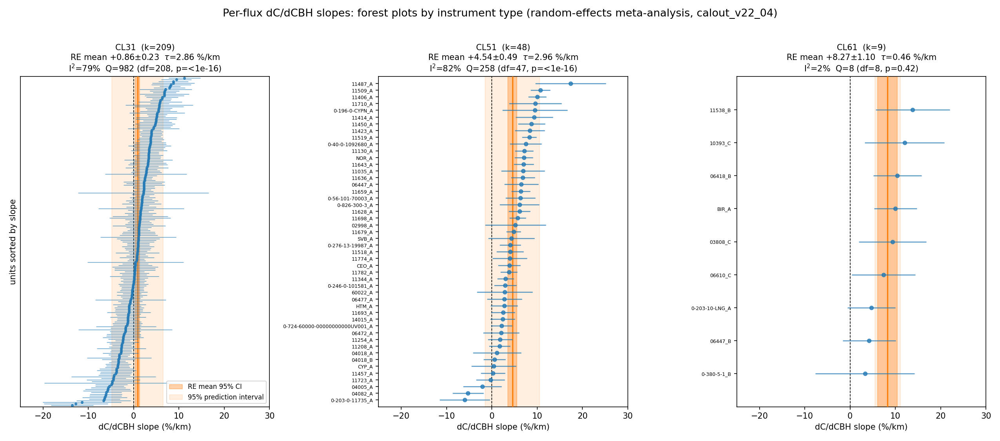

| type | k | moyenne RE (DL) | τ (DL / PM / REML) | I² | Q (p) | intervalle de prédiction 95 % |
|---|---|---|---|---|---|---|
| CL31 | 209 | **+0,86 ± 0,23 %/km** | 2,86 / 3,15 / 3,07 | 79 % | 982 (9,4e-101) | [−4,8 ; +6,5] |
| CL51 | 48 | **+4,54 ± 0,49 %/km** | 2,96 / 3,40 / 3,21 | 82 % | 258 (6,6e-31) | [−1,5 ; +10,6] |
| CL61 | 9 | **+8,27 ± 1,10 %/km** | 0,46 / 0,44 / 0,87 | 2 % | 8,2 (0,42) | [+5,5 ; +11,1] |

L'ordre des types **CL31 +0,9 < CL51 +4,5 < CL61 +8,3 %/km** est robuste à tous les estimateurs
[vérifié], et les deux types hétérogènes partagent un étalement inter-unités quasi identique
(τ ≈ 3,0–3,2 %/km en citant les estimateurs les plus prudents) [vérifié]. Le test global
Kruskal–Wallis inter-types donne H = 50,5, p = 1,1e-11 : l'effet *type* est massif.

### 1.1 CL31 : hétérogénéité réelle, bien au-delà du bruit d'échantillonnage [vérifié]

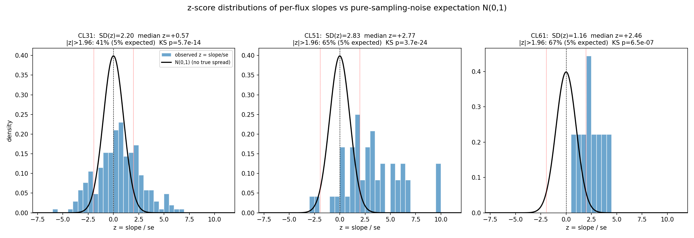

Si toutes les unités CL31 partageaient la même pente vraie, z = pente/SE serait N(0,1). Observé :
SD(z) = 2,20, 40,7 % des unités à \|z\| > 1,96 (attendu 5 %), KS p = 5,7e-14. La voie sans SE le
confirme indépendamment : les pentes re-calculées sur les scènes paires et impaires d'une même
unité corrèlent à r = 0,56 (p = 5,1e-19 ; un pur bruit donnerait r = 0), et la covariance
split-half donne τ = 3,06 %/km [IC 95 % 2,57–3,69] [vérifié].

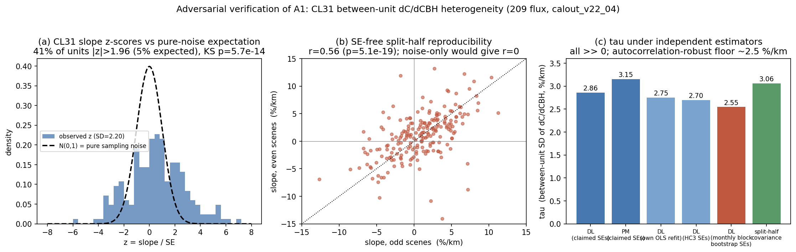

### 1.2 CL51 : décalé ET hétérogène [vérifié]

La moyenne commune est franchement positive (+4,54 ± 0,49, z = 9,2 ; test des signes 44/48
positifs, p = 1,5e-9) **et** l'hétérogénéité inter-unités est réelle (τ ≈ 3,0, I² = 82 %) :
29/48 unités significativement positives contre 2/48 négatives — une distribution *décalée*,
pas une compensation. La ré-inclusion du flux exclu 0-20008-0-EDT_A (k = 49) ne change rien
(+4,55 ± 0,49, τ = 2,95) [vérifié].

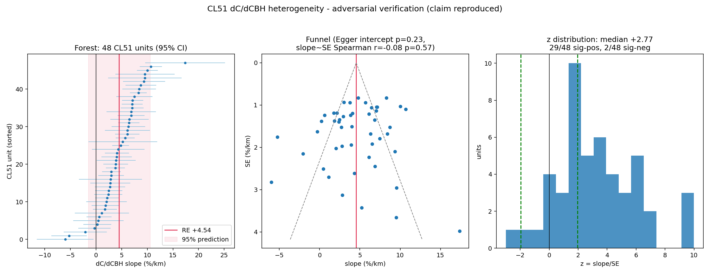

### 1.3 CL61 : homogène autour d'un +8,3 %/km commun — un effet de type [vérifié, avec garde-fou]

Q = 8,2 (p = 0,42), I² = 2 %, τ_DL = 0,46 %/km, 9/9 pentes positives (6/9 individuellement
significatives). La re-dérivation Theil–Sen indépendante sur les **11** flux CL61 à ≥ 8 scènes
donne FE = +9,94 ± 0,93 %/km, 11/11 positifs ; le FE robuste aux clusters sur les 781 scènes
donne +9,41 ± 1,40 %/km — tout confirme le résidu de type **+9,05 ± 1,46 %/km** de la phase 4
(référence `fe_results.json`, qui liste 12 flux, non 11 comme annoncé initialement — correction
d'inventaire sans effet).

**Garde-fou** [vérifié] : avec k = 9 et des SE par unité de ~3,6 %/km, l'IC 95 % du profil de Q
sur τ est **[0 ; 5,8] %/km**, et l'écart-type brut des 9 pentes (3,68) est indiscernable de celui
des CL31 (3,82) et CL51 (4,12). « Homogène » se lit donc « aucune hétérogénéité détectable »,
pas « prouvées identiques ».

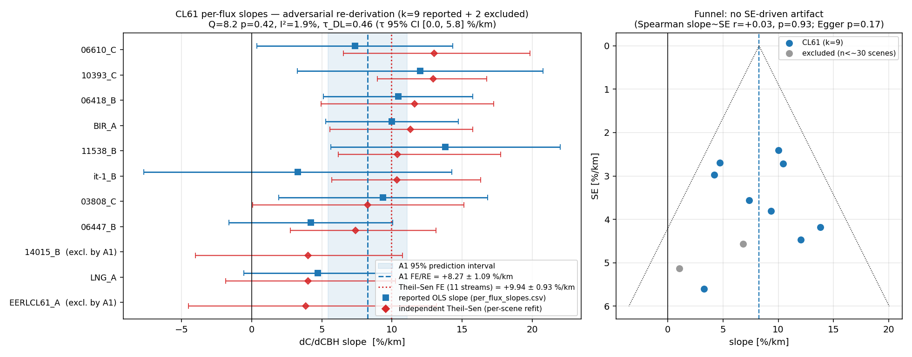

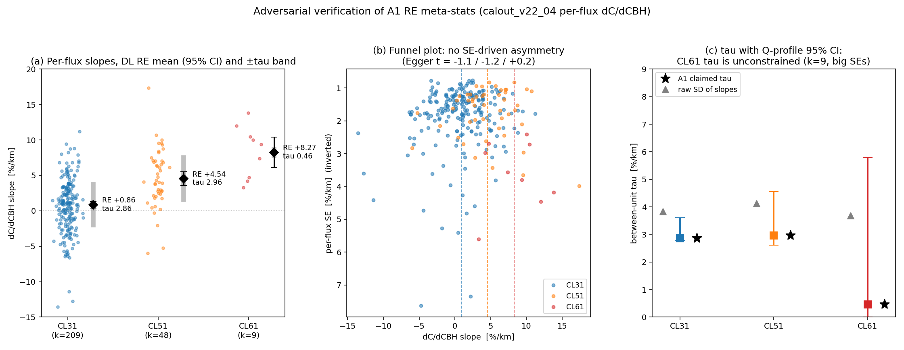

### 1.4 Corrections issues de la vérification (aucune réfutation)

- **SE par flux ~28 % trop petites** : les résidus des OLS par unité sont autocorrélés
  (lag-1 médian 0,45) ; un bootstrap par blocs mensuels gonfle les SE de ×1,30. Chiffres
  honnêtes CL31 : τ = 2,55 %/km, Q = 656, I² = 69 % — τ légèrement surestimé (2,86–3,15 →
  ~2,5–2,7), **conclusion inchangée** (la voie split-half, insensible aux SE, donne 3,06).
- **Comptages de significativité CL31 gonflés** : avec des SE clusterisées par mois,
  15,8 % d'unités significativement positives et 10,0 % négatives (au lieu des 26 %/14 %
  annoncés) — soit encore ~6×/4× le taux de chance de 2,5 % par côté.
- **Robustesse aux queues** [vérifié] : winsorisation p5/p95 → moyennes déplacées de < 0,06 %/km,
  τ 2,86→2,61 / 2,96→2,59 / 0,46→0,00 ; même un *écrêtage dur* (k 209→187, 48→42) laisse
  τ = 2,25 (CL31) et 2,10 (CL51), CL61 restant à 0.

---

## 2. Q1 — Quel facteur explique les différences intra-type ?

### 2.1 Ce que L1 permet (et ne permet pas) de tester

Les candidats optiques de premier ordre — **FOV du récepteur (`t0_fov`) et divergence du faisceau
(`l0_beam_div`) sont des valeurs de remplissage (−999,9) ou absents dans TOUS les fichiers L1
CL31/CL51/CL61** : la dispersion unité-à-unité de la géométrie optique est intestable depuis L1.
`l0_wavelength` est une constante par type (aucune dispersion). Les numéros de série CL31/CL51
sont tronqués à 3 caractères dans L1 → l'« ère matérielle » n'est testable que pour le CL61.

### 2.2 Facteurs testés

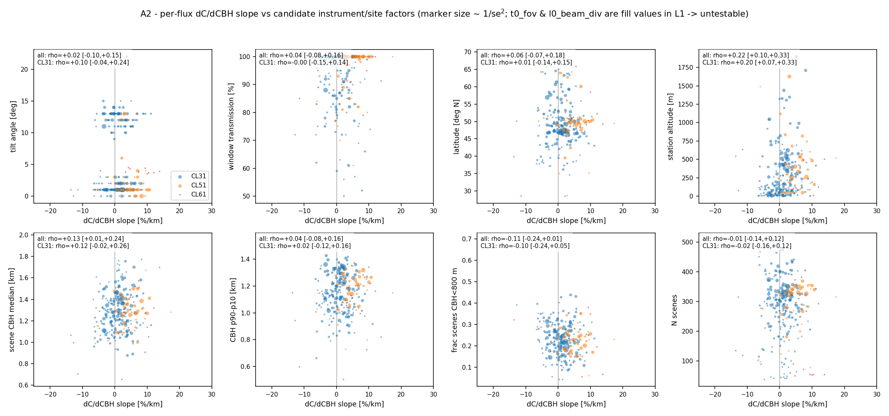

| facteur | CL31 (n=209) | CL51 (n=48) | CL61 (n=9) |
|---|---|---|---|
| angle d'inclinaison | ρ = +0,10 (p = 0,14) | ρ = −0,12 (p = 0,41) | ρ = −0,44 (p = 0,24) |
| transmission fenêtre | ρ = −0,00 (p = 0,95) | **ρ = +0,34 (p = 0,020)** | ρ = +0,09 (p = 0,83) |
| latitude | ρ = +0,01 (p = 0,89) | ρ = −0,04 (p = 0,80) | ρ = +0,55 (p = 0,13) |
| longitude | **ρ = +0,19 (p = 0,006)** | ρ = +0,18 (p = 0,23) | ρ = +0,20 (p = 0,61) |
| altitude station | **ρ = +0,20 (p = 0,004)** | ρ = +0,17 (p = 0,24) | ρ = −0,17 (p = 0,67) |
| CBH médiane des scènes | ρ = +0,12 (p = 0,076) | ρ = +0,29 (p = 0,050) | ρ = +0,18 (p = 0,64) |
| étalement CBH (p90−p10) | ρ = +0,02 (p = 0,81) | ρ = +0,19 (p = 0,19) | ρ = +0,13 (p = 0,73) |
| fraction scènes < 800 m | ρ = −0,10 (p = 0,17) | ρ = −0,15 (p = 0,30) | ρ = +0,07 (p = 0,87) |
| nombre de scènes | ρ = −0,02 (p = 0,80) | **ρ = +0,36 (p = 0,011)** | ρ = −0,12 (p = 0,76) |

Avec ~27 tests continus + les tests catégoriels, le seuil Bonferroni est ~0,002 : **aucune
corrélation ne le franchit**. Les p ~ 0,01–0,05 isolés (transmission fenêtre CL51 — de signe
contre-intuitif —, n_scenes CL51, longitude/altitude CL31) sont au niveau attendu du criblage
multiple et/ou confondus géographiquement (ci-dessous).

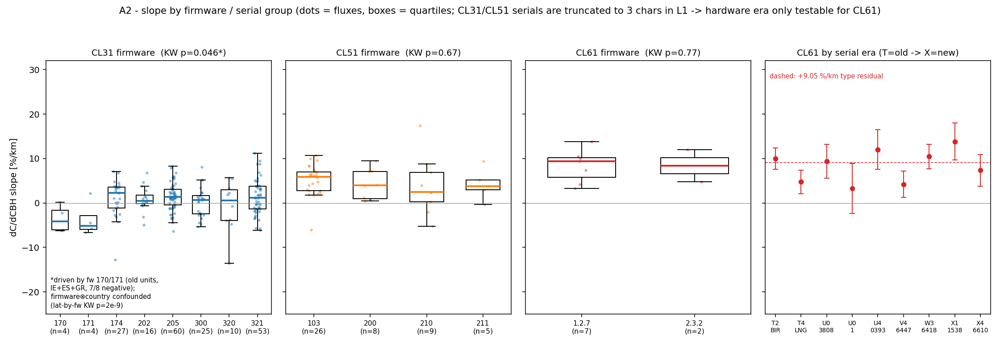

**Firmware CL31** : Kruskal–Wallis p = 0,046, tiré entièrement par les firmwares anciens 170/171
(8 unités : CORK, SHANNON, CASEMENT, KNOCK, MURCIA A+B, ATHENS_OBS, TENERIFE_N — 7/8 pentes
négatives, −2 à −6,6 %/km). Mais le firmware est **confondu avec le pays** (latitude-par-firmware
KW p = 1,8e-9 ; inclinaison-par-firmware p = 4,7e-15 : la France opère à 12–13°, la Scandinavie
à 12°, le reste à 1–3°) : impossible de séparer « vieux firmware » de « parc irlandais/espagnol/
grec ». **Altitude < 100 m** (CL31 : médiane +0,14 contre +1,31 %/km, p = 0,009 ; CL51 : +2,78
contre +5,70, p = 0,034) : suggestif d'un effet site bas/marin, mais l'effet disparaît *à
l'intérieur* des blocs WMO (ρ intra-bloc tous non significatifs) → confondu avec le bloc national.
**Blocs WMO** : CL31 p = 0,028 (bloc 08 Espagne médiane −2,4 ; blocs 06/07 ≈ +1,2) ; CL51
p = 0,008 (bloc 11 +6,4 ; bloc 04 −0,7). **CL61** : rien — ni firmware (1.2.7 vs 2.3.2, p = 0,77),
ni ère de série (T271→X432, les 9 unités encadrent le +9,05 sans tendance) — cohérent avec §1.3 :
il n'y a simplement pas d'hétérogénéité CL61 à expliquer.

### 2.2bis Addendum — carte réseau et survie intra-bloc de longitude/altitude

*Ajouté 2026-08-16 sur question opérateur (les ρ nominaux longitude p = 0,006 et altitude
p = 0,004 des CL31 méritaient l'arbitrage).*

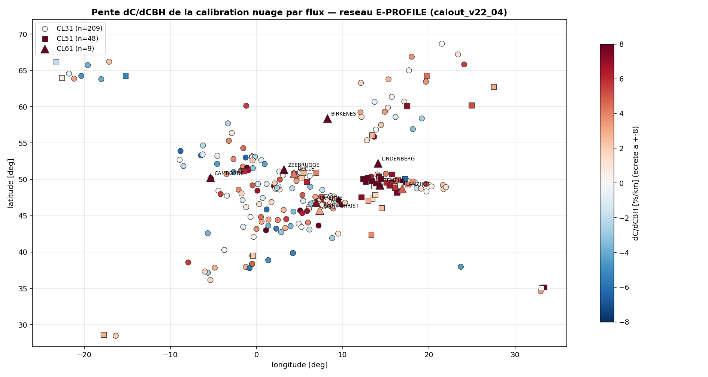

La carte montre l'essentiel d'un coup d'œil : les CL61 (triangles) sont rouge sombre **partout**
(Camborne → Lanzhot, effet de type indépendant de la géographie) ; les CL31 mêlent unités rouges
et bleues **dans les mêmes régions** — l'hétérogénéité est bien par unité, pas par région.

Arbitrage des deux corrélations nominales (CL31, n = 209 ; bloc WMO = proxy pays ; 7 blocs
≥ 8 flux) :

| facteur | brut | intra-bloc (démoyenné) | FE-bloc WLS |
|---|---|---|---|
| longitude | ρ = +0,19 (p = 0,006) | **ρ = +0,01 (p = 0,89)** | p = 0,89 |
| altitude station | ρ = +0,20 (p = 0,004) | ρ = +0,10 (p = 0,16) | coef **+1,6 %/km par km d'altitude**, p = 0,048 |

Les blocs expliquent η² = 0,76 de la variance de longitude (longitude ≈ pays) : la corrélation
longitude est un **pur confondant de bloc, morte à l'arbitrage**. L'altitude conserve un signal
résiduel *faible et marginal* (+1,6 %/km par km d'altitude, p = 0,048 non corrigé de la
multiplicité — sur ~10 facteurs testés, ce n'est pas une découverte, c'est une piste). Elle est
toutefois **cohérente avec le levier extinction du §2.3bis** : des scènes de calibration à nuages
plus minces (α faible) en site élevé induiraient précisément une pente positive. À revisiter si
une campagne fournit l'extinction des scènes ; rien à corriger en l'état.

### 2.3 L'optique η ne peut pas produire l'étalement observé [vérifié]

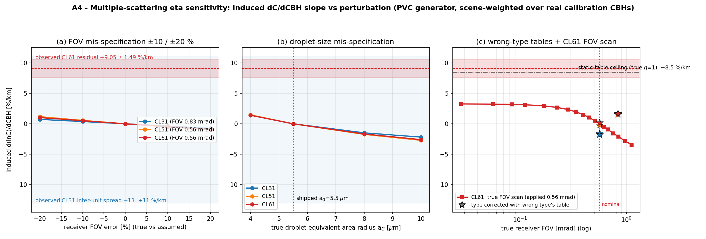

Générateur PVC (Hogan 2006) re-exécuté (écart max de régénération < 5e-6) et pondéré par les CBH
réelles des scènes :

| mis-spécification | pente induite max |
|---|---|
| FOV ± 20 % (dispersion unité réaliste) | ≤ 1,2 %/km |
| rayon de gouttelettes vrai 4–10 µm (table à 5,5 µm) | ≤ 2,7 %/km |
| table du mauvais type appliquée | ≤ 1,7 %/km |
| CL61 : n'importe quel FOV du modèle (jusqu'à 0,028 mrad) | ≤ 3,3 %/km |
| a_G absurde 1 µm | 5,9 %/km |
| plafond mathématique (η vrai = 1, instrument sans diffusion multiple) | **+8,5 %/km** — encore sous le +9,05 observé, et exigerait un décalage constant de C de +16 % qui n'est pas observé |

Conclusion double : (i) l'étalement CL31 −13…+11 %/km est **un ordre de grandeur au-dessus** de ce
que des erreurs η réalistes peuvent induire — l'hétérogénéité intra-type n'est pas optique au sens
η ; (ii) la preuve de la phase 4 est reproduite : **aucune table η statique ne peut produire le
+9 %/km du CL61** [vérifié].

### 2.3bis Addendum — l'hypothèse d'extinction (α, fixé à 10 /km dans les tables) et le couplage gouttelettes–extinction

*Ajouté 2026-08-16 sur question opérateur (le balayage initial ne perturbait pas α).* Générateur
PVC re-exécuté avec l'extinction dans le nuage α ∈ {3, 5, 20, 30} /km (tables appliquées : 10 /km),
pondération par les CBH réelles des scènes :

| α vrai | pente induite (les 3 types) | décalage de niveau de C |
|---|---|---|
| 3 /km | **+4,7 à +5,2 %/km** | +9 à +12 % |
| 5 /km | +3,0 à +3,2 %/km | +6 à +8 % |
| 20 /km | −2,7 à −3,3 %/km | −9 à −10 % |
| 30 /km | −3,5 à −4,8 %/km | −15 à −17 % |

Pris isolément, **α est le levier η le plus puissant testé** (±3–5 %/km — l'ordre de τ ≈ 3 %/km),
devant la taille de gouttelettes seule (≤ 2,7) et le FOV (≤ 1,2). MAIS les deux paramètres
co-varient physiquement (α = 3LWC/2ρ_w r_e : à LWC donné, grosses gouttes ⇒ α plus faible), et
les cas climatologiques couplés se **compensent presque entièrement** :

| cas couplé | pente induite | décalage |
|---|---|---|
| « marin » a_G = 9 µm, α = 5 /km | +1,0 %/km | +1,7 à +1,9 % |
| « continental » a_G = 4,5 µm, α = 15 /km | −1,0 %/km | −2,3 à −2,6 % |

Lecture : une climatologie de gouttelettes site-à-site (marin vs continental) n'induit que
±1 %/km net — cohérent avec l'absence de signal côtier/latitude au §2.2. En revanche une
différence systématique de **régime d'extinction des scènes de calibration** (bruine, nuages
minces α ~3–5 /km vs stratus épais) à LWC non compensé peut contribuer jusqu'à ±3–5 %/km à
l'hétérogénéité — un contributeur plausible de τ sans marqueur géographique simple, qui reste
**insuffisant pour le CL61** (+4,7 max à α = 3 /km, contre +9,05 observé) et ne change pas le
verdict « ne pas retoucher η ». Chiffres : `alpha_scan.json` (scratchpad de session).

### 2.3ter Addendum — balayage λ₀ ±0,3 nm et test SANS correction WV : le mécanisme du +9 CL61 est identifié

*Ajouté 2026-08-16 sur demande opérateur. Rejeu semi-analytique des scènes réelles du run réseau
(la correction WV entre comme facteur T²_wv(CBH) par scène : `beta /= trans2` avant l'intégrale,
donc ln C_L ⊃ −ln T² — recalculé avec les MÊMES fonctions/LUT/CAMS 0,4° que le pipeline ;
`rayleigh_availability/wv_lambda_sweep.py` ; 781 scènes CL61 + 1 997 CL51 + 1 611 CL31 en
contrôle, pente poolée à démoyennage par unité).*

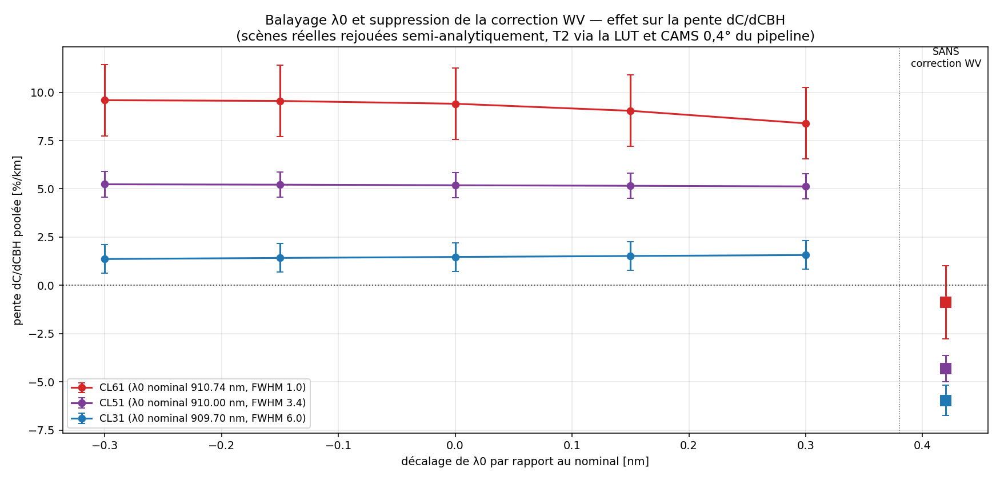

| type | nominale | λ₀ ±0,3 nm | **SANS correction WV** | terme WV (nom−sans) | part du terme vue par le brut |
|---|---|---|---|---|---|
| CL61 | +9,41 ± 1,85 | +8,4 à +9,6 | **−0,87 ± 1,90** | +10,3 %/km | **8 %** |
| CL51 | +5,19 ± 0,66 | +5,1 à +5,2 | −4,31 ± 0,68 | +9,5 %/km | 45 % |
| CL31 | +1,47 ± 0,74 | +1,4 à +1,6 | −5,96 ± 0,78 | +7,4 %/km | 80 % |

Trois conclusions :

1. **λ₀ statique : réfuté.** ±0,3 nm ne déplace aucune pente de plus de ~0,5 %/km — le +9 CL61
   n'est pas une petite erreur de longueur d'onde de la correction.
2. **La décomposition résout l'échelle des types.** Le terme de correction WV porte une
   dépendance CBH de +7 à +10 %/km pour les trois types (l'absorption croît avec le trajet
   sous-nuage, quel que soit le FWHM). Un signal brut physiquement normal doit montrer la pente
   NÉGATIVE opposée — le CL31 la montre à 80 % (son modèle spectral est presque juste, résidu
   +1,5), le CL51 à 45 % (résidu +5,2), **le CL61 à 8 % seulement (résidu +9,4)**. La pente
   dC/dCBH de chaque type EST l'écart entre l'absorption WV modélisée et celle que son signal
   brut contient réellement.
3. **L'anomalie est donc côté instrument CL61, en amont de notre pipeline** : son β_att livré ne
   porte quasiment pas l'absorption WV attendue sur 0,5–2,4 km — compatible avec une
   compensation WV interne (firmware/traitement Vaisala) ou une caractéristique spectrale
   effective très différente du modèle (mais pas à ±0,3 nm près).

**Verdict littérature/constructeur (fouille 2026-08-16, PDF locaux + web)** : AUCUN Vaisala ne
corrige la WV en firmware (consensus CL31/CL51 : Wiegner 2015 « the signal must be corrected for
water vapor », correction toujours côté utilisateur depuis Markowicz 2008 ; Hopkin 2019 l'applique
lui-même, ~12 %/an de cycle sinon). Pour le **CL61**, la position constructeur (User Guide
M212475EN-E) est une **atténuation par CONCEPTION spectrale** : « mitigated by selecting a
different wavelength and a very narrow bandwidth » — le laser (910,55 nm, diode InGaAs chauffée)
est posé dans un creux d'absorption avec une largeur « très étroite ». La littérature CL61
actuelle n'applique d'ailleurs **aucune** correction WV (Le & O'Connor 2026 : la WV n'est jamais
mentionnée dans la chaîne ; Looschelders 2025 : « Despite not correcting for water vapor… ») et
le référé RC1 (10 mars 2026, Specific Comments 4b — vérifié à la source) du preprint relaie la
même position constructeur. Filioglou 2023 rapporte
néanmoins une sensibilité WV résiduelle site-à-site (~15 %) — cohérente avec nos 8 % restants.
**Notre erreur est donc identifiée : le modèle spectral CL61 (λ₀ = 910,74 nm, FWHM = 1,0 nm)
surestime l'absorption effective ~12×** ; le suspect principal est le FWHM (1 nm n'est pas
« very narrow » — une émission sub-nm dans un interstice de raies effondre l'absorption, ce que
la convolution à 1 nm lisse ; c'est aussi pourquoi le balayage λ₀ seul ne trouvait rien).

**La LUT peut-elle voir le « trou d'absorption » ? NON, pas pour un laser sub-nm (vérifié).**
La LUT (`abs_cross_wv_910nm.nc`, variable `abscs_ave`) échantillonne à **8,3 pm en moyenne par
bin**, alors que les raies élargies par pression font ~17 pm FWHM au sol et ~8 pm à 500 hPa :
~2 échantillons par raie au sol, ~1 en altitude — les cœurs de raies et les creux étroits sont
**lissés par la moyenne de bin**. Autour de la raie CL61 mesurée : σ(910,74) = 0,33× la moyenne
de bande (bord d'un creux de 323 pm couvrant 910,41–910,74 nm — la spec Vaisala 910,55 tombe
DEDANS), mais une raie forte siège juste au-dessus : à FWHM 0,1 nm centré 910,74, le σ effectif
vaut **1,78×** la moyenne de bande (pire qu'à 1 nm !). Le scan sur les 781 scènes réelles
confirme : pente injectée **+8,5 à +11,0 %/km pour TOUT FWHM de 0,05 à 1,5 nm** à λ₀ = 910,74
(`wv_fwhm_scan.py`) — aucune combinaison plausible ne descend vers le +0,8 %/km (8 %) que le
signal brut exhibe. **Conclusion : le déficit d'absorption du CL61 est hors de portée de notre
LUT** — soit le vrai spectre a des fenêtres sub-bin bien plus profondes (il faut un calcul
line-by-line HITRAN à ≤ 1 pm sur 909,5–911,5 nm), soit la position vraie de la raie (±0,10 nm de
notre mesure, à cheval sur le bord du creux) est décisive, soit la mitigation n'est pas purement
spectrale. Le **8 % empirique reste la base opérationnelle** en attendant.

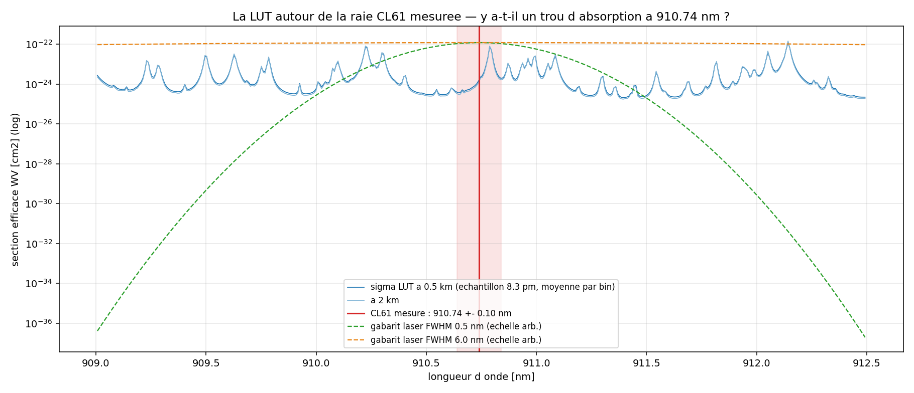
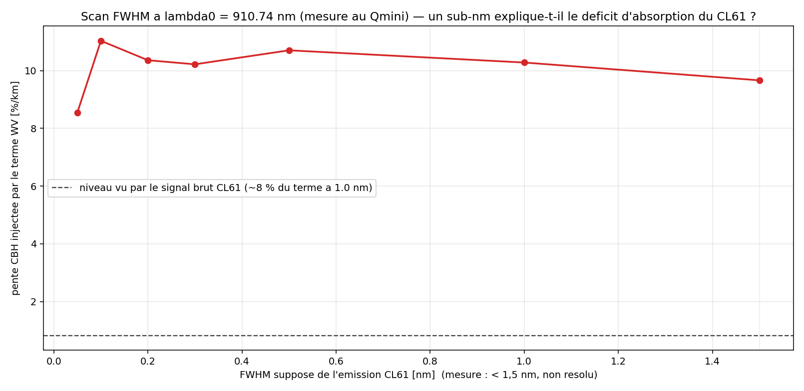

**Actions** : (1) pour la calibration NUAGE CL61, remplacer la correction WV actuelle par une
correction fortement réduite (voire nulle, pratique Le-O'Connor) — critère d'acceptation : pente
CBH ré-mesurée ≈ 0 et niveau −~10 % ; (2) re-fermer le budget Rayleigh CL61 avec le nouveau
modèle (les accords ±3 % avec le CHM15k obtenus AVEC l'ancienne correction doivent être
re-vérifiés — une part de l'attribution dark/WV peut se redistribuer) ; (3) demander à Vaisala
le spectre d'émission mesuré du CL61 (λ₀, FWHM, dérive thermique) — l'action C5 existante
devient précise ; (4) même examen pour le CL51 (brut à 45 % du modèle (910,0, 3,4) — cf. aussi
Chen et al. 2025) ; (5) test PWV co-localisé CL61/CHM15k comme confirmation indépendante.

**Aucun facteur mesurable dans L1 n'explique les différences intra-type.** Les seuls signaux
(firmware 170/171, altitude < 100 m, blocs WMO) sont mutuellement confondus avec le pays
d'exploitation et ne survivent ni au criblage multiple ni aux contrôles intra-bloc ; les facteurs
optiques candidats sont intestables (valeurs de remplissage L1) mais leur effet plafonné par le
modèle η est de toute façon trop petit. L'image compatible avec la littérature (§5.2) est une
hétérogénéité **électronique/artefactuelle propre à chaque unité** (fonds additifs dépendant de la
portée, artefacts firmware, état optique), du même ordre que la dispersion de calibration
unité-à-unité documentée (8–15 %) — réelle, mais sans marqueur unique observable dans nos
métadonnées.

---

## 3. Q2 — La platitude réseau des CL31 : compensation ou vraie platitude ?

**Verdict : compensation.** [vérifié] La moyenne réseau est plate (+0,86 ± 0,23 %/km) mais :

- τ = 2,5–3,2 %/km selon l'estimateur (plancher robuste à l'autocorrélation 2,55 ; split-half
  sans SE 3,06) — l'unité CL31 *typique* porte une vraie pente de l'ordre de ±3 %/km ;
- l'intervalle de prédiction à 95 % d'une unité est **[−4,8 ; +6,5] %/km** : sur une gamme de CBH
  de ~1 km, une unité individuelle peut porter un biais dépendant de la scène de ±5 % ;
- avec les SE clusterisées honnêtes, 15,8 % des unités sont significativement positives et 10,0 %
  significativement négatives (~6× et ~4× le taux de chance) : les deux ailes existent réellement ;
- la reproductibilité split-half (r = 0,56) prouve que ces pentes sont des propriétés stables de
  chaque unité, pas du bruit re-tiré.

La platitude du réseau CL31 est donc une **moyenne de pentes vraies qui s'annulent entre
unités**, non une propriété de chaque instrument. Corollaire opérationnel : toute correction
*réseau* de dC/dCBH appliquée aux CL31 dégraderait environ la moitié du parc (§5.4).

---

## 4. Q3 — Les unités à dC/dCBH ≈ 0 sont-elles mieux calibrées ?

Métrique de qualité : dispersion jour-à-jour dé-tendancée du C nuage (MAD des résidus autour de la
médiane glissante 60 j), plus le taux de succès de calibration. 266 flux appariés.

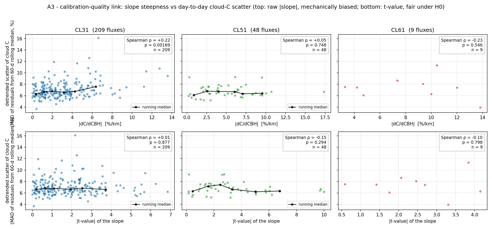

- **CL31** : sur l'axe brut, \|pente\| corrèle avec la dispersion (ρ = +0,22, p = 0,0017 ;
  quartile plat 6,44 % contre raide 7,46 %, p = 0,0007). Mais cet axe est **mécaniquement
  biaisé** : une série plus bruitée donne une pente estimée plus bruitée, donc \|pente\| plus
  grande même à pente vraie nulle — et la preuve mécanique est directe (SE de pente ↔ dispersion :
  ρ = +0,50, p = 2e-14). Sur l'axe équitable (\|t\| de la pente, ~N(0,1) sous H0 quelle que soit
  la dispersion) le lien **disparaît entièrement** : ρ = +0,01, p = 0,88.
- **CL51** : rien sur aucun axe (ρ = +0,05 / −0,15, p > 0,29).
- **CL61** : rien (k = 9 ; ρ = −0,23 / −0,10, n.s.) — attendu, puisque la pente y est un effet de
  type partagé, pas une pathologie d'unité. On note en revanche son taux de succès médian bien
  plus bas (22 % contre 53 % CL31, 57 % CL51), déjà documenté (rapport 07).
- **Paires co-localisées** (13 paires Vaisala) : la dispersion du *rapport* jour-à-jour entre
  voisins est 0,35–0,97× (médiane 0,46×) de ce qu'exigerait l'indépendance → environ la moitié de
  la dispersion par unité est un terme **commun de scène/atmosphère** qui s'annule entre voisins,
  ce qui borne encore la part attribuable à l'instrument.

**Verdict : non.** Une unité à pente ≈ 0 n'est pas mieux calibrée au jour le jour ; la corrélation
brute CL31 est un artefact mécanique qui s'évanouit sur l'axe équitable. La pente dC/dCBH est un
**diagnostic de biais dépendant de la scène**, pas un prédicteur de la qualité/stabilité de la
calibration.

---

## 5. Q4 — Littérature, faut-il corriger, faut-il affiner la paramétrisation nuage ?

Sources primaires lues en entier ou en partie (PDF locaux + vérification web) : O'Connor et al.
2004 [OC04] ; Hopkin et al. 2019 [H19] ; Hogan 2006 [Hog06] ; Kotthaus et al. 2016 [K16] ;
Wiegner & Gasteiger 2015 [WG15] ; Wiegner et al. 2019 [CX19] ; Le & O'Connor et al. 2026,
préprint EGUsphere [LE26] ; Looschelders et al. 2025 [LO25] ; notes complètes dans
`scratchpad/cbh_het/lit_notes_cbh_dependence.md`.

### 5.1 Mécanismes documentés d'une dépendance C(CBH)

1. **Diffusion multiple croissant avec la portée** — le mécanisme central, explicite dans [OC04] :
   pour le CT75K (grand FOV) η = 0,83 à 1 km → 0,73 à 4 km, soit ~3,3 %/km *brut* ; pour un FOV
   étroit « η approche 1 ». C'est ce que nos tables PVC par type corrigent déjà.
2. **Taille des gouttelettes × modèle η** : r_e marin ~13 µm contre continental ~7 µm ; si le r_e
   des scènes co-varie avec la CBH (stratus marins bas = grosses gouttes), toute table *statique*
   laisse un résidu corrélé à la CBH — d'amplitude ≤ 2,7 %/km d'après notre balayage (§2.3).
3. **Transmission vapeur d'eau sous le nuage (910 nm)** : intégrée du sol à la CBH, donc
   CBH-dépendante ; sans correction, cycle apparent ~12 % [H19], biais ~20 % aux moyennes
   latitudes [WG15]. Corrigée chez nous (CAMS L137, obligatoire à 910 nm) ; hors de cause pour le
   résidu CL61 (déjà établi, audit sonde).
4. **Aérosol du trajet sous-nuage** (S > 18,8 sr → C apparent trop haut, trajet ∝ CBH) [OC04, H19].
5. **Bruine** (S < 18,8 sr, liée aux scènes marines basses) [OC04, H19].
6. **Recouvrement/artefacts proche-portée et saturation à CBH basse** : [H19] rejette < 500 m
   (B moyen −9,5 % sous 500 m) ; [K16] artefacts CL31 ; [LE26] biais CL61 non nul sous 200 m,
   pic commun ~150 m.
7. **Troncature de l'intégrale à CBH haute** : firmware CL31 ne range-corrige que sous 2 400 m
   [K16] — d'où le rejet > 2,4 km de [H19] et notre porte fixe 100–2 400 m ; une couche liquide
   occupant ~300 m, la porte tronque l'intégrale dès CBH ≳ 2,1 km → contribution *positive*
   confinée au haut de la gamme.
8. **Atténuation incomplète** des nuages fins/hauts [OC04].

**Référence de système corrigé** : [H19] Fig. 6 — après correction η par porte (Hogan 2006) + WV
NWP, le rétrodiffusé intégré moyen est plat à ~1 % près sur 200 m–2,4 km. **Aucun article ne
rapporte de résidu post-correction de type entier d'ordre +9 %/km** ; le +9,05 ± 1,46 %/km sur
tous les flux CL61 n'a pas d'équivalent documenté.

### 5.2 Dispersion unité-à-unité documentée (contexte de la Q1)

[H19] : 29 CL31 du Met Office, 50 % des calibrations à ±10 % de la moyenne réseau (±8 % pour le
firmware 202) ; stabilité individuelle < ±5 %/an. [LO25] : 6 CL61 co-localisés, variabilité de
coefficient ~5 % en conditions identiques. [F23 via LO25] : 5 CL61 à ±15 % de l'usine. [K16] :
artefacts de fond CL31 dépendant de la portée, amplitude saisonnière ~50 %, spécifiques à l'unité
(« ripple » d'émetteur, firmware). Notre étalement CL31 (τ ≈ 3 %/km sur ~1 km de gamme CBH) est
du même ordre que cette dispersion documentée de 8–15 % — plausible bruit d'unité électronique/
optique, sans mécanisme unique publié.

### 5.3 Pratique opérationnelle et pistes CL61

Personne — Met Office/[H19], Cloudnet/ACTRIS, FMI/[LE26], usine Vaisala — n'applique de correction
empirique post-hoc en fonction de la CBH : partout la dépendance est traitée *dans* l'intégrale
(η par porte + WV), vérifiée par la platitude du B corrigé, puis un **scalaire** par site/période
est publié. [LE26] documente par ailleurs, spécifiquement CL61 : un biais instrumental additif
dépendant de la température (non nul sous 200 m, corrigé chez eux par table T), un plafond de
compensation de puissance laser à 40 % (facteur ×3 en dessous), et la buée de fenêtre — mais
**aucune dépendance CBH du facteur de calibration** n'y est rapportée : leur approche à scalaire
mensuel ne l'aurait pas résolue. Ces voies additives rejoignent notre propre audit sombre : la
baseline croissante avec la portée du CL61 explique 66 % de son gradient intra-nuit
(`dark_aeronet_sonde_audit.md`) — c'est le mécanisme candidat naturel d'un résidu *de type*,
identique sur toutes les unités, que η ne peut pas produire (§2.3).

### 5.4 Verdict Q4 et RECOMMANDATION

- **Faut-il corriger dC/dCBH dans E-PROFILE ?** Pas par une régression réseau. Pour CL31/CL51,
  la pente est une propriété *d'unité* (Q2) : une correction commune dégraderait l'aile opposée du
  parc ; et par unité, ±3 %/km sur ~1 km de gamme est dans le bruit de calibration documenté.
- **Faut-il affiner la paramétrisation nuage (η, a_G, FOV) ?** **Non** — voie prouvée sans issue :
  le balayage PVC borne tout raffinement statique à ≤ 2,7 %/km d'effet, et aucune table statique
  n'atteint le +9 %/km CL61 [vérifié]. Un η par scène (r_e variable) au mieux gagnerait ~1–3 %/km
  sur des sites marins, pour un coût de complexité important et sans traiter le CL61.

**Recommandation (unique) :** conserver la calibration O'Connor à scalaire par flux telle quelle
pour CL31/CL51, publier la pente dC/dCBH par flux comme **diagnostic QC** sur le dashboard
(elle signale un biais dépendant de la scène — pas la qualité de calibration, Q3), sans jamais
l'appliquer comme correction, et considérer le C nuage CL61 comme porteur d'un biais de scène de
±5 % selon la CBH de la période, couvert par la comparaison croisée Rayleigh du rapport 07.

**⚠ CORRECTION 2026-08-16 (fermeture quantitative) — la piste « baseline additive » est
RÉFUTÉE pour la pente NUAGE.** La version initiale de cette recommandation proposait de traiter
le résidu CL61 en soustrayant la baseline additive avant l'intégrale nuage. Le test de fermeture
avec la baseline **mesurée sous capot** à Payerne tranche : dans la zone du retour nuage
(0,5–2,4 km, signal ~1e-4 sr⁻¹m⁻¹) la baseline vaut ~1e-9 → contamination ~0,001 % de
l'intégrale, pente induite **−0,01 %/km** — incapable de produire le +9 observé (figure
`cl61_ray_vs_cloud_altitude.png`). La baseline additive reste la cause dominante côté
**Rayleigh** (signal faible : b/signal ~4 % à 4,5 km, 66 % du gradient intra-nuit) mais ne peut
pas toucher le signal fort du nuage. **Le mécanisme du +9 %/km nuage CL61 reste ouvert** ; la
piste restante la plus cohérente est **spectrale** : le laser CL61 est étroit (FWHM ~1 nm) et
posé sur le flanc de la bande WV à 910,55 nm — une erreur/dérive de λ₀ crée une erreur de
transmission WV *qui croît avec le trajet sous le nuage, donc avec la CBH*, et à laquelle les
CL31/CL51 (FWHM 3,4–6 nm, moyennage multi-raies) sont bien moins sensibles — cohérent avec un
effet de type CL61 pur et avec la régulation thermique de diode perdue observée à Payerne.
Test discriminant proposé : recalculer les scènes nuage CL61 avec λ₀ balayé (±0,3 nm) et mesurer
le déplacement de la pente.

---

## Annexe — fichiers

- Pentes par flux : `rayleigh_availability/cbh_native/per_flux_slopes.csv` ; scènes :
  `rayleigh_availability/cbh_native/cbh_scenes.csv` ; référence FE : `cbh_native/fe_results.json`.
- Statistiques et vérifications : `scratchpad/cbh_het/` (`meta_stats.json`,
  `a1_verification_summary.json`, `re_meta_verification*.json`, `cl61_meta_rederive.json`,
  `factors_stats.json`, `quality_link.json`, `eta_sensitivity.json`,
  `lit_notes_cbh_dependence.md`).
- Figures : `doc/reports/figs_cbh_heterogeneity/`.
