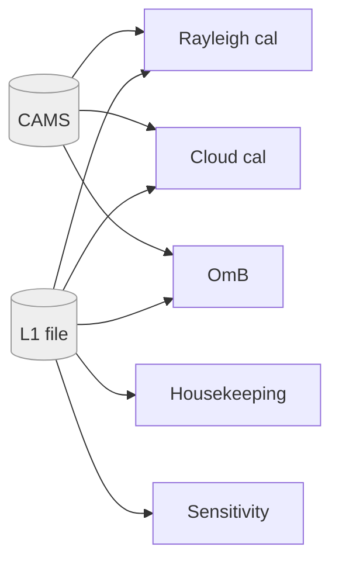
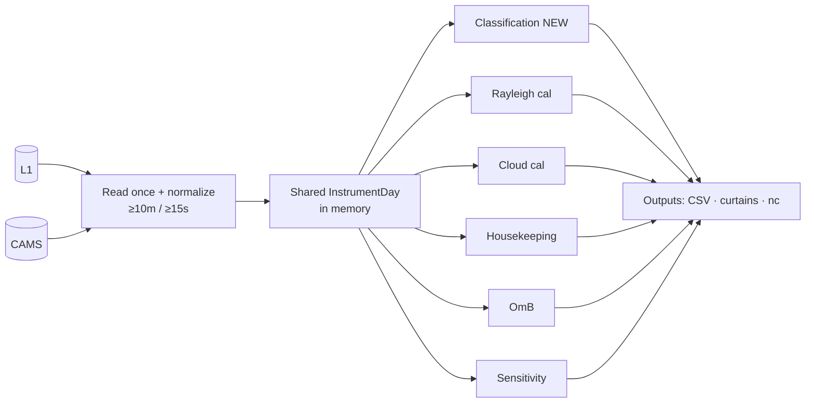

# Plan — Cloudnet target classification for the whole ALC network

*Run `ceiloclass` (CloudnetPy-style aerosol/cloud/ice/drizzle classification) for all
~433 E-PROFILE streams daily, show the curtains on the dashboard, drive it from **CAMS**
temperature, and restructure the daily runner so each instrument-day's **L1 and CAMS are
read once** and shared across classification + all existing steps.*

Prepared 2026-07-10. Companion code: `…/Python/ceiloclass/payerne_eprofile_test/`
(`eprofile_l1.py`, `cams_model.py`, drivers). Validated on Payerne CL31/CHM15k/CL61.

---

## 1. Resolution normalization (the ≥10 m / ≥15 s rule)

Classify on a grid **no finer than 10 m in range and 15 s in time**; where the native
grid is finer, **block-average consecutive bins** down to it. Measured per type:

| Type | Native range × time | Action | Cells saved |
|:--|:--|:--|:--|
| CHM15k | 15 m × 15 s | none | — |
| CL31 | 10 m × 30 s | none | — |
| CL51 | 10 m × 36 s | none | — |
| **CL61** | **4.8 m** × 30 s | **average 3 range gates** → 14.4 m | **67 %** |
| Mini-MPL | 30 m × 300 s | none (also: no reader) | — |

So the rule **only bites on CL61** — which is exactly the expensive instrument (3276
gates). Averaging range ÷3 cuts its classify cost ~⅔ (measured ~80 s → ~25 s). Use a
**tolerance** (coarsen only if native < 0.9× target) so CHM15k at ~14.99 s isn't halved by
floating-point. Range averaging preserves the vertical resolution the layers need (14.4 m
still resolves thin liquid layers); time stays ≥15 s so nothing is smeared.

---

## 2. Code overview

**A. Classification stack** (external + our adapters)

| Layer | What |
|:--|:--|
| `ceilopyter` | native readers, `Ceilo`/`CeiloRaw`, `screen_noise` (per-instrument floors), `average_time` |
| `ceiloclass` | `classify()` (adaptive β threshold, liquid/ice/depol logic), `Model`/`read_model`, `plot_classification`, `write_classification` |
| **our port** | `eprofile_l1.py` — L1 `rcs_0` → `Ceilo` (per-type β factor: CHM15k ×3e-12, CL31/51 ×1e-8, CL61 ×1.0). `cams_model.py` — CAMS → temperature `Model` (reuses parent `cams_temperature_pressure_profile`; ISA lapse below the CAMS surface) |

**B. Parent ALC pipeline**

```
ops/           config.sh (ALC_* env) · run_daily.sh · ops_daily.py · publish.sh · prefetch_cams.sh
scripts/       run_network_calibration.py  ← ThreadPoolExecutor, 1 subprocess per stream
                 └ _process_stream → _do_rayleigh · _do_cloud · _do_monitoring · _do_omb · _do_sens
               build_dashboard.py · refresh_census.py · extract_l2_opcoeff.py
calibration/io/            data_loader.py (load_l1_data) · l1_window.py (load_l1_window) · cams.py
calibration/rayleigh/      calibration.py · rayleigh_fit.py · molecular_methods.py (flag_contaminated_cells) · atmosphere.py
calibration/cloud/         calibration.py (read_ceilometer_data · _cams_levels_all_times, LRU)
calibration/water_vapor_correction/  water_vapor.py (_cams_levels, cams_temperature_pressure_profile, L137 a/b)
calibration/omb/           omb.py (cams_aerosol_backscatter)
calibration/sensitivity/   network.py
calibration/status/        decode.py (housekeeping / error strings)
monitoring/                render.py (Jinja2 + Plotly)  →  ops/publish.sh (S3 bucket + web VM)
```

Key structural fact: **all steps for one stream already run inside a single subprocess**
(`_process_stream`), so in-memory sharing is possible today — nothing exploits it yet.

---

## 3. Actual data flow (current)

Each step re-opens raw data independently (see the rendered diagram in chat):



| Step | L1 opens | CAMS opens | Reads |
|:--|:--:|:--:|:--|
| Rayleigh | 1 (`load_l1_data`) | 1 (**xarray**, bypasses cache) | rcs_0, cbh, HK, molecular T/P |
| Cloud | 1 (`Dataset`) | 1 (netCDF4, LRU) | rcs_0, cbh, WV T/q |
| Housekeeping | 1 (`Dataset`) | 0 | status/error, laser, window, temps |
| OmB | month loop | 1 (netCDF4, aerosol cols **not** cached) | rcs_0, aerosol β |
| Sensitivity | month loop (shares OmB memory) | 0 (WV LUT) | rcs_0 |
| **Classification** | **— (absent)** | — | — |

**Redundancy: ~5 L1 opens + ~3 CAMS opens per instrument-day.** The `_cams_levels_all_times`
LRU cache helps *within* a month, but Rayleigh's xarray CAMS read and OmB's aerosol-column
read both sit outside it, and there is **no shared per-day data object** — each step reloads
from disk.

---

## 4. Ideal data flow (target)



**One disk read of L1 + CAMS per instrument-day**, then consumers take the in-memory *view*
they need:
- Classification & housekeeping use the **coarsened** stack (≥10 m/≥15 s).
- Rayleigh/cloud keep their **native-resolution** view of the same arrays in their fit window.
- Classification's β is just `rcs_0 × factor` (no new read); its temperature is the CAMS
  profile already loaded for WV/molecular.

The classification **rides along for near-free** — its inputs are already in memory.

**Design:**
1. `InstrumentDayData` dataclass — raw L1 arrays (`rcs_0`, `cbh`, status/HK, `range`,
   `time`, `wavelength`, coords) + a `CamsProfile` (T/q/P, molecular reference, aerosol β).
2. `load_instrument_day(stream, dates)` — opens the night+day L1 span **once** and the CAMS
   file **once**; unifies the xarray/netCDF4 CAMS split behind one opener+cache.
3. `_do_*` steps take the shared object instead of re-opening.
4. New `_do_classification(shared)` consumer.

---

## 5. Plan to run classification for all instruments

**Phase A — standalone batch (low risk, ~1 week).** Independent of the pipeline; produces
dashboard images and validates at scale.
- Enumerate streams from `validation/scope_l1_2026_census.json` (**skip Mini-MPL** — no
  ceilopyter reader; 5 streams).
- Per stream/day: `eprofile_l1.read_eprofile_l1` → coarsen (§1) → `cams_model.cams_to_model`
  (0.4° `D:\CAMS_Monthly_04` / `ALC_CAMS_DIR`, 1° fallback) → `classify` → curtain PNG.
- Parallelize over streams (ThreadPool, like `run_network_calibration`).
- **Compute:** ~110 min/day single-thread → **~10–15 min at 8–16 workers**; CL61 ÷3 trims it.
- **Storage:** ~150 KB/curtain × 433 ≈ **65 MB/day ≈ 24 GB/yr**; prune-after-upload as today.

**Phase B — fold into the daily runner (the §4 refactor).** Add `--classify`; classification
becomes a consumer of the shared `InstrumentDayData`. Do it behind a flag and diff outputs
against Phase A to confirm equivalence.

---

## 6. Operations integration

- `ops/config.sh`: add `ALC_CLASSIFY=1` (+ optional `ALC_CLASSIFY_MAXY`, coarsening targets).
  `ALC_CAMS_DIR` (0.4°) already exists — reuse it, **not** the 1° `D:\CAMS`.
- `ops_daily.py` / `run_network_calibration.py`: pass `--classify`; add `_do_classification` after the
  shared load; write curtain into the per-station `plots/` dir with the existing `<date>_<wmo>`
  tag convention.
- **910 nm nights without usable CAMS**: classification needs temperature only for the
  ice/liquid split — fall back to dry-bulb or skip the phase gracefully (never hard-fail the
  stream). Same nights the WV correction already flags.
- **Mini-MPL** (5 streams): skip until a reader is added.

## 7. Dashboard integration

- Render the curtain in repo style (reuse `ceiloclass.plot` or a `calibration/plotting.py`
  `plot_classification_curtain`), saved as `<tag>_classification.png`.
- `monitoring/render.py` already **auto-discovers** `plots/`; add a "Classification" panel per
  station (day picker reuse). `ops/publish.sh` syncs it to the S3 bucket unchanged. **~1 day.**

## 8. Bonus — classification → Rayleigh screening (Q5)

Once the mask exists per instrument-day it is ~free to feed the fit screening. Injection point:
`molecular_methods.flag_contaminated_cells` (union the aerosol/cloud/ice mask into the existing
MAD/scattering-ratio gate). **Validated on CL61 2026-03-06**: a persistent 0.2-depol layer at
2.5–3.7 km — weak in backscatter, so it slips the scattering-ratio gate — is flagged decisively
via depol, and would have contaminated a 3.5–4.5 km fit window in 99.7 % of profiles. **Value is
concentrated in the 13 CL61s** (depol); marginal for single-channel CL31/CHM15k/CL51. Ship it as
an **overlay/diagnostic first**, gate only where the overlay shows it beats the current screen.

---

## 9. Effort, risks, recommendation

| Item | Effort |
|:--|:--|
| Phase A standalone batch + dashboard images | **~1 week** |
| CAMS→model (done) + resolution rule (done) | — |
| Phase B shared-load refactor (`InstrumentDayData`, thread through `_do_*`) | ~1–1.5 weeks |
| Rayleigh-screening overlay (CL61) | ~2–3 days |
| **Total to fully integrated + dashboard** | **~2.5–3.5 weeks** |

**Risks & mitigations**
- *Refactor regression* — the shared load touches every step. Do it flag-gated; diff CSV
  outputs before/after (must be bit-identical for cal/OmB/sens).
- *Coarsening vs calibration* — keep Rayleigh/cloud on their native view; coarsen only the
  classification/HK view, so the rule can't shift calibration numbers.
- *CAMS orography in complex terrain* — near-surface T bias (see WV-resolution study); irrelevant
  to the Rayleigh fit (3.5–5 km), matters only for boundary-layer classification.
- *Compute* — classification (12–18 s) dwarfs the calibration (1–4 s); it's the new bottleneck.
  Parallel + CL61 coarsening keep the daily batch ~10–15 min.

**Recommendation.** Ship **Phase A** first — standalone curtains on the dashboard using CAMS.
It's de-risked (touches nothing operational), delivers the visual immediately, and doubles as
the scale test for the Q5 screening. Then do the **Phase B** read-once refactor as a separate,
output-preserving change (it pays for itself in I/O and makes classification effectively free).
Wire the Rayleigh screening for **CL61 only**, after the overlay validation.
