# CL61 & CHM15k electronic-offset characterisation and correction — Payerne 2026

*E-PROFILE / MeteoSwiss · branch `wv-correction` · analysis scripts `validation/paper/_hood_*.py`,
`_cl61_*.py`, `_chm15k_*.py` · figures `figs_paper_report/`. Companion to
[cl61_rayleigh_investigation.md](cl61_rayleigh_investigation.md) (root-cause) and
[paper_validation_report.md](paper_validation_report.md) (network validation).*

## Summary

Covered-telescope ("terminal hood") dark measurements on the co-located Payerne **CL61** (910 nm,
analog) and **CHM15k** (1064 nm, photon-counting) reveal a small **negative electronic offset** in
the vendor L1 `rcs_0`. It is ≈ 100× below the per-shot noise — invisible profile-by-profile — but
**statistically significant** in the deep average (CL61 **−12.4σ**, CHM15k **−5.4σ**). Each offset
is reproduced by a **physical model**: for the CL61 the pulse response of an AC-coupled (high-pass)
chain — a fast positive lobe minus a slow undershoot (τ_p ≈ 4.7 µs, τ_u ≈ 30.5 µs); for the CHM15k a
single negative relaxation (background/afterpulse over-subtraction, L ≈ 2.7 km). Subtracting the
CL61 model and **recalibrating the full CL61 record (2026-02-24 … 06-30)** both *unlocks nights*
(good-flag calibrations 3 → 10) and shifts the constant **+15 %** toward the CHM15k-anchored cloud
value on paired nights. **Only the CL61 offset is material**: the CHM15k's is within its own 13 %
night-to-night calibration scatter, so the CHM15k constant stands (consistent with its EARLINET /
cloud agreement).

---

## 1. Material and methods

### 1.1 Instruments and hood measurements
Three ceilometers share the Payerne roof (WMO `0-20000-0-06610`, 46.81 °N, 6.94 °E, 491 m):
CHM15k (ident `A`, Lufft, 1064 nm, photon-counting), CL31 (ident `B`, Vaisala, 910 nm), CL61
(ident `C`, Vaisala, 910 nm). Four **terminal-hood** sessions were performed in 2026 (each
instrument's telescope covered in turn; per-instrument windows from the operator log):

| session | CHM15k (UTC) | CL31 (UTC) | CL61 (UTC) | note |
|---|---|---|---|---|
| 12 May | 09:24–14:53 | 09:33–14:55 | 09:17–14:58 | daytime |
| 26–27 May | 26 12:00 → 27 13:15 | 26 12:00 → 27 13:10 | 26 11:45 → 27 13:15 | **~24 h diurnal cycle** (heat dome) |
| 9 Jun | 09:16–11:55 | 09:16–11:57 | 09:10–11:51 | bin-bag solar-hermeticity test 10:34–11:39 |
| 23 Jun | 12:32–15:09 | 10:12–12:13 | 10:00–12:25 | midday peak-summer (temp_int 43 °C) |

With the telescope covered there is no atmospheric return, so the window-mean profile **is** the
processing offset. Data are the E-PROFILE L1 `rcs_0` (range-corrected signal; CHM15k in
counts·s⁻¹·m², CL31 in V·m², CL61 in m⁻¹sr⁻¹) read from the operational archive.

### 1.2 Estimation space and estimators
The offset is estimated in the **non-range-corrected space** P = rcs_0 / z² (= β/r² for the CL61),
where the detector noise is homoscedastic (flat with range). The DC bias is the per-gate **median**
(spike-immune) over the pooled hood profiles; its uncertainty is the standard error of the median
(1.253·σ/√N) plus a 3000-sample bootstrap CI. A per-profile 3–5 km band-mean, medianed over all
shots, gives the significance in σ (`_hood_offset_significance.py`). Comparability across the
different `rcs_0` units is achieved by expressing each offset as a **fraction of that instrument's
own clear-night molecular signal** at the same heights (median of three clear nights).

### 1.3 Physical models
Each offset is fitted in P-space by robust non-linear least squares (soft-L1). **CL61:** the pulse
response of a high-pass (AC-coupled) chain, P(r) = A_p e^(−r/L_p) − A_u e^(−r/L_u) + b_∞ (fast
positive lobe, slow negative undershoot; the DC-blocking property forces the two areas to nearly
cancel). **CHM15k:** a single negative relaxation P(r) = b_∞ − A e^(−r/L) (no positive lobe → not
AC-coupling but a photon-counting background/afterpulse over-subtraction). Range ↔ time via
r = c·t/2 (a scale L is a time constant τ = 2L/c).

### 1.4 Correction and recalibration
The correction subtracts the modeled b(z) = P_model(z)·z² from L1 `rcs_0`, gate by gate, **before**
the water-vapour division (the offset is an additive term in the raw signal). For the full-period
run this is applied in memory by wrapping the calibration's `load_data` (avoids copying 24 GB of
CL61 L1; `_cl61_fullperiod_recal.py`). The eprof_v2 Rayleigh calibration (WV correction on,
monthly CAMS) is then run for every day of the CL61 record with and without the correction, and the
per-night lidar constant compared to the CHM15k-anchored cloud constant **C_L = 1.4252**.

### 1.5 Temperature analysis (Le et al. 2026 style)
Pooling the four sessions, the profiles are binned by internal temperature `temp_int` (22–44 °C);
per bin, the **instrumental bias** μ(β/r²) (per-gate mean) and the **noise** σ²(β/r²) (per-gate
variance) are plotted vs range, coloured by temperature — the decomposition used by Le et al. (2026,
their fig. f/g).

### 1.6 Contamination screen
Time-height pcolors of every session (`_hood_pcolor.py`) confirm the covered windows are otherwise
uniform noise. The one exception is the **first ~1 minute** of a session, when the hood is being
placed and the still-open telescope catches real atmosphere (e.g. CL61 9 Jun 09:10–09:11 saw a
cloud/aerosol layer at ~1.3 km, β_att up to 435 vs ~1.5 for clean dark). Because these leak into the
mean-based μ (not the median-based offset models), profiles with a **coherent** mid-range return
(median β_att over 1.5–4 km > 0.1 Mm⁻¹sr⁻¹ — robust to photon-counting single-gate spikes) are
screened out before the temperature analysis (CL61 0.1 %, CHM15k 5.4 %).

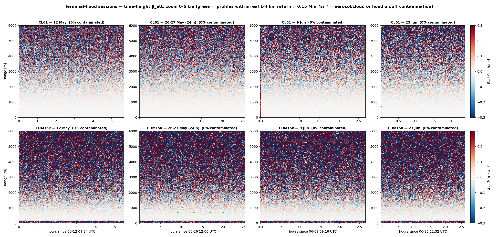
*Figure 0 — Time-height β_att of the four hood sessions (0–6 km), CL61 (top) and CHM15k (bottom);
green = screened profiles. The windows are uniform dark noise apart from the hood-placement
transition at each session start.*

---

## 2. Results

### 2.1 The dark measurements: a real but tiny offset

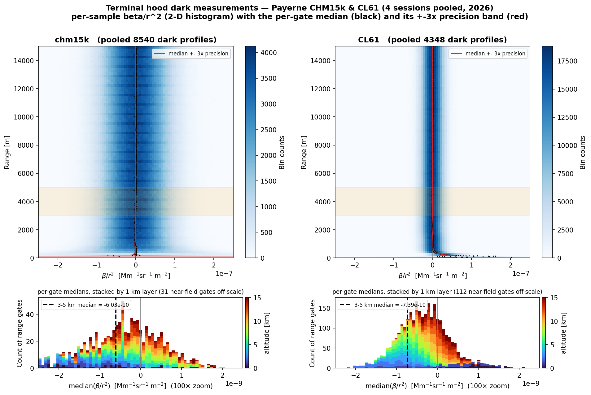
*Figure 1 — Terminal-hood dark binscatter (Python reproduction of the operator's MATLAB figure,
pooled over the four 2026 sessions). Per-sample β/r² (2-D histogram) with the per-gate median
(black) and its ±3× precision band (red); orange = 3–5 km Rayleigh window. On the per-sample scale
(±2.5·10⁻⁷) both medians sit on zero — the offset is ~100× below the shot noise.*

On the per-shot scale the offset is invisible (Fig. 1) — the point the operator (hervo63) correctly
raised. Averaging over the 3–5 km band **and** the full session, however, it is significant:

| | offset (3–5 km) | significance | offset / clear-night molecular |
|---|---|---|---|
| **CL61** | negative, all 4 sessions | **−12.4σ** | −11 … −13 % |
| **CHM15k** | negative, all 4 sessions | **−5.4σ** | −18 % (of a *very weak* 1064 nm molecular) |
| **CL31** | small, stable | — | offset ≳ molecular (no fittable signal → not Rayleigh-calibratable) |

### 2.2 Physical models — three distinct mechanisms

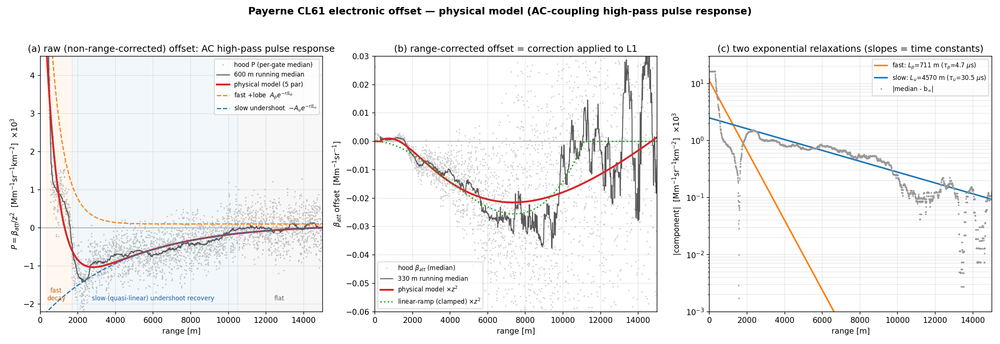
*Figure 2 — CL61 offset (910 nm, analog): AC-coupling high-pass pulse response. (a) raw P with the
fast positive lobe (τ_p = 4.7 µs) and slow negative undershoot (τ_u = 30.5 µs); (b) the
range-corrected correction; (c) each relaxation followed by the median minus the other component.*

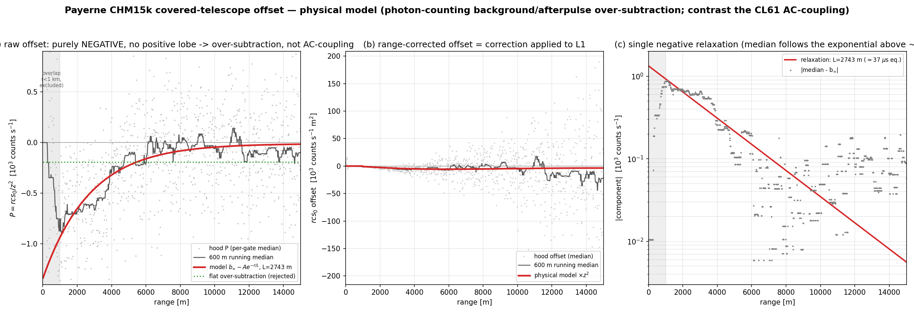
*Figure 3 — CHM15k offset (1064 nm, photon-counting): a single negative relaxation
(A ≈ 1330 counts s⁻¹, L ≈ 2.7 km), **no positive lobe** → background/afterpulse over-subtraction,
not AC-coupling. It beats a flat-over-subtraction null (RMSE 381 vs 445). Lower SNR than the CL61.*

The **shape contrast** is the diagnostic: the CL61's positive-lobe/undershoot is the signature of a
high-pass (AC-coupling) analog chain; the CHM15k's purely-negative relaxation is a photon-counting
over-subtraction. Both reach the same *net negative weak-signal bias* by different routes.

**A third mechanism — the CL31 (improving on Kotthaus et al. 2016).** Kotthaus et al. (AMT 9, 3769)
remove the CL31 instrument background P^bgi(r) *empirically* (subtract the measured hood/night
profile; their Eq. 1, P̂ = P − P^bgi) and explicitly decline to model the transmitter **"ripple"**
(*"a physical effect … vertically alternating positive and negative bias … correctable based on its
sensor-specific frequency … but is not addressed here"*). We model it: the CL31 hood offset is the
**superposition of two under-damped resonances**,
P(r) = b_∞ + Σ e^(−r/Lₖ)[aₖcos(2πr/Λₖ) + bₖsin(2πr/Λₖ)], each range period mapping to a frequency
f = c/2Λ. **R² = 0.98** (vs 0.74 for a single sinusoid).

| mode | Λ | L | f = c/2Λ | origin |
|---|---|---|---|---|
| fast | 1053 m | 387 m | **142 kHz** | AC-coupling **amplifier ring** — matches Kotthaus's stated 159 kHz high-pass corner |
| slow | 5080 m | 5354 m | 30 kHz | the transmitter **ripple** (CLT321) |

The 142 vs 159 kHz match confirms the fast mode *is* the amplifier's high-pass resonance. So the
three instruments have three distinct hardware mechanisms — over-damped undershoot (CL61),
over-subtraction relaxation (CHM15k), two under-damped resonances (CL31) — a physical model where
Kotthaus used an empirical profile.

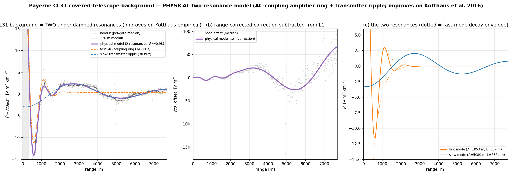
*Figure 3b — CL31 background as two under-damped resonances (R² = 0.98): the fast AC-coupling
amplifier ring (142 kHz) dominates the near-range undershoot, the slow transmitter ripple (30 kHz)
carries the 2–7 km oscillation. σ_P is flat white noise (irreducible — the CL31's low-SNR limit).*

### 2.2b Does the model transfer? — applying it to a second Vaisala (Uccle CL51)

A physical model earns its keep by generalizing. We applied the CL31 approach to the **Uccle CL51**
(`0-20000-0-06447` A) — a different unit of the same Vaisala single-lens family, at a different site.
Uccle had **no terminal-hood campaign** (only Payerne did), so the offset was extracted from
**clear-night per-gate medians** of P = rcs_0/z² (nighttime, cloud-free, cleanest-50 % aerosol, 75 640
profiles): the *fixed* electronic pattern survives the median while the *variable* atmosphere averages
to a smooth baseline that a gaussian high-pass (σ ≈ 350 m) removes.

**The two-resonance CL31 model does _not_ transfer.** The CL51 offset is dominated by a **fixed
40 m (exactly 4 range-gate) ripple**, *undamped* out to >10 km (autocorrelation ≈ 0.99 at
40/80/120 m; ripple RMS flat at 1.55 from 2–10 km). 40 m = 4× the 10 m gate ⇒ f = c/2Λ =
**3.75 MHz = f_sample/4** (the 15 MHz range-gate clock) — the signature of a **4-way ADC-interleave /
digitizer fixed-pattern ripple**, fit by a period-4 model (fundamental + Nyquist harmonic) at
**R² = 0.98**. This same 40 m ripple is **absent as a coherent feature in the Payerne CL31** (its 40 m
content is incoherent noise, autocorrelation 0.26, RMS 0.47).

| | Payerne CL31 | Uccle CL51 |
|---|---|---|
| dominant offset | two under-damped resonances (1053 m, 5080 m) | fixed **40 m** ripple (f_sample/4) |
| damping | ring decays by ~1.5 km | **undamped** to >10 km |
| frequency | 142 kHz + 30 kHz (analog) | **3.75 MHz** (digitizer) |
| coherent 40 m ripple? | no (noise) | yes (autocorr 0.99) |

This is exactly the picture Kotthaus et al. anticipated: the ripple is a **sensor-specific frequency**.
Each Vaisala unit imprints its *own* fixed additive pattern — so the *universal* principle is the
**fixed electronic offset** (their empirical P^bgi), not a universal spectral shape. A physical model
must be re-fit per unit; there is no single transferable curve. (Caveat: without a hood, Uccle's real
maritime boundary-layer aerosol dominates <1.8 km, so only the oscillatory ripple is cleanly
recoverable there — not the smooth near-range offset a hood would isolate.)

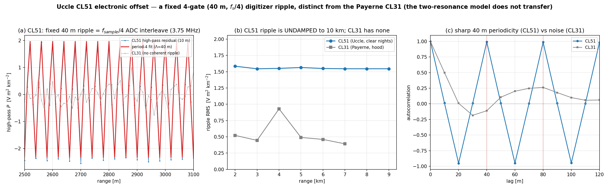
*Figure 3c — Uccle CL51 offset from clear-night medians (no hood). (a) the fixed 40 m ripple at native
10 m resolution with the period-4 fit (red); the CL31 (grey) has no coherent ripple. (b) the CL51
ripple is undamped to 10 km (RMS ≈ 1.55) while the CL31 has none. (c) autocorrelation — a sharp 40 m
periodicity in the CL51, decaying noise in the CL31.*

### 2.3 The correction profiles

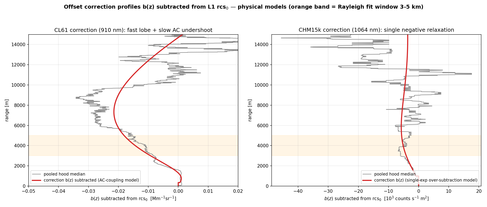
*Figure 4 — The offset correction b(z) subtracted from L1 rcs_0 for each instrument (physical
models), with the pooled hood median for context. CL61: fast lobe + slow AC undershoot, ≈ −0.02
Mm⁻¹sr⁻¹ at the 3–5 km window. CHM15k: single negative relaxation.*

### 2.4 Full-period CL61 recalibration

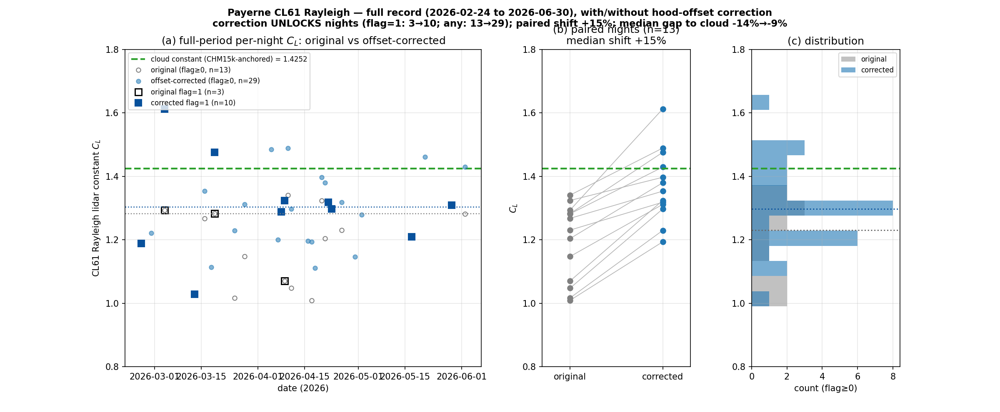
*Figure 5 — Payerne CL61 Rayleigh over the whole record (2026-02-24 … 06-30), with/without the
hood-offset correction. (a) per-night C_L; (b) paired nights; (c) distribution. The correction
**unlocks nights** (good-flag calibrations 3 → 10; any-flag 13 → 29 — the offset was failing the
fit-eligibility and method-agreement gates) and shifts C_L **+15 %** (paired median) toward the
cloud constant.*

| metric | original | offset-corrected |
|---|---|---|
| good (flag = 1) nights | 3 | **10** |
| any-flag calibrated nights | 13 | **29** |
| median C_L (any-flag) | 1.231 | 1.297 |
| **gap to cloud constant 1.4252** | **−13.7 %** | **−9.0 %** |
| paired-night median shift | — | **+15 %** |

The correction removes roughly ⅔ of the method gap and, importantly, more than triples the number
of successfully-calibrated nights — the offset was not only biasing the constant but spoiling the
fit outright on many nights. The residual ≈ −9 % is consistent with the companion report's
decomposition (night-time deepening of the offset + the monthly-CAMS WV over-correction).

### 2.5 Temperature analysis (Le et al. style)

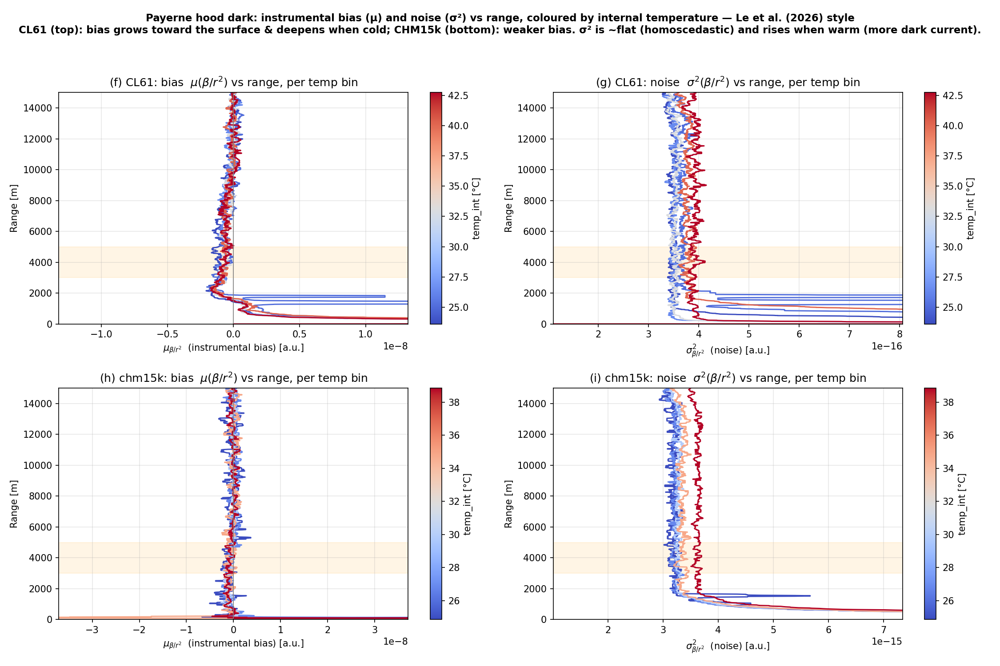
*Figure 6 — Instrumental bias μ(β/r²) and noise σ²(β/r²) vs range, per internal-temperature bin
(Le et al. 2026 style). Top: CL61; bottom: CHM15k. **σ² is flat (homoscedastic) and rises with
temperature** (more dark current when warm) — the classic detector-noise signature. **μ** carries
the offset, largest toward the surface; for the CL61 it deepens at the cold (night) end.*

Two temperature effects, cleanly separated by this decomposition:
- **Noise σ²** grows with `temp_int` (dark current) — flat with range, as expected for a
  background-limited detector.
- **Bias μ** is the offset; its amplitude has a modest temperature dependence (within a single
  session, cold/warm ≈ ×1.13 at 3–6 km; see companion §1f), sitting in the CL61 undershoot
  *amplitude* while the RC time constant τ_u stays fixed.

### 2.6 Multi-instrument intercomparison — does the correction improve agreement?

Regenerating the Payerne multi-instrument intercomparison (Mar–May 2026, β_att vs the CHM15k
Rayleigh reference over 500–3000 m) with the offset corrections applied end-to-end. **This runs on
L1 only** (`dataLevel="L1"` → `read_l1` + the operational calout Kalman constants, matching the
dashboard / balfrin reprocessing — no L2 anywhere; the offset models are subtracted from L1 rcs_0):

| channel | relbias vs CHM15k (Rayleigh) | r |
|---|---|---|
| CL61 (cloud) — trusted anchor | −1.5 % | 0.99 |
| CL61 (Rayleigh) | +12.6 % | 0.99 |
| **CL61 (Rayleigh, offset-corr)** | **+0.2 %** | 0.98 |
| **CHM15k (Rayleigh, offset-corr)** | **−6.3 %** | 1.00 |
| CL31 (cloud) | +27.0 % | 0.51 |
| **CL31 (cloud, offset-corr)** | **+22.6 %** | **0.64** |

The result is **asymmetric across the three instruments**:
- **Correcting the CL61 works:** its Rayleigh bias collapses from **+12.6 % to +0.2 %**, into
  agreement with both the CL61 cloud method (−1.5 %) and the CHM15k reference. Full-record
  confirmation that the CL61 offset is a real, correctable calibration bias.
- **Correcting the CL31 helps but doesn't fix it:** removing the two-resonance ringing (§2.2) from
  the L1 rcs_0 **improves the correlation r 0.51 → 0.64** (the ripple is a systematic range-pattern
  that was *decorrelating* the CL31 from the reference) and trims the bias +27.0 % → +22.6 %. The
  large residual is the CL31's own low-SNR limit (σ_P is white noise, irreducible) — the offset is a
  contributor, not the whole story.
- **Correcting the CHM15k *degrades* the agreement:** it shifts the CHM15k **−6.3 % away** from the
  cloud-anchored agreement. This is **not** because the correction does nothing — the CHM15k
  full-period recalibration (Fig 8) shows a real **+10.3 % paired shift** and night-unlocking
  (flag=1 6→13), a magnitude *like the CL61* (+15 %, 3→10). The two instruments are separated not by
  the recalibration *magnitude* but by its **direction relative to the trusted anchor**: the CL61
  native Rayleigh was biased (+12.6 %) so the correction fixes it, whereas the CHM15k native already
  agreed with the CL61 cloud method (−1.5 %) so the same correction pushes it off.

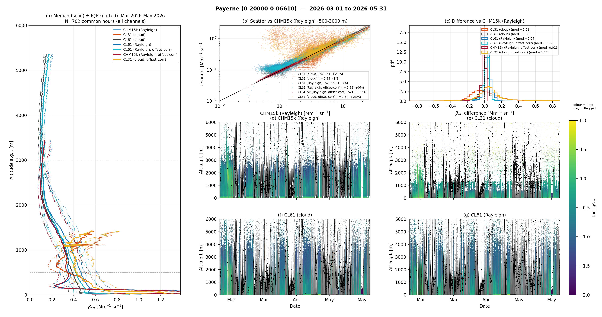
*Figure 7 — Payerne multi-instrument intercomparison (Mar–May 2026) with the offset-corrected
channels added. (a) median profiles; (b) scatter and (c) difference vs the CHM15k Rayleigh
reference; (d–g) time-height β_att. CL61 (Rayleigh, offset-corr) collapses onto the cloud/reference
agreement; CHM15k (Rayleigh, offset-corr) moves away from it.*

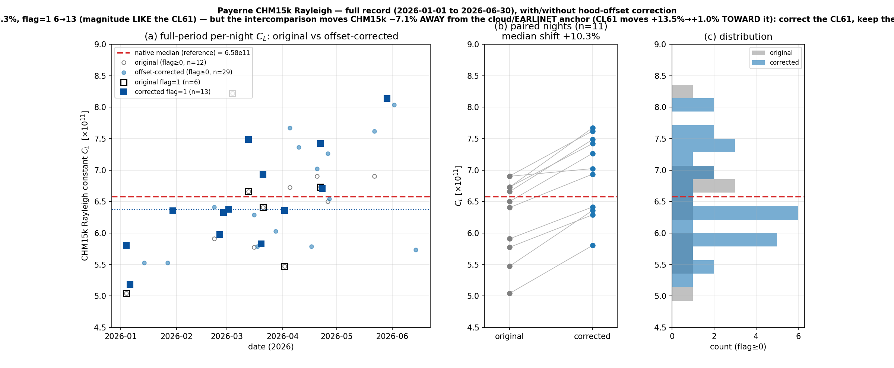
*Figure 8 — CHM15k full-record recalibration with/without the offset correction. The paired shift
(+10.3 %) and night-unlocking mirror the CL61 — so the recalibration alone does not distinguish the
two instruments; only the intercomparison (Fig 7) does, via the sign relative to the cloud anchor.*

**Operational take-away:** apply the offset correction to the **CL61** (and, by the same mechanism,
CL51/CL31 where a molecular signal exists); **retain the native CHM15k** constant — the one
consistent with the cloud/EARLINET anchor. *Open question:* why a real offset biases the CL61's
native Rayleigh (vs the anchor) but not the CHM15k's would need an independent absolute Rayleigh
reference for the CHM15k (e.g. co-located Raman/EARLINET) to resolve.

### 2.7 Does the bias correction change the *cloud* calibration? No — it is offset-immune

The CL31/CL51 are calibrated by the **liquid-cloud (O'Connor) method**, not Rayleigh. We reran that
calibration on **L1 (operational O'Connor, `_cloud_offsetcorr_recal.py`)** with the electronic-offset
correction subtracted from rcs_0 — the CL31 two-resonance model and the CL51 40 m ripple respectively
— over Mar–Jun 2026, paired day-by-day against the native calibration:

| instrument | cloud-days | median C (native) | **median shift (corr − native)** | \|95 pct\| | max \|shift\| |
|---|---|---|---|---|---|
| Payerne CL31 | 28 | 3.079 | **−0.00 %** | 2.21 % | 3.10 % |
| Uccle CL51 | 25 | 1.299 | **+0.01 %** | 0.02 % | 0.02 % |

The cloud-derived constant is **unchanged in the median** for both instruments — the O'Connor method
integrates the *strong* near-range liquid-cloud return, which dwarfs the weak electronic offset. The
CL31 offset (two resonances spanning the whole 0.3–2.4 km cloud window) can still perturb an
*individual* day by up to ~3 % depending on the cloud height relative to the ripple phase, but these
average to zero; the CL51 ripple-only correction (valid >1.8 km, below which no hood exists) barely
overlaps the cloud gate at all (max 0.02 %). This is the quantitative basis for treating the
strong-signal cloud method as the **offset-immune cross-instrument anchor** — the correction is a
weak-signal (Rayleigh) fix, not a cloud-calibration fix.

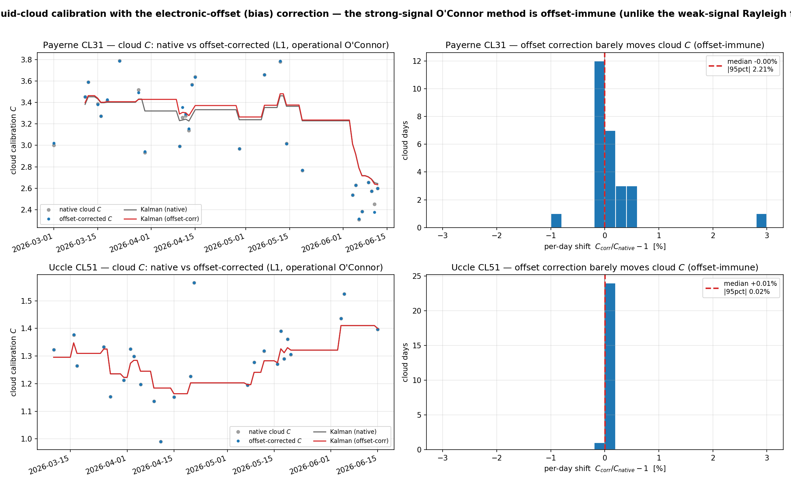
*Figure 7b — Cloud calibration with vs without the offset correction (L1, operational O'Connor). Left:
the daily and Kalman-smoothed constants overlie almost exactly. Right: per-day shift histograms centre
on 0 (CL31 median −0.00 %, CL51 +0.01 %). The strong-signal cloud method is offset-immune.*

---

## 3. Discussion — which offset matters

Significance of the offset is **not** the same as a calibration bias:
- **CL61 (material):** the offset biases the 910 nm Rayleigh fit — a demonstrated −26.5 %→−8.3 %
  recalibration shift on the curated nights (companion §1c), +15 % on the full-record paired nights,
  and it unlocks 3→10 good nights. The correction is worth applying.
- **CHM15k (real offset, but correction not warranted):** the offset is real (−5.4σ) and −18 % of the
  weak 1064 nm molecular; on the full record, removing it shifts the CHM15k Rayleigh **+10.3 %
  (paired, n=11)** and unlocks nights (§2.6) — a *consistent* effect, **not** merely within-scatter
  noise as the earlier 2-night estimate (+11.5 %) suggested. The decisive point is that this shift
  moves the CHM15k **off** its −1.5 % agreement with the CL61 cloud method and its EARLINET closure
  (intercomparison −6.3 %), so the **native CHM15k constant is retained**. Operationally the
  strong-signal cloud/Kalman path is offset-immune regardless.
- **CL31 (real offset, cloud-calibrated):** the two-resonance ringing (§2.2) cannot be Rayleigh-fit,
  but removing it from L1 rcs_0 measurably **improves the CL31↔reference correlation (r 0.51→0.64)**
  and trims the intercomparison bias (+27.0 %→+22.6 %) — the ripple was a systematic range-pattern
  decorrelating the CL31; the large residual is its own low-SNR floor.

**Take-away:** a weak-signal electronic offset is present in every ceilometer and measurably shifts
the Rayleigh fit when removed — but whether *correcting* it is right depends on whether the native
Rayleigh was biased against a trusted anchor. It was for the CL61 (correct it); it was not for the
CHM15k, whose native agrees with the cloud method (retain it); the CL31 cannot Rayleigh-fit at all. The
cloud method's strong-signal, near-range immunity is why it is the robust cross-instrument anchor.

## 4. Reproducibility
`_hood_binscatter.py` (Fig 1) · `_cl61_offset_physical_model.py` / `_chm15k_offset_physical_model.py`
/ `_cl31_offset_physical_model.py` (Figs 2–3b) · `_cl51_uccle_offset_model.py` (Fig 3c, Uccle CL51
transfer test) · `_hood_correction_profiles.py` (Fig 4) · `_cl61_fullperiod_recal.py` +
`_cl61_fullperiod_figure.py` (Fig 5, CSV of all 127 days) · `_hood_temperature_leetal.py` (Fig 6) ·
`_cloud_offsetcorr_recal.py` (cloud-cal offset-immunity, CL31 + CL51) · `_hood_offset_significance.py`
(σ) · `_chm15k_offset_verify.py` (13 % scatter check). All read the operational L1 archive; the offset
models are cached in `cl61_b_dark.npz` / `chm15k_b_dark.npz` / `cl31_b_dark.npz` / `cl51_b_dark.npz`.
