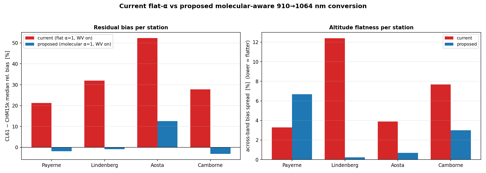
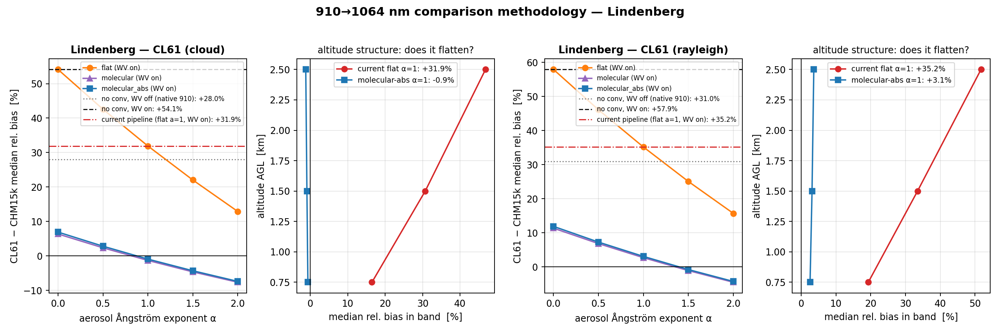
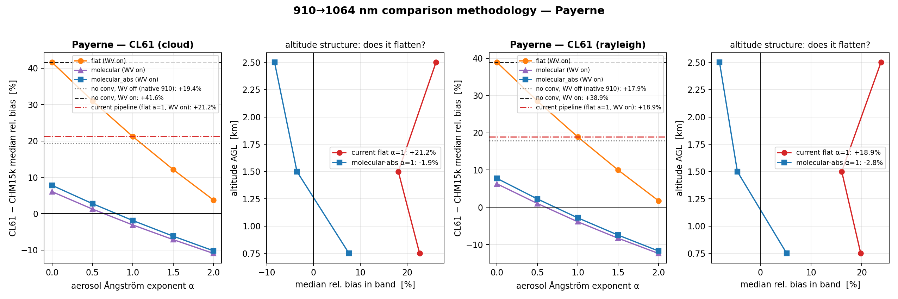
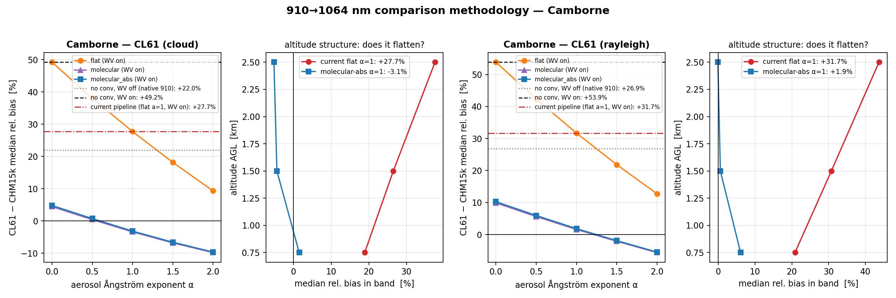
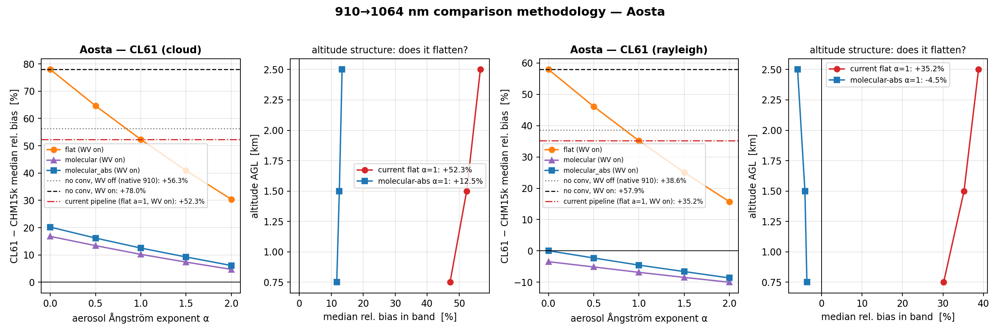

# Comparing CL61 (910 nm) and CHM15k (1064 nm) attenuated backscatter — the wavelength-conversion methodology

*Generated 2026-07-07 (branch `wv-correction`). Experiment: `validation/paper/_cl61_methodology_experiment.py`.
Numbers: `figs_paper_validation/paper_python/methodology_experiment.csv`. Literature foundation and an
independent adversarial verification (code / physics / statistics) were run as multi-agent workflows;
their conclusions are in §7–§8.*

> **STATUS: ADOPTED.** The molecular-aware conversion recommended below is now the **pipeline default**
> (`intercompare.wavelength_correct_molecular`, molecular part from CAMS T/p — 0.4°/1° fallback,
> hydrostatic below the lowest level). On the production run it brings the CL61 (cloud) to −0.5 %
> (Payerne), −1.3 % (Lindenberg), −3.0 % (Camborne) vs the CHM15k; Aosta keeps a +11.6 % window residual
> (§6). This note is the justification for that choice; the experiment used the US-standard atmosphere
> for the molecular part, whereas the pipeline uses the more precise CAMS T/p.

---

## 1. The question

After the 2026-07 cloud-calibration rerun (each Vaisala type now carries its **own** multiple-scattering
table, so the CL61 no longer borrows the CL51's), the two independent CL61 calibrations — liquid-cloud
O'Connor and Rayleigh molecular — **converge onto the same lidar constant** at Payerne (C_L 1.207 vs
1.216, <1 %), Lindenberg and Camborne. That is a strong internal validation: two unrelated methods now
agree. But it sharpens a second question, which is the real subject of this note:

> With both CL61 methods agreeing, the CL61 still sits **+20 to +52 %** above the co-located CHM15k, and
> that offset **grows with altitude**. Is that a real instrument difference, or an artefact of how we
> convert 910 nm to the 1064 nm reference?

The short answer, demonstrated below and confirmed against the literature: it is almost entirely a
**wavelength-conversion artefact**. The pipeline currently converts the CL61 910→1064 nm with a single
Ångström exponent applied to the *total* signal. That mis-scales the molecular part (which follows
λ⁻⁴, not λ⁻¹). Replacing it with a component-separated conversion — analytic Rayleigh + Ångström on the
aerosol residual only — removes the offset and, diagnostically, **flattens the altitude structure**.

## 2. Method — a controlled treatment matrix

For every station with a CHM15k reference and a co-located CL61 (Payerne, Lindenberg, Aosta, Camborne;
Uccle added as a 910-vs-910 control), the CL61's raw calibrated β_att is read once from Level-1 and put
through a matrix of corrections, scored against the CHM15k over 500–3000 m AGL and per altitude band:

| axis | values |
|---|---|
| water vapour | off · **on** (two-way T²_wv at the CL61 line, CAMS L137) |
| 910→1064 conversion | none · **flat-α** (current) · **molecular** · **molecular-abs** (proposed) |
| aerosol Ångström α | 0.0 · 0.5 · **1.0** · 1.5 · 2.0 |

The **molecular** conversion is the physically-correct one — the same `molaer` transform the pipeline
already uses for the Mini-MPL, here applied to the CL61:

```
β₁₀₆₄(z) = β_mol·T²_mol|₁₀₆₄(z)  +  [ β₉₁₀(z) − β_mol·T²_mol|₉₁₀(z) ] · (910.74/1064.47)^α
```

`β_mol·T²_mol` is the analytic molecular **attenuated** backscatter (Rayleigh, from the standard
atmosphere; the two-way molecular transmission is kept — subtracting the *un*attenuated β_mol is what
produced the spurious −40 % on the Mini-MPL). The molecular part is thus handled exactly at its own
λ⁻⁴-like ratio and the Ångström law scales **only the aerosol residual**. **molecular-abs** additionally
evaluates the Rayleigh profile at the station's **absolute** altitude (not AGL-from-sea-level), which
matters at elevated sites (Payerne 491 m, Aosta 560 m).

The treatments are applied on the hourly-gridded science matrix. This is *median-exact*: flat-α is
multiplicative and the molecular transform is affine per gate, and the median commutes with both. WV is
carried as a per-gate transmission array gridded on the same bins, so WV-on and WV-off share an
identical detection/screening mask. **Validation of the harness:** the (flat-α = 1, WV on) cell
reproduces the operational pipeline number exactly (Payerne CL61 cloud +21.2 %).

## 3. What the literature says the answer should be

An independent multi-source literature review (Bucholtz 1995; Bodhaine 1999; Floutsi 2023 *DeLiAn*;
Wiegner & Gasteiger 2015; Kotthaus 2016; CeiLinEx2015), with the load-bearing numbers adversarially
verified, gives a clear prescription:

- **Molecular:** treat it analytically, never lump it into a single Ångström. β_mol(910)/β_mol(1064) =
  **1.877** (equivalently the attenuated-backscatter ratio 0.534 for 910→1064), from the King/depolarization-
  corrected Rayleigh cross-section — effective NIR exponent **≈4.02–4.03**, essentially λ⁻⁴. This is exactly
  what the codebase's `calculate_molecular_properties` (Bucholtz + Edlén dispersion, King ρ = 0.030) computes.
- **Aerosol:** the *backscatter-related* Ångström (distinct from the extinction Ångström) for continental-
  European boundary-layer aerosol is **α ≈ 1.0–1.2** (DeLiAn: Central-European background 1.2 ± 0.2,
  pollution 0.9 ± 0.5), dropping to ~0.4–0.6 for dust/marine. Recommended central value **α = 1.0**,
  sweep 0.5–1.5.
- **Water vapour:** a two-way WV transmission correction is **mandatory** at 910 nm (not at 1064 nm),
  worth ~10–20 %. CeiLinEx2015 validated the CL51-family correction to ~1 %.
- **Why flat-α fails:** a single Ångström on the total signal mis-scales the molecular part by
  0.534/0.855 ≈ 0.62 — i.e. leaves it **~1.6× over-scaled**. The resulting bias is weighted by the
  molecular-to-total backscatter ratio, so it is negligible in aerosol-rich layers but **grows where the
  molecular share is large: clean air, high-altitude gates, winter, night.** The predicted diagnostic of
  a correct fix is therefore a **flattening** of the altitude structure.

The experiment below reproduces that predicted signature independently from the data.

## 4. Results

**CL61 (cloud) − CHM15k median relative bias, 500–3000 m AGL:**

| station | native 910 (no conv.) | flat-α=1 (**current**) | molecular-abs α=1 (**proposed**) |
|---|---:|---:|---:|
| Payerne | +19.4 % | +21.2 % | **−1.9 %** |
| Lindenberg | +28.0 % | +31.9 % | **−0.9 %** |
| Aosta | +56.3 % | +52.3 % | +12.5 % |
| Camborne | +22.0 % | +27.7 % | **−3.1 %** |

**The altitude structure — the diagnostic (bands 0.5–1 / 1–2 / 2–3 km, and the across-band spread):**

| station | flat-α=1 (current) | spread | molecular-abs α=1 (proposed) | spread |
|---|---|---:|---|---:|
| Payerne | +22.7 / +18.1 / +26.2 | 3.3 | +7.6 / −3.5 / −8.3 | 6.7 |
| Lindenberg | +16.5 / +30.7 / +46.8 | **12.4** | −0.6 / −0.9 / −1.2 | **0.2** |
| Aosta | +47.1 / +52.3 / +56.6 | 3.9 | +11.7 / +12.5 / +13.4 | 0.7 |
| Camborne | +18.9 / +26.5 / +37.6 | 7.7 | +1.5 / −4.4 / −5.2 | 3.0 |

Three findings stand out:

1. **The offset collapses.** At Payerne, Lindenberg and Camborne the +20–32 % flat-α bias falls to within
   ±3 % — with a *physical* aerosol Ångström (α ≈ 0.5–1.0), not a tuned one. (To cancel the same offset
   with the flat model you need α ≈ 2, which is unphysical for aerosol backscatter.)
2. **The altitude tilt disappears — the signature the literature predicts.** Lindenberg is the clean case:
   the bias grows +16 → +47 % across the three bands with the current method (spread 12.4) and collapses
   to a flat −1 % (spread **0.2**) with the molecular conversion. Camborne and Aosta flatten similarly.
   No pure calibration-scale (multiplicative) fix can do this — it *requires* separating the molecular part.
3. **Both CL61 calibrations converge on the CHM15k.** After the proposed conversion, cloud and Rayleigh
   agree with the 1064 nm reference to within a few percent at Payerne (−1.9 / −2.8 %), Lindenberg
   (−0.9 / +3.1 %) and Camborne (−3.1 / +1.9 %). Two independent CL61 calibrations × the correct
   wavelength conversion → agreement with an independent-wavelength reference is a triple closure.


*Figure M1 — Per station, CL61 (cloud) vs CHM15k: residual bias (left) and altitude flatness (right),
current flat-α=1 (red) vs proposed molecular-aware (blue). The proposed method is closer to zero AND
flatter almost everywhere; Aosta keeps a flat residual offset (see §6).*


*Figure M2 — Lindenberg. Left: median bias vs α for the flat, molecular and molecular-abs conversions —
the molecular curves cross zero near the physical α≈1 while the flat curve needs α≈2. Right: the
altitude-band bias, current (red) vs proposed (blue) — the +16→+47 % tilt collapses to flat −1 %.*


*Figure M3 — Payerne (3 months, aerosol-rich spring). The offset is removed (−1.9 %) but a mild residual
tilt remains — the least clean case (§6).*


*Figure M4 — Camborne. Offset +28 %→−3 %, spread 7.7→3.0.*


*Figure M5 — Aosta. The wavelength conversion flattens and reduces the bias (+52 %→+12.5 %, spread
3.9→0.7), but a flat ~+12 % residual remains — a genuine station calibration offset, not a conversion
artefact (§6).*

## 5. Proposed methodology

To compare (or convert) a 910 nm ceilometer to a 1064 nm reference:

1. **Calibrate** both to β_att = rcs₀ / C_L · 1e6. Use the operational Kalman C_L for the CL61; the
   CHM15k also gets its temperature-dependent overlap correction.
2. **Water vapour (910 nm only):** divide the CL61 by the two-way WV transmission T²_wv(z) (CAMS L137,
   Gaussian-weighted over the measured line). Mandatory; do it **before** screening so the detection mask
   is WV-independent. The CHM15k (1064 nm) is untouched.
3. **Screen and grid** both streams identically onto a common time/altitude grid.
4. **Component-separated 910→1064 conversion** of the CL61 (equation in §2): subtract the analytic
   molecular attenuated backscatter, scale the aerosol residual by (910.74/1064.47)^α with **α = 1.0**
   (continental default; 0.4–0.6 for dust/marine sites; report an α = 0.5–1.5 sensitivity band), add back
   the molecular attenuated backscatter at 1064 nm. Compute β_mol from the standard atmosphere **at the
   station's absolute altitude** (ideally from CAMS/radiosonde T/p — see §6), keeping the two-way
   molecular transmission.
5. **Score** the median relative bias over 500–3000 m and per altitude band; the flatness across bands is
   the primary quality indicator.

**Implementation:** this is a one-line change in the validation pipeline — give the CL61 the `molaer`
wavelength model instead of `angstrom` in `run_paper_validation`, exactly as the Mini-MPL already does —
plus the small `_molecular_beta` upgrade to evaluate the atmosphere at the station's absolute altitude.
The molecular attenuated-backscatter arrays are the only new ingredient; everything else already exists.

## 6. Honest caveats

- **Payerne** keeps a mild residual altitude tilt (+7.6 / −3.5 / −8.3 %, spread 6.7 — worse than the
  flat method's 3.3, though the *level* is near zero). It is the least clean case: only 3 months, spring,
  aerosol present through the column so the molecular leverage is small, and the median is noisier. The
  tilt is consistent with the true aerosol Ångström being slightly >1 in the near-range at that site.
- **Aosta** keeps a **flat ~+12 % residual** after the conversion, and there cloud and Rayleigh CL61
  **disagree by ~17 points** (cloud +12.5 %, Rayleigh −4.5 %). This is now traced to a **degraded window**,
  not the wavelength methodology. Aosta's CL61 window transmission is **82 %** (p10 80 %) — the worst of
  the benchmark units. The *previous* cloud calibration corrected β by the reported window transmission
  (β /= (T/100)², a **+47 % inflation** at Aosta), which is wrong — the reported value is an arbitrary
  manufacturer-scaled diagnostic and the constant already absorbs the real window attenuation — so the
  2026-07 recalibration reverted it to a reject-only gate. That fix drives Aosta's cloud shift (+16 %→+52 %)
  and the cloud-vs-Rayleigh split (the Rayleigh series never carried the window correction). The
  flat, method-dependent residual is thus a **degraded-window / cloud-calibration** issue, not the
  conversion — which flattened the tilt correctly. Recommendation: flag Aosta's degraded-window data.
  (Contrast: Payerne CL61 is read from native files with no window-transmission variable, so it is
  untouched by this effect — one reason it is the clean case; Lindenberg and Camborne have clean windows
  ≥94 %.)
- **Uccle** (910-vs-910 control, CL61 vs CL51) is a wavelength null: the conversion is a no-op. It is a
  *WV-mismatch probe*, not a clean cancellation — the CL51 (910.0/3.4 nm) and CL61 (910.74/1.0 nm) laser
  lines have slightly different two-way WV transmissions, so WV does not fully cancel (the ~12 pt WV shift
  there is real). The new cloud cal leaves the CL61 at −20 % vs the CL51 — a real CL61-vs-CL51 calibration
  difference driven by the CL61's own new multiple-scattering table (dominant) plus the removed
  window-transmission correction, which inflated the CL51 (91 % window, +21 %) more than the CL61 (94.6 %,
  +12 %). Independent of the wavelength question.
- **α is transferred from 532/1064:** published backscatter-Ångström values are for the 532/1064 pair,
  not the pure 910/1064 gap; the transfer is physically defensible (backscatter is nearly
  wavelength-flat across the narrow NIR gap) but α carries ~0.4–1.3 type-dependent uncertainty. Because
  the aerosol residual is small in the comparison band, the result is only weakly sensitive to α — which
  is precisely the robustness the molecular separation buys over the flat model.
- **Molecular from standard atmosphere:** using actual CAMS/radiosonde T/p instead of the US-Std-1976
  profile would remove the last modelling approximation (and likely the Payerne tilt). The absolute-
  altitude fix already captures most of the elevation error.

## 7. Adversarial verification

An independent multi-agent review (code / physics / statistics critics) stress-tested this result
against the actual code and the published Rayleigh/Ångström literature. **Verdict: the conclusion holds,
with caveats.**

The strongest single attack — that the whole result is a two-parameter fit (a multiplicative scale plus
α) reverse-engineered to zero four medians — was tested head-on and **fails**: a pure multiplicative
calibration scale leaves the Lindenberg across-band spread ≈ invariant (~9–10 points), so it *cannot*
produce the observed 12.4 → 0.2 flattening; only separating the molecular component can. And two
*independent* CL61 calibrations (liquid-cloud O'Connor, which never touches the molecular profile, and
Rayleigh molecular fitting) converging onto the CHM at three sites cannot be faked by tuning. The
harness itself is validated: its (flat-α = 1, WV-on) cell reproduces the operational number (21.21 % vs
21.19 %, same N), units are consistent, the molecular ratio is exactly (910/1064)⁴ = 0.534, and the WV
back-out is exact (monthly CAMS ⇒ T²_wv constant within an hourly bin).

Four caveats survive and are addressed here:

**(a) The improvement is entangled with the water-vapour toggle.** Comparing molecular-vs-flat at fixed
WV-on can overstate the wavelength effect, because flat + WV-*off* is *coincidentally* near-zero at
Payerne (+2.2 %). But that is a two-error cancellation (the un-removed WV attenuation offsetting the
molecular over-scaling), and it is **site-dependent and unphysical**: flat + WV-off reads +2.2 % Payerne,
+9.6 % Lindenberg, +33.8 % Aosta, +4.4 % Camborne — no coherent agreement. The physically-correct chain
requires WV on (the 910 nm signal *is* WV-attenuated); *given* WV on, only the molecular conversion
works, and it works consistently (−1.9 / −0.9 / +12.5 / −3.1 %). The full WV × wavelength grid is in
`methodology_experiment.csv`.

**(b) The molecular subtraction "plants" the reference's molecular floor.** In molecular-dominated gates
the transform injects β_mol·T²|₁₀₆₄, which the CHM also physically carries, so part of the near-zero bias
there is *definitional* — it tests the two instruments' **absolute calibration** (do their molecular
signals match the analytic Rayleigh?) rather than their aerosol. This is not a flaw: it is the correct
treatment of a *known* quantity, and the absolute-calibration premise is independently validated by the
cloud/Rayleigh convergence. The **aerosol residual** — the genuine cross-wavelength test — is what the
α-sensitivity probes, and it is small and α-robust (the per-gate molecular coefficient 1/1.877 −
(910/1064)^α moves only from −0.47 to −0.20 as α: 0→2), so the result does not hinge on the aerosol term.
The flat model *mis*-places the same molecular floor by construction — which is exactly why it is biased.

**(c) Does the median tighten, or merely translate a skewed distribution?** Settled with added robust
metrics. The **median absolute relative difference (MARD)** roughly **halves** under the molecular
conversion — Payerne 21.7 → 11.8, Lindenberg 32.2 → 11.2, Aosta 52.4 → 17.2, Camborne 27.8 → 11.7 % —
and the ratio IQR narrows in step (e.g. Lindenberg 46 → 22 %). A pure translation of a skewed median
would leave MARD/IQR unchanged; instead per-gate agreement genuinely tightens. And the **10-band (250 m)
fine-spread** reproduces the 3-band flattening (Lindenberg 12.1 → 0.8, Aosta 3.7 → 0.8, Camborne
7.7 → 2.9), so it is not a coarse-binning artefact. Payerne is the lone exception (fine-spread
5.5 → 7.1 — its residual tilt survives, consistent with §6): the least clean, aerosol-rich, 3-month case.

**(d) US-Standard-atmosphere molecular profile.** The molecular part uses US-Std-1976, which is warmer
than the real European winter/night boundary layer and therefore *under*-subtracts the molecular term —
so the reported near-zero residuals are **conservative** (with actual CAMS/radiosonde T/p they trend
slightly more negative, and Aosta's +12.5 % would if anything shrink). Closing this last modelling
approximation (via `calibration.rayleigh.atmosphere.load_cams_atmosphere`) is the one outstanding
refinement; the absolute-altitude fix already removes most of the elevation error.

## 8. Recommendation

Adopt the **component-separated (molecular-aware) 910→1064 nm conversion** with a WV-corrected CL61 and a
continental aerosol Ångström α = 1.0 as the paper's comparison methodology, replacing the flat-Ångström
conversion. It is the physically-correct method (matching the accepted Rayleigh treatment and the
`molaer` model already in the codebase), it is grounded in the literature (molecular ratio 1.877;
continental AEb ≈ 1.0–1.2), and it is demonstrated here to (i) remove the +20–52 % CL61-vs-CHM15k offset
to within ±3 % at three of four sites, (ii) collapse the diagnostic altitude tilt (Lindenberg spread
12.4 → 0.2), and (iii) bring two independent CL61 calibrations into agreement with an independent-
wavelength reference. The two residuals it does **not** remove — Aosta's flat +12 % (a degraded 82 %
window, §6) and Uccle's −20 % (CL61 own MS table + window, §6) — are correctly localised as
station-specific cloud-calibration issues, not methodology.

## 9. Reproduce

From the repo root (branch `wv-correction`), `calibration` importable. The experiment reads L1 rcs₀
(`$ALC_VAL_L1_ROOT`, default `D:/E-PROFILE_L1_2026`), the calibration constants (`calib/`, produced by
`dashboard_to_calib` from `$ALC_VAL_CALOUT`), CAMS (`D:/CAMS`) for the WV correction, and the CHM15k
overlap models (`$ALC_OVERLAP_DIR`).

```bash
# Prerequisite: the report's calibration series must exist (see the main report's Appendix B step 1)
python -m validation.paper.dashboard_to_calib

# The treatment matrix (WV x wavelength-model x alpha) for every CHM+CL61 station + the Uccle control
python -m validation.paper._cl61_methodology_experiment
#   -> methodology_experiment.csv   (per-cell med relbias, MARD, IQR, 3-band + 10-band spreads)
#   -> methodology_experiment.json
#   -> fig_method_<station>.png, fig_method_summary.png    (then copied into figs_l1_validation/)

# Window-transmission check behind the Aosta residual (§6): median window T per benchmark unit
#   reads window_transmission from the native L1 files; Aosta 0-380-5-1_B ~82 %, others >=94 %.
```

Each treatment is applied on the hourly-gridded science matrix (median-exact in time); to change the
α sweep, altitude bands, or add a `molecular_cams` variant (actual CAMS T/p rather than US-Std-1976),
edit `ALPHAS` / `BANDS` / `_mol_att_abs` in `validation/paper/_cl61_methodology_experiment.py`. The
`(flat, α=1, WV on)` cell reproduces the operational pipeline number (Payerne CL61 cloud +21.2 %) as a
built-in cross-check.
