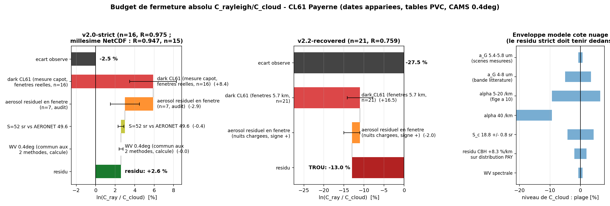
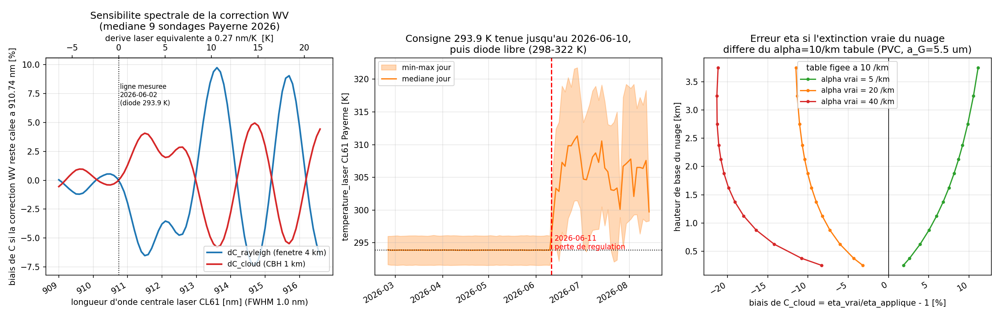
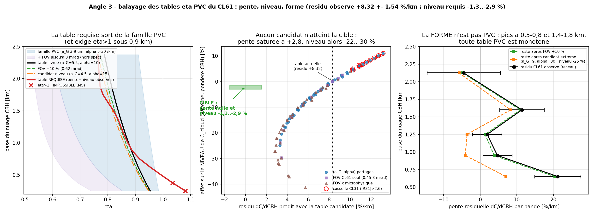

# CL61 : pourquoi les calibrations nuage et Rayleigh divergent — origine, fermeture, et quelle méthode corriger

**Date** : 2026-08-15 · **Branche** : `rayleigh-availability` · **Station pivot** : Payerne 0-20000-0-06610 C (CL61)
**Statut des chiffres** : chaque résultat ci-dessous a été soumis à une vérification adversariale indépendante
(recalcul depuis les sources primaires). Les verdicts sont indiqués : **[confirmé]** (recalculé et reproduit),
**[réfuté]** (le recalcul contredit l'énoncé — jamais présenté comme acquis), **[non vérifié]** (résultat d'analyse
cohérent mais sans contre-recalcul indépendant), **(contexte)** (chiffre hérité d'un rapport antérieur, non recalculé ici).

---

## 1. La réponse courte

L'écart nuage/Rayleigh du CL61 de Payerne n'est **pas** une erreur de paramètre optique de la méthode nuage.
Il se décompose ainsi, dans le régime **v2.0-strict** (nuits claires, fenêtres médianes 4,3 km AGL) :

| Terme | Effet sur C_ray/C_cloud | Statut |
|---|---|---|
| Écart observé (appariement ±5 j) | **0,975** (n=16, run frais) à **0,947** (n=15, millésime NetCDF 2026-07-13) | [confirmé] |
| **Dark électronique CL61** (b(z) mesuré capot, propagé dans l'estimateur embarqué, fenêtres réelles) | **−9,9 %** médian [IQR −11,9 ; −5,6] sur C_ray | [confirmé] |
| Aérosol résiduel dans la fenêtre Rayleigh | **+2,9 %** sur C_ray (n=7) | (contexte) |
| λ moléculaire 910,0 au lieu de 910,74 nm (`config.py:63`) | **−0,32 %** sur C_ray (niveau pur, pente +0,0007 %/km) | [confirmé] |
| WV (les deux séries en CAMS 0,4°) | quasi commun-mode : **±0,15 %** sur le ratio pour ±5 % de colonne | [confirmé, calcul] |
| Plancher côté nuage : S = 18,8 ± 0,8 sr | ±4,3 % sur le niveau de C_cloud | [confirmé, littérature] |
| Enveloppe côté nuage : α figé à 10 /km dans la table η | +6,5 % (α=5) à −9,4 % (α=20) sur C_cloud à CBH 1,36 km | [non vérifié, calcul PVC] |

**Bilan strict** : le dark est le terme dominant et il est du bon signe et du bon ordre. Corrigé du seul dark, le
ratio même-date passe de 0,947 à **1,074** (n=7) — le dark **inverse** le signe de l'écart plutôt que de le fermer
exactement [confirmé] ; corrigé en plus de l'aérosol en fenêtre (−2,9 %), il retombe vers ~1,03–1,04. Le résidu
final (+3 à +7 % selon le millésime) tient dans le plancher S (±4,3 %) et l'enveloppe η(α) du côté nuage : **au
niveau de précision que la méthode nuage peut revendiquer, le budget est fermé**. Aucun affinage des paramètres
optiques CL61 n'est *requis* pour réconcilier le niveau v2.0.

**Ce qui ne ferme pas** :

1. **v2.2-recovered** (0,759, n=21, fenêtres 5,67 km AGL [confirmé]) : le dark propagé vaut −17,9 % [−19,6 ; −12,7]
   sur ces fenêtres [confirmé], mais le ratio même-date corrigé ne remonte qu'à **0,864** (n=4) — il reste **≈ −14 %
   inexpliqués**, portés par le mécanisme des nuits chargées en aérosol (identique sur le CHM15k, qui n'a pas de
   pente de dark) et par la pondération estivale des nuits récupérées. Confirme l'acquis : **les nuits recovered
   sont inutilisables pour le niveau sans la route deux-passes** [non vérifié pour l'attribution, confirmé pour les ratios].
2. **Le résidu nuage +8,32 ± 1,54 %/km en CBH** : aucune table η statique ne peut le produire (§4) — c'est un terme
   spécifique CL61 hors diffusion multiple, toujours non identifié.
3. **La dérive spectrale estivale** (candidat nouveau, [non vérifié]) : la régulation thermique de la diode du CL61
   de Payerne a décroché le **2026-06-11** (consigne 293,88 K tenue jusqu'au 06-10, puis médianes 298–312 K,
   extrêmes 291–322 K ; mesuré sur les L1, 1 jour/2, fév–août 2026). Si la raie suit la température comme les
   diodes 910 nm Vaisala (~0,3 nm/K, spec CL31, Wiegner & Gasteiger 2015 — transposition **non publiée** pour le
   CL61), la correction WV figée à 910,74/1,0 nm se trompe de −4,3 à −7,2 % sur C_ray et de +3,1 à +4,7 % sur
   C_cloud (signes opposés) : jusqu'à ~12 pts sur le ratio des nuits d'été — le sens de l'écart v2.2. À traiter en
   **flag**, pas en correction, tant que la raie n'est pas re-mesurée.

---

## 2. Le tableau de fermeture absolu

### 2.1 Appariement recalculé [confirmé]

Recalcul indépendant depuis les sources primaires (`points.json` nuage PVC — identique valeur pour valeur, 67/67,
au CSV du dashboard ; `calib_raw/payerne_C_v2.{0,2}.json` ; fenêtres stockées en ASL, conversion AGL −490 m vérifiée) :

| Population | C_ray/C_cloud (médiane) | n | Fenêtre médiane (AGL) |
|---|---|---|---|
| v2.0-strict, run frais (2026-08-15) | **0,975** | 16 | 4,29 km |
| v2.0-strict, millésime NetCDF 2026-07-13 | **0,947** | 15 | 4,29 km |
| v2.2-recovered | **0,759** | 21 | 5,67 km |

Pente poolée ln(ratio) vs hauteur de fenêtre : **−12,0 %/km** (37 nuits, IC bootstrap 95 % [−16,3 ; −8,3])
[confirmé]. Nuance de la vérification : les pentes **intra**-population valent −5,8 %/km (strict) et −10,8 %/km
(recovered) — la pente poolée est partiellement gonflée par l'offset de niveau entre les deux populations.
La médiane stricte est sensible à la tolérance d'appariement (0,93 à ±0–1 j, ~1,01 à ±2–3 j, stable 0,975 dès ±5 j) ;
la recovered est stable (0,69–0,77).

### 2.2 Le terme dark, propagé proprement [confirmé, avec corrections]

Le profil b(z) capot poolé (`dark_profiles_payerne.npz`, clé `C_b_rcs`, n=5044 profils, 6 créneaux ; unités
rcs_0 = β_att, exactement ce que le pipeline soustrait en `calibration/rayleigh/calibration.py:303`) rapporté au
signal moléculaire (C_true = 1,25) vaut :

| Altitude | 2 km | 3 km | 4 km | 5 km | 6 km | 7 km |
|---|---|---|---|---|---|---|
| dark / moléculaire | −2,8 % | −5,3 % | −7,4 % | −11,5 % | −19,3 % | −26,6 % |

Propagé dans l'estimateur **embarqué** (forward model fermé à 0,011 %, fenêtres forcées = fenêtres réelles de
chaque nuit) :

- v2.0-strict (diag_v20, n=16, centre médian **4,78 km**) : biais C_ray médian **−9,9 %** [IQR −11,9 ; −5,6] ;
- recovered (diag_v22 hors v2.0, n=24, centre médian **6,05 km**) : **−17,9 %** [−19,6 ; −12,7] ;
- le dark explique **−6,2 %/km sur les −14,5 %/km** de pente du ratio entre les deux fenêtres médianes (~45 %) ;
- le +2,5/+4,2 % mesuré avant-hier sur 3 nuits est cohérent mais **sous-estime** le terme aux fenêtres médianes.

Ratios même-date corrigés du dark : strict 0,947 → **1,074** (n=7) ; recovered 0,695 → **0,864** (n=4). C_ray
corrigé médian : strict 1,249 → 1,352 ; recovered 0,957 → 1,184.

### 2.3 WV tranché [confirmé]

Les **deux** séries appariées (Rayleigh et nuage) ont été calibrées avec le CAMS 0,4° (`options.json`
`cams_folder = D:/CAMS_Monthly_04` au commit 83f451f du rerun 2026-07-13 ; `A:/CAMS_Monthly_04` pour le run frais ;
journaliers 0,4° pour juin–août). L'artefact d'orographie du 1° (point de grille à 894 m, PWV −26 %,
remplissage constant `water_vapor.py:481-486`) **n'entre pas** dans 0,947/0,788 — il ne concerne que l'archive
legacy réseau. Niveaux calculés (LUT de production, spectre 910,74/1,0 nm) : 2τ_wv = 0,24 aux fenêtres Rayleigh
(T² = 0,786) contre 0,17 au nuage (T² = 0,84) ; une erreur commune de ±5 % de colonne ne déplace le ratio que de
±0,15 % — quasi commun-mode.

### 2.4 La tension « dark négligeable vs −16 % » : TRANCHÉE, pas de contradiction

Les deux énoncés sont vrais — **ils ne normalisent pas le même b(z) par le même signal dans la même bande** :

| Énoncé | Bande | Dénominateur | Valeur |
|---|---|---|---|
| « darks CL61/CHM15k négligeables » (mémoires network-offset-models, chm-cl61-800m-wv-extrapolation ; rapport 08 §2/§3.9) | 300–1200 m (étude du tilt near-range) ; intégrale nuage 100–2400 m | signal **ambiant** (10²–10³ × le dark) | CL61 +0,1…+0,3 % ; CHM15k −0,05…−0,65 % ; 0,018 % de C_cloud |
| « −16/−17 % » (campagne re-analysée 2026-08-14) | 3–7 km (fenêtre Rayleigh) | signal **moléculaire** nocturne | CL61 −16 % (pente −5,7 %/km) ; CHM15k −17 % (pente ~0) |

Le rapport 07 §4.10 disait d'ailleurs déjà CL61 −11…−13 % (3–5 km) et CHM15k −18 % : la mesure d'avant-hier
**confirme**, elle ne contredit pas. Le seul élément réellement nouveau depuis 2026-07 : le rapport 07 laissait la
constante CHM15k « debout » ; l'audit dark_aeronet_sonde établit maintenant le piédestal à −5,4σ et recommande la
correction de **niveau** (−17,2 % sur C à fenêtre 4,5 km). Pour le biais de **calibration**, c'est la version
fenêtre-Rayleigh qui s'applique :

- **CL61** : niveau **et** pente (monotone −5,4 % → −25 % de 3 à 7 km ⇒ −6,1 %/km au modèle direct, ~2/3 de son
  gradient intra-nuit) ;
- **CHM15k** : niveau **seul** (forme en cuvette suivant β_mol·T² ⇒ pente ~0, vérifié sur 24 vraies nuits :
  −0,99 ± 0,22 %/km) — la soustraire en « offset plat » fabriquerait un faux +10 %/km ;
- **CL31** : le seul gros en proche portée (−14…−60 %, `cl31_b_dark.npz`), sans objet au premier ordre pour sa
  calibration nuage.

---

## 3. Les paramètres optiques : code vs spec vs littérature

Inventaire vérifié ligne à ligne et recalculé indépendamment [confirmé] :

| Paramètre | Code | Valeur | Source / littérature | Verdict |
|---|---|---|---|---|
| S nuage (rapport lidar intégré) | `calibration/cloud/_filters.py:17` | 18,8 sr | O'Connor et al. 2004 : 18,8 ± 0,8 sr à 905 nm, « essentially constant for **mean droplet size** 10–50 µm » (re-fetché via Hopkin 2019) | conforme ; plancher ±4,3 % sur le niveau |
| Fenêtre d'intégration / CBH / attenuation_factor | `calibration/cloud/calibration.py:126-144` | 100–2400 m / 500–2400 m / 20 | O'Connor 2004, Hopkin 2019 | conforme |
| Tables η | `_filters.py` `_ETA_CL61` etc. | PVC Hogan 2006, a_G=5,5 µm, **α=10 /km figé**, λ=910,55 nm | régénérées bit-près : écarts +3,5e-6/+1,4e-6/−0,9e-6 aux 3 CBH testées (0,95368/0,86462/0,78742 à 0,25/1,125/2,375 km) | conforme à sa spec ; **α figé = l'enveloppe dominante** (§4) |
| FOV récepteur ρ_t | tables η | 0,56 mrad (demi-angle) | User Guide M212475EN ; identique CL51 (Wiegner 2014) ; cohérent Le & O'Connor 2026 et δ in-cloud ≈ 0,11 | conforme, **mais** : si le « ±0,56 mrad » Vaisala était un angle *plein* (vrai demi-angle 0,28), C_cloud serait biaisé **+4,9 % haut** à CBH 1,1 km — pile la taille et le signe de l'écart v2.0. Coïncidence probable ; **un e-mail Vaisala coûte peu** [non vérifié] |
| Divergence laser | tables η | 0,28 mrad | Le & O'Connor 2026 Tab. 1 (codée, cohérente avec la régénération ; papier non re-consulté) | conforme ; effet <0,25 %/km |
| **λ référence moléculaire Rayleigh** | `calibration/config.py:63` via `rayleigh/calibration.py:718` | **910,0 nm** | raie réelle **910,74 ± 0,10 nm** (Qmini Payerne 2026-06-02, rapport 03 §2.5) ; nominal constructeur 910,55 | **À CORRIGER** : β_mol(910,0)/β_mol(910,74) = 1,00328 (formule Bucholtz/Edlén du code, exposant effectif 4,03) ⇒ C_ray biaisé **−0,32 %** net (β + T²_mol, bande 2–6 km), niveau pur ; +0,24 % si 910,55 (cas réseau) [confirmé] |
| Spectre laser correction WV | `water_vapor.py:32` (+ défauts nuage identiques) | CL61 (910,74, FWHM 1,0) ; CL31 (909,70, 6,0) ; CL51 (910,0, 3,4) | Qmini 2026-06-02 | conforme **au 2026-06-10** ; voir la dérive thermique ci-dessous |
| LUT WV | `abs_cross_wv_910nm.nc` | HITRAN 903,004–917,998 nm, 1809 λ × 1000 niveaux | — | conforme |
| Rayleigh : LR aérosol / dépol / atmosphère | config | 52 sr / King 0,0301 / Bucholtz 1995, US-Std | AERONET Payerne : S médian 49,6 sr, moyenne 52,5 (n=1425) ; US-Std <0,3 % vs CAMS (contexte) | conforme |

### 3.1 Ce qui doit changer

1. **λ_mol CL61 : 910,0 → 910,74 nm** (`calibration/config.py:63`) — corrige un biais réel de −0,32 % (niveau pur,
   pente résiduelle +0,0007 %/km, négligeable). Pour le réseau (raies non mesurées unité par unité), 910,55 nm
   (constructeur) est le choix défendable : +0,24 %. Ratio Payerne apparié : 0,947 → ~0,950. [confirmé]
2. **La raie n'est pas fixe** [non vérifié — candidat majeur] : `temperature_laser` du CL61 Payerne montre la perte
   de régulation le **2026-06-11**. La raie étroite (FWHM 1,0 nm) rend le CL61 ~7 %/nm localement sur la correction
   WV (−0,57 % à +0,1 nm, −2,4 % à +0,3 nm) contre ~0,8 %/nm pour le CL31 (FWHM 6,0 auto-moyennante). Propagé dans
   la LUT (9 sondages Payerne, médiane) : C_ray −4,3 % à +0,5 nm et −7,2 % à +3,9 nm (équivalent de la médiane
   estivale +13 K si 0,3 nm/K), C_cloud +3,1 à +4,7 % en sens opposé. Le différentiel *statique* CL31-vs-CL61 des
   raies mesurées est d'ailleurs reproduit ici à +0,69 %/km, contre +0,79 %/km [0,67 ; 0,88] mesuré — la dérive est
   un terme **additionnel**, variable dans le temps, absent de toute la chaîne. Le coefficient nm/K du CL61 n'est
   **pas publié** (transposition de la spec CL31) : action = re-mesure Qmini + flag, pas correction aveugle.

---

## 4. Les tables η : aucun jeu statique ne marche — démonstration

Balayage complet de la machinerie PVC de référence (`validation/multiple_scattering_eta.py`, non modifiée ; la
table livrée `_ETA_CL61` s'y reproduit à rms 0,000 %) : 50 combos a_G 3–9 µm × α 5–30 /km × 3 types, 11 FOV
0,45–3,0 mrad, 4 divergences, extension α jusqu'à 80 /km. [confirmé]

1. **La pente sature en dessous du requis.** Annuler le résidu +8,32 %/km exige une pente de table appliquée de
   **−16,70 %/km** (le mapping erreur-de-table → dC/dCBH a été vérifié à travers le pipeline livré : facteur de
   transfert **0,97–1,07:1**, donc le mapping naïf est le bon ; l'affirmation antérieure d'un facteur d'atténuation
   0,65–0,80 rendant l'exigence « encore plus sévère » a été **réfutée** par le recalcul — le pipeline ne dilue
   pas l'erreur, le centroïde pondéré par β n'est que ~30 m au-dessus de la base). Or la famille PVC entière sature
   à **−13,90 %/km**, atteinte seulement à ρ_t=1,7 mrad (3× la spec), a_G=3 µm, α=30 /km — et c'est une vraie
   crête physique (α=40–80 et ρ_t=2–3 mrad redescendent). Pentes des tables livrées : CL31 −9,7/−10,1, CL51 −8,4/−8,6,
   CL61 **−8,38 %/km** (selon grille). Le meilleur résidu atteignable est +2,80 %/km, au prix d'un niveau de
   C_cloud à **−24 %** — inacceptable.
2. **La forme est l'argument décisif** [non vérifié] : les pentes requises par bande de CBH
   (−21,2 / −4,7 / −1,9 / −11,4 / **+4,5** %/km pour 0,5–0,8 / 0,8–1,1 / 1,1–1,4 / 1,4–1,8 / 1,8–2,45 km) sont
   non-monotones avec inversion de signe, alors que toute table PVC est monotone. Pire : la table requise, ancrée
   au niveau, exige **η > 1 sous ~0,9 km** (1,08 à 0,25 km) — physiquement impossible pour une correction de
   diffusion multiple (η ≤ 1 par construction). Le résidu bas-CBH n'est pas de la diffusion multiple statique.
3. **Contrainte croisée CL31/CL51** [non vérifié] : tout réglage de microphysique partagée qui aide la pente CL61
   casse le CL31 en **niveau** (a_G=9, α=30 : CL31 à −25,9 %, ruinerait l'accord β-vs-CHM15k) bien avant de l'aider ;
   CL51 et CL61 partagent le FOV 0,56 mrad et ne diffèrent que par la divergence (<0,25 %/km) — aucun jeu ne peut
   séparer leurs résidus de 4,2 %/km. L'ordre des résidus (+0,85/+4,11/+8,32 %/km) reste anti-ordonné avec les
   pentes de tables (−10,1/−8,6/−8,4) : le porteur est un terme **spécifique de type**, pas η.
4. **La table actuelle est la bonne table statique** [non vérifié] : le proxy L1 de profondeur de pénétration
   (α ≈ 3/d_pén) mesure **9,6–9,9 /km** sur les scènes de Payerne à CBH > 0,8 km (n=46 812) — le gel à 10 /km est
   correct en moyenne. La bande 0,5–0,8 km mesure 8,0 /km (n=3825, IQR de pénétration 293–792 m).
5. **Ce qu'une table dynamique η(CBH, α_scène) peut payer — et pas plus** [non vérifié] : l'erreur d'un α gelé vaut
   +3,9 % (α=5) à −18,2 % (α=30) sur C à 1,1 km ; le déficit d'α aux basses CBH crée un dC/dCBH positif du bon
   signe, ~+5–10 %/km dans la bande basse (une partie des +21,2 ± 6,3 observés). Mais elle ne peut produire ni la
   bosse +11,4 %/km à 1,4–1,8 km (α proxy plat à 9,8 là), ni la pente moyenne +8,3 %/km. **Point non tranché,
   à dire franchement** : le signe de l'exposant de densité prédit n'est pas réconcilié entre les deux analyses —
   la propagation directe « η figé, scène plus dense ⇒ η_vrai < η_appliqué ⇒ C plus bas » donne d ln C/d ln α
   **négatif** (−0,10/−0,14), alors que l'observation donne **+0,165 (CL61) / +0,375 (CL31)** ; l'argument « la
   dynamique explique ~75 % de l'exposant CL61 » repose sur la magnitude |0,124| et une convention de signe qui
   n'a pas été alignée entre les deux calculs. Tant que ce n'est pas résolu (le proxy intensité anti-corrèle-t-il
   avec α ?), le mécanisme η-α ne peut pas être crédité de l'exposant de densité observé.

**Conclusion η** : garder `_ETA_CL61` telle quelle. La route B1 (table 2-D η(CBH, α) avec α par profil via
l'invariant S/η, génération triviale ~0,02 s/point) reste le bon **test**, avec pour attendu α<10 /km aux basses
CBH — mais elle ne fermera pas le +8,3 %/km, qui après WV across-night (−1,46 %/km) et WV spectrale (+0,79 %/km)
(contexte) reste un terme spécifique CL61 **hors diffusion multiple**, non identifié à ce jour.

---

## 5. Laquelle des deux méthodes corriger, et comment

**Verdict : les deux, mais pas symétriquement.** Pour le **niveau**, c'est la méthode **Rayleigh** qui porte le
biais (dark électronique) — la méthode nuage reste l'ancrage absolu et ses paramètres optiques n'ont **pas besoin
d'affinage**. Pour la **pente en CBH** de la méthode nuage, aucun réglage η n'est possible ni justifié : le résidu
CL61 est un terme d'instrument encore non identifié, à traiter par les actions de chaîne (A5, A2/A3) et le contrôle
spectral. Le régime v2.2-recovered reste hors-jeu pour le niveau.

### Actions, avec fichier:ligne

| # | Action | Où | Effet | Nature |
|---|---|---|---|---|
| R1 | **Soustraire le b(z) mesuré du CL61** (dark capot, `dark_profiles_payerne.npz` clé `C_b_rcs`) avant le fit Rayleigh | point de soustraction existant `calibration/rayleigh/calibration.py:303` | +2,5 à +4,2 % (3 nuits basses) à ~+10 % (fenêtres médianes strictes) sur C_ray ; retire aussi ~−6 %/km de pente intra-nuit | **corrige un biais réel** [confirmé] ; surveiller le léger surtir (ratio corrigé 1,07 avant terme aérosol) |
| R2 | **λ_mol CL61 910,0 → 910,74 nm** (Payerne) / 910,55 (réseau) | `calibration/config.py:63` (consommé par `rayleigh/calibration.py:718`) | +0,32 % / +0,24 % sur C_ray, niveau pur | **corrige un biais réel** [confirmé] |
| R3 | **Flaguer les nuits CL61 Payerne post-2026-06-11** (régulation laser perdue) tant que la raie n'est pas re-mesurée (Qmini) | flag qualité dans la chaîne Rayleigh + nuage | évite −4 à −7 % (ray) / +3 à +5 % (nuage) potentiels non corrigés | **change seulement le diagnostic** (le terme n'est pas encore quantifiable par unité) [non vérifié] |
| R4 | **CHM15k : correction de NIVEAU seulement** (piédestal −17,2 % à fenêtre 4,5 km), jamais en pente | chaîne Rayleigh CHM15k (action A4 de l'audit dark) | referme le piédestal −5,4σ ; une soustraction « offset plat » en pente fabriquerait un faux +10 %/km | **corrige un biais réel** (contexte, audit dark) |
| C1 | **Garder `_ETA_CL61`** (a_G=5,5 µm, α=10 /km) — confirmée comme bonne table statique, α proxy 9,6–9,9 /km | `calibration/cloud/_filters.py` | — | aucun changement |
| C2 | Retirer β_mol de B_aerosol | intégrande nuage, `calibration/cloud/calibration.py` (action A5, contexte) | +1,3 %/km corrigible du résidu | **corrige un biais réel** (contexte) |
| C3 | WV 0,4° partout + **extrapolation n_wv** sous le plus bas niveau modèle (au lieu du remplissage constant) | `calibration/water_vapor_correction/water_vapor.py:481-486` | corrige le −1,46 ± 0,48 %/km across-night (archive legacy 1° seulement — n'affecte pas les runs 0,4° actuels) | **corrige un biais réel** de l'archive ; sur les runs 0,4°, change surtout le diagnostic |
| C4 | Table dynamique η(CBH, α_scène) via le proxy de pénétration (route B1) | génération `validation/multiple_scattering_eta.py`, application `_filters.py` | attendu : quelques %/km dans la bande CBH 0,5–0,8 km ; ne fermera pas le +8,3 %/km | **test/diagnostic** d'abord (signe de l'exposant non réconcilié, §4.5) |
| C5 | E-mail Vaisala : confirmer que 0,56 mrad est bien un **demi**-angle | — | si plein angle : C_cloud biaisé +4,9 % haut — sinon aucun changement | **lève une ambiguïté** à coût nul [non vérifié] |

**Budget final v2.0-strict après R1+R2** : l'écart −5,3 % (millésime) ≈ dark (−9,9 %, médiane fenêtres réelles)
partiellement compensé par l'aérosol en fenêtre (+2,9 %, contexte) + λ_mol (−0,32 %) ; le ratio corrigé retombe à
1,03–1,07, résidu de signe opposé couvert par le plancher S (±4,3 %) et l'enveloppe η(α). Le −21 à −24 % de v2.2
n'est **pas** optique : ~−18 % de dark aux fenêtres hautes + ~−14 % restants portés par l'aérosol des nuits
récupérées et le candidat dérive spectrale estivale.

**Phase 2 (une ligne)** : valider sur le **CHM15k** (Rayleigh seul — jamais de calibration nuage, il sature en
nuage liquide) que la correction de niveau du dark (R4) referme le piédestal contre la série nuage CL61/CL31 et
réduit la dispersion réseau, dès que les runs `diag_v22_04`/`diag_v22_dark` en cours seront complets.

---

### Traçabilité

- Vérifications adversariales : appariement, terme dark, inventaire optique, λ_mol, balayage η (a) **confirmés
  avec corrections chiffrées** (intégrées ci-dessus) ; le « facteur d'atténuation 0,65–0,80 » du mapping η
  **réfuté** (mapping réel ~1:1) et retiré de l'argumentaire — la conclusion « aucune table statique » tient sans lui.
- Scripts : scratchpad `budget_dark_term.py`, `budget_eta_scan.py`, `budget_wv_levels.py`, `eta_sweep.py`,
  `eta_analyze.py`, `eta_verify_dynamic.py`, `verify_eta_mapping_claim.py`.
- Rapports amont : `doc/reports/dark_aeronet_sonde_audit.md`, `altitude_forward_model_study.md`,
  `altitude_independence_audit.md`, `07_cl61_calibration.md`, `08_overlap_nearrange_offset.md`,
  `multiple_scattering_check.md`, `03_*` (Qmini).
- Données : `dark_profiles_payerne.npz` (C:/DATA/Projects/202606_E-PROFILE_calibration/rayleigh_availability/),
  `points.json` / `payerne_C_v2.{0,2}.json` (inter-comparison_dashboard), L1 `D:/E-PROFILE_L1_2026/0-20000-0-06610/`,
  CAMS 0,4° `A:/CAMS_Monthly_04;D:/CAMS_daily`, sondages `D:/Soundings/sounding_pay_2026.csv`.
