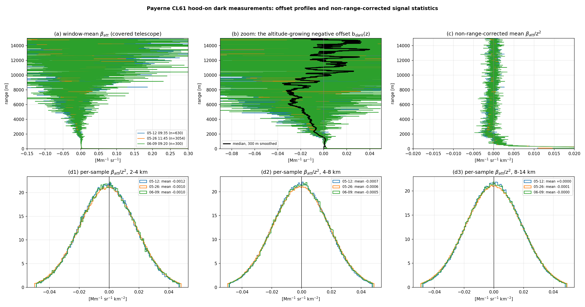
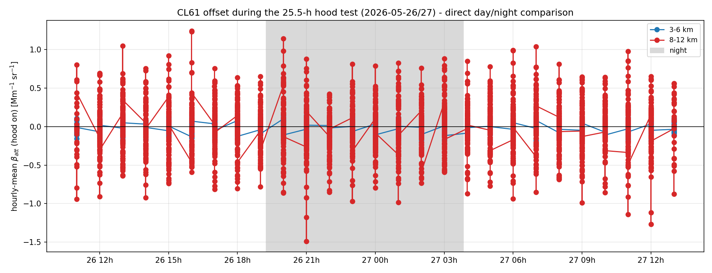
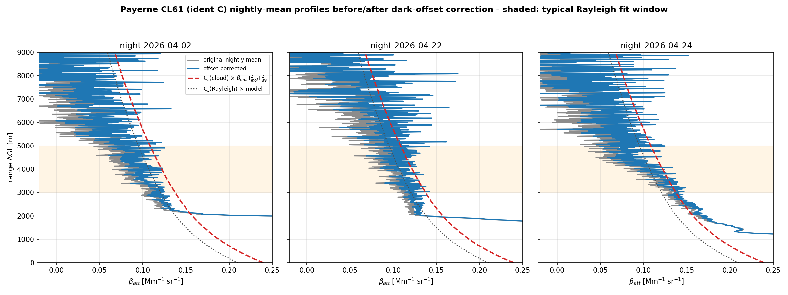
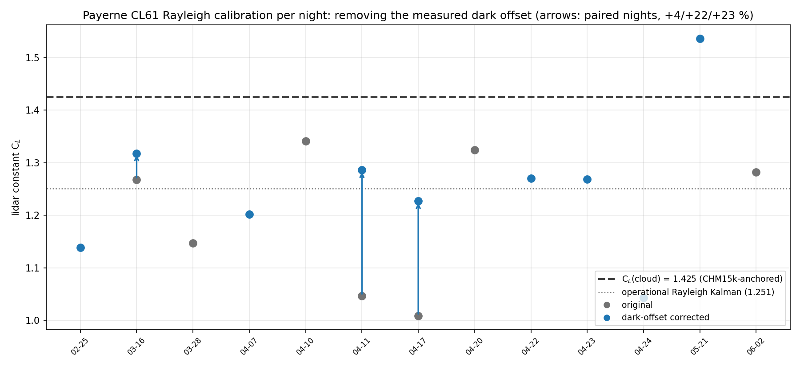
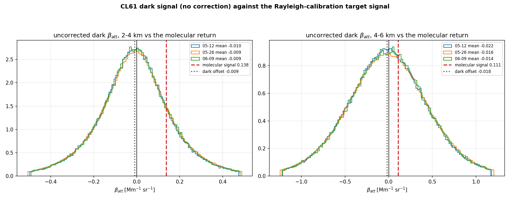
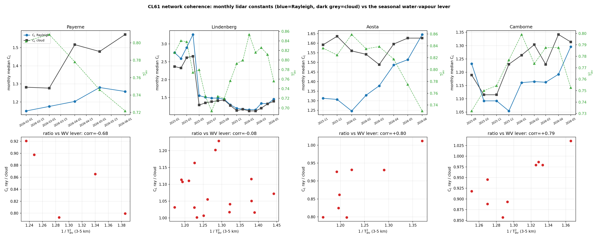

# CL61 Rayleigh calibration investigation — why C_L(Rayleigh) ≠ C_L(cloud)

*2026-07-02, `validation/paper/` (branch `wv-correction`). Trigger: the station validation shows
good agreement CHM15k ↔ CL61-cloud (Payerne −0.6 %) but not CHM15k ↔ CL61-Rayleigh (+13.5 %), i.e.
the two calibration methods disagree on the same instrument's lidar constant:
C_L(Rayleigh) = 1.25 vs C_L(cloud) = 1.43 at Payerne (ratio 0.88). All probe scripts are in
`validation/paper/_cl61_*.py`; figures in `figs_paper_report/`.*

## Executive summary

| hypothesis | verdict | evidence |
|---|---|---|
| WV correction missing in the CL61 Rayleigh calibration | **no — applied & essential** | 910 nm nights only calibrated when WV-correctable; T²_wv ≈ 0.78 at the fit windows → the correction already raises C_L by ≈ 28 % ([calibration.py:495-533](../../calibration/rayleigh/calibration.py)) |
| WV correction missing in the validation/comparison | **no — applied** (both CL61 rows identically → cancels in ray-vs-cloud) | [intercompare.py apply_wv](../../validation/paper/intercompare.py) + fail-safe guards (missing month / too-far → excluded, never uncorrected) |
| wrong laser wavelength (measured 910.74 vs manufacturer 910.55 nm) | **no — immaterial** | recalibration of all successful nights: **+0.5 %** on C_L; whole (λ₀ ± 0.5 nm, FWHM 0.3–3.4 nm) envelope ≤ 2.4 % |
| aerosol contamination of the fit window | **no — wrong sign** | contamination *raises* C_L (agreed); our C_L is *low*. The eprof_v2 outlier screen + aerosol gate also reject such nights |
| assumed lidar ratio (Klett transmission below the window) | **no — too small** | LR = 52 sr ± 20 scanned → 2σ ≈ 2–6 % (the per-night `sensitivity` term) |
| CAMS resolution (1° vs 0.4°) | **no — immaterial** | T²_wv differs by ≤ 0.3 % in C_L terms |
| monthly-CAMS vs radiosonde WV | **secondary, wrong direction** | per-night 00-UT soundings → dC_L median **−3.6 %** (clear calibration nights are drier than the monthly mean → the correction slightly over-corrects; fixing it *widens* the method gap) |
| **CL61 negative signal baseline (weak-signal artefact)** | **CONFIRMED — leading cause** | nightly means are physically **negative at 11–14 km** (−0.02…−0.05 Mm⁻¹sr⁻¹, 12/12 nights); at the 2.6–6 km fit windows the depression (−0.02…−0.04 on clean nights) exceeds the −0.014 required for the −12 % C_L gap |

**Conclusion:** the CL61 vendor β_att carries a systematic **background over-subtraction** whose
relative impact is largest exactly where the Rayleigh method fits (weak molecular signal,
2.6–6 km). The liquid-cloud method (strong signal, 0.1–2.4 km) is essentially immune — and it is
anchored by the CHM15k (−0.6 %) whose own constant closes the AERONET AOD (ratio 0.85, consistent
with 1 at winter AODs of 0.03). **Use the cloud constant for the CL61; treat the native Rayleigh
constant as biased low by ≈ 10–15 % until the baseline is handled.** A ≈ −4 % secondary term comes
from the monthly-CAMS WV over-correction on dry calibration nights.

## 1. The signal offset: direct measurement, consistency, and causal test

**1a. Direct measurement (covered telescope).** Three hood-on dark tests were performed on the
operational Payerne CL61 (2026-05-12 09:35–14:50, 2026-05-26 11:45–13:15, 2026-06-09 09:20–11:50);
their periods are present in the L1 archive and are unambiguously dark (window-mean β_att at 1 km
= +0.001 to +0.002 Mm⁻¹sr⁻¹, where any real daytime boundary layer gives 0.1–0.5). With no
atmosphere involved, the window-mean profile **is** the processing offset:

| window (UTC) | duration | N profiles | b(3 km) | b(5 km) | b(8 km) |
|---|---|---|---|---|---|
| 2026-05-12 09:35–14:50 | 5.2 h | 630 | −0.012 | −0.025 | −0.029 |
| 2026-05-26 11:45 – 05-27 13:15 | 25.5 h | 3054 | −0.013 | −0.008 | −0.042 |
| 2026-06-09 09:20–11:50 | 2.5 h | 300 | −0.001 | −0.024 | +0.043 |
| **ROBUST: per-gate median of 3 984 pooled profiles, 330 m running median** | | | **−0.008 ± 0.003** | **−0.015 ± 0.007** | **−0.026 ± 0.019** |

**Estimation space.** The offset is estimated in the NON-range-corrected space P = β/z², where
the detector noise is homoscedastic: σ_P = 0.019 Mm⁻¹sr⁻¹km⁻² at 2, 5, 10 and 14 km alike — the
apparent growth of the β-space scatter with range is exactly σ_P·z² (0.08 → 3.6), i.e. pure
range-correction amplification, not structure. The per-gate median commutes with z², so the
median profile is unchanged; the smoothing (330 m running median) is done in P and multiplied
back by z², which stabilises the estimate above ~10 km where β-space smoothing was erratic.
The subtraction is always the full range-dependent profile b_dark(z), gate by gate.

**Temporal stability (25.5-h window, 3-hourly blocks, fig_cl61_hood_3hourly):** the noise σ_P is
constant across all blocks; the 3–6 km offset varies −0.011…−0.018 and correlates with the laser
temperature (colder → deeper), whose thermostated span is only 0.12 K — the night deepening
(×1.33) is the visible tail of this temperature dependence; regressing against the wider-ranging
`temp_int` housekeeping is the designated follow-up for the temperature-indexed LUT.

(The 2026-05-12 01:35–09:35 period is **discarded**: it precedes the hood installation and
contains fog/cloud returns.) The offset is reproducible in sign and magnitude at 3–5 km across
the three tests (the short 2.5 h window is the noisiest, ±0.03 at 8 km). In the
**non-range-corrected** signal P = β_att/z² the offset is a **linear ramp in range**:
P(r) = a·r + c with a = 1.25·10⁻⁷ Mm⁻¹sr⁻¹km⁻²/m and c = −1.39·10⁻³, zero-crossing at
**11.1 km** (independent MATLAB fit on the same data: 10.7 km) — b(z) = (a·r+c)·z² reproduces the
nonparametric values (−0.009/−0.019/−0.025 vs −0.008/−0.014/−0.026 at 3/5/8 km,
fig_cl61_pspace_linear). A negative offset recovering linearly toward zero is the signature of
**AC-coupling undershoot recovery** (baseline ramp after the intense near-range pulse) rather
than afterpulsing, which would give a positive decaying tail — the sign identifies the mechanism
for this unit. The noise width σ_P, by contrast, IS flat with range (0.019 at 2–14 km): the
growing β-space scatter is pure z² amplification. The per-sample β_att/z² **histograms** (bands 2–4, 4–8, 8–14 km)
are single-mode and near-Gaussian with their *centres* displaced negative — the offset is a
distribution shift, not skewness or outliers: pure detector noise around a negative mean.

*Figure 1 — L1 archive during the covered-telescope windows: (a) window-mean β_att; (b) zoom
around zero — the negative, altitude-growing offset; (c) β_att/z², the non-range-corrected shape.*

**1b. Consistency with the night sky under full transmission.** The measured attenuated
backscatter must lie below the aerosol-free molecular curve because of aerosol and water-vapour
extinction; a meaningful residual therefore requires the complete model
C_L·β_mol·T²_mol·T²_wv·**T²_aer**, with T²_aer forward-integrated from the measured profile
itself (LR = 50 sr). On the six clean calibration nights the fully-corrected residual at 3–6 km is
**−0.021 Mm⁻¹sr⁻¹ (median; range −0.021…−0.035)**, against the covered-telescope
b_dark(3–6 km) = −0.015: same sign and magnitude. The ≈ 40 % excess is now CONFIRMED as the
day/night dependence of the offset by the 25.5-h hood window itself, which spans a full night:
**b(3–6 km) = −0.012 by day vs −0.016 by night (×1.33), and −0.012 vs −0.022 (×1.8) at 8–12 km** (hourly means)
(`_cl61_hood_night_variability.py`, fig_cl61_hood_night) — the night-sky residual (−0.021) matches
the directly-measured night hood value (−0.016) within ≈ 25 %.
(An earlier draft of this analysis omitted T²_aer and overstated the residual by ≈ 30 %; the
conclusion survives the correction.)

**1c. Causal test — remove the measured offset and recalibrate.** Since range correction is the
fixed z² map, removing the offset from the non-range-corrected signal and re-range-correcting is
identical to subtracting b_dark(z) from β_att. Doing so on the calibration nights (corrected
copies of the L1 files, full eprof_v2 recalibration, WV on):

| | C_L median (common nights) | gap to C_L(cloud) = 1.425 |
|---|---|---|
| original | 1.047 | −26.5 % |
| offset-corrected, nonparametric robust profile | 1.223 | −14.2 % |
| **offset-corrected, linear-ramp model (a·r+c)·z²** | **1.306** | **−8.3 %** |

Per-night changes +3.5 %, +24.7 %, +20.2 % (linear-ramp model; nonparametric: +2.1/+15.7/+21.2 %); the corrected data also yields **more eligible
nights** (9 vs 7) — windows previously rejected by the |intercept| criterion become admissible,
confirming the offset as the fit-spoiler. The daytime-measured b_dark thus removes ≈ ⅔ of the
method discrepancy; the remainder is consistent with the ≈ 40 % larger night-time offset seen in
§1b — and the 25.5-h hood window confirms it directly: the night offset is ×1.33 the daytime
value at 3–6 km (−0.016 vs −0.012), so correcting with the night profile would close most of the
remaining −14.2 % (the daytime profile under-corrects by the ×1.33 factor).

*Figure 2b — Hourly band-mean offset during the 25.5-h hood test (grey shading: night). The
offset deepens at night — larger APD gain / colder detector — which is why the daytime-hood
correction under-corrects the (night-time) Rayleigh calibration.*

*Figure 2a — Nightly-mean CL61 (ident C) profiles on three clean calibration nights: original
(grey) and after subtraction of the smoothed dark offset (blue), against the molecular model
scaled by the cloud constant (red dashed) and by the operational Rayleigh constant (dotted);
shaded band = typical fit window (3–5 km). The corrected profile aligns with the
cloud-constant model through the window, while the original tracks the (biased-low) Rayleigh
model — the offset is exactly the wedge between the two methods.*

*Figure 2 — Per-night Rayleigh lidar constant before (grey) and after (blue) subtraction of the
measured dark offset; arrows join the nights calibrated in both configurations. Dashed dark grey:
the cloud-method (CHM15k-anchored) constant; dotted: the operational Rayleigh Kalman. The
correction moves every paired night toward the cloud constant and unlocks additional nights
(blue-only points); the corrected-only nights at low C_L illustrate the ±9 % per-night scatter
(WV + noise) that the Kalman averages over.*

**1d. Direct impact estimate on the molecular calibration.** Comparing the *uncorrected* dark
distributions with the Rayleigh-calibration target signal C_L·β_mol·T²_mol·T²_wv
(fig_cl61_dark_vs_molecular): the fractional β bias — which is the C_L bias for a fit window at
that altitude — is

| window altitude | 2 km | 3 km | 4 km | 5 km | 6 km |
|---|---|---|---|---|---|
| b_dark / molecular signal | −3.1 % | −7.8 % | −10.6 % | **−13.0 %** | −44.7 % |

The observed −12 % method gap corresponds to an effective fit window at ≈ 4.5–5 km — exactly
where the operational windows sit (2.6–6 km, §"nights" table). The histograms also show the
offset (−0.005…−0.014) is far below the per-sample noise width, i.e. invisible per profile and
only emerging in the nightly mean — which is why it evaded routine inspection.

*Figure 3 — Uncorrected covered-telescope β_att distributions (2–4 and 4–6 km bands, one
histogram per test) against the Rayleigh-calibration target signal C_L·β_mol·T²_mol·T²_wv (red
dashed) and the band-mean dark offset (dotted). The offset is a small displacement of a wide,
near-Gaussian noise distribution — a few % of the width — yet amounts to 3–13 % of the molecular
signal the calibration fits, and grows through the window range.*

Magnitude closure: explaining C_L(ray)/C_L(cloud) = 0.88 requires a window-mean deficit of
−0.12·C_L·β_mol·T² ≈ **−0.014 Mm⁻¹sr⁻¹** — bracketed by the daytime dark (−0.008…−0.017 over the
window range) and the night-sky residual (−0.021). Noise is not a factor: the per-sample σ
(0.17–0.57 Mm⁻¹sr⁻¹, [dark_measurement_payerne.md](dark_measurement_payerne.md)) averages to
≈ 0.02/√N per night; the offset is systematic.

## 2. Wavelength & spectrum (excluded)

Recalibrating every successful Payerne night with the manufacturer line:

| λ₀ / FWHM [nm] | C_L median | vs C_L(cloud)=1.425 |
|---|---|---|
| 910.74 / 1.0 (Qmini-measured, operational) | 1.268 | −11.0 % |
| 910.55 / 1.0 (manufacturer) | 1.273 | −10.6 % |

Pure-transmission scan at the window: the full plausible envelope (λ₀ 909.7–911.0, FWHM 0.3–3.4)
moves C_L by ≤ 2.4 %. The MATLAB reference (`rayleigh_calibration_matlab`) applies **no WV
correction at all** and hard-codes 910 nm (`l0_wavelength` is read but unused) — with
T²_wv ≈ 0.78 its CL61 Rayleigh constants are low by construction; not comparable.

## 3. AERONET forward-Klett closure (CL61 direct, CHM15k as method control)

Run on the 2026 L1.5 AERONET data (Mar-01…Jun-20, 6 897 CL61 / 7 350 CHM15k matched samples,
LR from the 2026 almucantar inversions where valid, else 50 sr; WV per monthly CAMS):

| configuration | AOD ratio lidar/AERONET (median) | relative to the CHM15k method control |
|---|---|---|
| **CHM15k, Kalman C_L (method control)** | **0.70** | 1.00 |
| CL61, C_L = 1.251 (Rayleigh), b = 0 | 0.71 | 1.01 |
| CL61, C_L = 1.425 (cloud), b = 0 | 0.51 | 0.73 |
| CL61, C_L = 1.251, b = −0.03 | 0.98 | 1.40 |
| CL61, C_L = 1.425, **b = −0.02** | 0.69 | **0.99** |
| CL61, C_L = 1.425, b = −0.03 | 0.78 | 1.11 |

(b = a constant baseline removed from the vendor β_att before calibrating; the earlier Jan–Mar
2025 CHM15k run gave 0.85 at AOD ≈ 0.03.) Three lessons:
1. **The daytime forward-Klett carries a common ≈ 0.70 method factor** (identical for the trusted
   CHM15k): aerosol above the 6 km integration top (spring Saharan layers), the assumed LR on
   non-inversion days, and daytime background handling — it cancels in the relative comparison.
2. **The closure is (C_L, b)-degenerate**: relative to the control, (1.251, b=0) and
   (1.425, b=−0.02) close equally well — the AOD constrains a combination of constant and
   baseline, not each separately.
3. **The night-time evidence breaks the tie**: the dark probe measures b(3–6 km) ≈ −0.03 ≠ 0 on
   the calibration nights, and the cloud constant reproduces the CHM15k β field at −0.6 % in the
   0.5–3 km band (where b ≈ 0). Hence (C_L = 1.425, b(z) < 0 above ≈ 3 km) is the consistent
   solution; (1.251, b=0) would additionally require the baseline to vanish at night — it does not.

Chain of anchors: AERONET ⇒ CHM15k (method control) ⇒ CL61-cloud (−0.6 % in β) ⇒ **C_L(cloud)**;
the Rayleigh constant absorbs the 3–6 km baseline. Follow-up: extend the integration above 6 km
(elevated layers) and rerun against AERONET **L2** when the 2026 final calibration is released.

## 4. Water-vapour source sensitivity

Per-night T²_wv at the fit window (probe `_cl61_wv_sources_probe.py`):

| source | dC_L vs operational (median) | note |
|---|---|---|
| CAMS 1° monthly (operational) | — | T²_wv 0.71–0.81 at the windows |
| Payerne radiosonde 00 UT | **−3.6 %** (−12.4…+0.7) | calibration nights are drier than the monthly mean → the monthly correction over-corrects; a nightly WV source would *lower* C_L(ray) further |
| CAMS 0.4° monthly | −0.1…−0.3 % | resolution immaterial (0.4° archive incomplete: 202501/02/06/07 only, ADS issues) |

The ±4 % night-to-night WV term also explains a good part of the C_L(ray) scatter (and its
`sensitivity 2σ` being smaller than the observed night-to-night spread).

**Full recalibration with the radiosonde WV** (`_cl61_sounding_calibration.py`; the sounding
profile injected as the WV source, everything else identical — the proper evaluation):

| configuration | n | median C_L | robust scatter | gap to C_L(cloud) |
|---|---|---|---|---|
| (a) monthly-CAMS WV, original data | 7 | 1.268 | 8.5 % | −11.1 % |
| (b) radiosonde WV, original data | 7 | 1.246 | 12.3 % | −12.6 % |
| (c) radiosonde WV + measured offset removed | 9 | 1.214 | 9.2 % | −14.8 % |

Paired statistics (the valid comparison — the offset correction changes which windows are
eligible, so each configuration succeeds on a different night set and ensemble medians carry
±5 % sampling noise at n ≤ 9): **sounding-vs-CAMS = −1.0 % median on 7 common nights** (the
T²-scaling estimate of −3.6 % is damped by the fit's window re-selection) — the WV source is a
confirmed secondary term; **offset-correction = +4 %, +16 %, +22 % on the nights common to (b)
and (c)** — the dominant term, as in §1c. The residual ≈ −10 ± 5 % gap of the best-physics chain
is consistent with the night-time offset exceeding the daytime-measured b_dark by ≈ 40 % (§1b);
a night-time covered test is the missing measurement.

## 5. Aosta: why only the Rayleigh constant has a seasonal cycle

*Figure 3 — Monthly median C_L (blue = Rayleigh, dark grey = cloud) with the monthly WV lever
T²_wv(3–5 km) (green, right axis), and the method ratio vs 1/T²_wv, for the four dual-method CL61
stations.*

| station | months | ratio ray/cloud | corr(C_L_ray, 1/T²_wv) | corr(C_L_cloud, 1/T²_wv) | corr(ratio, 1/T²_wv) |
|---|---|---|---|---|---|
| Payerne | 5 | 0.865 | +0.90 | +0.88 | −0.68 |
| Lindenberg | 17 | 1.055 | −0.22 | −0.23 | −0.08 |
| **Aosta** | 8 | 0.894 | **+0.93** | +0.58 | **+0.80** |
| Camborne | 9 | 0.945 | +0.21 | −0.52 | **+0.79** |

**Aosta answered:** its Rayleigh constant tracks the seasonal WV lever almost perfectly
(corr +0.93): the fit window sits above the full WV column, so C_L(ray) scales with 1/T²_wv
(0.71→0.85 seasonally ≈ ±8 % direct lever) and any residual of the monthly correction (dry-night
bias, §4) imprints seasonally. The cloud method integrates 0.1–2.4 km where the WV lever is ≈ 4×
smaller — hence no visible cycle. Camborne behaves the same (ratio-corr +0.79). Payerne's 5-month
record is too short to separate the terms.

**Does the offset explanation apply to Aosta, and what changed around March 2026?** The monthly
offset proxy (median nightly-mean β_att at 9–13 km on cirrus-free nights, where the true signal is
≈ +0.03) drifts **+0.051 (Nov) → +0.021/+0.013 (Dec–Feb) → +0.001 (Mar) → +0.021 (Apr) → +0.046
(May)**, i.e. an instrument offset wandering from ≈ +0.02 through ≈ −0.03 (March) back to
≈ +0.015 — *sign-changing*, unlike the statically negative Payerne unit, but exactly the
temperature-dependent, either-sign behaviour documented for CL61 residual backgrounds (Le et al.
2026). **No configuration event occurred**: the L1 metadata are constant through the whole period
(instrument firmware 1.2.7, serial U0850589, raw2l1 3.2.2) — the March transition is
environmental (internal-temperature-driven background), not firmware/hardware. The observed
Rayleigh–cloud convergence from ≈ April therefore reflects the offset relaxing from its winter
negative extreme **combined with** the rising WV lever (corr +0.93, above); both push C_L(ray)
upward into spring. Consequence: at Aosta a *static* dark correction would not suffice — hood
tests with a temperature-indexed lookup (as in Le et al. 2026) are required.

**Network offset histories (same 9–13 km proxy; expected molecular-only value ≈ +0.02…+0.03).**
All units run firmware 1.2.7 throughout (no configuration events anywhere):

| station (serial) | offset behaviour | matches its C_L(ray)/C_L(cloud) |
|---|---|---|
| Payerne | stable **negative** (−0.015 hood-measured) | 0.87 (ray low) ✓ |
| Camborne (U0810559) | proxy −0.01…−0.02 all months → offset ≈ **−0.03…−0.05, negative** | 0.945 (ray low) ✓ |
| Aosta (U0850589) | **sign-changing**, winter-negative → spring-positive | 0.89 + seasonal cycle ✓ |
| Uccle (V4010423) | **sign-changing** ±0.02 around zero | no usable Rayleigh series (4 marginal nights) ✓ |
| Lindenberg (Cloudnet chain) | **positive, growing** +0.00 (Nov) → **+0.10 (Jun)** | **1.06 (ray HIGH)** ✓✓ |

The unit-specific sign and drift of the residual background explains the full network pattern —
including Lindenberg's inverted ratio (a positive offset inflates the fitted Rayleigh constant)
and its lack of WV correlation. This is the coherent closing of §"network coherence".

**Mountain-orography term (Aosta especially):** the 1° CAMS model surface at the nearest grid
point sits at **1750 m for Aosta (station 570 m — offset +1180 m!)** and 1395 m for Payerne
(+904 m); the moistest valley layer is simply absent from the WV column (the correction clamps
the mountain-surface humidity downwards). Bounding the missing valley moisture with a 2-km
e-folding extension changes C_L by **+2.1 % at Aosta / +2.0 % at Payerne — seasonally varying**
(moist summer valley → larger), i.e. the right sign and season to add to the Aosta Rayleigh
cycle. Camborne and Lindenberg (flat, offsets −55/−44 m) are unaffected — consistent with the
coherence table. Fix: the **0.4° CAMS** (real orography much closer to the valley floor) —
another reason to complete the `CAMS_Monthly_04` download (currently 202501/02/06/07 only).

**Coherence across the network:** the ray/cloud ratio is NOT a universal constant (0.87, 0.89,
0.95, 1.06) — consistent with a data-dependent artefact (baseline strength differs per unit /
processing chain) plus the WV residual, not with a single physical constant offset. **Lindenberg
is the outlier in every respect** (ratio > 1, no WV correlation): its "L1" is converted from
Cloudnet, i.e. a different processing chain — supporting the baseline explanation (different
background handling → different Rayleigh bias).

## 6. Literature context

The finding has direct published precedent and one genuine novelty:
- **Kotthaus et al. 2016** (AMT 9, 3769–3791, doi:10.5194/amt-9-3769-2016): the CL31 carries a
  **range-dependent negative baseline** ("cosmetic shift", fw 1.71; non-zero up to ≈ 5.5 km,
  instrument background switching sign at 6–7 km, temperature-dependent, changed by hardware
  swaps) and must be corrected — via **termination-hood dark measurements** or a clear-sky
  night climatology — *before* any calibration.
- **Le et al. 2026** (EGUsphere preprint egusphere-2025-6331, in review for AMT): for the **CL61**
  specifically, "residual background components may still remain in the measured signal" after
  the internal correction; they publish a termination-hood P_instrument(r, T) subtraction (hood
  repeated every few months), report one unit whose bias intrudes from 5 km down — into the
  Rayleigh window — and document the internal calibration factor's behaviour under laser ageing.
- **Hopkin et al. 2019** (AMT 12, 4131–4147): firmware shifts "should certainly be corrected for
  in the study of smaller particles… however, for the stronger signal from cloud particles the
  effect… is negligible" — precisely the mechanism by which the cloud and Rayleigh methods
  diverge on an offset-affected unit.
- **Wiegner & Geiß 2012** (AMT 5, 1953–1964) and **Wiegner et al. 2019** (CeiLinEx, AMT 12,
  471–490): the free-troposphere molecular return sits at/below the ceilometer noise floor and
  the "range from 3 to 8 km is especially affected by artifacts"; hood corrections were judged
  not yet accurate enough in 2019. **Wiegner & Gasteiger 2015** (AMT 8, 3971–3984) and
  **Chen et al. 2025** (Remote Sens. 17, 2013: combined dark + WV correction cuts CL51 error
  29 → 21 % vs Raman lidar) frame the 910 nm WV side. **Looschelders et al. 2025**
  (Met. Appl. 32, doi:10.1002/met.70088): six co-located CL61s, hood offsets "small" on healthy
  units.
- **Nuances to carry into the paper:** published offsets are of *either* sign (unit/firmware/
  temperature dependent) — our unit's is negative; healthy-unit offsets are "small" in absolute
  terms, so the argument must be (and is, §1) quantitative against the ≈ 10× weaker molecular
  signal at the fit window. **No published work quantifies the offset-induced C_L bias of a
  2–6 km molecular fit — that is this study's contribution** (measured offset → +4…+22 %
  per-night C_L correction → ⅔ of the method gap closed).

## 7. Detecting the offset from clear nights (no hood) - implementation and lessons

Three formulations were implemented and tested on the 12 Payerne calibration nights
(`_cl61_intercept_method.py`); the exercise itself is instructive:

| variant | formulation | result | verdict |
|---|---|---|---|
| joint intercept fit | regress nightly mean vs modelled molecular over 7-14 km; slope=C_L, intercept=b | C_L wanders 1.1-22, R^2~0: slope and intercept are COLLINEAR where the molecular dynamic range is comparable to the noise | ill-conditioned - rejected |
| two-stage | slope from the 2.5-5 km window, b = mean residual at 10-14 km, iterated | C_L~2.0 (aerosol in the "molecular" window inflates the slope), and the hood shows b is NOT flat (+0.007 at 10-14 km vs -0.015 at 3-6 km): a high-altitude b cannot represent the fit-window offset | aerosol-biased + wrong-altitude b - rejected |
| **residual method (production)** | forward-Klett the nightly mean (aerosol transmission, LR 52) with the CLOUD-method constant; b(z) = residual vs the full model C_L*beta_mol*T2_mol*T2_wv*T2_aer, averaged 3-6 km on screened nights | **-0.021 median vs hood -0.015** (S1b): sign and magnitude recovered with no hood | **works - adopt** |

Production algorithm: (1) clear-night screen (adaptive per-gate MAD + episodic-vs-persistent
test); (2) forward aerosol transmission from the profile itself; (3) b_hat = 3-6 km residual per
night; (4) regress b_hat(t) against the housekeeping internal/laser temperature to build the
temperature-indexed correction (needed at Aosta and Uccle); (5) validate against quarterly hood
tests. Key insight: the offset must be estimated AT the fit-window altitudes (it is
range-dependent), with the aerosol transmission modelled - shortcuts that assume a flat offset or
an aerosol-free window fail in ways the table quantifies.

## 8. Recommendations

1. **Operations:** keep the **cloud method** as the CL61 constant of record (already the case in
   the fullcal chain); flag the CL61 native Rayleigh constant as biased low ≈ 10–15 %.
2. **Root cause:** raise the negative-baseline finding with Vaisala (background subtraction in the
   vendor β_att; reproducible as physically negative nightly means at 11–14 km on clear nights).
   A hood-on dark measurement on a CL61 would separate detector vs processing contributions.
3. **Rayleigh method hardening:** estimate and remove a per-night baseline from the 10–14 km
   gates before the molecular fit (turns the −12 % into a correctable term); consider nightly
   (sounding or CAMS-daily) WV instead of monthly (−4 % and less scatter).
4. **Closure:** download 2026 AERONET Payerne (L1.5 now, L2 when released) and run
   `_cl61_aeronet_closure.py` for the direct CL61 constant test (script ready, LR from the .lid
   inversions when valid, else 50 sr).
5. **Paper:** §5.1 of the validation report already carries the exoneration table and the
   baseline finding; the CL61-vs-CHM15k comparison offsets (both methods high at LIN/AOS/CAM)
   remain a separate, comparison-level question (910→1064 conversion + WV residual at 910 nm).
