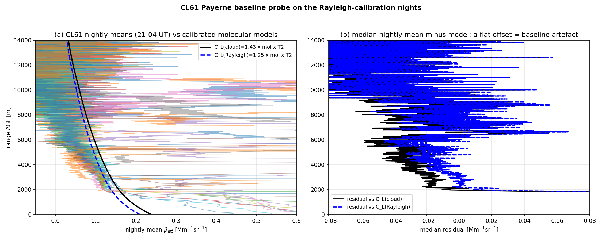
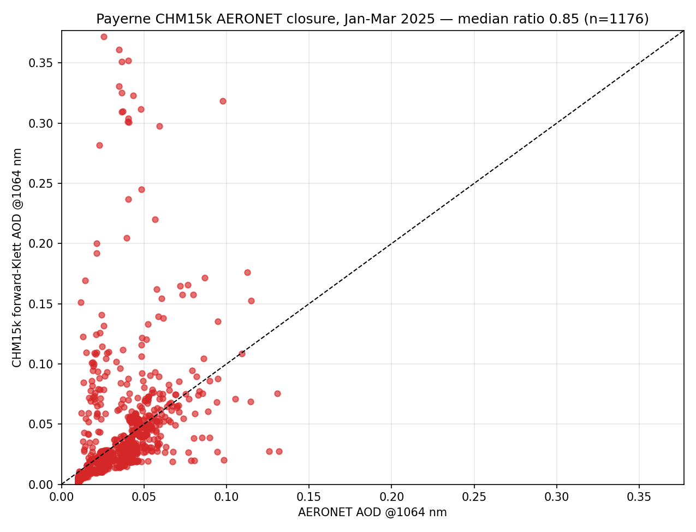

# CL61 Rayleigh calibration investigation — why C_L(Rayleigh) ≠ C_L(cloud)

*2026-07-02, `validation/paper/` (branch `wv-correction`). Trigger: the station validation shows
good agreement CHM15k ↔ CL61-cloud (Payerne −0.6 %) but not CHM15k ↔ CL61-Rayleigh (+13.5 %), i.e.
the two calibration methods disagree on the same instrument's lidar constant:
C_L(Rayleigh) = 1.25 vs C_L(cloud) = 1.43 at Payerne (ratio 0.88). All probe scripts are in
`validation/paper/_cl61_*.py`; figures in `figs_paper_report/`.*

## Executive summary

| hypothesis | verdict | evidence |
|---|---|---|
| WV correction missing in the CL61 Rayleigh calibration | **no — applied & essential** | 910 nm nights only calibrated when WV-correctable; T²_wv ≈ 0.78 at the fit windows → the correction already raises C_L by ≈ 28 % ([calibration.py:495-533](../../calibration/rayleigh/calibration.py)) |
| WV correction missing in the validation/comparison | **no — applied** (both CL61 rows identically → cancels in ray-vs-cloud) | [intercompare.py apply_wv](../../validation/paper/intercompare.py) + fail-safe guards (missing month / too-far → excluded, never uncorrected) |
| wrong laser wavelength (measured 910.74 vs manufacturer 910.55 nm) | **no — immaterial** | recalibration of all successful nights: **+0.5 %** on C_L; whole (λ₀ ± 0.5 nm, FWHM 0.3–3.4 nm) envelope ≤ 2.4 % |
| aerosol contamination of the fit window | **no — wrong sign** | contamination *raises* C_L (agreed); our C_L is *low*. The eprof_v2 outlier screen + aerosol gate also reject such nights |
| assumed lidar ratio (Klett transmission below the window) | **no — too small** | LR = 52 sr ± 20 scanned → 2σ ≈ 2–6 % (the per-night `sensitivity` term) |
| CAMS resolution (1° vs 0.4°) | **no — immaterial** | T²_wv differs by ≤ 0.3 % in C_L terms |
| monthly-CAMS vs radiosonde WV | **secondary, wrong direction** | per-night 00-UT soundings → dC_L median **−3.6 %** (clear calibration nights are drier than the monthly mean → the correction slightly over-corrects; fixing it *widens* the method gap) |
| **CL61 negative signal baseline (weak-signal artefact)** | **CONFIRMED — leading cause** | nightly means are physically **negative at 11–14 km** (−0.02…−0.05 Mm⁻¹sr⁻¹, 12/12 nights); at the 2.6–6 km fit windows the depression (−0.02…−0.04 on clean nights) exceeds the −0.014 required for the −12 % C_L gap |

**Conclusion:** the CL61 vendor β_att carries a systematic **background over-subtraction** whose
relative impact is largest exactly where the Rayleigh method fits (weak molecular signal,
2.6–6 km). The liquid-cloud method (strong signal, 0.1–2.4 km) is essentially immune — and it is
anchored by the CHM15k (−0.6 %) whose own constant closes the AERONET AOD (ratio 0.85, consistent
with 1 at winter AODs of 0.03). **Use the cloud constant for the CL61; treat the native Rayleigh
constant as biased low by ≈ 10–15 % until the baseline is handled.** A ≈ −4 % secondary term comes
from the monthly-CAMS WV over-correction on dry calibration nights.

## 1. The dark/baseline probe (the confirmed mechanism)

*Figure 1 — (a) CL61 nightly-mean profiles (21–04 UT) on the 12 successful Rayleigh-calibration
nights vs the calibrated attenuated-molecular models. (b) Median residual: with the cloud constant
(black) the residual is ≈ 0 in the lower troposphere and drifts negative above ≈ 6 km, reaching
−0.05…−0.07 Mm⁻¹sr⁻¹ at 11–14 km where the true signal is ≈ +0.02 — the nightly means are
physically negative up there, which only a processing baseline can produce. Noise is not the issue
(σ/√N ≈ 0.02 per night); the offset is systematic.*

Magnitude check: explaining C_L(ray)/C_L(cloud) = 0.88 needs a mean signal deficit of
−0.12 · C_L · β_mol · T² ≈ **−0.014 Mm⁻¹sr⁻¹** over the fit window; the clean-night residuals are
−0.02…−0.04 (the window-selection's |intercept|-minimisation absorbs part, hence −12 % and not
−25 %). Dark-measurement context ([dark_measurement_payerne.md](dark_measurement_payerne.md)):
CL61 per-sample noise σ ≈ 0.17 (3 km) → 0.57 (4–7 km) Mm⁻¹sr⁻¹.

## 2. Wavelength & spectrum (excluded)

Recalibrating every successful Payerne night with the manufacturer line:

| λ₀ / FWHM [nm] | C_L median | vs C_L(cloud)=1.425 |
|---|---|---|
| 910.74 / 1.0 (Qmini-measured, operational) | 1.268 | −11.0 % |
| 910.55 / 1.0 (manufacturer) | 1.273 | −10.6 % |

Pure-transmission scan at the window: the full plausible envelope (λ₀ 909.7–911.0, FWHM 0.3–3.4)
moves C_L by ≤ 2.4 %. The MATLAB reference (`rayleigh_calibration_matlab`) applies **no WV
correction at all** and hard-codes 910 nm (`l0_wavelength` is read but unused) — with
T²_wv ≈ 0.78 its CL61 Rayleigh constants are low by construction; not comparable.

## 3. AERONET forward-Klett closure (the absolute anchor)

*Figure 2 — Payerne CHM15k forward-Klett AOD (1064 nm, daily Kalman C_L, LR = 50 sr) vs AERONET
L2 AOD interpolated to 1064 nm, Jan–Mar 2025 (the only AERONET-L2/ceilometer overlap; the local
AERONET files end 2025-03-10). Median ratio **0.85** (IQR 0.62–1.05, n = 1176) at a median AOD of
only 0.029 — consistent with unity within the method envelope (assumed LR, sub-300 m extension,
winter shallow layers).*

Chain of anchors: AERONET ⇒ CHM15k (ratio 0.85 ≈ 1) ⇒ CL61-cloud (−0.6 %) ⇒ **C_L(cloud) is the
correct constant**; the Rayleigh constant is the outlier. The direct CL61 closure
(`_cl61_aeronet_closure.py`, ready to run) needs 2026 AERONET data — the current L2 download ends
2025-03-10 while the Payerne CL61 archive starts 2026: **action: download the 2026 AERONET
(L1.5/L2 when available) and rerun.** The same closure quantifies the below-window aerosol
transmission empirically, closing the remaining loophole in the aerosol question.

## 4. Water-vapour source sensitivity

Per-night T²_wv at the fit window (probe `_cl61_wv_sources_probe.py`):

| source | dC_L vs operational (median) | note |
|---|---|---|
| CAMS 1° monthly (operational) | — | T²_wv 0.71–0.81 at the windows |
| Payerne radiosonde 00 UT | **−3.6 %** (−12.4…+0.7) | calibration nights are drier than the monthly mean → the monthly correction over-corrects; a nightly WV source would *lower* C_L(ray) further |
| CAMS 0.4° monthly | −0.1…−0.3 % | resolution immaterial (0.4° archive incomplete: 202501/02/06/07 only, ADS issues) |

The ±4 % night-to-night WV term also explains a good part of the C_L(ray) scatter (and its
`sensitivity 2σ` being smaller than the observed night-to-night spread).

## 5. Aosta: why only the Rayleigh constant has a seasonal cycle

*Figure 3 — Monthly median C_L (blue = Rayleigh, dark grey = cloud) with the monthly WV lever
T²_wv(3–5 km) (green, right axis), and the method ratio vs 1/T²_wv, for the four dual-method CL61
stations.*

| station | months | ratio ray/cloud | corr(C_L_ray, 1/T²_wv) | corr(C_L_cloud, 1/T²_wv) | corr(ratio, 1/T²_wv) |
|---|---|---|---|---|---|
| Payerne | 5 | 0.865 | +0.90 | +0.88 | −0.68 |
| Lindenberg | 17 | 1.055 | −0.22 | −0.23 | −0.08 |
| **Aosta** | 8 | 0.894 | **+0.93** | +0.58 | **+0.80** |
| Camborne | 9 | 0.945 | +0.21 | −0.52 | **+0.79** |

**Aosta answered:** its Rayleigh constant tracks the seasonal WV lever almost perfectly
(corr +0.93): the fit window sits above the full WV column, so C_L(ray) scales with 1/T²_wv
(0.71→0.85 seasonally ≈ ±8 % direct lever) and any residual of the monthly correction (dry-night
bias, §4) imprints seasonally. The cloud method integrates 0.1–2.4 km where the WV lever is ≈ 4×
smaller — hence no visible cycle. Camborne behaves the same (ratio-corr +0.79). Payerne's 5-month
record is too short to separate the terms.

**Coherence across the network:** the ray/cloud ratio is NOT a universal constant (0.87, 0.89,
0.95, 1.06) — consistent with a data-dependent artefact (baseline strength differs per unit /
processing chain) plus the WV residual, not with a single physical constant offset. **Lindenberg
is the outlier in every respect** (ratio > 1, no WV correlation): its "L1" is converted from
Cloudnet, i.e. a different processing chain — supporting the baseline explanation (different
background handling → different Rayleigh bias).

## 6. Recommendations

1. **Operations:** keep the **cloud method** as the CL61 constant of record (already the case in
   the fullcal chain); flag the CL61 native Rayleigh constant as biased low ≈ 10–15 %.
2. **Root cause:** raise the negative-baseline finding with Vaisala (background subtraction in the
   vendor β_att; reproducible as physically negative nightly means at 11–14 km on clear nights).
   A hood-on dark measurement on a CL61 would separate detector vs processing contributions.
3. **Rayleigh method hardening:** estimate and remove a per-night baseline from the 10–14 km
   gates before the molecular fit (turns the −12 % into a correctable term); consider nightly
   (sounding or CAMS-daily) WV instead of monthly (−4 % and less scatter).
4. **Closure:** download 2026 AERONET Payerne (L1.5 now, L2 when released) and run
   `_cl61_aeronet_closure.py` for the direct CL61 constant test (script ready, LR from the .lid
   inversions when valid, else 50 sr).
5. **Paper:** §5.1 of the validation report already carries the exoneration table and the
   baseline finding; the CL61-vs-CHM15k comparison offsets (both methods high at LIN/AOS/CAM)
   remain a separate, comparison-level question (910→1064 conversion + WV residual at 910 nm).
