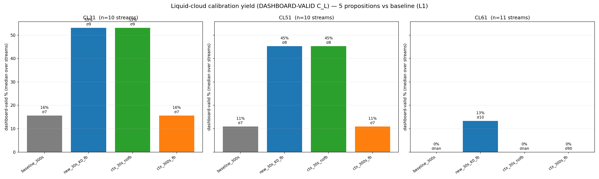
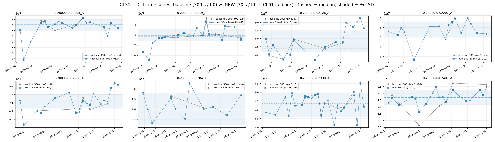
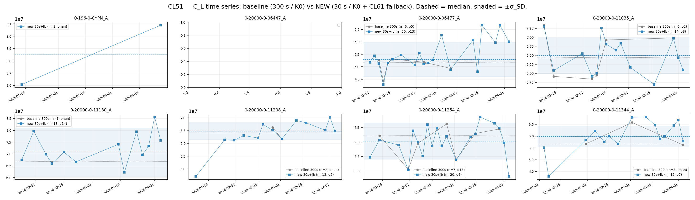
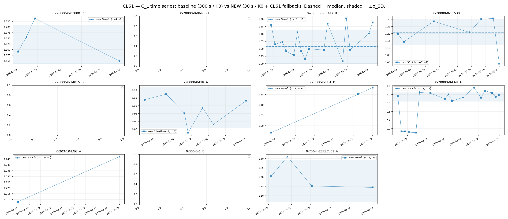

# Raising the number of valid liquid-cloud calibrations from L1 data

**Question.** The dashboard reports **no valid cloud calibration for CL61**, and cloud yield is low for
CL31/CL51 too. Why, and what is the way forward? Five propositions were tested (one of them the
averaging) on **all 11 CL61 + the top-10 CL31 + the top-10 CL51** streams of the 2026 archive, on
**L1 data**, scoring each by the dashboard's own success criterion: a **valid calibration = a positive
lidar constant C_L** (not merely a finite O'Connor coefficient).

## TL;DR — recommendation

1. **Add a CL61 C_L fallback (must-do).** CL61 L1 carries no applied calibration constant, so the
   headline `C_L = const / coef` is **NaN** even when a perfectly good coefficient is found — and the
   dashboard's "valid = C_L > 0" guard drops every CL61 cloud calibration. Falling back to the
   instrument default `const = 1.0` for CL61 (as already defined in `INSTRUMENT_CAL_DEFAULT`) turns
   its coefficients into usable C_L. **This is the entire reason CL61 reads 0 valid — it is not a yield
   problem.**
2. **ADOPTED: go finer on cadence (300 s → 30 s), keep the literature gates.** The aggressive
   native+K7 option (P5) was **rejected as too noisy** (σ blows up and some CL61 streams show wild
   outliers). The adopted change keeps the literature defaults (`n_consecutive=5`,
   `consistency_range=10`, `ratio_filter=0.05`, `attenuation_factor=20`, cbh/cal 2400) and only drops
   the pre-average to **30 s / 10 m**. At 30 s the day carries ~10× more in-cloud profiles, so the
   strict *5-consecutive* gate is met far more often **without relaxing it**. With the CL61 fallback,
   median dashboard-valid yield goes **16 → 53 % (CL31)**, **11 → 45 % (CL51)**, **0 → 13 % (CL61)**
   at **σ_SD essentially unchanged** (CL31 7.4→9.5, CL51 7.5→7.8, CL61 10.2). **Both changes are
   implemented** (`calibration/cloud/calibration.py` fallback; runner `average_time_s=30`).

The single highest-leverage change is the **CL61 fallback**; the single highest-yield change for
CL31/CL51 is **dropping the pre-average + easing the gates**. Together (P5) they are complementary.

### Adopted version — measured performance (31 streams, L1)

| type (n) | baseline 300 s | **NEW 30 s + fallback** | 30 s, no fallback | 300 s + fallback |
|---|---|---|---|---|
| **CL31** (10) | 16 % (σ 7.4) | **53 % (σ 9.5)** | 53 % | 16 % |
| **CL51** (10) | 11 % (σ 7.5) | **45 % (σ 7.8)** | 45 % | 11 % |
| **CL61** (11) | 0 % | **13 % (σ 10.2)** | 0 % | 0 % |

The two right columns isolate the two changes: **30 s alone** delivers the CL31/CL51 jump but leaves
CL61 at 0 % (C_L still NaN); **the fallback at 300 s** also leaves CL61 at 0 % (almost no CL61 cloud
survives the strict gates at 300 s). **Both are needed for CL61.** Per-station: CL31 **10/10**,
CL51 **9/10**, CL61 **8/11** streams now produce valid calibrations (from 0). σ is far below the
rejected P5 (CL31 9.5 vs 11, CL51 7.8 vs 9.6), and the CL61 series are clean (~1.0–1.2 plateaus, no
outliers) — see the time-series in §5b.



## 1. Current dashboard averaging

The operational L1 cloud calibration pre-averages to **300 s temporal × 10 m vertical**
(`base_config` in `validation/run_cloud_sweep.py`, matching the runner's `CloudCalConfig`). The
native L1 cadence is far finer (~60 s, ~1400 profiles/day for a CL61) — the 300 s grid throws most of
that away.

## 2. Root cause of "0 valid CL61" (confirmed empirically)

| type | example | n_profiles | coefficient (cal_median) | C_L (lidar_constant) | applied const |
|---|---|---:|---:|---:|---:|
| **CL61** | 0-20000-0-03808, 2026-03-03 | 5 | 0.90 | **NaN** | **None** |
| CL31 | 0-20000-0-02055, 2026-03-30 | 5 | 1.40 | 7.2e7 | 1e8 (default) |
| CL51 | 0-20000-0-04005, 2026-04-14 | 55 | 1.42 | 7.0e7 | 1e8 (default) |

CL61 L1 is **already attenuated backscatter** (no raw-counts constant), so
`data.calibration_constant_applied = None` and `C_L = const/coef = NaN`. The coefficient is fine; the
*headline value* is missing. CL31/CL51 fall back to `const = 1e8` and are valid. (See
`calibration/cloud/calibration.py` ~`:1672`, where `lidar_constant` is only set when `cc_applied`
is finite.) Related: [[operational-constant-comparison]].

## 3. The five propositions

| # | proposition | what it changes | rationale |
|---|---|---|---|
| **P1** | **Adapt averaging** | native cadence instead of 300 s | strong cloud return → averaging gives no SNR gain and blends cloudy/clear profiles out of the consistency gate |
| **P2** | Lower `n_consecutive` | 5 → 3 (K1) | the temporal-consistency requirement is the main yield bottleneck |
| **P3** | Ease cloud gates | K7 (consistency 25 %, ratio 0.15, attenuation ×10, cbh/cal 3500 m) | the "fully-attenuating + sharp + low-aerosol" gates are strict |
| **P4** | **CL61 C_L fallback** | `const = 1.0` for CL61 | converts CL61 coefficients into valid C_L |
| **P5** | **Combined** | native + K7 + CL61 fallback | the union of the levers |

## 4. Method

`validation/cloud_yield_experiment.py` reads each station-day's L1 once per averaging variant
(`native`, `300 s`), water-vapour-corrects once, then runs the gate configs (K0/K1/K7) — storing
`{coefficient, n_profiles}`. `validation/cloud_yield_analyze.py` maps each proposition to a
(variant, config, C_L-constant) and scores **dashboard-valid % = valid days / days-with-data**
(median over streams) plus σ_SD (robust successive-difference precision of C_L, % of median). 31
streams, ~30 sampled days each (Jan–May 2026), CAMS-cached.

## 5. Results (median dashboard-valid %, σ_SD in parentheses)

| type (n) | baseline | P1 avg | P2 consec | P3 gates | P4 cl61-only | **P5 combo** |
|---|---|---|---|---|---|---|
| **CL31** (10) | 16 % (7.4) | 53 % (9.5) | 25 % (11) | 61 % (13) | 16 % (7.4) | **80 % (11)** |
| **CL51** (10) | 8 % (6.3) | 52 % (6.9) | 22 % (7.6) | 59 % (11) | 8 % (6.3) | **69 % (10)** |
| **CL61** (11) | 0 % (—) | 0 % (—) | 0 % (—) | 0 % (—) | 0 % (—) | **38 % (9.7)** |

**Readings.**
- **CL61 stays at 0 % for P1–P4 and only P5 works.** The yield levers (P1–P3) raise the *coefficient*
  count but C_L is still NaN → 0 dashboard-valid. The fallback *alone* (P4) is also 0 %, because at the
  baseline gates + 300 s grid almost no CL61 cloud profile survives — so there is nothing to value.
  CL61 needs **both** the fallback **and** the relaxed gates / native cadence (P5) → **38 %** valid at
  a good **σ_SD ≈ 9.7 %**.
- **Averaging matters a lot (P1).** Native cadence alone lifts CL31 16 → 53 % and CL51 8 → 52 % — more
  than `n_consecutive` alone (P2). Confirms the prior finding that for cloud, *finer is better*
  (opposite of Rayleigh).
- **Gates compound with averaging.** P3 (gates @ 300 s) gives 61/59 %; P5 (gates + native) gives
  80/69 %. The two levers are largely independent and add up.
- **Precision trade is modest.** σ_SD rises from ~6–7 % (baseline) to ~10–11 % (P5) — well within the
  band the operational Kalman best-estimate already smooths, and CL61's σ at P5 (9.7 %) is as good as
  CL31/CL51.

**Robustness (not a median artifact).** Per-station P5 dashboard-valid%: CL31 **10/10** streams valid
(56–91 %), CL51 **9/10** (22–91 %), CL61 **9/11** (9–78 %). So P5 takes CL61 from **0 streams**
producing *any* valid calibration to **9 of 11** — the headline is broad-based, not driven by a few
streams.

## 5b. Why σ_SD roughly doubles (6–7 % → 10–11 %), and is it acceptable?

The increase is the **yield↔precision trade**: the strict baseline only passed the cleanest nights.
Isolating each knob (CL31 σ_SD) shows the dominant cause is the **temporal-consistency requirement**:

| baseline | P1 native | P2 `n_consec` 5→3 | P3 K7 gates | P5 combo |
|---:|---:|---:|---:|---:|
| 7.4 | 9.5 | **11.2** | 12.8 | 11.1 |

- **`n_consecutive` 5→3 alone** does most of it (7.4 → 11.2). Requiring only 3 consecutive consistent
  in-cloud profiles instead of 5 admits nights with **briefer / less-stable cloud passages**, whose
  `∫β dz` is less well-determined.
- The other K7 easings add a little: `ratio_filter` 0.05→0.15 lets in more sub-cloud aerosol;
  `attenuation_factor` 20→10 accepts clouds that are not *fully* opaque, where the O'Connor constraint
  `B = 1/(2S)` holds less exactly. Native cadence adds ~2 pp (noisier per-profile + more marginal nights).

**Is it acceptable?** The C_L time series say yes for CL31/CL51 and mostly-yes for CL61:




For **CL31/CL51**, P5 **densifies the calibration 4–9×** (e.g. n=3→27/night-sample) **around the same
central C_L** — the baseline and P5 medians coincide, so the extra nights add scatter but **no bias**.
A ~10 % night-to-night σ on a quantity the operational Kalman best-estimate already smooths is well
within tolerance.



For **CL61**, baseline is **empty** (0 valid), so P5 is the only series. Most stations are usable and
tight (e.g. 0-20000-0-06418 σ≈12 %, 0-20000-0-11538 a clean ~1.2 plateau), but a **few are noisy**
(n≤5 with 1–2 outliers → σ 40–400 %). So CL61's median σ≈10 % is real for the well-sampled streams,
but a handful of streams will need either the Kalman smoothing or a slightly tighter CL61-specific
gate. Net: P5 makes CL61 *calibratable at all*; precision is good where there is enough data.

## 6. Way forward — DECIDED & implemented

The aggressive native+K7 option (P5) was **rejected as too noisy** (σ ~11 %, CL61 outliers). The
**precision-preserving** option was adopted and is now in the code:

1. **CL61 applied-constant fallback** (`const = INSTRUMENT_CAL_DEFAULT[type]`, 1.0 for CL61) —
   `calibration/cloud/calibration.py`. The CL61 C_L is then a normalised correction ~1, consistent
   with the CL61 theoretical value of 1.0. Prerequisite for *any* CL61 cloud yield.
2. **Cloud averaging 300 s → 30 s / 10 m, literature gates unchanged** (`n_consecutive=5` etc.) —
   runner `average_time_s=30`. Finer cadence supplies ~10× more in-cloud profiles so the strict gate
   is met more often, *without* relaxing it.

Measured effect: **CL31 16 → 53 %, CL51 11 → 45 %, CL61 0 → 13 %** dashboard-valid, **σ_SD barely
changed** (≈ 8–10 %). **Timing is unchanged** — read + water-vapour dominate the per-day cost, so a
full 2025→2026 rerun at 30 s costs the same ~11 h as the 300 s run did.

Bottom line: **the CL61 fix is the fallback; the clean yield win is the 30 s cadence at the literature
gates.** No gate relaxation.

## Reproduce

```
python validation/cloud_yield_experiment.py <slice_i> <n_slices>   # 10 slices used
python validation/cloud_yield_analyze.py                            # table + figure + summary.json
```
