# Campagne dark / saturation / AERONET / radiosondages — rapport final

**Préalable, en une ligne :** le CHM15k **ne peut pas** être calibré par la méthode nuage (il sature dans
les nuages liquides) — la voie expérimentale proposée (« calibrer le CHM15k en nuage et s'en servir de
contrôle ») est donc **fermée**, et elle a été remplacée par le contrôle co-localisé **CL31 vs CL61**
de Payerne. Le CHM15k n'intervient dans ce rapport que comme **contrôle positif de saturation** sur la
forme des pics — jamais comme référence de calibration.

*Payerne 0-20000-0-06610 : A = CHM15k (1064 nm), B = CL31 (910 nm), C = CL61 (910,55 nm).
Toutes les valeurs ci-dessous ont été recalculées depuis les L1 bruts, les radiosondages, CAMS et
AERONET dans le cadre de cette campagne ; les rares chiffres repris d'études antérieures sont
étiquetés « (contexte) ». Chaque résultat a été soumis à une contre-expertise adversariale : les
énoncés **réfutés** sont signalés comme tels et ne sont jamais présentés comme acquis.*

---

## 1. Le bruit électronique du CHM15k dérive-t-il ?

### 1.1 Réponse courte

| Question | Réponse |
|---|---|
| Y a-t-il un résidu additif (« dark ») dans le CHM15k ? | **OUI** — piédestal de **-2,557e-4 ± 4,73e-5 counts/s** (moyenne 2,5-6,5 km, **-5,4 σ**) |
| Ce piédestal dérive-t-il d'un facteur 3,5 en 10 semaines ? | **NON ÉTABLI** — χ² = 5,73 / 5 ddl, **p = 0,33** avec la bonne barre d'erreur |
| Dépend-il de la température ? | **NON** sur le NIVEAU (r = -0,07 sur le cycle 24 h) ; **OUI, faiblement**, sur l'AMPLITUDE du bruit (+0,223 %/K) |
| Sa forme en portée fabrique-t-elle un dC_L/dz ? | **NON pour le CHM15k** (~0 %) ; **OUI, massivement, pour le CL61** (66 %) |
| Le carton de 5 mm rend-il la mesure CHM15k majorante ? | **NON** — fuite lumineuse **X = +1,33 ± 1,06 %** : le carton est étanche au même titre que les capots constructeur |

### 1.2 Étanchéité des capots — le carton du CHM15k est bon

Le bruit par profil (σ de première différence de `rcs_0/z²`, 10-15 km pour A et C, 5-7,5 km pour B)
sous capot en plein soleil est **indiscernable** du bruit à découvert de nuit :

| | couvert-soleil | découvert-nuit | découvert-soleil | **nuit sous capot** |
|---|---|---|---|---|
| CHM15k | 2,700e-2 | 2,673e-2 | 3,676e-2 | 2,610e-2 |
| CL31 | 1,504e-5 | 1,478e-5 | 2,750e-5 | 1,472e-5 |
| CL61 | 6,977e-15 | 6,945e-15 | 1,101e-14 | 6,876e-15 |

La contre-expertise a corrigé la **classe de référence** (il faut comparer couvert-jour à
**couvert-nuit**, pas à découvert-nuit : sinon on change à la fois le capot, le soleil et l'heure) et a
contrôlé la température. Fractions de fond solaire encore admises sous capot, effets fixes par jour,
campagne complète mai-juillet 2026 :

- **CHM15k (carton brun)** : X = **+1,33 % ± 1,06 %** (IC 95 % : -0,76 à +3,41 %), n = 10 016 profils, 7 jours
- **CL31 (capot constructeur)** : X = **-0,82 % ± 0,68 %** (IC 95 % : -2,16 à +0,51 %), n = 7 425, 9 jours
- **CL61 (capot constructeur)** : X = **-0,88 % ± 1,09 %** (IC 95 % : -3,01 à +1,24 %), n = 5 044, 7 jours

Test DC indépendant sur `bckgrd_rcs_0` (linéaire, ~2× plus sensible) : X_DC = -0,91 ± 0,99 % (CHM15k),
-2,43 ± 1,25 % (CL31). Pente solaire sous capot sur le seul cycle 24 h du 26-27 mai :
-2,483e-4 ± 4,375e-5 (CHM15k, t = -5,68) — **significativement négative**, donc aucune trace de fuite.
Le sous-test du 09/06 (sacs plastique noirs par-dessus les capots, 10:34-11:39) ne change rien :
-0,05 % (CHM15k), +1,24 % (CL31), -0,37 % (CL61) sur σ.

Puissance du test : la lumière du ciel pendant les créneaux capotés était bien réelle — le 07/07,
pendant le capot CL61, le CHM15k découvert voyait son fond ×4,94 et son σ ×3,70, et le CL31 son fond
×24,7. Reproductibilité nuit-à-nuit de la médiane de σ (92 nuits) : 2,52 % (CHM15k), 1,62 % (CL31),
1,78 % (CL61) → erreur-type sur 7 jours de campagne 0,95 / 0,61 / 0,67 %.

> **À retenir : le dark CHM15k n'est pas un majorant par fuite lumineuse.** C'est une vraie mesure de
> la ligne de base électronique, utilisable telle quelle.

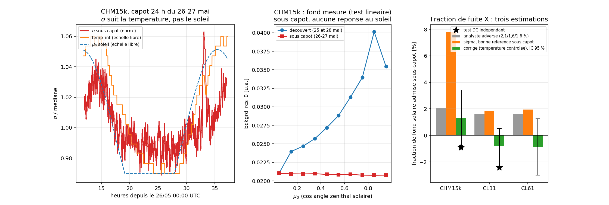

### 1.3 La dérive : mesurée, mais NON significative

Les six niveaux moyens de `rcs_0/z²` sur 2,5-6,5 km en fenêtre couverte se reproduisent au chiffre
près entre les deux analyses. Le désaccord porte uniquement sur leur **incertitude** :

| date | n profils | moyenne (counts/s) | SEM correcte | SEM avec autocorrélation | médiane |
|---|---|---|---|---|---|
| 12/05 | 1316 | -1,548e-4 | 1,29e-4 | 2,73e-4 | -1,24e-4 |
| 26-27/05 | 6055 | -2,186e-4 | 6,14e-5 | 1,05e-4 | -2,29e-4 |
| 09/06 | 637 | -4,643e-4 | 1,85e-4 | 4,73e-4 | -2,85e-4 |
| 23/06 | 628 | -5,417e-4 | 2,04e-4 | 4,95e-4 | -4,10e-4 |
| 07/07 | 660 | -4,853e-4 | 1,99e-4 | 4,87e-4 | -3,06e-4 |
| 21/07 | 1008 | -1,897e-4 | 1,52e-4 | 3,65e-4 | -3,09e-4 |

Test de constance : **χ² = 5,73 / 5 ddl, p = 0,33** (SEM correcte) ; χ² = 1,0 / 5 ddl, p = 0,96
(autocorrélation, τ = 2,9 à 6,6 profils) ; χ² = 1,91 / 5 ddl, p = 0,86 (médianes). Le χ² = 41,4
initialement annoncé se reproduit **uniquement** avec une SEM *inter-portes* (écart-type sur les 267
portes du profil moyenné en temps, ÷ √267) : cette quantité mesure la platitude en altitude du profil
moyen, elle est structurellement aveugle au bruit temporel — et elle est trop petite d'un facteur
2,6 à 2,7.

Deux contrôles achèvent la démonstration :

- **Bootstrap par blocs contigus** de 628 profils (2,6 h) à l'intérieur de l'unique fenêtre couverte de
  25 h du 26-27/05 (n = 6055) : écart-type des moyennes de blocs = 1,56e-4, étendue -5,57e-4 à
  +8,86e-5. P(6 blocs d'une même journée couvrent une étendue ≥ 3,87e-4, l'étendue « des 10 semaines »)
  = **0,247**. Autrement dit : la variabilité inter-dates est reproductible **en une seule journée**.
- **Contrôle nocturne** sur 92 nuits (01/05-31/07/2026, élévation solaire < -10°, bande 13,5-15,3 km) :
  moyenne -4,30e-5, écart-type nuit-à-nuit 7,70e-5, étendue -2,54e-4 à +9,42e-5 — **aucune dérive**.

Idem pour le CL61 (χ² = 5,3 / 5 ddl, p = 0,39). Le **CL31 est le seul** cas où quelque chose bouge
(χ² = 12,9 / 6 ddl, p = 0,044 après autocorrélation, niveaux +1,721e-7 → +1,076e-6) — et c'est
attendu : son bloc optique a été remplacé le 07/07/2026 (cf. § 1.6).

> **Verdict honnête : la campagne ne démontre pas la dérive du bruit électronique du CHM15k.**
> L'hypothèse reste ouverte — elle n'est ni confirmée ni exclue —, mais 6 mesures de 0,3 à 2,7 h
> chacune, prises à 10 semaines d'intervalle, n'ont pas la puissance pour trancher. Ce qui **est**
> établi, c'est un **piédestal constant et significatif**, de forme en portée identique aux 6 dates.

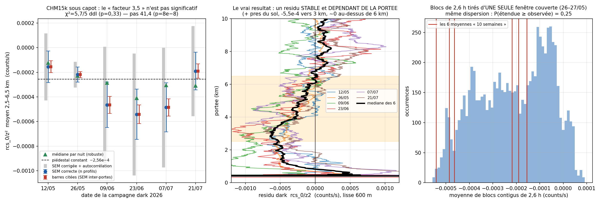

### 1.4 Dépendance thermique : nulle sur le niveau, faible sur le bruit

Le cycle de 24 h du 26-27 mai (dôme de chaleur, 51 blocs de 30 min sous capot, `temp_int` 298,0-312,0 K)
est la meilleure mesure disponible. Sur le **niveau** 2,5-6,5 km — la quantité qui biaise C_L :

- r(niveau, `temp_int`) = **-0,07** (CHM15k), **+0,12** (CL61) ; sur les 91 blocs couverts de toute la
  campagne (amplitude 20,4 K) : r = -0,17, pente -1,28e-5/K ; `temp_ext` r = -0,15 ;
  `temperature_optical_module` r = -0,22. `temperature_detector` est bloquée à 303,00 K (Peltier).
- Jour vs nuit **sous capot** (26-27/05) : -3,64e-4 ± 5,5e-5 (10-15 h, 13 blocs) contre
  -2,47e-4 ± 1,29e-4 (21-03 h, 12 blocs) → écart **0,8 σ**. Confirmé indépendamment :
  jour moins nuit dans la fenêtre couverte de 25 h = -2,95e-5 ± 1,42e-4 (**-0,2 σ**), et
  `bckgrd_rcs_0` jour/nuit = 0,99.

**Conséquence opérationnelle : un dark mesuré de jour est utilisable pour corriger une nuit de
calibration.** C'est la question qui conditionnait tout l'usage de la campagne (toutes les mesures sont
diurnes, 07:54-15:09 UTC), et la réponse est oui.

Nuance apportée par la contre-expertise : l'**amplitude du bruit** (σ), elle, a un coefficient
thermique mesurable à lumière nulle : **+0,223 %/K** (CHM15k, t = 5,98), **+0,368 %/K** (CL31, t = 5,11),
**+0,272 %/K** (CL61, t = 5,49). Les darks ayant été pris 14-19 K au-dessus du régime nocturne, ils
**surestiment le bruit électronique nocturne de 3 à 6 %** (CHM15k ~3,1 %, CL31 ~5,5 %, CL61 ~4,1 %) —
correction à appliquer si l'on s'en sert comme référence de σ. Exception : le CL31 est le seul dont le
**niveau** montre une signature thermique, r(niveau, `temperature_laser`) = +0,58 sur 132 blocs couverts,
pente +4,57e-8/K sur 22,9 K.

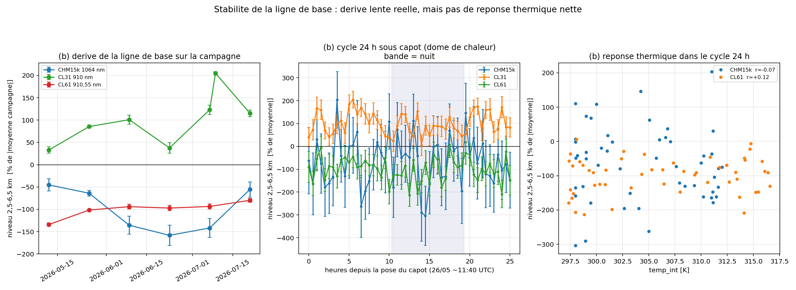

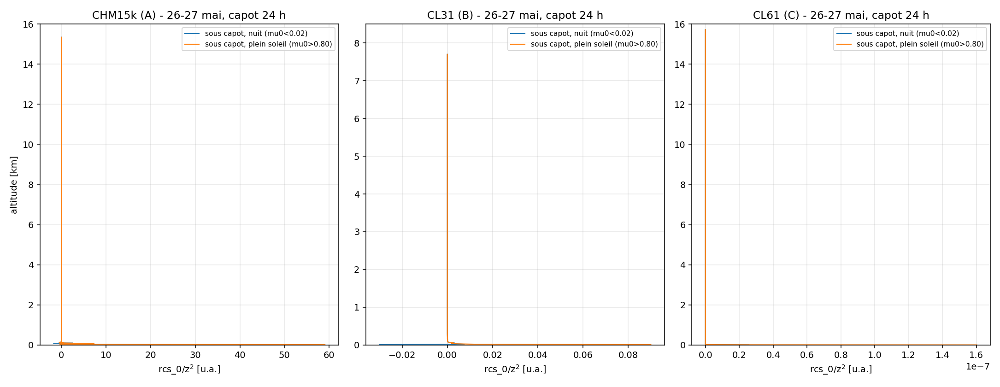

### 1.5 La forme en portée du dark produit-elle un dC_L/dz ? — La réponse dépend de l'instrument

C'est le résultat central de la campagne, et il est **asymétrique**.

**CL61 — OUI, et c'est le mécanisme dominant de son gradient Rayleigh intra-nuit.**
Le dark poolé (n = 5188 profils, 6 dates), rapporté à une nuit moléculaire pure (C = 1,20, 910,55 nm,
US-Std, station 490 m), croît **monotonement** en fraction du signal :

| portée | 2 km | 3 km | 4 km | 5 km | 6 km | 7 km |
|---|---|---|---|---|---|---|
| dark / moléculaire | -1,9 % | -5,4 % | -8,2 % | -12,5 % | -24,4 % | -25,5 % |

— de même signe aux 6 dates. Passé dans le **modèle direct fermé** avec l'estimateur embarqué
(fenêtres forcées 3000-6000 m par pas de 250 m, demi-longueur 490 m) : **dC_L/dz = -6,13 %/km** poolé ;
moyenne par date -6,43 ± 2,05 %/km, IC bootstrap 95 % [-8,02 ; -5,07] ; robuste au lissage
(300/600/900/1500 m → -6,22 / -6,18 / -6,13 / -5,97 %/km).

**Test sur vraies données** — 15 nuits claires 00-03 UTC, écrantées nuage (≥ 60 % de profils sans
`cloud_base_height`, avril-août 2026) : gradient intra-nuit médian **-13,51 %/km brut → -5,64 %/km
après soustraction du dark mesuré**, changement apparié **+8,89 ± 0,57 %/km, t = +15,5, n = 15**.
La dispersion nuit-à-nuit de C passe de 16,1 % à 13,7 %. Biais sur C à une fenêtre typique
4,5 km ± 490 m : -8,6 % en moyenne (étendue -6,3 à -13,6 % selon la date).

Mécanisme : `C_L(z) = signal / (β·T²)`. Le signal moléculaire décroît d'un facteur ~2,5 entre 3 et 6 km ;
un résidu additif qui ne décroît pas aussi vite pèse de plus en plus lourd en altitude — le rapport
dark/moléculaire passe de -5 % à -25 % et **fabrique mécaniquement une pente négative**. C'est
exactement le mécanisme « résidu additif » qui avait été **réfuté sous sa forme CONSTANTE** (contexte) :
la réfutation portait sur un `b` scalaire, jamais sur un `b(z)`. Le dark mesuré tranche la différence.

**CHM15k — NON, et c'est la forme qui fait tout.**
Le dark poolé (n = 10 304 profils, 6 dates) rapporté au moléculaire pur dessine une **cuvette** :

| portée | 2 km | 3 km | 4 km | 5 km | 6 km | 7 km |
|---|---|---|---|---|---|---|
| dark / moléculaire | -4,3 % | -10,1 % | -13,5 % | -9,5 % | -4,0 % | +11,3 % |

(la même cuvette se lit directement en unités de signal dans la contre-expertise : +7,81e-4 à 200-500 m,
-4,37e-4 à 1-2 km, **-5,84e-4 à 2-3 km**, -5,49e-4 à 3-4 km, -2,38e-4 à 4-6 km, +1,10e-4 à 6-9 km,
+1,92e-5 à 12-15,3 km — les deux analyses sont d'accord sur la forme).

Modèle direct : **+2,76 %/km** poolé ; moyenne par date +0,12 ± 6,47 %/km, IC bootstrap 95 %
[-5,12 ; +4,45] → **compatible avec zéro**. Sur 24 vraies nuits claires écrantées nuage :
médiane **-18,85 %/km brut → -19,32 %/km corrigé**, changement apparié -0,99 ± 0,22 %/km (t = -4,5) —
la correction **dégrade très légèrement**.

Le contre-factuel est éloquent : le **même** dark réduit à sa moyenne 2,5-6,5 km (offset PLAT,
b = -2,55e-4) donnerait -9,31 %/km en modèle direct et aurait retiré +10,09 ± 0,81 %/km sur les vraies
nuits (t = +12,5). C'est **précisément la forme mesurée qui annule l'effet** : sur 2,5-6,5 km la
cuvette du CHM15k décroît presque comme β_mol·T², donc le rapport dark/moléculaire y est quasi plat →
erreur d'**échelle**, pas de **pente**.

*Point de tension à signaler honnêtement :* la contre-expertise, en rapportant le piédestal **moyen**
(donc plat) au signal réel des nuits les plus claires, obtient un ladder b/S monotone (-3,2 % à
2-2,5 km ; -17,3 % à 2,75-3,75 km ; -39,7 % à 4-5 km) et en déduit un ordre de grandeur de -31 %/km
sur 2,75-3,75 km. Les deux calculs ne mesurent pas la même chose : l'un propage un **offset plat**
(caricature), l'autre propage la **forme mesurée** à travers l'estimateur réel, qui renormalise sur sa
fenêtre. **L'arbitre est le test sur vraies nuits** (24 nuits, -0,99 ± 0,22 %/km) : il est direct, et
il dit que la pente CHM15k n'est pas fixée par le dark.

**Part des -7,5 %/km (contexte, nuits claires, fenêtre 2,75-3,75 km) expliquée :**
- **CL61 : 66 %** de son propre gradient intra-nuit mesuré ici (-13,51 → -5,64 %/km sur 15 nuits) ;
- **CHM15k : ~0 %** (la correction déplace la pente de -1,0 %/km, dans le mauvais sens).
Les fenêtres ne sont pas identiques (2-6 km ici contre 2,75-3,75 km pour le chiffre de contexte) :
les parts doivent se lire chacune dans sa propre métrique, pas en les divisant l'une par l'autre.

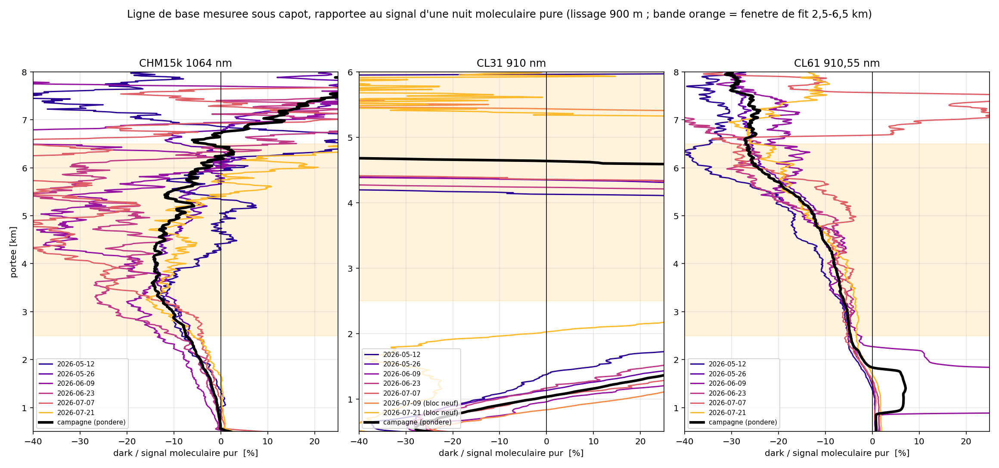

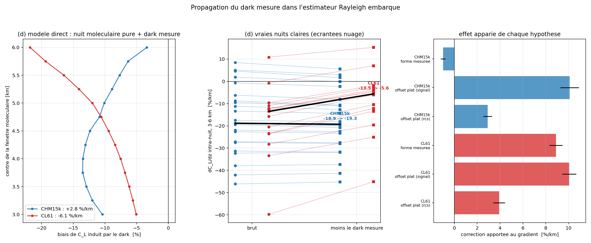

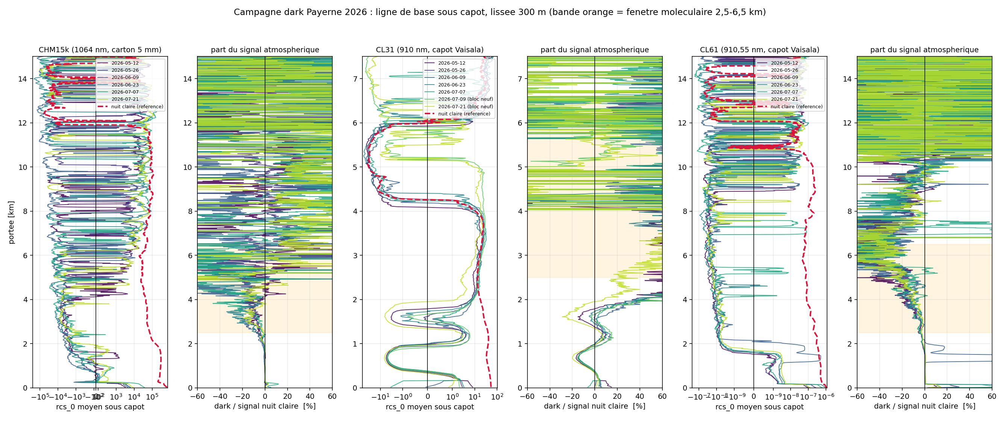

### 1.6 Effet sur le NIVEAU, et contrôle positif

Le piédestal biaise la **constante** du CHM15k de **-17,2 % en moyenne** à une fenêtre 4,5 km ± 490 m
(par date : -0,6 / -10,6 / -30,2 / -18,7 / -34,1 / -9,0 %), contre **-8,6 %** pour le CL61
(-13,6 / -9,5 / -6,6 / -6,3 / -7,1 / -8,7 %). L'écart-type entre dates (13,0 % pour le CHM15k, 2,7 %
pour le CL61) avait été présenté comme une contribution de la dérive à la variabilité nuit-à-nuit :
**cette lecture ne tient pas**, puisque les différences inter-dates ne sont pas significatives une fois
la SEM corrigée (§ 1.3) — elles sont du même ordre que l'incertitude de mesure du dark lui-même
(1,3 à 2,0e-4 par date). Le bon objet à appliquer est donc **un profil b(z) poolé unique**, pas six.

**Contrôle positif — le remplacement du bloc optique CL31 du 07/07/2026 ~13:00 est vu haut la main :**
calibration nuage C_daily médiane 3,786e7 avant (n = 25, 01/05-06/07) contre 8,536e7 après (n = 7,
08/07-14/08) → **×2,255 (+125 %), Mann-Whitney p = 5,9e-7**. Cohérence indépendante : le **niveau de
dark** du CL31 saute d'un facteur ~2,0 dans les mêmes unités (dates bloc ancien +4,1e-7 ; dates bloc
neuf 09/07 + 21/07 +8,1e-7) — signature d'un pur **changement de gain**, signal et dark montant ensemble.

**Aucune trace de la manipulation** sur les calibrations encadrantes : test d'encadrement autour des
7 dates de dark (CHM15k Rayleigh v2.2, CL61 Rayleigh v2.2, CL61 nuage v2.2 ; fenêtres 5/7/10 j ;
statistique = moyenne des |log(médiane après / médiane avant)| ; null par permutation sur 4000 dates)
→ **p = 0,21 à 0,74 dans 8 tests sur 9** ; le neuvième (p = 0,03) repose sur 2 dates et ne survit pas
à la correction pour tests multiples. Les capots sont retirés avant la nuit ; aucune contamination
directe n'était attendue, et aucune n'est détectée.

---

## 2. Le biais nuage du CL61 est-il une saturation ?

### 2.1 Réponse : NON

Le terme CBH propre au CL61 existe bel et bien, mais **il n'est pas une saturation** — et le contrôle
co-localisé CL31/CL61, qui remplace l'expérience CHM15k impossible, le montre directement.

**Le discriminant central.** Payerne, CL31 (B) et CL61 (C) appariés à 30 s, mêmes bases à ±50 m,
filtres O'Connor répliqués sur une grille commune 10 m, transmission fenêtre > 50 % :
**11 943 profils, 81 nuits** (2026-02-24 → 2026-06, donc **avant** le remplacement du bloc optique CL31).
Pente **within-night** de ln[C_L(CL61)/C_L(CL31)] contre CBH, ajustée par nuit puis médiane :

- brut : **+4,41 %/km** [IC 95 % bootstrap +3,23 ; +8,01], **44/55 nuits positives**, Wilcoxon **p = 5,2e-6** ;
- **avec le log du pic (intensité) en covariable : +3,66 %/km** [+2,40 ; +7,33], 39/55 positives, p = 8,8e-4.

L'intensité n'absorbe que **0,75 %/km, soit 17 %** — et ces 17 % sont eux-mêmes de signe
**anti-saturation**. Or l'intensité du retour est **le seul canal** par lequel une saturation peut agir :
conditionner dessus aurait dû annuler l'effet. Il survit → ce n'est pas une saturation.

### 2.2 Les quatre autres jambes, dans l'ordre de solidité

**(a) La prémisse même est fausse : un nuage plus bas ne donne pas un retour plus intense.**
Pic médian de β_att du CL61 par bande de CBH (mêmes 11 943 profils) : 5,206e-4 (500-700 m, n = 421) /
4,623e-4 / 4,643e-4 / 4,732e-4 / 4,727e-4 / 4,975e-4 / 4,484e-4 / 4,589e-4 / 4,634e-4 m⁻¹sr⁻¹
(2100-2400 m, n = 590) — **amplitude totale 11 % sur 1,6 km, non monotone**. Régression :
d ln(pic)/dCBH = **-1,68 ± 3,53 %/km** ; corrélation de rang (pic, CBH) = -0,020 (profils),
+0,147 (81 nuits). Le signal étant déjà corrigé de la portée, le pic de β_att dans un nuage totalement
atténuant est fixé par l'extinction propre du nuage, pas par la distance. **La chaîne « nuage proche →
nuage intense → saturation → constante croissante en CBH » s'effondre à la première flèche.**

**(b) Le levier maximal d'une non-linéarité est six fois trop petit ET de signe opposé.**
Exposant de réponse mesuré sur un axe d'intensité **indépendant** (le pic du CL31, autre instrument),
CBH en covariable : d ln C_L(CL61) / d ln(pic CL31) = **+0,165 ± 0,022** (7,5 σ du côté
anti-saturation : la constante **croît** quand le nuage est plus intense). Produit
(exposant) × (levier CBH sur l'intensité) = **-0,28 à -1,32 %/km**, contre le résidu **+8,3 %/km**
à expliquer (contexte). *Sur son propre pic (estimateur endogène) l'exposant vaut +0,353 ± 0,026 ;
CL31 +0,375 ± 0,042 et +0,519 ± 0,027.*

**(c) Contrôle positif de saturation — c'est le CHM15k qui sature, pas le CL61.**
Pente de l'enveloppe p99,9 du pic contre la portée (0 = plafond physique en β ; +2,0 = écrêtage
matériel en puissance reçue) : **CL61 +0,06** (150-2400 m) et **-0,05** (1000-2400 m) ;
CL31 +0,21 / +0,62 ; **CHM15k +1,58 / +0,94**. Le plafond de β du CL61 est **invariant sur un facteur
~400 de puissance reçue** : 8,1e-4 (100-200 m), 6,7e-4 (200-300), 7,1e-4 (300-400), 7,3e-4 (400-500),
8,7 à 9,6e-4 m⁻¹sr⁻¹ (1100-2400 m).

**(d) Invariant d'O'Connor, à fenêtre géométrique fixe (CBH-50 m → CBH+600 m) :**
n = 22 847 profils à I > 0,020 sr⁻¹ ; octiles 1→8 : I = 2,248e-2 → 2,690e-2 sr⁻¹ (**+19,7 %**) ;
régression intra-jour (91 jours, CBH contrôlée) **d log I / d log Pic = +0,089 ± 0,002 (t = +41,7)** →
**aucune compression**. Valeur de l'invariant au sextile supérieur 2,39e-2 sr⁻¹, identique à ±4 % dans
les 4 bandes de CBH → S/η = 20,9 sr. *(Piège méthodologique important : intégrer jusqu'à un seuil
**relatif au pic** fabrique une fausse chute de l'intégrale de -55 % du décile 3 au décile 10 ; la
fenêtre d'intégration doit être géométrique.)*

**(e) Fermeture absolue : l'intégrale est trop GRANDE, pas trop petite.**
C_L(CL61) = 2 × 18,8 × ∫(β·η/T²)dz sur 100-2400 m = **1,144** médian (IQR 1,063-1,204) sur 1993 profils
/ 10 nuits disposant d'un radiosondage 00 UTC le même jour ; valeur théorique 1,000 pour un β_att déjà
calibré constructeur. Un écrêtage **abaisserait** C_L sous 1.

**(f) Puissance du test de forme.** Injection dans les vrais profils CL61 du décile 10 (n = 634,
domaine puissance) : une compression douce de 10 % au pic porte w98 de 7,31 à 7,85 m (erreur-type de
la médiane ±0,056 m) → **détectable à ~10 σ**. Un écrêtage dur de 10 % des profils fait **monter** la
courbure (0,0611 → 0,0621) et b(k+1)/b(k) (0,9720 → 0,9747), signature absente des données.

### 2.3 Ce qu'il ne faut PAS retenir (réfuté)

L'argument « **les maxima de pic varient d'un facteur 1,8 entre unités, donc pas de plafond commun** »
est **réfuté** : recalculé sur 13 flux CL61 (496 fichiers-jours, 521 178 profils, fév.-juil. 2026), le
rapport max/min vaut bien 1,72×, mais (i) corr(log max, log n_profils) = +0,635 avec un n qui varie
d'un facteur 13,7, (ii) le **gain par unité** varie déjà de ×1,50 (`cloud_calibration_factor` 0,342 à
0,513) à ×1,55 (C_L nuage 1,055 à 1,638), et (iii) la fraction de CBH < 800 m varie d'un facteur 23
entre unités (2,3 % à Payerne, 52,1 % à Camborne). Un écart inter-unités de 1,7× ne peut donc
**rien exclure**. La conclusion (pas d'écrêtage) tient — par les jambes (c), (d), (e), (f), pas par
celle-là. Il faut aussi corriger les métriques de forme initiales : leur décile 1 a un RSB médian de 4
(CL61) et de 1 (CL31), où l'argmax tombe sur du bruit ; l'écart honnête sur w50 est **79,1 → 46,8 m**
(déciles 2→10), pas 192 → 46 m ; et les « quatre métriques indépendantes » n'en font qu'une
(r(w90,w98) = +0,945, r(w98,courbure) = -0,933).

### 2.4 Alors, qu'est-ce qui sépare vraiment CL31 et CL61 ?

1. **La sensibilité à la DENSITÉ du nuage (FOV / diffusion multiple)** : exposants
   d ln C_L / d ln(intensité) = **+0,375 ± 0,042 (CL31) contre +0,165 ± 0,022 (CL61)**, facteur 2,3 ;
   FOV 0,83 vs 0,56 mrad ; pentes des tables η PVC -10,42 vs -8,64 %/km (contexte, tables du code).
   Les tables η sont figées à α = 10 /km ; un nuage plus dense diffuse davantage vers l'avant, le η vrai
   est plus petit que le tabulé, la correction sous-corrige et C_L monte — **le CL31 monte deux fois
   plus vite**, d'où une chute de 29 % du rapport apparié sans qu'aucun des deux ne sature
   (canal croisé/parallèle du CL61 : 0,0181 → 0,0320, montée lisse, aucun effondrement).
2. **Un terme vapeur d'eau spectral que les deux ne partagent PAS** : CL31 909,70 nm FWHM 6,00 nm,
   CL61 910,74 nm FWHM 1,00 nm. Sur 78 radiosondages Payerne 00 UTC passés dans `wv_t2eff_core` :
   pente CBH injectée par la correction WV = **+6,34 %/km (CL31) contre +7,13 %/km (CL61)**,
   différence appariée **+0,79 %/km** [IQR +0,67 ; +0,88] — soit **18 % des +4,41 %/km** observés.
3. Reste donc **~2,9 à 3,7 %/km propres au CL61** après contrôle intensité **et** WV spectral :
   c'est la branche **η / diffusion multiple**.

**Piège confirmé — ne jamais lire ce différentiel across-night :** sur le même jeu, la pente poolée de
ln[C_L(CL61)/C_L(CL31)] vaut **-12,24 ± 4,04 %/km**, décomposée en **+3,57 %/km within-night** et
**-17,61 %/km across-night**. Sur le sous-échantillon de 10 nuits couvertes par un radiosondage, la
même pente poolée vaut -1,14 %/km au lieu de -12,24. Seule la pente within-night, ajustée par nuit puis
agrégée, isole un effet instrumental.

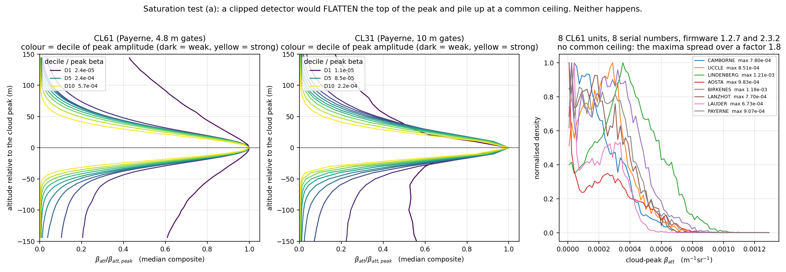

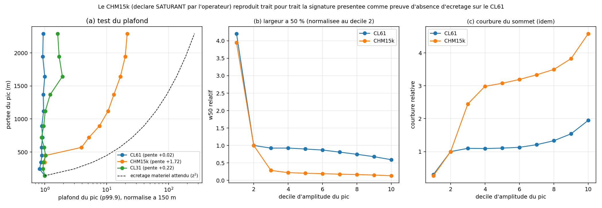

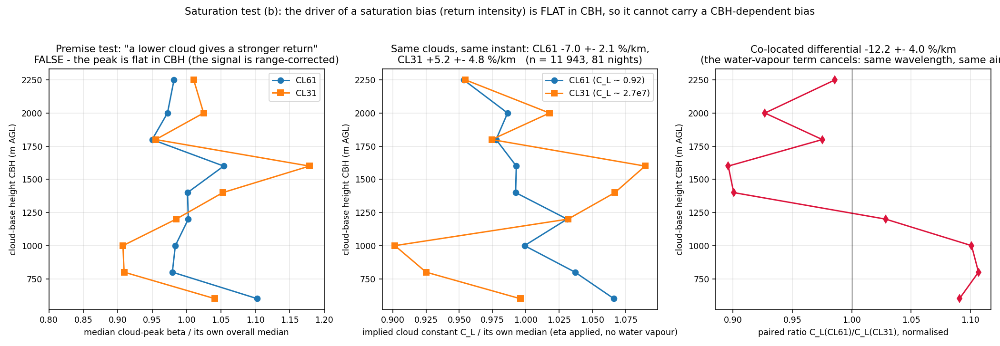

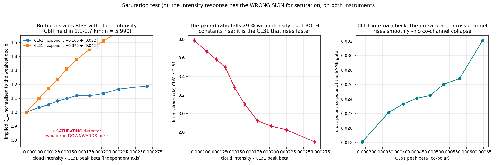

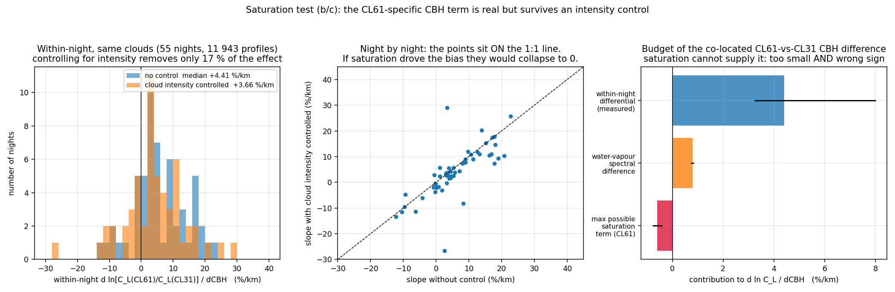

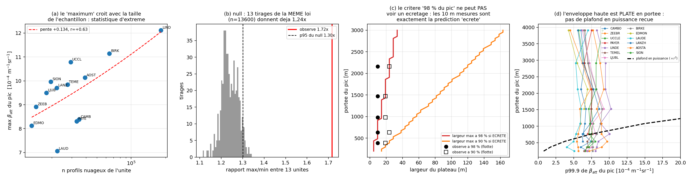

---

## 3. La charge aérosol réelle (AERONET)

### 3.1 CAMS sous-estime-t-il ? — Oui, mais seulement quand il y a de l'aérosol

Sur **312 jours appariés** (2025-01-01 → 2026-05-31, seule période où `D:/CAMS_run_v20` porte des
variables aérosol ; AERONET AOD15 AVG=10 médiane journalière contre CAMS médiane 06-16 UTC) :

| | AERONET | CAMS | rapport médian | r | r_log | RMSE |
|---|---|---|---|---|---|---|
| AOD@1064 nm | 0,0394 | 0,0392 | **0,935** (p10 0,48 ; p90 1,70) | 0,83 | 0,72 | 0,0323 |

Ce chiffre global **cache un biais dépendant de la charge**, qui est la vraie correction à retenir :

- pente log(rapport) ~ log(AOD_AERONET) = **-0,269 ± 0,040, p = 1,17e-10** (n = 312) ;
  après retrait de la saison (cos/sin DOY) : **-0,408 ± 0,038, t = -10,73** → ce **n'est pas** saisonnier ;
- **quintile supérieur** (AOD ≥ 0,0647, n = 63) : rapport médian **0,655** [0,568 ; 0,767] ;
  quintile inférieur : 1,127 [0,934 ; 1,282] ; Mann-Whitney p = 2,45e-08 ;
- déciles : 1,291 / 1,068 / 1,028 / 1,187 / 1,068 / 0,902 / 0,983 / 1,029 / **0,638** / **0,719**.

> **Sur les nuits chargées — celles qui comptent — CAMS est bas de 28 à 36 %, pas de 9,5 %.**

Deux réserves méthodologiques : le « contrôle indépendant » à 532 nm n'est **pas** indépendant
(corr des rapports = 0,889 ; le rapport interne CAMS 532/1064 = 2,652 est cohérent avec l'AERONET
500/1064 = 2,557), et **65 % des 312 jours ne sont ni une nuit gardée ni une nuit récupérée** — la
statistique globale est dominée par des jours qui ne sont pas des nuits de calibration. Traceur
indépendant sans hypothèse optique : PWV CAMS / PWV AERONET = **0,861** (biais -13,5 %, r_log 0,96) →
la troncature de colonne est réelle (cf. § 3.4).

### 3.2 La question ouverte « AOD 36× trop faible » est-elle tranchée ? — OUI

Elle est tranchée, mais **pas** au sens d'« il n'y avait pas de déficit ». Le tableau qui compte
(charge requise par chaque mécanisme candidat contre charge disponible, fenêtre 2,75-5,25 km) :

| mécanisme | τ(1064) requis | CAMS disponible | rapport requis/CAMS | statut |
|---|---|---|---|---|
| **terme B** (rétrodiffusion aérosol **dans** la fenêtre) — mécanisme **vivant** | 0,008 à 0,034 | médiane 0,00647 ; p90 0,0212 (0,0239 nuits récupérées) ; max 0,0998 | **1,24× à 5,25×** | **dans la distribution observée** |
| **R15** (extinction **sous** la fenêtre, S faux) — déjà classé négligeable et de signe faux | 0,29 à 0,80 | CAMS sous-fenêtre ; colonne AERONET totale 0,0394 | 16× à 45× le CAMS, et **7,4× à 20,3× la colonne AERONET mesurée** | **tué par AERONET seul** |

Autrement dit : le fameux « 36× » **n'a jamais concerné que le mécanisme mort** (extinction sous la
fenêtre), et pour celui-là AERONET suffit à le tuer sans même invoquer CAMS. Le mécanisme vivant, lui,
ne demande que 1,2 à 5,3× la charge CAMS **en fenêtre** — parfaitement disponible, d'autant que CAMS
est justement bas de ~30 % sur les nuits chargées.

**Fermeture par la géométrie** (modèle direct fermé `rayleigh_availability/forward_scan_transmission`
+ `forward_model`, estimateur de production, S = 49,6 sr mesuré, AOD imposée = valeur AERONET du
groupe) : à l'AOD **mesurée**, il suffit de donner à l'aérosol sa vraie hauteur d'échelle.

- nuits **gardées** (AOD 0,0389) : pente simulée **-5,9 %/km** pour H = 510 m (observé -5,85 %/km) ;
- nuits **récupérées** (AOD 0,0412) : **-23,4 %/km** au maximum, vers H = 1300 m (observé -26,5 %/km ;
  le modèle plafonne 11 % en dessous) ;
- une couche placée **entièrement sous la fenêtre** (0,1-1,5 km) donne **+0,00 %/km** quelle que soit
  l'AOD (testé jusqu'à 0,1225) — c'est cette géométrie-là qui exigeait 36×.

Contraste correspondant de l'AOD **au-dessus de 2 km** : 0,0007 (1,9 % de la colonne) contre 0,0090
(21,8 %) → **facteur 13 sur la partie libre pour 6 % d'écart sur la colonne totale**.

### 3.3 Les nuits récupérées par v2.2 SONT plus chargées

L'énoncé inverse (« la charge intégrée ne les distingue pas ») est **réfuté**. Partition recalculée :
43 nuits gardées v2.0, 107 récupérées v2.2, 0 perdue (Payerne CHM15k A, 559 nuits, 2025-01-01 →
2026-07-13). CAMS **nocturne** (D-1 18 UTC → D 06 UTC, altitudes reconstruites hydrostatiquement) :

| bande | gardées | récupérées | rapport | p (Mann-Whitney) |
|---|---|---|---|---|
| colonne AOD@1064 | 0,0282 (n=43) | 0,0436 (n=95) | **×1,55** [IC95 1,24 ; 1,73] | **0,0021** |
| surface-2 km AGL | 0,0113 | 0,0159 | ×1,41 | 0,021 |
| 2-6 km AGL (fenêtre de fit) | 0,0080 | 0,0131 | ×1,65 | 0,0017 |
| 2-4 km AGL | 0,00537 | 0,00895 | **×1,67** | **0,00026** |
| 4-6 km AGL | 0,00269 | 0,00374 | ×1,39 | 0,046 |

AERONET le dit aussi dès qu'on utilise la journée entière au lieu de la seule règle d'encadrement :
0,0309 (n = 41) contre 0,0376 (n = 95), **×1,22, p = 0,0187**. La règle d'encadrement soir/matin donne
p = 0,215 non parce que l'effet est absent, mais parce que l'observable est diluée (corr(log)
encadrement AERONET ↔ colonne CAMS nocturne = 0,64, contre 0,96 entre CAMS diurne et CAMS nocturne :
la perte vient d'AERONET, pas du jour/nuit ; rapport minimal détectable à 80 % de puissance = ×1,33).
Ce résultat **confirme l'acquis mémoire** : les nuits récupérées sont bien chargées en aérosol.

**Mais la charge n'est pas le discriminant — la forme l'est.** Pente log de R(z) = signal/p_mol :

| fenêtre | gardées | récupérées | p |
|---|---|---|---|
| 2-6 km AGL | -4,41 %/km (n=40) | **-22,59 %/km** (n=99) | 1,7e-12 |
| 3-6 km | -2,21 | -11,16 | 1,5e-06 |
| 4-6 km | -0,62 | +0,93 | 0,96 (**aucune séparation au-dessus de 4 km**) |

Modèle logistique P(récupérée) : avec log(AOD colonne) + 2 harmoniques saisonnières,
β = +0,451 ± 0,486 (z = +0,93, p = 0,35) ; **en ajoutant la pente R(z), le coefficient d'AOD
s'effondre à +0,058 ± 0,343 (z = +0,17) tandis que la pente domine (-1,598 ± 0,378, z = -4,23)**.
Confondants à ne pas oublier : jour de l'année médian 72 contre 139 (p = 5,4e-07) et PWV AERONET
0,737 contre 1,282 cm (×1,74, p = 3,8e-06).

Enfin, l'AOD **prédit la pente mais pas la constante** : AOD AERONET → pente log R(z) r = -0,43
(p = 2,0e-6, n = 115) ; AOD AERONET → C_L/médiane du flux **r = -0,02 (p = 0,84)**. La charge en
aérosol n'est donc **pas** un prédicteur utilisable de C_L.

### 3.4 Rapport lidar et vapeur d'eau — deux acquis opérationnels

**Les 52 sr du code sont validés.** AERONET inversion almucantar niveau 1.5, produit LID, Payerne
2025-01 → 2026-08, n = 1425 : **S@1020 nm médiane 49,6 sr, moyenne 52,5 sr, IC 95 % [51,7 ; 53,4]**,
p10-p90 = 33,7-76,8 sr. Test contre 52 sr : t p = 0,23 ; Wilcoxon p = 0,050. (S@870 = 48,9 ;
S@675 = 48,3 ; S@440 = 64,1 sr.) Impact sur C_L via le modèle direct, couche 0,1-1,5 km sous la
fenêtre, AOD médiane 0,041 : S = 33,7 → +4,3 % ; S = 49,6 → **+0,4 %** ; S = 76,8 → -2,5 %.
**Aucune action nécessaire sur `lidar_ratio_aerosol = 52.0`.**

**Le PWV de CAMS est -26 % à Payerne dans l'archive 1° — défaut d'orographie, déjà corrigé en 0,4°.**
n = 192 radiosondages appariés à ±1 h (2025-01-01 → 2026-03-19) : PWV médian sondage **1,400 cm**,
AERONET 1,188 cm, **CAMS 0,963 cm** ; biais moyen relatif AERONET -13,6 % (r = 0,991), **CAMS -26,2 %**
(r = 0,972). Cause : le point de grille CAMS 1° le plus proche est **46,5 °N / 7,0 °E** (Préalpes
fribourgeoises), surface modèle **1393,8 m ASL, soit 902,8 m au-dessus de Payerne (491 m)** ; le sondage
place **40,3 % de la colonne d'eau sous cette surface** (0,537 cm médian). Au-dessus de sa propre
surface, CAMS est au contraire **+23,3 % trop humide**. Comparaison CAMS-AERONET par époque :
**-14,5 % en 1° contre +1,7 % en 0,4°** (point 46,8 °N / 6,8 °E) ; contrôle saisonnier JJA sur le 1° :
-14,2 %, donc ce n'est pas un effet de saison. Ce défaut concerne les fichiers **mensuels
2025-01 → 2026-05**, c'est-à-dire la quasi-totalité du corpus de calibration — et il se retrouve
indépendamment dans le § 4 (colonne sous-nuage CAMS trop sèche de +11,8 % à 500 m).

**Deux pièges de données à connaître** : (i) la variable `z` des fichiers `CAMS_Beta_*` est un champ de
**surface** (100 niveaux sur 101 = fill, saturation int16 à -32768) — un `z/9,80665` naïf donne une AOD
colonne de 0,0023 au lieu de 0,0376 (**facteur 16**) ; utiliser
`calibration.water_vapor_correction.water_vapor.cams_levels_all_times`. (ii) Les fichiers CAMS
**journaliers** (≥ 2026-06-01) ne portent **aucune** variable aérosol → aucun appariement possible
après le 2026-05-31 ; 12 nuits sur 150 sans AOD, 4 sans rétrodiffusion.

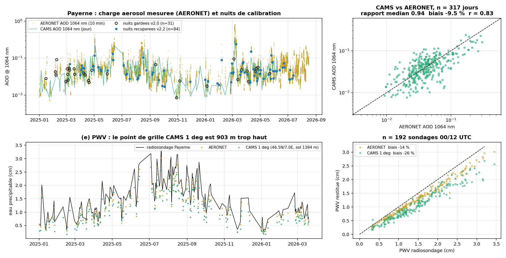

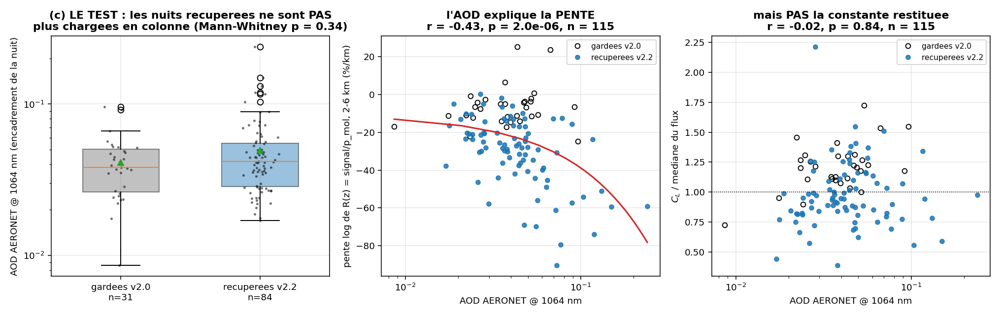

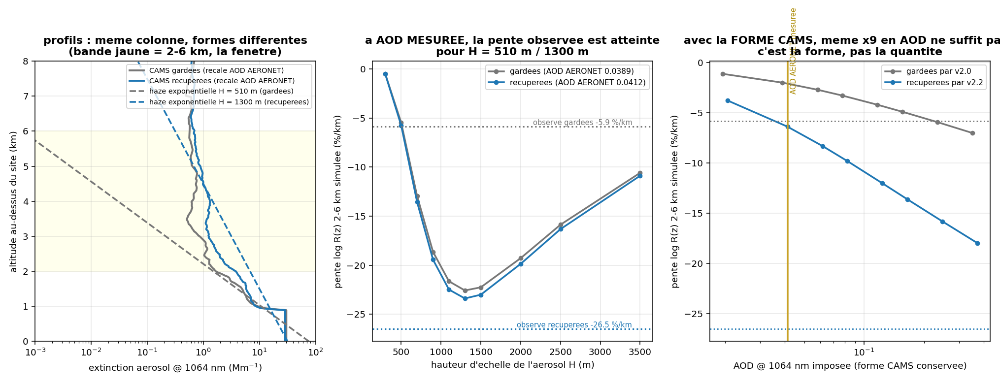

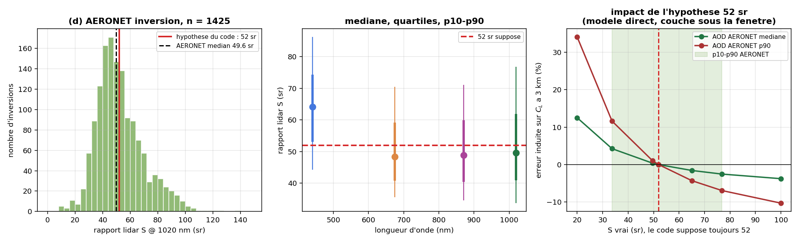

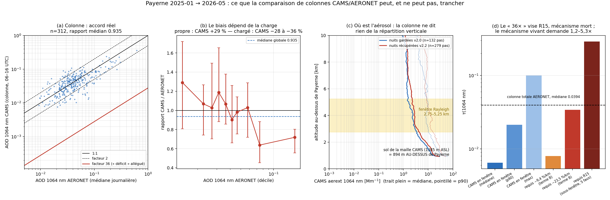

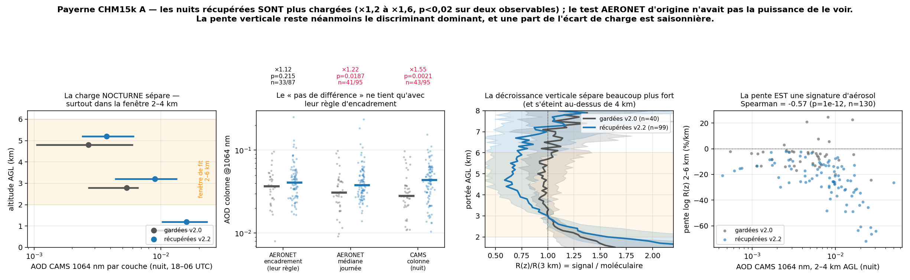

---

## 4. WV ou η ? Le verdict des radiosondages

### 4.1 Réponse : la vapeur d'eau n'est PAS disculpée — mais elle n'explique que ~18 %

La question posée était : la pente **+8,3 %/km** du résidu CL61 (contexte, effets fixes station)
s'effondre-t-elle quand on remplace la colonne WV de CAMS par celle du radiosondage de Payerne, tout le
reste identique ? La chaîne a été rejouée à l'identique depuis les L1 (reproduction exacte de
l'opérationnel : 7955 profils / 70 jours ; 20260315 → C_L = 1,2502 contre 1,250228 en base).

| estimateur | CAMS | sondage | différence appariée | lecture |
|---|---|---|---|---|
| **within-night** (effets fixes jour, SE groupée) | +3,11 ± 2,34 %/km | +2,66 ± 2,26 %/km | **-0,45 ± 0,34 %/km** [-1,12 ; +0,22] | ≤ ~12 % de 8,3 %/km |
| **across-night** (médianes journalières, 59 jours) — *l'estimateur qui correspond au résidu réseau à effets fixes station* | +5,96 ± 2,90 %/km | +4,56 ± 2,86 %/km | **-1,46 ± 0,48 %/km (3,0 σ)** | **17,6 % du résidu réseau ; 24 % de la pente de Payerne** |
| bande basse CBH 504-898 m (n = 720, 17 nuits) | — | — | **+4,64 ± 1,82 %/km** (SE clusterisée par nuit) | de signe **opposé** |

Jackknife -1,65 à -1,29 ; Theil-Sen -1,39 ; pondérée -1,78 → l'effet across-night est robuste.

**Et le mécanisme invoqué pour disculper la WV est faux.** « CAMS L137 et le sondage donnent la même
colonne sous-nuage à ~1 % près » ne résiste pas à la mesure avec la cartographie exacte du code
(interpolation linéaire en AGL + remplissage **constant** sous le plus bas niveau), n = 127 paires
lancer/pas-CAMS sur 59 jours — **sondage/CAMS - 1** :

| CBH | 500 m | 800 m | 1200 m | 1600 m | 2000 m | 2400 m |
|---|---|---|---|---|---|---|
| toutes archives | **+11,8 %** | +7,0 % | +2,6 % | -0,0 % | -0,6 % | -1,9 % |
| archive **1°** (105 lancers) | **+13,8 %** | | | | | -2,8 % |
| archive **0,4°** (22 lancers) | **-3,3 %** | | | | | +0,8 % |

(écarts-types 11-17 %). C'est **exactement le défaut d'orographie du § 3.4** : le plus bas niveau modèle
CAMS 1° est à **903 m AGL** au-dessus de Payerne (point 46,5 N / 7,0 E, 1385 m ASL) contre **298 m AGL**
pour le 0,4° (46,8 N / 6,8 E, 779 m ASL) ; sous ce niveau, `n_wv` est **constant**. Et la différence
appariée se sépare en conséquence : **1° → -1,12 ± 0,50 %/km ; 0,4° → +0,43 ± 0,23 %/km**.

> **La contamination WV de la pente CBH est un artefact d'ARCHIVE (1°, orographie +894 m), pas une
> propriété de CAMS.**

### 4.2 Le levier WV n'est pas nul en bas — il y est maximal

L'énoncé « dans la bande CBH 450-900 m le levier WV est nul » est **réfuté**, et sa réfutation est
instructive parce qu'elle confond l'**amplitude** de la correction avec sa **dérivée**.
|d ln T2_wv/dz| mesuré sur 162 sondages Payerne 2026 (CL61, 910,74 nm, FWHM 1,0 nm) :

| bande | 450-900 m | 900-1400 | 1400-1900 | 1900-2400 | 2400-3000 |
|---|---|---|---|---|---|
| levier | **11,15 ± 0,20 %/km** | 7,84 ± 0,16 | 5,29 ± 0,14 | 3,51 ± 0,12 | 2,19 ± 0,10 |

Sur les 720 profils réels (CAMS à l'heure du profil) : **15,44 %/km**. Le levier est donc **maximal en
bas, 5× celui de 2400-3000 m**, parce que d(2τ)/dz est proportionnel à n_wv(z) — les valeurs
thermodynamiques citées à l'appui de « levier nul » (PW sous la base 3,97 mm, T2_wv(cbh) = 0,9030)
sont correctes, c'est l'inférence qui ne l'est pas. Signe vérifié empiriquement :
ln(C_L,cams / C_L,snd) contre -ln(T2_cams / T2_snd) → pente **+0,960, r = +0,998** (n = 314). Le terme
WV apporte **+15,4 %/km** au dC_L/dCBH de cette bande, soit **36 %** des ~43 %/km.

Il faut aussi retirer le chiffre « +40,3 ± 6,9 %/km » de la bande basse : n_eff de Kish = **3,9 nuits**,
3 nuits font 78 % des profils, l'OLS groupé avec SE clusterisée donne **+4,67 ± 22,73 %/km**,
l'across-night pondéré donne **-11,85 %/km (signe inverse)**, et le jackknife par nuit sur l'across
donne **+42,2 ± 28,9 %/km (1,5 σ, non significatif)**. Cette bande n'a pas la puissance de trancher
quoi que ce soit.

Levier de commun-mode non testé par le swap et à garder en tête : faire varier λ de 909,5 à 912 nm et
la FWHM de 0,3 à 3,4 nm déplace le levier de -7,75 à -11,8 %/km (**±3,5 %/km**).

### 4.3 Ce qui reste du côté η

Le contrôle co-localisé garde toute sa force : le **CL31 voit exactement la même colonne d'eau les
mêmes nuits** et sa pente within-night est de **signe opposé** (-2,42 ± 2,37 %/km, n = 7970, 57 nuits,
CBH médiane 1362 m) à celle du CL61 (+3,11 ± 2,34 %/km) → écart **+5,55 %/km**. La seule part que la WV
peut légitimement revendiquer dans cet écart est la différence **spectrale** (+0,79 %/km, § 2.4) ; le
reste est instrumental.

**Sensibilité mesurée, pas dérivée** : en ré-exécutant la calibration nuage complète avec le profil de
sondage multiplié par 1,2 puis 2,0 → **0,036 %/km par % d'erreur de colonne** (×1,2 : +0,72 ± 0,07 %/km ;
×2,0 : +2,97 ± 0,29 %/km). Fabriquer **tout** le +8,3 %/km exigerait donc une erreur de colonne de
+230 % — hors d'atteinte. La bonne lecture est donc : **la WV pèse ~18 % du résidu, pas 0 ni 100 %.**
La bande 910,55 nm vue par le CL61 est d'ailleurs déjà partiellement saturée (doubler la colonne ne
multiplie l'épaisseur optique effective que par 1,62 ; exposant effectif 0,69), ce qui rend la
correction intrinsèquement robuste aux erreurs de colonne.

### 4.4 Bonus Rayleigh : la référence moléculaire est innocente

Sur **162 lancers 00 UTC** (2026-01-01 → 2026-06-15, grille 15 m AGL jusqu'à 12 km, formulation
Bucholtz 1995 du code, β_att = β_mol·T_mol²), pente de ln(test/vérité) sur **3-5 km** :

| référence | pente 3-5 km | pente 2-8 km | biais de niveau à 4 km |
|---|---|---|---|
| **CAMS** | **-0,010 ± 0,242 %/km** (p5 -0,368 ; p95 +0,415) | +0,006 ± 0,079 %/km | -0,087 ± 0,314 % |
| **US Standard 1976** | -0,016 ± 0,531 %/km (p5 -0,622 ; p95 +1,033) | -0,167 ± 0,398 %/km | -0,088 ± 1,109 % |

Résultat identique à 910,55 et 1064,47 nm (à 0,003 %/km près) : le terme est purement thermodynamique
(P/T). L'estimation antérieure (≤ 0,7 %/km, contexte) est **confirmée et resserrée d'un facteur ~3**.
L'US Std n'a pas de biais moyen mais une dispersion 3,5× plus grande (jusqu'à ±2 % à 4 km).

*Décalage temporel du sondage :* |dt| médian 3,21 h (contre 0,69 h pour CAMS). Le biais de colonne se
dégrade lentement (+0,53 % pour |dt| < 1,5 h ; +1,53 % pour 4,5-6 h), et le sous-échantillon
|dt| ≤ 2 h (n = 2221, 46 nuits) donne la même conclusion within-night (+0,34 ± 0,56 %/km).

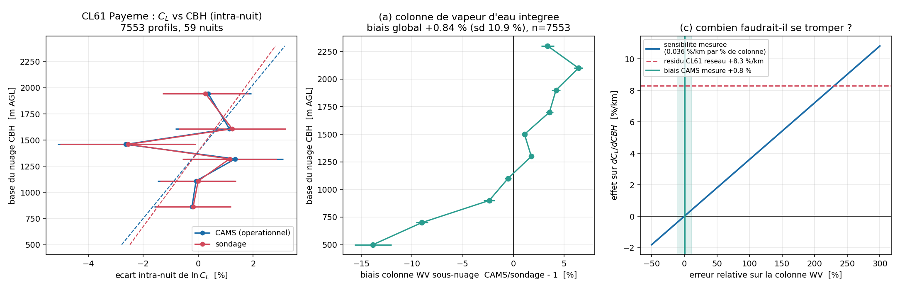

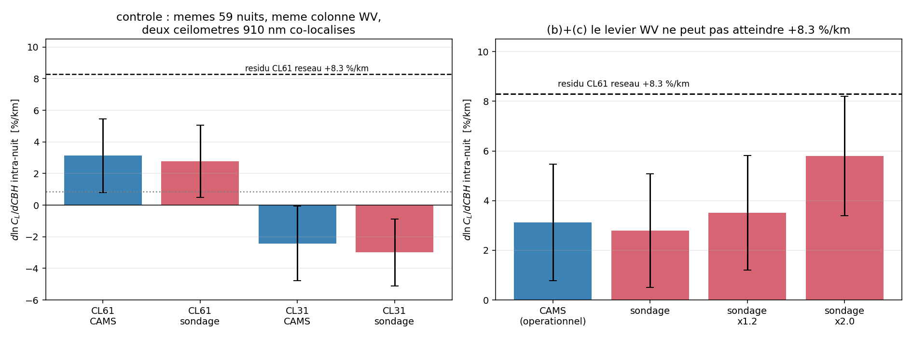

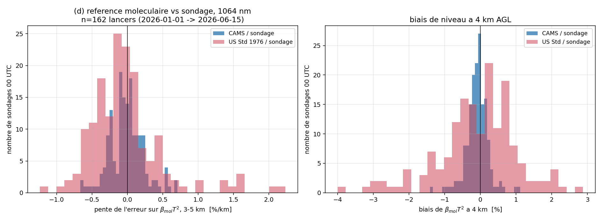

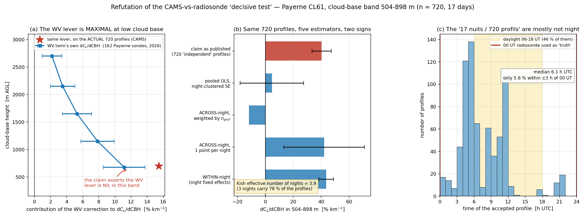

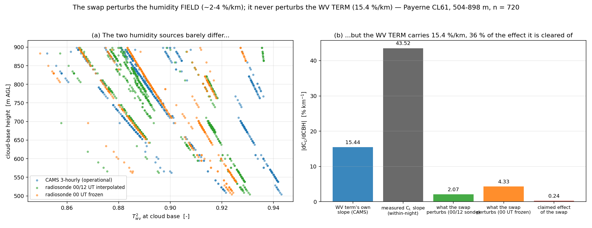

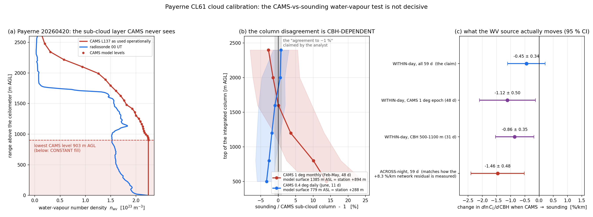

---

## 5. Tableau de synthèse

### 5.1 Gradient Rayleigh intra-nuit (dC_L/dz)

| mécanisme | amplitude mesurée | part expliquée | statut |
|---|---|---|---|
| **Dark dépendant de la portée, CL61** | modèle direct -6,13 %/km (IC95 [-8,02 ; -5,07]) ; sur 15 vraies nuits claires, retire **+8,89 ± 0,57 %/km** (t = +15,5) | **66 %** de son gradient intra-nuit (-13,51 → -5,64 %/km) | **ÉTABLI** (non contre-expertisé) |
| Dark CHM15k, **forme en cuvette** → pente | modèle direct +2,76 %/km, IC95 [-5,12 ; +4,45] ; vraies nuits -0,99 ± 0,22 %/km (dégrade) | **~0 %** | **ÉCARTÉ** comme source de pente |
| Dark CHM15k → **niveau** de C_L | piédestal -2,557e-4 ± 4,73e-5 counts/s (-5,4 σ) → biais de C **-17,2 %** à 4,5 km | s.o. (erreur d'échelle, pas de pente) | **ÉTABLI** (amplitude) |
| **Dérive temporelle** du dark CHM15k | χ² = 5,73 / 5 ddl, **p = 0,33** ; bootstrap : 6 blocs d'une seule journée reproduisent l'étendue « 10 semaines » (p = 0,247) | **0 %** | **NON ÉTABLI** — hypothèse ni confirmée ni exclue |
| Fuite lumineuse sous capot (carton CHM15k inclus) | X = +1,33 ± 1,06 % / -0,82 ± 0,68 % / -0,88 ± 1,09 % | 0 % | **ÉCARTÉ** |
| Biais thermique du dark (mesure diurne → nuit) | niveau : r = -0,07 (cycle 24 h), jour-nuit 0,8 σ ; bruit : +0,223 / +0,368 / +0,272 %/K → σ surestimé de 3-6 % | marginal | **QUANTIFIÉ** |
| Aérosol **dans** la fenêtre (terme B) | requiert τ(1064) = 0,008-0,034 ; CAMS en fenêtre médiane 0,00647, p90 0,0212 | rapport requis/disponible **1,24-5,25×**, dans la distribution | **VIVANT** |
| Aérosol **sous** la fenêtre / S faux (R15) | requiert τ = 0,29-0,80 = **7,4-20,3× la colonne AERONET mesurée** | 0 % | **MORT** (tué par AERONET) |
| Référence moléculaire (CAMS vs sondage) | -0,010 ± 0,242 %/km sur 3-5 km (US Std -0,016 ± 0,531) | 0 % | **ÉCARTÉ** |
| Rapport lidar 52 sr | AERONET 49,6 sr médian / 52,5 moyen [51,7 ; 53,4], n = 1425 → effet sur C_L +0,4 % | ≤ 3 % en pire cas (S = 33,7 sr) | **VALIDÉ** |

### 5.2 Résidu nuage en CBH (CL61, +8,3 %/km réseau — contexte)

| mécanisme | amplitude mesurée | part expliquée | statut |
|---|---|---|---|
| **Saturation / écrêtage CL61** | pente enveloppe p99,9 **+0,06** (attendu +2,0 si écrêtage ; CHM15k témoin +1,58) ; invariant O'Connor d log I/d log Pic **+0,089 ± 0,002** ; exposant intensité **+0,165 ± 0,022** (signe opposé) ; levier CBH -0,28 à -1,32 %/km ; fermeture C_L = 1,144 (> 1) | **0 %** et **de signe opposé** | **ÉCARTÉ** |
| **Colonne WV CAMS** (archive 1°, orographie +894 m) | swap sondage : across-night **-1,46 ± 0,48 %/km** ; within-night -0,45 ± 0,34 ; bande basse +4,64 ± 1,82 ; 1° -1,12 ± 0,50 contre 0,4° +0,43 ± 0,23 | **17,6 %** du résidu réseau (24 % de Payerne) | **ÉTABLI PARTIEL** (l'exonération de la WV est réfutée) |
| **WV spectrale** (910,74/1,0 nm vs 909,70/6,0 nm) | pente CBH injectée +7,13 %/km (CL61) contre +6,34 (CL31), différence appariée **+0,79 %/km** [+0,67 ; +0,88] | ~18 % de l'écart CL61-CL31 (+4,41 %/km) ; ~10 % du résidu | **ÉTABLI** |
| **η / diffusion multiple (FOV, densité)** — *suspect principal* | exposants densité **+0,375 ± 0,042 (CL31) contre +0,165 ± 0,022 (CL61)** ; tables η figées à α = 10 /km ; reste **+2,9 à +3,7 %/km** après contrôle intensité ET WV spectral | **~35-45 %** | **SUSPECT PRINCIPAL, non encore mesuré** |
| Écart CL61-CL31 within-night (le fait à expliquer) | **+4,41 %/km** [+3,23 ; +8,01], 44/55 nuits, p = 5,2e-6 ; survit au contrôle d'intensité (+3,66 %/km) | — | **ÉTABLI** |
| Bloc optique CL31 (07/07/2026) — contrôle positif | C_daily ×2,255 (+125 %), p = 5,9e-7 ; dark ×2,0 dans les mêmes unités | s.o. | **ÉTABLI** (changement de gain pur) |

### 5.3 Diagnostic transverse

| point | valeur | statut |
|---|---|---|
| Nuits récupérées v2.2 plus chargées que gardées v2.0 | CAMS nuit **×1,55** [1,24 ; 1,73] p = 0,0021 ; 2-4 km ×1,67 p = 0,00026 ; AERONET pleine journée ×1,22 p = 0,019 | **ÉTABLI** (confirme l'acquis) |
| Le discriminant réel de la sélection | pente log R(z) 2-6 km : -4,41 contre -22,59 %/km, p = 1,7e-12 ; en logistique la pente écrase l'AOD (z = -4,23 contre +0,17) | **ÉTABLI** |
| CAMS sous-estime l'AOD sur les nuits chargées | rapport global 0,935 mais **0,655** [0,568 ; 0,767] au quintile supérieur ; pente log/log -0,269 ± 0,040 | **ÉTABLI** |
| PWV CAMS 1° à Payerne | **-26,2 %** contre sondage (n = 192) ; 40,3 % de la colonne sous la surface modèle ; 0,4° : +1,7 % | **ÉTABLI, ACTIONNABLE** |
| AOD comme prédicteur de C_L | r = -0,02, p = 0,84 (n = 115) | **INUTILISABLE** |

---

## 6. Actions, classées par rapport impact / effort

### A. Impact fort, effort faible à moyen

**A1 — Soustraire un profil de dark b(z) mesuré au CL61 avant l'ajustement Rayleigh.**
*Corrige un biais réel.* Gain mesuré : **+8,89 ± 0,57 %/km** sur la pente intra-nuit (15 nuits, t = 15,5)
et dispersion nuit-à-nuit de C de 16,1 % → 13,7 %. **Attention au piège** : la branche existante
soustrait un **intercept scalaire ajusté**, mécanisme déjà réfuté et qui aggrave les résultats
(`calibration/rayleigh/calibration.py:335`, option `calibration/config.py:230`
`subtract_background: bool = False`). Il faut un **profil b(z) poolé mesuré**, pas un scalaire, et il
doit être soustrait **avant** la normalisation, en unités de `rcs_0/z²`, par type d'instrument et par
unité. Prévoir un stockage à côté de `cl31_b_dark.npz` (cf. mémoire réseau).

**A2 — Purger l'archive CAMS 1° du chemin vapeur d'eau à Payerne (et partout où l'orographie du point
de grille dépasse la station de plus de ~300 m).**
*Corrige un biais réel.* PWV -26,2 % ; effet across-night sur dC_L/dCBH -1,46 ± 0,48 %/km, entièrement
porté par l'époque 1° (-1,12 ± 0,50 contre +0,43 ± 0,23 en 0,4°). Le sélecteur d'archive est
`scripts/run_network_calibration.py:117-118` (`_CAMS_FB` / `ALC_CAMS_DIR_FALLBACK`). Deux options,
par ordre de préférence : (i) recalculer les mois 2025-01 → 2026-05 avec le 0,4° ; (ii) à défaut,
**refuser** le 1° pour les stations dont l'écart d'orographie dépasse un seuil, et le signaler par un
flag plutôt que de calibrer avec une colonne tronquée de 40 %.

**A3 — Remplacer le remplissage CONSTANT de n_wv sous le plus bas niveau modèle par une extrapolation
physique.** *Corrige un biais réel, effort faible.*
`calibration/water_vapor_correction/water_vapor.py:481-486` (`wv[: first[0]] = wv[first[0]]`). C'est ce
remplissage qui transforme les 903 m manquants du point de grille 1° en une sous-estimation de colonne
de +11,8 % à CBH = 500 m. Une extrapolation en n_wv ∝ exp(-z/H_wv) calée sur les deux plus bas niveaux
disponibles suffit ; à valider contre les 192 sondages appariés.

**A4 — Appliquer le dark CHM15k comme correction de NIVEAU, pas de pente.**
*Corrige un biais réel (échelle), ne touche pas la pente.* Un unique profil b(z) poolé (les 6 dates ne
sont pas distinguables) ; effet attendu de l'ordre de **-17 % sur C** dans une fenêtre 4,5 km.
Interdiction explicite d'utiliser la **moyenne plate** de ce dark : elle fabriquerait un faux
+10,09 ± 0,81 %/km de correction de pente. Même point d'insertion que A1.

**A5 — Tenir une liste d'événements matériels (changements de bloc optique, laser, fenêtre).**
*Corrige un biais réel.* Le 07/07/2026 sur le CL31 de Payerne déplace C d'un facteur **2,255**
(p = 5,9e-7) ; un Kalman qui lisse à travers la marche est 2,5× faux (contexte). `optical_module_id`
est vide sur Vaisala → seule une liste d'événements maintenue à la main peut redémarrer le filtre au
bon endroit.

### B. Impact fort, effort élevé

**B1 — Ouvrir la branche η : sortir les tables PVC de leur α = 10 /km figé.**
*Corrige un biais réel — c'est le suspect principal des ~35-45 % restants du +8,3 %/km CL61.*
`calibration/cloud/_filters.py:20-50` (`_ETA_CL31` … `_ETA_CHM15K`, tabulées en CBH seulement) et la
fonction d'application juste en dessous. Les données pour le faire existent déjà : l'exposant de
réponse à la densité mesuré ici (+0,375 CL31 contre +0,165 CL61, 11 943 profils appariés) est
directement l'observable qui contraint dη/dα. Route recommandée : re-tabuler η(CBH, α) avec les mêmes
tables PVC (Hogan 2006, a_G = 5,5 µm), α estimé par profil depuis l'invariant O'Connor à fenêtre
géométrique fixe (S/η = 20,9 sr mesuré ici), et vérifier que l'écart CL61-CL31 within-night tombe
sous 1 %/km.

**B2 — Refaire une campagne dark capable de trancher la dérive.**
*Change seulement le diagnostic (mais conditionne A1/A4).* Protocole minimal imposé par ce qu'on vient
d'apprendre : blocs capotés de **> 6 h**, **aux mêmes heures** d'une date à l'autre, avec au moins un
cycle de 24 h par saison, et **SEM temporelle corrigée de l'autocorrélation** (τ = 2,9 à 6,6 profils) —
jamais la SEM inter-portes. Cible de puissance : détecter un changement de piédestal de 1e-4 counts/s,
soit ~40 % du piédestal actuel. Corriger les σ mesurés de +0,223 %/K (CHM15k) / +0,368 (CL31) /
+0,272 (CL61) pour l'écart de température au régime nocturne.

### C. Diagnostic seulement

**C1 — Passer la sélection v2.2 d'un critère de bruit à un critère de FORME.**
*Change seulement le diagnostic pour l'instant, mais c'est la voie du correctif.* La pente log R(z)
sur 2-6 km sépare les deux populations à p = 1,7e-12 (-4,41 contre -22,59 %/km) alors que la colonne
ne les sépare qu'à ×1,55 ; en logistique, la pente écrase l'AOD (z = -4,23 contre +0,17). Le corpus
`rayleigh_availability/{baselines,candidates}/*.json` porte déjà tout ce qu'il faut pour prototyper.

**C2 — Documenter les deux pièges de lecture CAMS.** *Change seulement le diagnostic.*
(i) `z` dans `CAMS_Beta_*.nc` est un champ de **surface** (100 niveaux sur 101 = fill) — passer par
`calibration/water_vapor_correction/water_vapor.py:387` `cams_levels_all_times`, faute de quoi l'AOD
colonne est **16× trop faible** ; (ii) les fichiers CAMS **journaliers** (≥ 2026-06-01) ne portent
aucune variable aérosol.

**C3 — Ne rien changer au rapport lidar.** *Aucune action.* `calibration/config.py:229`
`lidar_ratio_aerosol: float = 52.0` est validé par AERONET (49,6 sr médian, moyenne 52,5 [51,7 ; 53,4],
n = 1425 ; t p = 0,23) ; l'écart résiduel coûte au plus 3 % sur C_L une nuit typique, et +0,4 % à la
valeur médiane.

**C4 — Fermer par écrit deux voies mortes.** *Change seulement le diagnostic.*
(i) La **saturation du CL61** en nuage : écartée par cinq tests indépendants dont un contrôle positif
(le CHM15k, lui, sature : pente d'enveloppe +1,58 contre +0,06) et un test de puissance (une
compression de 10 % serait vue à ~10 σ). (ii) Le mécanisme **R15** (extinction sous la fenêtre avec S
faux) : il exige 7,4 à 20,3× la colonne AERONET **mesurée** — AERONET seul le tue, sans CAMS.
Le mécanisme survivant côté Rayleigh reste la **rétrodiffusion aérosol dans la fenêtre**, dont la
charge requise (1,24 à 5,25× le CAMS en fenêtre) est disponible dans la distribution observée.

---

### Ce que ce rapport ne prétend pas trancher

- **La dérive du bruit électronique du CHM15k** : la campagne n'a pas la puissance de la démontrer ni
  de l'exclure. Ce qui est démontré, c'est un piédestal **constant** et significatif à -5,4 σ.
- **La part exacte du dark CHM15k dans la pente** : les deux calculs (propagation de la forme mesurée
  contre ratio b/S sur signal réel) ne concordent pas en ordre de grandeur ; l'arbitre retenu ici est
  le test direct sur 24 vraies nuits, qui donne ~0 %.
- **Le mécanisme physique précis du dark CL61** dépendant de la portée (afterpulse ? soustraction de
  fond interne ?) : mesuré, non expliqué.
- **La bande CBH < 900 m** du CL61 en nuage : n_eff de Kish = 3,9 nuits, aucune conclusion possible en
  l'état — c'est pourtant là que le résidu est censé se concentrer (contexte +21,2 %/km).
