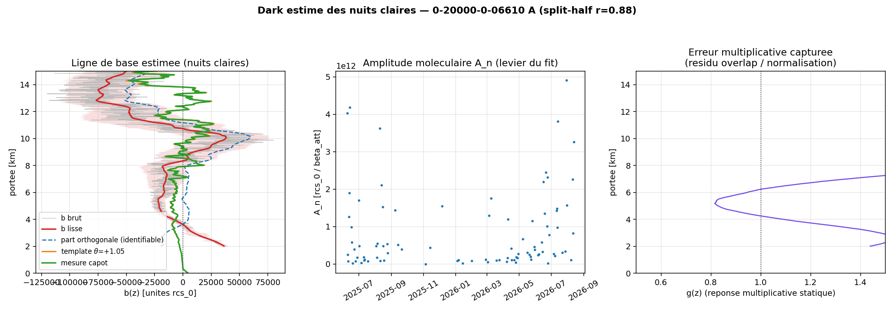
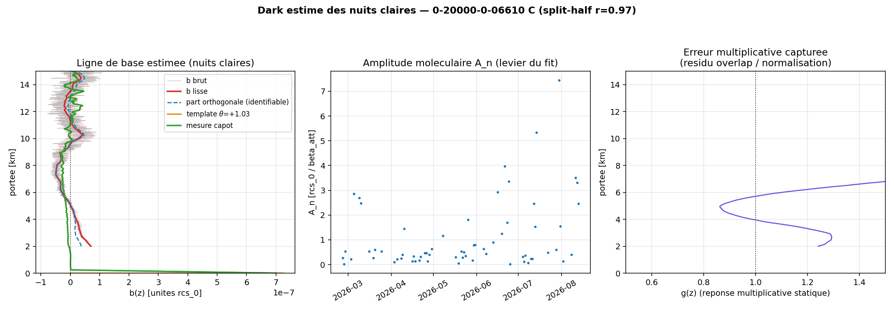
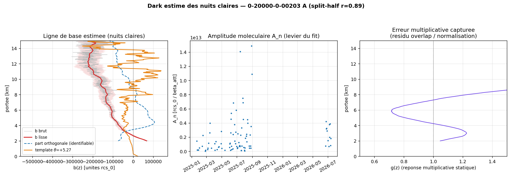
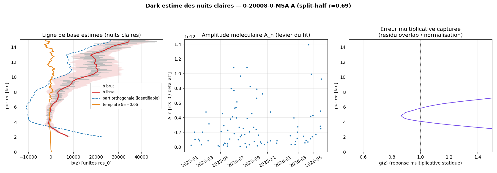
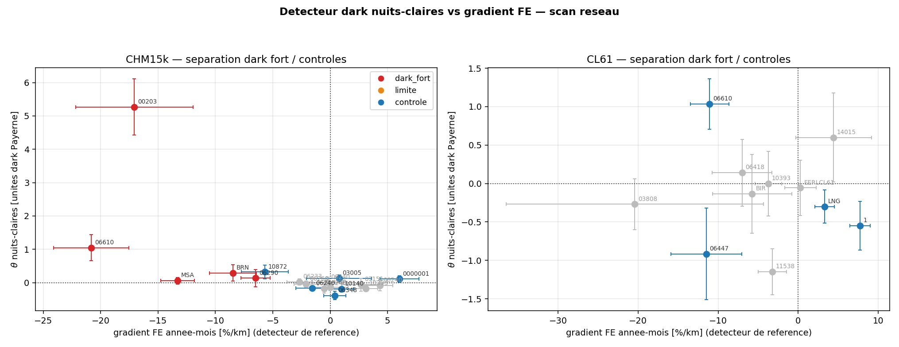
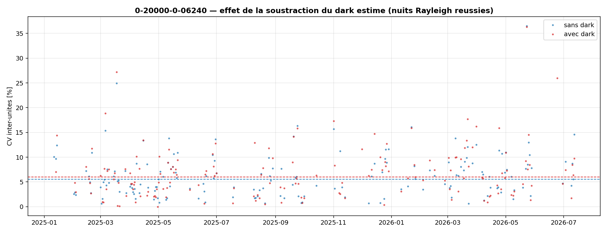
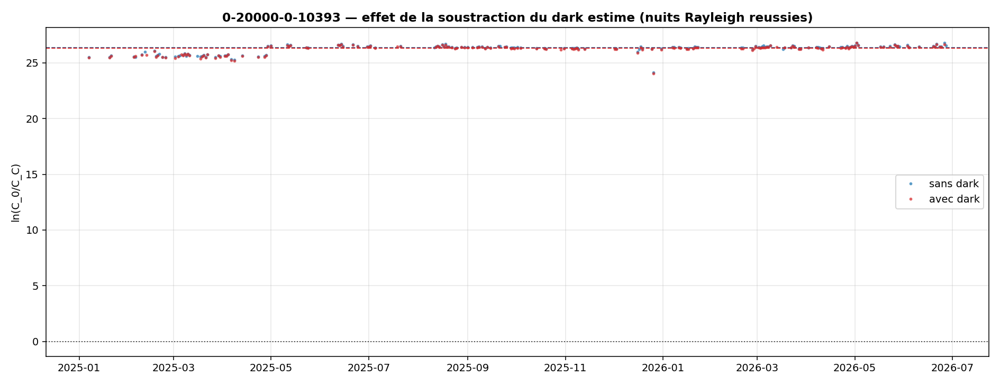

# Estimation du bruit d'obscurité depuis les nuits claires — méthode, limites, scan réseau

*Campagne 2026-08-16. Question opérateur : la méthode d'estimation du dark depuis les profils de
ciel clair nocturne est-elle assez robuste pour identifier les instruments du réseau qui ont
besoin d'une soustraction de fond ? Arrive-t-on à séparer moléculaire et bruit électronique ?
Code : `rayleigh_availability/dark_from_clearsky.py` (+ `dark_clearsky_summary.py`,
`build_dark_npz.py`, `compare_dark_runs.py`). Vérités de terrain : les trois profils capot de
Payerne (`dark_profiles_payerne.npz`, campagne mai–juillet 2026) et les 5 flux « dark fort » du
détecteur FE de la phase 4.*

## 1. Le modèle (v4, verrouillé) et pourquoi les versions intermédiaires ont échoué

Par nuit claire n (segment nocturne du matin, soleil < −8°, médiane par porte) et porte z, en
unités rcs_0 :

```
S_n(z) = A_n · m_n(z) · g(z)  +  B_n · a_n(z)  +  d_n · z²  +  b(z)  +  bruit
```

- **m_n(z)** : backscatter moléculaire atténué calculé de CAMS pour la nuit (Bucholtz × T²_mol,
  × T²_wv à 910 nm) — la seule composante qui varie d'une nuit à l'autre d'une façon **connue** ;
  c'est elle qui sépare moléculaire et électronique.
- **A_n** : amplitude libre par nuit (= C·T²_aérosol ; CV ≈ 0,9–1,3 sur 2025–2026, le levier).
- **B_n · a_n(z)** : régresseur aérosol CAMS (lecteur OmB, chargement contraint ≥ 0) — absorbe
  l'aérosol persistant de troposphère libre qui sinon fuit dans b.
- **d_n · z²** : résidu de soustraction de fond du firmware (plat en counts bruts → ∝ z² en
  rcs_0), variable par nuit.
- **g(z)** : réponse multiplicative **statique**, lissée à 2,5 km — capte les résidus
  d'overlap/normalisation. Sans elle (v1–v3 à pente commune), toute erreur multiplicative de
  portée se déverse dans le canal additif via le gros signal moléculaire de 2–4 km : à Payerne A
  le biais prédit sortait à −62 % pour une vérité de −17 %.
- **b(z)** : la ligne de base électronique statique — la cible. Ordonnée à l'origine de la
  droite pondérée robuste (S − Ba − dz²) vs (A·m), par porte, à travers les nuits.

Le fit alterne (a) droites par porte / (b) WLS par nuit / (c) normalisation ⟨g⟩ = 1, écrêtage
4×MAD partout. Bande de fit 2–15 km ; **en dessous de 2 km la méthode est aveugle par
construction** (aérosol de couche limite et overlap indissociables d'un b lisse sans capot).

## 2. La limite fondamentale, prouvée par injection

Le self-test (nuits synthétiques reconstruites avec les A_n, B_n, d_n, g, σ_n **réels** du flux
+ un b_vrai injecté) démontre :

- **injection zéro** → θ̂ = −0,007 (plancher de faux positif quasi nul) ;
- **injection capot Payerne** (θ_vrai = 1) → θ̂ = 0,71 (pente de réponse λ′, corrigeable) ;
- **injection de forme moléculaire** → non récupérée (corr < 0), et ce dans TOUTES les
  variantes du modèle : **une composante de dark colinéaire à la forme moléculaire moyenne est
  invisible par principe** — un décalage uniforme des A_n glisse le long des droites, même par
  porte. Ce n'est pas un défaut d'implémentation mais une dégénérescence du problème.

Conséquence : le **profil libre b̂(z) n'est pas soustrayable** (sa composante dégénérée est
contaminée par le désaccord aérosol CAMS/réel, ~2–3× l'amplitude vraie à Payerne A). Ce qui est
robuste est un **scalaire** : θ = projection de b̂ sur la **forme capot Payerne du type**
(bande 3–9,5 km), corrigé de la réponse affine mesurée par le self-test sur le flux lui-même :
θ_corr = (θ̂ − θ₀)/(θ̂_capot − θ₀). L'hypothèse de travail est matérielle : même type ⇒ même
forme de ligne de base, amplitude propre à l'unité (rapport 08 §3.3).

**Réponse à la question « sépare-t-on moléculaire et électronique ? »** : oui pour toute
composante du dark de forme différente du moléculaire (le z² du CL61, le piédestal constant,
les structures) ; non, par principe, pour la composante de forme exactement moléculaire — et le
dark CHM15k (« cuvette ») en contient beaucoup, c'est le pire cas ; le CL61 (croissant en
portée) est le cas favorable.

## 2bis. Deux alternatives testées sur question opérateur (benchmark capot Payerne A, vérité θ = 1)

**« Pourquoi CAMS pour l'aérosol, sa verticale est fantaisiste »** — le profil CAMS n'est jamais
soustrait comme vérité : c'est une *forme de régresseur* à amplitude libre par nuit (B_n ≥ 0,
B_n = 0 sur ~40 % des nuits si le fit n'en veut pas). Test de sensibilité depuis le cache :
**avec** le régresseur, θ̂ = +1,05 ± 0,39 ; **sans**, θ̂ = **−0,12** — le détecteur devient
aveugle sur données réelles (l'aérosol réel absorbe la signature du dark dans A_n/g/b). Le
régresseur CAMS n'est pas un raffinement : il suffit qu'il capte la part de variance aérosol
*corrélée entre nuits* pour libérer la direction du dark, même avec une verticale imparfaite —
et la validation capot (θ ≈ 1 sur A et C) arbitre en dernier ressort, péchés verticaux inclus.

**« Et Fourier ? »** — deux axes possibles, tous deux tranchés :

1. *En portée* (le gate-fold historique du rapport 08 §3.8) : il sépare parfaitement le ripple
   périodique verrouillé sur l'horloge (40–80 m) — mais le spectre des darks capot mesurés
   montre que **66 % (CHM15k) / 97 % (CL61) de la variance du dark vit à des périodes > 1 km**,
   la bande de l'atmosphère, et que l'intégrale de biais sur une fenêtre Rayleigh 2,2–6 km est
   portée à **99–100 % par la composante lisse** (une fenêtre de 4 km moyenne un ripple de 60 m
   à ~zéro). La composante que Fourier sait séparer est précisément celle qui ne biaise pas le
   fit ; celle qui biaise est spectralement inséparable de l'atmosphère.
2. *En temps* (« les aérosols, le bruit et le moléculaire n'ont pas le même temps de vie ») —
   implémenté sous sa forme forte (`test_eof_aerosol.py`) : régresseurs aérosol EMPIRIQUES =
   2 modes EOF temporels des résidus inter-nuits centrés par porte (aveugles au statique). Les
   modes capturent bien l'aérosol (45,7 % de la variance nuit-à-nuit) mais le benchmark échoue :
   θ̂ réel = −0,15, pente d'injection λ′ = 0,33 (contre 0,71 avec CAMS) — les chargements EOF,
   libres par nuit et de moyenne non contrainte, absorbent aussi une part du STATIQUE : le dark
   fuit dans les modes. Contraindre la moyenne des chargements renverrait l'aérosol
   climatologique dans b̂ : même mur, déplacé. **Une décomposition interne aux données sépare
   les échelles de temps, pas les moyennes — or le dark est un terme moyen.** L'apport
   irremplaçable de CAMS est d'être une référence *externe* par nuit.

| variante (Payerne A, vérité 1) | θ̂ |
|---|---|
| v4 + régresseur CAMS | **+1,05 ± 0,39** |
| v4 sans aérosol | −0,12 |
| v4 + EOF temporels (2 modes) | −0,15 |

## 3. Validation contre les capots de Payerne

| flux | vérité capot | θ̂ brut | θ_corr | verdict |
|---|---|---|---|---|
| Payerne A (CHM15k, ère post-swap) | 1 par définition | +1,05 ± 0,39 | +1,49 | détection ~3σ, amplitude à +50 % |
| Payerne C (CL61) | 1 par définition | +1,03 ± 0,33 | **+0,96** | quasi exact (forme ~orthogonale) |
| Payerne B (CL31) | (dark ≥ 2 km petit) | — | — | 0 nuit claire Rayleigh dans le run réseau : intestable |


*Payerne A (CHM15k) : au-dessus de 3,5 km le template θ (orange) suit la mesure capot (vert) en
forme ET en amplitude ; sous 3 km et au-delà de 10 km le profil libre (rouge) diverge — les zones
aveugles attendues (aérosol de couche limite ; erreurs d_n amplifiées ×z²).*


*Payerne C (CL61) : la ligne de base croissante en portée est largement orthogonale à la forme
moléculaire — le cas favorable, θ_corr = 0,96.*


*Messina : le dark le plus fort du réseau (θ̂ = +5,3, ~5× Payerne), forme compatible avec le
template. Candidat capot n°1 confirmé.*


*Montsec : ligne de base NULLE sur 2–8 km malgré un FE de −13,3 %/km — le gradient FE de ce site
de montagne n'est pas un dark additif dans la fenêtre Rayleigh.*

Gardes-fous éprouvés en route : (i) tout **écran d'amplitude sur A_n dégrade le détecteur**
(les nuits brillantes ancrent les droites ; l'enlever fait chuter λ′ de 0,74 à 0,24) ; (ii) g
doit être lissé (≥ 2,5 km) sinon il absorbe du désaccord atmosphérique ; (iii) le cache des
extractions par nuit (`dark_clearsky/cache/`) rend chaque variante re-testable en secondes.

## 4. Scan réseau — le détecteur sépare-t-il les « dark fort » des contrôles ?

Scan complet : 19 CHM15k (5 candidats FE « dark fort », 2 cas limites, 12 contrôles dont le
quadruple d'Amsterdam) + 11 CL61 (Payerne CL31 : 0 nuit claire dans le run réseau, validation
CL31 impossible). Table `dark_clearsky/summary.csv` ; le gradient FE année-mois est recalculé
par flux du même CSV réseau (il reproduit la phase 4 : Payerne −20,8, Messina −17,1,
Montsec −13,3, Bern −8,5, Twenthe −6,5).



**CHM15k — le détecteur est SPÉCIFIQUE mais peu sensible :**

- **Messina** : θ̂ = **+5,3 ± 0,8** — dark ~5× Payerne, détection massive (biais libre −191 %).
- **Payerne** : θ̂ = +1,05 ± 0,39 (vérité capot 1). Les deux plus gros FE sont détectés.
- **Aucun faux positif sur 12 contrôles** : tous |θ̂| ≤ 0,39 ; le plus grand est Cabauw
  −0,39 ± 0,13 (signe négatif = ligne de base *positive*, sans corroboration FE) — seuil
  opérationnel θ > +0,5 ⇒ précision 100 % sur ce scan.
- **Bern (+0,29 ± 0,25) et Twenthe (+0,13 ± 0,25)** : direction juste, ~1σ — les darks modérés
  (FE −6 à −8) sont SOUS le seuil de détection de la méthode.
- **Montsec** (FE −13,3) : θ̂ = +0,06 ± 0,10 et profil libre **nul sur 2–8 km** — son gradient
  FE n'est PAS un dark additif dans la zone des fenêtres Rayleigh (site de montagne, 1570 m :
  piste aérosol/orographie). L'estimateur apporte ce que le FE ne peut pas dire : *où en portée*
  se situe le problème — les deux détecteurs sont complémentaires, pas redondants.
- Gottfrieding (+0,32 ± 0,20) : cas limite ré-ouvert (mon FE flags 1+0,5 donne −5,7 ± 2,0 là où
  le flag-1,0-seul de la phase 4 donnait +0,06) — candidat capot de seconde priorité.

**CL61 — rien hors Payerne :** θ̂ ∈ [−1,2 ; +0,6], aucun positif significatif sauf Payerne C
(+1,03 ± 0,33, vérité capot ✓) ; la calibration affine y est peu fiable (planchers θ₀ élevés sur
les fits pauvres, grisés dans la figure). NB : ceci ne teste PAS l'hypothèse « résidu CBH nuage
= dark proche-portée » — la calibration nuage opère à 100–2 400 m, sous la bande de
l'estimateur (aveugle < 2 km).

**Réponse à la question opérateur « assez robuste pour identifier qui a besoin de soustraire ? »
: OUI pour les darks d'ampleur ≥ Payerne** (θ > 0,5 : zéro faux positif, Messina et Payerne
détectés et localisés en portée) ; **NON pour les darks modérés** (Bern/Twenthe à ~1σ — le FE
année-mois, plancher ~4 %/km, reste plus sensible mais non spécifique, comme Montsec le
démontre). L'écran réseau recommandé est donc le TANDEM : FE pour lister les suspects, θ pour
confirmer/localiser, capot pour trancher les modérés.

## 5. Amsterdam et Lindenberg — la soustraction améliore-t-elle la comparaison ? **NON**

Protocole : 4 runs Rayleigh locaux 2025-01..2026-08, strictement identiques sauf
`ALC_DARK_PROFILE` (= θ̂ × forme capot du type, par unité), méthode eprof_v2.2, CAMS 0,4°,
`compare_dark_runs.py`. Les θ̂ de ces 6 flux sont tous FAIBLES (−0,18 à +0,01, ≤ 2,4σ) — le
test mesure donc ce que vaut une soustraction sous le seuil de détection.

- **Amsterdam (4 CHM15k co-localisés)** : le CV inter-unités des *niveaux* se resserre
  (8,72 → 7,71 %, −1,22 pt apparié) — indice que de petits darks réels différencient bien les
  niveaux des unités — mais la métrique honnête, le CV des séries **normalisées par unité**
  (la cohérence de co-fluctuation, insensible au réalignement de niveaux), ne bouge pas :
  5,54 → 5,98 % (+0,36 pt, amélioré sur 86/164 nuits = pile ou face). Le désaccord résiduel
  d'Amsterdam n'est pas un dark de fenêtre (l'unité B porte son déficit d'overlap connu à
  500–1 600 m, sous la bande, +21 % vs A sur le dashboard).
- **Lindenberg (CHM15k « 0 » vs CL61 « C »)** : dispersion robuste du ln-ratio par nuit commune
  **inchangée** (0,1445 → 0,1521 apparié, dans le bruit) ; décalage de niveau du ratio ~−5 %
  (l'effet du θ̂ = −0,17 ± 0,08 du CHM, dans son incertitude).




Conclusion nette : **soustraire une estimation sous le seuil (θ̂ ≲ 0,4, ≤ 2σ) n'apporte rien et
déplace les niveaux à l'intérieur de sa propre incertitude.** Le contrôle positif reste Payerne
(capot MESURÉ : +24 % de niveau, +24 nuits/an, gradient redressé — phase 4 §4.1).

## 6. Verdict opérateur

1. **Oui, la méthode nuits-claires est un écran réseau utilisable — comme DÉTECTEUR, pas comme
   correcteur.** Seuil θ > +0,5 : zéro faux positif sur 12 contrôles, Messina (+5,3) et Payerne
   (+1,05) détectés et localisés en portée. En dessous, elle ne tranche pas (Bern/Twenthe ~1σ).
2. **L'écran recommandé est le tandem** : gradient FE année-mois (sensible, plancher ~4 %/km)
   pour lister les suspects → θ nuits-claires pour confirmer et localiser en portée (Montsec :
   FE fort mais PAS de dark de fenêtre → cause aérosol/orographie, capot inutile) → campagne
   capot pour les cas modérés et le proche-portée (< 2 km, aveugle aux deux détecteurs).
3. **Ne soustraire que du mesuré (capot) ou du détecté fort (θ > 0,5 : Messina).** Les runs
   appariés d'Amsterdam et Lindenberg le démontrent : sous le seuil, la soustraction estimée
   n'améliore ni la cohérence inter-unités ni le ratio CHM/CL61.
4. Priorités capot issues du scan : **Messina** (θ = +5,3, dark ~5× Payerne) en tête, puis
   Bern/Twenthe (FE modéré, θ ~1σ), Gottfrieding (cas ré-ouvert, sensible au choix des flags).
   Montsec sort de la liste capot (problème non-dark) au profit d'une enquête aérosol/site.
5. La séparation moléculaire/électronique est acquise pour toute composante de forme non
   moléculaire ; la composante de forme moléculaire reste inaccessible sans capot — c'est une
   limite de principe, pas d'implémentation (§2, §2bis).
