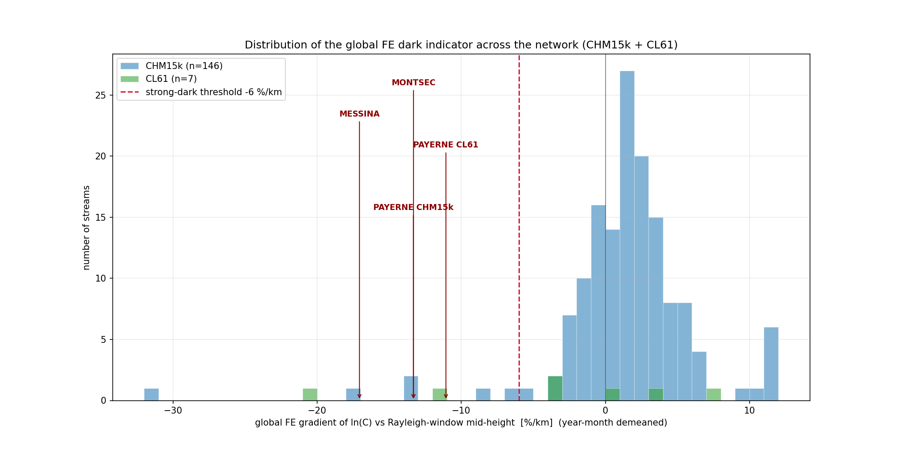
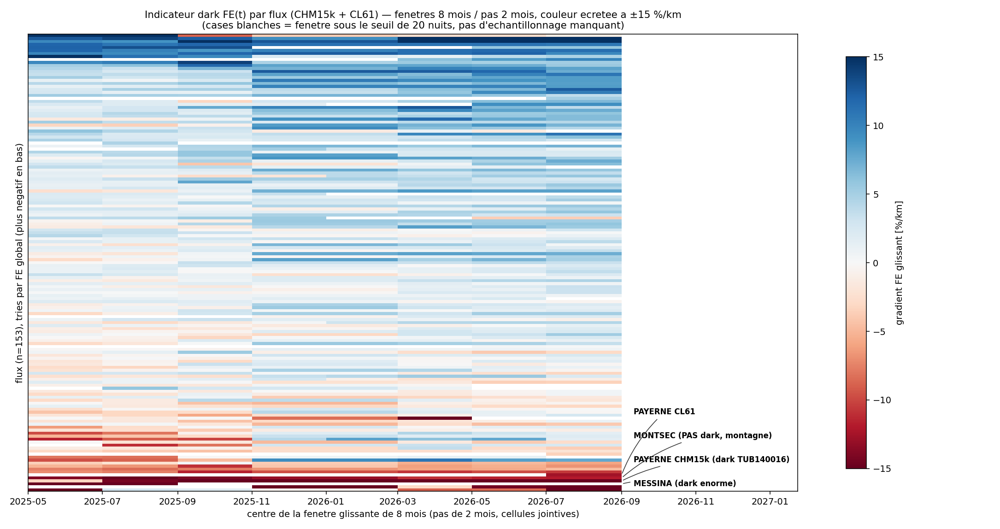
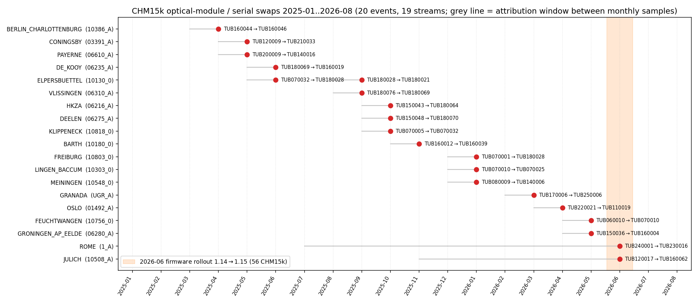
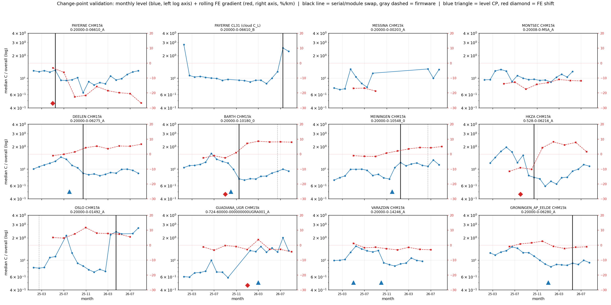
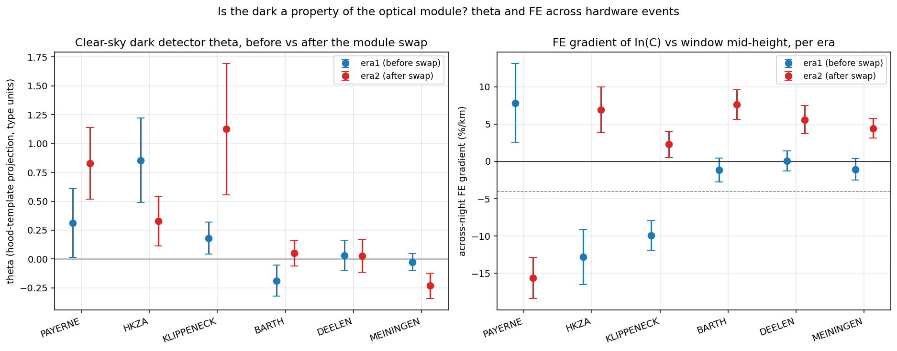

# Diagnostic dark à l'échelle du réseau — indicateur FE, timeline matérielle, détection de changements

*Campagne 2026-08-16. Question opérateur : **peut-on identifier les changements instrumentaux
(swaps de module optique, firmware) avec le diagnostic dark ?** Données : run réseau v2.2
`calout_v22_04` (433 flux, 2025-01..2026-08), census (167 flux CHM15k + CL61), attributs globaux
des fichiers L1 (`instrument_serial_number`, `optical_module_id`, `instrument_firmware_version`),
détecteur θ ciel-clair (`rayleigh_availability/dark_from_clearsky.py`, rapport
[dark_clearsky_method.md](dark_clearsky_method.md)). Vérités de terrain : arrivée du dark de
Payerne A avec le module TUB140016 (2025-04), dark énorme de Messina (θ ≈ +5.3), Montsec = faux
positif de site (montagne), swap du bloc optique du CL31 de Payerne le 2026-07-07.*

## 1. Indicateurs et carte temporelle du réseau

**Indicateur.** Le FE global = pente OLS de ln(C) vs mi-hauteur de la fenêtre Rayleigh (km),
après retrait des moyennes par année-mois (effets fixes ; groupes ≥ 3 nuits ; SE avec
dof = n − n_groupes − 1). Succès = `method == rayleigh`, flag 1.0/0.5, `cal_value > 0`. Le FE
glissant reprend le même estimateur sur des fenêtres de 8 mois avancées de 2 mois (≥ 20 nuits et
≥ 3 groupes par fenêtre). Le plancher géophysique établi par la campagne est ~4 %/km ; un FE
fortement négatif (< −6 %/km) et significatif est un candidat dark additif.

**Couverture.** 153 des 168 flux traités passent le seuil de ≥ 40 succès Rayleigh (146 CHM15k,
7 CL61 ; 15 écartés). Le CL31 de Payerne (06610_B) n'a **aucune** ligne Rayleigh dans ce run
(le Rayleigh n'est pas exécuté sur les canaux CL31) — seuls 4 des 5 candidats connus peuvent
donc apparaître dans les figures. Volume : 153 FE globaux, 1268 fenêtres glissantes,
2831 flux-mois de niveaux médians.

Le réseau est sain : médiane +1.6 %/km, IQR −0.5..+3.3, 75 % des flux dans ±4 %/km. La **zone
dark forte** (FE < −6 %/km) contient **8 flux** (5 % du réseau), dont 7 significatifs à
|FE|/SE ≥ 2 (l'exception est Camborne CL61, −20.4 ± 16.1, 54 nuits seulement) :

| Rang | Site | Type | FE global (%/km) | ± SE | Statut |
|---|---|---|---|---|---|
| 1 | PLOVDIV_UNI | CHM15k | −56.9 | 28.2 | flux extrêmement bruité (σ ln C ≈ 4) — artefact probable, pas un dark |
| 2 | CAMBORNE C | CL61 | −20.4 | 16.1 | non significatif (54 nuits) — à revoir avec plus de données |
| 3 | MESSINA A | CHM15k | −17.1 | 5.1 | **connu** (θ ciel-clair ≈ +5.3, ~5× Payerne) |
| 4 | PAYERNE A | CHM15k | −13.3 | 2.5 | **connu** (dark arrivé avec TUB140016) |
| 5 | MONTSEC A | CHM15k | −13.3 | 1.5 | **connu NON-dark** (effet de site montagne, θ ≈ 0) |
| 6 | PAYERNE CL61 | CL61 | −11.1 | 2.4 | **connu** (baseline croissante mesurée au capot) |
| 7 | BERN BRN_A | CHM15k | −8.5 | 2.0 | **nouveau candidat** (site urbain toit — θ à vérifier) |
| 8 | TWENTHE A | CHM15k | −6.5 | 1.3 | **nouveau candidat** |
| 9 | GOTTFRIEDING | CHM15k | −5.7 | 2.0 | limite de zone |
| 10 | LINDENBERG C | CL61 | −3.7 | 1.6 | faible |

Les quatre vérités de terrain présentes dans le run se classent dans le **top 6 de 153 flux** :
l'indicateur FE retrouve les darks connus. Bern et Twenthe sont les seuls nouveaux candidats
forts et significatifs.

**Ce que la carte temporelle ajoute au FE global.**

- **Transitoires** : 9 flux restent au-dessus de −6 %/km en global mais croisent le seuil dans
  au moins une fenêtre de 8 mois : QUALAIR (min glissant −16.2), EXETER (−12.6), HKZA (−11.6),
  GOTTFRIEDING (−11.0), KLIPPENECK (−9.8), FLESLAND (−9.8), FRIESOYTHE (−9.7), ERISWIL (−8.9,
  global +34.6 — flux grossièrement instable, artefact plutôt que dark), AMSTERDAM_AP_SCHIPHOL B
  (−6.4). Ce sont des darks qui sont **arrivés ou repartis** pendant 2025–2026 (HKZA et
  Klippeneck sont élucidés au §4 : le dark est reparti avec le swap de module).
- Le FE glissant confirme l'**arrivée** du dark de Payerne : pire fenêtre −26.8 %/km, contre
  −13.3 en global qui mélange l'ère propre (pré-TUB140016) et l'ère dark. Messina (−18.7),
  Montsec (−17.5) et Payerne CL61 (−14.1) sont **rouges en permanence** — des états stationnaires.
- **Mode commun 2026** : la médiane réseau du FE glissant dérive de ~0 (fenêtres 2025) à
  +3..+5 %/km (fenêtres 2026). Le zéro de l'indicateur n'est donc pas stable dans le temps —
  d'origine atmosphérique/saisonnière (la dérive démarre avant la vague firmware de 2026-06),
  et c'est la source dominante de fausses alertes du détecteur de sauts (§3).

## 2. Timeline matérielle (serials, modules, firmware)

Scan de 1 fichier L1 par flux et par mois (2025-01..2026-08) : 2911 flux-mois, **zéro fichier
illisible**. Fait utile : sur CHM15k, `instrument_serial_number` et `optical_module_id` sont
**toujours la même chaîne TUBxxxxxx** — dans L1, « changement de série » et « swap de module »
sont le même événement.

- **Swaps de module** : 19 flux touchés, **20 événements** (Elpersbüttel deux fois :
  TUB070032→TUB180028 en 2025-06 puis →TUB180021 en 2025-09). **Tous sont des CHM15k** ; aucun
  CL61 n'a changé de série. Taux : 20 événements / (167 flux × 19 mois) ≈ **7.6 %/flux/an**, soit
  un swap tous les ~13 flux-années — les attributs L1 datent chacun au mois près (barre grise =
  fenêtre d'attribution entre deux échantillons mensuels ; Jülich et Rome ont des trous de scan
  qui élargissent la fenêtre à plusieurs mois).
- **Firmware** : 65 flux (64 CHM15k + 1 CL61), 66 événements — dominés par un **déploiement
  réseau 1.14→1.15 en 2026-06** (56 des 66 événements, essentiellement la flotte DWD). Tout pas
  d'indicateur qui apparaîtrait « réseau-large » autour de 2026-06 doit être confronté à ce
  déploiement avant d'être lu comme une dégradation matérielle.
- **Sanity check** : Payerne A montre TUB200009→TUB140016 exactement en 2025-05 (échantillon
  précédent 2025-04), conforme au swap connu ; le scan journalier de la phase θ (§4) affine la
  date au **2025-04-02**. Firmware constant à 1.13.
- **Les autres candidats dark sont matériellement stables** sur toute la fenêtre — leur dark ne
  peut pas être attribué à un swap 2025–2026 : Messina = TUB140003 fw 0.738 (10 mois),
  Montsec = TUB130006 fw 1.08, Bern = TUB150046 fw 0.735, Twenthe = TUB150039 fw 1.01, zéro
  événement chacun. Messina et Bern tournent sur un firmware **très ancien** (0.7xx contre 1.1x
  typique réseau). Idem Amsterdam Schiphol A/B/C/D : quatre unités stables 19 mois — le déficit
  d'overlap de l'unité B siège sur une unité inchangée, pas sur un artefact de swap.

## 3. Détection de changements instrumentaux par le diagnostic dark

**Méthode.** Deux détecteurs aveugles, validés contre les événements matériels du §2
(tolérance ±2 mois, et ±4 pour le FE dont la fenêtre de 8 mois rend la datation grossière) :

1. **Niveau** : segmentation binaire sur le niveau médian mensuel de C (espace log), segment
   minimal 4 mois, coupure acceptée si |saut| > 15 % et test des signes p < 0.01.
2. **FE** : saut fenêtre-à-fenêtre du FE glissant > 6 %/km, soutenu sur ≥ 2 fenêtres suivantes.

Le swap connu du bloc optique du CL31 de Payerne (2026-07-07) est testé sur sa série C_L
**nuage** (pas de Rayleigh sur ce canal). Événements testables : 21 (20 swaps de module + le
changement série+firmware du CL61 de Lindenberg).

| Détecteur | Détections | Précision ±2 mois | Précision ±4 mois | Rappel ±2 mois | Rappel ±4 mois |
|---|---|---|---|---|---|
| Niveau (binseg) | 11 | 3/11 (27 %) | 4/11 (36 %) | 3/21 (14 %) | 4/21 (19 %) |
| FE (saut soutenu) | 28 | 4/28 (14 %) | 6/28 (21 %) | 3/21 (14 %) | 5/21 (24 %) |
| **Union** | **39** | **7/39 (18 %)** | **10/39 (26 %)** | **5/21 (24 %)** | **7/21 (33 %)** |

**Lecture de la galerie.**

- **Vrais positifs** : Payerne A (saut FE −16.4 %/km daté 2025-05, exact), HKZA (saut FE
  +14.4 — le dark *repart*), Barth (les deux détecteurs : marche de niveau −33 % + saut FE),
  Deelen (niveau −26 %), Meiningen (niveau +39 %), Klippeneck et Coningsby à ±4 mois.
- **Manqués** : 14 des 21 événements ne laissent **aucune** trace détectable — Oslo, De Kooy,
  Vlissingen, Berlin, Freiburg, Lingen, Feuchtwangen, Granada, Rome, Groningen (à ±2),
  Elpersbüttel ×2… Un swap entre deux modules de sensibilité et de dark comparables est
  invisible dans C — c'est le cas majoritaire.
- **Fausses alertes** : dominées par le mode commun du §1 — **14 des 28 détections FE sont
  datées 2025-09** (16/28 sont des sauts *positifs*), c'est la dérive réseau 2026 vue par des
  fenêtres qui basculent dans 2026, pas des événements matériels. Côté niveau : Varazdin,
  Nieuwkoop, Guadiana, Aoste portent des marches > 25 % sans aucun événement matériel
  (météo/exploitation).
- **CL31 Payerne** : la marche de niveau post-swap est visible à l'œil en fin de série mais
  structurellement indétectable (1.5 mois de données après l'événement, segment minimal 4 mois).

**Verdict opérateur (explicite).** **NON — le diagnostic dark ne permet pas d'identifier les
changements instrumentaux en détecteur autonome** : rappel ≤ 33 % même à ±4 mois, précision
~1 détection sur 4, datation grossière (fenêtres 8 mois), fausses alertes dominées par un mode
commun atmosphérique. Ce qu'il fait bien, c'est **qualifier** un changement : quand un swap
modifie le dark (Payerne, HKZA) ou la sensibilité (Barth −33 %, Deelen −26 %, Meiningen +39 %),
la signature est claire et signée. La **source de vérité pour détecter** les changements est
ailleurs et gratuite : les attributs L1 `serial`/`module` (datation au mois, 0 erreur de lecture
sur 2911 flux-mois). La bonne architecture est donc : *détecter par les attributs L1, qualifier
par le diagnostic dark* — et chaque swap détecté doit déclencher un redémarrage du filtre de
Kalman (leçon du CL31 de Payerne : lisser à travers un step ×2.8 rend le Kalman 2.5× faux) et un
re-calage des indicateurs par ère.

## 4. θ par ère sur les suspects — la preuve module-vs-site

Le détecteur θ ciel-clair (rapport [dark_clearsky_method.md](dark_clearsky_method.md) ; aveugle
< 2 km, score = projection sur le gabarit capot Payerne, corrigé de la réponse affine par flux)
est relancé **séparément avant/après le swap** sur les 6 flux à swap disposant d'assez de nuits
claires, dates de swap affinées au jour par scan L1 journalier. Payerne sert de contrôle
(l'arrivée du dark est connue).

| Flux (swap) | Modules | θ avant | θ après | FE avant (%/km) | FE après | Lecture |
|---|---|---|---|---|---|---|
| PAYERNE A (2025-04-02) | TUB200009→TUB140016 | 0.31 ± 0.30 | **0.83 ± 0.31** | +7.8 ± 5.3 | **−15.6 ± 2.7** | contrôle : le dark **arrive** avec TUB140016 (θ_corr 1.07, split-half r = 0.88) |
| HKZA A (2025-09-06) | TUB150043→TUB180064 | **0.86 ± 0.37** | 0.33 ± 0.21 | **−12.8 ± 3.7** | +6.9 ± 3.1 | contre-épreuve : le dark **repart** avec l'ancien module |
| KLIPPENECK (2025-09-19) | TUB070005→TUB070032 | 0.18 ± 0.14 | 1.13 ± 0.57 | **−9.9 ± 2.0** | +2.3 ± 1.8 | FE guéri par le swap, mais θ contradictoire (ère 2 : 40 nuits, SEM énorme, biais gabarit −196 % → fit peu fiable ; site à 973 m, prudence type Montsec) |
| BARTH (2025-10-23) | TUB160012→TUB160039 | −0.19 ± 0.13 | 0.05 ± 0.11 | −1.2 ± 1.6 | +7.6 ± 2.0 | marche de **niveau** −33 % sans dark ni avant ni après : changement de sensibilité |
| DEELEN (2025-09-25) | TUB150048→TUB180070 | 0.03 ± 0.13 | 0.03 ± 0.14 | +0.1 ± 1.3 | +5.6 ± 1.9 | niveau −26 %, θ nul des deux côtés : sensibilité |
| MEININGEN (2025-12-03) | TUB080009→TUB140006 | −0.03 ± 0.07 | −0.23 ± 0.11 | −1.1 ± 1.4 | +4.4 ± 1.3 | niveau +39 %, pas de dark : sensibilité |

**La preuve est faite dans les deux sens** : le dark suit le **module optique**, pas le site —
il arrive à Payerne avec TUB140016 (θ 0.31→0.83, FE +7.8→−15.6) et il repart de HKZA avec
TUB150043 (θ 0.86→0.33, FE −12.8→+6.9). À l'inverse, trois swaps (Barth, Deelen, Meiningen)
changent la **sensibilité** de 26–39 % sans toucher au dark : c'est précisément pourquoi le
rappel du §3 est faible — la majorité des swaps ne modifient ni assez le dark ni assez le
niveau pour être vus dans C. Les FE d'ère 2 uniformément positifs (+2 à +8 %/km) reflètent le
mode commun 2026 du §1, pas une physique d'instrument.

## 5. Recommandations

**Surveillance dashboard.**

- **Quel indicateur** : le **FE glissant** (fenêtres 8 mois, pas 2 mois) par flux — le FE global
  masque les transitoires (Payerne : global −13.3 vs pire fenêtre −26.8). L'afficher **corrigé de
  la médiane réseau de la fenêtre** (la dérive commune 2026 de +3..+5 %/km fausse le zéro).
- **Quel seuil** : alerte si FE corrigé < **−6 %/km** avec |FE|/SE ≥ 2 sur **≥ 2 fenêtres
  consécutives** (la persistance élimine l'essentiel des fausses alertes du §3) ; pré-alerte à
  −4 %/km (le plancher géophysique). Toute alerte passe par une **confirmation θ ciel-clair**
  avant action matérielle — contre-exemple Montsec : FE −13.3 significatif sans aucun dark
  (effet de site) ; θ est aveugle < 2 km mais départage module vs site.
- **Quelle cadence** : **mensuelle** — recalcul depuis les CSV de calibration existants
  (quelques secondes par flux), plus un **scan mensuel des attributs L1**
  (`serial`/`module`/`firmware`, coût quasi nul) qui alimente une liste d'événements. Chaque
  swap détecté déclenche : redémarrage du Kalman + coupure d'ère des indicateurs + entrée au
  journal instrument. Vérifier tout signal « réseau-large » contre les déploiements firmware
  (56 CHM15k passés 1.14→1.15 en 2026-06).

**Priorités capot / intervention (mises à jour).**

1. **Messina A** — θ ≈ +5.3, FE −17.1 ± 5.1, firmware antique 0.738 : premier de liste, module
   à remplacer ou dark à mesurer au capot puis soustraire.
2. **Bern BRN_A** — FE −8.5 ± 2.0, nouveau candidat, matériel stable, firmware 0.735 ; site
   urbain de toit → **passer le détecteur θ d'abord** (risque d'effet de site type Montsec).
3. **Twenthe A** — FE −6.5 ± 1.3, nouveau candidat stable ; θ à mesurer.
4. **Payerne CL61** — FE −11.1 ± 2.4 : dark déjà mesuré au capot, il reste à déployer la
   soustraction b(z) sur ce canal.
5. **Gottfrieding** (−5.7, limite) et **Camborne CL61** (−20.4 n.s., 54 nuits) : re-évaluer
   quand la série s'allonge. **Montsec sort de la liste capot** (site, pas module).
   **HKZA et Klippeneck sont clos** (dark reparti avec le swap). Plovdiv est un problème de
   qualité de données, pas de dark. Transitoires restants à l'œil : QUALAIR, EXETER, FLESLAND,
   FRIESOYTHE, AMSTERDAM B (ERISWIL = artefact de flux instable).

## Résumé exécutif

1. L'indicateur FE (pente de ln C vs mi-hauteur de fenêtre, effets fixes année-mois) est validé
   réseau : les 4 darks connus du run se classent top 6 sur 153 flux.
2. Zone dark forte (< −6 %/km) : 8 flux (5 %), 7 significatifs ; nouveaux candidats : Bern et
   Twenthe ; 9 transitoires supplémentaires dont HKZA/Klippeneck, guéris par swap de module.
3. Timeline L1 : 20 swaps de module (19 flux, tous CHM15k, ~7.6 %/flux/an), 66 événements
   firmware dont le déploiement 1.14→1.15 de 2026-06 (56 CHM15k) — un confound à connaître.
4. **Détection de changements par le dark : NON** — rappel ≤ 33 % (±4 mois), précision ~26 %,
   fausses alertes dominées par un mode commun atmosphérique 2026 (+3..+5 %/km).
5. L'architecture correcte : **détecter par les attributs L1** (gratuit, exact au mois),
   **qualifier par le dark**, redémarrer le Kalman à chaque swap.
6. θ par ère **prouve le dark = propriété du module** dans les deux sens : il arrive à Payerne
   avec TUB140016 (θ 0.31→0.83) et repart de HKZA avec TUB150043 (θ 0.86→0.33).
7. Trois swaps (Barth, Deelen, Meiningen) changent la sensibilité de 26–39 % sans dark — la
   majorité des swaps restent invisibles dans C.
8. Surveillance : FE glissant corrigé de la médiane réseau, seuil −6 %/km persistant 2 fenêtres
   + confirmation θ ; cadence mensuelle ; priorités capot : Messina, Bern (θ d'abord), Twenthe,
   CL61 Payerne.

---

*Tables intermédiaires (scratch de campagne) : `fe_global.csv`, `fe_rolling.csv`, `levels.csv`,
`hardware_timeline.csv`, `events.csv`, `cp_level.csv`, `cp_fe.csv`, `cp_validation.csv`,
`s_theta_era_table.csv`, `s_fe_era.csv` — répertoire `dark_net/` du scratchpad de session.*
