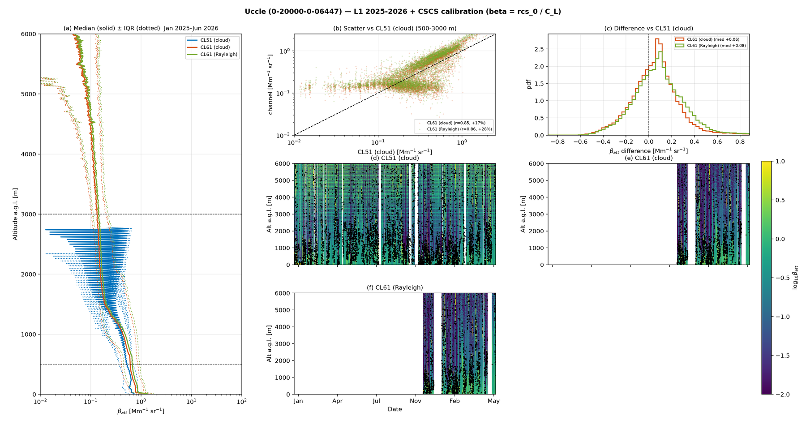
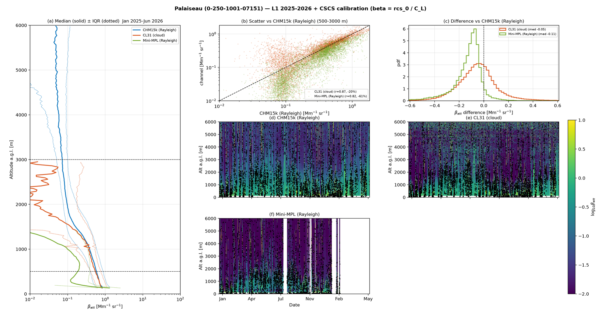
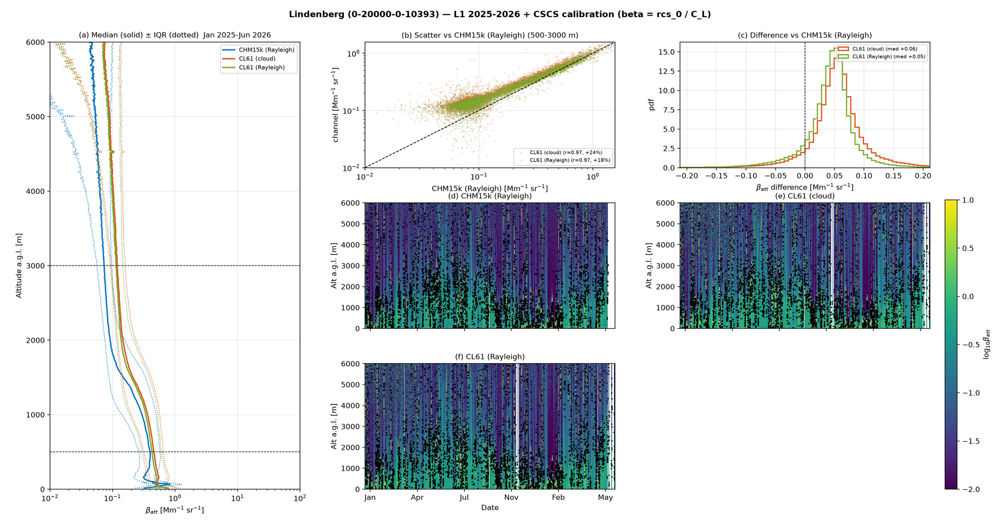
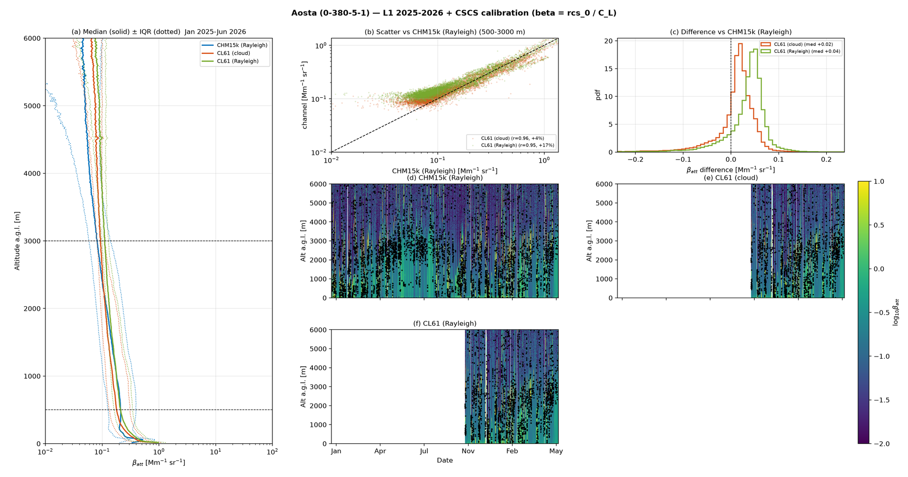
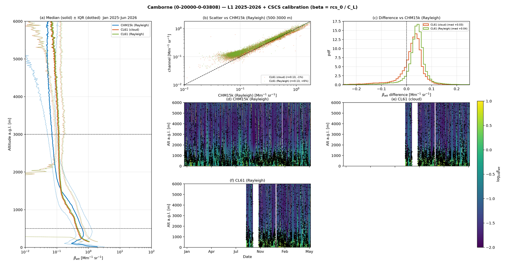

# L1 attenuated-backscatter validation — CSCS calibration applied to the raw signal

*Generated by `validation/paper/run_l1_validation.py`. For every channel the **native L1** range-corrected signal `rcs_0` (2025-2026, `D:/E-PROFILE_L1_2026`) is converted to attenuated backscatter by applying the **CSCS calibration** — `beta_att = rcs_0 / C_L * 1e6`, with `C_L` the Kalman lidar constant from the CSCS calout `<key>_kalman.csv` — then water-vapour (910 nm), wavelength normalisation, cloud/fog screening, hourly + common-altitude gridding, and statistics over 500-3000 m AGL vs the site reference (CHM15k Rayleigh). No L2 product and no raw vendor files are used. CL61 is shown under both its cloud and Rayleigh calibrations.*

| site | channel | calib | rel. bias | r | N | median C_L |
|---|---|---|---|---|---|---|
| Payerne | CHM15k (Rayleigh) *(ref)* | rayleigh | +0.0% | 1.000 | 623411 | 6.41e+11 |
| Payerne | CL31 (cloud) | cloud | +51.8% | 0.369 | 475616 | 3.37e+07 |
| Payerne | CL61 (cloud) | cloud | -7.6% | 0.986 | 152638 | 1.46 |
| Payerne | CL61 (Rayleigh) | rayleigh | +6.9% | 0.989 | 152638 | 1.25 |
| Amsterdam | CHM15k A *(ref)* | rayleigh | +0.0% | 1.000 | 627500 | 3.44e+11 |
| Amsterdam | CHM15k B | rayleigh | +22.8% | 0.958 | 582250 | 2.82e+11 |
| Amsterdam | CHM15k C | rayleigh | -1.4% | 0.931 | 556750 | 2.87e+11 |
| Amsterdam | CHM15k D | rayleigh | -3.4% | 0.966 | 584000 | 3.16e+11 |
| Uccle | CL51 (cloud) *(ref)* | cloud | +0.0% | 1.000 | 572531 | 7.85e+07 |
| Uccle | CL61 (cloud) | cloud | +16.6% | 0.854 | 149094 | 1.17 |
| Uccle | CL61 (Rayleigh) | rayleigh | +28.1% | 0.856 | 149094 | 1.1 |
| Palaiseau | CHM15k (Rayleigh) *(ref)* | rayleigh | +0.0% | 1.000 | 298219 | 4.27e+11 |
| Palaiseau | CL31 (cloud) | cloud | -19.8% | 0.867 | 228997 | 7.91e+07 |
| Palaiseau | Mini-MPL (Rayleigh) | rayleigh | -61.0% | 0.818 | 80178 | 1.34e+05 |
| Lindenberg | CHM15k (Rayleigh) *(ref)* | rayleigh | +0.0% | 1.000 | 850750 | 3.93e+11 |
| Lindenberg | CL61 (cloud) | cloud | +24.4% | 0.973 | 829500 | 1.35 |
| Lindenberg | CL61 (Rayleigh) | rayleigh | +17.6% | 0.974 | 829500 | 1.45 |
| Aosta | CHM15k (Rayleigh) *(ref)* | rayleigh | +0.0% | 1.000 | 780558 | 2.47e+11 |
| Aosta | CL61 (cloud) | cloud | +3.8% | 0.956 | 236639 | 1.59 |
| Aosta | CL61 (Rayleigh) | rayleigh | +16.6% | 0.949 | 236639 | 1.3 |
| Camborne | CHM15k (Rayleigh) *(ref)* | rayleigh | +0.0% | 1.000 | 385436 | 2.2e+11 |
| Camborne | CL61 (cloud) | cloud | -1.2% | 0.131 | 75818 | 1.26 |
| Camborne | CL61 (Rayleigh) | rayleigh | +5.9% | 0.131 | 75818 | 1.16 |

### Payerne

### Amsterdam

### Uccle

### Palaiseau

### Lindenberg

### Aosta

### Camborne

