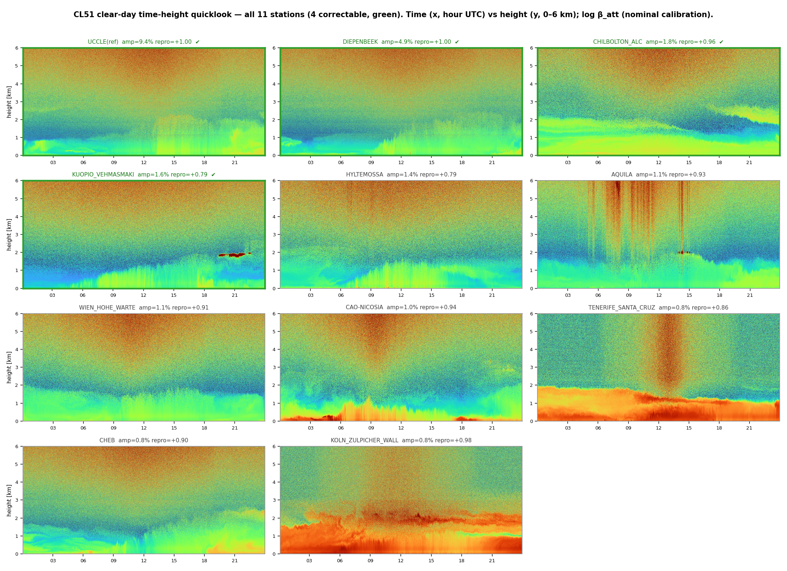
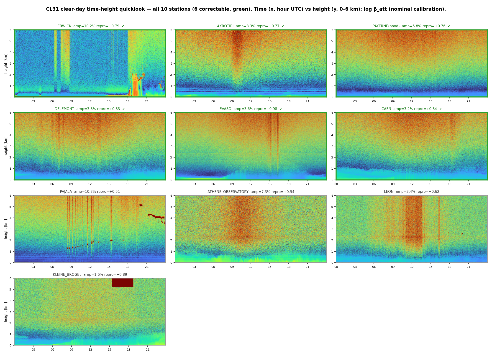
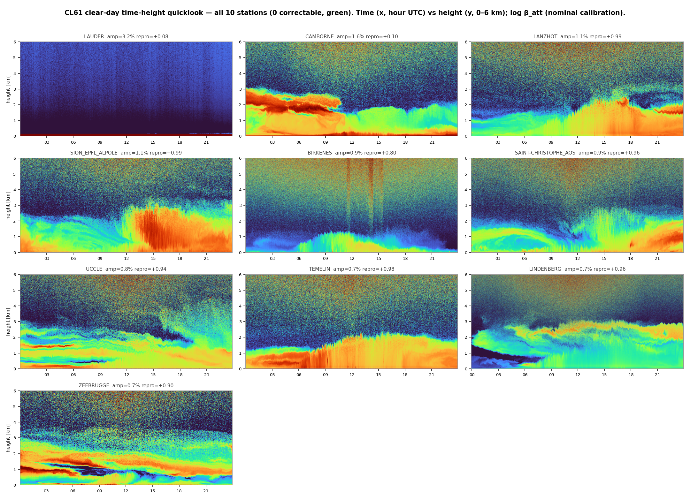
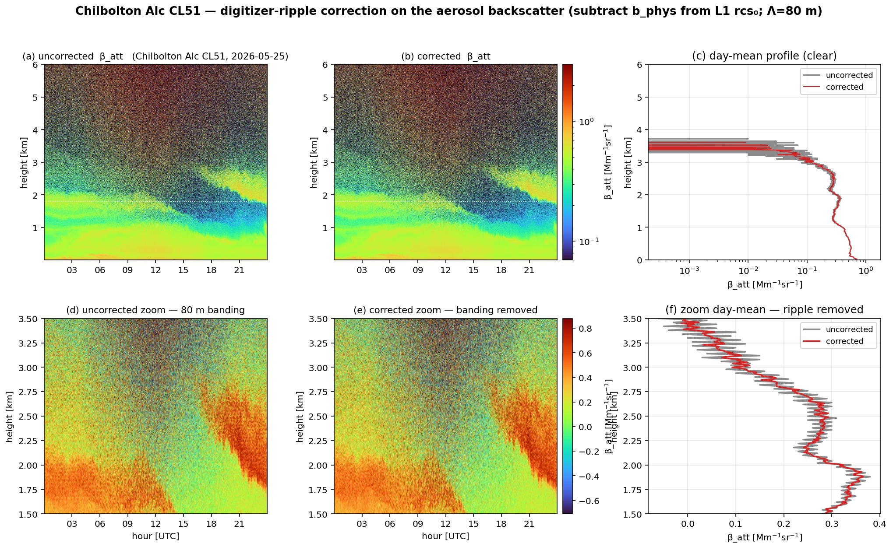
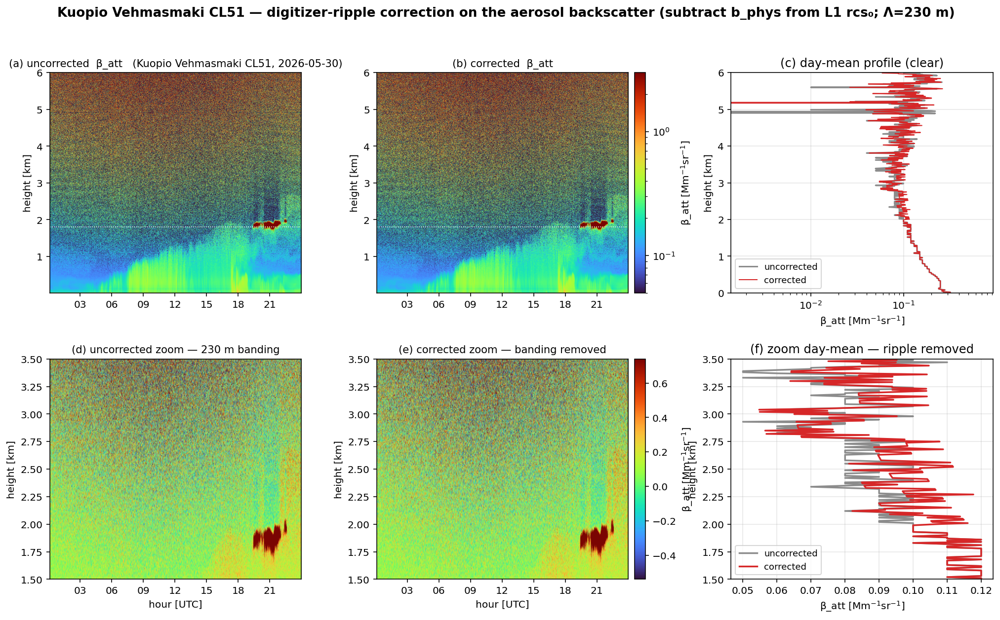
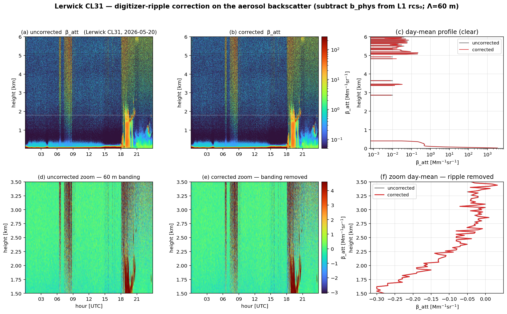
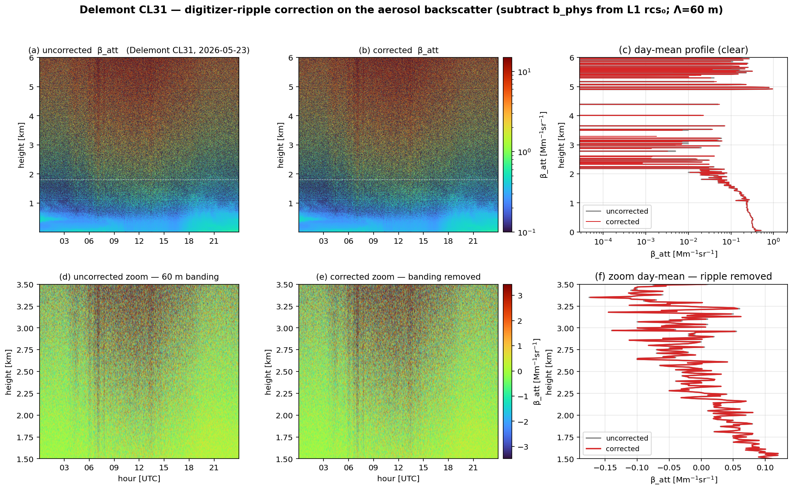
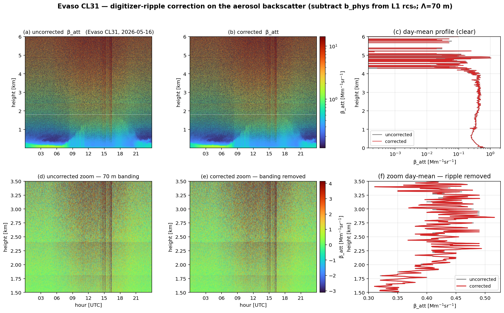
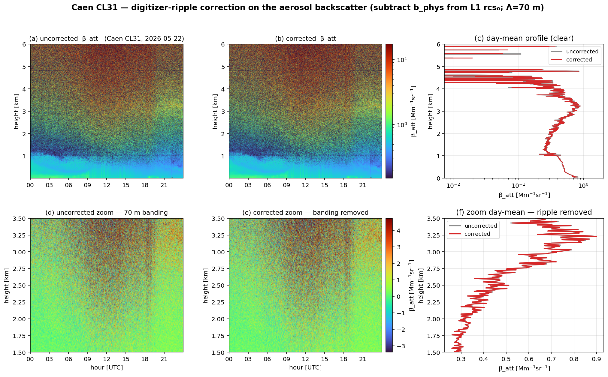

# Network electronic-offset coefficients — clear-night extraction, temperature, and full-altitude correction

*E-PROFILE ALC calibration · companion to [cl61_chm15k_offset_correction.md](cl61_chm15k_offset_correction.md)*

## 0. Summary

We extend the single-site electronic-offset analysis to the **network**: 10 CL61, 11 CL51 and 10 CL31
across **~20 countries** (Lauder NZ → Birkenes NO), using a **clear-night** method (no hood needed),
and test whether the **internal laser temperature** refines the offset. The deliverable is a
per-instrument coefficient set (`network_offset_coeffs.csv` + per-unit `b_phys`) to de-ripple the
aerosol backscatter.

**Two design choices, both driven by operator review:**

1. **Correctability is decided by SPLIT-HALF REPRODUCIBILITY**, not a single-set autocorrelation. The
   clear nights are split into two independent halves (even/odd profiles); a *fixed instrumental*
   pattern reproduces in both (corr→1), while atmosphere/noise does not. This is robust and it catches
   the larger CL31 distortions an autocorrelation threshold missed.
2. **The correction spans ALL altitudes.** A digitizer ripple is locked to the range-gate clock, so we
   estimate its fixed *N-gate pattern* from the clean free troposphere and reconstruct it at **every**
   gate (a **gate-fold**), including the near range — no artificial cut-off, no sinusoid-extrapolation
   dephasing. Reproducible slow distortions are taken as the empirical free-troposphere pattern.

**Correctable = reproducible (split-half ≥ 0.6) AND significant (≥ 1.5 % of the mid-range signal) AND
not decaying with range** (`undamped ratio ≥ 0.5` — an electronic offset stays ~flat in `P=rcs_0/z²`,
a persistent aerosol layer decays). Result:

- **CL51: 4/11** — Uccle 9.4 %, Diepenbeek 4.9 %, Chilbolton 1.8 %, Kuopio 1.5 %.
- **CL31: 6/10** — Lerwick 10.2 %, Akrotiri 8.3 %, Payerne 5.9 %, Delémont 3.8 %, Evaso 3.6 %, Caen 3.2 %.
- **CL61: 0/10** — no recoverable clear-night offset (its offset is the smooth near-range undershoot,
  which decays with range and needs a hood).
- **Internal temperature** is a weak refinement (|slope| mostly < 0.02 /°C) — not parameterized.

## 1. Method (`_offset_lib.py`)

The offset is a **fixed additive range pattern** (Kotthaus P^bgi), estimated from the per-gate robust
**median of P = rcs_0/z²** over clear nights (nighttime; cloud-free; cleanest-50 % aerosol). A gaussian
high-pass (σ ≈ 350 m) removes the smooth molecular/aerosol baseline.

- **Split-half reproducibility** (`split_half_repro`): median of even vs odd profiles, correlated over
  2–8 km. The "is this a real fixed pattern?" test.
- **Gate-fold** (`gate_fold`): for a ripple whose period is ~N range gates, the N-value pattern (mean
  removed) is measured in the clean free troposphere and evaluated at every gate → the correction is
  reconstructed at all altitudes, phase-locked, with no near-range cut-off.
- **Undamped ratio** = RMS(6–10 km)/RMS(2–4 km): ≈1 for a range-flat electronic offset, ≪1 for a
  decaying atmospheric feature, ≫1 for median noise aloft.

## 2. Validation gate — does clear-night recover the hood offset? (Payerne CL31)


*Figure 1 — Payerne CL31 clear-night vs hood. The far-range persistent ripple is recovered (corr
**+0.60**, amplitude ratio 0.86); the near-range damped ring is **4.9× masked** by boundary-layer
aerosol (recoverable only with a hood). Temperature: far-ripple RMS +13 % over 25→34 °C (weak).*

## 3. Network correctability — auditable per station


*Figure 2 — (a) offset amplitude per instrument (solid = correctable). (b) the two thresholds:
reproducibility ≥ 0.6 and amplitude ≥ 1.5 %. (c) strongest correctable offset per type. (d)
temperature slope (weak).*

Every station's verdict is auditable in the diagnostics: the two independent night-halves are
overlaid — they **coincide** for a real fixed pattern (green), **diverge** for noise/atmosphere (grey).


*Figure 3 — CL51: 4/10 correctable. Uccle/Diepenbeek carry a strong, clean 40 m (4-gate) ripple; the
rest are below threshold or decay with range.*


*Figure 4 — CL31: 6/10 correctable. The big distortions (Lerwick, Akrotiri, Payerne, …) reproduce
across halves and are corrected. **Athens** (7.3 %, repro 0.94) is **rejected**: it *decreases* with
range (undamped 0.14) — a persistent near-range atmospheric feature, not a range-flat electronic
offset. **Pajala** is rejected as too noisy (repro 0.50).*


*Figure 5 — CL61: 0/10. Several show a reproducible pattern, but it decays with range (undamped ≈ 0.1)
— the smooth near-range undershoot, which the clear-night high-pass cannot isolate (needs a hood).*

**Clear-day time-height quicklooks — all stations.** For completeness, every station's actual signal
(a clear day, log β_att, height on the Y axis) is shown below, framed green (correctable) / grey (not):


*Figure 3b — CL51: clear-day quicklooks, all 11 units.*


*Figure 4b — CL31: clear-day quicklooks, all 10 units. Note the near-zero (background-over-subtracted)
free troposphere on several units.*


*Figure 5b — CL61: clear-day quicklooks, all 10 units.*

The correctable offsets are mostly **short-period gate-locked ripples** (the Vaisala digitizer
fixed-pattern ripple), whose period is **unit-specific** (40/60/70/80 m) — Kotthaus's "sensor-specific
frequency". Their amplitude relative to the *mid-range* signal is 1–10 %, but because it is a fixed
additive error while the atmospheric signal decays, it is a **large fractional error in the weak free
troposphere** — exactly where aerosol profiling needs it removed.

## 4. Internal temperature

Splitting each pool into laser-temperature terciles, the offset-RMS-vs-temperature slope is **weak**
(|slope| < 0.02 /°C for most units; a few reach ±0.05–0.14 /°C). For the digitizer ripple it is
negligible (a fixed clock artifact). The coefficients are therefore **not** temperature-parameterized.

## 5. Operational correction — all altitudes, worked examples

For each correctable unit, `network_offset/<key>.npz` holds **`b_phys(range)`** (rcs_0 units, full
range). The correction is a straight subtraction on L1:

```
rcs_0_corrected = rcs_0 − b_phys(range)          # then β_att = rcs_0_corrected / C_L
```

`_correctable_signal_figures.py` applies it to a full clear day per station and compares β_att with and
without the correction (pcolor + clear-day mean profiles; each figure's bottom row zooms **1.5–3.5 km,
spanning the old 1.8 km cut-off**, so the full-altitude correction is visible). One figure per
correctable station follows.

**CL51 (4):**


*Figure 6 — **Uccle CL51** (40 m, 9 %). The fixed 40 m banding (d) is removed at **all** altitudes (e),
the zoom mean profile (f) flattened. On the strong boundary-layer signal (top) the correction is
invisible — it matters in the weak free troposphere.*


*Figure 7 — **Diepenbeek CL51** (40 m, 5 %).*


*Figure 8 — **Chilbolton CL51** (80 m, 1.8 %) — a weaker 8-gate ripple.*


*Figure 9 — **Kuopio CL51** (empirical free-troposphere pattern, 1.5 %).*

**CL31 (6):**


*Figure 10 — **Lerwick CL31** (60 m, 10 %). The CL31 free-troposphere β_att is near-zero (even
negative, from CL31 background over-subtraction), so the correction sits on near-noise; the ripple
banding is nonetheless removed.*


*Figure 11 — **Akrotiri CL31** (45 m, 8 %).*


*Figure 12 — **Payerne CL31** (70 m, 6 %) — the hood-anchored reference unit.*


*Figure 13 — **Delémont CL31** (60 m, 3.8 %).*


*Figure 14 — **Evaso CL31** (70 m, 3.6 %) — the tightest split-half agreement (repro 0.98).*


*Figure 15 — **Caen CL31** (70 m, 3.2 %).*

The correction does **not** change the cloud-derived calibration constant (the strong-signal O'Connor
method is offset-immune — companion §2.7); it is purely an aerosol-profile improvement, per flagged unit.

## 6. Limitations & honest scope

- Clear-night recovers the **range-flat / periodic** offset only; the near-range *damped* ring (CL31)
  and *smooth undershoot* (CL61) decay with range and need a hood (only Payerne has one).
- The CL31 free troposphere is near-zero (background over-subtraction), so its corrections sit on
  near-noise — real but low-impact in absolute β_att.
- "Reproducible" ≠ "instrumental" without the undamped/periodicity check: a persistent atmospheric
  layer (Athens) also reproduces. We reject decaying-with-range patterns for this reason.
- Coefficients are from Mar–Jun 2026 clear nights (every 2nd day); a firmware/board change requires
  re-extraction.

## 7. Reproducibility
`_offset_lib.py` (kernels: clear-night, split-half, gate-fold) · `_cl31_clearnight_vs_hood.py` (Fig 1) ·
`_network_offset_scan.py` (per-instrument scan → npz cache) · `_network_offset_coeffs.py` (Fig 2 +
`network_offset_coeffs.csv`) · `_offset_diagnostics.py` (Figs 3–5, split-half audit) ·
`_offset_pcolor_diagnostics.py` (Figs 3b–5b, all-station clear-day pcolor quicklooks) ·
`_correctable_signal_figures.py` (Figs 6–15, one per correctable station). Sample: all usable CL61
(≥90 d) + one CL51/CL31 per country by data volume (+ Uccle CL51 & Payerne CL31 references).
All profile/offset plots follow the convention **altitude on the Y axis**.
