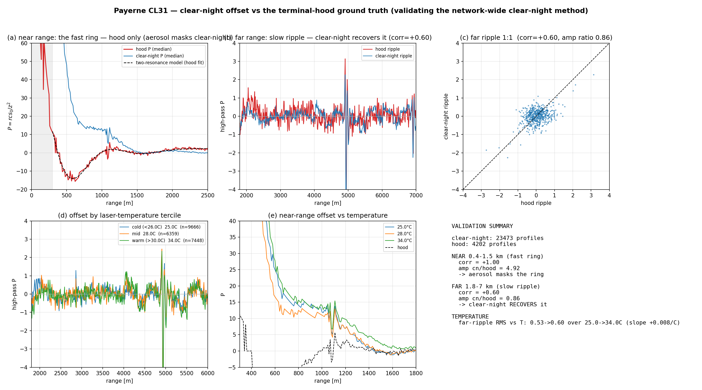
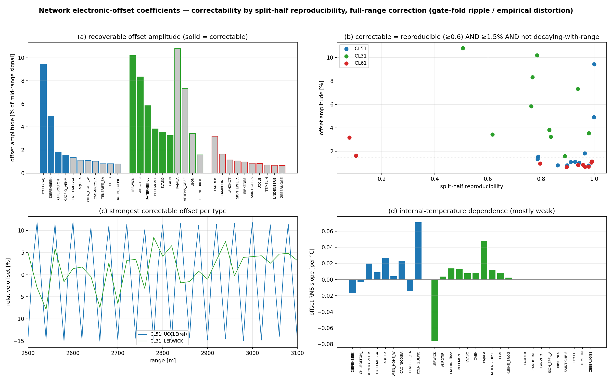
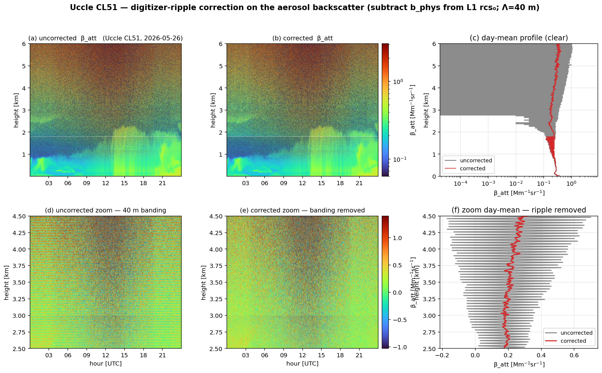
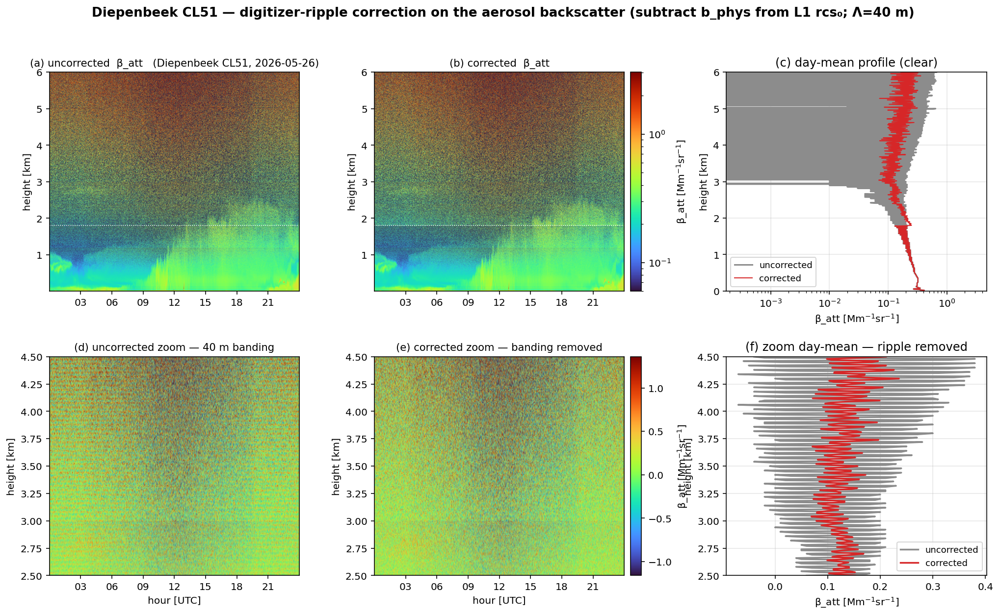
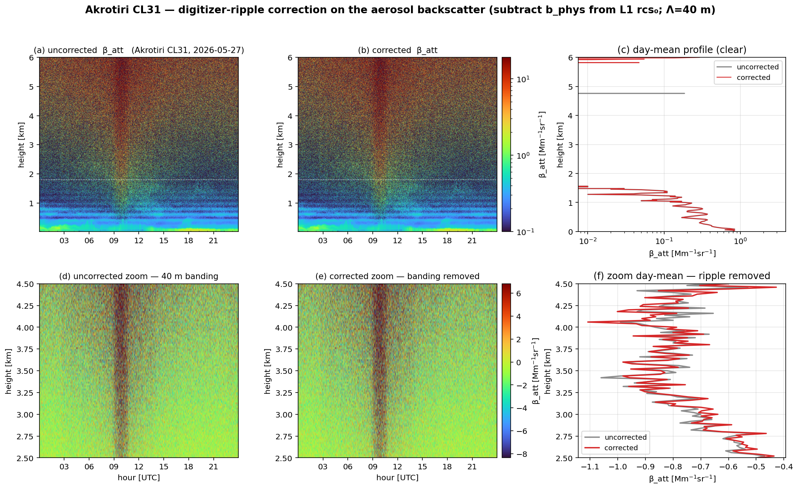

# Network electronic-offset coefficients — clear-night extraction, temperature, and operational correction

*E-PROFILE ALC calibration · companion to [cl61_chm15k_offset_correction.md](cl61_chm15k_offset_correction.md)*

## 0. Summary

We extend the single-site electronic-offset analysis (Payerne CL61/CHM15k/CL31, terminal hood) to the
**network**: 10 CL61, 11 CL51 and 10 CL31 spanning **~20 countries** (Lauder NZ → Birkenes NO), using a
**clear-night** method that needs no covered/hood measurement, and test whether the **internal laser
temperature** refines the offset. The goal was an operational per-instrument coefficient set to
de-ripple the aerosol backscatter.

**What we found is asymmetric and worth stating plainly:**

1. **The clear-night method recovers only the _persistent, oscillatory_ ripple**, not the near-range
   damped ring / undershoot (validated against the Payerne CL31 hood: far-ripple correlation +0.60,
   but the near-range ring is 5× masked by boundary-layer aerosol). So it is a substitute for a hood
   **only** for instruments whose dominant offset *is* a persistent ripple.
2. **A minority of instruments carry a strong, correctable ripple** — a **fixed short-period
   (≈40–45 m, ~3.3–3.75 MHz) digitizer fixed-pattern ripple**, undamped to >10 km. It is
   **unit-specific** (present in some CL51/CL31 units, absent in others; the period even varies
   40/60/80 m between units) — exactly Kotthaus et al.'s (2016) "sensor-specific frequency".
   **Correctable: 2/11 CL51 (Uccle, Diepenbeek), 1/10 CL31 (Akrotiri), 0/10 CL61.**
3. **The CL61 has no recoverable clear-night ripple at all** (its offset is the smooth near-range
   AC-coupling undershoot — invisible to a high-pass; it needs a hood).
4. **Internal temperature is a weak refinement** (ripple RMS slope mostly |·| < 0.02 /°C; a few units
   reach ±0.05–0.14 /°C). Not a first-order effect.

**Operational recommendation:** ship the per-unit ripple coefficients (below) for the handful of
instruments flagged `correctable`, where subtracting the fixed ripple measurably de-ripples the
free-tropospheric aerosol backscatter. For the rest, clear-night data yields no useful correction, and
the dominant near-range offset does **not** bias the operational cloud calibration (shown offset-immune
in the companion report) — so no action is warranted network-wide beyond the flagged units.

## 1. Method — clear-night offset extraction (`_offset_lib.py`)

The electronic offset is a **fixed additive range pattern** (Kotthaus P^bgi). We estimate it from the
per-gate robust **median of P = rcs_0/z²** over clear nights (nighttime → low solar background;
cloud-free → all CBH layers at fill; cleanest-50 % aerosol percentile). The fixed pattern survives the
median while the variable atmosphere averages toward a smooth baseline; a gaussian high-pass
(σ ≈ 350 m) removes that baseline and isolates the ripple. Per-unit we refine the ripple **period** by
a fine least-squares scan (an exact period matters — a 40 m fit dephases over 10 km if the true period
is 40.4 m), then report amplitude, coherence (autocorrelation at Λ), undamped extent and a temperature
slope. Internal `temperature_laser` (and CL61 `temp_int`) are pooled per profile for the T-split.

## 2. Validation gate — does clear-night recover the hood offset? (Payerne CL31)

Payerne CL31 is the one instrument with **both** a hood offset and a long clear-night record — the
ground truth for the network-wide method.


*Figure 1 — Payerne CL31 clear-night vs hood. **Far range 1.8–7 km (persistent slow ripple):**
clear-night recovers it (corr **+0.60**, amplitude ratio 0.86). **Near range 0.4–1.5 km (damped
AC-coupling ring):** the clear-night median is **4.9× the hood** — real boundary-layer aerosol masks
the ring, which is **not** recoverable without a hood. Temperature (laser, split into terciles):
far-ripple RMS +13 % over 25→34 °C — a weak heat-sink effect.*

**Conclusion:** clear-night is a valid hood-substitute for the *persistent* ripple only. This is why
the network scan finds the (persistent, undamped) digitizer ripple but is blind to the CL61 undershoot
and the CL31 near-range ring.

## 3. Network scan — the coefficient table (`_network_offset_scan.py` → `_network_offset_coeffs.py`)


*Figure 2 — (a) recoverable ripple amplitude per instrument (solid = `correctable`, grey = below the
1 %-of-mid-range threshold); Uccle & Diepenbeek CL51 tower above. (b) ripple period vs coherence — the
correctable ripples cluster at a few range gates (short period, high frequency); CL61 units are
incoherent outliers at large Λ. (c) the strongest recoverable ripple per type. (d) internal-temperature
slope — mostly weak.*

The correctable ripples (`network_offset_coeffs.csv`, the operational deliverable):

| itype | site | country | Λ (m) | gates | f (MHz) | amp (%) | coherence | undamped | correctable |
|---|---|---|---|---|---|---|---|---|---|
| CL51 | Uccle | BE | 40.0 | 4.0 | 3.75 | **13.2** | 0.98 | 0.99 | ✅ |
| CL51 | Diepenbeek | BE | 40.0 | 4.0 | 3.75 | **6.8** | 0.97 | 0.96 | ✅ |
| CL31 | Akrotiri | TR | 45.4 | 2.3 | 3.30 | **2.1** | 0.51 | 1.45 | ✅ |
| CL51 | Cheb | CZ | 41.6 | 4.2 | 3.60 | 0.1 | 0.84 | 0.24 | — (coherent but tiny) |
| CL31 | Pajala | SE | 40.0 | 4.0 | 3.75 | 3.2 | 0.44 | 1.47 | — (amp, but low coherence → noise) |
| CL61 | (all 10) | — | 49–1028 | incoherent | — | <1.1 | <0.31 | — (smooth offset, needs hood) |

Two discriminators matter:
- **Coherence** (autocorr at Λ) separates a real fixed ripple from low-SNR noise. Several CL31 units
  (Lerwick, Pajala, Athens) show a large `relrms` (8–11 %) but low coherence and **`undamped_ratio`
  > 1** — i.e. the "ripple" RMS *grows* with range, the signature of noise/z², not a fixed pattern.
  These are correctly flagged **not** correctable.
- **Amplitude** ≥ 1 % of the mid-range signal — Cheb has a genuine, coherent 40 m ripple (coh 0.84)
  but at 0.1 %, not worth correcting.

The correctable ripples share a **common physical origin**: a short-period (~40–45 m), high-frequency
(~3.3–3.75 MHz), **undamped** fixed pattern = the Vaisala **digitizer / ADC-interleave ripple**
(40 m = 4 range gates = f_sample/4 at the 10 m grid). It is **unit-specific**: present at correctable
amplitude in some units, negligible in others, with the period varying between units — no single
transferable curve, consistent with the single-site conclusion that each Vaisala unit imprints its own
fixed pattern.

## 4. Internal temperature

Splitting each clear-night pool into laser-temperature terciles and re-extracting the ripple:
the RMS-vs-temperature slope is **mostly weak** (|slope| < 0.02 /°C for most units), with a few
exceptions (Köln CL51 +0.14 /°C, Lerwick CL31 −0.076 /°C, Pajala CL31 +0.048 /°C). Temperature is a
**second-order refinement**, not a driver — for the correctable digitizer ripple (Uccle, Diepenbeek) it
is negligible (the ripple is a fixed clock artifact, largely temperature-independent). We therefore do
**not** parameterize the operational coefficients by temperature; the fixed per-unit ripple suffices.

## 5. Operational coefficients — how to apply

For each `correctable` instrument, `network_offset/<wmo>_<ident>_<itype>.npz` holds **`b_phys(range)`**
— the fixed ripple in **rcs_0 units**, valid above the aerosol-contaminated near range. The correction
is a straight subtraction on L1:

```
rcs_0_corrected = rcs_0 − b_phys(range)          # then β_att = rcs_0_corrected / C_L
```

This removes the systematic ripple from the **free-tropospheric** aerosol backscatter (where the ripple
is a ±few-% systematic that decorrelates the profile), exactly as the companion CL31 intercomparison
showed (ripple removal improved the CL31↔reference correlation 0.51→0.64). It does **not** change the
cloud-derived calibration constant (the strong-signal O'Connor method is offset-immune — companion §2.7),
so it is purely an **aerosol-profile** improvement, applied per flagged unit.

### 5b. Worked examples — corrected vs uncorrected signal (`_correctable_signal_figures.py`)

For each correctable station we apply `b_phys` to a full clear day of L1 and compare the attenuated
backscatter with and without the correction — pcolor (time-height) and clear-day mean profiles.


*Figure 3 — **Uccle CL51** (Λ = 40 m, 13 %). Top: full pcolor (a) uncorrected / (b) corrected β_att and
(c) the clear-day mean profile (the ripple wiggle in grey is flattened in red). Bottom: a
free-troposphere zoom (2.5–4.5 km) — the fixed 40 m **horizontal banding** in the uncorrected pcolor (d)
is removed in (e), and the (f) zoom mean profile shows the ripple flattened. On the strong boundary-layer
signal the correction is invisible (honest); it matters in the weak free troposphere.*


*Figure 4 — **Diepenbeek CL51** (Λ = 40 m, 7 %): same layout. The 40 m ripple (grey sawtooth in the
zoom profile f) is cleanly removed (red).*


*Figure 5 — **Akrotiri CL31** (Λ ≈ 45 m, 2 %): the borderline case. Its free-troposphere signal is
near-zero (even slightly negative — CL31 background over-subtraction), so the ripple sits on near-noise
and the correction is marginal; the log-scale mean profile (c) drops out where β_att < 0. This is why
Akrotiri is right at the correctability threshold (coherence 0.51).*

## 6. Limitations & honest scope

- Clear-night recovers the **persistent ripple only**; the near-range damped ring (CL31) and smooth
  undershoot (CL61) — often the *dominant* offset — need a covered/hood measurement, which exists only
  at Payerne. A network hood campaign would be required to correct those.
- The `correctable` set is small (3 of 31). This is the honest yield: most units either have no
  significant fixed ripple or one buried below the near-range aerosol.
- Coefficients are from Mar–Jun 2026 clear nights (every 2nd day). The ripple is a stable hardware
  pattern, so this is representative; a firmware/board change would require re-extraction.

## 7. Reproducibility
`_offset_lib.py` (extraction kernels) · `_cl31_clearnight_vs_hood.py` (Fig 1, validation gate) ·
`_network_offset_scan.py` (per-instrument clear-night scan → npz cache) · `_network_offset_coeffs.py`
(Fig 2, refined per-unit coefficients → `network_offset_coeffs.csv`/`.json`) ·
`_correctable_signal_figures.py` (Figs 3–5, corrected-vs-uncorrected pcolor + profiles). Sample: all
usable CL61 (≥90 d) + one CL51/CL31 per country by data volume.
