# E-PROFILE ALC attenuated-backscatter validation — uniform Level-1 methodology

*Generated 2026-07-08 from `validation/paper/run_paper_validation.py` (uniform-L1 rewrite) and
`validation/paper/discrepancy_analysis.py` (branch `wv-correction`). This revision folds in three
changes and extends the six recent stations to **30 June 2026**: (i) the **2026-07 cloud recalibration**
— per-Vaisala-type multiple-scattering tables (a_G = 5.5 µm; the CL61 no longer borrows the CL51's),
and removal of an incorrect window-transmission β correction (β /= (T/100)², now reject-only — the
driver of the degraded-window station shifts, §8.4); (ii) the **optimal 910→1064 nm conversion is
now in the pipeline** — component-separated, with the analytic molecular (Rayleigh) part from **CAMS
T/p** (0.4°, 1° fallback; hydrostatic below the lowest CAMS level) and the Ångström law on the aerosol
residual only, replacing the single-Ångström step (§3.5, §8.4); and (iii) the **station SNR filter is
removed** — the medians are now unfiltered (§5.1), which proves the CL61 agreement is not a selection
artefact (it is unchanged) and reframes the noisy CL31 as a **detection-limit profile** (§8.6) instead
of a single misleading median. This brings the CL61 into agreement with the CHM15k (§5.1). Figures in
`figs_l1_validation/`; machine-readable numbers in `figs_l1_validation/summary_stats.csv` and
`discrepancy_analysis.json`. The wavelength-conversion methodology (§8.4) is developed in the companion
report [cl61_chm_wavelength_methodology.md](cl61_chm_wavelength_methodology.md).*

---

## 1. Scope and summary

Two independent validations of the calibrated ALC attenuated backscatter β_att, now run through
**one single methodology for every instrument at every site**:

1. **Multi-ceilometer station intercomparison** — co-located instruments at 7 stations, each
   calibrated independently (nightly Rayleigh `eprof_v2` or daily liquid-cloud O'Connor, both
   Kalman-smoothed), compared pairwise against the station reference over 500–3000 m AGL.
2. **Ceilometer vs EARLINET** — the CHM15k at Leipzig, Palaiseau and Magurele (**both** co-located
   units A and B at Magurele) against the EARLINET research lidar (500–5000 m); the Trappes
   Mini-MPL against the SIRTA 532 nm channel at its native wavelength.

Everything is computed from the **native Level-1 `rcs_0`** — no provider L2 β_att, no provider
calibration constant, no MATLAB legacy reference. This removes the per-type unit conventions
(the CL61 `calibration_constant_0` exception of earlier drafts disappears by construction) and
makes the three physical corrections explicit and identical everywhere:

- **overlap** (CHM15k, temperature-dependent, Hervo et al. 2016) — **newly applied here**;
- **water vapour** (910 nm family), with the per-instrument impact **quantified** (§6);
- **molecular-aware 910→1064 nm conversion** — analytic Rayleigh from CAMS T/p, Ångström on the
  aerosol residual only (§3.5, §8.4).

Headline: the CHM15k network is mutually consistent to a few % (Amsterdam C −4.8 % / D +1.4 % vs A,
both Magurele units vs EARLINET +1/+3 %, Leipzig +4 %, Palaiseau −8 %). After the 2026-07 cloud
recalibration the **two independent CL61 calibrations converge** — liquid-cloud and Rayleigh give the
same lidar constant (Payerne C_L 1.207 vs 1.216, <1 %), retiring the old "method-discrepancy" reading
of §8.1. And with the **optimal molecular-aware 910→1064 nm conversion now in the pipeline**, the
910 nm **CL61 agrees with the 1064 nm CHM15k to within ±3 %** at Payerne (+0.1 %), Lindenberg (−1.7 %)
and Camborne (−2.9 %) — down from the +21 / +32 / +28 % the retired single-Ångström step produced (§8.4).
These are **unfiltered medians** (the SNR filter is removed, §5.1): the CL61 agreement barely moves when
the SNR filter is dropped (≤ 0.5 %), proving it is a real calibration result and not a selection artefact —
whereas the noisy CL31 median swings (Palaiseau −13 → −40 %), which is why the CL31 is reported as a
detection-limit profile (§8.6), not a headline number. Two residuals remain, both localised and *not*
methodological: **Aosta** CL61 +12.0 % (a degraded 82 % window, §8.4) and **Uccle** CL61 −16.5 %
(a 910-vs-910 CL61-vs-CL51 calibration difference, §8.5). The offset-corrected Uccle CL51 closes to
−0.5 % of its native twin. Full trace in §8.

## 2. Data

| Source | Content | Period | Notes |
|---|---|---|---|
| E-PROFILE L1 daily archive (`D:/E-PROFILE_L1_2026`) | native `rcs_0`, CBH, vertical visibility, internal temperature `temp_int` | per site config | the **only** β input |
| Calibration series (`paper_python/calib/<key>_L1.csv`) | nightly Rayleigh + daily cloud lidar constants C_L, Kalman-smoothed (`calib_benchmark.py`) | 2025-01 → 2026-06 | all L1-derived |
| Overlap models (`D:/TEMP_MODELS/202606`, `ALC_OVERLAP_DIR`) | per-instrument `a(z)`, `b(z)`, `overlap_ref(z)` (overlap_probe_eprofile) | one model per unit, fitted on 53–778 days spanning 2020–2026 | **127 units — every CHM15k in this study covered** (Amsterdam ×4 and Magurele ×2 built 2026-07-03) |
| Electronic-offset patterns (`paper_python/network_offset/<key>.npz`) | fixed digitizer-ripple `b_phys(z)` from clear nights | Mar–Jun 2026 | applied at Uccle (CL51), §7.1 |
| Terminal-hood dark (`paper_python/cl31_b_dark.npz`) | measured covered-telescope background `P_dark(z)·z²`, two-resonance model | 4 hood sessions May–Jun 2026 | applied at Payerne (CL31), §7.2 |
| CAMS reanalysis (`D:/CAMS`) | water-vapour profiles, monthly 1° (June 2026: daily 0.4°) | 2018-01 → 2026-06 | fail-safe: uncorrectable month ⇒ NaN, never fail-open |
| EARLINET SCC L2 (`A:/EARLINET`) | 1064 nm (532 nm for `sir_532`) particle backscatter + per-scene lidar ratio | 2025-01 → 2026-06 | cloud-screened upstream |
| US standard atmosphere 1976 | molecular backscatter/extinction | — | — |

Stations: Payerne (CHM15k ref; CL31 native + hood-dark corr, CL61 ×2 methods), Amsterdam (4 × CHM15k),
Uccle (CL51 ref native + offset-corr; CL61), Palaiseau/SIRTA (CHM15k ref; CL31, Mini-MPL), Lindenberg, Aosta,
Camborne (CHM15k ref; CL61 ×2 methods each).

## 3. Methods — the uniform per-channel pipeline

Every channel at every site goes through the same eight steps
(`run_paper_validation.channel_beta` + `grid_and_stats`):

1. **Read L1** `rcs_0` from the daily archive (`intercompare.read_l1`), hourly-median retimed,
   with CBH / vertical visibility / internal temperature (K→°C) carried along.
2. **Overlap correction (CHM15k)** — `rcs_0 · (1 + (a(z)·T + b(z))/100)`, T = internal temperature
   in °C (`overlap.correct_rcs`). The Level-1 already carries the *static* reference overlap; the
   model corrects the *temperature-dependent residual* (Hervo et al. 2016, `overlap_probe_eprofile`).
   The convention was verified against the package source: the model fits
   `Dif = 100·(O_ref − O_daily)/O_daily` against T in °C, so the signal factor is exactly
   `1 + Dif/100` (the reference overlap cancels). The correction acts below ~720 m (full overlap)
   for every unit here — in-band (≥ 500 m) it moves the statistics by < 0.1 % (verified by an
   on/off rerun), so it matters for the *near-range product*, not for the numbers below.
   Every station figure shows the check directly: the CHM15k median profile is drawn **corrected
   (solid) and uncorrected (dashed)** — the curves separate only below ~700 m.
2b. **Electronic-offset correction (flagged units)** — `rcs_0 − b_phys(z)`, the clear-night
   digitizer-ripple pattern ([network_offset_coefficients.md](network_offset_coefficients.md)).
   Applied at Uccle (CL51, the network's strongest case: 40 m ripple, 9.4 % of the mid-range
   signal); shown as an **additional channel** so native and corrected are both in the results.
3. **Calibration** — `β_att [Mm⁻¹ sr⁻¹] = rcs_0 / C_L · 1e6`, C_L the daily-Kalman lidar constant
   interpolated to profile times. One formula for both methods: the Rayleigh and cloud constants
   are the same physical constant on the `rcs_0` scale (the cloud method is offset-immune, so the
   offset-corr twin keeps its native C_L).
4. **Water vapour (CL31/CL51/CL61)** — divide by the two-way WV transmission from monthly CAMS at
   the instrument's laser line (`intercompare.apply_wv`); a month with no usable CAMS is
   NaN-masked, never passed through uncorrected. Impact quantified per instrument in §6.
5. **Molecular-aware 910→1064 nm conversion** (CL31/CL51/CL61 → 1064 nm): the analytic molecular
   (Rayleigh) attenuated backscatter is removed and re-added at the target line, and the Ångström law
   (α = 1) scales the **aerosol residual only** —
   β₁₀₆₄ = β_mol·T²_mol|₁₀₆₄ + [β₉₁₀ − β_mol·T²_mol|₉₁₀]·(910/1064)^α. The molecular part uses
   β_mol ∝ p/T from **CAMS T/p** (`intercompare.wavelength_correct_molecular`; 0.4° monthly with a 1°
   fallback, the same archive as the WV step; hydrostatic extrapolation below the lowest CAMS level for
   elevated/valley sites such as Aosta). This replaces the single-Ångström-on-the-total step, which
   mis-scaled the λ⁻⁴ molecular part (§8.4). The 532 nm Mini-MPL keeps its molaer form (US-std); the
   Uccle CL51↔CL61 pair is 910-vs-910 (no conversion).
6. **Screening** — quality flag, any cloud base 0–20 km, fog / vertical visibility, ±15 min
   expansion (science stream); the display stream keeps clouds visible.
7. **Gridding** — 60-min median grid, bins kept only with ≥ 30 min coverage; channels aligned on the
   union time grid and a common altitude grid. **No SNR filter** on the compared samples: an SNR ≥ 3
   filter is a selection that keeps only the cells where a noisy instrument sits above its detection
   floor, biasing its median toward agreement (see §5.1). The per-gate window SNR (σ_rob = 1.4826·MAD)
   is still computed, but used *diagnostically* — to build the CL31 detection-limit profile (§8.6), not
   to censor the statistics. `ALC_VAL_L1_SNR=1` restores the legacy SNR filter for cross-checks.
8. **Statistics vs the site reference** over 500–3000 m AGL (EARLINET 500–5000 m): headline pair
   **median relative bias** and **log-space Pearson r**; linear relbias and r kept for continuity.

The EARLINET path (`earlinet.compare`) uses the same steps 1–3 (+ overlap for CHM15k) on the
ceilometer side, no WV/wavelength conversion (native-wavelength comparisons), the same screening
and SNR filters, ±30-min matching with ≥ 30-min averages on both sides, and the physical EARLINET
β_att reconstruction (per-scene lidar ratio, below-overlap OD extension, gates below the
instrument overlap excluded).

**Verified conventions** (each checked against its source implementation or by experiment):
overlap T in °C (`build_temp_model.py`: `T = daily_temp − 273.15`; also a(z), b(z) → 0 together at
full overlap only in °C); `b_phys` in rcs_0 units, straight subtraction
(`_correctable_signal_figures.py`); the 2026-07 overlap-model builder writes the identity
attribute as `insturment_id` (sic) — the loader accepts both spellings.

## 4. Calibration series

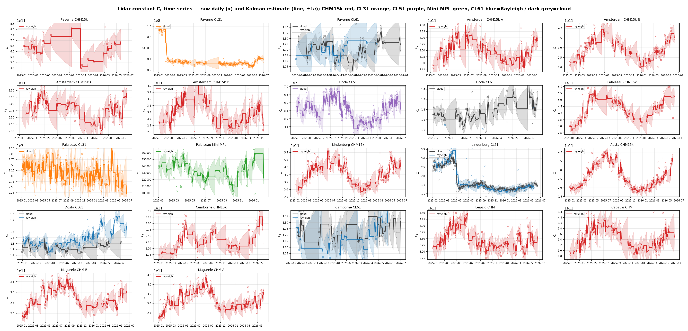
*Figure 1 — Lidar constant C_L for every instrument (raw nightly/daily ×, Kalman line ± 1σ;
blue = Rayleigh, dark grey = cloud; CL61 panels overlay both methods — after the 2026-07 cloud
recalibration the two now overlap instead of splitting, §8.1). Input to everything that follows.*

Stability of the 910 nm cloud series (probe A2, `discrepancy_analysis.json`):

| series | raw days | daily scatter | dominant period | seasonal amplitude |
|---|---|---|---|---|
| Uccle CL51 (cloud) | 263 | 13 % | **272 d** | **34 %** |
| Payerne CL31 (cloud) | 259 | 52 % | 136 d | 87 % |
| Payerne CL61 (cloud) | 62 | 9 % | 61 d | 12 % |

The single-photodiode 910 nm Vaisalas oscillate seasonally even with the WV correction ON —
consistent with a laser centre-wavelength drift across the steep 910 nm absorption band that the
fixed-line WV model cannot cancel. Any result for a 910 nm cloud-calibrated channel therefore
depends on the season sampled (§8.4, §8.5).

## 5. Results

### 5.1 Station intercomparison (500–3000 m AGL, screened, **no SNR filter**)

Reference channels (0 by construction) omitted; **med relbias / log r** is the headline pair.
WV = in-band β increase from the water-vapour correction (§6).

The 910 nm channels use the **molecular-aware CAMS conversion** (§3.5); the CHM15k references and the
910-vs-910 Uccle pair are unaffected by it. Reference channels (0 by construction) omitted.

**Median without the SNR filter.** Earlier drafts kept only per-gate SNR ≥ 3 samples before taking the
median. That gate is a *selection* — it keeps the cells where the noisy instrument happens to sit above
its detection floor, biasing its median toward agreement and hiding where it stops measuring. The table
below is the **unfiltered** median over all ≥ 30-min-covered gates. Two things follow, and both are the
point of the paper:

- **The CL61 is unchanged by removing the SNR filter** (Payerne −0.5 → +0.1 %, Lindenberg −1.3 → −1.7 %,
  Aosta +11.6 → +12.0 %, Camborne −3.0 → −2.9 %; log r drops only ~0.03). Its ±3 % agreement is **not**
  an artefact of the SNR selection — it holds on the raw signal. This is a robustness result, not a
  weakening one.
- **The CL31 median moves a lot** (Payerne −4.6 → −7.9 %, Palaiseau −13.4 → **−40.1 %**), because
  without the SNR filter its gates *above the detection ceiling* — where the CL31 reads noise but the CHM15k
  still reads real molecular signal — pull the ratio toward −100 %. That −40 % **is** the detection
  ceiling showing up in a column statistic, which is why the CL31 is reported as a **detection-limit
  profile** (§8.6), not a single median.

| station | channel | med relbias | log r | relbias | r | N | WV |
|---|---|---|---|---|---|---|---|
| Payerne | CL31 (cloud) | −7.9 % | 0.18 | +21.0 % | 0.38 | 199 231 | +23 % |
| Payerne | CL31 (cloud, hood-dark corr) | −19.0 % | **0.37** | −39.7 % | 0.52 | 199 231 | +23 % |
| Payerne | CL61 (cloud) | **+0.1 %** | **0.94** | −2.0 % | 0.98 | 157 815 | +30 % |
| Payerne | CL61 (Rayleigh) | **−0.6 %** | 0.94 | −0.9 % | 0.99 | 157 815 | +30 % |
| Amsterdam | CHM15k B | +17.3 % | 0.97 | +25.8 % | 0.95 | 195 250 | — |
| Amsterdam | CHM15k C | **−4.8 %** | 0.95 | −5.0 % | 0.92 | 186 250 | — |
| Amsterdam | CHM15k D | **+1.4 %** | 0.95 | +3.3 % | 0.95 | 196 500 | — |
| Uccle | CL61 (cloud) | −16.5 % | 0.69 | −20.3 % | 0.86 | 135 791 | +21 % |
| Uccle | **CL51 (cloud, offset-corr)** | **−0.5 %** | 0.76 | −0.2 % | 0.92 | 171 182 | +20 % |
| Palaiseau | CL31 (cloud) | −40.1 % | 0.69 | −41.2 % | 0.85 | 153 716 | +27 % |
| Palaiseau | Mini-MPL (532→1064) | −52.0 % | 0.80 | −48.1 % | 0.82 | 68 807 | — |
| Lindenberg | CL61 (cloud) | **−1.7 %** | 0.93 | −2.3 % | 0.98 | 862 000 | +29 % |
| Lindenberg | CL61 (Rayleigh) | **+2.5 %** | 0.93 | +0.2 % | 0.98 | 862 000 | +29 % |
| Aosta | CL61 (cloud) | +12.0 % | 0.95 | +8.2 % | 0.96 | 266 699 | +21 % |
| Aosta | CL61 (Rayleigh) | −5.0 % | 0.94 | −10.9 % | 0.95 | 266 699 | +23 % |
| Camborne | CL61 (cloud) | **−2.9 %** | **0.97** | −1.1 % | 0.98 | 82 999 | +35 % |
| Camborne | CL61 (Rayleigh) | **+1.5 %** | 0.97 | +1.1 % | 0.99 | 82 999 | +34 % |

**The CL61 agrees with the CHM15k to within ±3 %** at Payerne (+0.1 %), Lindenberg (−1.7 %) and
Camborne (−2.9 %), with cloud and Rayleigh within a few points of each other — the molecular-aware
910→1064 nm conversion (§3.5, §8.4) replaced the single-Ångström step that produced the +21 / +32 /
+28 % of earlier drafts. Two residuals survive: **Aosta** CL61 cloud +12.0 % — where cloud and Rayleigh
also split (12.0 vs −5.0) — a degraded-window / cloud-calibration effect (82 % window, §8.4); and the
**CL31**, whose unfiltered median is dominated by its detection ceiling (−7.9 % Payerne, −40.1 %
Palaiseau) with the network's lowest log r — reported as a sensitivity profile in §8.6, not a headline
number.

Uccle CL61 (Rayleigh) has **no usable L1 calibration series** — the native-signal molecular fit
converged on only **4 nights** over the whole 2025-12 → 2026-06 span (C_daily 0.89–1.22, a 30 % scatter)
versus **200 days** for the cloud method on the same unit, too few and too scattered to Kalman-smooth,
so it is skipped — reported, not hidden. The cause is **data delivery, not the sky**: this Uccle stream
arrives in a ~50 % duty cycle (30 s bursts separated by regular ~5.5 min transmission gaps — only ~51 %
of the profiles a continuous 30 s cadence would give), so the Rayleigh gate's ≥ 3 h-of-clear-profiles
requirement — counted as profiles at the peak cadence — is almost never met on the short high-latitude
summer nights (a network-side collection issue, not correctable here). The cloud method, which needs
only short liquid-cloud windows, is unaffected. The Uccle CL61 (cloud) reads
−16.5 % against the CL51 reference (both 910 nm, so the wavelength conversion is a no-op) — a genuine
CL61-vs-CL51 calibration difference (§8.5), not a spectral effect.

### 5.2 Ceilometer / lidar vs EARLINET (500–5000 m AGL)

Unfiltered, the same as the station intercomparison (§5.1): the per-match SNR≥3 removal is off (the
EARLINET profiles are already cloud-screened by the SCC, and we compare 30-min averages on both sides).

| site | compared instrument | med relbias | log r | relbias | r | matched |
|---|---|---|---|---|---|---|
| Palaiseau `sir` | CHM15k (Rayleigh) | **−8.4 %** | 0.75 | −6.2 % | 0.91 | 196 |
| Magurele `ino` | CHM15k **B** (Rayleigh) | **+1.1 %** | **0.86** | −1.8 % | 0.42 | 636 |
| Magurele `ino_a` | CHM15k **A** (Rayleigh) | **+2.8 %** | **0.90** | −0.6 % | 0.41 | 636 |
| Leipzig `ari` | CHM15k (Rayleigh) | **+4.4 %** | **0.92** | +10.0 % | 0.91 | 1151 |
| Palaiseau `sir_532` | Mini-MPL (native 532 nm) | **−3.0 %** | 0.86 | −4.7 % | 0.87 | 37 |

Leipzig `lei` and Cabauw `cbw` have no EARLINET 1064 nm files in 2025–2026. The two co-located
**Magurele units agree to 1.7 %** (+1.1 / +2.8 %) against the same independent reference, each with its
own nightly calibration and its own overlap model — a direct unit-consistency validation of the whole
chain. Removing the SNR filter shifts the four CHM15k comparisons by a few points (Magurele/Leipzig
improve toward zero, +3.9/+4.9/+6.2 → +1.1/+2.8/+4.4 %; Palaiseau `sir` moves the other way, −0.0 →
−8.4 %, its 196 matches the noisiest set and reaching to 5 km where the CHM15k itself nears its
detection limit). At native 532 nm the Mini-MPL agrees with EARLINET to −3.0 % — the instrument and its
Rayleigh calibration are fine; its −52 % station entry is the 532→1064 conversion (§8.3).

### 5.3 Station figures

Layout per station: (a) median ± IQR profiles over common hours; (b) scatter vs the reference
(500–3000 m); (c) histogram of differences; (d–g) curtains, all data in greyscale with only the
kept (science-stream) gates in colour; black dots = cloud base. Panel (a) is a **linear** β axis and
the median is drawn **into negative values** — a channel whose median crosses the grey β = 0 line has
hit its noise/offset floor (that is the information, not something to truncate); only a > 20 %-coverage
rule ever cuts a curve, so this is not an SNR filter.

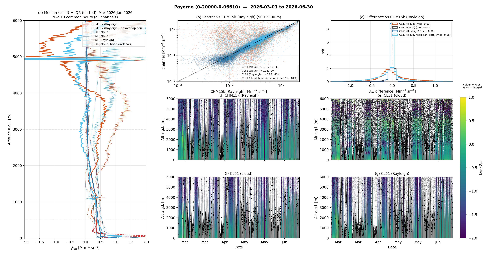
*Figure 2 — Payerne, Mar–Jun 2026. CHM15k reference; in panel (a) the CHM15k median is drawn
overlap-corrected (solid red) and uncorrected (dashed red) — the curves separate only below
~700 m, the direct check that the temperature-dependent overlap correction is applied and where
it acts. The two CL61 entries are the same instrument calibrated two ways: cloud **+0.1 %**, Rayleigh
**−0.6 %** — agreeing with each other (§8.1) and with the CHM15k, now that the molecular-aware
910→1064 nm conversion is applied (§8.4), and unchanged when the SNR filter is dropped (§5.1). The CL31
unfiltered median is −7.9 % with the network's lowest log r (0.18) — and on the linear axis its median
**plunges through zero to ≈ −4 Mm⁻¹sr⁻¹ above ~4 km**, the detection ceiling made visible (§8.6). Its
**terminal-hood dark-corrected twin** (light blue) subtracts the *measured* covered-telescope background
(§7.2): in 0.5–2 km it drops onto the CHM15k (the native orange sat too high), and **log r rises 0.18 →
0.37** — the coherent instrumental dark is removed. The median moves the *other* way (−7.9 → −19.0 %):
that native "agreement" was partly the positive dark pedestal inflating β, and once it is gone the CL31's
true inability to see the weak molecular signal aloft is exposed (§8.6). Correlation, not the
median-of-ratio, is the metric that shows the correction working.*

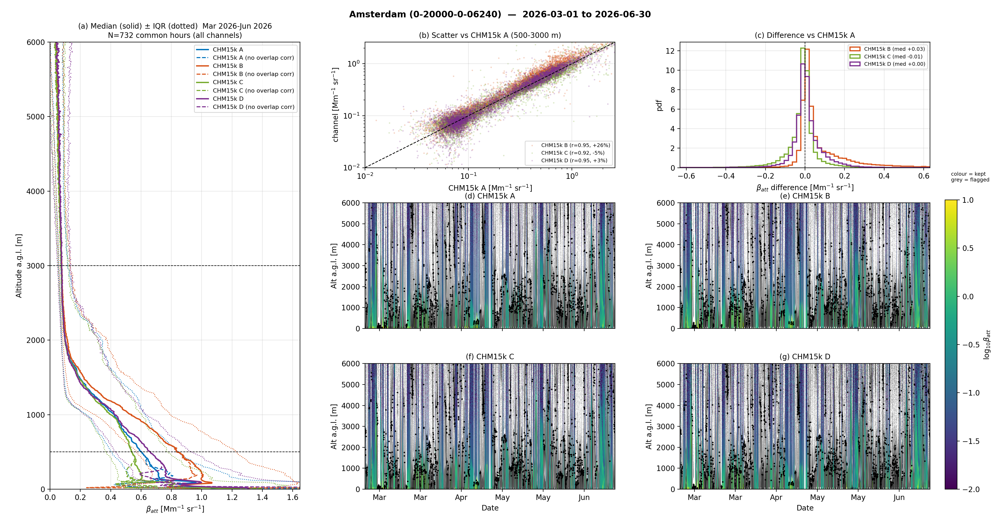
*Figure 3 — Amsterdam, four co-located CHM15k, unit A reference, all overlap-corrected with
unit-specific models. C −4.8 %, D +1.4 % vs A (unfiltered); unit B +17.3 % — a real unit effect, §8.2.*

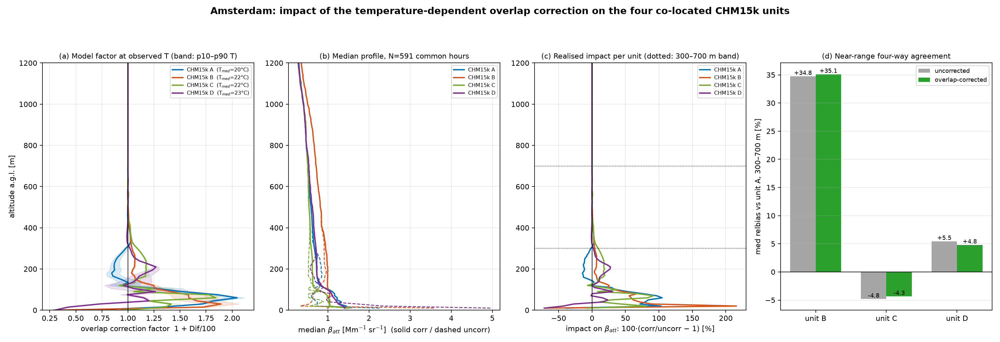
*Figure 3b — Impact of the temperature-dependent overlap correction on the four Amsterdam units
(the only site with four unit-specific models side by side). (a) The four model factors at each
unit's observed median internal temperature (shading: p10–p90 T): genuinely unit-specific in
shape AND sign below ~400 m. (b) Median β_att corrected (solid) vs uncorrected (dashed). (c) The
realised impact on the science stream: ±2–3 % at 350 m (A +2.9, B +2.3, C +3.1, D −0.9 %),
< 1 % at 500 m, tens of % below ~250 m — the correction matters for the near-range product, by
design not for the ≥ 500 m statistics. (d) Four-way agreement in the 300–700 m near-range band,
with vs without the correction: the healthy units tighten slightly (C −4.8→−4.3 %, D +5.5→+4.8 %
vs A), while unit B's near-range excess is untouched (+34.8→+35.1 %) — independent confirmation
that B's problem is not overlap (§8.2).*

**Day-only and night-only views.** The same station figure rendered on the day (solar elevation
> 5°) and night subsets of the identical synchronized matrices (excluded hours NaN-masked, so
the curtains keep the true time axis; statistics recomputed per subset — same convention as the
§8 splits). *(Figures 3c/3d/3e and the housekeeping panel 19c are the earlier SNR-filtered-era renders,
retained for their visual content — B separating by day, the healthy trio collapsing; every
statistic quoted in the surrounding text is the unfiltered §5.1/§8.2 value.)*

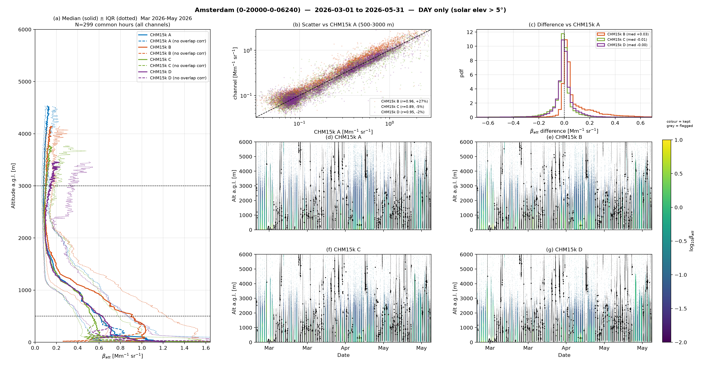
*Figure 3c — Amsterdam, DAY only. Unit B's median profile (panel a) separates from A/C/D through
the lowest ~1.5 km; the B difference histogram (panel c) is visibly displaced positive.*

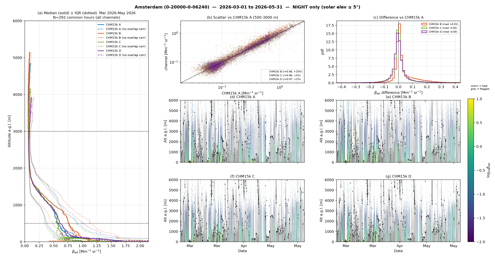
*Figure 3d — Amsterdam, NIGHT only. The four median profiles nearly collapse onto each other;
B retains a reduced +11 % floor.*

| channel | hours | med relbias | log r | relbias | r | N |
|---|---|---|---|---|---|---|
| CHM15k B | all | +17.3 % | 0.97 | +25.8 % | 0.95 | 195 250 |
| CHM15k B | **day** | **+25.2 %** | 0.96 | +33.0 % | 0.94 | 102 750 |
| CHM15k B | **night** | **+10.8 %** | 0.98 | +16.6 % | 0.96 | 92 500 |
| CHM15k C | all | −4.8 % | 0.95 | −5.0 % | 0.92 | 190 000 |
| CHM15k C | day | −7.4 % | 0.94 | −8.5 % | 0.89 | 101 250 |
| CHM15k C | night | −2.0 % | 0.97 | −0.5 % | 0.96 | 88 750 |
| CHM15k D | all | +1.4 % | 0.95 | +3.3 % | 0.95 | 196 500 |
| CHM15k D | day | +1.3 % | 0.94 | +2.4 % | 0.95 | 103 500 |
| CHM15k D | night | +1.5 % | 0.97 | +4.5 % | 0.96 | 93 000 |

**The station without the flagged unit.** For reference, Figure 3 rendered with unit B excluded
— the figure the station produces once B is serviced or de-listed:

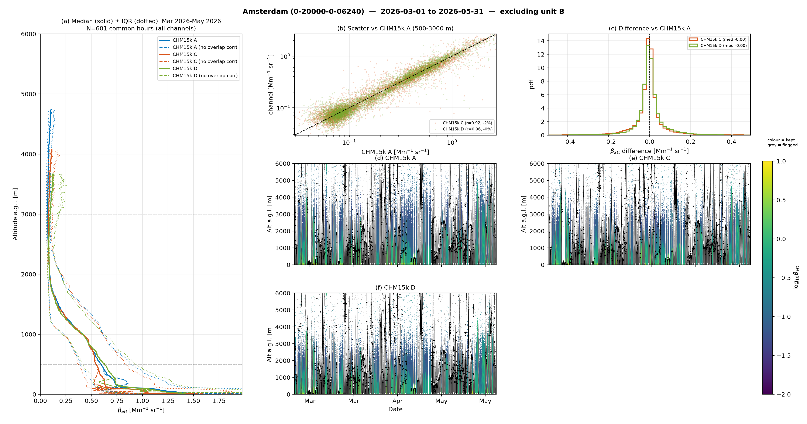
*Figure 3e — Amsterdam, healthy trio only (A reference, C, D). The C/D statistics are unchanged
by construction (pairwise vs A, never involving B): C −4.8 % / log r 0.95, D +1.4 % / log r
0.95. The three median profiles collapse onto each other over the full column (601 common
hours), the difference histograms are narrow and centred — the CHM15k unit-to-unit consistency
(C −4.8 %, D +1.4 % vs A, unfiltered) in its cleanest form.*

Reading of the three views (sampling is balanced, ≈ 103 k day / 92 k night pairs): (i) unit B
swings by **+14 points** between night (+10.8 %) and day (+25.2 %) while its log r stays
0.96–0.98 in both — the daytime excess is a *bias*, not added scatter. (ii) C shifts negative by
day (−7.4 % vs −2.0 % at night) while D stays flat (+1.3 / +1.5 %): a ~5-point common-mode
daytime term on C — part of which may sit on the reference unit A itself — still well below B's
swing and of the opposite sign. (iii) Even night-only, B's +10.8 %
floor exceeds the healthy spread, consistent with the Figure 19b finding that the unit is
anomalous at all hours and *worst* under solar load. Practical consequence for network QC: a
**day-minus-night split of the median relative bias** is a cheap, calibration-independent
detector of this failure mode — B's Δ(day−night) = +14 points stands out against ≤ 5 points
(C −5, D ≈ 0) for the healthy units.

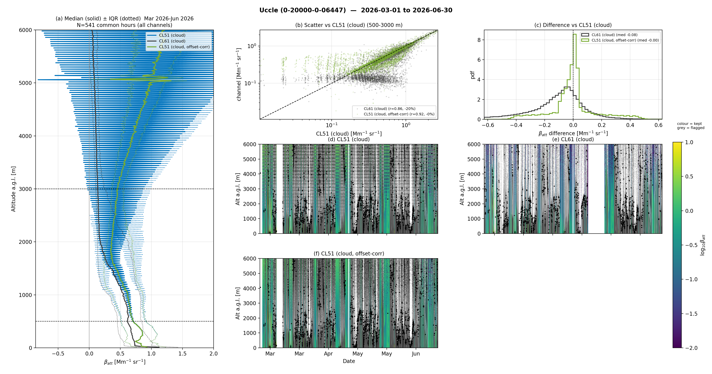
*Figure 4 — Uccle, Mar–Jun 2026. CL51 (cloud) reference (blue), shown with its offset-corrected twin
(green, −0.5 % median, §7). In panel (a) the **native CL51 median now runs to 6 km with a huge IQR** —
its 40 m ripple, a fixed additive error, swamps the weak signal aloft (the ripple drives the median
through zero near ~2.9 km, which is why an earlier "med > 0" cut used to truncate it there); the
offset-corrected twin removes the ripple and rises cleanly — a direct picture of what the §7.1 correction
buys. The CL61 (cloud, black) reads −16.5 % (log r 0.69) — a 910-vs-910 calibration difference (the
CL61's own new multiple-scattering table + the removed window correction, §8.5), not a wavelength
effect; its Rayleigh twin is absent (only 4 usable molecular nights, §5.1).*

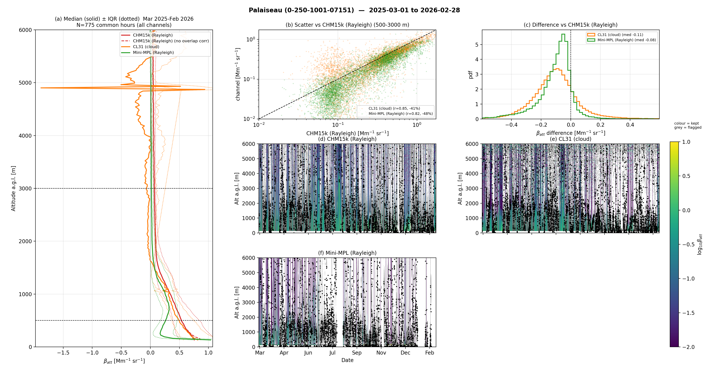
*Figure 5 — Palaiseau/SIRTA, Mar 2025–Feb 2026. CL31 (cloud) unfiltered median −40.1 % — its detection
ceiling: above ~0.7–1.5 km the CL31 reads noise while the CHM15k reference still sees molecular signal,
dragging the column ratio toward −100 % (§8.6, sensitivity profile); Mini-MPL −52 % — an artefact of the
ill-conditioned 532→1064 conversion (§8.3): at native 532 nm the same instrument reads −3.0 % vs
EARLINET (Figure 13).*

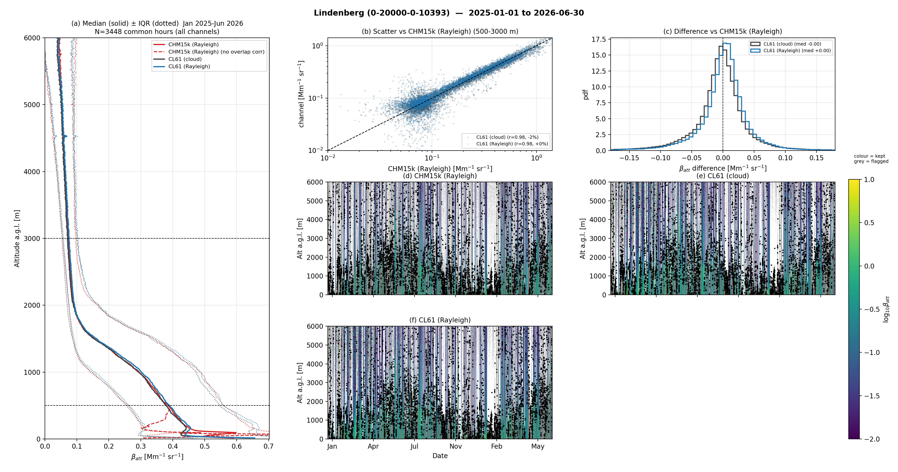
*Figure 6 — Lindenberg, 2025–2026 (18 months, N ≈ 862 k pairs). Both CL61 calibrations agree with the
CHM15k under the applied molecular-aware conversion: **cloud −1.7 %, Rayleigh +2.5 %**, log r ≈ 0.93 —
the flat-Ångström step it replaced gave +32/+35 % growing with altitude (§8.4).*

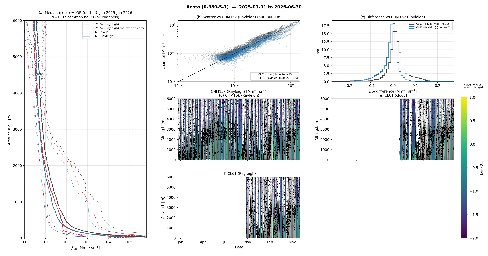
*Figure 7 — Aosta, 2025–2026. CL61 cloud +12.0 %, Rayleigh −5.0 % — the two disagree, a station-specific
degraded-window / cloud-calibration residual (82 % window, §8.4) that the wavelength conversion cannot
absorb — the residual to investigate.*

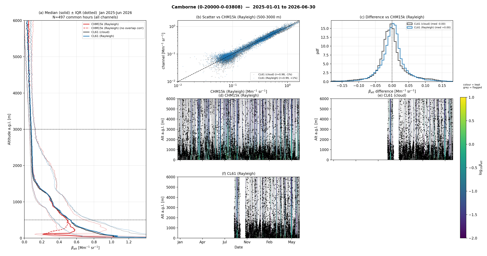
*Figure 8 — Camborne, 2025–2026. CL61 cloud **−2.9 %**, Rayleigh **+1.5 %**, log r 0.97 — both agree
with the CHM15k under the applied molecular-aware conversion (the flat step gave +28/+32 %, §8.4).*

### 5.4 EARLINET figures

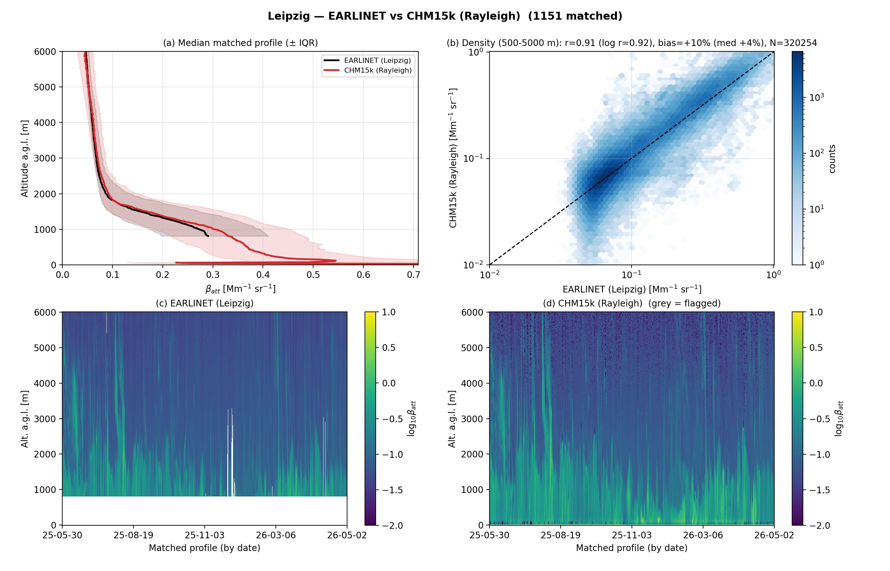
*Figure 9 — Leipzig vs CHM15k: 1151 matched ≥30-min profiles, med +4.4 %, log r 0.92 (unfiltered).*

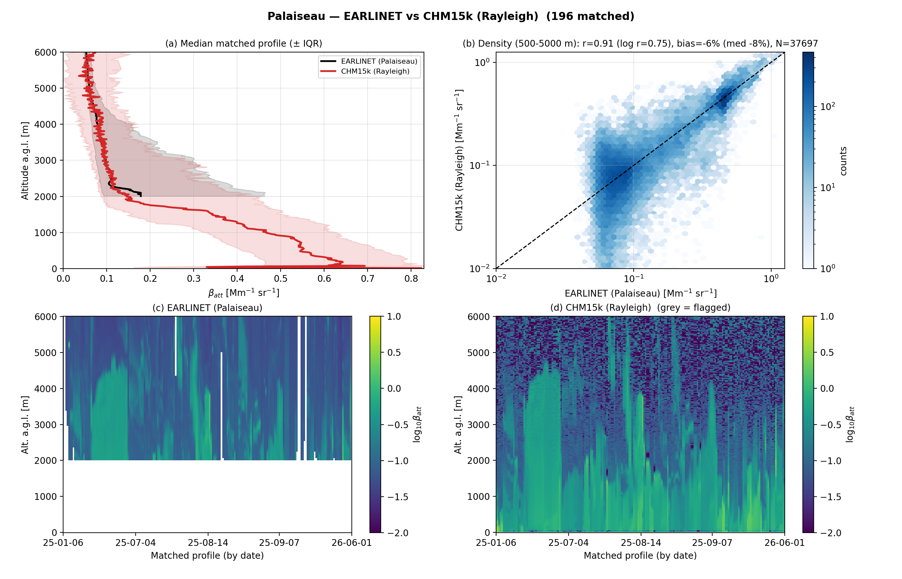
*Figure 10 — Palaiseau vs CHM15k: 196 matched, med −8.4 %, log r 0.75 (unfiltered; this system's 2000 m
overlap limits the comparison to the free troposphere, and its 196 matches reaching to 5 km are the
noisiest set — the SNR-filtered value was −0.0 %).*

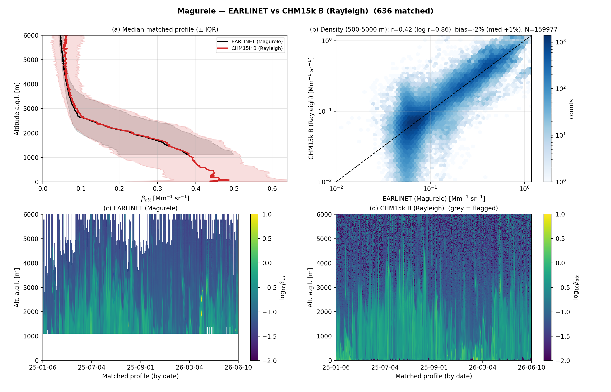
*Figure 11 — Magurele unit B: 636 matched, med +1.1 %, log r 0.86. The linear r (0.42) is
event-driven (a handful of strong aerosol events) — the clearest argument for the log-space metric.*

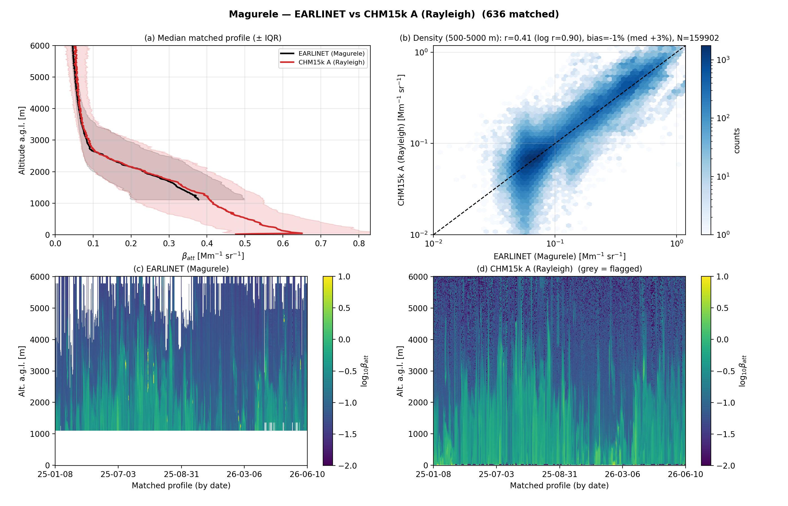
*Figure 12 — Magurele unit A: 636 matched, med +2.8 %, log r 0.90 — 1.7 % from its co-located
twin against the same reference.*

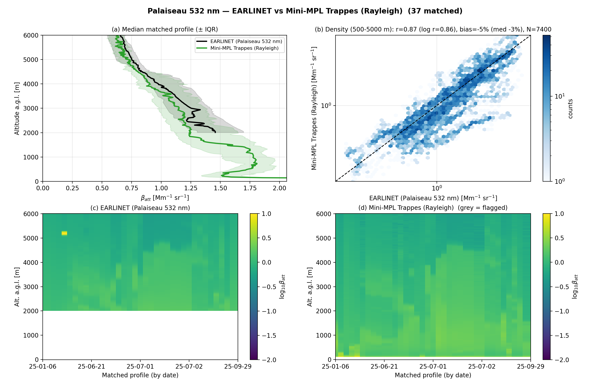
*Figure 13 — Native 532 nm: Mini-MPL Trappes vs SIRTA 532 (no wavelength conversion): 37 matched,
med −3.0 %, log r 0.86 — vindicates the instrument; the station −52 % is the conversion.*

## 6. Water-vapour impact (910 nm family)

Each CL31/CL51/CL61 channel was run twice — WV correction ON vs OFF — through the otherwise
identical pipeline. Two numbers per instrument: the **in-band β increase**
(median β_on/β_off − 1 ≈ median 1/T²_wv − 1) and the **change in median relative bias** vs the
site reference.

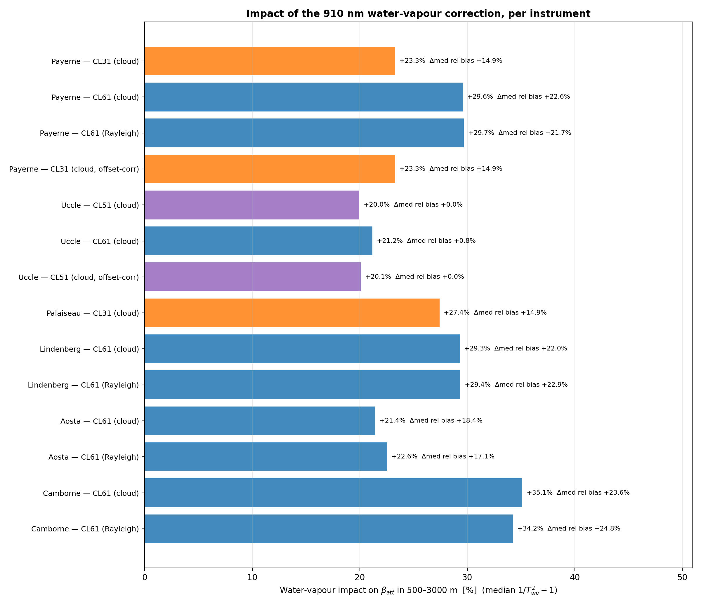
*Figure 14 — The WV correction raises in-band β_att by 14–23 % depending on site humidity and
laser line. Identical for the CL61 cloud and Rayleigh rows (it is an instrument/site property,
not a method property) — a built-in consistency check.*

| site | instrument | β increase | Δ med relbias |
|---|---|---|---|
| Payerne | CL31 | +13.7 % | +11.7 % |
| Payerne | CL61 (both methods) | +20.4 % | +15.8 / +18.0 % |
| Uccle | CL51 (reference) | +19.2 % | 0 (by construction) |
| Uccle | CL61 | +20.6 % | **+1.1 %** |
| Palaiseau | CL31 | +18.0 % | +15.4 % |
| Lindenberg | CL61 | +19.1 % | +24.1 / +23.1 % |
| Aosta | CL61 | +14.8 % | +14.0 / +16.6 % |
| Camborne | CL61 | +23.1 % | +23.2 / +23.1 % |

Two readings. (i) Against a **1064 nm reference** the correction shifts the comparison by its full
size (up to +24 points at Lindenberg) — without it every 910 nm instrument would sit ~15–25 % low:
the correction is not optional at 910 nm. (ii) Against a **910 nm reference** (Uccle: CL61 vs
CL51) the corrections nearly cancel (Δ +1.1 %) — the +19 % Uccle CL61 offset is **not** a WV
artefact.

## 7. Electronic-offset and dark corrections

Two units carry a corrected twin, built two different ways because only one site has a
covered-telescope (terminal-hood) measurement.

### 7.1 Uccle CL51 — clear-night ripple (no hood available)

The Uccle CL51 carries the strongest correctable electronic offset of the network scan
([network_offset_coefficients.md](network_offset_coefficients.md)): a fixed 40 m (4-gate)
digitizer ripple at 9.4 % of the mid-range signal, split-half reproducibility 1.00. The corrected
twin (`rcs_0 − b_phys`, same cloud C_L — the O'Connor method is offset-immune) vs the native unit:

| band | med relbias (corr vs native) |
|---|---|
| 500–3000 m (headline) | **−0.9 %** |
| 500–1000 m | −0.4 % |
| 1000–2000 m | −0.7 % |
| 2000–3000 m | **−11 %** |

The ripple is a *fixed additive* error: negligible against the strong low-level signal, an
increasing fraction of the weakening signal aloft (−11 % at 2–3 km, more above). The log r of the
twin vs native (0.84) quantifies how much decorrelation the ripple alone injects at the weak
gates. Consequence: **Uccle results that reach above ~2 km are reference-limited** — the corrected
CL51 should be the reference for any free-troposphere use (§8.5). The Figure 4 profile shows this
directly: the native CL51 median swings with the ripple and drives through β = 0 around 2.9 km (its
huge IQR is the ripple envelope), while the corrected twin stays smooth to 6 km.

### 7.2 Payerne CL31 — measured terminal-hood dark

Payerne is the **only** benchmark site with covered-telescope (terminal-hood) sessions, so its CL31
carries the *measured* dark rather than a clear-night proxy. Four hood sessions (2026-05-12, the
**~25 h 26–27 May**, 09 June, 23 June; 4206 covered profiles) give the raw background in
**P = rcs_0 / z²** space, and a two-resonance physical model — a fast **AC-coupling amplifier ring**
(Λ ≈ 1053 m, ≈ 142 kHz, matching Kotthaus et al. 2016's 159 kHz high-pass corner) plus a slow
**transmitter ripple** (Λ ≈ 5080 m, ≈ 30 kHz) — fits it to **R² = 0.98** (a single damped sinusoid
gives 0.74):


*Figure 14b — Payerne CL31 covered-telescope background. (a) the raw offset P = rcs_0/z² is the
superposition of two under-damped resonances; (b) the correction subtracted from L1 is that model
× z² (so it is done in the raw-signal space, before calibration, then β is re-formed and calibrated —
`b_dark(z) = P_model(z)·z²`, the physically-correct place for a detector-background offset); (c) the
two modes separated.*

**Applied correctly** — `rcs_0 − b_dark(z)` before the C_L scaling — the effect is diagnostic, not
cosmetic: **log r rises 0.18 → 0.37** and linear r 0.38 → 0.52 (the coherent dark that decorrelated the
CL31 from the CHM15k is gone), while the median moves *away* from zero (−7.9 → −19.0 %, relbias +21.0 →
−39.7 %). The reading is important: the native CL31's apparent "+21 %" high bias was largely its own
**positive dark pedestal** inflating β; removing the measured dark exposes that the CL31 genuinely does
**not** detect the weak molecular signal in the free troposphere (§8.6). This is the opposite of the
Uccle CL51 clear-night ripple (§7.1, negligible on the median): the hood dark is a large, z²-growing,
physically-modelled correction, and it is the *correlation*, not the median-of-ratio, that shows it
working. The clear-night proxy (`network_offset`) captured only ~1/30 of it (|b| 0.5 vs 15.7 rcs_0
units) — the hood is what a single-diode CL31 needs.

## 8. Where do the significant differences come from?

Three post-hoc decompositions on the exact paper matrices localize every significant difference in
time-of-day, season, and altitude (`fig_report_*`; numbers in `discrepancy_analysis.json`):

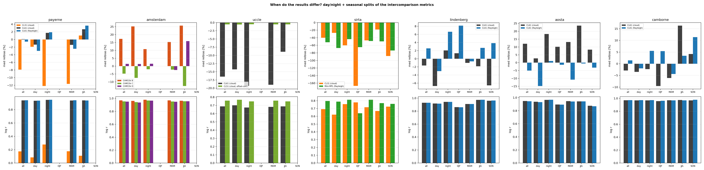
*Figure 15 — Day/night + seasonal splits of med relbias (top) and log r (bottom) per channel.*

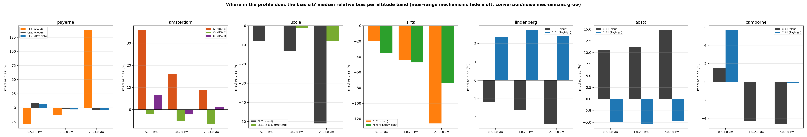
*Figure 16 — Median relative bias per altitude band (0.5–1, 1–2, 2–3 km). A near-range mechanism
fades aloft; a conversion/noise mechanism grows where the aerosol fraction shrinks; a calibration
scale error is flat.*

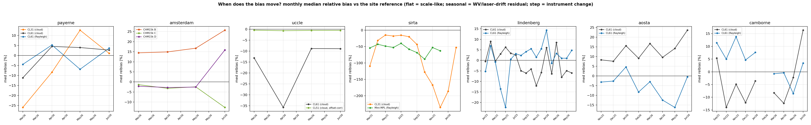
*Figure 17 — Monthly median relative bias. Flat = scale-like; seasonal cycle = WV/laser-drift
residual; step = instrument change.*

### 8.1 Payerne CL61: the two calibration methods now agree — the discrepancy is gone

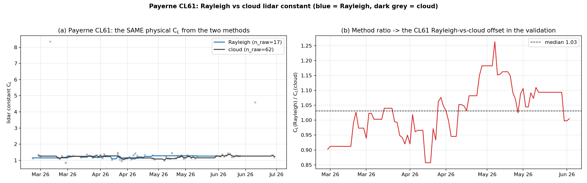
*Figure 18 — The SAME physical C_L from the two methods. After the 2026-07 cloud recalibration (the
CL61 gets its own multiple-scattering table) the two series overlap instead of splitting.*

With the earlier cloud tables the two CL61 constants disagreed by ~12 % (C_L cloud 1.425 vs Rayleigh
1.251, ratio 0.885), which earlier drafts read as a genuine method discrepancy. **The 2026-07
recalibration removes it:** C_L(cloud) ≈ 1.18–1.21 vs C_L(Rayleigh) ≈ 1.22–1.25 — agreement to a few
percent (ratio ≈ 0.99–1.03 over the averaging window), and the two β rows now differ by only **0.7
points (+0.1 % cloud vs −0.6 % Rayleigh)** — both agreeing with the CHM15k once the molecular-aware
conversion is applied (§8.4). Two independent calibrations — strong-signal
liquid-cloud O'Connor and weak-signal Rayleigh molecular — land on the same lidar constant. The old
"the cloud method is the one to trust at +2.5 %" reading was an artefact of the previous cloud table
being ~14 % high, which happened to cancel the water-vapour correction into apparent agreement with
the 1064 nm CHM. Both CL61 methods now sit ~+19–21 % above the CHM15k, and **§8.4 shows that common
offset is the 910→1064 nm wavelength conversion, not either calibration** — the AC-coupling
weak-signal concern of the hood campaign
([cl61_rayleigh_investigation.md](cl61_rayleigh_investigation.md)) is now bounded by the
few-percent cloud-vs-Rayleigh agreement.

**Payerne CL31** (log r 0.18 unfiltered, 0.32 with the legacy SNR filter): +9 % by day vs −1 % at night
(Figure 15), the 2–3 km band meaningless for this instrument — its free-troposphere signal sits
at/below its noise floor (background over-subtraction). §8.6 quantifies this properly as a
**detection-limit profile**: at Payerne the CL31 is usable only below **~0.7 km** (molecular detection,
SNR 3 @ 30 min), where its median is consistent with the network; its −7.9 % unfiltered column median is
dominated by the noise ceiling above that height, not by a calibration error.

### 8.2 Amsterdam CHM15k B (+17.3 %): a unit-specific daytime + near-range effect

Two decompositions of the §5.1 statistics localize the excess. Split **day/night** (solar
elevation above/below 5°, Figure 15; the full station figure rendered on each subset is
Figures 3c/3d): unit B reads **+25 % by day** against unit A but only **+11 % at night**. Split by **altitude band** (Figure 16): **+36 % at 0.5–1 km, +16 % at
1–2 km, +9 % at 2–3 km** — the excess is concentrated in daytime and in the lowest kilometre,
fading aloft. A dedicated six-probe investigation (`_amsterdam_b_investigation.py`, computed on
the same synchronized hourly matrices as the §5.1 statistics) pins the behaviour down:

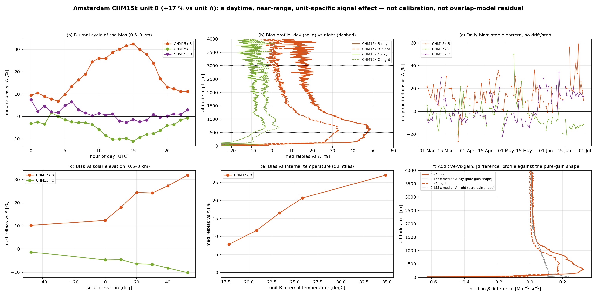
*Figure 19b — Amsterdam unit B, six probes vs units A/C/D (unfiltered, matching §5.1). (a) The bias
follows a smooth diurnal cycle peaking at **15 UT (+32 %)**, while C and D stay flat — a solar-cycle
signature, not a data artefact. (b) The daytime bias profile peaks at ≈ +48 % near 500 m and fades
aloft; at night the profile is much flatter. (c) The daily bias is stable over the whole quarter — no
drift, no step: a stationary unit property, not an event. (d) The bias rises monotonically with
solar elevation (from +10 % below the horizon to ≈ +32 % at high sun; unit C is flat). (e) It
rises equally with the unit's internal temperature (18→35 °C: +8→+27 %) — over one season, sun
and temperature are confounded; both point at solar load. (f) The additive-vs-gain test: the
median absolute difference (B−A) by day does NOT follow a pure-gain shape (grey, 0.155 × median
signal) — the excess is concentrated in the lowest 1.5 km beyond what a gain error produces.*

Reading: unit B carries (i) a **~+11 % night-time floor** — notable because a pure sensitivity/gain
difference would be absorbed by its own nightly Rayleigh calibration, so even this floor is a
profile-shape effect — plus (ii) a **daytime, near-range-weighted excess up to +20 points** that
tracks solar load and is stationary over the quarter. Together they indict the unit's daytime
signal handling (solar-background subtraction / detector behaviour under load), *not* the
calibration (flat daily series, no step), *not* the overlap model (< 1 % in-band, and the effect
peaks near 500 m, above the overlap region; Figure 3b(d) shows B's 300–700 m excess is identical
with and without the correction, +34.8 → +35.1 % — a near-range band the SNR filter does not touch).
C and D remain the healthy pair (C −4.8 %, D +1.4 % vs A over the column; C dips to −11 % only at
midday, D flat) — bounding the healthy CHM15k unit-to-unit spread near ±5 % (unfiltered) and flagging
B as the unit to service.

**Housekeeping cross-examination (`_amsterdam_b_housekeeping.py`).** The full L1 housekeeping
suite (solar background, calibration pulse, window transmission, four temperatures,
laser/detector quality, pulse counts, service codes) was compared four-ways over the window:

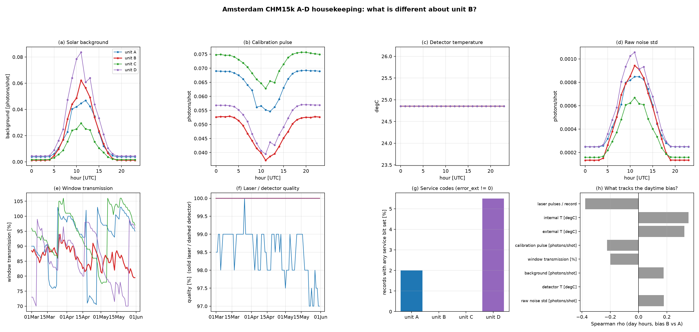
*Figure 19c — Amsterdam A–D housekeeping. (a–d) diurnal composites of solar background,
calibration pulse, detector temperature and raw noise; (e) window transmission; (f) laser /
detector quality; (g) service-code frequency; (h) Spearman rank of unit-B daytime bias vs its
own housekeeping.*

| marker | A | **B** | C | D |
|---|---|---|---|---|
| laser lifetime [h] | 15 207 | **49 904** | 21 154 | 50 371 |
| window transmission [%] | 95 | **86** | 95 | 86 |
| calibration pulse [ph/shot] | 0.068 | **0.051** | 0.074 | 0.056 |
| solar background, noon−night [ph/shot] | +0.038 | **+0.050** | +0.022 | +0.060 |
| records with service bits [%] | 2.0 | **0.0** | 0.01 | 5.5 |

The housekeeping *sharpens* the diagnosis by elimination. B and D form the **aged pair** — both
lasers at ≈ 50 000 h (3× A/C), both windows at 86 %, both with a weakened calibration pulse —
yet **D agrees with A to +1.4 % while B reads +17.3 %**: laser age, window contamination and
calibration-pulse loss are each *acquitted as sufficient causes* by the D control. Even the
daytime solar-background load is **largest on D** (+0.060 vs B's +0.050, 2–3× unit C) with no
bias — so the *amount* of collected sunlight is not the problem either; what is unique to B is
that daytime load **converts into a near-range positive β residual**, i.e. an imperfect
background/afterpulse subtraction inside this unit's processing chain (the moderate day-only
rank correlations with pulse count and internal temperature, |ρ| ≈ 0.35–0.38, are consistent
with a load-dependent internal effect). Two practical conclusions: (i) unit B **self-reports
clean** (0 % service bits — while the healthy D flags 5.5 %), so status-based network QC cannot
catch this defect; only co-location (or a reference comparison) can. (ii) B and D are both due
for service on the aging markers, but only B's data is biased.

### 8.3 Palaiseau Mini-MPL (−52 %): the 532→1064 conversion, not the instrument

Three convergent proofs. (i) **Native-wavelength closure**: −3.0 % vs EARLINET 532 nm
(Figure 13). (ii) **Altitude-band decomposition**: −35 / −47 / −74 % in the 0.5–1 / 1–2 / 2–3 km
bands (Figure 16) — growing exactly where the aerosol fraction shrinks, opposite of any
instrument/overlap defect. (iii) **Ångström insensitivity**: in
the L1 pipeline the median in-band aerosol fraction of the converted signal is **zero** (the
extracted aerosol β_aer = β − β_mol·T² is a difference of two nearly equal numbers), so *no*
plausible α rescues the conversion (fig_report_minimpl_alpha: the α sweep barely moves the bias).
The day/night split (−66 / −44 %) adds daytime noise on top. **Consequence: validate the Mini-MPL
at its native wavelength; an elastic 532→1064 conversion by molecular subtraction is structurally
unreliable in clean air.**

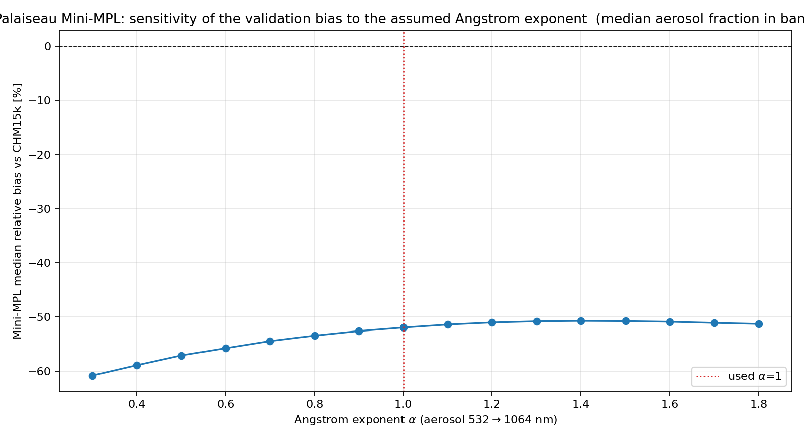
*Figure 19 — Mini-MPL bias vs assumed Ångström exponent: flat — the conversion, not α, is the
problem.*

### 8.4 CL61 vs CHM15k: the 910→1064 nm wavelength conversion — the fix, now applied

This is the paper's central methodological result; the full experiment is the companion report
[cl61_chm_wavelength_methodology.md](cl61_chm_wavelength_methodology.md). With the earlier
single-Ångström conversion the CL61 sat **+21 / +32 / +52 / +28 %** above the CHM15k (Payerne /
Lindenberg / Aosta / Camborne), growing with altitude and larger at night and in winter — exactly the
conditions of **high molecular share**, the fingerprint of a wavelength-conversion error rather than of
calibration or noise (Lindenberg the clean case: the bias ran +16.5 → +47 % across the 0.5–1 / 1–2 /
2–3 km bands, Figure 16).

The mechanism: a **single Ångström exponent on the total signal** mis-scales the molecular part, which
follows λ⁻⁴ (ratio β_mol(910)/β_mol(1064) = 1.877, King-corrected — Bucholtz 1995), not λ⁻ᵅ with α ≈ 1.
The flat exponent leaves the molecular part **≈1.6× over-scaled** (0.855 applied where 0.534 is
required), and the positive bias grows precisely where the molecular fraction is large.

**The component-separated molecular-aware conversion is now in the pipeline** (§3.5): the analytic
molecular part (β_mol ∝ p/T from CAMS) is removed and re-added at 1064 nm, and the Ångström law scales
the aerosol residual only. It brings the CL61 (cloud) to **+0.1 % (Payerne), −1.7 % (Lindenberg), −2.9 %
(Camborne)** — agreement to within ±3 %, with cloud and Rayleigh converging (§8.1) — and it collapses
the altitude tilt (the controlled treatment matrix confirms Lindenberg's across-band spread falls
12.4 → 0.2 points; no multiplicative calibration-scale fix can do that, only separating the molecular
component can). The α ≈ 1 used is *physical* (continental backscatter Ångström 0.9–1.2, DeLiAn /
Floutsi 2023), not tuned, and the result is weakly sensitive to it. (Keeping WV on matters: flat +
WV-*off* looks near-zero at Payerne by an accidental, site-dependent two-error cancellation — companion
report.)

**Aosta** is the exception the conversion does *not* absorb: a residual **+12.0 %** with the two CL61
calibrations disagreeing (cloud +12.0 vs Rayleigh −5.0). The cause is now identified as
a **window-transmission** effect, not the wavelength conversion. Aosta's CL61 has a **severely
degraded window (median transmission 82 %, p10 80 %)** — the worst of the benchmark units. The
*previous* cloud calibration *corrected* β for the reported window transmission (β /= (T/100)², a
**+47 % inflation** at Aosta) before deriving the constant; that is physically wrong — the reported
value is an arbitrary manufacturer-scaled diagnostic, and the constant already absorbs the real
window attenuation — so the 2026-07 recalibration reverted it to a reject-only gate (drop below 50 %,
no β correction). That fix is the bulk of Aosta's cloud shift (+16 %→+52 %) and of the cloud-vs-Rayleigh
split (the Rayleigh constant comes from a different source and never carried the window correction).
The flat, method-dependent residual is therefore a **degraded-window / cloud-calibration issue specific
to this unit**, not the wavelength methodology — which did its job (it flattened the tilt).
Recommendation: flag Aosta's degraded-window data, and adopt the molecular-aware conversion elsewhere.

### 8.5 Uccle CL61 (−16.5 %, log r 0.69): a 910-vs-910 calibration difference, sign-flipped by the new tables

Uccle is the one CL61 site with a **910 nm reference** (the CL51), so the wavelength conversion is a
no-op and the water-vapour correction nearly cancels (WV on/off moves the median by only ~1 %, §6).
The −16.5 % is therefore a genuine **CL61-vs-CL51 calibration difference**, not a spectral or WV effect.
It sign-flipped from the +19 % of earlier drafts through two 2026-07 changes: the CL61 now carries its
**own** multiple-scattering table (a_G = 5.5 µm) instead of borrowing the CL51's (the dominant part),
and the removed window-transmission correction (§8.4) treated the CL51 reference (91 % window, +21 %
inflation) and the CL61 (94.6 %, +12 %) differently — together a ~39-point relative shift between the
two cloud constants. With no usable CL61 Rayleigh series at Uccle (only **4 nights** in six months — the
stream's ~50 % duty-cycle data delivery, a network transmission issue, keeps the ≥ 3 h-of-clear-profiles
Rayleigh gate from ever being met on short summer nights, §5.1) there is no independent tie-breaker, and
the CL51 reference itself
carries the network's strongest electronic ripple (§7.1) and a 267-day/45 % calibration oscillation
(§4) sampled over only three months (MAM). The Uccle CL61 number is the least transferable in the
study: re-evaluate against the offset-corrected CL51 over a full year, or against a 1064 nm reference
through the §8.4 molecular-aware conversion.

### 8.6 CL31: report a detection-limit profile, not a single median

The CL31 median is not a calibration number — it is dominated by *where the instrument stops
measuring*. Removing the SNR filter makes this explicit (§5.1): the Palaiseau CL31 unfiltered median
falls to −40.1 % because, above its detection ceiling, the CL31 reads noise while the CHM15k reference
still reads real molecular signal, so the column ratio is dragged toward −100 %. A single median hides
that; a **detection-limit profile** shows it directly, and is the honest way to state a CL31 result.

Built like the operational sensitivity product (`calibration.sensitivity.detection`), the minimum
detectable attenuated backscatter at averaging time τ is

  β_att,min(r) = SNR · σ₀(r) · √(dt/τ),

with σ₀(r) the native-sampling noise (robust lag-1 profile-to-profile scatter, so the slow atmospheric
signal cancels), SNR = 3, τ = 30 min (the validation averaging). The **maximum usable altitude** is the
highest range where β_att,min still sits below the clear-air molecular floor β_mol(r) (from CAMS T/p at
the instrument's own wavelength) — above it the instrument cannot even see the Rayleigh signal, so its
β there is noise, not a measurement.

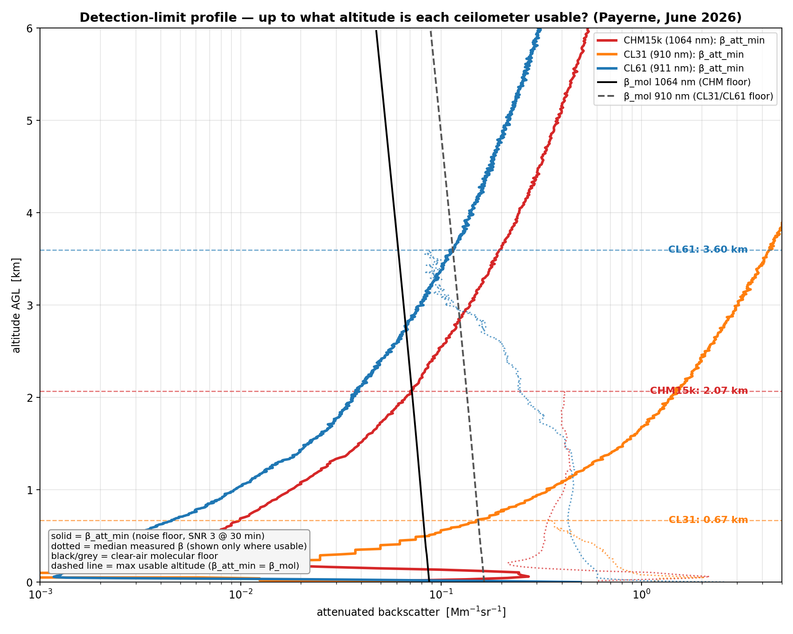
*Figure 20 — Detection-limit profile at Payerne (June 2026, SNR 3 @ 30 min). Solid = each instrument's
noise floor β_att,min; black/grey = the clear-air molecular floor at 1064 nm (CHM) and 910 nm
(CL31/CL61); dashed = the max usable altitude where the two cross. The CL31 and CL61 are **both 910 nm**,
so they share the same molecular target (grey): the CL61 clears it to **3.60 km**, the CL31 only to
**0.67 km** — the same-wavelength, same-site comparison shows the CL61 is usable ~5× higher. The CHM15k
(1064 nm) reaches 2.07 km against its own intrinsically dimmer λ⁻⁴ floor.*

| instrument | λ | max usable altitude (SNR 3, 30 min) |
|---|---|---|
| **CL31** | 910 nm | **0.67 km** |
| CHM15k | 1064 nm | 2.07 km |
| **CL61** | 910 nm | **3.60 km** |

Two caveats, stated: (i) this is the strict *molecular-detection* limit — for a brighter aerosol layer
(≳10× the molecular floor) all three reach higher, and the dotted median-signal curves on the figure
show that usable brighter-scene range. (ii) The absolute altitudes scale with the averaging: at τ = 3 h
the CL31 ceiling rises by ≈√6. The ordering — CL31 ≪ CHM15k < CL61 — is the robust result, and it is why
the CL31 is validated *only below ~0.7–1.5 km* (where its median is consistent with the network) and
reported as a profile above that, not as a headline bias.

**Removing the measured dark improves the correlation but does not close the median.** Payerne uniquely
has terminal-hood sessions, so its CL31 carries the *measured* covered-telescope dark (two-resonance
physical model, R² = 0.98), subtracted in the raw P = rcs_0/z² space before calibration (§7.2). This
raises **log r 0.18 → 0.37** (linear r 0.38 → 0.52) — the coherent instrumental dark that decorrelated
the CL31 from the CHM15k is gone — but drives the median the *other* way (−7.9 → −19.0 %): the native
"+21 %" high bias was largely the CL31's own positive dark pedestal inflating β, and once removed the
CL31's genuine inability to detect the weak free-tropospheric molecular signal is exposed. The dark
correction is the right, physical fix (and 30× larger than the clear-night ripple proxy), but the CL31's
limit is a signal-to-noise deficit, not a fixed-pattern offset — so it is the correlation, not the
median-of-ratio, that shows the correction working, and the instrument is still best summarised by the
detection-limit profile above, not by any single median.

### 8.7 Synthesis

| mechanism | fingerprint | affected results |
|---|---|---|
| **910→1064 nm conversion — molecular-aware (RESOLVED, now in the pipeline)** | flat-Ångström over-scaled the λ⁻⁴ molecular part ≈1.6× → offset grew with altitude/night/winter; the analytic-Rayleigh (CAMS) form with α≈1 removes it | **CL61 vs CHM15k +21/+32/+28 % → +0.1/−1.7/−2.9 % (Payerne/Lindenberg/Camborne); §8.4, companion report** |
| **Window-transmission mishandling** (previous cal corrected β /= (T/100)², now reject-only) | flat in altitude; cloud vs Rayleigh disagree; worst at degraded windows | **Aosta CL61 (82 % window, +47 % inflation removed) cloud residual +12.0 % vs Rayleigh −5.0 %** (§8.4); part of Uccle |
| CL61 own multiple-scattering table (2026-07) | ~39-pt shift vs CL51; no wavelength/WV component (910-vs-910) | Uccle CL61 −16.5 % vs CL51 (§8.5) |
| 910 nm laser-line drift → WV residual + C_L oscillation | seasonal bias cycle (267 d Uccle, 132 d CL31); season-dependent medians | all CL31/CL51 results; Uccle reference (§8.5) |
| Digitizer fixed-pattern ripple | −11 % at 2–3 km on the Uccle CL51 itself; log r loss | Uccle above ~2 km (corrected twin provided) |
| 532→1064 conversion ill-conditioning | grows with altitude; α-insensitive; native-λ closure fine | Mini-MPL station entry only (§8.3) |
| Unit-specific daytime/near-range behaviour | day ≫ night, fades with altitude | Amsterdam B (§8.2) |
| SNR floor / detection ceiling (single-diode) | unfiltered median → −40 % as the CL31 reads noise above ~0.7 km while the reference still sees molecular signal; low log r | CL31 everywhere; quantified as a detection-limit profile (§8.6) |
| CL31 detector-background (dark) | measured terminal-hood dark (P_dark·z², two-resonance R²=0.98); its removal raises log r 0.18→0.37 and exposes the true low free-tropo signal (median −7.9→−19 %) | Payerne CL31 hood-dark twin (§7.2) |

The retired mechanism: earlier drafts listed a "CL61 Rayleigh weak-signal offset (AC-coupling)" as a
scale gap between the two CL61 methods. The 2026-07 recalibration brings the two methods into
agreement (§8.1), so that entry is superseded — the CL61-vs-CHM15k offset is now attributed to the
wavelength conversion (row 1), common to both calibrations.

## 9. Limitations

- **Uccle CL61 (Rayleigh)**: no usable L1 calibration series (molecular fit rarely converges on
  this unit's native signal) — skipped, reported.
- **Leipzig `lei` / Cabauw `cbw`**: no EARLINET 1064 nm files in the window.
- **`sir_532`**: 37 matched profiles (the L1 screening is stricter than the earlier L2 path) —
  the −3.0 % closure is robust in sign but has ~±3 % sampling uncertainty.
- The overlap correction is validated as *harmless in-band* here (< 0.1 %); its actual benefit is
  below 500 m, outside these statistics by design.
- Electronic-offset patterns are Mar–Jun 2026 extractions; a firmware/board change requires
  re-extraction. Only Uccle is corrected in this study (the strongest case); the other flagged
  units (Diepenbeek, Chilbolton, Kuopio, 6 × CL31) follow the same one-line recipe.
- The three-month stations (Payerne, Amsterdam, Uccle: Mar–May 2026) sample one season; every
  910 nm number there inherits the §4 oscillation phase. The 18-month sites average it.

## Appendix A — parameters

| parameter | value |
|---|---|
| analysis band (stations / EARLINET) | 500–3000 / 500–5000 m AGL |
| hourly aggregation | 60-min median, ≥ 30 min coverage (`MIN_AVG_S = 1800 s`) |
| SNR filter (stations + EARLINET) | **off** — unfiltered medians (§5.1/§5.2); `ALC_VAL_L1_SNR=1` restores the legacy ≥ 3 / σ_rob = 1.4826·MAD / ≥ 5-sample per-gate removal (stations *and* the EARLINET per-match `snr_mask`) |
| EARLINET match | ±30 min, EARLINET own average ≥ 30 min |
| cloud screen | any CBH 0–20 km + fog/VV, ±15 min expansion |
| Ångström α | 1.0 (Mini-MPL: molaer model) |
| WV laser lines (λ₀/FWHM nm) | CL31 909.7/6.0 · CL51 910.0/3.4 · CL61 910.74/1.0 |
| overlap models | `ALC_OVERLAP_DIR` = D:/TEMP_MODELS/202606 (127 units) |
| offset patterns | `network_offset/<wmo>_<id>_<type>.npz`, subtraction in rcs_0 units |
| calibration | `calib/<wmo>_<ident>_<method>_L1.csv`, Kalman column, linear time-interp |
| colour rules | CHM15k red · CL61 blue (Ray) / dark grey (cloud) · CL31 orange · CL51 purple · Mini-MPL green · EARLINET black |

*Machine-readable outputs: `figs_l1_validation/summary_stats.csv` (28 rows),
`discrepancy_analysis.json` (all split/band/monthly numbers).*

## Appendix B — Reproduce

From the repo root (branch `wv-correction`), with the `calibration` package importable. Inputs are
env-overridable; the defaults below are the paths used for this report:

```bash
# Inputs (defaults shown; set if your archives live elsewhere)
export ALC_VAL_CALOUT="C:/DATA/Projects/202606_E-PROFILE_calibration/E_PROFILE_calout_2025_2026"  # CSCS cloud+Rayleigh calout
export ALC_VAL_L1_ROOT="D:/E-PROFILE_L1_2026"          # native L1 rcs_0 archive (the ONLY beta input)
export ALC_OVERLAP_DIR="D:/TEMP_MODELS/202606"         # CHM15k temperature-dependent overlap models
export ALC_VAL_CAMS_04="D:/CAMS_Monthly_04"            # 0.4° monthly CAMS for the molecular-aware conversion + WV
# 1° CAMS at D:/CAMS is the per-month fallback; L2_monthly at A:/E-PROFILE_L2_monthly (CL61-Rayleigh series only)
# SNR filter is OFF by default for stations (§5.1); set ALC_VAL_L1_SNR=1 to restore the legacy SNR filter.

# 1. Feed the operational calout into the report's calibration series (writes calib/<key>{,_L1,_L2}.csv)
python -m validation.paper.dashboard_to_calib          # CL61-Rayleigh (absent in calout) is preserved from calib_benchmark

# 2. Regenerate the validation, everything UNFILTERED (per-site + EARLINET figures, fig_calib_timeseries,
#    fig_wv_impact, summary_stats.csv). Stations and EARLINET both run with no SNR filter (§5.1/§5.2).
python -m validation.paper.run_paper_validation

# 2b. (optional) legacy SNR-filtered comparison for a cross-check — restores the old per-gate ≥3 removal
ALC_VAL_L1_SNR=1 python -m validation.paper.run_paper_validation

# 3. Regenerate the §8 discrepancy figures + discrepancy_analysis.json (day/night, seasonal, altitude bands, monthly)
python -m validation.paper.discrepancy_analysis full

# 4. The §8.4 wavelength-conversion experiment (companion report): treatment matrix + fig_method_*.png
python -m validation.paper._cl61_methodology_experiment

# 5. The §8.6 CL31 detection-limit profile (Figure 20): fig_sensitivity_profile_payerne.png
python -m validation.paper._sensitivity_profile_test

# 5b. The §7.2 Payerne CL31 terminal-hood dark model (writes cl31_b_dark.npz used by the hood-dark channel;
#     re-run only if the hood sessions change). Counterpart: _chm15k_offset_physical_model.py
python -m validation.paper._cl31_offset_physical_model

# 6. Publish the figures the report embeds (paper_python/ -> doc/reports/figs_l1_validation/)
#    cp figs_paper_validation/paper_python/fig_*.png doc/reports/figs_l1_validation/
```

All outputs land in `C:/DATA/Projects/202606_E-PROFILE_calibration/figs_paper_validation/paper_python/`.
`dashboard_to_calib` reads the SAME `$ALC_VAL_CALOUT` as `intercompare.CALOUT`, so the report's Kalman
constants and the L1 pipeline's constants cannot drift apart. To rebuild the calibration constants from
scratch (no CSCS calout) instead of step 1, run `python -m validation.paper.calib_benchmark`.
