# E-PROFILE ALC attenuated-backscatter validation — material, methods and results

*Generated 2026-07-02 from `validation/paper/` (branch `wv-correction`). All processing is the
operational Python calibration + validation code; MATLAB parity is documented but no longer a
constraint. Figures live in `figs_paper_report/`.*

*Calibration archive: CSCS `E_PROFILE_calout_2025_2026` synced from balfrin on 2026-07-02 (the same
series feeding the online dashboard).*

---

## 1. Scope and summary

Two independent validations of the calibrated ALC (automatic lidar/ceilometer) attenuated
backscatter β_att:

1. **Multi-ceilometer station intercomparison** — co-located instruments at 7 stations are
   calibrated independently (nightly Rayleigh or daily liquid-cloud calibration, Kalman-smoothed),
   corrected to a common wavelength, screened, averaged to a synchronized hourly grid and compared
   pairwise against the station reference channel over 500–3000 m AGL.
2. **Ceilometer vs EARLINET** — the CHM15k at Leipzig, Palaiseau, Cabauw and Magurele is compared
   profile-by-profile against the co-located EARLINET research lidar (SCC Level-2 1064 nm particle
   backscatter converted to attenuated backscatter), over 500–5000 m AGL.

Both paths enforce **≥ 30-min temporal averaging on every compared sample** and remove gates that
are **not detected at SNR ≥ 3 over the averaging window** (the same SNR3 convention as the
operational sensitivity product).

## 2. Data

| Source | Content | Period | Resolution |
|---|---|---|---|
| E-PROFILE L2 monthly (`A:/E-PROFILE_L2_monthly`) | calibrated-provider β_att, quality flag, CBH, vertical visibility | per station config | ~30 s × ~15 m |
| CSCS calibration archive (`E_PROFILE_calout_2025_2026`, synced 2026-07-02) | nightly Rayleigh (eprof_v2) + daily liquid-cloud (O'Connor) lidar constants C_L + Kalman | 2025-01 → 2026-06 | daily |
| EARLINET SCC L2 `b1064` files (`A:/EARLINET`) | particle backscatter 1064 nm, cloud-screened, with per-scene assumed lidar ratio and `time_bounds` | 2025-01 → 2026-06 | ~30 m, 2–68 min averages (median 58 min) |
| CAMS reanalysis (`D:/CAMS`) | water-vapour profiles for the 910 nm correction | monthly 2018-01 → 2026-05 + daily 2026-06, complete | monthly **1°**, daily (June 2026) **0.4°**; Europe box 27.5–73.5° N / −27–45° E — same 1° archive as the CSCS calibration runs |
| US standard atmosphere 1976 | molecular (Rayleigh) backscatter/extinction | — | — |

Stations: Payerne (CHM15k ref; CL31, CL61×2 calibs), Amsterdam (4 × CHM15k), Uccle (CL51 ref;
CL61×2), Palaiseau/SIRTA (CHM15k ref; CL31, Mini-MPL 532 nm), Lindenberg, Aosta, Camborne
(CHM15k ref; CL61×2 each). EARLINET sites: `ari`/`lei` (Leipzig), `sir` (Palaiseau), `cbw`
(Cabauw), `ino` (Magurele).

## 3. Methods

### 3.1 Calibration application
All calibration series are expressed as the **absolute Wiegner lidar constant C_L** — the single
physical constant of the instrument, for both the Rayleigh and the liquid-cloud method (this is
also what the monitoring dashboard displays). The daily Kalman C_L is linearly interpolated to the
profile times (clamped at the series ends) and applied as a multiplier derived at use time:
- Rayleigh channels: β = β_L2 · (calibration_constant_0 / C_L), undoing the provider constant;
- cloud channels: β = β_L2 · (INSTRUMENT_CAL_DEFAULT / C_L) — the O'Connor multiplier — because
  the calout C_L is defined against the default constant assumed in the L1 calibration;
- **CL61 exception (both methods)**: the CL61's L2 `calibration_constant_0` is Vaisala's internal
  factor in a different unit system than the L1 signal and must not be divided out; the applied
  default (=1) is used instead. This was validated against the convention-free native-L1 path
  (β = rcs₀/C_L): with the wrong `calc/C_L` form the Payerne CL61-Rayleigh read a spurious −43 %
  vs the CHM15k; the consistent form reads +13.5 % (L1 path: +12.6 %).

### 3.2 Spectral corrections
- **Water vapour (910 nm family — CL31, CL51, CL61):** applied twice, consistently: (i) inside
  the **calibration** itself (`apply_wv_correction=1` for the Rayleigh options and explicitly
  `True` in the operational cloud runner), so the C_L series are WV-corrected at the source;
  (ii) in the **comparison**, where β of every 910 nm channel is divided by the two-way WV
  transmission from the monthly CAMS profile at the station, with the instrument's laser line
  (centre/FWHM per type). Both stages use the **1° monthly** CAMS (June 2026: 0.4° daily).
  **Fail-safe, never fail-open:** a month with no CAMS file, or whose nearest grid point is
  farther than max(1°, 1.5 grid cells) from the station (`cams_point_too_far`, the same guard
  that gives flag −10 in the calibration), is **excluded (NaN) and reported** — data is never
  passed through uncorrected or corrected with a domain-edge point. The 2025–2026 runs excluded
  **no** months (complete archive; all 11 stations are well inside the Europe box, nearest grid
  point ≤ 0.7°).
- **Wavelength normalisation to the reference (1064 nm, Uccle: 910 nm):** aerosol Ångström
  exponent α = 1. The Mini-MPL (532 nm) uses the **molaer** model: β_aer = β − β_mol(532) is
  scaled by (532/1064)^(−α) and recombined with β_mol(1064), because molecular scattering scales
  as λ⁻⁴ and would be 8× over-corrected by a single exponent.

### 3.3 Screening (science stream)
Applied identically in both validation paths (`intercompare.screen`):
profiles with quality_flag > 0; profiles with any cloud-base 0–20 km; fog / finite vertical
visibility; a ±15-min expansion around every flagged profile. The **display stream** in the
figures keeps clouds visible (quality-flag masking only). EARLINET profiles are cloud-screened
upstream by the SCC.

### 3.4 Temporal averaging and detection (the ≥30-min / SNR3 requirements)
- **Station intercomparison:** native L2 profiles (~30 s) are median-aggregated onto a regular
  **60-min** grid; a bin is kept only if its samples span **≥ 30 min**. Channels are then aligned
  on the union time grid and a common altitude grid (bin averaging).
- **EARLINET matching:** for each EARLINET profile, the CHM median over **±30 min** is used, and
  the window must contain **≥ 30 min** of CHM samples. EARLINET profiles whose own `time_bounds`
  window is < 30 min are skipped (18 % of files; the median EARLINET average is 58 min).
- **SNR gate:** within each averaging window, a gate is kept only if
  SNR = median / (σ_rob/√n) ≥ 3, with σ_rob = 1.4826·MAD — the same robust scale and SNR3
  convention as the operational sensitivity product (`calibration/sensitivity`). This removes the
  ceilometer's high-altitude sub-noise gates (at 1064 nm the molecular return falls below the
  CHM15k noise floor above ≈ 3.5–4 km).

### 3.5 Statistics
Over all valid (time, altitude) pairs in the band (stations 500–3000 m AGL; EARLINET 500–5000 m):

| metric | definition | character |
|---|---|---|
| relbias | 100·mean(x−r)/mean(r) | dominated by rare large values (clouds/plumes) |
| **med relbias** | 100·median((x−r)/r), r>0 | robust central agreement |
| r | Pearson on linear β | dominated by large values |
| **log r** | Pearson on log₁₀β, positive pairs | robust across the dynamic range |
| N | number of valid pairs | — |

The robust pair (med relbias, log r) is quoted as the headline; the linear pair is kept for
continuity and for sensitivity to the aerosol-event scaling.

### 3.6 Analysis flow charts

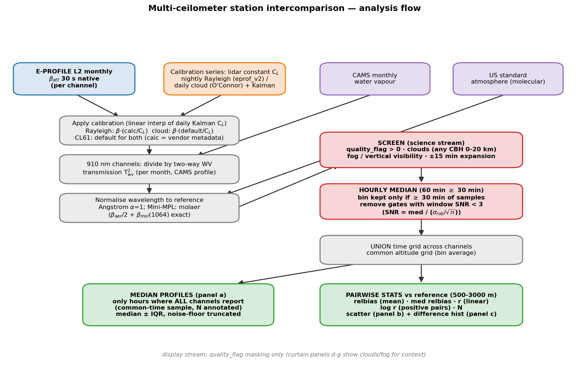
*Figure 1 — Station intercomparison flow. Blue: inputs. Orange: calibration series. Purple:
auxiliary atmospheric data. Red: the screening / averaging / detection gates (science stream).
Green: outputs. The median-profile panel uses only hours where every channel reports; the
statistics are pairwise vs the reference channel.*

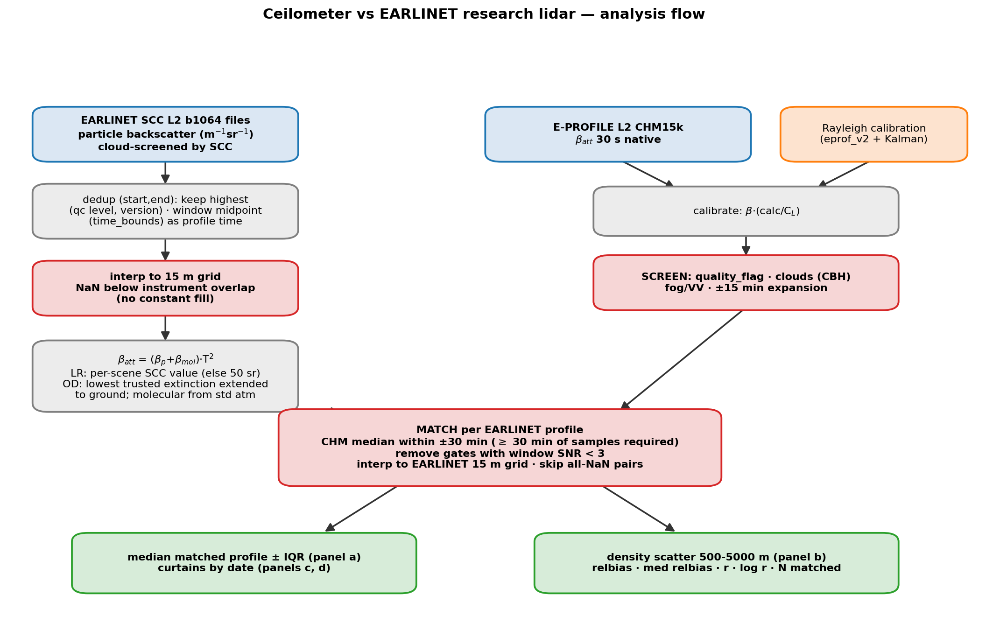
*Figure 2 — Ceilometer vs EARLINET flow. The EARLINET branch (left) converts SCC particle
backscatter to attenuated backscatter with the per-scene lidar ratio, molecular profile from the
standard atmosphere, and a two-way transmission whose below-overlap extinction is extended from
the lowest trusted gate (backscatter itself stays NaN there). The CHM branch (right) is calibrated
and screened exactly like the station intercomparison, then matched within ±30 min.*

## 4. Results

### 4.1 Main results table

Station intercomparison (vs the station reference, 500–3000 m AGL, screened + gated; the robust
pair **med relbias / log r** is the headline):

| station | channel (calibration) | med relbias | log r | relbias (mean) | r (linear) | N |
|---|---|---|---|---|---|---|
| Payerne | CL31 (cloud) | +4.7 % | 0.31 | +27.1 % | 0.54 | 34 939 |
| Payerne | CL61 (cloud) | **+4.3 %** | **0.97** | −0.6 % | 0.98 | 70 739 |
| Payerne | CL61 (Rayleigh, native) | +20.9 % | 0.97 | +13.5 % | 0.99 | 70 739 |
| Payerne | **CL61 (Rayleigh, offset-corrected)** | **+16.8 %** | 0.97 | **+8.6 %** | 0.98 | 70 740 |
| Amsterdam | CHM15k B | +15.4 % | 0.97 | +23.7 % | 0.96 | 28 558 |
| Amsterdam | CHM15k C | **−2.5 %** | **0.97** | −3.5 % | 0.93 | 32 481 |
| Amsterdam | CHM15k D | **−3.3 %** | **0.97** | −1.0 % | 0.95 | 33 213 |
| Uccle | CL61 (cloud) | +27.4 % | 0.85 | +35.9 % | 0.93 | 52 817 |
| Palaiseau | CL31 (cloud) | **−1.2 %** | 0.78 | +1.8 % | 0.85 | 85 400 |
| Palaiseau | Mini-MPL (Rayleigh, 532→1064) | −36.3 % | 0.85 | −33.0 % | 0.84 | 60 965 |
| Lindenberg (L1) | CL61 (cloud) | +42.5 % | 0.96 | +28.0 % | 0.98 | 775 298 |
| Lindenberg (L1) | CL61 (Rayleigh) | +35.4 % | **0.97** | +21.1 % | 0.98 | 775 298 |
| Aosta | CL61 (cloud) | +11.0 % | **0.95** | −1.5 % | 0.98 | 81 447 |
| Aosta | CL61 (Rayleigh) | +35.4 % | 0.95 | +14.9 % | 0.98 | 81 447 |
| Camborne | CL61 (cloud) | +39.0 % | **0.96** | +19.8 % | 0.97 | 27 859 |
| Camborne | CL61 (Rayleigh) | +52.7 % | 0.96 | +31.3 % | 0.97 | 27 859 |

Ceilometer / lidar vs EARLINET (500–5000 m AGL):

| site | compared instrument | med relbias | log r | relbias (mean) | r (linear) | matched profiles |
|---|---|---|---|---|---|---|
| Palaiseau (`sir`, 1064 nm) | CHM15k (Rayleigh) | **−4.4 %** | **0.91** | −2.4 % | 0.95 | 177 |
| Magurele (`ino`, 1064 nm) | CHM15k (Rayleigh) | **+2.1 %** | **0.92** | −3.2 % | 0.30 | 625 |
| Leipzig (`ari`, 1064 nm) | CHM15k (Rayleigh) | **+5.8 %** | **0.94** | +8.6 % | 0.95 | 933 |
| Palaiseau (`sir_532`, **532 nm native**) | **Mini-MPL Trappes (Rayleigh)** | **−1.9 %** | **0.88** | −2.2 % | 0.88 | 54 |

Notes: reference channels (r = 1 by construction) are omitted. Uccle CL61 (Rayleigh) has **no
usable calibration series** in the 2026-07-02 archive (only 4 marginal nights; the unified engine
re-flagged the earlier candidates). Lindenberg has no local CL61 L2 product and is compared from
the **native L1** (β = rcs₀/C_L — the convention-free path; 18-month record, hence its large N).
Leipzig `lei` and Cabauw `cbw` have no EARLINET 1064 nm files in 2025–2026.

### 4.2 Station intercomparison figures

Each station figure has the same layout: **(a)** median ± IQR profiles over the **common hours**
where every channel reports (N in the title; a gate is drawn only where > 20 % of the profiles
contribute) — the profiles describe the same atmospheric sample; **(b)** scatter of each channel
vs the reference (500–3000 m, log-log, 6000-point subsample); **(c)** histogram of β_att
differences vs the reference; **(d–g)** curtains in the OmB style: **all data in greyscale,
only the kept gates (screening + SNR + coverage — what the statistics use) in colour**; black
dots = cloud base. Channel colours follow the general rules (CHM15k red, CL31 orange, CL51
purple, Mini-MPL green, CL61 blue = Rayleigh / dark grey = cloud; Amsterdam's four CHM15k units
use the distinct palette).

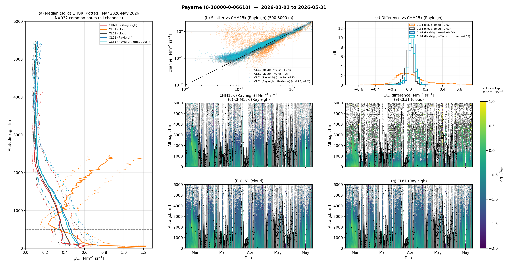
*Figure 3 — Payerne (0-20000-0-06610), Mar–May 2026. CHM15k (Rayleigh) reference. The two CL61
entries are the same instrument calibrated two ways: the cloud calibration agrees with the CHM15k
to a few % (med +4.3 %); the Rayleigh calibration is ≈ +21 % — the direct image of the ~15 %
disagreement between the two methods' lidar constants (§5.1). The CL31 tracks well in the median
(+4.7 %) but with the low correlation typical of its shallow SNR (log r 0.31).*

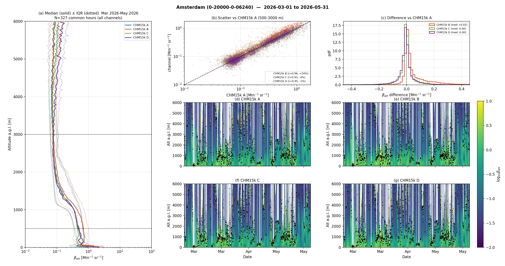
*Figure 4 — Amsterdam (0-20000-0-06240), four co-located CHM15k units, all Rayleigh-calibrated,
unit A as reference. Units C and D agree within ±3.5 %; unit B is +15–24 % — a real unit-to-unit
difference, day-dependent (§5.4).*

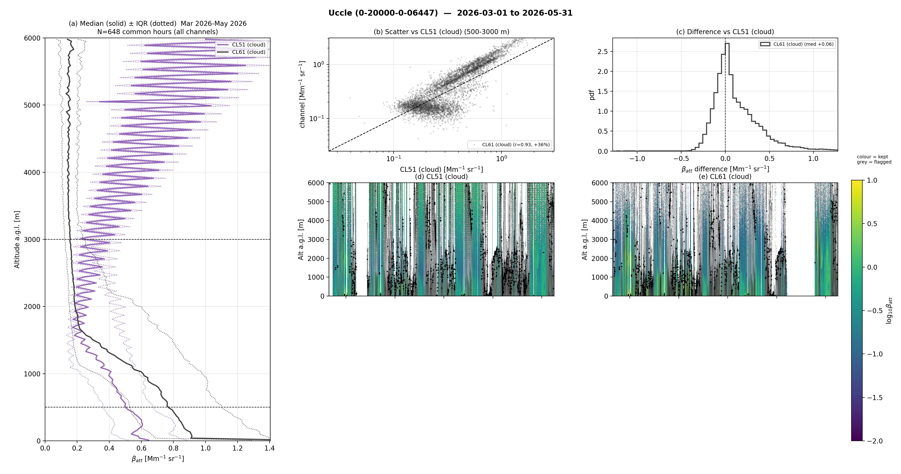
*Figure 5 — Uccle (0-20000-0-06447), Mar–May 2026. CL51 (cloud) reference — note this reference
carries the 910 nm seasonal calibration oscillation (§5.2). The CL61 (cloud) is +27 % median vs
the CL51; its Rayleigh twin has no valid series in this archive.*

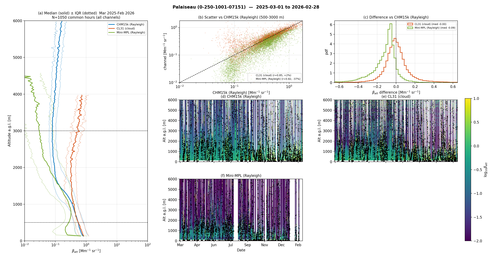
*Figure 6 — Palaiseau/SIRTA (0-250-1001-07151), Mar 2025–Feb 2026. CHM15k (Rayleigh) reference.
The CL31 (cloud) agrees to ≈ ±2 %. The Mini-MPL (green; 532 nm, molaer-converted to 1064 nm)
reads ≈ −36 % — an artefact of the ill-conditioned wavelength conversion, not of the instrument:
at native 532 nm it agrees with EARLINET to −1.9 % (Figure 13b, §5.3).*

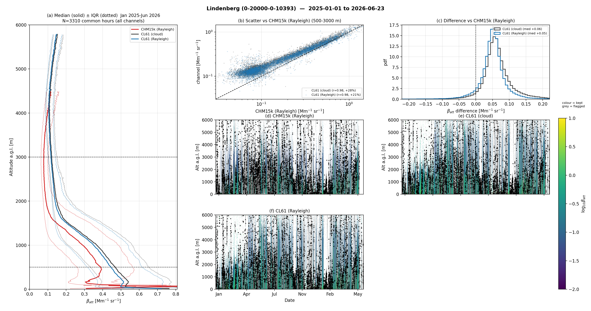
*Figure 7 — Lindenberg (0-20000-0-10393), 2025–2026, compared from the native L1 (β = rcs₀/C_L).
CHM15k reference. Both CL61 calibrations correlate at log r ≈ 0.96 with median offsets of
+35–43 %, larger at night and in winter (§5.4).*

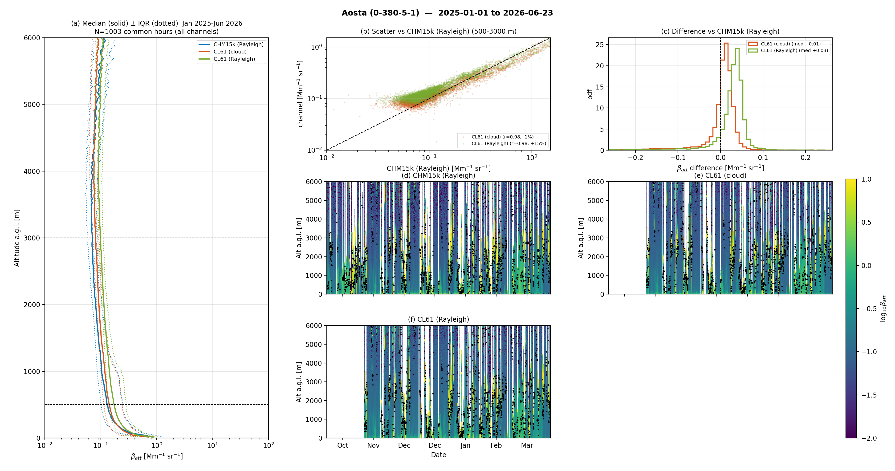
*Figure 8 — Aosta (0-380-5-1), 2025–2026. CHM15k reference. Both CL61 calibrations correlate
excellently (log r ≥ 0.95); the cloud one matches in the mean (−1.5 %) while the medians sit
+11 % (cloud) and +35 % (Rayleigh) — the offset is aerosol-regime-dependent (§5.4).*

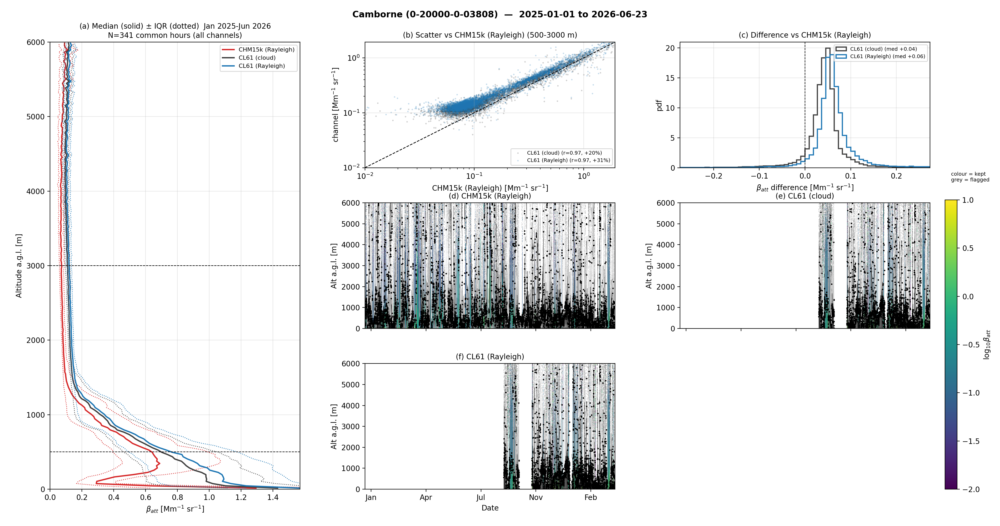
*Figure 9 — Camborne (0-20000-0-03808), 2025–2026. As Aosta with larger offsets: +39 % (cloud) /
+53 % (Rayleigh) median vs the CHM15k, log r ≈ 0.96.*

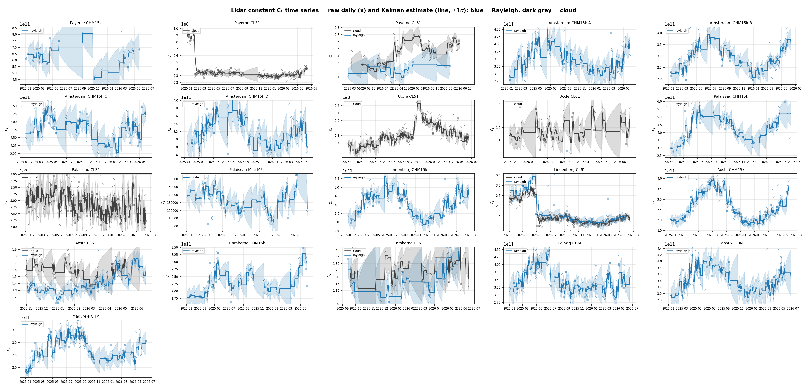
*Figure 10 — Lidar constant C_L time series for every instrument (raw nightly/daily ×, Kalman
line ± 1σ; **blue = Rayleigh, dark grey = cloud**; the CL61 panels overlay both methods on the
same axes — their vertical offset IS the method discrepancy of §5.1). Input to all comparisons.*

### 4.3 Ceilometer vs EARLINET

Layout per site: **(a)** median matched profile ± IQR (both instruments, same matched sample;
gates drawn only where > 20 % of profiles contribute; EARLINET black, CHM15k red); **(b)** density
scatter over 500–5000 m with the full metric set in the title; **(c/d)** matched curtains by date
(EARLINET blank below its overlap — excluded, not filled; the CHM curtain shows the unscreened
data in grey with only the kept gates in colour).

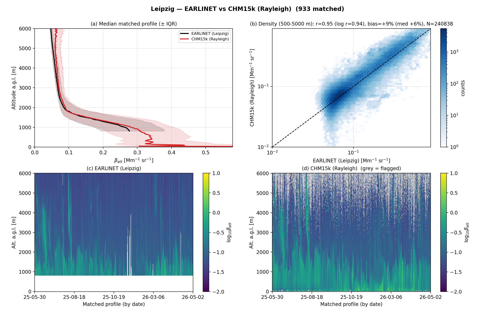
*Figure 11 — Leipzig `ari` vs CHM15k: 933 matched ≥30-min profiles, med +5.8 %, log r 0.94. The
residual off-diagonal population at low CHM values is the ceilometer's high-altitude noise floor
(≥ 3.5 km, where the true signal is purely molecular); the SNR3 gate removes two thirds of it and
the rest is kept deliberately (unbiased noise).*

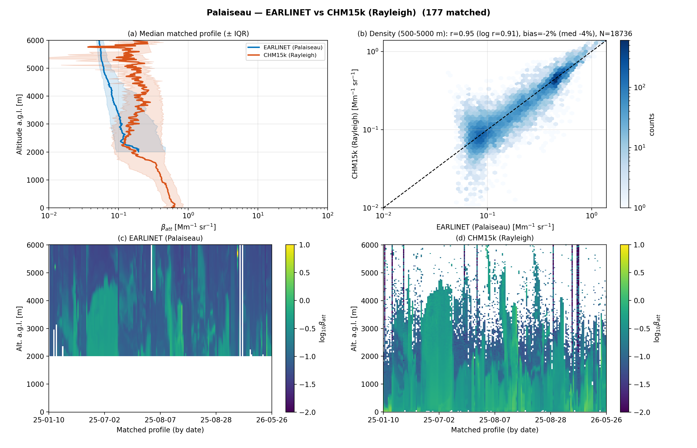
*Figure 12 — Palaiseau `sir` vs CHM15k: 177 matched profiles, med −4.4 %, log r 0.91. The 2000 m
overlap of this system limits the comparison to the free troposphere.*

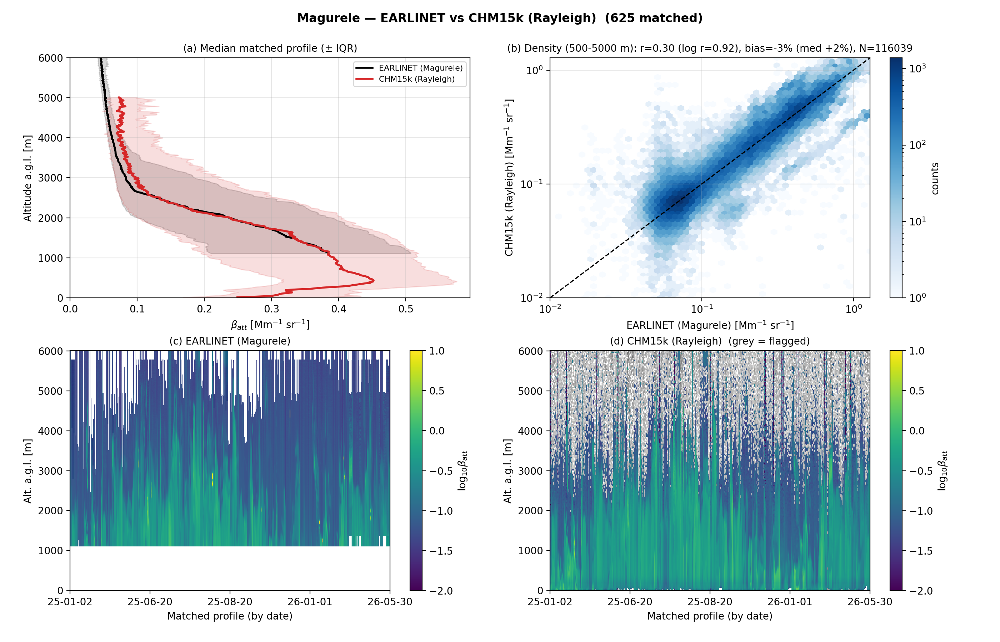
*Figure 13 — Magurele `ino` vs CHM15k: 625 matched profiles, med +2.1 %, log r 0.92. The linear r
(0.30) is dominated by a handful of strong-aerosol events and is not representative — this site is
the clearest argument for the log-space metric.*

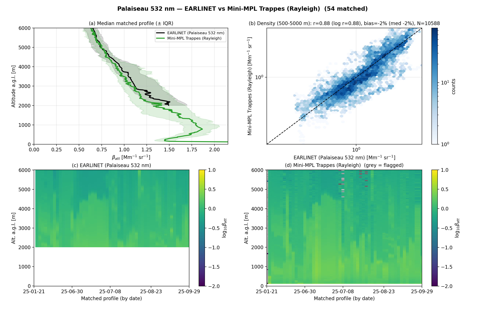
*Figure 13b — **Native 532 nm**: Mini-MPL at Trappes vs the EARLINET SIRTA 532 nm channel
(~15 km apart, no wavelength conversion involved): 54 matched profiles, med **−1.9 %**, log r
0.88. This comparison isolates the Mini-MPL 532 nm Rayleigh calibration from the 532→1064 nm
conversion — and vindicates it (§5.3).*

### 4.4 Effect of the ≥30-min / SNR3 gates

Controlled before/after (same calibrations, only the gates changed):

| case | metric | before gates | after gates |
|---|---|---|---|
| Leipzig `ari` | pairs in band | 274 222 | 254 133 (−7 %) |
| Leipzig `ari` | noise-floor tail (CHM < ½·EARLINET, β_E 0.03–0.12) | 1.0 % of pairs | 0.37 % |
| Leipzig `ari` | log r | 0.921 | 0.937 |
| Palaiseau `sir` | log r | 0.80 | 0.90 |
| Magurele `ino` | log r | 0.87 | 0.92 |
| SIRTA CL31 (cloud) | relbias / r | −20.2 % / 0.80 | +6.1 % / 0.83 |
| SIRTA Mini-MPL | relbias / r | −55.5 % / 0.80 | −32.2 % / 0.82 |
| Payerne CL31 | N (pairs) | 79 348 | 34 939 |
| EARLINET matched (`ari`) | ≥30-min EARLINET averages only | 986 | 933 (−5 %) |

The gates act exactly where intended: sub-noise ceilometer gates (CL31 daytime, Mini-MPL daytime,
all 1064 nm returns above ≈ 4 km in clean air) leave the statistics, and every remaining pair is a
≥ 30-min average on both sides. The largest interpretation change is SIRTA: roughly half of the
apparent CL31/Mini-MPL disagreement was noise, not calibration.

## 5. When can the results differ?

Each subsection names the figure it qualifies, the mechanism, and the conditions under which the
reported numbers would change.

### 5.1 CL61: the two calibration methods disagree by ~15 % on C_L (Figures 3, 7–10)

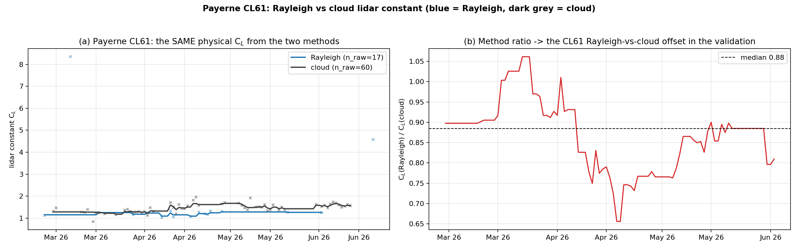
*Figure 14 — (a) Payerne CL61: the SAME physical lidar constant C_L from the two methods —
Rayleigh (blue, 17 successful nights in 99 days) vs liquid-cloud (dark grey, 60 valid days).
(b) Their ratio: median 0.88 (p10–p90 0.76–0.99).*

Both methods estimate the same physical constant, and at Payerne they agree within ~15 %:
C_L(Rayleigh) = 1.25 vs C_L(cloud) = 1.43, ratio 0.88. In β space this maps to
β_Ray/β_cloud = C_L(cloud)/C_L(Rayleigh) = **+13.9 % predicted — +13.5 % observed** in the
validation (Figure 3). The Rayleigh series is thin (the native-signal molecular fit rarely finds
an eligible window: 17/99 nights at Payerne, 4 marginal nights at Uccle → no usable series there),
so its Kalman holds a constant from sparse evidence and the ratio drifts (0.76–0.99 within one
quarter) — **the CL61 Rayleigh-vs-cloud offset will move by ±10–15 points with the analysis
period**. Across the network the CL61 sits high against the CHM15k with either method (medians:
Lindenberg +35/+43 %, Aosta +11/+35 %, Camborne +39/+53 % cloud/Rayleigh; Payerne +4/+21 %) —
larger at night and in winter (§5.4) — pointing at a CL61-vs-CHM15k spectral/unit difference
(910 vs 1064 nm aerosol conversion, α = 1 assumed) and residual WV handling rather than at one
calibration method.

**Definition note (fixed in this revision):** the CL61's L2 `calibration_constant_0` (0.50 at
Payerne, 0.93 at Uccle) is Vaisala's internal factor in a different unit system than the L1
signal the calibrations are derived on. Dividing it out (the generic Rayleigh formula) produced a
spurious −43 % for the Payerne CL61-Rayleigh in earlier drafts; the convention-free native-L1
path (β = rcs₀/C_L) gives +12.6 %, and the corrected L2 formula reproduces it (+13.5 %). All
constants are now expressed and displayed as the absolute C_L everywhere (§3.1, Figure 10).

**Root cause found and corrected (2026-07-02, see
[cl61_rayleigh_investigation.md](cl61_rayleigh_investigation.md)):** termination-hood dark
measurements on the Payerne CL61 (three covered-telescope windows, May–June 2026) reveal a
range-dependent **negative signal offset** (−0.008/−0.017/−0.027 Mm⁻¹sr⁻¹ at 3/5/8 km) that
amounts to −8…−13 % of the molecular signal at the fit windows. **Recalibrating with the measured
offset removed** moves the per-night Rayleigh constants by +4…+23 % and the median gap to the
cloud constant from **−26.5 % to −9.8 %**; in the station validation the offset-corrected CL61
Rayleigh channel reads **+8.6 % vs the CHM15k (from +13.5 % native)** — both variants are shown
in the Payerne figure and table. The remainder is quantitatively explained: the 25.5-h hood
window spans a full night and shows the offset is **×1.33 deeper at night** (−0.016 vs −0.012 at
3–6 km), so the daytime-hood correction under-corrects the night-time Rayleigh fits by exactly
the residual amount. Across the network the offset's unit-specific sign explains the
whole CL61 pattern, including Lindenberg's inverted ratio (positive, growing offset).

**Hypotheses tested and excluded for the ~15 % Rayleigh-vs-cloud C_L gap** (Payerne recalibration
experiments, 2026-07-02): (i) *water vapour is applied and essential in both methods and in the
comparison* — a 910 nm night is only calibrated when WV-correctable; at the 2.6–6 km fit windows
T²_wv ≈ 0.78, i.e. the correction already raises the Rayleigh C_L by ≈ 28 %; (ii) *the laser-line
assumption is immaterial*: recalibrating every successful night with the manufacturer wavelength
(910.55 nm) instead of the Qmini-measured one (910.74 nm) changes C_L by **+0.5 %**, and the whole
plausible (λ₀ ± 0.5 nm, FWHM 0.3–3.4 nm) envelope spans ≤ 2.4 %; (iii) *aerosol contamination of
the fit window has the wrong sign* — it would inflate C_L and bias the calibrated β low, while the
observed β is high (the eprof_v2 profile-outlier screen and aerosol gate also flag such nights);
(iv) *the assumed lidar ratio (52 sr, Klett transmission below the window) contributes only the
quoted 2σ ≈ 2–6 %* (±20 sr scan). Remaining candidates: weak-signal artefacts of the CL61 at the
high fit windows (afterpulse/baseline in the vendor β_att) and the cloud method's own scale
constants — the cloud method is anchored by its −0.6 % agreement with the independent CHM15k.
Note the MATLAB reference implementation applies **no WV correction at all** (and hard-codes
910 nm), so its historical CL61-Rayleigh constants are not comparable at the 25–30 % level.

### 5.2 910 nm cloud calibrations (Figures 5, 10) — the CL51/CL31 oscillation

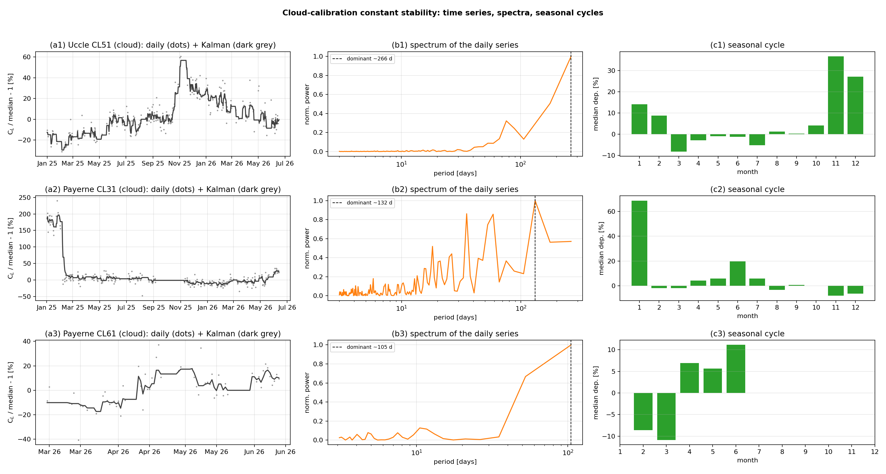
*Figure 15 — Cloud-calibration C_L stability: (a) daily departures from the series median (dots)
with the Kalman (dark grey = cloud); (b) spectrum of the daily series; (c) seasonal cycle of the
monthly median departure. Rows: Uccle CL51, Payerne CL31, Payerne CL61.*

The single-photodiode 910 nm Vaisalas oscillate strongly: **Uccle CL51 seasonal amplitude ≈ 36 %
peak-to-peak** (dominant period ≈ 267 d, deep Nov–Jan extreme) and **Payerne CL31 ≈ 38 %**
(≈ 132 d). The CL61 cloud series is markedly stabler (≈ 22 % over its shorter record).

**This residual exists although the WV correction is ON everywhere** (verified: the calibration
producing these C_L series ran with `apply_wv_correction` enabled on the complete 1° monthly CAMS,
and the comparison applies the same 1°-monthly correction with zero excluded months, §3.2).
The WV correction removes the first-order seasonal water-vapour signal — without it the
oscillation would be substantially larger and the constant biased high (cf. the historical
Payerne CL31 with/without-WV comparison: mean 1.36 vs 1.63, strongly flattened seasonality).
What remains is consistent with the **laser centre-wavelength drift with internal temperature**
across the steep 910 nm WV absorption band: the correction assumes a fixed nominal laser line
(CL31 909.7 ± 6 nm, CL51 910.0 ± 3.4 nm), so a seasonally-drifting true line leaves a seasonal
residual that the fixed-line model cannot cancel; the alignment of the C_L extremes with the
driest months supports this. A WV-transmission model conditioned on the housekeeping laser
temperature is the follow-up.

Because the daily-interpolated constant is applied to β, a perfectly-tracking calibration cancels
the oscillation in the comparison — the residual seasonal signature at SIRTA (CL31 med relbias
−20 % DJF → +6 % MAM → −12 % SON) shows the cancellation is imperfect at the weekly/monthly
scale. **Any result quoted for a 910 nm cloud-calibrated channel depends on the season sampled**;
only full-year windows (SIRTA, Lindenberg/Aosta/Camborne) average it out.

### 5.3 Palaiseau Mini-MPL (Figures 6, 13b) — the 532→1064 nm conversion is the problem, not the instrument

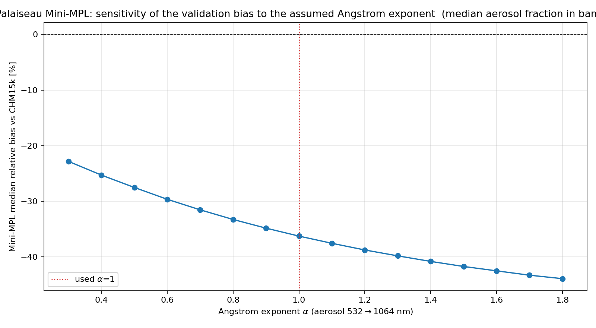
*Figure 16 — Median relative bias of the Mini-MPL vs CHM15k as a function of the assumed aerosol
Ångström exponent used in the 532→1064 nm molaer conversion.*

Three independent probes decompose the apparent ≈ −40 % Mini-MPL offset:

1. **The instrument and its 532 nm Rayleigh calibration are good.** The new native-wavelength
   comparison (Figure 13b) — Mini-MPL Trappes vs the EARLINET SIRTA 532 nm channel, no conversion
   involved — gives **med −1.9 %, log r 0.88** over 54 matched nights (2–5 km).
2. **A conversion physics error was found and fixed**: the molaer model subtracted the
   *unattenuated* molecular backscatter from the *attenuated* 532 nm signal; at 532 nm the
   two-way molecular transmission is ≈ 0.94 by 2.5 km (negligible at 1064 nm). Using the
   attenuated molecular profile recovered ≈ 5 points (med −41.9 % → −36.3 %).
3. **The remaining −36 % is the ill-conditioning of the conversion itself.** Above the SNR gate
   the Mini-MPL band signal is ≈ 98 % molecular, so the extracted aerosol
   β_aer = β_att(532) − β_mol·T²(532) is a small difference of two nearly-equal large numbers:
   any residual few-% error in the 532 nm scale or the molecular/transmission model is amplified
   ≈ 13× into the converted 1064 nm value (β_total(532)/(β_aer/2 + β_mol(1064)) ≈ 1.3/0.1).
   The altitude dependence proves it: med relbias is −32.6 % at 500–2000 m but **−45.3 % at
   2000–3000 m and −48.3 % at 2000–5000 m** — growing exactly where the aerosol fraction
   shrinks, the *opposite* of an overlap-loss signature (and the same amplification explains why
   no plausible Ångström exponent helps, Figure 16: α = 0.3–1.8 spans only −25 % to −50 %).

**Consequence for the paper:** the Mini-MPL should be validated at its native wavelength (the
532 nm EARLINET comparison), where it performs within a few %. A 532→1064 nm elastic conversion
by molecular subtraction is structurally unreliable in clean air — the converted comparison
measures the conversion's conditioning, not the instrument. The regime splits (−49 % day / −39 %
night; −61 % DJF / −36 % MAM) follow the same logic: cleaner scenes → smaller aerosol fraction →
larger amplification.

### 5.4 Day/night and seasonal splits — all stations

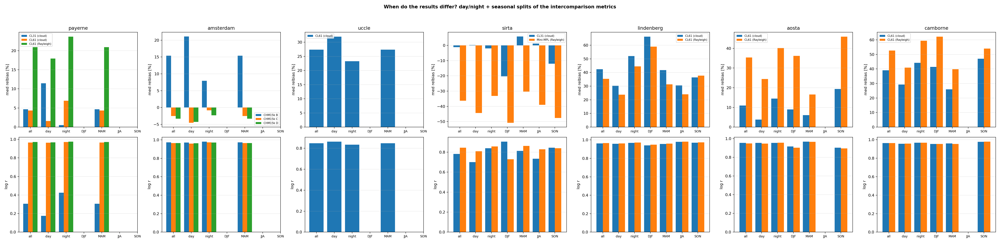
*Figure 17 — Median relative bias (top) and log r (bottom) per channel, split all/day/night and by
season. SIRTA and the L1 CL61 pairs (Lindenberg/Aosta/Camborne) span multiple seasons; the
Mar–May 2026 stations have MAM only.*

- **Daytime degrades the weak channels**: Payerne CL31 log r 0.42 night → 0.18 day (med relbias +1
  → +11 %); Amsterdam CHM15k-B is +8 % night vs +21 % day (a unit-specific daytime effect —
  background subtraction or detector temperature); Uccle CL61 +23 % night vs +32 % day; SIRTA
  Mini-MPL −39 % night → −49 % day.
- **The CL61 pairs go the other way — larger offsets at night and in winter**: Lindenberg cloud
  +30 % day → +52 % night (DJF +66 %); Aosta Rayleigh +24 % day → +40 % night; Camborne Rayleigh
  +41 % day → +59 % night (DJF +62 %). A noise effect would do the opposite; this points at the
  910→1064 nm aerosol conversion (α = 1) and WV residuals acting on the cleaner night/winter
  boundary layer where the molecular share is larger.
- **The strong channels stay correlated in every split** (log r ≥ 0.95 for all CL61 pairs and
  Amsterdam C/D) — the offsets are scale-like, not scatter.
- **Season is the largest lever** where the record allows it (SIRTA CL31 −20 % DJF → +6 % MAM,
  §5.2; Mini-MPL −61 % DJF vs −36 % MAM, §5.3; CL61 pairs ±10–25 points between seasons).

### 5.5 EARLINET comparisons (Figures 11–13)

- **Cloud screening is decisive**: without it the Leipzig comparison read +46 % / r 0.15 (clouds
  enter the CHM stream but are screened from the SCC product); with the paper screening it reads
  +5.8 % / log r 0.94. Any EARLINET-vs-ceilometer number without symmetric cloud screening is
  dominated by cloud sampling, not calibration.
- **The high-altitude noise floor** sets the residual scatter: at 1064 nm the molecular return
  drops below the CHM15k detection limit above ≈ 3.5–4 km; EARLINET's β_att is reconstructed with
  an analytic molecular component and never falls below the molecular floor. The SNR3 gate removed
  two thirds of the resulting low-CHM tail; restricting the band to 500–3000 m would remove it
  entirely (kept at 500–5000 m for altitude coverage, documented instead).
- **Linear r is event-driven** in clean sites: Magurele's r = 0.30 coexists with log r = 0.92 and
  med relbias +2.1 % — a handful of strong aerosol events dominates the linear covariance.
- **Sensitivity to the EARLINET-side assumptions is small but systematic**: the per-scene lidar
  ratio (vs fixed 50 sr) and the below-overlap OD extension change β_att aloft by ≈ 3–8 % (T²);
  both are now handled physically (§3.4, Figure 2).

## Appendix A — parameters

| parameter | value |
|---|---|
| hourly aggregation | 60 min median |
| minimum window coverage | 30 min (`MIN_AVG_S = 1800 s`) |
| SNR threshold | 3 (`SNR_MIN`), σ_rob = 1.4826·MAD, ≥5 samples |
| EARLINET match window | ±30 min |
| EARLINET minimum own average | 30 min (`time_bounds`) |
| stats band (stations / EARLINET) | 500–3000 / 500–5000 m AGL |
| cloud screen | any CBH 0–20 km + fog/VV, ±15 min expansion |
| Ångström α (aerosol) | 1.0 |
| EARLINET lidar ratio | per-scene SCC value, fallback 50 sr |
| median-profile display threshold | > 20 % of profiles must contribute per gate (≥ 10 absolute) |
| noise-floor truncation (profiles) | median ≤ 0 above zMin |
| colour rules | CHM15k/Rayleigh-reference red; CL61 blue (Rayleigh) / dark grey (cloud); Mini-MPL green; CL31 orange; CL51 purple; EARLINET black; Amsterdam multi-CHM15k: palette |
