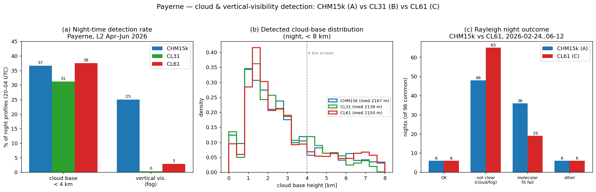

# Payerne CL61 — does cloud / vertical-visibility detection explain the Rayleigh failures?

**Question.** The Rayleigh calibration fails on most nights for the Payerne CL61 (`0-20000-0-06610`, ID **C**): only **6 of 96** nights succeed (2026-02-24 … 06-12). Since the Rayleigh calibration rejects a night when the cloud / vertical-visibility (fog) screen leaves fewer than 3 clear hours, the suspicion is that the CL61 over-reports clouds or fog versus the colocated **CHM15k (A)** and **CL31 (B)**. This note checks that.

**Data & method.** Night-time profiles (20–04 UTC) at Payerne. Detection rates from the L2-monthly product over **Apr–Jun 2026** (the period all three instruments share; the CL61 L1 archive before mid-June is no longer retained). A profile counts as *cloud* if its first cloud base is < 4 km (the screen threshold) and as *fog* if a vertical visibility is reported. The Rayleigh night outcome is taken from the operational dashboard calibration (`fullcal_l1_2026`), comparing the CHM15k and CL61 over the **same 96 nights**.

## Findings

**1. The CL61 does not over-detect clouds.** Night-time low-cloud (< 4 km) detection is essentially identical for the CL61 (**38 %**) and the CHM15k (**37 %**), and slightly *higher* than the CL31 (**31 %**) — panel (a). The detected cloud-base distributions overlap almost perfectly (median ≈ 2.1 km for all three; panel b). So the CL61 is not flagging more clouds than the colocated reference.

**2. The one clear detection difference is vertical visibility (fog).** The **CHM15k reports a vertical visibility on 25 %** of night profiles, whereas the Vaisala **CL61 reports it on only 3 %** and the **CL31 on 0.3 %** (panel a). This is a manufacturer reporting difference (the Lufft populates `vor` for haze/fog far more readily than the Vaisalas populate `vertical_visibility`); it makes the *CHM15k* the stricter instrument on fog, not the CL61.

**3. Net Rayleigh yield is the same for CL61 and CHM15k.** Over the same 96 nights **both** instruments succeed on exactly **6** (panel c). The high failure rate is therefore dominated by Payerne's genuinely cloudy late-winter/spring nights, which reject every instrument — not by a CL61-specific detection problem.

**4. The failures occur at different stages.** The CL61 trips the *clear-night* screen more often (**65** vs 48 "not a clear night"), while the CHM15k more often passes the screen and then fails the *molecular fit* (**36** vs 19). In other words, on the clear nights it reaches, the native CL61 signal actually matches the molecular reference **better** than the CHM15k, not worse.

## Conclusion

There is a real detection difference between the instruments, but it is **not** the one suspected: the CL61 detects clouds at the same rate as the CHM15k and reports fog far *less* often, so it is not over-screening the sky. The colocated CHM15k achieves the identical number of valid Rayleigh nights (6/96), confirming that the dominant cause is simply that Payerne nights are often too cloudy for a molecular calibration in this season.

The CL61's extra "not-a-clear-night" rejections (65 vs 48) are not explained by higher cloud/fog detection — the measurable Apr–Jun rates show the opposite. The most likely remaining factors are the cloudier Feb–Mar window (CL61-only; that L1 is no longer on disk to re-check) and the time-clustering of clouds relative to the 3-clear-hour / ±15-min-contamination screen. Either way, improving the Payerne CL61 Rayleigh yield is a question of **accumulating more clear nights** (and the molecular-window method on the native signal), not of fixing an over-aggressive cloud or vertical-visibility detection.
