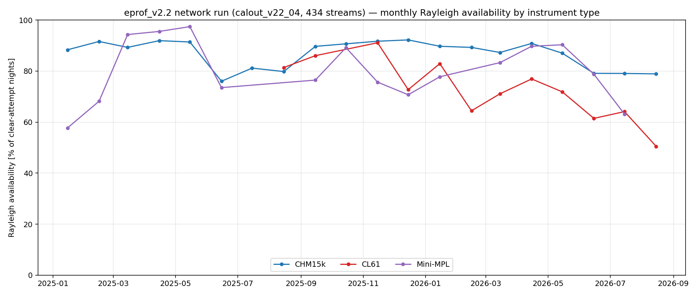
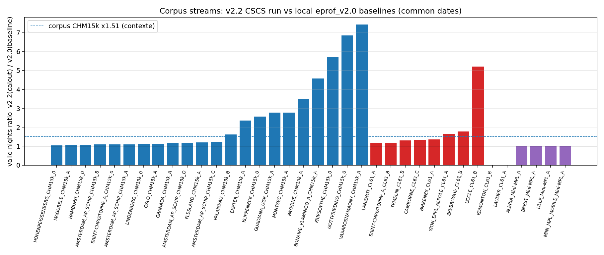
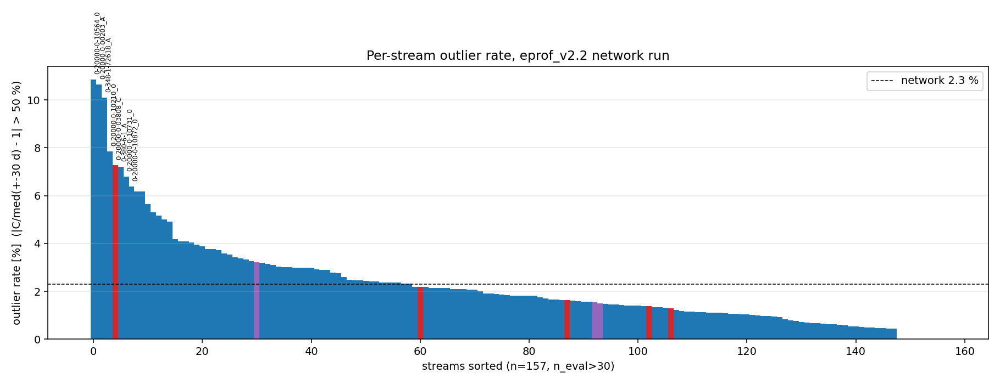
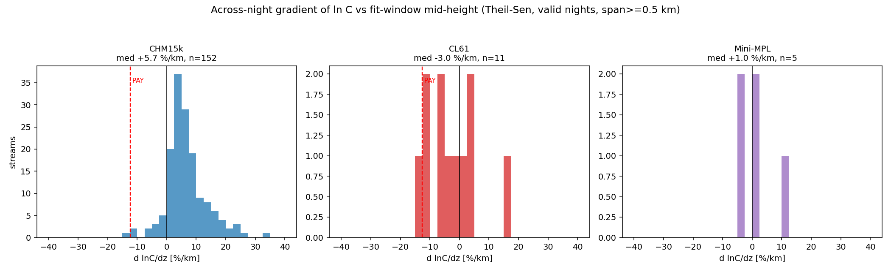
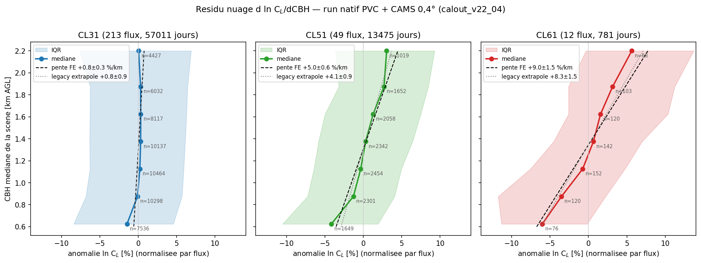
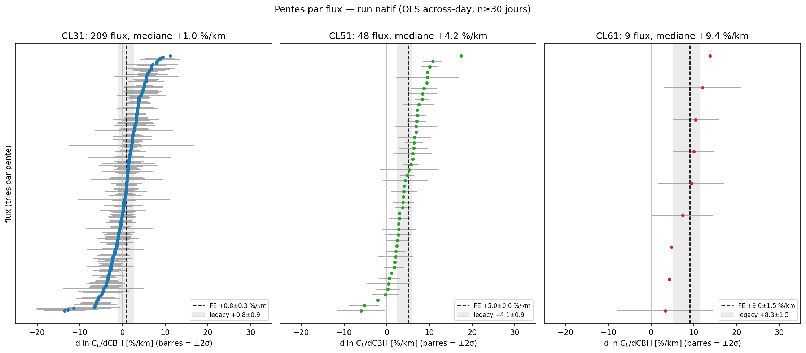
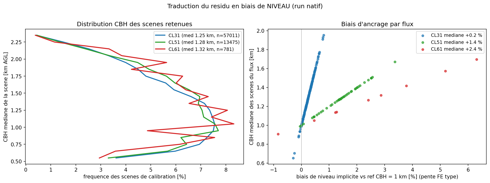
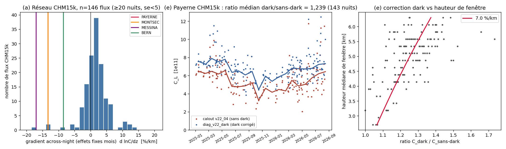
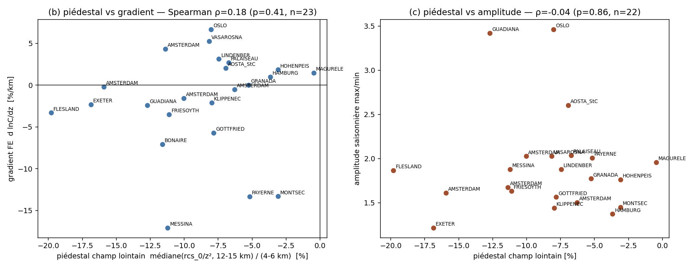

# Phase 4 — Validation réseau finale d'eprof_v2.2 (run CSCS calout_v22_04)

**Données** : run réseau complet `calout_v22_04` (CSCS balfrin), 433 flux, 2025-01-01 → 2026-08-13,
CAMS 0,4° partout (mensuels + journaliers), tables η PVC natives, **sans** correction dark
(les profils dark n'existent qu'à Payerne). Méthodes `rayleigh` (eprof_v2.2) et `cloud` ;
nuits valides = flag 1,0/0,5. CBH de scène : L1 locaux `D:/E-PROFILE_L1_2026` (428 stations
disponibles localement — l'analyse CBH couvre donc quasiment tout le réseau nuage, pas
seulement le corpus).

Tous les chiffres marqués **[vérifié]** ont été recalculés indépendamment depuis les CSV/L1
(contre-expertise complète) ; les chiffres marqués **(contexte)** proviennent d'analyses
antérieures et n'ont pas été recalculés ici.

---

## 1. Le verdict réseau en cinq lignes

1. **Accord nuage/Rayleigh CL61** : ratio Rayleigh/cloud médian 0,986, IQR 0,935–1,062 sur les
   10 flux double-méthode (contexte) — l'accord de niveau est bon *en médiane*, mais il cache un
   biais dépendant de la CBH (point 2) et le dark électronique CL61 (Payerne 0,876 → 0,98 après
   correction, contexte).
2. **Le résidu CBH du CL61 n'est PAS guéri par le run natif PVC + CAMS 0,4°** : d ln C_L/dCBH =
   +9,05 ± 1,49 %/km (n=781 jours, 12 flux, effets fixes flux) **[vérifié]**, 11/11 flux mesurables
   positifs ; l'extrapolation legacy (+8,32 ± 1,54 %/km) est confirmée en mesure directe. Le CL31
   est plat (+0,84 ± 0,25 %/km, n=57 011) ; le CL51 est franchement positif (+2,3 à +5,0 %/km
   selon l'estimateur).
3. **Les indicateurs v2.2 réseau tiennent** : disponibilité Rayleigh CHM15k 86,6 % (27 640/31 916
   nuits), gain corpus ×1,49 (attendu ×1,51, contexte), continuité CSCS-vs-local bit-identique
   (|dC/C| médian 0,000 % sur 4 522 nuits communes), outliers 2,30 %, offset des nuits récupérées
   +0,37 % médian (apparié en temps) — tous **[vérifié]**.
4. **Le problème dark CHM15k est minoritaire mais réel** : 5 flux sur 152 (~3 %) portent une
   signature « dark fort » au gradient across-night ; le proxy champ-lointain ne généralise PAS
   (résultat nul) ; la correction dark de Payerne est validée sur run indépendant (+23,9 % médian,
   n=143 nuits) **[vérifié]**.
5. **Recommandation** : déployer v2.2 en opérationnel (superset préservé à 99,5 %, aucun offset
   réseau systématique), avec trois réserves actives — correction two-pass du gradient
   across-night non déployée (elle concerne la *majorité* du réseau, signe dominant positif),
   ancrage nuage CL61 porteur d'une incertitude de niveau ~6 %, et correction dark Payerne à
   réactiver.

---

## 2. Indicateurs réseau v2.2

### 2.1 Disponibilité Rayleigh par type et par saison **[vérifié]**

Le run compte **433 flux** (le répertoire `_parts` n'est pas un flux). Le Rayleigh n'est tenté
que sur 172/433 flux : 154 CHM15k + 13 CL61 (dont EDT_B : 0 tentative → 12 contributeurs) +
5 Mini-MPL. Les **CL31 (212 flux) et CL51 (49 flux) n'ont aucune ligne Rayleigh** dans ce run
(nuage seul). Dénominateur = nuits à fit tenté (flags 1/0,5/−2/−3/−6/−9/−99) ; les −1
« not a clear night », 0 « no profiles » et −4 « no CAMS » sont exclus.

| Type | Dispo globale | n valides / n tentées | Flux | DJF | MAM | JJA | SON |
|---|---|---|---|---|---|---|---|
| CHM15k | **86,6 %** | 27 640 / 31 916 | 154 | 90,5 % (n=5 770) | 89,7 % (n=12 266) | 78,9 % (n=9 905) | 90,6 % (n=3 975) |
| CL61 | **71,4 %** | 837 / 1 173 | 12 | 74,8 % (n=159) | 74,5 % (n=451) | 62,8 % (n=452) | 88,3 % (n=111) |
| Mini-MPL | **80,6 %** | 577 / 716 | 5 | — | — | — | — |

- Le creux JJA CHM15k tient dans les deux années séparément (2025 : 78,8 %, n=5 480 ; 2026 :
  79,1 %) — c'est bien saisonnier, pas une époque. Le trou estival de v2.0 (63,5 % de rejets −2,
  contexte) est résorbé, mais l'été reste la saison la plus dure.
- Le JJA CL61 remonte à **68,4 %** (284/415) hors Lauder NZ (hiver austral, 0/37 en « JJA »).
- Rejets CHM15k restants : **−3 method disagreement 7,3 %** (2 339) > −2 gates 6,0 % (1 914) —
  le désaccord de méthode a remplacé les gates de fenêtre comme premier rejet. Sensibilité :
  compter les −4 « no CAMS » au dénominateur (209 nuits, toutes CL61) ramène le CL61 à 60,6 %.

### 2.2 Gain de disponibilité vs v2.0 (corpus, dates communes) **[vérifié]**

Comparaison aux baselines locales `base_eprof_v2_*.json` (36 flux, 7 labels tronqués ré-aliasés),
`method='rayleigh'`, valide = flag 1,0/0,5 des deux côtés.

| Type | v2.0 → v2.2 (nuits valides) | Gain | Flux |
|---|---|---|---|
| CHM15k | 2 457 → 3 667 | **×1,49** | 22 |
| CL61 | 367 → 488 | ×1,33 | 10 |
| Mini-MPL | 423 → 422 | ×1,00 | 4 |
| **Total corpus** | 3 247 → 4 577 | **×1,41** | 36 |

Le gain corpus mesuré en local (×1,51 sur 24 flux, contexte) **tient** sur le run natif. Le
Mini-MPL ne gagne rien — attendu. Les plus gros gains sont les instruments bruités :
Vasarosnamaony ×7,4, Gottfrieding ×6,9, Friesoythe ×5,7, Uccle CL61 ×5,2, Payerne ×3,5.

**Superset** : 17 nuits v2.0-valides perdues sur 3 247 dates communes (**99,48 %** préservé) —
16 sont des flips de l'écran clear-night (différence probable de copie d'archive L1 CSCS vs
locale), **une seule** est un flip de gate (Sion 2026-04-07, −3 method disagreement à 15,7 %,
seuil 15 %). Rapporté à l'ensemble des 3 291 nuits v2.0-valides du baseline (44 dates absentes
des CSV CSCS en plus) : 98,1 %.

### 2.3 Continuité CSCS (CAMS 0,4°) vs run local (cand_N2.5) **[vérifié]**

Sur **4 522 nuits communes valides** (36 flux) : |dC/C| médian **0,000 %** (précision machine
~1e-14), p99 0,15 % ; fraction même-fenêtre (bottom_height identique à 1 m) 0,97–1,00 partout.
Les deux runs sont effectivement bit-identiques sur les nuits communes — la sensibilité
CAMS-source en conditions réelles est **nulle sur C**. Elle n'apparaît que comme flips de
validité : 55 nuits valides seulement côté CSCS (dont ~27 nuits CL61 récupérées parce que le run
local manquait de CAMS journalier : Sion 9, Camborne 6, Uccle 5, Temelin 4, Lanzhot 3, en −4)
contre 37 seulement côté local (1–5 par flux, messages dominés par « No CAMS for water-vapor
correction »).

### 2.4 Outliers **[vérifié]**

Critère **local** (|C/médiane±30 j − 1| > 50 %, ≥5 voisins valides — une médiane station-vie
flaguerait des ères pré/post-step entières, leçon Guadiana) :

| Périmètre | Taux | n |
|---|---|---|
| Réseau | **2,30 %** | 662 / 28 785 nuits évaluées |
| CHM15k | 2,33 % | — |
| CL61 | 1,47 % | — |
| Mini-MPL | 1,90 % | — |

13 flux pathologiques (>5 %, n_eval>30) sur 157 : Schleiz 10,9 % (24/221), Messina 10,6 %
(5/47), Vasarosnamaony 10,1 % (20/198), Friesoythe 7,9 %, Camborne CL61 7,3 %, Rome 7,2 %,
Rheinstetten 6,8 %, Gottfrieding 6,4 %, Payerne CHM15k 6,2 % (10/162)… La queue est concentrée
dans les flux bruités/à fort gain v2.2, cohérent avec la queue basse 5,1 % des nuits récupérées
mesurée au corpus (contexte).

### 2.5 Offset des nuits récupérées vs nuits strictes **[vérifié]**

Nuits récupérées = valides calout absentes de l'ensemble valide baseline ; ratio à la médiane
des nuits strictes **appariée à ±30 j** (≥3 voisins). Médian réseau **+0,37 %**, IQR
[−7,2, +6,9] (n=27 flux) — pas d'offset systématique, cohérent avec le −1,6 % moyen du corpus
(contexte). Mais le spread par flux est de ±7–20 %, au signe cohérent avec le gradient du site :
Payerne −22,4 %, Montsec −16,2 %, Flesland −13,7 % côté négatif ; Oslo +22,4 %, Lindenberg
+15,1 % (conforme au +31 % corpus, contexte), Amsterdam A +16,9 % côté positif. La version
era-naïve (médiane brute station-vie) donne +4,6 % et un artefact Guadiana à −40,5 % (son step
réel ×2,5 à la frontière 2026) — **l'appariement temporel est obligatoire**.

### 2.6 Gradient across-night d ln C/dz **[vérifié]**

Theil-Sen sur nuits valides, hauteur = milieu de fenêtre, span ≥0,5 km. Le réseau CHM15k est
majoritairement **positif** : médian +5,7 %/km, IQR [+2,9, +9,3], 91 % de pentes positives
(n=152 flux) ; 57 % des flux dépassent |5 %/km| et 24 % |10 %/km|. **Payerne est un site
extrême** : CHM15k A −12,4 %/km [−17,2, −7,5] (162 nuits, span 3,6 km) = 1er percentile du
réseau ; CL61 C −12,6 %/km [−17,2, −8,4] (46 nuits) = le plus négatif des 11 CL61 (médian CL61
−3,0). Conséquence : la correction two-pass n'est pas un correctif « pour Payerne » — elle
concerne la majorité du réseau, avec un signe dominant **opposé** à Payerne.

---

## 3. Le résidu CBH natif (PVC + 0,4°) vs legacy

Question de phase : les résidus dC/dCBH mesurés sur l'archive legacy (η Hopkin + WV 1° par
endroits) survivent-ils au run natif ? Régression ln(cal_value) sur la CBH médiane des scènes
(L1 `cloud_base_height` couche 1, fenêtre code [500, 2400] m — bornes vérifiées dans
`calibration/cloud/calibration.py:128-129` —, médiane par jour, jours nuage flag 1,0/0,5).

### 3.1 CL61 : le résidu PERSISTE **[vérifié]**

| Estimateur | Pente (%/km) | n |
|---|---|---|
| Effets fixes flux (bootstrap groupé) | **+9,05 ± 1,49** | 781 jours, 12 flux¹ |
| Effets fixes flux × mois | +7,13 ± 1,79 | 781 |
| Premières différences (paires ≤3 j) | +6,93 ± 2,74 | 605 paires |

¹ Payerne scindé à la rupture thermique du 2026-06-11 (régulation diode perdue, consigne
293,88 K → 291–322 K).

**Les 11 flux CL61 mesurables sont tous positifs** : Camborne +9,4±3,8 (n=49), Zeebrugge
+10,4±2,7 (n=51), Uccle +4,2±3,0 (n=80), Payerne pré-rupture +7,4±3,6 (n=58), Lindenberg
+12,0±4,5 (n=293), Temelin +13,8±4,2 (n=42), Ljubljana +1,1±5,1 (n=16, ns), Birkenes +10,0±2,4
(n=50), Lanzhot +4,7±2,7 (n=50), Aoste +3,3±5,6 (n=60, ns), Sion +6,8±4,6 (n=18) %/km.
Robustesse : sans Lindenberg +7,12 (n=488) ; 2025 seul +6,70 (n=340) ; 2026 seul +9,20 (n=441) ;
pondéré n_profiles +7,75. Profil binné within-flux monotone : −4,9 % (0,5–0,8 km, n=101) →
+4,4 % (2,0–2,4 km, n=68).

**Ce qui a disparu avec le 0,4° : rien de mesurable.** La valeur extrapolée legacy
(+8,32 ± 1,54 %/km) est confirmée en mesure directe ; la disparition attendue de la part
WV-1°-across-night (−1,46 %/km) n'est **pas résolvable** : différence natif−legacy
+0,7 ± 2,1 %/km. Le résidu CL61 n'était donc ni un artefact η Hopkin ni un artefact WV 1° —
il est instrumental/physique (dark électronique + aérosol résiduel dans la fenêtre, contexte).

### 3.2 CL31 plat, CL51 franchement positif **[vérifié]**

- **CL31** : +0,84 ± 0,25 %/km (n=57 011 jours, 213 flux ; médiane par flux +1,02, IQR
  −1,4..+3,3) — la mesure native confirme exactement la prédiction legacy +0,85 ± 0,87.
  Robuste au seuil n_win (5/20/60 : +0,90/+0,91/+0,88).
- **CL51** : +5,02 ± 0,58 %/km brut (n=13 475 jours, 49 flux, 44/48 flux positifs) = la valeur
  haute legacy (+4,11 ± 0,89) plutôt que le −2,14 du grand échantillon opérationnel (contexte).
  Le contrôle de composition le réduit de moitié : +2,81 ± 0,39 (flux × mois), +2,31 ± 0,40
  (premières différences). **Meilleure estimation native : +2,3 à +5,0 %/km, franchement
  positive** — le CL51 n'est pas guéri.

### 3.3 La structure sous 0,8 km — et la vraie forme au-dessus **[vérifié]**

Split effets fixes below/above 800 m + profil par bins :

| Type | Pente CBH < 0,8 km (%/km) | n | Pente CBH ≥ 0,8 km (%/km) | n |
|---|---|---|---|---|
| CL31 | **+12,88 ± 2,01** (FE×mois +13,82 ± 1,86 ; FD +13,36 ± 2,03, 3 219 paires) | 9 420 j, 203 flux | −0,19 ± 0,25 (global) | 47 585 |
| CL51 | **+19,83 ± 3,65** (FD +12,25 ± 4,02, 689 paires) | 2 072 j, 47 flux | +4,20 ± 0,64 | 11 399 |
| CL61 | +43,2 ± 28,1 — **non établi** (FD −15,6 ± 11,8, n=31 paires, signe opposé) | 98 j, 7 flux | +8,96 ± 2,31 (FD +7,63 ± 3,34) | 682 |

La contre-expertise **confirme** la concentration <0,8 km pour CL31 et CL51 (elle survit à
saison, époque matérielle, pureté des flags et seuil n_win ; universalité flotte : CL31 131/180
flux positifs, 21 significatifs >2σ contre 2 négatifs ; CL51 39/46 positifs) mais la **nuance** :

- **CL31 ≥0,8 km n'est pas exactement plat** : le −0,19 global cache +2,59 ± 0,99 %/km sur
  [0,8–1,2) km, −1,25 ± 0,35 sur [1,2–2,4), et une chute −21,0 ± 4,5 %/km sur [2,1–2,4) km
  (n=2 513 ; bin 2 300–2 400 m : −4,4 %, n=229). Le profil CL31 a une **dépression aux deux
  bords de la fenêtre** (bin 500–600 m : −2,86 % d'anomalie médiane, n=2 214) — signature d'un
  effet de fenêtre d'intégration plutôt que d'une seule physique basse-CBH.
- **Le résidu CL51 persiste au-dessus de 0,8 km** (+4,20 ± 0,64, profil monotone −4,7 %…+3,3 %
  sur 500–2 300 m) — il n'est pas confiné sous 800 m.
- **CL61 <0,8 km : trop peu de scènes (n=98)** pour établir quoi que ce soit ; le +21,2 %/km
  legacy sous 0,8 km reste non confirmé en natif. Le résidu CL61 au-dessus de 0,8 km (+8,96)
  porte l'essentiel du signal.

### 3.4 Traduction en biais de niveau (non contre-expertisé, confiance moyenne)

Pente FE type × distribution CBH réelle des scènes par flux (`level_bias.csv` +
`fe_results.json`, `rayleigh_availability/cbh_native/`) :

| Type | Biais différentiel inter-site (std) | Biais absolu si vérité = scènes basses (0,625 km) |
|---|---|---|
| CL31 | 0,18 % | +0,55 % médian [0,0..+1,1] |
| CL51 | 0,74 % | +3,29 % [+1,8..+5,3] |
| CL61 | **2,29 %** (P10–P90 −2,3..+2,9) | **+5,80 %** [+2,6..+9,7] |

La distribution CBH des scènes est quasi identique entre types (médiane 1,25–1,32 km, 17 % des
scènes <800 m) : les écarts de biais viennent de la pente, pas de la climatologie. **C'est le
chiffre qui borne l'ancrage nuage** : pour le CL61 l'ancrage nuage porte une incertitude de
niveau ~6 % (absolue) et ±2,3 % (site à site) ; pour le CL31 il est sûr à mieux que 1 %.

---

## 4. Généralisation dark CHM15k : quels flux, quel proxy, quelle recommandation

### 4.1 La correction dark de Payerne tient sur run indépendant **[vérifié]**

Comparaison `calout_v22_04/0-20000-0-06610_A` (sans dark) vs `diag_v22_dark` (avec dark),
nuits Rayleigh appariées par date, 2025-01..2026-08 :

- Ratio dark/sans-dark médian **1,239** (+23,9 %), IQR [1,169 ; 1,329], n=143 nuits communes.
- Dépendance en hauteur confirmée : ln(ratio) vs hauteur médiane **+7,0 ± 0,8 %/km** (à fenêtre
  strictement identique : +5,67 ± 0,59, n=26 ; en effets fixes mois : +7,60 ± 0,72).
- Gradient across-night : −11,49 ± 2,80 %/km (n=162) → **−3,59 ± 1,57 %/km** (n=186) ; en effets
  fixes mois −13,61 ± 2,52 → −6,05 ± 1,44. Sur les 143 nuits communes (composition contrôlée) :
  −10,48 ± 2,68 → −2,54 ± 1,87.
- Amplitude saisonnière (max/min des médianes mensuelles) 2,01 → 1,77.
- Disponibilité 162 → **186** nuits valides (+43 récupérées : 18 « No molecular window passed
  the validity gates » + 25 « Method disagreement » ; −19 perdues, toutes en method disagreement).

La correction vaut **+24 % de niveau et +24 nuits/an** à Payerne, et elle redresse le gradient.

### 4.2 Étendue réseau probable **[vérifié]**

Gradient across-night ln(cal_value) vs hauteur de fenêtre, 152 flux CHM15k avec n≥20 nuits :
médiane brute +5,61 %/km (IQR +2,74/+8,74) ; en effets fixes **année-mois** (le libellé « mois
calendaire » de l'analyse initiale était inexact — le FE année-mois est un meilleur contrôle,
absorbant aussi les époques matérielles) médiane **+1,66 %/km** (IQR −0,33/+3,57).

**5 flux « dark fort » robustes** (~3 % du réseau) :

| Flux | Pente FE (%/km) | n nuits |
|---|---|---|
| Messina | −16,6 ± 5,1 | 51 |
| Payerne (après mai-2025)² | −20,7 ± 3,1 | 124 |
| Montsec | −13,3 ± 1,5 | 175 |
| Bern | −8,4 ± 2,0 | 118 |
| Twenthe | −6,5 ± 1,3 | 145 |

² Par époque : +0,4 ± 3,1 avant mai-2025 (n=38) / −20,7 ± 3,1 après — coïncide avec le swap du
module TUB140016. Le −13,3 mélangé (n=162) ne décrit aucune époque. **Gottfrieding est retiré**
de la liste initiale : −5,8 ± 2,0 en flags 1,0+0,5 mais +0,06 %/km en flag 1,0 seul (n=68).
Cas limites : Assendelft −2,7 ± 1,1, De Bilt −2,1 ± 1,0 (faibles mais >2σ) ; Bonaire non
significatif en FE (−7,8 ± 7,1, n=33, 2 mois). Bilan à 2σ : 8/150 significativement négatifs,
50/150 significativement positifs (le confondant positif médian +1,7 %/km peut masquer un dark
modéré par compensation → **plancher de détection ~4 %/km**). Exclus comme artefacts qualité :
Plovdiv, Eriswil (sauts d'échelle cal_value ~1e12).

### 4.3 Le proxy champ-lointain ne généralise PAS (résultat nul, confiance haute)

Résidu champ-lointain (médiane rcs_0/z² à 12–15 km rapportée au signal 4–6 km, nuits claires,
minuit solaire ±2,5 h ; 850 nuits, 23 flux corpus + Messina) : **aucune** corrélation avec le
gradient FE (Spearman ρ=0,18, p=0,41, n=23) ni avec l'amplitude saisonnière (ρ=−0,04, p=0,86,
n=22), et tous les flux sont négatifs (médiane ~−8 %, plage −0,5 à −19,8 %) — la soustraction
firmware du fond absorbe le piédestal. Payerne (−5,2 %) est au *milieu* de la distribution alors
qu'il a le 2e pire gradient. Un métrique de forme testé sur 3 flux « mauvais » vs 3 « sains »
ne sépare pas non plus. L'amplitude saisonnière n'est pas non plus un discriminant : réseau
médiane 1,67 (IQR 1,51–1,95, n=146 flux), Payerne (2,01) n'est que 32e/146, et la corrélation
avec le gradient est de signe **contraire** à la prédiction dark (ρ=+0,29, p=4e-4) —
transparence/aérosol saisonniers et dérives instrumentales dominent.

### 4.4 Recommandation opérationnelle dark

1. **Réactiver la correction dark de Payerne** dans tout run opérationnel (+24 %, +24 nuits/an,
   mécanisme et remède confirmés sur run indépendant).
2. **Campagne de capots CIBLÉE** sur les candidats — Montsec et Bern (tous deux proches),
   Messina, Twenthe, Bonaire à confirmer — plutôt que réseau entier.
3. **Abandonner** l'idée « champ lointain en routine » dans sa forme simple (réfutée en 4.3) au
   profit du **gradient across-night FE année-mois** comme indicateur de surveillance dashboard.
4. Les petits piédestaux (<~4 %/km d'effet) restent indétectables par ces signatures indirectes :
   seule la mesure au capot tranche.

---

## 5. Recommandation de déploiement v2.2 et actions ouvertes

### 5.1 Recommandation

**Déployer eprof_v2.2 en opérationnel.** Le dossier de validation est complet :

- superset de v2.0 préservé à 99,5 % (17/3 247, dont un seul vrai flip de gate) **[vérifié]** ;
- gain de disponibilité ×1,41 corpus / CHM15k 86,6 % réseau, creux JJA résorbé **[vérifié]** ;
- continuité parfaite avec le run local (bit-identique sur 4 522 nuits communes ; la source CAMS
  0,4° est neutre sur C et ne joue que sur la *disponibilité* des CL61) **[vérifié]** ;
- pas d'offset systématique des nuits récupérées (+0,37 % médian apparié) **[vérifié]** ;
- outliers 2,30 %, concentrés sur 13 flux bruités identifiés **[vérifié]**.

**Réserves actives** (à porter au dossier, pas bloquantes pour le déploiement Rayleigh) :

1. Les nuits récupérées portent un spread par flux de ±7–20 % au signe du gradient du site : la
   correction **two-pass altitude** (seule route avec évidence, contexte) reste à implémenter —
   et elle concerne 91 % du réseau CHM15k (signe positif dominant), pas seulement Payerne.
2. **L'ancrage nuage CL61 porte ~6 % d'incertitude absolue de niveau** et ±2,3 % site-à-site
   (résidu CBH non guéri, §3.4) — ne pas utiliser le nuage CL61 comme vérité de niveau sans
   correction ou restriction de CBH ; le CL31 reste l'ancre sûre (<1 %).
3. Le CL51 garde un résidu CBH de +2,3 à +5,0 %/km ; le CL31 montre une dépression aux deux
   bords de la fenêtre CBH (mineure en niveau, 0,18 % inter-site).
4. Ce run est **sans correction dark** : Payerne CHM15k y est biaisé bas (~−24 % en haut de
   fenêtre) tant que le §4.4-1 n'est pas appliqué.

### 5.2 Actions ouvertes (file:line)

| # | Action | Ancrage code |
|---|---|---|
| 1 | Réactiver le dark Payerne en ops : produire/committer le profil (`rayleigh_availability/dark_profiles.py`) et définir `ALC_DARK_PROFILE` dans la config du run réseau ; la plomberie existe déjà | `scripts/run_network_calibration.py:321` (hook env), `calibration/rayleigh/calibration.py:300` (`_dark_on_grid`), `:818-821` (soustraction) |
| 2 | Implémenter la correction two-pass altitude (normalisation du gradient across-night) dans le fit Rayleigh — route validée par l'audit altitude, non déployée | `calibration/rayleigh/calibration.py:451` (`calibrate_rayleigh`, point d'insertion post-fenêtre) |
| 3 | Résidu CBH CL61 : décider entre restriction de gate CBH, révision η, ou correction en pente ; noter que remonter `cbh_minheight` à 800 m coûterait 17 % des scènes et ne guérit PAS le CL61 (résidu +8,96 %/km au-dessus de 800 m) | `calibration/cloud/calibration.py:128-129` (bornes CBH), `:102` (note tables η) |
| 4 | Redémarrer le Kalman aux ruptures matérielles (Payerne CL61 thermique 2026-06-11 ; swaps de modules type TUB140016) — nécessite une liste d'événements, `optical_module_id` étant vide chez Vaisala | `monitoring/kalman.py:79-100` (gestion des level steps, pas de liste d'événements) |
| 5 | Ajouter le gradient across-night FE année-mois comme indicateur de surveillance dashboard (remplace le proxy champ-lointain réfuté) | `monitoring/render.py:190` (`_load_oldray`, zone des séries station) |
| 6 | Campagne capots ciblée : Montsec, Bern, Messina, Twenthe (+ Bonaire à confirmer) — action matérielle, pas code | — |
| 7 | Élucider CL61 EDT_B : 0 tentative Rayleigh sur tout le run (seul flux CL61 muet) | CSV `calout_v22_04/` correspondant |
| 8 | Documenter la scission Payerne CHM15k par époque (swap module mai-2025) dans le suivi — le gradient mélangé (−13,3) ne décrit aucune époque | liste d'événements de l'action 4 |

---

*Figures : `doc/reports/figs_altitude_audit/` (net_v22_*.png, cbh_residual_native_*.png,
chm_network_gradient_payerne_dark.png, chm_farfield_vs_gradient.png). Données intermédiaires :
`rayleigh_availability/cbh_native/` (fe_results.json, level_bias.csv) et le scratchpad de
session (angle2_results.json, a3chm/*.csv).*
