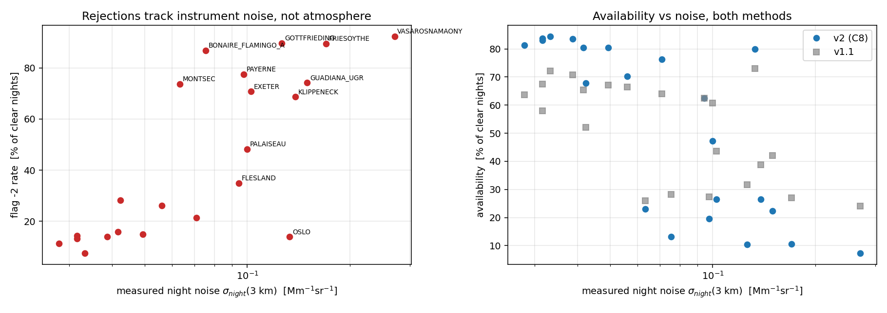
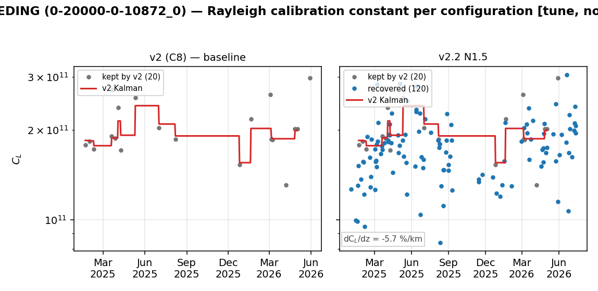
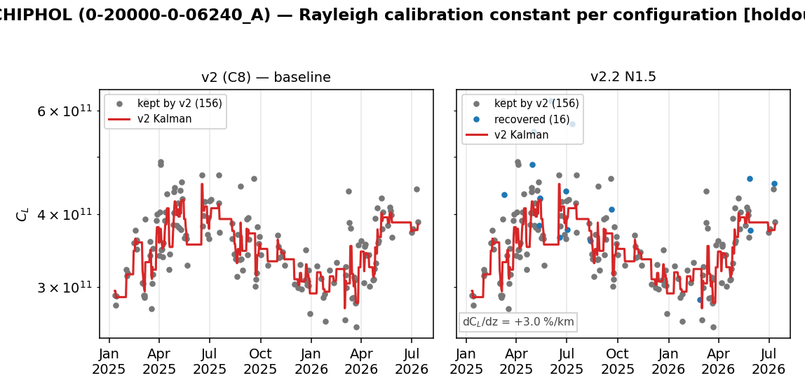
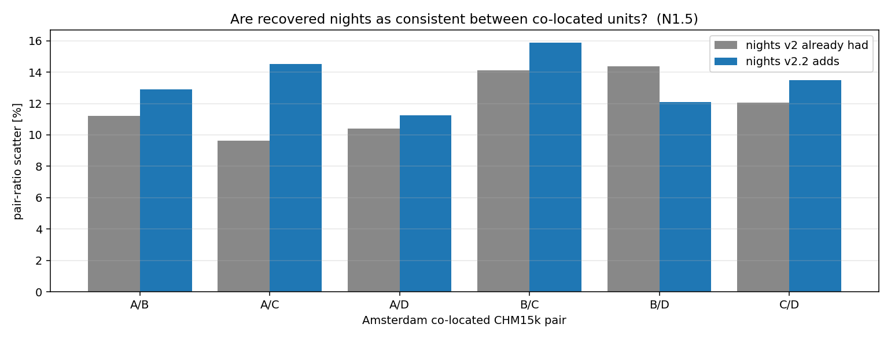
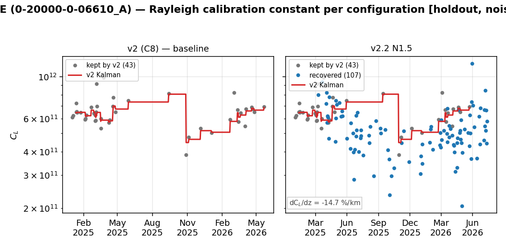
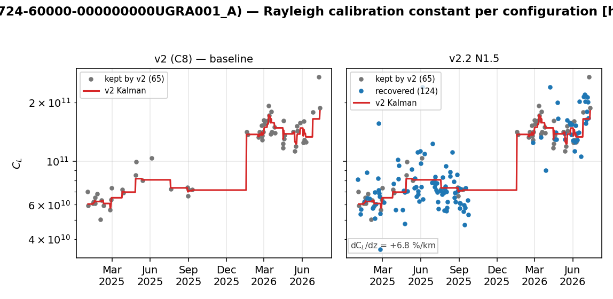

# CHM15k Rayleigh calibration — availability study

*Branch `rayleigh-availability`, generated 2026-08-14 15:43. Candidate: **`eprof_v2.2` / N1.5**. Every number below is recomputed from the run outputs by `rayleigh_availability/make_report.py`.*

## 1. The gates were measuring instrument age, not atmosphere

v2 rejects CHM15k nights with flag -2 ("no molecular window passed the validity gates") in proportion to how NOISY the instrument is. Four of v2's gates — `residual_pct`, `min_r2`, `ratio_std`, `temporal_cv` — are functions of SNR compared against FIXED thresholds (v1.1 has no such gates at all), so an ageing laser fails them on perfectly clean nights.

| evidence | statistic |
|---|---|
| Network, 141 CHM15k streams: flag -2 rate vs measured night noise | Spearman **+0.75** |
| Corpus, per-stream v2-minus-v1.1 availability vs noise | Spearman **-0.87** |

v2's advantage over v1.1 reverses sign with instrument condition: **+13.2 pts** on the 9 quiet instruments (sigma < 0.06) versus **-16.3 pts** on the 7 noisy ones (sigma >= 0.10). v2 is genuinely better on healthy hardware and progressively worse as the laser ages.

The failure is also strongly seasonal — a regime the C8 gate tuning (Feb-May 2026 only) never contained. Pooled over the corpus CHM15k streams, per CLEAR night (the denominator the gates actually act on):

| season | clear nights | v1.1 avail | v2 avail | v2.2 avail | v2 flag -2 | v2.2 flag -2 |
|---|---|---|---|---|---|---|
| winter | 1177 | 67.2 % | 64.4 % | **83.0 %** | 29.9 % | 4.3 % |
| shoulder | 2278 | 56.7 % | 57.2 % | **83.6 %** | 39.6 % | 6.0 % |
| summer | 1240 | 32.5 % | 34.0 % | **69.1 %** | 63.5 % | 21.0 % |

*(Winter = Nov-Feb. An earlier version of this corpus stopped at 30 September, so winter was represented by Jan/Feb alone; the table above uses the full year.)*

## 2. What `eprof_v2.2` changes

The three SNR-driven gates are replaced by their **noise-relative** forms, using a per-night photon-noise profile measured from consecutive-profile differences on the NATIVE resolution (before the L2-grid binning averages it away). A window is kept when its departure from a Rayleigh shape is no larger than its OWN measured noise explains (reduced chi-square), rather than smaller than a fixed percentage.

The scattering-ratio reference is also de-biased: it was the MINIMUM over ~136 candidate windows, and a minimum-of-N is biased low by an amount that grows with noise — so a noisy night mechanically inflated every window's ratio. It is now a low percentile over windows that are individually noise-consistent. **The 1.15 threshold itself is unchanged.**

`eprof_v2.2` is a strict **superset** of `eprof_v2`: the noise-relative tier is consulted only when the strict v2 gates leave no eligible window. Every night v2 calibrates is calibrated identically — same window, same constant — so the change can only ADD nights.

**Ablation.** Re-running with the ORIGINAL min-based scattering reference isolates what each change buys (22 CHM15k streams, 4695 clear nights):

| variant | valid nights | availability |
|---|---|---|
| v2 | 2481 | 52.8 % |
| v2.2, full | 3738 | **79.6 %** |
| v2.2, raw (min-based) scattering reference | 3662 | 78.0 % |

The de-biased reference accounts for only **6 %** of the recovery (76 of 1257 nights). The effect is real but small: essentially all of the gain comes from replacing the three direct SNR gates with their noise-relative forms. The de-biasing can therefore be dropped if simplicity is preferred — it costs a second scattering array and two extra parameters.

## 3. Availability

Split by the station's C_L-vs-window-height gradient (section 4 explains why this matters). Holdout = unseen streams and 2026. **Caveat:** the band assignment itself is unreliable when taken from v2's own series -- see section 4.1 -- so this table indicates the shape of the effect, not a deployable rule.

| band (holdout) | n | availability | sigma_SD | Kalman outliers /100 |
|---|---|---|---|---|
| low-gradient (<= 8 %/km) | 12 | 49.2 -> **86.2 %** | 9.5 -> 11.2 % | 6.12 -> 6.46 |
| high-gradient (> 8 %/km) | 9 | 79.6 -> **87.8 %** | 9.2 -> 9.2 % | 10.53 -> 9.33 |

Gottfrieding is the case that matters most: v2 produced **19 nights in 18 months**, so the operational Kalman was effectively interpolating a constant across month-long gaps. v2.2 adds ~115 nights, the recovered points sit ON the existing Kalman line, and sigma_SD *improves* by 40 %.

Amsterdam (already densely sampled, near-zero gradient): the recovered nights are indistinguishable from the retained ones.

## 4. Validation against independent references

Internal guards cannot see a *coherent* bias: sigma_SD, continuity and the Kalman-outlier count are all difference statistics, so a set of nights that is uniformly 25 % low but internally consistent passes all of them. Only a co-located independent instrument can detect it — which is why this section, not section 3, is the decisive one.

**Amsterdam quad** (four co-located CHM15k — same night, same atmosphere, no wavelength or water-vapour correction involved): the pair-ratio scatter on recovered nights is **1.13x** that of the nights v2 already had (three pairs better, three worse), with no systematic offset. At a near-zero-gradient site the recovery is sound.

**CHM15k vs co-located CL61** (CL61 calibrated by the independent liquid-cloud route). The offset of the recovered nights tracks the station's altitude gradient in sign and approximate magnitude — a directional, falsifiable prediction that held at two sites with gradients of OPPOSITE sign:

| site | gradient | predicted offset | observed vs CL61 |
|---|---|---|---|
| Payerne | **-14.3 %/km** | -20.6 % | **-26.5 %** |
| Lindenberg | **+7.8 %/km** | +14.9 % | **+27.9 %** |

Payerne shows the failure directly: v2.2 fills an 8-month hole in which the Kalman had been holding a flat constant, but the recovered points sit visibly below the retained ones. **A true lidar constant cannot depend on the fit altitude**, so a non-zero gradient is an unmodelled profile defect (background subtraction, overlap residual, or aerosol the molecular model does not capture) — and on nights v2 rejects, the only eligible windows are higher up, so any recovery inherits gradient x height-shift.

### 4.1 The gradient cannot be used as a pre-flight gate

The obvious safeguard — measure each station's gradient from its EXISTING v2 series and only enable the recovery where it is small — does not work, for a structural reason. v2's accepted nights are exactly the clean LOW windows, so they span too little height to fit a slope against height. Bootstrapping the gradient (90 % CI) from each source:

| station | from v2 nights | from v2.2 nights |
|---|---|---|
| Payerne | 43 n, 1439 m span, **+1.7 [-5.6, +8.4]** | 150 n, 2398 m, **-14.7 [-18.8, -10.9]** |
| Gottfrieding | 20 n, 959 m, -1.0 [-26.5, +12.6] | 140 n, 2158 m, **-5.7 [-10.9, -1.2]** |
| Vasarosnamaony | 25 n, 719 m, +5.6 [-14.0, +24.5] | 192 n, 2158 m, **+11.4 [+5.8, +17.4]** |
| Bonaire | 7 n, not computable | 33 n, 1439 m, **-12.1 [-22.0, -3.5]** |
| Guadiana | 65 n, 1439 m, +43.2 [+30.7, +56.0] | 189 n, 2398 m, **+6.8 [+1.4, +12.9]** |

Only 6 of 22 streams get a stable band assignment from the v2 series, and Payerne's reads as consistent with ZERO (+1.7 +/- 7) when the truth from the wider span is -14.7 +/- 4. Guadiana is worse than imprecise: the narrow-span estimate (+43) is simply wrong (+6.8). Where v2 does happen to span a wide height range (Amsterdam, Magurele, Aosta) the two sources agree — confirming it is the SPAN, not the method, that governs.

So the gradient is only observable once the high-altitude windows are taken, which is the very thing it was meant to gate. It has to be a second pass, not a pre-flight check.

## 5. Outliers among the recovered nights

Measured against the **local** level (median of valid nights within +/-30 days), so a genuine hardware step is not mistaken for an outlier — a station-wide median would flag a whole pre-step era, which is exactly what happens at Guadiana (its constant steps ~2.5x at the 2026 boundary; see figure).

| night origin | outside 0.6-1.67x local | rate |
|---|---|---|
| kept by v2 | 20 / 2471 | **0.8 %** |
| recovered by v2.2 | 63 / 1234 | **5.1 %** |

The recovered nights carry a materially higher local-outlier rate. The tail is **one-sided (low)**, its windows sit high, and it concentrates in the noisiest stations — i.e. it is the extreme end of the same altitude mechanism, not a separate failure mode.

## 6. Recommendation

In decreasing order of confidence:

1. **Adopt the noise-aware gates.** They are a strict superset of v2 (nothing moves or is lost), they lift availability in every season — most where it is worst (summer 34 -> 69 % of clear nights) — and the recovered nights are validated as sound at low-gradient sites by the Amsterdam inter-unit test.
2. **Deploy in TWO PASSES, not behind a pre-flight gate.** Run v2.2, then measure each station's C_L-vs-height gradient FROM ITS OWN OUTPUT (where it is tightly constrained, +/-2-5 %/km) and either correct the recovered constants back to the station's reference altitude (`C_corr = C * exp(-grad * dz)`) or flag them. Section 4.1 shows why the intuitive one-pass version is not implementable. This stays safe because v2's own nights are never touched: the worst case is that a station's recovered nights end up flagged rather than corrected.
3. **Apply a local-consistency check to recovered nights only** (reject beyond ~1.6x the local level). Verified not to clip Guadiana's real 2.5x step; restricting it to recovered nights means it can never remove a night from the existing series.

**Still open:** the altitude correction in (2) is proposed, not validated. It should be tested exactly as the gates were — against the co-located CL61 pairs, checking that the corrected recovered nights land on the same level as the retained ones at Payerne (-26.5 % today) and Lindenberg (+27.9 % today).

`options.json` still selects `eprof_v2`; nothing is deployed by this branch.

## 7. Limits and caveats

- Not every summer rejection is a noise victim: an aerosol-laden night can have *higher* SNR and still be correctly rejected. The recovery is partial by design.
- The chi-square tolerance is **inert** over the range tested (1.5-3.0 give near-identical results, differing on 4 of 36 streams); the active ingredients are the de-biased scattering reference and the noise-excess gates.
- The noise propagation from native to binned grid assumes white noise; correlated components (afterpulse, background drift) would break it, which is why `max_chi2red` is held above 1.
- The clear-night screen (flag -1) is the single largest v1-to-v2 divergence bucket and is deliberately **out of scope** here.
- Costs ~2.5x v2 per night (the native-resolution noise estimate runs on every night). Acceptable for the daily operational run; the estimate could be restricted to the fit band.
