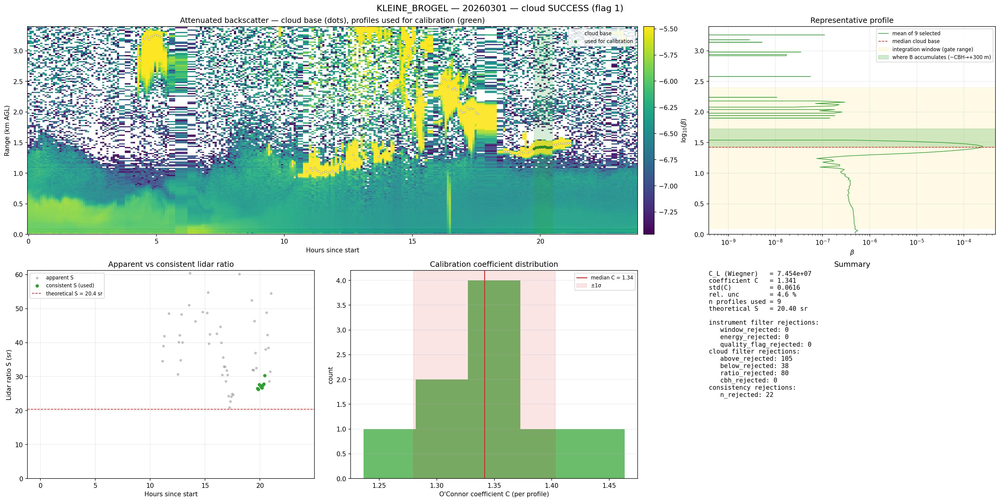
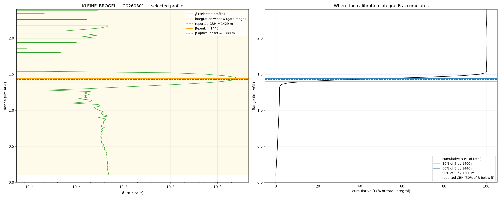
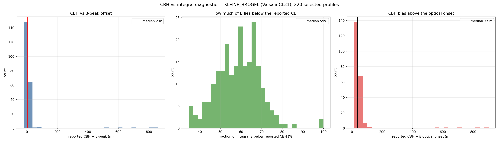

# Does the Vaisala cloud-base height bias the O'Connor cloud calibration?

**Question (F. Vogt / CBH-definition discussion).** Vaisala ceilometers do not report the *true*
cloud base: they report the height where the integrated return crosses a threshold — informally,
"where a pilot can no longer see the ground" — i.e. some optical depth *into* the cloud. On the
worked example
`1__cloud_calibration_success_(KLEINE-BROGEL_2026-03-01).png` it looked as though *the beginning
of the cloud is not being integrated*. Is that a real problem for the calibration?

**Bottom line.** No — the calibration is **robust to the CBH definition**. The O'Connor integral is
taken over a *fixed range-gate window*, not from the reported cloud base, so the lower part of the
cloud is fully captured no matter where CBH is reported. What looked wrong is the **diagnostic
annotation** (the green "where B accumulates" band), which I anchored at the reported CBH even
though ~59 % of the integral actually sits *below* it. A purely cosmetic plot fix is proposed at the
end; **no calibration code needs to change**, and per the request none was changed.

*The worked example. The green "where B accumulates (CBH→+300 m)" sub-band in the top-right profile
panel is what prompted the question: it starts at the reported cloud base and points upward, so it
looks as if the lower cloud is left out. §3 shows that ~59 % of the integral actually lies below that
line — and is fully captured by the (gold) integration window.*

---

## 1. Background — why the cloud base is ambiguous

There is no single physical definition of "cloud base", which is exactly why ceilometers from
different manufacturers disagree (Ceilinex 2015 / TECO-2016 intercomparisons).

- **WMO (CIMO Guide):** "the lowest zone in which the obscuration … causes significant changes in
  the profiles of the backscatter and extinction coefficients." Qualitative.
- **ICAO:** the height of the base of the lowest cloud layer below 6 000 m covering more than half
  the sky; *partially obscuring phenomena* are excluded — but how to decide "partially obscuring"
  is left open.
- **Vaisala algorithm (CL31/CL51/CL61):** cloud base is reported where a *running/integrated*
  function of the attenuated backscatter exceeds a detection threshold. Because it integrates, the
  reported height lands a little way *into* the cloud, above the first cloud particles.
- **Proposed quantitative definition (Spänkuch, Hellmuth & Görsdorf):** a cloud becomes visible at a
  line-of-sight optical depth of ≈ 0.03 by day / 0.05 by night — a threshold that would sit *below*
  the Vaisala-reported base.

So the concern is well founded *in general*: the reported CBH is biased high relative to the optical
onset. The question is whether the **calibration** cares.

---

## 2. How the calibration actually uses height (code facts)

The O'Connor/Hopkin calibration (`calibration/cloud/calibration.py`) computes, per profile,
`B = ∫ β dz` and `S = 1/(2B)`. Three facts matter:

1. **The integral runs over a fixed gate window, not from cloud base.**
   `calculate_lidar_ratio` integrates `β` over `[cal_minheight, cal_maxheight]` = **100–2400 m**
   (`calibration/cloud/calibration.py:1069-1090`). The reported CBH is **never** an integration
   limit. Everything between 100 m and 2400 m — including the cloud onset *below* the reported CBH —
   is integrated.
2. **The cloud filters key off the β-peak, not the reported CBH.** The peak-sharpness (±300 m) and
   the <5 % aerosol-ratio filters use `max_idx` = argmax(β) (`:1127`, `:1135-1166`).
3. **The reported CBH is used only as a coarse height gate.** Filter 4 simply rejects a profile if
   the reported CBH falls outside `[cbh_minheight, cbh_maxheight]`, and even then it falls back to
   the β-peak height when CBH is missing (`:1170-1177`). It does not move any integral bound.

This is by design and matches the published method: because a calibration-grade liquid cloud
*totally attenuates* the beam, `β` above the cloud is ≈ 0 and integrating the whole column is
equivalent to "integrating through the cloud" (Hopkin et al. 2019, Eq. 1; see §4).

---

## 3. Diagnostic — `scripts/diagnose_cbh_integration.py`

For **every profile selected for calibration** (220 profiles, KLEINE_BROGEL, Vaisala **CL31**,
March–May 2026) the script measures, within the 100–2400 m gate window:

- the reported CBH (`data.cbh`),
- the **β-peak** height (`argmax β`),
- a **β optical onset** (first gate where `β ≥ 10 %` of the peak — a proxy for the first cloud
  particles),
- the **cumulative integral** of `β` and the heights at which it reaches 10 / 50 / 90 % of the total,
- the **fraction of B that lies below the reported CBH**.

### 3.1 A representative selected profile

*Left:* the attenuated-backscatter profile. The optical onset (blue, 1380 m), the β-peak (orange,
1440 m) and the reported CBH (red dashed, 1429 m) all sit within ~60 m of one another; the gold band
is the 100–2400 m integration window. *Right:* the cumulative integral B(z). B is essentially zero
below ~1.35 km, then climbs almost vertically through the cloud: **10 % of B by 1400 m, 50 % by
1440 m, 90 % by 1500 m**. The reported CBH cuts the cloud roughly in half — about half of the
calibration signal lies **below** it — yet all of it is inside the integration window.

### 3.2 Aggregate over 220 selected profiles

| Quantity | Median | p10 → p90 |
|---|---|---|
| reported CBH − β-peak | **+2 m** | −11 → +18 m |
| reported CBH − optical onset | **+37 m** | (p90 +67 m) |
| **fraction of B below reported CBH** | **59 %** | 46 % → 70 % |

**Reading:** for this Vaisala CL31 the reported CBH sits almost exactly at the β-peak (median +2 m)
and only ~37 m (3–4 range gates) above the optical onset — a *modest* into-cloud bias, not a large
one. But because the cloud's backscatter peaks right around the reported CBH, a **median 59 % of the
calibration integral accumulates below the reported CBH**. The integral captures it because it does
not start at CBH.

---

## 4. Literature — how the method handles cloud base

All three independent implementations of this calibration integrate over a **fixed altitude window
(or the whole column), never from a detected cloud base**, and **none performs a CBH-sensitivity
analysis** — because the coefficient does not depend on CBH.

**4.1 O'Connor (2004) & Hopkin (2019) — the operational method.** Calibration equation (Hopkin 2019,
Eq. 1): `B = ∫₀^∞ β dz = 1/(2ηS)` with `S = 18.8 sr`. The integration domain is a **fixed window** —
verbatim, CL31 *"returns above 2.4 km and below 200 m are not used"*, CHM15k *1–4 km* — and the cloud
is located inside it by a **relative peak-sharpness test** (peak > 20× the value ±300 m), *not* by the
manufacturer CBH. Sub-cloud contamination is explicitly capped: aerosol below the cloud must be
**< 5 %** of the integral (10 % for the CHM15k) — this is precisely what protects the lower-cloud /
below-base region. The paper contains **no CBH-sensitivity analysis**; the only cloud-base effect it
discusses is physical *height* (detector overlap/saturation below ~500 m–1 km; the multiple-scattering
+ water-vapour annual cycle), absorbed by the fixed lower gate and a 3-month running mean. *(M. Hervo
is acknowledged in Hopkin 2019 for the ECMWF water-vapour comparison.)*

**4.2 Cloudnet / cloudnetpy.** "Cloud base" has **two unconnected** uses: **(a) calibration** = the
O'Connor integral over fixed gates + the peak test (CBH is not an input); **(b) classification** =
`categorize/droplet.py::find_liquid` detects the liquid-layer base from sharp β peaks to set the
droplet bit — it does **not** feed any calibration code. cloudnetpy itself only applies a *static,
externally supplied* `calibration_factor` (`beta_raw *= calibration_factor`); the auto-calibration
that produces it runs upstream at ACTRIS/E-PROFILE — consistent with our L1→L2 step consuming a
per-instrument `lidar_constant_0`.

**4.3 ALCF (Kuma et al. 2021).** Same physics; the calibration integral is a **whole-column sum**
(`np.sum(backscatter*dz)`, citing "O'Connor Eq. 6") with **no cloud-base anchor and no window**. ALCF
*explicitly* flags manufacturer CBH non-comparability — Mattis et al. (2016) found **up to ~70 m**
CBH differences between ALCs — and therefore runs its **own** threshold detection for its cloud
product rather than trusting firmware CBH. (Again: cloud product, not calibration.)

**4.4 What the Vaisala CBH actually is.** The CL31/CL51/CL61 cloud base is the **height of the
backscatter maximum** (Eberhard 1986), which by construction sits **inside the cloud, above the first
droplets** — it is *not* the "first significant return", and *not* a running-integral/optical-depth
threshold (that logic is Vaisala's separate *vertical-visibility* product). Reported offsets: ~400 m
in heavily polluted mid-level cloud (Wang et al. 2017) but only **tens of metres** in clean
stratocumulus; CHM15k triggers lower (ascending branch) than the Vaisala "maximum" (Martucci et al.
2010). **Our diagnostic measured exactly this independently:** reported CBH ≈ β-peak (median **+2 m**)
and ~**37 m** above the optical onset — i.e. the data confirm the Eberhard backscatter-maximum
definition, with the modest into-cloud bias the literature predicts for clean clouds.

**4.5 Why "cloud base" is ambiguous at all.** The WMO CIMO Guide (WMO-No. 8) states in writing that
the achievable CBH uncertainty is *"undetermined because no clear definition exists"* for instrumental
cloud-base height. CeiLinEx2015 (DWD Lindenberg) / TECO-2016 measured **~70 m** inter-manufacturer CBH
spread for stratus/Sc (km-scale in multi-layer cloud), with the CHM15k systematically lowest. The
quantitative proposal you cited — a cloud (hence base) defined at line-of-sight optical depth ≈ **0.03
by day / 0.05 by night** — is **Spänkuch, Hellmuth & Görsdorf, *BAMS* 103(8), E1894–E1929 (2022),
DOI 10.1175/BAMS-D-21-0032.1** *(citation correction: BAMS 2022, not Meteorol. Z. 2021; thresholds
confirmed)*.

**4.6 Verdict from the literature.** No implementation depends on CBH for the calibration, and none
reports a CBH sensitivity: an integral over a fixed window through a fully-attenuating cloud is
insensitive to where CBH is declared. The ~70 m CBH ambiguity degrades **CBH-based products**
(aviation ceiling, cloud-radiative-effect estimates), **not** the O'Connor/Hopkin calibration
constant. **Boundary condition:** this holds *only* because B is a fixed-window / whole-column
integral. An implementation that anchored its window to a detected CBH would reintroduce the
dependence and could clip the lower cloud. Our `calculate_lidar_ratio` integrates over the fixed
`[cal_minheight, cal_maxheight]` gate ([calibration.py:1069](../../calibration/cloud/calibration.py)),
so we are on the safe side.

---

## 5. Conclusion

- **The calibration is not affected by the reported-CBH bias.** The O'Connor integral spans a fixed
  100–2400 m window, so the ~59 % of B that sits below the Vaisala CBH is fully integrated. The
  reported CBH enters only as a coarse acceptance gate (Filter 4) and as a fallback to the β-peak —
  neither changes the integral.
- **What looked wrong is the diagnostic plot.** The green "where B accumulates (CBH → CBH+300 m)"
  band is anchored at the reported CBH and points *upward*, so it visually excludes the ~59 % of B
  below the CBH and overstates the contribution above it. The integral is right; the annotation is
  misleading.

## 6. Recommendation (no calibration change)

Cosmetic, diagnostic-only — the numerical calibration stays exactly as it is:

1. **Re-anchor the green band to where B physically accumulates.** Draw it from the **optical onset
   (or β-peak − ~60 m)** up to **β-peak + ~100 m**, i.e. the 10 %→90 % cumulative-B layer, instead of
   CBH → CBH+300 m. Optionally overlay the cumulative-B curve (as in §3.1, right) so the viewer sees
   that ~half of B is below the reported CBH *and that the integral still captures it*.
2. **Keep / relabel the gold band** as the integration (gate) window — it is correct.
3. **Document the CBH role** in the diagnostic caption: "reported CBH is used only as a coarse
   acceptance gate; it does not bound the integral."

Optional robustness check for the future (still no behaviour change): confirm Filter 4's
`cbh_minheight/cbh_maxheight` are wide enough that the Vaisala into-cloud bias never pushes a genuine
low cloud out of the acceptance band.

---

## References

1. **Hopkin et al. (2019)**, *AMT* 12, 4131–4147 — operational method; fixed integration window; selection filters. DOI [10.5194/amt-12-4131-2019](https://doi.org/10.5194/amt-12-4131-2019) · [PDF](https://amt.copernicus.org/articles/12/4131/2019/amt-12-4131-2019.pdf)
2. **O'Connor, Illingworth & Hogan (2004)**, *JTECH* 21, 777–786 — original autocalibration, S = 18.8 sr. [link](https://journals.ametsoc.org/view/journals/atot/21/5/1520-0426_2004_021_0777_atfaoc_2_0_co_2.xml)
3. **Kuma et al. (2021)**, *GMD* 14, 43–72 — ALCF; whole-column integral; ~70 m manufacturer CBH spread. DOI [10.5194/gmd-14-43-2021](https://doi.org/10.5194/gmd-14-43-2021)
4. **cloudnetpy** — calibration vs. classification split. [github.com/actris-cloudnet/cloudnetpy](https://github.com/actris-cloudnet/cloudnetpy)
5. **Wang et al. (2017)**, *Atmos. Res.* 202, 148–155 — Vaisala "MAN" CBH overestimate (~400 m, polluted). DOI [10.1016/j.atmosres.2017.11.021](https://doi.org/10.1016/j.atmosres.2017.11.021)
6. **Eberhard (1986)**, *JTECH* 3, 499 — CBH = backscatter-maximum definition. [ADS](https://ui.adsabs.harvard.edu/abs/1986JAtOT...3..499E/abstract)
7. **Martucci et al. (2010)**, *JTECH* 27, 305–318 — CHM15k (ascending branch) vs Vaisala (maximum) base offset. [link](https://journals.ametsoc.org/view/journals/atot/27/2/2009jtecha1326_1.xml)
8. **Kotthaus et al. (2016)**, *AMT* 9, 3769–3791 — CL31 attenuated-backscatter processing (200 m near-range cutoff). DOI [10.5194/amt-9-3769-2016](https://doi.org/10.5194/amt-9-3769-2016)
9. **WMO CIMO Guide (WMO-No. 8)** — "no clear definition exists" for instrumental CBH. [link](https://community.wmo.int/en/activity-areas/imop/cimo-guide)
10. **Wiegner et al. (2019)** / CeiLinEx2015, *AMT* 12, 471–490 — companion to the ~70 m inter-manufacturer CBH spread. DOI [10.5194/amt-12-471-2019](https://doi.org/10.5194/amt-12-471-2019)
11. **Spänkuch, Hellmuth & Görsdorf (2022)**, *BAMS* 103(8), E1894–E1929 — optical-depth CBH definition (~0.03 day / 0.05 night). DOI [10.1175/BAMS-D-21-0032.1](https://doi.org/10.1175/BAMS-D-21-0032.1)

*Reproduce:* `python scripts/diagnose_cbh_integration.py` → figures + `cbh_integration_stats.json` in
the output dir (copied here). Diagnostic run: 220 selected profiles, KLEINE_BROGEL (0-20000-0-06479,
Vaisala CL31), 2026-03 to 2026-05.
